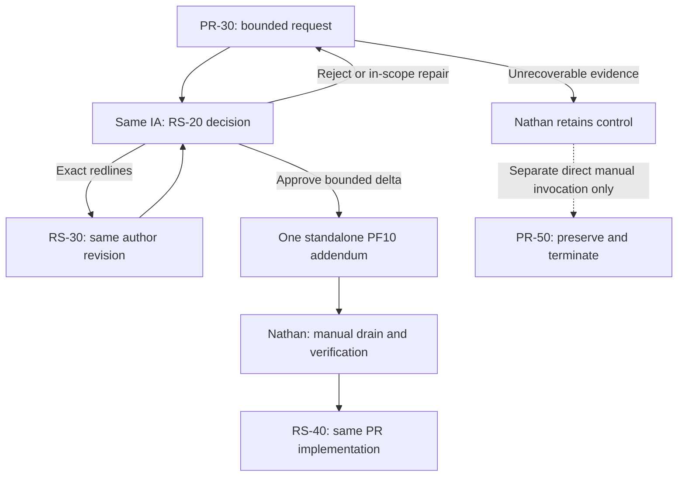

# GCFPE PF10 rescope and Alpha integrity successor contract

This is the effective contract proposed for the single successor release. The release register determines whether it is selected; this artifact does not promote or execute it. Revision 091326.2 preserves and supersedes the unselected 091326.1 draft within the same release identity. The predecessor is GCFPE-20260912.2 / 091226.3, 52 members.

Approved Plans, Guides and Specifications remain immutable in-flight bases. A qualifying native approval creates exactly one standalone PF10_BUILD_NOTES_ADDENDUM in Glow / Ephemeral Planning Files. Its metadata is READY_FOR_MANUAL_DRAIN, NON_CANONICAL_PENDING_MANUAL_DRAIN, drain_owner Nathan / Product Owner. The explicit delta overlays the base only after Nathan manually drains and verifies it. No agent edits, numbers or inserts into PF10. Denied, pending, unchanged, editorial and initial-approval outcomes produce no empty addendum.

## Decision graph



The dotted edge is Nathan's separate personal action. It is not a prompt, hub, skill, agent or automation route. PR-50 has no inbound automated edge and no continuation. PR failure does not decide abort. RS-40 performs the resumed engineering lifecycle itself with glow-hde-pr-development; SAME_PR_IMPLEMENTATION is a state, not a second PR-30 invocation.

## Complete effective paths

| Path | Ordered states or selected prompt IDs |
|---|---|
| ordinary implementation | PR-10 → PR-20 → PR-30 → NATHAN_PRODUCT_OWNER → PR-40 → QA-10 |
| normal request | PR-30 → RS-20 |
| bounded rescope rejected | RS-20 → PR-30 |
| bounded rescope revision required | RS-20 → RS-30 → RS-20 |
| bounded rescope approved | RS-20 → MANUAL_PF10_DRAIN → RS-40 → SAME_PR_IMPLEMENTATION |
| approved crd specification delta | CF-C-30 → MANUAL_PF10_DRAIN → NATIVE_DELIVERY_OWNER |
| approved epic specification delta | CF-E-30 → MANUAL_PF10_DRAIN → NATIVE_DELIVERY_OWNER |
| approved implementation plan delta | IA-30 → MANUAL_PF10_DRAIN → NATIVE_DELIVERY_OWNER |
| approved qa plan delta | QA-70 → MANUAL_PF10_DRAIN → NATIVE_DELIVERY_OWNER |
| approved escalation or remediation | ESC-30 → ESC-40 → MANUAL_PF10_DRAIN → NATIVE_DELIVERY_OWNER → ORIGINATING_VERIFICATION_OWNER |
| manual abort | NATHAN_PRODUCT_OWNER → PR-50 → TERMINAL |
| closure | QA-120 → CL-E-10 → CL-20 → CL-30 → CL-40 → TERMINAL |
| bounded non pr rescope approved | RS-20 → MANUAL_PF10_DRAIN → ORIGINAL_NATIVE_STAGE → ORIGINATING_VERIFICATION_OWNER |
| bounded non pr rescope rejected | RS-20 → ORIGINAL_NATIVE_STAGE |
| remediation open pr return | ESC-40 → MANUAL_PF10_DRAIN → PR-30 → ORIGINATING_VERIFICATION_OWNER |
| invocation blocked return | NATHAN_PRODUCT_OWNER → TERMINAL |

Ordinary implementation reaches genuine merge readiness and returns Nathan's control. PR-40 is conditional on actual manual merge and its own supplied invocation; neither this graph nor a readiness report authorizes a merge. Closure uses the appropriate Epic or CRD native acceptance branch, preserving its actual input predicates; the JSON projection names the Epic branch, while the complete member catalog retains both.

RS-10 remains optional proposal support. Normal open-PR rescope goes directly from PR-30's formal request to the same whole-change IA through RS-20. Initial planning, prepublication PR, documentation, Ops and merged-but-not-accepted findings preserve their native work-unit intake. They carry only existing evidence and resume the actual remaining native stage after drain; no future PR, result, Proceed or workspace is invented. Accepted-final work is never replayed.

ESC-40's approved REMEDIATION_REVIEW returns to the native delivery owner after drain. An already-proceeded active PR uses PR-30 under its original Proceed, with that exact review and overlay; it does not masquerade as RS-20 review for RS-40 or require duplicate approval. IA-30 retains a distinct MATERIAL_PLAN_DELTA_REVIEW mode for its own native whole-plan discoveries, never a restart of RS-20 or ESC-40. IA-40 remains initial/preapproval correction only.

Only the actual native decision owner approves a qualifying delta. Specification intent changes return Product Owner control and the native Specification author/reviewer boundary. A missing source, owner, drain, authority or recoverable workspace ends the current invocation with evidence and Nathan's recovery point, no invented continuation. Terminal invocation status does not mean work acceptance, closure or abort.

## Native qualifying approval owners

| Prompt | Qualifying decision class |
|---|---|
| [CF-C-30 — Review and Approve CRD Specification — 091326.2](https://app.notion.com/p/3da4590a05eb81d19cd5f7ffa80a5f09?pvs=204) | APPROVE_MATERIAL_DELTA_TO_ALREADY_APPROVED_CRD_SPECIFICATION |
| [CF-E-30 — Review and Approve Epic Specification — 091326.2](https://app.notion.com/p/3da4590a05eb817c918ac77bad1bfc97?pvs=204) | APPROVE_MATERIAL_DELTA_TO_ALREADY_APPROVED_EPIC_SPECIFICATION |
| [IA-30 — Review Whole-Change Implementation Plan — 091326.2](https://app.notion.com/p/3da4590a05eb81029c49c21113701638?pvs=204) | APPROVE_MATERIAL_DELTA_TO_ALREADY_APPROVED_IMPLEMENTATION_PLAN |
| [QA-70 — Review Whole-Change QA Plan — 091326.2](https://app.notion.com/p/3da4590a05eb816f8399e55ce20e4e21?pvs=204) | APPROVE_MATERIAL_DELTA_TO_ALREADY_APPROVED_QA_PLAN |
| [RS-20 — Review Bounded Work-Unit Rescope — 091326.2](https://app.notion.com/p/3da4590a05eb81d3adf1ecac218d0beb?pvs=204) | APPROVE_BOUNDED_WORK_UNIT_RESCOPE |
| [ESC-40 — Review and Return Approved Remediation — 091326.2](https://app.notion.com/p/3da4590a05eb8101bc3bd23243f1d4c5?pvs=204) | APPROVE_ESCALATION_REMEDIATION_OR_MATERIAL_WHOLE_PLAN_CHANGE |

The twelve plan/guide/specification writers are CF-C-20, CF-C-40, CF-E-20, CF-E-40, IA-10, IA-20, IA-40, PR-20, QA-20, QA-50, QA-60, QA-80. Each must reference current authoritative PF10 Markdown and applicable active addenda.

## Sources, handoffs and skills

Only uniquely resolved Markdown PFCanon sources under Glow / Core Docs / PFCanon are canonical. Google Docs, DOC and DOCX are never opened or used as fallback. Runtime off-repository artifacts are complete Markdown in Glow / Ephemeral Planning Files, uploaded and read back before their direct links are cited. Historical RCA/request/review content supplies evidence without reactivating retired routing, rejected addenda or legacy artifact identifiers.

Each concrete nonterminal result emits exactly one fenced plain-text NEXT_PROMPT_HANDOFF invocation populated with the selected destination name/version/direct Notion URL, exact receiving role/session, work IDs, direct Drive inputs, state, decisions, constraints, unresolved items, manual prerequisites, next action and expected output. Terminal outcomes emit no continuation. Reusable sources prescribe runtime population rather than guessing future artifact IDs. Static validation is not an assertion that an Alpha runtime result was generated.

glow-hde-pr-development 1.2.0 is primary for PR-30 and RS-40 engineering and interrupted recovery. glow-hde-devops 1.5.0 is support-only. Recover the existing matching workspace/worktree, branch, open PR and Drive artifacts first. Local tests precede meaningful commit or push; checkpoints are coherent and deliberate. Early draft PR follows a locally tested coherent checkpoint. Material review findings take priority over paid CI: correct locally, test, make one coherent push, then obtain current-head review and CI. Do not await, retrigger or consume stale CI during material review defects. Merge readiness grants no merge authority.

The GCFPE change-flow 3.1.0 overlay and flowmaster-validate 3.1.0 enforce this contract without changing the immutable Primary core or R1 oracle. amthor-workspace-governance-audit 1.10.0 validates the associated declarations. No execution configuration assessment or routing is added.

## Exact bindings

- Candidate catalog: [Glow HDE Complete Prompt Set — GCFPE-20260913.1 — 091326.2](https://app.notion.com/p/3da4590a05eb81bcbc5deb2d2cec4f1f?pvs=204)
- Procedure: [GCFPE-Direct-Handoff-and-Runtime-Artifact-Operating-Procedure-v3.1.0-20260913.md](https://drive.google.com/file/d/1KvX86E4yP4sGHC17tlcfCPRNavnhckEm/view?usp=drivesdk)
- PE: [PE Metaprompt 091326.2](https://app.notion.com/p/3da4590a05eb818eaa7de5413d508119?pvs=204)
- Contract source SHA-256 at candidate validation: `bb682e7d649837ba55aa047505e4aef08a64dc2e4ebe7a559be039bc6e2e145b`. The selected alias may change state metadata at promotion; behavioral content remains bound to this revision.

## Auditable machine-readable contract snapshot

```json
{
  "schema_version": "gcfpe-direct-handoff-contract/3.1",
  "contract_id": "GCFPE-PF10-INTEGRITY-20260913.1",
  "status": "CANDIDATE_VALIDATED",
  "target_release": "GCFPE-20260913.1",
  "predecessor_release": "GCFPE-20260912.2",
  "prompt_version": "091326.2",
  "selected_member_count": 54,
  "selected_prompt_ids": [
    "CF-C-10",
    "CF-C-20",
    "CF-C-30",
    "CF-C-40",
    "CF-E-10",
    "CF-E-20",
    "CF-E-30",
    "CF-E-40",
    "CF-PO-10",
    "CL-20",
    "CL-30",
    "CL-40",
    "CL-C-10",
    "CL-E-10",
    "CL-E-20",
    "CL-E-30",
    "CL-E-40",
    "DOC-10",
    "DOC-20",
    "ESC-10",
    "ESC-25",
    "ESC-30",
    "ESC-40",
    "GCFPE-MGMT-10",
    "IA-10",
    "IA-20",
    "IA-30",
    "IA-40",
    "IA-50",
    "IA-60",
    "MGR-10",
    "OPS-10",
    "OPS-20",
    "OPS-30",
    "PR-10",
    "PR-20",
    "PR-30",
    "PR-40",
    "PR-50",
    "QA-10",
    "QA-100",
    "QA-110",
    "QA-120",
    "QA-20",
    "QA-50",
    "QA-60",
    "QA-70",
    "QA-80",
    "QA-90",
    "RS-10",
    "RS-20",
    "RS-30",
    "RS-40",
    "UTIL-10"
  ],
  "analyzer_ids": [],
  "transition_contract": {
    "transport": "DIRECT_NATIVE_PROMPT_HANDOFF",
    "block": "NEXT_PROMPT_HANDOFF",
    "exactly_one_per_nonterminal_result": true,
    "terminal_has_no_handoff": true,
    "actual_pasteable_prompt": true,
    "metadata_only_prohibited": true,
    "exact_destination_notion_name_version_url": true,
    "receiving_role_session": true,
    "change_and_work_ids": true,
    "direct_drive_artifact_links": true,
    "state_decisions_constraints_unresolved": true,
    "next_action_and_expected_output": true,
    "terminal_invocation_blocker_has_no_handoff": true,
    "terminal_invocation_is_not_abort_or_closure": true
  },
  "artifact_contract": {
    "directory": "Glow / Ephemeral Planning Files",
    "folder_id": "1pRJ8R1a-p5dYQFY89a1YyJpDceYZ2MLc",
    "format": "MARKDOWN_MACHINE_READABLE",
    "returned_reference": "DIRECT_GOOGLE_DRIVE_LINK",
    "upload_readback_required": true,
    "local_scratch": "ACTIVE_WORK_ONLY",
    "opaque_library_ids_prohibited": true
  },
  "canonical_source_contract": {
    "pfcanon_authority": "CONTROLLED_MARKDOWN_ONLY",
    "missing_markdown": "SOURCE_BLOCKER",
    "google_docs_fallback": false,
    "forbidden_source_types": [
      "GOOGLE_DOCS",
      "DOC",
      "DOCX"
    ],
    "applicable_addenda": "DIRECT_DRIVE_LINKS_REQUIRED",
    "current_pf10": {
      "name": "PF10-HDE-Build-Notes-v13.1.8.md",
      "version": "13.1.8",
      "file_id": "1Qm-oszL0JfPt0TzVfQsws4hjGb9n83e6",
      "url": "https://drive.google.com/file/d/1Qm-oszL0JfPt0TzVfQsws4hjGb9n83e6/view?usp=drivesdk"
    }
  },
  "immutable_base_contract": {
    "approved_plan_guide_specification_immutable_in_flight": true,
    "overlay_scope_explicit_only": true,
    "live_rewrite_prohibited": true,
    "qualifying_change_uses_pf10_addendum": true,
    "approved_plan_remains_base": true,
    "qualifying_delta_reliance_before_manual_drain": false,
    "nonreliant_evidence_preservation_before_drain_allowed": true
  },
  "rescope_contract": {
    "boundary_prompt": "PR-30",
    "request_producer_prompt": "PR-30",
    "proposal_support_prompt": "RS-10",
    "proposal_support_mandatory_in_pr_route": false,
    "proposal_support_requires_existing_pr_context": false,
    "proposal_support_preimplementation_or_no_pr_allowed": true,
    "decision_prompt": "RS-20",
    "decision_session": "SAME_WHOLE_CHANGE_IA",
    "rejected_destination": "ORIGINAL_NATIVE_STAGE",
    "rejected_rewrites_plan": false,
    "revision_prompt": "RS-30",
    "approved_addendum_count": 1,
    "manual_drain_owner": "Nathan / Product Owner",
    "manual_drain_required_before_continuation": true,
    "continuation_prompt": "RS-40",
    "continuation_preserves": [
      "PR_SESSION",
      "WORKSPACE",
      "WORKTREE",
      "BRANCH",
      "OPEN_PR",
      "ORIGINAL_PROCEED"
    ],
    "ia30_ia40_restart": false,
    "new_proceed_required": false,
    "proposal_support_postmerge_unaccepted_allowed": true,
    "uses_existing_evidence_only": true,
    "approved_open_pr_destination": "RS-40",
    "approved_other_destination": "ORIGINAL_NATIVE_STAGE",
    "accepted_final_replay": false,
    "preserves_native_authority": true,
    "revision_same_artifact_author_decision_owner": true
  },
  "continuation_prompt": {
    "id": "RS-40",
    "name": "RS-40 — Approved Rescope — Resume PR Implementation",
    "version": "091326.2",
    "manual_drain_evidence_gate": true,
    "same_pr_only": true,
    "requires_approval_artifact": "RESCOPE_REVIEW",
    "requires_approver_prompt": "RS-20",
    "requires_existing_open_pr": true,
    "rejects_remediation_as_rescope": true,
    "notion_page_id": "3da4590a-05eb-815e-98f5-ea7b605b70a3",
    "notion_url": "https://app.notion.com/p/3da4590a05eb815e98f5ea7b605b70a3?pvs=204"
  },
  "abort_prompt": {
    "id": "PR-50",
    "name": "PR-50 — Abort PR and Escalate",
    "version": "091326.2",
    "invoker": "Nathan / Product Owner",
    "terminal": true,
    "agent_route_prohibited": true,
    "routable_by": [],
    "preserves_workspace_branch_pr_evidence": true,
    "deletes_resets_or_merges": false,
    "notion_page_id": "3da4590a-05eb-813b-b505-eea620942e30",
    "notion_url": "https://app.notion.com/p/3da4590a05eb813bb505eea620942e30?pvs=204"
  },
  "pr_development_contract": {
    "primary_skill": "glow-hde-pr-development",
    "primary_skill_revision": "1.2.0",
    "support_skill": "glow-hde-devops",
    "support_skill_revision": "1.5.0",
    "support_only": true,
    "recover_existing_work_before_create": true,
    "local_tests_before_meaningful_commit_or_push": true,
    "coherent_locally_tested_checkpoints": true,
    "early_draft_pr_after_locally_tested_checkpoint": true,
    "actionable_reviews_before_paid_ci": true,
    "do_not_wait_or_retrigger_ci_with_open_substantive_review_findings": true,
    "one_coherent_correction_push_then_current_head_review_and_ci": true,
    "required_endpoint": "MERGE_READY_FOR_PRODUCT_OWNER",
    "agent_merge_authorized": false
  },
  "pf10_addendum_contract": {
    "producer_selection": "SEMANTIC_NATIVE_APPROVAL_CAPABILITY",
    "producers": {
      "CF-C-30": "APPROVE_MATERIAL_DELTA_TO_ALREADY_APPROVED_CRD_SPECIFICATION",
      "CF-E-30": "APPROVE_MATERIAL_DELTA_TO_ALREADY_APPROVED_EPIC_SPECIFICATION",
      "IA-30": "APPROVE_MATERIAL_DELTA_TO_ALREADY_APPROVED_IMPLEMENTATION_PLAN",
      "QA-70": "APPROVE_MATERIAL_DELTA_TO_ALREADY_APPROVED_QA_PLAN",
      "RS-20": "APPROVE_BOUNDED_WORK_UNIT_RESCOPE",
      "ESC-40": "APPROVE_ESCALATION_REMEDIATION_OR_MATERIAL_WHOLE_PLAN_CHANGE"
    },
    "artifact": "PF10_BUILD_NOTES_ADDENDUM",
    "status": "READY_FOR_MANUAL_DRAIN",
    "canonicality": "NON_CANONICAL_PENDING_MANUAL_DRAIN",
    "drain_owner": "Nathan / Product Owner",
    "exactly_one_per_qualifying_approval": true,
    "manual_drain_is_canonicalization_boundary": true,
    "producer_edits_pf10": false,
    "producer_allocates_canon_number": false,
    "empty_nonqualifying_addendum": false,
    "affected_reliance_requires_verified_manual_drain": true,
    "nonreliant_evidence_preservation_before_drain": true
  },
  "plan_writer_contract": {
    "prompt_ids": [
      "CF-C-20",
      "CF-C-40",
      "CF-E-20",
      "CF-E-40",
      "IA-10",
      "IA-20",
      "IA-40",
      "PR-20",
      "QA-20",
      "QA-50",
      "QA-60",
      "QA-80"
    ],
    "current_pf10_markdown_required": true,
    "applicable_active_addenda_required": true,
    "direct_drive_links_required": true,
    "approved_base_plus_overlays": true
  },
  "route_graph": {
    "ordinary_implementation": [
      "PR-10",
      "PR-20",
      "PR-30",
      "NATHAN_PRODUCT_OWNER",
      "PR-40",
      "QA-10"
    ],
    "normal_request": [
      "PR-30",
      "RS-20"
    ],
    "bounded_rescope_rejected": [
      "RS-20",
      "PR-30"
    ],
    "bounded_rescope_revision_required": [
      "RS-20",
      "RS-30",
      "RS-20"
    ],
    "bounded_rescope_approved": [
      "RS-20",
      "MANUAL_PF10_DRAIN",
      "RS-40",
      "SAME_PR_IMPLEMENTATION"
    ],
    "approved_crd_specification_delta": [
      "CF-C-30",
      "MANUAL_PF10_DRAIN",
      "NATIVE_DELIVERY_OWNER"
    ],
    "approved_epic_specification_delta": [
      "CF-E-30",
      "MANUAL_PF10_DRAIN",
      "NATIVE_DELIVERY_OWNER"
    ],
    "approved_implementation_plan_delta": [
      "IA-30",
      "MANUAL_PF10_DRAIN",
      "NATIVE_DELIVERY_OWNER"
    ],
    "approved_qa_plan_delta": [
      "QA-70",
      "MANUAL_PF10_DRAIN",
      "NATIVE_DELIVERY_OWNER"
    ],
    "approved_escalation_or_remediation": [
      "ESC-30",
      "ESC-40",
      "MANUAL_PF10_DRAIN",
      "NATIVE_DELIVERY_OWNER",
      "ORIGINATING_VERIFICATION_OWNER"
    ],
    "manual_abort": [
      "NATHAN_PRODUCT_OWNER",
      "PR-50",
      "TERMINAL"
    ],
    "closure": [
      "QA-120",
      "CL-E-10",
      "CL-20",
      "CL-30",
      "CL-40",
      "TERMINAL"
    ],
    "bounded_non_pr_rescope_approved": [
      "RS-20",
      "MANUAL_PF10_DRAIN",
      "ORIGINAL_NATIVE_STAGE",
      "ORIGINATING_VERIFICATION_OWNER"
    ],
    "bounded_non_pr_rescope_rejected": [
      "RS-20",
      "ORIGINAL_NATIVE_STAGE"
    ],
    "remediation_open_pr_return": [
      "ESC-40",
      "MANUAL_PF10_DRAIN",
      "PR-30",
      "ORIGINATING_VERIFICATION_OWNER"
    ],
    "invocation_blocked_return": [
      "NATHAN_PRODUCT_OWNER",
      "TERMINAL"
    ]
  },
  "notion_page_manifest": {
    "RS-10": {
      "id": "3da4590a-05eb-81f9-9430-fcb7c24fe8af",
      "parent_id": "3c74590a-05eb-81f2-953d-e712f2adb6fa",
      "title": "RS-10 — Create Bounded Work-Unit Rescope Proposal — 091326.2",
      "url": "https://app.notion.com/p/3da4590a05eb81f99430fcb7c24fe8af?pvs=204",
      "version": "091326.2"
    },
    "RS-20": {
      "id": "3da4590a-05eb-81d3-adf1-ecac218d0beb",
      "parent_id": "3c74590a-05eb-81f2-953d-e712f2adb6fa",
      "title": "RS-20 — Review Bounded Work-Unit Rescope — 091326.2",
      "url": "https://app.notion.com/p/3da4590a05eb81d3adf1ecac218d0beb?pvs=204",
      "version": "091326.2"
    },
    "RS-30": {
      "id": "3da4590a-05eb-81f9-9c6d-f22213fe675e",
      "parent_id": "3c74590a-05eb-81f2-953d-e712f2adb6fa",
      "title": "RS-30 — Revise Bounded Work-Unit Rescope Proposal — 091326.2",
      "url": "https://app.notion.com/p/3da4590a05eb81f99c6df22213fe675e?pvs=204",
      "version": "091326.2"
    },
    "CF-C-10": {
      "id": "3da4590a-05eb-81bf-954d-fd72c05caa31",
      "url": "https://app.notion.com/p/3da4590a05eb81bf954dfd72c05caa31?pvs=204",
      "parent_id": "3c74590a-05eb-811d-8433-e7022629e213",
      "title": "CF-C-10 — Prepare CRD Specification Kickoff Handoff — 091326.2",
      "version": "091326.2"
    },
    "CF-C-20": {
      "id": "3da4590a-05eb-8173-a162-e1b06427c7bf",
      "url": "https://app.notion.com/p/3da4590a05eb8173a162e1b06427c7bf?pvs=204",
      "parent_id": "3c74590a-05eb-811d-8433-e7022629e213",
      "title": "CF-C-20 — Create CRD Specification — 091326.2",
      "version": "091326.2"
    },
    "CF-C-30": {
      "id": "3da4590a-05eb-81d1-9cd5-f7ffa80a5f09",
      "url": "https://app.notion.com/p/3da4590a05eb81d19cd5f7ffa80a5f09?pvs=204",
      "parent_id": "3c74590a-05eb-811d-8433-e7022629e213",
      "title": "CF-C-30 — Review and Approve CRD Specification — 091326.2",
      "version": "091326.2"
    },
    "CF-C-40": {
      "id": "3da4590a-05eb-81d1-9536-ff2d6eac93dc",
      "url": "https://app.notion.com/p/3da4590a05eb81d19536ff2d6eac93dc?pvs=204",
      "parent_id": "3c74590a-05eb-811d-8433-e7022629e213",
      "title": "CF-C-40 — Revise CRD Specification — 091326.2",
      "version": "091326.2"
    },
    "CF-E-10": {
      "id": "3da4590a-05eb-811f-927a-dfc2243861ff",
      "url": "https://app.notion.com/p/3da4590a05eb811f927adfc2243861ff?pvs=204",
      "parent_id": "3c74590a-05eb-811d-8433-e7022629e213",
      "title": "CF-E-10 — Prepare Epic Specification Kickoff Handoff — 091326.2",
      "version": "091326.2"
    },
    "CF-E-20": {
      "id": "3da4590a-05eb-81b0-84ac-de09866a52db",
      "url": "https://app.notion.com/p/3da4590a05eb81b084acde09866a52db?pvs=204",
      "parent_id": "3c74590a-05eb-811d-8433-e7022629e213",
      "title": "CF-E-20 — Create Epic Specification — 091326.2",
      "version": "091326.2"
    },
    "CF-E-30": {
      "id": "3da4590a-05eb-817c-918a-c77bad1bfc97",
      "url": "https://app.notion.com/p/3da4590a05eb817c918ac77bad1bfc97?pvs=204",
      "parent_id": "3c74590a-05eb-811d-8433-e7022629e213",
      "title": "CF-E-30 — Review and Approve Epic Specification — 091326.2",
      "version": "091326.2"
    },
    "CF-E-40": {
      "id": "3da4590a-05eb-81ba-9fca-d5e656614e30",
      "url": "https://app.notion.com/p/3da4590a05eb81ba9fcad5e656614e30?pvs=204",
      "parent_id": "3c74590a-05eb-811d-8433-e7022629e213",
      "title": "CF-E-40 — Revise Epic Specification — 091326.2",
      "version": "091326.2"
    },
    "CF-PO-10": {
      "id": "3da4590a-05eb-8175-b86c-dfc3d7fc40c7",
      "url": "https://app.notion.com/p/3da4590a05eb8175b86cdfc3d7fc40c7?pvs=204",
      "parent_id": "3c74590a-05eb-811d-8433-e7022629e213",
      "title": "CF-PO-10 — Record Product Owner Change-Class Selection — 091326.2",
      "version": "091326.2"
    },
    "CL-20": {
      "id": "3da4590a-05eb-81a2-a0c9-c98f719350a1",
      "url": "https://app.notion.com/p/3da4590a05eb81a2a0c9c98f719350a1?pvs=204",
      "parent_id": "3c74590a-05eb-811d-8433-e7022629e213",
      "title": "CL-20 — Prepare Post-Closure Drainage and Closure Memo — 091326.2",
      "version": "091326.2"
    },
    "CL-30": {
      "id": "3da4590a-05eb-818c-8f90-db54a25544b1",
      "url": "https://app.notion.com/p/3da4590a05eb818c8f90db54a25544b1?pvs=204",
      "parent_id": "3c74590a-05eb-811d-8433-e7022629e213",
      "title": "CL-30 — Prepare Conditional Post-Change ADR Maintenance — 091326.2",
      "version": "091326.2"
    },
    "CL-40": {
      "id": "3da4590a-05eb-815b-a2e2-fb45ba7d056f",
      "url": "https://app.notion.com/p/3da4590a05eb815ba2e2fb45ba7d056f?pvs=204",
      "parent_id": "3c74590a-05eb-811d-8433-e7022629e213",
      "title": "CL-40 — Scan for PF09 Gaps and CRD Candidates — 091326.2",
      "version": "091326.2"
    },
    "CL-C-10": {
      "id": "3da4590a-05eb-812b-ab7b-f770bcef9527",
      "url": "https://app.notion.com/p/3da4590a05eb812bab7bf770bcef9527?pvs=204",
      "parent_id": "3c74590a-05eb-811d-8433-e7022629e213",
      "title": "CL-C-10 — Perform CRD Retrospective and Decide Closure — 091326.2",
      "version": "091326.2"
    },
    "CL-E-10": {
      "id": "3da4590a-05eb-8177-bf3c-d7c9c7ca39f7",
      "url": "https://app.notion.com/p/3da4590a05eb8177bf3cd7c9c7ca39f7?pvs=204",
      "parent_id": "3c74590a-05eb-811d-8433-e7022629e213",
      "title": "CL-E-10 — Perform Epic Retrospective and Decide Closure — 091326.2",
      "version": "091326.2"
    },
    "CL-E-20": {
      "id": "3da4590a-05eb-8182-bc57-f512fe2fc79c",
      "url": "https://app.notion.com/p/3da4590a05eb8182bc57f512fe2fc79c?pvs=204",
      "parent_id": "3c74590a-05eb-811d-8433-e7022629e213",
      "title": "CL-E-20 — Perform Bounded PF09 Epic Revalidation — 091326.2",
      "version": "091326.2"
    },
    "CL-E-30": {
      "id": "3da4590a-05eb-8170-abed-e3b92037d246",
      "url": "https://app.notion.com/p/3da4590a05eb8170abede3b92037d246?pvs=204",
      "parent_id": "3c74590a-05eb-811d-8433-e7022629e213",
      "title": "CL-E-30 — Review Bounded PF09 Revalidation — 091326.2",
      "version": "091326.2"
    },
    "CL-E-40": {
      "id": "3da4590a-05eb-8148-a9ca-d59ae5bf98ae",
      "url": "https://app.notion.com/p/3da4590a05eb8148a9cad59ae5bf98ae?pvs=204",
      "parent_id": "3c74590a-05eb-811d-8433-e7022629e213",
      "title": "CL-E-40 — Prepare Post-Epic PF09 Maintenance — 091326.2",
      "version": "091326.2"
    },
    "MGR-10": {
      "id": "3da4590a-05eb-81c5-85d2-f70e28f1c2bf",
      "url": "https://app.notion.com/p/3da4590a05eb81c585d2f70e28f1c2bf?pvs=204",
      "parent_id": "3c74590a-05eb-811d-8433-e7022629e213",
      "title": "MGR-10 — Coordinate the Complete Change Flow within Current Authority — 091326.2",
      "version": "091326.2"
    },
    "DOC-10": {
      "id": "3da4590a-05eb-81e5-b888-c8c780244d0c",
      "url": "https://app.notion.com/p/3da4590a05eb81e5b888c8c780244d0c?pvs=204",
      "parent_id": "3c74590a-05eb-81f2-953d-e712f2adb6fa",
      "title": "DOC-10 — Create Final Repository Documentation PR Instructions — 091326.2",
      "version": "091326.2"
    },
    "DOC-20": {
      "id": "3da4590a-05eb-81a4-bf2a-d969439c8ffe",
      "url": "https://app.notion.com/p/3da4590a05eb81a4bf2ad969439c8ffe?pvs=204",
      "parent_id": "3c74590a-05eb-81f2-953d-e712f2adb6fa",
      "title": "DOC-20 — Verify Final Repository Documentation Completion — 091326.2",
      "version": "091326.2"
    },
    "IA-10": {
      "id": "3da4590a-05eb-8130-b2fc-f3993239096c",
      "url": "https://app.notion.com/p/3da4590a05eb8130b2fcf3993239096c?pvs=204",
      "parent_id": "3c74590a-05eb-81f2-953d-e712f2adb6fa",
      "title": "IA-10 — Create Whole-Change Implementation Audit and Plan — 091326.2",
      "version": "091326.2"
    },
    "IA-20": {
      "id": "3da4590a-05eb-8198-bffd-f367600ab5b3",
      "url": "https://app.notion.com/p/3da4590a05eb8198bffdf367600ab5b3?pvs=204",
      "parent_id": "3c74590a-05eb-81f2-953d-e712f2adb6fa",
      "title": "IA-20 — Create Whole-Change Implementation Plan — 091326.2",
      "version": "091326.2"
    },
    "IA-30": {
      "id": "3da4590a-05eb-8102-9c49-c21113701638",
      "url": "https://app.notion.com/p/3da4590a05eb81029c49c21113701638?pvs=204",
      "parent_id": "3c74590a-05eb-81f2-953d-e712f2adb6fa",
      "title": "IA-30 — Review Whole-Change Implementation Plan — 091326.2",
      "version": "091326.2"
    },
    "IA-40": {
      "id": "3da4590a-05eb-819d-920a-c5f14a042d08",
      "url": "https://app.notion.com/p/3da4590a05eb819d920ac5f14a042d08?pvs=204",
      "parent_id": "3c74590a-05eb-81f2-953d-e712f2adb6fa",
      "title": "IA-40 — Prepare or Revise Whole-Change Implementation Plan — 091326.2",
      "version": "091326.2"
    },
    "IA-50": {
      "id": "3da4590a-05eb-8107-a012-f68e6b8fd98c",
      "url": "https://app.notion.com/p/3da4590a05eb8107a012f68e6b8fd98c?pvs=204",
      "parent_id": "3c74590a-05eb-81f2-953d-e712f2adb6fa",
      "title": "IA-50 — IA Answer Seeder — 091326.2",
      "version": "091326.2"
    },
    "IA-60": {
      "id": "3da4590a-05eb-81f7-8afc-ca35f2dcb7db",
      "url": "https://app.notion.com/p/3da4590a05eb81f78afcca35f2dcb7db?pvs=204",
      "parent_id": "3c74590a-05eb-81f2-953d-e712f2adb6fa",
      "title": "IA-60 — Thoth Planning Research — 091326.2",
      "version": "091326.2"
    },
    "OPS-10": {
      "id": "3da4590a-05eb-8173-b6be-cbea1fd53aa6",
      "url": "https://app.notion.com/p/3da4590a05eb8173b6becbea1fd53aa6?pvs=204",
      "parent_id": "3c74590a-05eb-81f2-953d-e712f2adb6fa",
      "title": "OPS-10 — Create Bounded Ops Task — 091326.2",
      "version": "091326.2"
    },
    "OPS-20": {
      "id": "3da4590a-05eb-8137-b923-d8f5eee107aa",
      "url": "https://app.notion.com/p/3da4590a05eb8137b923d8f5eee107aa?pvs=204",
      "parent_id": "3c74590a-05eb-81f2-953d-e712f2adb6fa",
      "title": "OPS-20 — Execute Bounded Ops Task — 091326.2",
      "version": "091326.2"
    },
    "OPS-30": {
      "id": "3da4590a-05eb-8134-a4fc-e2e3f4aabf68",
      "url": "https://app.notion.com/p/3da4590a05eb8134a4fce2e3f4aabf68?pvs=204",
      "parent_id": "3c74590a-05eb-81f2-953d-e712f2adb6fa",
      "title": "OPS-30 — Review Ops Execution Receipt — 091326.2",
      "version": "091326.2"
    },
    "PR-10": {
      "id": "3da4590a-05eb-81c5-94a0-f9bf5cb151a7",
      "url": "https://app.notion.com/p/3da4590a05eb81c594a0f9bf5cb151a7?pvs=204",
      "parent_id": "3c74590a-05eb-81f2-953d-e712f2adb6fa",
      "title": "PR-10 — Create PR Work-Unit Instructions — 091326.2",
      "version": "091326.2"
    },
    "PR-20": {
      "id": "3da4590a-05eb-8147-b34c-cfabf608c2e3",
      "url": "https://app.notion.com/p/3da4590a05eb8147b34ccfabf608c2e3?pvs=204",
      "parent_id": "3c74590a-05eb-81f2-953d-e712f2adb6fa",
      "title": "PR-20 — Create Detailed PR Implementation Plan — 091326.2",
      "version": "091326.2"
    },
    "PR-30": {
      "id": "3da4590a-05eb-81c0-aee0-d0862b242e09",
      "url": "https://app.notion.com/p/3da4590a05eb81c0aee0d0862b242e09?pvs=204",
      "parent_id": "3c74590a-05eb-81f2-953d-e712f2adb6fa",
      "title": "PR-30 — PR Implementation Proceed — 091326.2",
      "version": "091326.2"
    },
    "PR-40": {
      "id": "3da4590a-05eb-813c-8b47-e77f94ff1def",
      "url": "https://app.notion.com/p/3da4590a05eb813c8b47e77f94ff1def?pvs=204",
      "parent_id": "3c74590a-05eb-81f2-953d-e712f2adb6fa",
      "title": "PR-40 — Review PR Work-Unit Lineage — 091326.2",
      "version": "091326.2"
    },
    "PR-50": {
      "id": "3da4590a-05eb-813b-b505-eea620942e30",
      "url": "https://app.notion.com/p/3da4590a05eb813bb505eea620942e30?pvs=204",
      "parent_id": "3c74590a-05eb-81f2-953d-e712f2adb6fa",
      "title": "PR-50 — Abort PR and Escalate — 091326.2",
      "version": "091326.2"
    },
    "RS-40": {
      "id": "3da4590a-05eb-815e-98f5-ea7b605b70a3",
      "url": "https://app.notion.com/p/3da4590a05eb815e98f5ea7b605b70a3?pvs=204",
      "parent_id": "3c74590a-05eb-81f2-953d-e712f2adb6fa",
      "title": "RS-40 — Approved Rescope — Resume PR Implementation — 091326.2",
      "version": "091326.2"
    },
    "ESC-10": {
      "id": "3da4590a-05eb-81dc-a03d-c24874692130",
      "url": "https://app.notion.com/p/3da4590a05eb81dca03dc24874692130?pvs=204",
      "parent_id": "3c74590a-05eb-8123-bc55-ca7f99ce176c",
      "title": "ESC-10 — Create QA Escalation Report — 091326.2",
      "version": "091326.2"
    },
    "ESC-25": {
      "id": "3da4590a-05eb-81e0-9ff9-c34bda83e49e",
      "url": "https://app.notion.com/p/3da4590a05eb81e09ff9c34bda83e49e?pvs=204",
      "parent_id": "3c74590a-05eb-8123-bc55-ca7f99ce176c",
      "title": "ESC-25 — Execute Bounded Escalation Discovery — 091326.2",
      "version": "091326.2"
    },
    "ESC-30": {
      "id": "3da4590a-05eb-81f8-ba50-fdc497a8b2ec",
      "url": "https://app.notion.com/p/3da4590a05eb81f8ba50fdc497a8b2ec?pvs=204",
      "parent_id": "3c74590a-05eb-8123-bc55-ca7f99ce176c",
      "title": "ESC-30 — Diagnose and Propose Bounded Remediation — 091326.2",
      "version": "091326.2"
    },
    "ESC-40": {
      "id": "3da4590a-05eb-8101-bc3b-d23243f1d4c5",
      "url": "https://app.notion.com/p/3da4590a05eb8101bc3bd23243f1d4c5?pvs=204",
      "parent_id": "3c74590a-05eb-8123-bc55-ca7f99ce176c",
      "title": "ESC-40 — Review and Return Approved Remediation — 091326.2",
      "version": "091326.2"
    },
    "GCFPE-MGMT-10": {
      "id": "3da4590a-05eb-81ac-80e6-d886a25aa026",
      "url": "https://app.notion.com/p/3da4590a05eb81ac80e6d886a25aa026?pvs=204",
      "parent_id": "3cc4590a-05eb-8101-b5de-d32c12616eb6",
      "title": "GCFPE-MGMT-10 — Manage an Ecosystem Change — 091326.2",
      "version": "091326.2"
    },
    "QA-10": {
      "id": "3da4590a-05eb-814f-bda7-f3b722487b6b",
      "url": "https://app.notion.com/p/3da4590a05eb814fbda7f3b722487b6b?pvs=204",
      "parent_id": "3c74590a-05eb-8149-905f-d694f6d2901a",
      "title": "QA-10 — Audit Implementation and Establish QA Readiness — 091326.2",
      "version": "091326.2"
    },
    "QA-100": {
      "id": "3da4590a-05eb-8111-b12c-ea07a97f1a50",
      "url": "https://app.notion.com/p/3da4590a05eb8111b12cea07a97f1a50?pvs=204",
      "parent_id": "3c74590a-05eb-8149-905f-d694f6d2901a",
      "title": "QA-100 — Execute Bounded QA Task — 091326.2",
      "version": "091326.2"
    },
    "QA-110": {
      "id": "3da4590a-05eb-81e2-890e-c3a36ad7221f",
      "url": "https://app.notion.com/p/3da4590a05eb81e2890ec3a36ad7221f?pvs=204",
      "parent_id": "3c74590a-05eb-8149-905f-d694f6d2901a",
      "title": "QA-110 — Review QA Evidence and Route the Next Action — 091326.2",
      "version": "091326.2"
    },
    "QA-120": {
      "id": "3da4590a-05eb-81a9-9a28-d8c1c17aa861",
      "url": "https://app.notion.com/p/3da4590a05eb81a99a28d8c1c17aa861?pvs=204",
      "parent_id": "3c74590a-05eb-8149-905f-d694f6d2901a",
      "title": "QA-120 — Create Final QA Report and RCA — 091326.2",
      "version": "091326.2"
    },
    "QA-20": {
      "id": "3da4590a-05eb-81e4-ac5f-e5de703e5455",
      "url": "https://app.notion.com/p/3da4590a05eb81e4ac5fe5de703e5455?pvs=204",
      "parent_id": "3c74590a-05eb-8149-905f-d694f6d2901a",
      "title": "QA-20 — Create Live QA Guide — 091326.2",
      "version": "091326.2"
    },
    "QA-50": {
      "id": "3da4590a-05eb-8198-83df-f9cd98c22985",
      "url": "https://app.notion.com/p/3da4590a05eb819883dff9cd98c22985?pvs=204",
      "parent_id": "3c74590a-05eb-8149-905f-d694f6d2901a",
      "title": "QA-50 — Create Whole-Change QA Audit and Plan — 091326.2",
      "version": "091326.2"
    },
    "QA-60": {
      "id": "3da4590a-05eb-81e7-9893-ef7df08bf7fe",
      "url": "https://app.notion.com/p/3da4590a05eb81e79893ef7df08bf7fe?pvs=204",
      "parent_id": "3c74590a-05eb-8149-905f-d694f6d2901a",
      "title": "QA-60 — Create Whole-Change QA Plan — 091326.2",
      "version": "091326.2"
    },
    "QA-70": {
      "id": "3da4590a-05eb-816f-8399-e55ce20e4e21",
      "url": "https://app.notion.com/p/3da4590a05eb816f8399e55ce20e4e21?pvs=204",
      "parent_id": "3c74590a-05eb-8149-905f-d694f6d2901a",
      "title": "QA-70 — Review Whole-Change QA Plan — 091326.2",
      "version": "091326.2"
    },
    "QA-80": {
      "id": "3da4590a-05eb-81e5-8172-ec98c21f8eb2",
      "url": "https://app.notion.com/p/3da4590a05eb81e58172ec98c21f8eb2?pvs=204",
      "parent_id": "3c74590a-05eb-8149-905f-d694f6d2901a",
      "title": "QA-80 — Revise Whole-Change QA Plan — 091326.2",
      "version": "091326.2"
    },
    "QA-90": {
      "id": "3da4590a-05eb-8118-a902-dfced4429f2c",
      "url": "https://app.notion.com/p/3da4590a05eb8118a902dfced4429f2c?pvs=204",
      "parent_id": "3c74590a-05eb-8149-905f-d694f6d2901a",
      "title": "QA-90 — Create Bounded QA Execution Task — 091326.2",
      "version": "091326.2"
    },
    "UTIL-10": {
      "id": "3da4590a-05eb-8114-a88c-da5c9728e26c",
      "url": "https://app.notion.com/p/3da4590a05eb8114a88cda5c9728e26c?pvs=204",
      "parent_id": "3c74590a-05eb-8176-baf8-cb59f1631f3c",
      "title": "UTIL-10 — Apply Exact Redline to a Complete Artifact — 091326.2",
      "version": "091326.2"
    }
  },
  "control_manifest": {
    "selected_predecessor_catalog": {
      "release": "GCFPE-20260912.2",
      "prompt_version": "091226.3",
      "page_id": "3d94590a-05eb-8157-99be-f4ba222aa4e2",
      "url": "https://app.notion.com/p/3d94590a05eb815799bef4ba222aa4e2?pvs=204"
    },
    "successor_catalog": {
      "page_id": "3da4590a-05eb-81bc-bc5d-eb2d2cec4f1f",
      "url": "https://app.notion.com/p/3da4590a05eb81bcbc5deb2d2cec4f1f?pvs=204",
      "title": "Glow HDE Complete Prompt Set — GCFPE-20260913.1 — 091326.2",
      "release": "GCFPE-20260913.1",
      "prompt_version": "091326.2",
      "member_count": 54
    },
    "successor_pe_metaprompt": {
      "page_id": "3da4590a-05eb-818e-aa7d-e5413d508119",
      "url": "https://app.notion.com/p/3da4590a05eb818eaa7de5413d508119?pvs=204",
      "title": "PE Metaprompt 091326.2",
      "version": "091326.2"
    },
    "successor_validation_report": {
      "page_id": "3da4590a-05eb-81cd-856e-e3d5dc28af9e",
      "url": "https://app.notion.com/p/3da4590a05eb81cd856ee3d5dc28af9e?pvs=204",
      "title": "GCFPE-20260913.1 Validation and Promotion Report — 091326.2",
      "release": "GCFPE-20260913.1"
    },
    "successor_operating_procedure": {
      "drive_file_id": "1KvX86E4yP4sGHC17tlcfCPRNavnhckEm",
      "url": "https://drive.google.com/file/d/1KvX86E4yP4sGHC17tlcfCPRNavnhckEm/view?usp=drivesdk",
      "title": "GCFPE-Direct-Handoff-and-Runtime-Artifact-Operating-Procedure-v3.1.0-20260913.md",
      "version": "3.1.0"
    },
    "release_register": {
      "page_id": "3d24590a-05eb-81ce-942a-d994cfca9fa1",
      "url": "https://app.notion.com/p/3d24590a05eb81ce942ad994cfca9fa1?pvs=204"
    },
    "predecessor_pe_metaprompt": {
      "version": "091226.2",
      "page_id": "3d94590a-05eb-81d3-8cb1-da0a151304fe",
      "url": "https://app.notion.com/p/3d94590a05eb81d38cb1da0a151304fe?pvs=204"
    },
    "predecessor_management_prompt": {
      "version": "091226.3",
      "page_id": "3d94590a-05eb-8182-9369-e4a4865f82a5",
      "url": "https://app.notion.com/p/3d94590a05eb81829369e4a4865f82a5?pvs=204"
    },
    "alpha_notes": {
      "page_id": "3d64590a-05eb-81e1-a645-e0ca209b45c0",
      "url": "https://app.notion.com/p/3d64590a05eb81e1a645e0ca209b45c0?pvs=204"
    },
    "flow_index": {
      "page_id": "3cc4590a-05eb-8101-b5de-d32c12616eb6",
      "url": "https://app.notion.com/p/3cc4590a05eb8101b5ded32c12616eb6?pvs=204"
    },
    "hde_implementation_audit_hub": {
      "page_id": "3c74590a-05eb-81f2-953d-e712f2adb6fa",
      "url": "https://app.notion.com/p/3c74590a05eb81f2953de712f2adb6fa?pvs=204"
    },
    "hde_qa_hub": {
      "page_id": "3c74590a-05eb-8149-905f-d694f6d2901a",
      "url": "https://app.notion.com/p/3c74590a05eb8149905fd694f6d2901a?pvs=204"
    },
    "escalation_hub": {
      "page_id": "3c74590a-05eb-8123-bc55-ca7f99ce176c",
      "url": "https://app.notion.com/p/3c74590a05eb8123bc55ca7f99ce176c?pvs=204"
    },
    "change_flow_hub": {
      "page_id": "3c74590a-05eb-811d-8433-e7022629e213",
      "url": "https://app.notion.com/p/3c74590a05eb811d8433e7022629e213?pvs=204"
    },
    "hde_tw_hub": {
      "page_id": "3c74590a-05eb-8176-baf8-cb59f1631f3c",
      "url": "https://app.notion.com/p/3c74590a05eb8176baf8cb59f1631f3c?pvs=204"
    },
    "current_control_checklist": {
      "page_id": "3d24590a-05eb-8105-9255-fa60ed15ee7b",
      "url": "https://app.notion.com/p/3d24590a05eb81059255fa60ed15ee7b?pvs=204"
    },
    "skill_fit_map": {
      "page_id": "3d94590a-05eb-81f6-824f-f4bf507d474c",
      "url": "https://app.notion.com/p/3d94590a05eb81f6824ff4bf507d474c?pvs=204"
    },
    "predecessor_validation": {
      "page_id": "3d94590a-05eb-81fe-b133-d158ff04566e",
      "url": "https://app.notion.com/p/3d94590a05eb81feb133d158ff04566e?pvs=204"
    },
    "glow_ops": {
      "page_id": "3ce4590a-05eb-814f-8892-f88ff8539308",
      "url": "https://app.notion.com/p/3ce4590a05eb814f8892f88ff8539308?pvs=204"
    },
    "archive_parent": {
      "page_id": "3c94590a-05eb-811c-b145-cd010e3b3fcf",
      "url": "https://app.notion.com/p/3c94590a05eb811cb145cd010e3b3fcf?pvs=204"
    },
    "direct_handoff_procedure_v2_0_0": {
      "drive_file_id": "1SXrg6m6sP8eX1EGvVtDTgLc795LrOkni",
      "url": "https://drive.google.com/file/d/1SXrg6m6sP8eX1EGvVtDTgLc795LrOkni/view?usp=drivesdk"
    }
  },
  "protected_identities": {
    "flowmaster_primary_sha256": "30540aaf33501c1e24a9d380a5b45ac7e832bfc729bb56ca71ff7ff1e2947571",
    "flowmaster_primary_core_sha256": "495c2ca6f33a8b6b837754a518b1cbc64570e9c911e137fd5b81004d487e498c",
    "change_flow_embedded_core_sha256": "495c2ca6f33a8b6b837754a518b1cbc64570e9c911e137fd5b81004d487e498c",
    "r1_oracle_sha256": "52807e58c4a4659e6c1fc822749f6e50253ad7b01846c833f727ee266ca71d5e",
    "r1_runtime_map_sha256": "5574666e5975c104ccf13e77a13d94e0d16f37af37de7eb26d7e0f7b00f45b0e",
    "r1_contract_matrix_sha256": "faa7fb7d77066cc491bde957b6d2f7d3255c74833936e3952f97873da27ea2f1",
    "r1_frozen_snapshot_sha256": "5a6d89ed366f467ee75a5c71d23bf1a613dc79bb4d56791e812e20d53e53db67",
    "flowmaster_primary_core_changed": false,
    "r1_oracle_changed": false
  },
  "prohibited_active_routing": [
    "MODEL_OR_STRENGTH_ASSESSMENT",
    "ANALYZER_ROUTING",
    "REASONING_RECOMMENDATION",
    "MODEL_ELIGIBILITY_OR_SUITABILITY_CHECK",
    "ACCOUNT_AVAILABILITY_GATE",
    "CONFIGURATION_BASED_ROUTE"
  ],
  "preservation": {
    "selected_predecessor_until_validation": true,
    "archive_predecessors_intact_after_postflight": true,
    "delete_or_overwrite_predecessor": false,
    "alpha_paused_until_promotion_report": true,
    "runtime_prompt_invoked_by_maintenance": false
  },
  "historical_non_executable_references": [
    "integrated-qa-readiness-correction.json",
    "final-cycle-scan-extension.json",
    "alpha-feedback-correction.json",
    "strength-analyzer-middleware-correction.json",
    "epic-alpha-repair-correction.json",
    "epic-reengineering-correction.json"
  ],
  "contract_revision": "3.1.0",
  "native_remediation_contract": {
    "approval_prompt": "ESC-40",
    "approval_artifact": "REMEDIATION_REVIEW",
    "legacy_alias_requires_source_equivalence": true,
    "destination": "NATIVE_DELIVERY_OWNER",
    "open_pr_destination": "PR-30",
    "rs40_allowed": false,
    "duplicate_review_or_addendum": false,
    "new_proceed": false,
    "base_rewrite": false,
    "manual_drain_required_before_reliance": true,
    "originating_verification_return": true
  },
  "receiver_compatibility": {
    "RS-10": {
      "accepted_contexts": [
        "PLANNING",
        "NON_PR",
        "OPEN_PR",
        "MERGED_NOT_ACCEPTED",
        "PROCEEDED_PREPUBLICATION"
      ],
      "requires_open_pr": false,
      "requires_proceed": false
    },
    "RS-20": {
      "accepted_inputs": [
        "RESCOPE_REQUEST",
        "RESCOPE_PROPOSAL"
      ],
      "decision_owner": "SAME_WHOLE_CHANGE_IA",
      "accepted_contexts": [
        "PLANNING",
        "NON_PR",
        "OPEN_PR",
        "MERGED_NOT_ACCEPTED",
        "PROCEEDED_PREPUBLICATION"
      ],
      "bounded_implementation_delta_only": true
    },
    "RS-30": {
      "same_artifact_type_author_decision_owner": true,
      "sourced_po_correction_allowed": true,
      "invented_ia_denial": false,
      "accepted_inputs": [
        "RESCOPE_REQUEST",
        "RESCOPE_PROPOSAL"
      ],
      "po_correction_return": "TERMINAL_TO_OPERATOR"
    },
    "RS-40": {
      "accepted_approval": "RS-20:RESCOPE_REVIEW:APPROVE",
      "context": "OPEN_PR",
      "manual_drain": true,
      "original_proceed": true
    },
    "PR-30": {
      "accepted_overlay_approvals": [
        "RS-20:RESCOPE_REVIEW:APPROVE",
        "ESC-40:REMEDIATION_REVIEW:APPROVE",
        "IA-30:MATERIAL_PLAN_DELTA_REVIEW:APPROVE"
      ],
      "manual_drain": true,
      "accepted_final_replay": false,
      "accepted_contexts": [
        "OPEN_PR",
        "PROCEEDED_PREPUBLICATION"
      ]
    },
    "IA-30": {
      "initial_mode_output": "IMPLEMENTATION_PLAN_REVIEW",
      "material_mode_output": "MATERIAL_PLAN_DELTA_REVIEW",
      "material_replaces_base_review": false,
      "material_approval_addendum_count": 1,
      "initial_approval_addendum_count": 0,
      "material_denial_routes_ia40": false
    }
  },
  "route_graph_semantics": {
    "SAME_PR_IMPLEMENTATION": "Existing PR engineering lifecycle executed inside RS-40; not another prompt invocation."
  }
}
```
