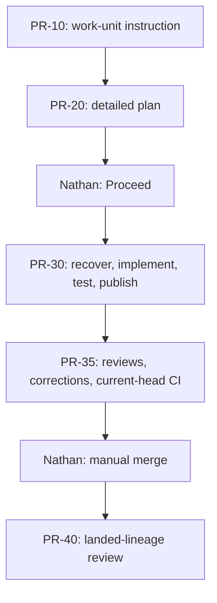
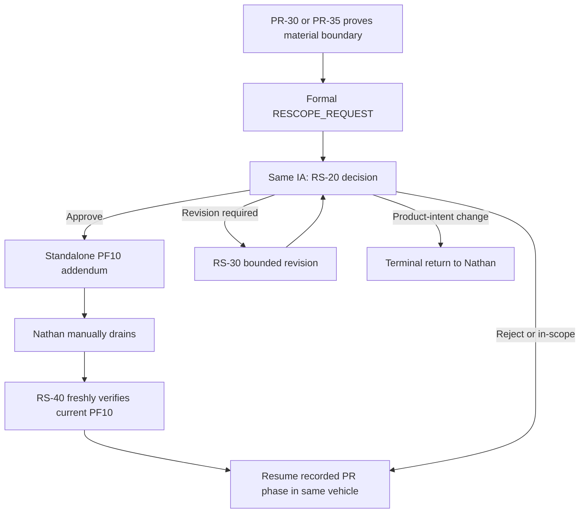
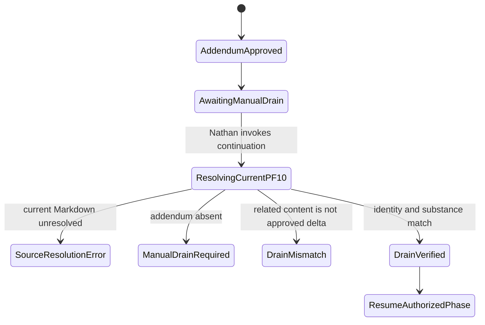

# GCFPE Change Flow Repair Plan v2.0

## 1. Decision summary

Create a complete successor to `GCFPE-20260913.1 / 091326.2` that repairs the remaining Change Flow integrity defects revealed during the HDE-EPIC040 Alpha.

The successor will:

1. retain PF10 as the authoritative in-flight evolution record;
2. preserve Nathan's manual PF10 drain every time a qualifying approved change produces a standalone addendum;
3. make post-drain verification fresh, deterministic, and incapable of confusing source-resolution failure with a missing manual drain;
4. split PR development into two prompts while retaining one work unit, one dedicated PR session, one workspace/worktree, one branch, one open PR, one original Product Owner Proceed, and one governing PR-development skill;
5. keep `glow-hde-pr-development` primary and `glow-hde-devops` support-only;
6. enforce local testing and review-first, action-efficient publication through genuine merge readiness;
7. preserve approved Plans, Guides, and Specifications as immutable bases, with approved changes carried only by manually drained PF10 overlays;
8. preserve the Product Owner-only manual abort boundary;
9. use controlled PFCanon Markdown only and Drive-resident machine-readable Markdown for all runtime planning artifacts; and
10. leave HDE-EPIC040 stopped after PR03 acceptance until the repaired successor is selected and Nathan approves a replacement PR04-planning handoff.

This plan is a proposal. It does not authorize or perform prompt edits, skill edits, release selection, archival, repository work, PF10 drainage, PR04 planning, or Alpha resumption.

## 2. Authority and supersession decisions

The following later Product Owner directions control this plan and supersede conflicting historical statements:

| Topic | Controlling decision | Superseded or rejected interpretation |
| --- | --- | --- |
| PF10 canonicalization | A qualifying approval creates one standalone addendum marked `READY_FOR_MANUAL_DRAIN` and `NON_CANONICAL_PENDING_MANUAL_DRAIN`. Nathan manually drains it. The affected delta becomes active only when verified in the current PF10 Markdown. | Any statement that an agent-authored addendum is canonical at creation or that manual drain can be skipped. |
| Approved artifacts | The approved Plan, Guide, or Specification remains the immutable base. A drained PF10 addendum overlays only its explicit scope. | Live re-authoring of an approved base, an IA-30/IA-40 restart, or another Proceed merely because implementation exposed a gap. |
| Alpha position | PR03 is `ACCEPTED_FINAL`. The current stop is before PR04 planning. | Historical PR02/RS-20 checkpoints presented as the current Alpha position. |
| Alpha resumption | The repaired release must end with a new, exact, Product Owner-approved handoff to PR-10 for `HDE-EPIC040-PR04`. | Reusing the superseded PR03-produced PR04 handoff or an older PR02 RS-20 handoff as the current resumption trigger. |
| PR-development skills | `glow-hde-pr-development` governs the PR lane. `glow-hde-devops` is support-only. | Using the broad DevOps skill as the primary PR-development workflow. |
| Second development prompt | Add a same-session second prompt for review correction and merge readiness. | Keeping implementation, publication, async review correction, and CI convergence inside one monolithic PR-30 invocation. |
| PFCanon sources | Agents resolve and read controlled Markdown only. | Opening, inspecting, or relying on Google Docs, DOC, or DOCX PFCanon variants, even for equivalence checks. |

The prior plan, `GCFPE-Rescope-PF10-Integrity-Implementation-Plan-v1.0.md`, is retained as historical predecessor evidence. Its baseline, Alpha position, prompt inventory, and already-completed work are not current execution instructions for this iteration.

## 3. Current verified baseline

| Surface | Current fact | Evidence |
| --- | --- | --- |
| Selected ecosystem | `GCFPE-20260913.1 / 091326.2`, 54 members | [Selected catalog](https://app.notion.com/p/3da4590a05eb81bcbc5deb2d2cec4f1f?pvs=204) |
| PR prompt inventory | PR-10, PR-20, PR-30, PR-40, and PR-50 are selected; no selected PR-35 exists | [Selected catalog](https://app.notion.com/p/3da4590a05eb81bcbc5deb2d2cec4f1f?pvs=204) and current workspace search |
| PR-30 | One prompt owns recovery, implementation, local testing, publication, review correction, CI, and merge readiness | [PR-30 — PR Implementation Proceed — 091326.2](https://app.notion.com/p/3da4590a05eb81c0aee0d0862b242e09?pvs=204) |
| Rescope decision | RS-20 creates the qualifying addendum and a conditional post-drain handoff | [RS-20 — Review Bounded Work-Unit Rescope — 091326.2](https://app.notion.com/p/3da4590a05eb81d3adf1ecac218d0beb?pvs=204) |
| Rescope continuation | RS-40 independently resolves current PF10, verifies drain, and resumes an existing open PR | [RS-40 — Approved Rescope — Resume PR Implementation — 091326.2](https://app.notion.com/p/3da4590a05eb815e98f5ea7b605b70a3?pvs=204) |
| Current PR skill | `glow-hde-pr-development` revision 1.2.0 is primary; DevOps is support-only | [Skill-fit decision](https://app.notion.com/p/3d94590a05eb81f6824ff4bf507d474c?pvs=204) |
| Operating procedure | Drive Markdown, PF10 addenda, manual drain, PR recovery, action economy, and Markdown-only PFCanon are already stated | [Operating procedure v3.1.0](https://drive.google.com/file/d/1KvX86E4yP4sGHC17tlcfCPRNavnhckEm/view?usp=drivesdk) |
| Alpha stop | Top record says stopped after PR03 and before PR04; adjacent older material still looks current and points to PR02/RS-20 | [Alpha Run Notes](https://app.notion.com/p/3d64590a05eb81e1a645e0ca209b45c0?pvs=204) |
| PR03 acceptance | PR03 is accepted-final; its emitted PR04 handoff is not approved for use under the stopped flow | [PR03 lineage review](https://drive.google.com/file/d/19QTpzj-gdovzeJlt-TiK_rvZmeCGWVMw/view?usp=drivesdk) and Alpha Run Notes |

Static source text now covers much of the intended behavior. The remaining problem is not simply missing wording. It is incomplete state design, conflicting output vocabularies, an overloaded PR execution boundary, stale conditional handoffs across manual events, and insufficient behavioral proof that the selected prompts and skills obey their written contract.

## 4. Defect register

| ID | Rule | Severity | Defect | Required disposition |
| --- | --- | --- | --- | --- |
| `CF-RP-01` | `AUT-002` | BLOCKER | The Alpha page contains two adjacent current-looking states: the authoritative stop after PR03/before PR04 and an older PR02/RS-20 hold. | Publish one unambiguous current-state successor; preserve older content only as clearly non-executable history. |
| `CF-RP-02` | `TOP-001` | BLOCKER | RS-20 creates a post-drain RS-40 handoff before Nathan performs the drain. A supplied pre-drain PF10 link can later be mistaken for the current PF10. | Redesign the handoff as a pre-drain package with explicit historical baseline labeling and mandatory fresh current-PF10 resolution at RS-40 intake. |
| `CF-RP-03` | `CTR-002` | ERROR | RS-40 defines `SOURCE_RESOLUTION_ERROR` and `MANUAL_DRAIN_REQUIRED`, but its required-result vocabulary does not include them and does not distinguish a missing section from an unresolvable source. | Define one exhaustive, mutually exclusive continuation-state schema and use it in prompt, skill, procedure, fixtures, and validators. |
| `CF-RP-04` | `ART-002` | BLOCKER | A source lookup failure can be rendered as a factual claim that Nathan did not drain an addendum. | Permit `MANUAL_DRAIN_REQUIRED` only after unique current PF10 Markdown resolution succeeds and the exact approved addendum is proven absent. |
| `CF-RP-05` | `SES-001` | ERROR | PR-30 spans local implementation plus asynchronous remote review/CI convergence, increasing interruption and completion-delivery exposure. | Split the lifecycle into PR-30 and new PR-35 while preserving the same PR work unit and session identity. |
| `CF-RP-06` | `SKL-001` | ERROR | The current PR skill and cross-skill interoperability contract are written around a single PR-30 prompt and prohibit an extra handoff without distinguishing a same-session phase checkpoint. | Re-evaluate and revise the specialized skill and GCFPE interoperability clause to support one explicitly selected, same-session continuation without adding a role, approval, authority transfer, or R1 row. |
| `CF-RP-07` | `TOP-001` | ERROR | A rescope may originate before initial publication, during PR-30 after publication, or during PR-35. Current continuation logic does not carry a precise return phase. | Add `PR_RETURN_PHASE` and branch-specific eligibility so the overlay resumes the correct phase and never manufactures an open PR. |
| `CF-RP-08` | `ART-002` | ERROR | The conditional PR-40 handoff is authored while the actual state is `MERGE_PENDING` but invoked after manual merge. Without explicit event semantics it can transmit a stale current status. | Distinguish historical producer result from the Product Owner's post-merge assertion; require PR-40 to verify actual merged state independently. |
| `CF-RP-09` | `CTR-001` | ERROR | Current text says local-first, review-first, and purposeful push, yet Alpha behavior included no-commit stopping, excessive/incorrect CI control, and an unauthorized `[skip ci]` mechanism. | Retain the policy but add exact behavioral fixtures and output evidence; never use `[skip ci]` without direct authorization. |
| `CF-RP-10` | `CTR-002` | ERROR | The rescope classification list exists, but the evidence threshold and decision matrix are too easy to apply as a restart or approval without proving a bounded scope delta. | Add explicit eligibility evidence and mutually exclusive decision criteria for `APPROVE`, `REJECT`, `REVISION_REQUIRED`, `SPECIFICATION_CHANGE_REQUIRED`, and `IN_SCOPE_REPAIR`. |
| `CF-RP-11` | `ART-002` | ERROR | Runtime interruption and visible completion delivery are conflated with workflow completion. Prior output invented or relied on an unsupported session-inspection concept. | Add durable phase checkpoints and truthful completion states; recover from repository/Drive evidence and never invent platform inspection endpoints. |
| `CF-RP-12` | `TOP-002` | BLOCKER | The current approved PR04 handoff is explicitly rejected, so Alpha has no valid next edge despite PR03 acceptance. | After successful promotion only, create and validate a replacement PR-10 invocation for PR04 and require Nathan's explicit approval before use. |
| `CF-RP-13` | `SRC-001` | BLOCKER | Historical controls and RCAs contain native-document PFCanon links that an agent could treat as retrievable authority. | Active successors must contain no operative PFCanon GDoc/DOC/DOCX route; preserve full originals only in archive and expose controlled Markdown in current controls. |
| `CF-RP-14` | `CTR-001` | ADVISORY | PR03-R02 exposed an execution-binding defect in product code. It is separate from prompt completion, PF10 drainage, and PR-lane state defects. | Preserve it as technical evidence only; do not treat this GCFPE repair as code remediation or reopen accepted PR03. |

## 5. Target workflow architecture

### 5.1 Normal PR lane



`PR-35` is an internal execution-phase continuation inside the existing PR lane. It is not a new actor, approval, Proceed, work unit, session, workspace, branch, PR, merge authority, or protected R1 row.

### 5.2 Rescope loop



For a prepublication PR-30 rescope, RS-40 is ineligible because no open PR exists. After manual drain, the same PR-30 session resumes directly from its preserved local vehicle and original Proceed. RS-40 remains reserved for a verified existing-open-PR branch.

### 5.3 PF10 manual-drain handshake



The user's continuation invocation is the assertion that the manual action was performed; it is not sufficient verification by itself. RS-40 must independently resolve and inspect the current controlled PF10 Markdown. Conversely, inability to perform that lookup is not evidence that Nathan omitted the drain.

## 6. Exact state and artifact contracts

### 6.1 PF10 addendum contract

Every qualifying approval produces exactly one separate Drive Markdown artifact containing at least:

```yaml
artifact_type: PF10_BUILD_NOTES_ADDENDUM
addendum_id: <stable unique change/work-unit decision identity>
artifact_version: <complete successor version>
status: READY_FOR_MANUAL_DRAIN
canonicality: NON_CANONICAL_PENDING_MANUAL_DRAIN
drain_owner: Nathan / Product Owner
producing_prompt: <stable ID, selected version, direct Notion URL>
approval_decision: <decision ID, version, direct Drive URL>
immutable_base: <artifact ID, version, approval lineage, direct Drive URL>
applicable_prior_addenda: <ordered direct Drive URLs or NONE>
approved_delta: <complete bounded overlay>
affected_surfaces: <requirements, dependencies, tests, Ops, docs, downstream work>
exclusions: <preserved boundaries>
unresolved_items: <item and owner, or NONE>
return_phase: <exact native stage>
drain_verification_anchor:
  addendum_id: <same stable ID>
  decision_id: <same decision ID>
  immutable_base_id: <same base ID>
  approved_delta_digest: <digest over the normalized approved-delta payload>
```

The agent does not allocate a PF10 section number, edit PF10, or declare the addendum active. Nathan manually drains the page-ready content. Formatting differences introduced by PF10 insertion do not invalidate a drain if the stable anchor and normalized substantive payload match.

### 6.2 RS-20 post-decision package

An `APPROVE` result carries:

- the complete rescope decision and direct Drive link;
- exactly one addendum and direct Drive link;
- the immutable base and applicable pre-drain PF10/addendum lineage;
- `PF10_REFERENCE_ROLE: PRE_DRAIN_BASELINE_EVIDENCE` for any PF10 link resolved before the manual drain;
- `FRESH_CURRENT_PF10_RESOLUTION_REQUIRED: true`;
- the exact originating phase and `PR_RETURN_PHASE` where applicable;
- the same IA and PR session identities;
- the existing workspace/worktree, branch, open PR, head, completed work, tests, reviews, CI state, and original Proceed when they exist; and
- one conditional, paste-ready destination prompt for use only after Nathan completes the manual drain.

It must not ask Nathan to edit the handoff with a future PF10 link, perform another merits decision, or reconstruct the prior conversation.

### 6.3 RS-40 intake and result states

RS-40 will use this exhaustive intake-verification result vocabulary:

| State | Exact predicate | Effect |
| --- | --- | --- |
| `SOURCE_RESOLUTION_ERROR` | A unique current controlled PF10 Markdown cannot be resolved and completely read. | Terminal for this invocation; preserve evidence; do not infer drain status. |
| `MANUAL_DRAIN_REQUIRED` | Current PF10 Markdown is resolved and read, but the exact approved addendum anchor is absent. | Terminal for this invocation; identify the missing addendum, not a generic routing failure. |
| `MANUAL_DRAIN_MISMATCH` | Current PF10 contains a related anchor or section, but its decision/base/delta does not substantively match the approved addendum. | Terminal for this invocation; preserve both sources and name the mismatch. |
| `DRAIN_VERIFIED` | Current PF10 contains the matching stable anchor and substantively equivalent approved delta, with no later conflicting overlay. | Resume the recorded eligible PR phase. |

These states must appear consistently in the prompt's required result, the PR-development skill, the operating procedure, the direct-handoff contract, fixtures, and validators.

### 6.4 PR phase states

| Prompt | Entry | Successful phase result | Other valid results |
| --- | --- | --- | --- |
| PR-30 | Original Proceed or verified same-session prepublication continuation | `PR_CANDIDATE_PUBLISHED` with one coherent locally tested candidate and one open/reused draft PR | `RESCOPE_PENDING`, `RECOVERY_PENDING`, `PRODUCT_OWNER_DECISION_REQUIRED` |
| PR-35 | Same PR session, PR-30 result, same workspace/worktree/branch/open PR/original Proceed | `MERGE_PENDING` only after clean current-head reviews, passing required current-head CI or explicit waiver, verified remote head, and mergeability | `RESCOPE_PENDING`, `RECOVERY_PENDING`, `REMOTE_EVIDENCE_PENDING`, `PRODUCT_OWNER_DECISION_REQUIRED` |
| RS-40 | Approved existing-open-PR rescope plus verified manual drain | Continues the recorded PR-30 or PR-35 phase and returns that phase's lawful result | Verification states in §6.3 plus PR phase states |

`REMOTE_EVIDENCE_PENDING` is permitted only when an actual external review/check result is unavailable and no local action remains. It must save and read back a recovery checkpoint and return one same-session PR-35 re-entry prompt. Normal short waits do not justify an early stop.

### 6.5 Post-merge handoff semantics

PR-35's `MERGE_PENDING` artifact remains a truthful pre-merge historical result. Its conditional PR-40 block is written for later use and must say:

- use this block only after Nathan manually merges the identified PR;
- when pasted, Nathan's invocation asserts the manual merge occurred;
- the prior PR-35 state was `MERGE_PENDING` and must not be relabeled as post-merge fact;
- PR-40 independently verifies actual merged state and landed attribution before review; and
- unavailable or unmerged evidence remains pending without asking for a second merge approval or performing a merge.

## 7. Second development prompt design

### 7.1 New selected member

Reserve the stable ID and working title:

`PR-35 — Resolve PR Reviews and Reach Merge Readiness`

The current 54-member catalog and workspace search contain no selected PR-35. A complete collision and supersession check remains mandatory before publication. If no other member is added or removed, the successor release must contain exactly 55 members: the current 54 plus PR-35.

### 7.2 PR-30 responsibility after the split

PR-30 owns:

1. exact assignment and original Proceed validation;
2. recovery of an existing matching checkout/worktree/branch/PR/Drive artifact set;
3. scope and baseline verification;
4. bounded implementation;
5. narrow-to-broad local testing;
6. coherent commit creation after applicable local tests pass;
7. one deliberate publication checkpoint, reusing an existing PR or opening a draft PR; and
8. a complete same-session PR-35 handoff.

PR-30 must not stop with uncommitted completed work merely because publication is a later concern. It also must not micro-commit or push every small edit. It may open the draft PR early only after a coherent locally tested checkpoint.

### 7.3 PR-35 responsibility

PR-35 owns:

1. re-verifying the same session/workspace/worktree/branch/open PR and remote head;
2. reading all applicable code reviews, security reviews, inline threads, summary comments, and current checks;
3. resolving all known substantive in-scope review findings locally before another push;
4. running affected local tests before coherent review-correction commits;
5. batching related corrections into the smallest reviewable push sequence;
6. treating an automatically started CI run as stale when new review findings make that revision obsolete;
7. cancelling stale CI only when an authorized supported interface permits cancellation;
8. never waiting for, retriggering, or spending another CI run on a revision already known to require correction;
9. never using `[skip ci]` or an equivalent suppression mechanism without direct, specific Product Owner authorization;
10. obtaining fresh review and required CI evidence on the unchanged current head;
11. verifying PR head, mergeability, unresolved-thread state, and required checks; and
12. returning `MERGE_PENDING — Ready to merge` without merging.

If review findings arrive after an automatically triggered CI begins, PR-35 cannot pretend the run never started. It must stop treating that run as a gate, cancel it only when supported and authorized, correct locally, and avoid another push until all then-known findings are resolved and locally tested.

### 7.4 Shared continuity and authority

PR-30, PR-35, and eligible RS-40 continuation must share:

- the same `WORK_UNIT_ID`;
- the same dedicated PR session reference;
- the same repository/workspace/worktree identity;
- the same branch and open PR;
- the same original Product Owner Proceed;
- the same immutable approved base artifacts;
- the same active PF10 overlay lineage;
- preserved commits, test evidence, reviews, CI evidence, and unresolved items; and
- `glow-hde-pr-development` as the primary skill.

No second Proceed, new approval, new PR session, new worktree, replacement Plan, replacement Instruction, or duplicate PR is created at the PR-30 → PR-35 boundary.

## 8. Rescope decision matrix

RS-20 must require the submitted request/proposal to establish:

1. the exact approved boundary that blocks continuation;
2. repository or artifact evidence proving the boundary;
3. why the issue is not an ordinary in-scope repair;
4. the smallest proposed delta;
5. compatibility with approved Specification intent;
6. affected requirements, dependencies, tests, Ops, documentation, and downstream units;
7. completed valid work that will be preserved;
8. the existing lifecycle vehicle and original authority;
9. risks, exclusions, and unresolved facts; and
10. the exact native return phase if approved, rejected, or revised.

| Decision | Required predicate | Addendum | Return |
| --- | --- | --- | --- |
| `APPROVE` | Evidence proves a bounded implementation delta within approved Specification intent, and the proposed overlay is complete and executable. | Exactly one standalone addendum. | Conditional post-drain return to the exact native phase; RS-40 only for an existing open PR. |
| `REJECT` | The requested boundary change is unsupported, unnecessary, unsafe, or outside the IA's bounded authority. | None. | Originating owner under unchanged authority when complete; otherwise terminal evidence return. |
| `REVISION_REQUIRED` | A potentially valid request lacks repairable evidence, precision, impact coverage, or bounded wording. | None. | RS-30 to the same request/proposal author, preserving artifact type. |
| `SPECIFICATION_CHANGE_REQUIRED` | The proposed change alters product intent or an approved Specification boundary beyond IA authority. | None from RS-20. | Terminal return to Nathan for the actual Product Owner decision and native Specification-delta route. |
| `IN_SCOPE_REPAIR` | The work is already authorized by the immutable base plus active overlays. | None. | Return to the existing repair owner and correct PR phase under the original Proceed. |

No decision may restart IA-30/IA-40, rewrite an approved base, create another Proceed, rerun an accepted-final PR, or route automatically to PR-50.

## 9. Prompt and control change matrix

### 9.1 Confirmed prompt changes

| Target | Planned correction | Validation focus |
| --- | --- | --- |
| PR-10 | Ensure every work-unit instruction resolves current PF10 Markdown, carries applicable overlays, and creates a complete PR-20 handoff. Add the eventual replacement Alpha handoff for PR04 only after promotion. | No stale PR04 package; no accepted-PR rerun; exact PF10 lineage. |
| PR-20 | Cross-reference the detailed Plan against immutable whole-change Plan plus active PF10 overlays; produce a complete paste-ready PR-30 invocation, not metadata. | Exact Plan/Proceed boundary; Drive links; no Library IDs. |
| PR-30 | Narrow to recovery, implementation, local test, coherent commit, and deliberate initial publication. Add direct PR-35 handoff and phase-aware rescope. | Existing-work recovery; no invented endpoint; local-first; no early no-commit stop. |
| PR-35 | Create the second same-session prompt defined in §7. | Review-first CI economy; current-head evidence; genuine merge readiness. |
| PR-40 | Accept the conditional post-merge invocation, separate pre-merge historical result from asserted/verified merge, and retain read-only landed attribution. | No stale `MERGE_PENDING` as current fact; actual merged-state verification. |
| PR-50 | Preserve Nathan-only manual invocation and zero inbound automatic edges. | Exact invocation authority; evidence preservation; no self-abort. |
| RS-20 | Add the evidence matrix, pre-drain reference labeling, fresh-resolution directive, and phase-aware conditional return. | No false drain state; no Plan restart; one addendum only on approval. |
| RS-30 | Preserve bounded revision and original artifact type; return to the same IA decision with all new evidence. | No duplicate request stage or Plan rewrite. |
| RS-40 | Implement the four-state drain-verification schema and resume `PR_RETURN_PHASE`. | Fresh current PF10; same vehicle/Proceed; source failure distinct from missing drain. |
| GCFPE-MGMT-10 | Make the split PR lane, PF10 handshake, state vocabulary, and Alpha-resumption control mandatory for ecosystem changes. | Cannot regenerate old monolithic or stale-handoff architecture. |
| PE Metaprompt | Encode all new invariants as prompt-authoring and validation requirements. | Generated prompts cannot omit PR-35, fresh PF10 resolution, Markdown-only sources, or manual boundaries. |

### 9.2 Complete plan/specification/guide writer audit

At minimum, inspect the complete current bodies of:

- CF-C-20, CF-C-40, CF-E-20, and CF-E-40;
- IA-10, IA-20, and IA-40;
- PR-10 and PR-20;
- QA-20, QA-50, QA-60, and QA-80; and
- ESC-30 plus any other member whose semantic output is a Plan, Guide, Specification, remediation proposal, work-unit instruction, or approved-base revision.

Every applicable writer must:

1. resolve the current controlled PF10 Markdown before authoring;
2. list every applicable active addendum by direct Drive link;
3. distinguish the base artifact from overlays;
4. state whether it is initial/preapproval authoring or an in-flight approved-base context;
5. refuse in-flight re-authoring of an approved base; and
6. carry the PF10 lineage into its complete next-prompt handoff.

### 9.3 Qualifying approval producer audit

The current semantic producer set is expected to remain exactly:

`{CF-C-30, CF-E-30, IA-30, QA-70, RS-20, ESC-40}`.

Validate semantically, not only by ID. Each producer creates exactly one addendum only when its own native decision approves a material delta to an already approved base. Initial approvals, denials, revision requests, pending, unchanged, editorial, and in-scope outcomes create none. PR-35 has no approval authority and must not become an addendum producer.

### 9.4 Full selected-set audit

Read all current 54 prompt bodies and the new PR-35 candidate. For every member, record:

- stable ID and candidate version;
- exact predecessor page;
- changed or confirmed-no-change disposition;
- producer and receiver contracts;
- terminal/nonterminal outcomes;
- PF10 and PFCanon behavior;
- skill ownership;
- handoff destinations;
- direct Notion and Drive references;
- prohibited-language scan; and
- readback and validation result.

## 10. Skill and validator workstream

### 10.1 Formal skill-fit re-evaluation

Do not assume that the existing skill decision remains sufficient merely because `glow-hde-pr-development` exists. Re-evaluate the installed skills against the split prompt architecture.

| Skill/control | Intended decision |
| --- | --- |
| `glow-hde-pr-development` | Remain the sole primary PR execution skill; update its trigger and contract to cover PR-30, PR-35, interrupted recovery, and eligible RS-40 continuation. |
| `glow-hde-devops` | Remain support-only for a specifically needed environment, Railway, vendor, database, deployment, or bounded Ops capability. Audit references to PR-30/PR-35; do not give it PR workflow authority. |
| `change-flow` | Own orchestration, selected graph, PF10 overlay/manual-drain boundary, PR phase mapping, and Alpha hold. It does not implement repository work. |
| `flowmaster-validate` | Validate package structure, exact selected overlay, member count, graph closure, actor/session boundaries, PF10 states, and fixtures. |
| `amthor-workspace-governance-audit` | Update only the GCFPE interoperability rule that currently prohibits any extra handoff. Permit one selected same-session phase continuation while still prohibiting added roles, approvals, gates, duplicate authority, or cross-session routing. |
| `glow-merged-change-attribution-lock` | Remain read-only and post-merge for PR-40 evidence. It is not a PR-35 review-remediation skill. |
| Additional review skill | Do not add one by default. Add or select another skill only if complete-source fit analysis proves a capability gap that the specialized PR-development skill cannot safely own. |
| Flowmaster Primary / immutable R1 | Remain byte-for-byte unchanged. Map PR-30 and PR-35 to the same native PR execution row/authority. |

### 10.2 `glow-hde-pr-development` changes

Prepare a governed successor to revision 1.2.0 that:

- names PR-30 and PR-35 explicitly;
- separates phase duties without duplicating shared invariants;
- performs recovery at every fresh, resumed, or uncertain entry;
- supports `PR_RETURN_PHASE` across RS-40;
- implements the PF10 verification-state matrix;
- emits a durable checkpoint at initial publication and before any extended remote wait;
- carries a compact remote-action ledger: local checks, commits, pushes, review reads, CI runs, stale/cancelled status, current head, and next useful action;
- rejects `[skip ci]` or equivalent suppression without direct authorization;
- returns complete same-session handoffs and never invents a session-inspection endpoint; and
- preserves the Product Owner manual merge and PR-50 boundaries.

Update `references/behavior-cases.md` and the specialized validator in the same commit. Use `skill-creator` for the governed skill edit and run both the specialized validator and the personal-skill structural validator before committing.

### 10.3 Other skill/control changes

Update only the minimum GCFPE-specific clauses required for agreement:

- `change-flow`: selected release metadata, expected count, split PR lane, phase-aware rescope, PF10 verification states, PR04 Alpha hold;
- `flowmaster-validate`: current-release manifest, graph and fixture expectations;
- `amthor-workspace-governance-audit`: same-session continuation exception and current-release prompt/skill agreement checks;
- `glow-hde-devops`: only if its current routing text names PR-30 as the sole PR-development destination; and
- direct-handoff JSON/fixtures: new prompt identity, edges, states, and terminal rules.

No skill edit is complete until it is committed and its exact installed source is read back. Static validation is evidence of structure, not proof of live behavior.

## 11. Operating records and publication surfaces

Create versioned successors for affected controls; never silently edit historical evidence into current authority.

Required surfaces:

1. GCFPE Direct-Handoff and Runtime Artifact Operating Procedure;
2. GCFPE-MGMT-10;
3. PE Metaprompt;
4. selected prompt catalog and membership/release register;
5. Glow HDE Prompt Flow Index;
6. HDE IA, HDE Change Flow, HDE QA, Escalation, and other hubs that enumerate PR or rescope members;
7. Alpha Establishment and Change Management Checklist;
8. installed GCFPE direct-handoff contract and validation fixtures;
9. skill-fit decision/current interoperability record; and
10. HDE-EPIC040 Alpha Run Notes.

The Alpha successor must contain one current section only:

```yaml
state: ALPHA_STOPPED_PENDING_CHANGE_FLOW_REFACTOR
last_accepted_unit: HDE-EPIC040-PR03
last_accepted_state: ACCEPTED_FINAL
next_intended_unit: HDE-EPIC040-PR04
next_intended_stage: PR-10
current_handoff_status: NOT_YET_APPROVED
resume_authority: Nathan / Product Owner
```

Move prior complete Alpha page versions to the existing archive intact after successful successor promotion. The new current page must not reproduce operative GDoc/DOC/DOCX PFCanon links. It may state that excluded native-document references exist only in archived history and must never be opened.

## 12. Implementation work packages

### WP0 — Freeze the current baseline

**Tasks**

1. Resolve the selected register, 54-member catalog, every member body, manager, metaprompt, operating procedure, hubs, checklist, skills, validators, direct-handoff contract, and Alpha note.
2. Save source identities, fetched revisions, complete-source hashes, parent locations, and lifecycle states.
3. Confirm PR-35 has no selected or active identity collision.
4. Resolve required PFCanon inputs only through `Glow / Core Docs / PFCanon` controlled Markdown. Do not open native-document variants.
5. Classify historical RCAs and rejected artifacts as evidence, never current routing.

**Exit:** complete immutable source manifest; no mutation; no unresolved decisive source.

### WP1 — Freeze the successor state model

**Tasks**

1. Approve the diagrams and state vocabularies in §§5–6 as the candidate contract.
2. Reserve PR-35 identity and expected 55-member count.
3. Define `PR_RETURN_PHASE`, PF10 verification states, PR-30/PR-35 result schemas, and post-merge event semantics in one machine-readable graph file.
4. Prove the extra prompt remains inside the existing native PR execution authority and adds no Product Owner decision or R1 row.

**Exit:** closed graph contract with every state produced and consumed exactly once where required.

### WP2 — Author prompt candidates

**Tasks**

1. Create complete sibling successors for confirmed prompt targets in §9.1.
2. Create PR-35 as a new sibling page in the proper PR family.
3. Apply PF10 cross-reference and immutable-base rules to all writers found in §9.2.
4. Apply semantic addendum rules to all producers in §9.3.
5. Replace every affected output with one fully populated, paste-ready handoff.
6. Remove active Library IDs, native-document PFCanon routes, stale state labels, unsupported session-inspection claims, and old restart logic.
7. Preserve selected predecessors untouched and unarchived during candidate work.

**Exit:** complete unselected candidate set; expected 55 unique members; every destination resolves inside that set.

### WP3 — Align skills and deterministic controls

**Tasks**

1. Perform the formal skill-fit re-evaluation in §10.1.
2. Update `glow-hde-pr-development`, its behavior cases, and validator.
3. Update the GCFPE-specific `change-flow`, `flowmaster-validate`, and governance-audit clauses.
4. Audit `glow-hde-devops` and attribution-lock references; change only proven incompatibilities.
5. Commit each governed skill repair only after local validation; preserve unrelated skill behavior.

**Exit:** prompt/skill/interface matrix has no `SKL-001` disagreement; exact commits and readbacks recorded.

### WP4 — Align procedures, hubs, and Alpha control

**Tasks**

1. Create procedure, catalog, register-entry, hub, checklist, skill-fit, and Alpha successors.
2. Keep the production selection on `GCFPE-20260913.1` during staging.
3. Record the expected candidate count and prompt graph consistently.
4. Make the current Alpha position unambiguous and the older PR02/RS-20 state historical only.
5. Keep the old PR04 handoff explicitly void.

**Exit:** no candidate control points to a predecessor prompt, old member count, stale Alpha state, or excluded source format.

### WP5 — Static and semantic validation

**Tasks**

1. Run specialized skill validators.
2. Run strict Flowmaster and GCFPE current-candidate validators.
3. Verify protected Primary core byte identity and 46-row R1 mapping.
4. Read all 55 prompt candidates completely.
5. Validate exact direct Notion references, Drive links, member versions, roles, sessions, approvals, artifacts, and handoff fields.
6. Run prohibited-language and source-format scans.
7. Execute every fixture in §13.

**Exit:** zero unresolved blocker/error/warning; advisories explicitly accepted or resolved; validation distinguishes static from behavioral evidence.

### WP6 — Independent repair-batch audit

**Tasks**

1. Pin a complete candidate snapshot.
2. Run workspace governance postflight against prompt, skill, and registry contracts.
3. Review every cross-skill finding independently from the authoring pass.
4. Recheck the PR lane, PF10 handshake, Alpha state, and archive boundaries after repairs.

**Exit:** independent `PASS` or `PASS WITH WARNINGS` with no mandatory open finding; exact evidence bundle retained.

### WP7 — Promotion and intact archival

**Tasks**

1. Request Product Owner promotion approval for the exact validated successor.
2. Select the complete successor atomically across catalog, register, manager, procedure, hubs, skill contracts, and validators.
3. Read back every activated binding.
4. Run full post-promotion validation again.
5. Only after that pass, move superseded prompt/control versions intact to their existing archive locations.
6. Record exact successor/predecessor and archive receipts. Do not delete or overwrite anything.

**Exit:** one selected 55-member successor, intact predecessor archive, and clean post-promotion validation.

### WP8 — Alpha resumption package

**Tasks**

1. Re-read the selected successor, current Alpha note, PR03 acceptance artifact, current PF10 Markdown, and applicable active addenda.
2. Confirm PR01, PR02, and PR03 remain accepted-final and are not rerun.
3. Create one standalone, paste-ready invocation for selected PR-10 to create `HDE-EPIC040-PR04` work-unit instructions in the retained whole-change IA session.
4. Include selected prompt name/version/direct Notion link, exact session, HDE-EPIC040/PR04 identity, immutable approved bases, current PF10/addenda links, PR03 acceptance, decisions, constraints, unresolved items, next action, and expected `PR_INSTRUCTION` output.
5. Save the handoff as Drive Markdown, read it back, and return its direct link to Nathan.
6. Do not execute PR-10. Alpha resumes only when Nathan explicitly approves and invokes that exact handoff.

**Exit:** `READY_FOR_PRODUCT_OWNER_ALPHA_RESUMPTION_DECISION`; no PR04 planning performed.

## 13. Required validation fixtures

| Fixture | Scenario | Required result |
| --- | --- | --- |
| `PR-SPLIT-POS-01` | Fresh proceeded PR with no prior work | PR-30 implements/tests/commits/publishes once, then hands to same-session PR-35. |
| `PR-SPLIT-POS-02` | Existing matching worktree and draft PR | PR-30 or PR-35 recovers the most advanced consistent state; no duplicate workspace or PR. |
| `PR-SPLIT-NEG-01` | PR-35 asks for another Proceed or session | Validation failure. |
| `PR-SPLIT-NEG-02` | PR-30 stops with complete tested work but no coherent commit/publication without a blocker | Validation failure. |
| `PR-COST-POS-01` | Known review findings and active CI | Fix and test locally first; stale CI is not awaited; cancel only if supported; one coherent corrected push. |
| `PR-COST-POS-02` | New findings arrive after CI auto-starts | Mark current run stale, correct locally, avoid another push until all known findings are resolved. |
| `PR-COST-NEG-01` | Micro-commits or pushes after every edit | Validation failure. |
| `PR-COST-NEG-02` | `[skip ci]` used without direct authorization | Validation failure. |
| `PR-READY-POS-01` | Clean current head | PR-35 proves resolved reviews, passing current-head CI, remote-head identity, and mergeability before `MERGE_PENDING`. |
| `PR-MERGE-NEG-01` | Agent attempts merge or auto-merge | Validation failure. |
| `PF10-POS-01` | RS-20 approves bounded open-PR rescope | Exactly one undrained addendum and conditional RS-40 package; no base rewrite or new Proceed. |
| `PF10-POS-02` | Nathan drains; current PF10 contains exact overlay | RS-40 returns `DRAIN_VERIFIED` and resumes recorded PR phase. |
| `PF10-NEG-01` | Only pre-drain PF10 is supplied | RS-40 resolves current Markdown independently; supplied predecessor is historical evidence only. |
| `PF10-NEG-02` | Current PF10 cannot be uniquely resolved | `SOURCE_RESOLUTION_ERROR`; never `MANUAL_DRAIN_REQUIRED`. |
| `PF10-NEG-03` | Current PF10 resolves and exact addendum is absent | `MANUAL_DRAIN_REQUIRED` with exact missing identity. |
| `PF10-NEG-04` | Related section exists but approved delta differs | `MANUAL_DRAIN_MISMATCH`; no implementation. |
| `PF10-NEG-05` | Rejection, revision, in-scope repair, pending, or initial approval | No addendum. |
| `RS-DECISION-01` | Ordinary in-scope defect | `IN_SCOPE_REPAIR`; no rescope approval or PF10 addendum. |
| `RS-DECISION-02` | Product-intent change | `SPECIFICATION_CHANGE_REQUIRED`; terminal Nathan return, no IA overreach. |
| `RS-RETURN-01` | Prepublication rescope | Resume same PR-30 phase after drain; do not manufacture RS-40 eligibility. |
| `RS-RETURN-02` | Rescope during PR-35 | RS-40 resumes PR-35 responsibilities in same vehicle. |
| `ABORT-POS-01` | Nathan manually invokes PR-50 for exact PR | Prompt executes its preserved evidence/abort-escalation contract. |
| `ABORT-NEG-01` | Any agent or prompt routes to PR-50 | Validation failure; return evidence to Nathan without an abort handoff. |
| `HANDOFF-POS-01` | PR-30 completes initial publication | One complete, runnable PR-35 prompt with exact selected name/version/URL and full continuity. |
| `HANDOFF-POS-02` | PR-35 reaches merge readiness | Conditional post-manual-merge PR-40 prompt separates historical and current event facts. |
| `HANDOFF-NEG-01` | Metadata list, blank field, Library ID, “above,” or unlinked filename | Validation failure. |
| `SOURCE-POS-01` | Controlled PFCanon Markdown available | Read permitted and provenance recorded. |
| `SOURCE-NEG-01` | Only GDoc/DOC/DOCX candidate is found | Source blocker without opening the candidate. |
| `ALPHA-POS-01` | Successor selected and all gates pass | Produce PR04 PR-10 handoff only; do not execute it. |
| `ALPHA-NEG-01` | Older PR02/RS-20 or void PR04 handoff supplied | Reject as historical/non-operative. |
| `OBS-POS-01` | Remote evidence is genuinely pending | Durable checkpoint plus same-session PR-35 re-entry; no fabricated liveness claim. |
| `OBS-NEG-01` | Session-inspection endpoint or unsupported platform diagnosis is asserted | Validation failure. |
| `RCA-SEPARATION-01` | PR03-R02 code issue appears in source evidence | Preserve as accepted technical history; do not treat it as PF10, prompt-hang, or Alpha-resumption proof. |

## 14. Acceptance criteria

The successor is ready for promotion only when all are proven:

1. The candidate contains exactly 55 members if PR-35 is the sole addition.
2. PR-30 and PR-35 are two phases of one PR work unit under one original Proceed and one dedicated PR session.
3. PR-35 adds no approval, Product Owner gate, merge authority, duplicate workspace, duplicate PR, or protected R1 row.
4. `glow-hde-pr-development` governs PR-30, PR-35, and eligible RS-40 continuation; DevOps remains support-only.
5. Every fresh or resumed PR entry recovers existing work before creating a new vehicle.
6. PR-30 locally tests before coherent commit/publication and returns a fully populated PR-35 handoff.
7. PR-35 resolves known reviews before another push or fresh paid CI, uses purposeful correction batches, and reaches genuine current-head merge readiness.
8. No unauthorized CI-suppression mechanism appears.
9. The PF10 process is approval → standalone undrained addendum → Nathan manual drain → fresh current-PF10 verification → lawful continuation.
10. Source resolution failure, absent drain, and mismatched drain are distinct states with no contradictory result vocabulary.
11. No affected continuation relies on an approved delta before verified manual drain.
12. No prompt reauthors an approved Plan, Guide, or Specification in flight.
13. All plan/specification/guide writers cross-reference the current PF10 Markdown and applicable overlays.
14. Exactly the semantic qualifying approval outcomes create exactly one addendum; all nonqualifying outcomes create none.
15. Rescope decisions satisfy the evidence matrix and never default to an IA-30/IA-40 restart.
16. RS-40 resumes the exact originating PR phase and existing vehicle under the original Proceed.
17. PR-50 is manually invocable only by Nathan and has zero automated or agent-originated inbound edges.
18. Every nonterminal handoff is one complete paste-ready prompt with selected Notion identity and direct Drive artifact links.
19. Runtime planning artifacts are complete, efficient, machine-readable Markdown in `Glow / Ephemeral Planning Files` and are read back after writing.
20. PFCanon authority is controlled Markdown only; no active source, prompt, skill, example, fixture, or handoff opens or relies on GDoc/DOC/DOCX PFCanon content.
21. No active Library ID, conversation reconstruction, invented endpoint, model/strength assessment, Analyzer, reasoning recommendation, or configuration-based route remains.
22. Current Alpha status is unambiguous: PR03 accepted-final; PR04 planning not started; old PR04 and PR02/RS-20 handoffs non-operative.
23. Deterministic checks, complete semantic readback, cross-skill governance audit, and post-promotion audit pass.
24. Superseded prompts and controls are archived intact only after the selected successor passes post-promotion validation.
25. Alpha remains stopped until Nathan approves and manually invokes the newly generated PR04 PR-10 handoff.

## 15. Product Owner control points

Nathan retains only the intended manual controls:

- approve or reject this plan;
- authorize candidate implementation;
- approve the exact successor release for promotion;
- manually drain each qualifying PF10 addendum;
- manually merge an identified PR;
- manually invoke `Abort PR and Escalate` for an exact PR;
- approve the final replacement PR04 handoff; and
- manually invoke that handoff to resume Alpha.

Agents own source resolution, candidate authoring, validation, addendum authoring, Drive persistence/readback, handoff preparation, PR implementation, review correction, and ordinary workflow execution within existing authority. They must not transfer routine analysis or cleanup to Nathan.

## 16. Rollback and failure boundaries

- Candidate work never overwrites the selected predecessor.
- A failed candidate validation leaves `GCFPE-20260913.1` selected and Alpha stopped.
- A failed post-promotion audit stops Alpha and requires an explicit Product Owner decision before any selection rollback or repair.
- Archived predecessors remain intact and retrievable; no delete, trash, overwrite, reset, or copy-and-delete substitute is permitted.
- A prompt, skill, or source that cannot be resolved exactly blocks only its dependent repair batch and is reported with the missing evidence.
- No validation or promotion step executes PR04, drains PF10, changes repository state, invokes PR-50, or merges a PR.

## 17. Required deliverables

1. pinned source manifest and hashes;
2. 55-member candidate catalog and graph contract;
3. prompt-by-prompt impact and disposition ledger;
4. PR-30 successor and new PR-35;
5. RS-20/RS-30/RS-40 state and handoff successors;
6. PR-20 and PR-40 handoff corrections;
7. GCFPE-MGMT-10 and PE Metaprompt successors;
8. complete writer and qualifying-producer audit;
9. updated `glow-hde-pr-development` skill, behavior cases, validator, commit, and readback;
10. aligned Change Flow, Flowmaster validation, governance-audit, and support-skill contracts;
11. operating procedure, catalog, register, hub, checklist, and Alpha-note successors;
12. deterministic fixture results and semantic readback report;
13. independent governance postflight and evidence bundle;
14. promotion and intact-archive report;
15. post-promotion validation report; and
16. one saved/read-back PR04 PR-10 Alpha-resumption handoff for Nathan's approval.

## 18. Source register

| Source | Role |
| --- | --- |
| [Selected GCFPE catalog](https://app.notion.com/p/3da4590a05eb81bcbc5deb2d2cec4f1f?pvs=204) | Current release and exact 54-member baseline. |
| [Release register](https://app.notion.com/p/3d24590a05eb81ce942ad994cfca9fa1?pvs=204) | Selection authority. |
| [GCFPE-MGMT-10](https://app.notion.com/p/3da4590a05eb81ac80e6d886a25aa026?pvs=204) | Current management contract and repair owner. |
| [PR-20](https://app.notion.com/p/3da4590a05eb8147b34ccfabf608c2e3?pvs=204) | Detailed PR planning and PR-30 handoff source. |
| [PR-30](https://app.notion.com/p/3da4590a05eb81c0aee0d0862b242e09?pvs=204) | Current monolithic PR-development source. |
| [PR-40](https://app.notion.com/p/3da4590a05eb813c8b47e77f94ff1def?pvs=204) | Current post-merge review source. |
| [RS-20](https://app.notion.com/p/3da4590a05eb81d3adf1ecac218d0beb?pvs=204) | Current IA rescope decision and addendum source. |
| [RS-40](https://app.notion.com/p/3da4590a05eb815e98f5ea7b605b70a3?pvs=204) | Current post-drain existing-PR continuation source. |
| [Operating procedure v3.1.0](https://drive.google.com/file/d/1KvX86E4yP4sGHC17tlcfCPRNavnhckEm/view?usp=drivesdk) | Active handoff, storage, PF10, rescope, and PR policy. |
| [PR development skill-fit decision](https://app.notion.com/p/3d94590a05eb81f6824ff4bf507d474c?pvs=204) | Current primary/support skill boundary. |
| [Alpha Run Notes](https://app.notion.com/p/3d64590a05eb81e1a645e0ca209b45c0?pvs=204) | Current stop record and conflicting historical state surface. |
| [PR03 lineage review](https://drive.google.com/file/d/19QTpzj-gdovzeJlt-TiK_rvZmeCGWVMw/view?usp=drivesdk) | PR03 acceptance and pre-PR04 boundary evidence. |
| [PR03 PF10 Resolution RCA](https://drive.google.com/file/d/1rdQnB-u6HyGB5sWxq5-uYlU_kFKz6tKI/view?usp=drivesdk) | Stale-source and false `MANUAL_DRAIN_REQUIRED` evidence. |
| [PR03 Session Completion and CI Control RCA](https://drive.google.com/file/d/1EOOqIiuaVxPv42Oh9sf3kxNF0WhmC2NK/view?usp=drivesdk) | Completion visibility, unauthorized CI suppression, and separate code-defect evidence. |
| [RS-20 Escalation and Planning Failure RCA](https://drive.google.com/file/d/1pRXOiduFK-tQoirIa0PXEEkmT62Ujpht/view?usp=drivesdk) | Rejected Plan-restart route and historical authority-error evidence, subject to the supersessions in §2. |
| [Prior repair plan v1.0](https://drive.google.com/file/d/1aMTID8BMSQY368RXwRPKXzuOQn2pHWnN/view?usp=drivesdk) | Historical predecessor plan; not current execution authority. |

No GDoc, DOC, DOCX, or Library identifier is an operative source in this plan.

## 19. Final plan state

`READY_FOR_PRODUCT_OWNER_REVIEW`

Smallest next permitted action: Nathan approves, rejects, or requests changes to this exact v2.0 plan. Implementation begins only after an explicit authorization that identifies this plan and preserves the Alpha stop.

No implementation, publication, promotion, archive move, PF10 drainage, repository action, PR04 planning, or Alpha resumption has been performed.
