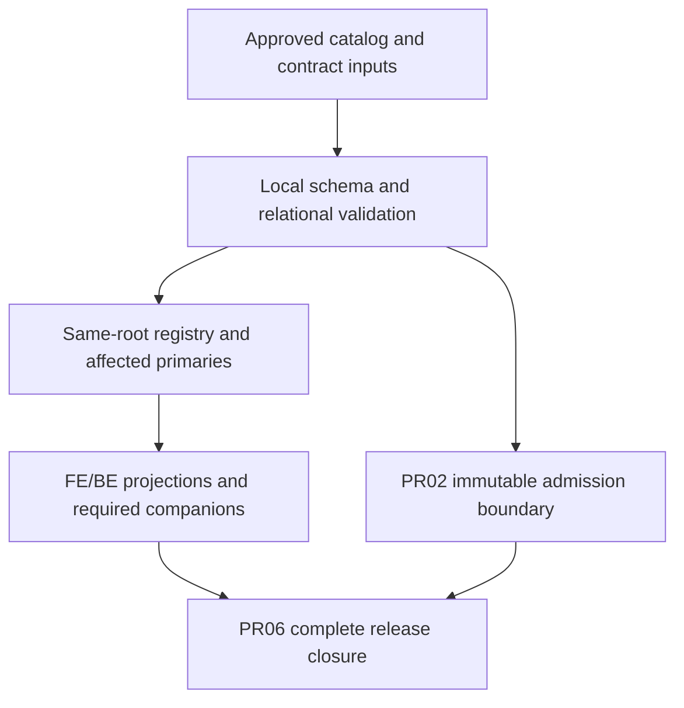

# HDE-EPIC040-PR01 — PR Work-Unit Instruction v2.0

## 1. Identity, result and authorization boundary

| Field | Value |
| --- | --- |
| Artifact type / logical identity | PR_INSTRUCTION / HDE-EPIC040-PR01-PR-INSTRUCTION |
| Version / state | 2.0 / INSTRUCTION_READY |
| Change / work unit | EPIC / HDE-EPIC040 — Separation Pass 3 / HDE-EPIC040-PR01 |
| Work-unit name | Source-proven catalog and exact contract data |
| Producer | Same retained dedicated HDE-EPIC040 whole-change IA; sole instruction author and native-output writer |
| Execution posture | MANUAL_PROMPT_EXECUTION |
| SPECIFICATION_REF | libfile_12bab860949c8191881510875f051460; HDE-EPIC040-SPECIFICATION v1.1, SPECIFICATION_APPROVED; Thoth-17 APPROVE 2026-09-08T13:23:24Z |
| IMPLEMENTATION_PLAN_REF | libfile_11c992cda3f0819199827e86584e41f1; HDE-EPIC040-IMPLEMENTATION-PLAN v2.1 |
| PLAN_REVIEW_REF | libfile_b85b81651a508191abdfd8f81803caf8; HDE-EPIC040-IMPLEMENTATION-PLAN-REVIEW v2.1; Isis-50 APPROVE 2026-09-09T13:36:43Z |
| Audit | libfile_823ee8e9ecb0819185181ec7695265fb; fresh HDE-EPIC040-IMPLEMENTATION-AUDIT v2.0, AUDIT_COMPLETE |
| Selected prompt | PR-10 — Create PR Work-Unit Instructions; AI Prompts / HDE IA; 090926.1 / GCFPE-20260909.1; GCF-13 / GCF-13.PR |
| Source identity | Page 3d64590a-05eb-8169-a929-c0693b2d6923; retrieved revision 2026-09-09T10:06:57.439Z |
| Instruction predecessor | libfile_b8d9c4a0661481918225981b61e27c47, v1.0, historical rejected-Plan instruction; not reusable or executable under this design |
| Home / storage class | /Glow HDE 3.0 / EPHEMERAL_LIBRARY |

This is one complete instruction for one planned PR unit. It carries the approved engineering outcomes and source-bound contracts; the dedicated PR01 session must author its own detailed per-file PR_IMPLEMENTATION_PLAN under PR-20. No detailed PR Plan, implementation, test execution, PR publication, merge, Ops, QA, release or Canon mutation has occurred through this instruction.

The approved representation is the exact unchanged Plan v2.1 plus its separate approving Review v2.1. The Plan's preserved author state PLAN_PENDING_REVISED and ending ASK OK? are historical author-stage text, not a current denial. Plan SHA-256 is 10732f9338b209e3ce19e81936119e47c9551ea912298a27c731c9e60e2a61be (146, 624 bytes). Review SHA-256 is 47f73e627fe86bab310327668c89f8818c6603df45bb94c8de807da70057b0d3 (32, 843 bytes). All three original R040-IA30-01–03 redlines are satisfied by the approving review; there is no remaining correction prerequisite.

PR01 is the first unit and has no earlier PR delivery dependency. Completed classification research and actual C040-06 approval satisfy the former research/decision prerequisite. Before future affected mutation, verify the supplied complete evidence against actual repository bytes. This is current-before-state verification, not an unspecified new research assignment.

The operator assigns one new dedicated PR engineering/planning conversation solely to HDE-EPIC040-PR01: session_disposition INITIAL_DEDICATED_ASSIGNMENT; role_session_ref NOT_YET_ASSIGNED, Product Owner/operator assigns at launch; context_conflict NONE established. The same PR01 session must later perform any authorized PR-30 implementation. This instruction creates or messages no session, supplies no platform ID, and does not repurpose Isis-50. The retained whole-change IA remains the return owner for decomposition, bounded rescope, correction and receipt. Isis-50 remains the independent reviewer when a later actual workflow duty requires that role.

## 2. Approved scope and preserved Strategy Card

The sole selected instruction unit is HDE-EPIC040-PR01. The Epic retains K040-REQ-001 through K040-REQ-013 and AC040-01 through AC040-09. Its pinned inventory is PF09.3 v1.1.3; current PF09.3 v1.1.5 supplies status evidence only. HDE-SEPA006 and its family remain outside scope.

The complete 35-row scope collection follows, extracted unchanged from approved Plan §2. Titles and dispositions are historical pinned inventory, not newly verified task completion.

### 2.1 Six selected units

| PF09 unit | Exact source title | Source status | This Specification's disposition |
| --- | --- | --- | --- |
| HDE-SEPA005 | Production Magic10 mechanics configuration contract | Partial | In scope: coherent parent obligation |
| HDE-SEPA005.1 | Corrected canonical 36-Channel catalog | Partial | In scope |
| HDE-SEPA005.2 | Magic10 mechanics schema and default configuration | Partial | In scope |
| HDE-SEPA005.3 | Fail-closed mechanics configuration loader | Not done | In scope |
| HDE-SEPA005.4 | Mechanics configuration identity and deterministic comparison | Not done | In scope |
| HDE-SEPA005.5 | Separation implementation tests and governed artifacts | Not done | In scope |

### 2.2 Twenty-nine excluded Done/context units

| PF09 unit | Exact source title |
| --- | --- |
| HDE-SEPA001 | Persistence Layer |
| HDE-SEPA001.1 | Idempotent write path to DB |
| HDE-SEPA001.2 | Canonical byte-compare vs emitter |
| HDE-SEPA001.3 | Grants / DDL least-privilege posture |
| HDE-SEPA001.4 | No secrets/PII in logs |
| HDE-SEPA001.5 | Identity snapshot for services |
| HDE-SEPA001.6 | Persistence evidence indexing |
| HDE-SEPA002 | Error Envelope & Token Set |
| HDE-SEPA002.1 | Error envelope shape & numeric-free body |
| HDE-SEPA002.2 | Error transport headers (writers/errors) |
| HDE-SEPA002.3 | Error token map & casing |
| HDE-SEPA002.4 | Canonical JSON for error envelopes |
| HDE-SEPA002.5 | Reader↔CLI error parity & two-run identity |
| HDE-SEPA002.6 | CLI stderr/stdout discipline & usage exit 64 |
| HDE-SEPA002.7 | Writers/errors headers posture validation |
| HDE-SEPA002.8 | Error-envelope evidence & indexing |
| HDE-SEPA003 | Public Presenter / Emitter |
| HDE-SEPA003.1 | Single shared presenter/emitter symbol |
| HDE-SEPA003.2 | Canonical JSON & non-empty showcompat |
| HDE-SEPA003.3 | Streams discipline for presenter flows |
| HDE-SEPA003.4 | AB↔BA and two-run identity for presenter |
| HDE-SEPA003.5 | Preimage recompute & identity coupling |
| HDE-SEPA003.6 | Presenter evidence indexing |
| HDE-SEPA004 | Internal Ops Surface /internal/version |
| HDE-SEPA004.1 | GET/HEAD 200 parity |
| HDE-SEPA004.2 | Conditionals ignored (never 304) |
| HDE-SEPA004.3 | No-store & no ETag posture |
| HDE-SEPA004.4 | Two-run identity & identity coupling |
| HDE-SEPA004.5 | Internal ops evidence indexing |

These tables preserve all 35 pinned PF09.3 v1.1.3 units exactly once. Current v1.1.5 and its HDE-SEPA006 family do not replace or enlarge that inventory. Source statuses are historical inventory facts, not results of this Plan.

The selected requirement set is exactly K040-REQ-001 through K040-REQ-013. Acceptance set is exactly AC040-01 through AC040-09. Exact text remains in approved Specification §§5 and 11. The selected burden includes code, configuration, tests and governed evidence—not only documents.

The following is the single verbatim approved four-key Strategy Card from Specification §4. Its historical phase and role statements remain unchanged. Current application: exact Plan v2.1 is approved; this PR01 instruction is complete; detailed PR planning and PO Proceed remain future. The same outcome, surface, contracts and ownership dimensions are retained.

### `outcome_fire`

- **Outcome:** After this change, the selected production Magic10 mechanics configuration contract is implemented as one coherent, deterministic, release-bound capability spanning the corrected catalog, strict default configuration, fail-closed loading, identity/comparison and governed verification.
- **Success signal:** Exact-source evidence decides every §11 criterion against the actual candidate and all thirteen kickoff requirements, without using prior token claims or document presence as implementation proof.
- **Scope line:** HDE-SEPA005 and its five selected subtasks only; the other twenty-nine PF09.3 units remain Done/context. PF09.3 v1.1.4 is outside the selected baseline.

### `surface_water`

- **Surface statement:** One governed production mechanics configuration and its already-governed internal FE/BE projections; no second public compatibility surface.
- **Promise check:** Preserve the existing public Reader's bands-only, numeric-free covenant, non-scoring Product metadata and FE/BE bundle compatibility. No public category expansion, payload extension or alternate configuration selector is authorized.
- **Minimal contract phrase:** One trusted release configuration supplies validated mechanics inputs and governed result contracts; consumers and evidence tools use projections, not competing authorities.

### `boundary_air`

- **Contract name:** Production Magic10 mechanics configuration contract.
- **Evolution posture:** Implement the current adopted configuration contract rather than retune it. Preserve current bundle schema identities and consumer promises. Where legitimate dependency regeneration is needed, it must reflect the governed source change without silently changing the consumer contract. A genuinely incompatible migration, structural mechanics change or new public promise requires its actual owner before execution; no coexistence period or migration mechanism is invented here.
- **Data posture:** Only the governed catalog, categories, caps, thresholds, source identities, immutable configuration/release identity, result schemas and bounded comparison evidence are needed. Identity or request metadata, viewer preferences, clocks, prose and mutable configuration handles must not become intrinsic operands. Exact allowed fields and values remain in the owning Canon.

### `stewardship_earth`

- **Ownership:** Master Scrum owns the kickoff. Isis-49 is the continuing Specification author selected by the Product Owner. The continuing Thoth reviewer owns approval or denial; IA, QA, authorized environment operators and the governed PF09 owner retain their later duties.
- **Phase signals:** Entry is the complete KICKOFF_READY handoff and the PO's selected class, identity, source and disposition. This authoring output is complete but SPECIFICATION_PENDING; its immediate destination is independent Thoth review through Analyzer middleware. Approval alone permits mandatory IA-10 audit-then-plan preparation, not implementation.
- **Safety note:** Invalid, ambiguous, stale, hash-mismatched or release-incoherent configuration produces no successful mechanics result. Comparison and current-row readiness remain read-only. Rollback is one complete compatible prior release, never mixed code/configuration/schema identities. No rollback or deployment is executed or authorized by this document.

## 3. Required behavior and bounded ownership

Deliver the corrected complete Channel Catalog and exact adopted mechanics/configuration/result schemas with reusable bounded local validation and truthful same-root projections. Keep non-scoring Product metadata unchanged. The emitted canonical catalog/config/schema bytes are production inputs only when the later complete release is admitted; this unit does not select or advertise an active partial Magic-10 release.

| Component / actual owning path | Required PR01 outcome | Ownership limit |
| --- | --- | --- |
| catalog/channels_v1.json | Apply the approved 36-row assignments in §4; ascending endpoint arrays and Gate-derived sorted Center sets; preserve all 108 metadata values in §5 | No independent replacement taxonomy, extra Channel, new persistent Centers catalog or Product metadata cleanup |
| schemas/channels_v1.schema.json | Closed required eight-field Channel rows and closed top-level channels collection; strict types; seven non-null substreams including ego; schema execution plus relational topology closure | Preserve existing identity and consumers; enum membership alone does not prove assignment |
| catalog/magic10_mechanics_v1.json | Exact adopted default in §6, actual source hashes from validated emitted bytes | No tuning, partial active identity, caller selector or generated-snapshot authority |
| schemas/magic10_mechanics_v1.schema.json; schemas/magic10_result_v1.schema.json; schemas/magic10_compat_result_v1.schema.json | Exact data and closed config/pure/internal contracts in §§6–7; local schema resolution | PR01 defines and validates schemas/fixtures; actual core/app producers remain PR03/PR04 |
| engine/config/registry_loader.py | Reuse and extend the existing validation home for raw Channel/config/schema/relational checks needed by local authoring and projections | No second validator; complete release admission, safe captured-bundle lifecycle and recursive freezing remain PR02 |
| tools/generate_registry_report.py | Every registry payload, catalog metadata, hash, path and prior-report timestamp read uses the selected root | No global ROOT leakage; preserve report contract and deterministic timestamp policy |
| tools/config/artifacts.py | Root-bound source reads, including build_band_edges; validated attribution and existing projection compatibility | Root-fix tests do not justify fabricating changed band-edge production data or early active config.magic10 |
| engine/config/bundles.py; tools/config/generate_bundles.py | FE/BE payloads agree with the exact same-root primaries whose hashes they report; coordinated validated publication | Unchanged docs/schemas/config_bundle_be.json and config_bundle_fe.json identities and promises |
| tools/config/generate_config_artifacts.py and existing family companion writers | Integrate only as required by actually affected primary generation and publication; primary before derived companions | Preserve writer ownership; no full-release work moved from PR06 |
| Existing config/topology/compare tests and narrowly required CI applicability ownership | Demonstrate the positive/adverse outcomes in §9 against real changed source, including correct owner-test routing | No broad CI redesign, lowered checks, fabricated pass or inherited CRD exception |

Existing behavioral test homes include tests/config/test_typed_bundles.py, test_registry_report.py, test_registry_report_determinism.py, test_config_artifacts.py, test_config_loader_unknown_ids_fail_closed.py and observed topology/arrays-as-sets tests. tests/compare/test_arrays_as_sets.py is outside default pytest.ini discovery and needs explicit selection when affected. PR-20 chooses detailed test functions and per-file steps after inspecting complete actual sources. These homes are meaningful behavior targets, not an instruction to mirror implementation text in tests.

The current loader parses JSON before duplicate-key detection, sorts/coerces malformed Gate data and leaves nested structures mutable. PR01 fixes raw/schema/relational behavior needed for its local construction path. PR02 owns full active admission, strict shared runtime Gate normalization and recursive freezing. Catalog endpoints in PR01 are exact integers already in ascending order; do not use runtime Gate string acceptance to weaken catalog byte form.

Current same-root defects are concrete: registry _build_registry_inputs/_catalog_meta use global ROOT, _stable_generated_at receives global REPORT_PATH, and build_band_edges reads global BAND_SOURCE. Bundle source hashes are read independently of recomputed payloads. The required fix covers content, metadata, timestamp, paths and hashes together; recording the chosen root without binding actual reads is insufficient. Deliberately different valid roots are required test inputs.

Current CI also has a bounded integration seam. ci/checks/classify_ci_changes.py resolves changed product paths to explicit behavioral owner tests and fails CI_PRODUCT_OWNER_TEST_MISSING for unmapped paths. The current map does not yet cover several PR01 catalog/schema/loader/bundle paths. Generator paths such as tools/config/artifacts.py and tools/generate_registry_report.py also need applicable lane routing. PR-20 must account for narrowly registering the actually changed owned paths to meaningful existing/new tests and classifier regression coverage, where needed under Plan §7.1's full CI duty. This preserves the current fail-closed CI mechanism; it is not a new product architecture, broad CI project or a waiver. Inspect the actual changed-path set and current rules before choosing edits. If satisfying CI genuinely requires an unrelated policy change, return that exact boundary instead of weakening the gate.

Excluded work: PR02 complete immutable admission/shared runtime normalizer; PR03 calculator/kernel/identity implementation; PR04 no-user/admin/Reader transport correction and actual result production; PR05 golden comparator/current-row readiness; PR06 complete promoted release admission; PR07 final repository documentation; OPS01 final external attestation. No HDE-SEPA006 loader migration, new scoring formula/profile/default, new public field/route, new persistent identity model, vendor acquisition, DB migration/backfill, operational release/deployment, QA execution or Canon editing belongs to PR01.

## 4. Complete approved Channel assignment contract

The following technical content is reproduced from approved Plan §5.1. Source references inside this extract refer to that Plan/original ADR. The current approval and publication overlay in §12 governs its historical proposal wording. Classification is static Product data; activation and connection state are separate calculations. circuit_primary is the Product broad grouping, not a claim that Integration is one of the six formal circuits.

Use C040-06 §4 and §8, exact ADR libfile_c9897950d9588191a2c822b65e7b31a8, not model memory or schema enum inference. The data is available now:

| Channel | Gates | Gate-derived Center set | circuit_primary | substream | Channel-membership source |
| --- | --- | --- | --- | --- | --- |
| 01-08 | 1, 8 | g, throat | individual | knowing | Module 2, physical PDF page 38, printed page 15 |
| 02-14 | 2, 14 | g, sacral | individual | knowing | Module 2, physical PDF page 38, printed page 15 |
| 03-60 | 3, 60 | root, sacral | individual | knowing | Module 2, physical PDF page 38, printed page 15 |
| 04-63 | 4, 63 | ajna, head | collective | logic | Module 2, physical PDF page 43, printed page 20 |
| 05-15 | 5, 15 | g, sacral | collective | logic | Module 2, physical PDF page 43, printed page 20 |
| 06-59 | 6, 59 | sacral, solar_plexus | tribal | defense | Module 2, physical PDF page 52, printed page 29 |
| 07-31 | 7, 31 | g, throat | collective | logic | Module 2, physical PDF page 43, printed page 20 |
| 09-52 | 9, 52 | root, sacral | collective | logic | Module 2, physical PDF page 43, printed page 20 |
| 10-20 | 10, 20 | g, throat | individual | integration | Module 2, physical PDF page 37, printed page 14 |
| 10-34 | 10, 34 | g, sacral | individual | centering | Module 2, physical PDF page 41, printed page 18; Physical PDF68 / Module2 printed45, Exploration (34/10) |
| 10-57 | 10, 57 | g, spleen | individual | integration | Module 2, physical PDF page 37, printed page 14 |
| 11-56 | 11, 56 | ajna, throat | collective | sensing | Module 2, physical PDF page 45, printed page 22 |
| 12-22 | 12, 22 | solar_plexus, throat | individual | knowing | Module 2, physical PDF page 38, printed page 15 |
| 13-33 | 13, 33 | g, throat | collective | sensing | Module 2, physical PDF page 45, printed page 22 |
| 16-48 | 16, 48 | spleen, throat | collective | logic | Module 2, physical PDF page 43, printed page 20 |
| 17-62 | 17, 62 | ajna, throat | collective | logic | Module 2, physical PDF page 43, printed page 20; Physical PDF69 / printed46 starts Logic section; PDF73 / printed50 Acceptance (17/62); PDF74 / printed51 starts Abstract after continuation |
| 18-58 | 18, 58 | root, spleen | collective | logic | Module 2, physical PDF page 43, printed page 20 |
| 19-49 | 19, 49 | root, solar_plexus | tribal | ego | Module 2, physical PDF page 49, printed page 26 |
| 20-34 | 20, 34 | sacral, throat | individual | integration | Module 2, physical PDF page 37, printed page 14 |
| 20-57 | 20, 57 | spleen, throat | individual | knowing | Module 2, physical PDF page 38, printed page 15; Physical PDF65 / Module2 printed42, Brainwave (57/20) |
| 21-45 | 21, 45 | ego, throat | tribal | ego | Module 2, physical PDF page 49, printed page 26 |
| 23-43 | 23, 43 | ajna, throat | individual | knowing | Module 2, physical PDF page 38, printed page 15 |
| 24-61 | 24, 61 | ajna, head | individual | knowing | Module 2, physical PDF page 38, printed page 15 |
| 25-51 | 25, 51 | ego, g | individual | centering | Module 2, physical PDF page 41, printed page 18 |
| 26-44 | 26, 44 | ego, spleen | tribal | ego | Module 2, physical PDF page 49, printed page 26 |
| 27-50 | 27, 50 | sacral, spleen | tribal | defense | Module 2, physical PDF page 52, printed page 29 |
| 28-38 | 28, 38 | root, spleen | individual | knowing | Module 2, physical PDF page 38, printed page 15 |
| 29-46 | 29, 46 | g, sacral | collective | sensing | Module 2, physical PDF page 45, printed page 22 |
| 30-41 | 30, 41 | root, solar_plexus | collective | sensing | Module 2, physical PDF page 45, printed page 22 |
| 32-54 | 32, 54 | root, spleen | tribal | ego | Module 2, physical PDF page 49, printed page 26 |
| 34-57 | 34, 57 | sacral, spleen | individual | integration | Module 2, physical PDF page 37, printed page 14 |
| 35-36 | 35, 36 | solar_plexus, throat | collective | sensing | Module 2, physical PDF page 45, printed page 22 |
| 37-40 | 37, 40 | ego, solar_plexus | tribal | ego | Module 2, physical PDF page 49, printed page 26 |
| 39-55 | 39, 55 | root, solar_plexus | individual | knowing | Module 2, physical PDF page 38, printed page 15 |
| 42-53 | 42, 53 | root, sacral | collective | sensing | Module 2, physical PDF page 45, printed page 22 |
| 47-64 | 47, 64 | ajna, head | collective | sensing | Module 2, physical PDF page 45, printed page 22 |

Each Channel retains exactly id, gates, centers, circuit_primary, substream, primary_domain, domains and flags. Gate pairs are ascending and match the ID; Centers are sorted distinct sets derived from the Gate Catalog. All 36 metadata triples are fixed by ADR §8 and the current before-state. Do not discard or “clean up” Product fields.

Static reconciliation established 32 changed rows, 24 primary-field changes, 30 substream changes, five Gate-array reorderings and no Center-set changes. The required pre-mutation check is now **verify the supplied complete table and the actual C040-06 disposition against the current before-state**, not “obtain unspecified research.” If the repository has materially changed, report the exact drift and preserve user changes; mere SHA movement is not a new acceptance gate.

## 5. Gate facts, Product preservation and state conformance

The following complete 64-Gate/Center partition is retained from original ADR §5. Each individual PF11 Gate-header locator and extracted fact remains in research evidence JSON libfile_79ecf48f01748191a8f6a55b780992a6, gate_center_evidence. PF08 independently corroborates all Channel Center sets. This is construction and verification evidence; runtime authority is catalog/gates_v1.json and validated catalog bytes.

| Center | Gate IDs |
| --- | --- |
| ajna | 4, 11, 17, 24, 43, 47 |
| ego | 21, 26, 40, 51 |
| g | 1, 2, 7, 10, 13, 15, 25, 46 |
| head | 61, 63, 64 |
| root | 19, 38, 39, 41, 52, 53, 54, 58, 60 |
| sacral | 3, 5, 9, 14, 27, 29, 34, 42, 59 |
| solar_plexus | 6, 22, 30, 36, 37, 49, 55 |
| spleen | 18, 28, 32, 44, 48, 50, 57 |
| throat | 8, 12, 16, 20, 23, 31, 33, 35, 45, 56, 62 |

Every Gate fact is supported by the corresponding PF11 Gate header, with complete individual locators retained in the machine-readable evidence. PF08 independently corroborates the thirty-six Channel Center sets. No separate runtime Centers catalog is introduced.

Preserve every metadata triple below, keyed by canonical Channel ID. Values are repository Product facts, not newly researched doctrinal assignments. Array-set normalization may preserve the existing canonical order; it cannot delete/replace values or turn raw duplicate Gate input into success. Do not make primary_domain/domains/flags mechanics operands. Before mutation, compare every current row and metadata field with the exact approved evidence. Record exact drift; never force historical correction counts onto a changed checkout.

| Channel | primary_domain | domains | flags |
| --- | --- | --- | --- |
| 01-08 | narrative | `["narrative"]` | `[]` |
| 02-14 | bonding_feel | `["bonding_feel","rhythm"]` | `[]` |
| 03-60 | rhythm | `["rhythm"]` | `["format"]` |
| 04-63 | narrative | `["narrative"]` | `[]` |
| 05-15 | bonding_feel | `["bonding_feel","rhythm"]` | `[]` |
| 06-59 | narrative | `["narrative"]` | `[]` |
| 07-31 | narrative | `["narrative"]` | `[]` |
| 09-52 | rhythm | `["rhythm"]` | `["format"]` |
| 10-20 | talk | `["talk"]` | `[]` |
| 10-34 | bonding_feel | `["bonding_feel","rhythm"]` | `[]` |
| 10-57 | bonding_feel | `["bonding_feel","rhythm"]` | `[]` |
| 11-56 | talk | `["narrative","talk"]` | `[]` |
| 12-22 | action_voice | `["action_voice","talk"]` | `["direct_mt"]` |
| 13-33 | narrative | `["narrative"]` | `[]` |
| 16-48 | action_voice | `["action_voice","talk"]` | `[]` |
| 17-62 | talk | `["narrative","talk"]` | `[]` |
| 18-58 | rhythm | `["rhythm"]` | `[]` |
| 19-49 | rhythm | `["rhythm"]` | `[]` |
| 20-34 | action_voice | `["action_voice","talk"]` | `["direct_mt"]` |
| 20-57 | narrative | `["narrative"]` | `[]` |
| 21-45 | action_voice | `["action_voice","talk"]` | `["direct_mt"]` |
| 23-43 | talk | `["narrative","talk"]` | `[]` |
| 24-61 | narrative | `["narrative"]` | `[]` |
| 25-51 | bonding_feel | `["bonding_feel","rhythm"]` | `[]` |
| 26-44 | narrative | `["narrative"]` | `[]` |
| 27-50 | narrative | `["narrative"]` | `[]` |
| 28-38 | rhythm | `["rhythm"]` | `[]` |
| 29-46 | bonding_feel | `["bonding_feel","rhythm"]` | `[]` |
| 30-41 | rhythm | `["rhythm"]` | `[]` |
| 32-54 | rhythm | `["rhythm"]` | `[]` |
| 34-57 | narrative | `["narrative"]` | `[]` |
| 35-36 | action_voice | `["action_voice","talk"]` | `["direct_mt"]` |
| 37-40 | narrative | `["narrative"]` | `[]` |
| 39-55 | rhythm | `["rhythm"]` | `[]` |
| 42-53 | rhythm | `["rhythm"]` | `["format"]` |
| 47-64 | narrative | `["narrative"]` | `[]` |

The entire sixteen-case existing-state oracle follows from ADR §6. PR01 preserves it as the downstream contract and confirms the source data/response keys support it. Implementing and executing the actual classifier against all sixteen cases is PR03 responsibility; this instruction does not import that implementation into PR01.

For one fixed canonical Channel, each two-character presence string means lower endpoint followed by higher endpoint. 10 means only the lower endpoint; 01 means only the higher. This is not a Gate-mask serialization and does not create numeric scoring inputs.

| Case | A endpoints | B endpoints | State | Full-Channel owner before pair normalization |
| --- | --- | --- | --- | --- |
| CS-01 | 00 | 00 | none | absent |
| CS-02 | 00 | 10 | none | absent |
| CS-03 | 00 | 01 | none | absent |
| CS-04 | 00 | 11 | dominance | B |
| CS-05 | 10 | 00 | none | absent |
| CS-06 | 10 | 10 | none | absent |
| CS-07 | 10 | 01 | electromagnetic | absent |
| CS-08 | 10 | 11 | compromise | B |
| CS-09 | 01 | 00 | none | absent |
| CS-10 | 01 | 10 | electromagnetic | absent |
| CS-11 | 01 | 01 | none | absent |
| CS-12 | 01 | 11 | compromise | B |
| CS-13 | 11 | 00 | dominance | A |
| CS-14 | 11 | 10 | compromise | A |
| CS-15 | 11 | 01 | compromise | A |
| CS-16 | 11 | 11 | companionship | absent |

Apply existing PF01 priority: companionship; compromise; dominance; electromagnetic; none. Full-Channel owner is then translated to member_lo/member_hi after intrinsic numeric Gate-mask ordering. Owner is absent in the other three states. Reversing A/B preserves state and swaps full-owner attribution where applicable.

Seven cases resolve to none, four to compromise, two to dominance, two to electromagnetic and one to companionship. Same-end hanging Gates do not form an electromagnetic Channel. A unilateral hanging Gate does not add a score. Reciprocal opposite halves for the same Channel form one electromagnetic identity, not two contributions.

This table expands the existing PF01 predicates into an exhaustive regression oracle. It is not evidence that the implementation has executed or passed the cases. The mathematical response assigned to a state remains solely the already adopted configuration/profile contract.

## 6. Exact adopted configuration contract

The following construction contract is retained from approved Plan §5.3 and current PF01/PF12. It includes the entire twenty-signal map and ninety default memberships. It is complete data specification, not a generated active configuration or a detailed implementation sequence.

Construct one authoritative catalog/magic10_mechanics_v1.json and its strict schema. Initial identities: schema magic10_mechanics_config.v1; config_id m10-channel-state-v1.0.0; result_schema magic10_result.v1. Top-level keys are exactly category_weights, config_id, profiles, response_scale, result_schema, rounding, schema, signal_scale, signals and sources.

Fixed scales: response_scale=10000, signal_scale=2. rounding has signal=round_half_up_to_half_score_unit and category=round_half_up_once. No timestamp, note, seed, label, extra key, generated snapshot pointer or mutable handle.

sources has exactly four rows, each exactly path and sha256: caps→catalog/magic10_caps.json; categories→catalog/magic10.json; channels→catalog/channels_v1.json; thresholds→math/thresholds.json. Hash the validated exact emitted source bytes. Source-hash literals are not copied from the old uncorrected catalog. After the initial adopted config, a changed referenced source requires its own immutable config identity and complete release consequence; no in-place active-release mutation.

Profiles are an ASCII-profile-ID-ordered array. Every row has exactly profile_id and a nested responses object:

```json
{"profile_id":"activation_bp_v1","responses":{"companionship":5000,"compromise":2500,"dominance":7500,"electromagnetic":10000,"none":0}}
```


This is one complete illustrative profile row, not the entire config file. The three exact rows are determined by this table:

| profile_id | none | companionship | dominance | compromise | electromagnetic |
| --- | --- | --- | --- | --- | --- |
| activation_bp_v1 | 0 | 5000 | 7500 | 2500 | 10000 |
| coherence_bp_v1 | 0 | 10000 | 5000 | 2500 | 7500 |
| expression_bp_v1 | 0 | 7500 | 5000 | 2500 | 10000 |

Zero is a required valid response for none; it is not a valid Channel/category weight. All numeric schema fields reject booleans, floats and strings rather than coercing them.

The complete adopted twenty-signal map is reproduced from PF01 §5.2.4 for exact construction:

| Category | Signal ID | Exact construct | Operation or profile | Default Channel map |
| ----- | ----- | ----- | ----- | ----- |
| harmony | `rapport_delta` | Structural support through needs, values, care, communal bargains, and trusted transmission | `coherence_bp_v1` | `19-49`, `26-44`, `27-50`, `37-40` |
| harmony | `resonance_strength` | Attunement through rhythm, intimacy, mood-sensitive openness, and listening or witnessing | `coherence_bp_v1` | `05-15`, `06-59`, `12-22`, `13-33` |
| heat | `spark_intensity` | Relational charge through intimacy, shock, desire, and provocation or spirit | `activation_bp_v1` | `06-59`, `25-51`, `30-41`, `39-55` |
| heat | `momentum_flux` | Activated movement through mutation, deeds, commitment, and change or experience | `activation_bp_v1` | `03-60`, `20-34`, `29-46`, `35-36` |
| communication | `signal_clarity` | Capacity to formulate, organize, rationalize, or realize mental content | `expression_bp_v1` | `04-63`, `17-62`, `23-43`, `24-61`, `47-64` |
| communication | `exchange_density` | Capacity to exchange stories, emotional expression, witnessing, intuitive awareness, and transmission | `expression_bp_v1` | `11-56`, `12-22`, `13-33`, `20-57`, `26-44` |
| alignment | `vector_cohesion` | Coherence of direction, leadership, authentic presence, and action from conviction | `coherence_bp_v1` | `02-14`, `07-31`, `10-20`, `10-34` |
| alignment | `axis_agreement` | Coherence of principles, values, purpose, and continuity or ambition | `coherence_bp_v1` | `19-49`, `27-50`, `28-38`, `32-54` |
| comfort | `soothe_index` | Accessible intimacy, emotional openness, recognition of needs, and communal support | `coherence_bp_v1` | `06-59`, `12-22`, `19-49`, `37-40` |
| comfort | `buffer_resilience` | Embodied support through rhythm, survival awareness, preservation, and instinctive power | `coherence_bp_v1` | `05-15`, `10-57`, `27-50`, `34-57` |
| consistency | `pattern_integrity` | Repeatable rhythm, concentration, skill development, detail, and correction | `coherence_bp_v1` | `05-15`, `09-52`, `16-48`, `17-62`, `18-58` |
| consistency | `variance_stability` | Continuity through pulse, commitment, adaptation, and complete cycles | `coherence_bp_v1` | `03-60`, `29-46`, `32-54`, `42-53` |
| expansion | `growth_tendency` | Activation of mutation, improvement, transformation, and maturation | `activation_bp_v1` | `03-60`, `18-58`, `32-54`, `42-53` |
| expansion | `horizon_reach` | Activation through curiosity, meaningful risk, discovery, and new experience | `activation_bp_v1` | `11-56`, `28-38`, `29-46`, `35-36` |
| creativity | `novelty_factor` | Activation of contribution, mutation, unique insight, and initiation | `activation_bp_v1` | `01-08`, `03-60`, `23-43`, `25-51` |
| creativity | `expression_flow` | Expression through authentic presence, storytelling, emotion, talent, and experience | `expression_bp_v1` | `10-20`, `11-56`, `12-22`, `16-48`, `35-36` |
| drive | `willpower_current` | Activation of resources, material will, initiative, enterprise, and ambition | `activation_bp_v1` | `02-14`, `21-45`, `25-51`, `26-44`, `32-54` |
| drive | `focus_pressure` | Activation of concentration, improvement pressure, deeds, struggle, and cycle completion | `activation_bp_v1` | `09-52`, `18-58`, `20-34`, `28-38`, `42-53` |
| balance | `equilibrium_score` | Bilateral distribution of selected one-owner Channel mass | `twice_min_owner_mass_v1` | `02-14`, `07-31`, `21-45`, `26-44`, `32-54`, `37-40` |
| balance | `counterweight_ratio` | Share of selected Channel mass expressed through companionship or electromagnetic completion | `companionship_em_mass_v1` | `05-15`, `06-59`, `10-20`, `13-33`, `27-50`, `39-55` |

Ordinary signal rows have exactly channels, operation=weighted_state_sum_v1, profile_id and signal_id. Balance rows have exactly channels, operation and signal_id; no profile_id. Every Channel member is exactly channel_id plus weight=1 initially. Sort each list by channel_id. Preserve signal order obtained by flattening caps input pairs in category order; do not sort that ordered array alphabetically.

There are 90 default Channel-to-signal rows, every canonical Channel is used, no Channel repeats within a signal or appears in both signals of one category. Membership lists contain one through six unique valid rows. Channel weights and category-input weights have the already governed integer domain 1..3; this Plan chooses the adopted default 1 and [1,1], not discretionary retuning.

category_weights contains ten rows in catalog/magic10.json order: category_id, reducer=weighted_mean_half_unit_v1, weights=[1,1]. Join the ordered inputs from caps; do not duplicate signal IDs in this object. Caps remain the sole input-pair/min/max authority. Preserve existing category order and seed subset semantics; do not create missing seed categories.

Required profile inequalities, from PF01 §5.2.3, must be independently enforced: activation electromagnetic > dominance > companionship > compromise > none; coherence companionship > electromagnetic > dominance > compromise > none; expression electromagnetic > companionship > dominance > compromise > none. Responses are exact integers 0..10000, none exactly 0. Channel and category-input weights are exact integers 1..3; adopted defaults remain 1 and [1, 1]. The existence of a governed tuning domain is not authority to retune this unit.

Current category order is harmony, heat, communication, alignment, comfort, consistency, expansion, creativity, drive, balance. Each caps row's ordered pair is exactly the two corresponding table signals, in that displayed order; all current min/max bounds are 0/100. Validate caps bounds as exact integers satisfying 0 <= min <= max <= 100 and preserve the adopted/current values. Band maxima are four strictly increasing exact integers ending in 100, initially [24, 49, 74, 100], covering the complete 0..100 domain with Cool/Open/Warm/Glow. Preserve existing partial harmony/heat seed metadata; no invented seed rows or config seed field.

The initial mechanics file does not exist at the observed baseline. Construct m10-channel-state-v1.0.0 from the corrected actual bytes, not hashes copied from old catalog data or from this instruction. After an active configuration exists, changed referenced bytes require a new immutable config identity and complete release consequences under PF12. PR01 does not invent a second config_id syntax or insert release_id into the authoritative config; release_id is derived later from the manifest and must not create a hash cycle.

## 7. Closed schemas, validation and projection boundaries

The following exact shape contract is retained from approved Plan §5.4. No example replaces its closed-field and relational duties.

Create schemas/magic10_mechanics_v1.schema.json, magic10_result_v1.schema.json and magic10_compat_result_v1.schema.json with closed objects at every governed level. Update schemas/channels_v1.schema.json for the complete required non-null enum including ego.

Schema validation is necessary but not sufficient. After duplicate-aware parse and raw canonical-form check, execute the actual local schema and then a shared relational validator for exact rosters/order, endpoint/catalog closure, caps joins, profile orderings, no double-map, fixed operations/scales, source paths/hash equality and initial adopted defaults. Reference resolution is local and bounded to the repository's selected schema set; no remote schema fetch.

Pure result top-level: exactly schema, config_id, release_id, pair_key, signals and categories; schema magic10_result.v1. Exactly twenty ordered signal rows {signal_id,q}, q integer0..200; exactly ten ordered category rows {category_id,score,band}, score integer0..100 and band Cool/Open/Warm/Glow. release_id/pair_key lowercase64hex. No identifiers, viewer preferences, keys, timestamps or copies of mutable config.

Internal result: schema magic10_compat_result.v1, same identity/scalar arrays, each category additionally has required nonempty shared_key, personal_lo_to_hi_key and personal_hi_to_lo_key. No extra category/top-level fields. Validate at production boundary and in independent tests, not only dataclass construction.

Preserve current docs/schemas/config_bundle_be.json and config_bundle_fe.json identities and promised fields. A stricter Channel source does not require replacing those schemas: the current BE string/null field admits the new non-null strings; FE remains its existing trimmed projection. Validate all generated examples against unchanged identities and compare metadata. No incompatible migration is presently required.

Channel top level has exactly channels. Each row has exactly id, gates, centers, circuit_primary, substream, primary_domain, domains, flags. The roster is exactly the 36 identities in §4, ASCII ordered and unique. circuit_primary is exactly individual/collective/tribal; substream is exactly knowing/centering/integration/logic/sensing/ego/defense, non-null. Enforce the approved per-ID assignment as well as allowed vocabularies. The two distinct exact integer Gate endpoints must already be ascending and match the min-first zero-padded ID. centers is a sorted distinct set derived from Gate ownership, not a positionally paired array. Preserve the remaining existing Product field schemas and all metadata values.

All governed objects at every nesting level are closed: required known fields only, no silent stripping. In particular rounding has only signal/category; sources only caps/categories/channels/thresholds; each source only path/sha256; profiles have nested responses, not flattened state keys; each membership only channel_id/weight; category_weights omits caps signal IDs. Exact arrays and their semantic order are independently checked. Pure and internal result schemas must reject each other's extra/missing narrative fields. Nonempty internal key strings are required; UIDs, viewer preferences, request metadata and timestamps are forbidden in pure output. Internal augmentation preserves the pure result's signal values, category scores, bands and order, and config_id, release_id and pair_key exactly (PF12 §2.9). PR01 carries this relational interface; actual augmentation and behavioral proof remain PR03/PR04. A result schema fixture is not evidence that the future canonical producer executes correctly.

Local validation must reject duplicate JSON object keys before the parser discards them; validate UTF-8/no BOM, canonical sorted compact object bytes and exactly one terminal LF, with governed array ordering and numeric form. Hash the exact validated bytes; compare serialization against input instead of repairing invalid input then laundering its hash. Execute actual locally resolved owning JSON Schemas, then shared relational checks for the complete roster, endpoint/Center closure, per-row assignment, profiles, map/default equality, caps joins/order, no double-map, complete Channel use, fixed operations/scales, thresholds and exact source-path/hash equality. Explicitly reject bool, float and string numeric values. JSON Schema's integer predicate alone may accept 1.0 and Python isinstance(x,int) accepts bool; exact-type/raw-byte checks close those gaps. Remote schema fetches are prohibited.

Local authoring validation may consume an explicitly selected root and produce diagnostics/data for existing projections. It must not create an admitted production handle, expose skip-manifest/strictness/config-selector switches, cache a stale successful active bundle after failure or claim recursive immutability. PR02 reuses this validation home and adds complete safe captured-bundle admission/freezing; PR06 closes the actual promoted release. Schema and construction tests can use complete labeled synthetic fixtures without claiming a real active release.

FE/BE projection examples remain at their existing schema identities and promised fields. BE's existing string/null substream permits the stricter non-null values; FE remains trimmed. Validate both against unchanged schemas. Cross-check the payload against validated primary content, not merely the source-hash block. Root, timestamp, payload, schema and companion attribution must agree. The public Reader remains its separate existing bands-only, numeric-free surface; internal result schema work conveys no public field expansion or alternate emitter.

## 8. Integration, generation and recovery contract



This diagram states ownership/dependency, not execution performed. Resolve one root for each construction operation; all input/payload/hash/path/timestamp reads and outputs belong to it. Reject escaped/symlinked or ambiguous paths, inconsistent captured content and source changes before publication. Do not hash one root while using data or prior-report timestamps from another. The root/path tests are within PR01's affected writer boundary; full active-bundle capture remains PR02.

Generate genuinely changed primaries first through their current owner, validate the complete intended payloads, and only then generate attributable projections and required family-specific companions. Use temporary staging and validate the output family before replacing existing destinations. A failure midway must not report success or leave a presented successful family with old/new mixed members. Retain valid staged/primary work for bounded recovery. The PR session must design the actual compatible publication/rollback mechanism, including partial filesystem-replace failure, in its detailed Plan.

| Family | Current canonical writer / source | PR01 evidence duty |
| --- | --- | --- |
| Registry report | tools/generate_registry_report.py | Refresh for actual Channel/source changes; same-root inputs, metadata, source hashes and stable-generation policy |
| FE/BE bundles | engine/config/bundles.py via tools/config/generate_bundles.py | Refresh affected examples with payload-to-primary equality; unchanged consumer schema identities |
| config.magic10 and band edges | tools/config/artifacts.py via tools/config/generate_config_artifacts.py | Preserve present lower-level projection compatibility; active mechanics snapshot waits for full release. Band root fixes need tests, not invented changed source bytes |
| Catalog schema/domain closure and topology/set behavior | Existing PF12 §8.1/§8.2 families and their real writers; tools/evidence/generate_arrays_as_sets_report.py where affected | Actual catalog_schema_validation.log/domain_closure_report.log and applicable topology/set proof, with canonical bytes and behavior tests. Verify supported current paths/entry points |
| Human Evidence Index / Machine Mirror / required checksums, path proofs and sentinels | tools/evidence/update_evidence_index.py plus owning family-specific companion writers | Follow valid primaries in this affected PR; no handwritten generated Index/Mirror or universal invented sidecar rule |
| Manifest identity | scripts/cut_release_manifest.py and scripts/release_id_recompute.py under their owning postures | Existing listed input changes retain actual hash/size/manifest consequences. A partial baseline manifest does not become the 31-member promoted release |
| New behavioral/schema tests lacking a governed primary family | Actual test/PR/CI records | Exact tested source, result, failure and scope; no invented generic artifact family, Mirror key or acceptance token |

Use hashes/path proofs only where that family's contract requires them. Do not invent .sha256 siblings for every catalog/schema/report. Finish required changed projections and companions in PR01; deferring all of them to PR06 would lose current source attribution. Evidence-generation failures remain failures; do not regenerate unrelated historical release evidence to fake equality.

Recovery restores a mutually compatible set of changed catalog, config, schemas, validation/writer code, affected projections/companions and actual manifest bindings. It must preserve unrelated user work and the earlier valid source/evidence history. Do not roll back one file into a blended release. If no complete consistent target is available, refuse affected success. No deployment or production rollback is performed by this instruction; PR01 cannot activate, select or advertise partial Magic-10 readiness.

## 9. Acceptance and falsifiable evidence

These are required future implementation checks, not executed tests. PR-20 must allocate concrete test/data/writer homes and meaningful observed outputs for each group. Preserve existing valid evidence; broaden tests only for a concrete risk or required gate.

| Group | Required positive proof | Required adverse proof / failure behavior | Scope and stage |
| --- | --- | --- | --- |
| Catalog | All 36 exact IDs/assignments, all 64 Gate facts, ascending endpoints and derived sorted Center sets | Missing/extra/duplicate row, reversed Gate pair, bool/coerced endpoint, wrong Center/set order, null/unknown/wrong allowed label refuse | PR01 actual schema/relational tests; AC040-02 |
| Product compatibility | Exact 108 metadata equality and unchanged FE/BE schema identities/field promises | Missing/replaced metadata, unintended fields, schema migration or source-attribution mismatch cannot pass | PR01 projection/regression proof; AC040-02/09 |
| Config | Ten exact keys; three nested profiles/all 15 responses; 20 signals/90 defaults/10 ordered caps pairs; all 36 used; exact source hashes | Flat profiles, missing/extra keys or rows, Balance profile, wrong operation, wrong map/order, overlap, source/hash mismatch refuse | PR01 actual local validation; AC040-03 |
| Numeric domains | none=0 accepted; weights 1 and 3 valid domain; adopted defaults 1/[1, 1]; response/profile/band/caps bounds valid | none nonzero; weight 0/4; numeric bool/float/string; out-of-range response/q/score; incorrect profile inequality refuse | PR01 schema/raw/relational fixtures; actual producer behavior later PR03/04 |
| Duplicate and canonical bytes | Duplicate-free exact UTF-8 canonical bytes with one LF and governed ordered arrays | Duplicate object keys at every level, BOM/CRLF/extra LF, repaired-input hash laundering, reordered signals/categories refuse | PR01 affected local validation; PR02 extends admission boundary |
| Result schemas | Full twenty-signal/ten-category pure fixture and full internal fixture validate independently | Extra pure narrative/person keys; missing/empty directional/shared key; malformed 64-hex identities; missing/extra/duplicate/reordered rows, wrong types/bands refuse | PR01 schema tests; eligible real outputs PR03/04; no self-result fabricated |
| Root attribution | Two deliberately different valid roots produce their own payload/hash/path/timestamp metadata | Global-root leakage, stale/different primary versus payload, source change between capture and publication, path escape/symlink/ambiguity cannot produce success | PR01 writer/component regression; AC040-08/09 |
| Coordinated generation | Valid primaries precede correct required FE/BE and Index/Mirror/companion closure | Fail primary/validation/derived generation/replace; no successful partial family or companions claimed; preserve repairable work | PR01 failure/recovery proof |
| Scope/release/privacy | Current projection compatibility works locally without selecting active Magic-10; no network, DB, vendor or secret/real-chart dependency | Partial manifest advertised active, remote schema access, caller config/skip switch, public numeric/key/config leakage or fallback rescue prohibited | PR01 boundary tests; full active admission/release PR02/06 |
| CI ownership | Every changed production/test/writer path maps to meaningful applicable checks; corrected code receives current review/check coverage | Missing ownership mapping, skipped required lane, failed relevant check, stale review/head result or unsupported waiver cannot count as complete | PR01 CI and engineering review before manual merge |

Preserve the full 16 state oracle in §5 without implementing the PR03 classifier here. All eight M10-G001–G008 goldens remain required across PR03–PR06; count-only/representative/harmony-only success is insufficient. PR04 owns distinct no-user successful birth/chart/identity resolution, missing/invalid-chart refusal and prohibited-side-effect proof. Reader UUID evidence cannot substitute for those tests. PR01 supplies their exact input/result schemas and source data, not premature claims that those downstream behaviors pass.

### Requirement and acceptance allocation

| Exact requirement | PR01 contribution and retained later owner | Acceptance |
| --- | --- | --- |
| K040-REQ-001 | Bounded first layer of coherent eight-unit capability; no parent completion claimed | AC040-01/08 |
| K040-REQ-002 | Current PF01/PF12 homes, approved C040-06 facts, complete register/history | AC040-01/09 |
| K040-REQ-003 | Complete catalog/schema/topology correction; PR02 enforcement | AC040-02 |
| K040-REQ-004 | All 108 metadata values and unchanged FE/BE promises; application/public integration PR04 | AC040-02/09 |
| K040-REQ-005 | Exact configuration defaults and pure/internal schemas; real result production PR03/04 | AC040-03 |
| K040-REQ-006 | One authoritative construction path and no snapshot/partial-release authority; immutable active admission PR02/06 | AC040-03, bounded contribution to AC040-04/09 |
| K040-REQ-007 | Local validation interfaces support the later owner; shared runtime Gate normalizer/immutable active bundle remain PR02 and use PR03/04 | AC040-04/07 decided later |
| K040-REQ-008 | PR01 raw/schema/relational/root/publication refusal; remaining runtime/application refusal PR02–06 | AC040-03/04/09 within layer |
| K040-REQ-009 | Correct actual source-byte/hash attribution; active config/pair/release identity is PR02/03/06/OPS01 | AC040-05 decided later |
| K040-REQ-010 | Preserve exact input/result contracts and all 8 downstream oracle obligation; comparator/real math PR03–06 | AC040-06 decided later |
| K040-REQ-011 | PR01 schema mutation/catalog/caps/threshold/bytes/root evidence; runtime/readiness PR02–06 | AC040-03/08 |
| K040-REQ-012 | Affected primaries and required companions in same PR, canonical writers, same-root evidence; final convergence PR06, external attestation OPS01 | AC040-08/09 |
| K040-REQ-013 | Exact source/instruction/test/PR/commit/decision lineage; no extra token system; repository provenance later authorized writer | AC040-01/09 |

Direct PR01 scope covers HDE-SEPA005.1, HDE-SEPA005.2 and the PR01 portion of HDE-SEPA005.5 with HDE-SEPA005 parent identity/evidence duties. AC040-02 means catalog and compatibility; AC040-03 means config/default/result-schema closure. PR01 contributes to AC040-04/08/09 without claiming their later layers complete. All exact full criterion text remains approved Specification §11, with complete whole-unit mapping in approved Plan §8.

## 10. Complete dependency, engineering and return duties

| Ordered unit | Earlier deliveries | Retained responsibility |
| --- | --- | --- |
| HDE-EPIC040-PR01 | Approved Plan/review and C040-06; no earlier PR | This instruction's data/schema/local/root/projection layer |
| HDE-EPIC040-PR02 | PR01 | Full immutable input/admission boundary |
| HDE-EPIC040-PR03 | PR01, PR02 | Pure Gate mechanics and intrinsic identity |
| HDE-EPIC040-PR04 | PR01–PR03 | Source-bound complete no-user/admin resolution, eligibility, cache/orientation and public/internal integration |
| HDE-EPIC040-PR05 | PR01–PR04 | Complete 8-case canonical comparator and read-only Gate readiness |
| HDE-EPIC040-PR06 | PR01–PR05 | Complete actual 31-member promoted manifest and release/evidence convergence |
| HDE-EPIC040-PR07 | PR01–PR06 | Final repository documentation through DOC-10 |
| HDE-EPIC040-OPS01 | PR07 and all earlier deliveries plus action-specific authority | Final clean-candidate external attestation/verification after documentation |

All complete unit contracts, the exact 31 promoted-path roster and full eight goldens remain retrievable in approved Plan §§5.7–5.10, 6–8 under the exact Plan reference in §1. The promoted roster is §5.10; goldens are §5.9. Preserve legitimate existing manifest members without duplicate/self membership. A local candidate, synthetic admitted fixture, committed PR or historical attestation is not proof of active production or a demonstrated production fallback. The final external attestation follows final documentation and cannot enter its own source/release preimage.

PR-20 must read this complete instruction and current complete PR-20 contract, establish its own required access, inspect complete affected files/current repository instructions, and create one executable scoped detailed Plan with per-file sequence, requirements-to-change/test mapping, actual capabilities, risks, recovery, PR ordering and dependencies. It independently challenges assumptions, adverse cases and integration seams. It does not implement to discover whether the plan is valid. Only a complete executable scoped Plan is AWAITING_PO_PROCEED; a real unresolved boundary is a draft with exact finding and owning route. PR-20's sole native substantive input remains PR_INSTRUCTION_ID.

Before its own handoff, PR-20 must read the complete current PR-30 contract, including duties outside Inputs. It must prepare the native PR-30 package from its actually completed detailed Plan, exact version and repository baseline, covering the full engineering operation, coupled dependencies, code/security review and CI duties, risks, unresolved assumptions and reassessment triggers. It recommends the Analyzer run only and returns the complete populated Analyzer invocation inline in the same dedicated PR01 session while the detailed Plan remains AWAITING_PO_PROCEED. The Analyzer independently appraises that actual PR-30 workload. Preparing this package neither executes PR-30 nor supplies the PO's Proceed.

The exact later PO PR-30 invocation supplies Proceed for that presented detailed Plan. No extra token, signature, approval-ID artifact or earlier separate Proceed gate is added. A changed detailed Plan is presented before its own Proceed. The same PR01 session owns the entire subsequent engineering operation: implementation; meaningful required tests; actual PR publication where natively authorized; applicable code and security review; reading all findings; exact dispositions; in-scope corrections; re-review and changed-code coverage; actual CI interpretation; preservation of original failures; evidence; and attributable completion return.

Current repository mechanisms must be planned concretely: .github/workflows/ci.yml has a change-aware test job with seven owned lanes, changed-test owner selection and a final CI_APPLICABILITY_AND_EXACT_HEAD_OK check. ci/checks/classify_ci_changes.py supplies its path/test routing and intentionally fails unmapped product changes. Use the installed workflow/commands and current AGENTS.md, not guessed broad test runs or green results from another SHA. The native code/security review method must cover the actual PR diff and corrected code; retrieve review comments/findings and CI workflow/check results from the identified PR. A plan or self-reported small diff does not remove review. Record coverage, reviewer/mechanism, tested commit, findings, repairs and re-review. Only a real properly scoped PO/controlling-authority CI waiver can replace its specified CI requirement; it cannot erase code/security review or failed evidence. No HDE-CRD-0001 waiver transfers.

At engineering completion, report readiness for Product Owner manual merge and return control. Do not merge, offer/request an agent merge, enable auto-merge, enqueue/schedule a merge or keep polling for the PO. Only a direct specific PO instruction to an agent for an identified PR supplies agent merge authority; ordinary Proceed does not. If a real intermediate merge dependency leaves later approved engineering unfinished, retain PR_OPEN and unfinished steps; after actual PO merge, resume that same PR-30 session under valid unchanged-Plan Proceed. Do not send an unfinished unit to PR-40.

Final attributable lineage includes exact instruction, detailed Plan/version and actual PO invocation, PR(s), base/head/merge commits where observed, actual source tested versus later evidence storage, changed files, tests/checks/reviews/findings and corrected-code coverage, required generated evidence/companions, dependency effects, remaining limits, and native result state. Return through the current mandatory Analyzer/PR-40 lineage route to the same whole-change IA under actual merge/native prerequisites. A PR-40 invocation's native approval effect is not a merge fact or permission to execute a merge. Do not invent PR/result/attempt IDs before they exist.

Later independent QA remains separately owned. Approving Review v2.1 §5.4 carries PF05 §7.3.9: the later affected CLI/vendor QA Plan must include its bounded open-rails QA unless an actual PO/controlling-Canon exemption exists before that QA approval. Fixture tests, source-invariance snapshots and local OPS01 attestation do not prove live open-rails execution. This is a later QA obligation, not current PR01 live authority, an added Ops unit or another Plan-approval condition. No QA task/ALL selection, attempt, retry, verdict or exemption exists here.

## 11. Security, rescope and failure handling

Work from preserved actual branch/user state. Keep no-network/no-DB/no-vendor default rails and exact source-supported environmental constraints; do not acquire credentials, real charts or personal data for this data/schema unit. No remote JSON Schema resolution, environment-driven config selection or public internal diagnostics. Public Reader UUID and numeric-free boundaries remain unchanged. Instruction/Plan/proof/handoff files are off-repository runtime artifacts, not Canon mirrors or repository implementation outputs.

Ordinary in-scope defects in this instruction or future implementation are corrected by their actual author/engineer with meaningful rechecks. Do not create an ADR for a transcription fix. A newly evidenced material architecture/Canon/compatibility difference is not self-approved: preserve the exact row/path/clause, current facts, affected requirement, proposed alternatives and existing decisions, then stop only affected work and its dependent completion claim. Preserve unrelated valid progress.

For a material approved-Plan effect without a real correction instruction, the whole-change IA returns the exact approved base/review/Specification and evidenced delta to same-Isis IA-30 correction intake through Analyzer; actual correction authority permits IA-40 and return review. Do not invent PLAN_REVIEW_ID or bypass that intake. For the dedicated PR session's bounded scope finding, use RS-10 through Analyzer with this instruction, approved lineage and exact evidence; a detailed Plan/result/PR is included only if it exists. No implementation is required just to manufacture missing rescope inputs. Preserve the actual RS-20/same-IA/PO PF10 disposition and normal re-entry rules. Specification-intent changes retain Isis/Thoth/PO ownership. A real incompatible FE/BE migration, new formula/public promise or new evidence family requires its actual owner before affected mutation.

No actual classification row remains undecidable in the supplied approved evidence. If future current-source verification reveals a concrete contradiction, name that exact new fact and return it; do not invent a replacement assignment or reopen all completed research generically. Remaining C040-05/C040-06 permanent drainage and stale PF10 preparation wording are non-gating separately owned work, not reasons to discard an otherwise complete instruction.

## 12. Complete Canon-conflict register and current overlay

This instruction carries the complete six-entry register by exact retrievable collection: approved Plan v2.1 §11 (current overlay §11.1 and full original proposals/history §§11.2–11.3), libfile_11c992cda3f0819199827e86584e41f1; original C040-06 ADR v1.0 libfile_c9897950d9588191a2c822b65e7b31a8; Review v2.0 §§7–8 libfile_aecae34a83e88191a205d22fd0348b62; approving Review v2.1 §6 libfile_b85b81651a508191abdfd8f81803caf8. All are in /Glow HDE 3.0. Full original source bindings, versions/clauses, proposals, alternatives, affected requirements, interim treatment, risks, drainage ownership and decisions are retained; the following current overlay changes no approved proposal.

| Entry | Actual decision retained | Current source/publication/drainage |
| --- | --- | --- |
| C040-01 CANON_RECONCILIATION | Thoth-17 APPROVED exactly 2026-09-08T13:23:24Z | Pinned PF09.3 v1.1.3 Notes/status conflict resolved in current v1.1.5; selected/excluded inventory remains pinned; Addenda 2.2/2.4 body/index verified; no pending source correction |
| C040-02 CANON_RECONCILIATION | Same exact Thoth decision | PF12 filename/body now v2.9.6; old discrepancy historical; no pending metadata correction or inferred substantive revision |
| C040-03 CANON_RECONCILIATION | Same exact Thoth decision | PF14 filename/body now v3.5.7; old mismatch historical; C040-05 remains a separate substantive legacy-text matter |
| C040-04 CANON_RECONCILIATION | Same exact Thoth decision | PF19 filename/body now v3.0.5; no pending metadata correction; no QA authority inferred from version label |
| C040-05 CANON_RECONCILIATION | Isis-49 APPROVED alternative A exactly 2026-09-09T03:57:16Z against historical Plan v1.0 | Four-argument Gate-based core/tests govern. PF14 §6.7 legacy precomputed-score passages still await governed PF14 maintainer correction, non-gating. Published Addendum 2.3 body/index; HDE-DIST008.1 separate; no second calculator/optional config |
| C040-06 NEW_CANON | Isis-50 APPROVED alternative A exactly 2026-09-09T11:48:08Z, Review v2.0 against Plan v2.0 and original ADR v1.0; unchanged | Plan v2.1 independently APPROVED at 13:36:43Z. Standalone addendum libfile_bfd0cb67b92c8191af27ed1e111cebc1 was saved/verified. Fresh current PF10 v13.1.6 contains matching approved substance as Addendum 2.5, body AND index verified. Permanent drainage remains PF12 §2.1 primary/PF01 §§6.1–6.2 secondary, existing governed maintainers, pending/non-gating |

The current PF10 status supersedes only the earlier publication-pending observation. This IA did not insert or number the addendum, reissue C040-06 approval, modify the original standalone preparation record or approve unrelated Canon edits. The inserted Addendum 2.5 still contains preparation-time no-publication wording; preserve BODY AND INDEX INSERTION VERIFIED / STALE PREPARATION/HISTORICAL-STATUS WORDING RECONCILIATION PENDING, non-gating. The same historical-wording qualification remains for Addenda 2.2–2.4. Do not duplicate published bodies or decisions.

C040-06 preserves the broad Product encoding and formal structural taxonomy distinction, the exact 36/64/16 facts and 108 metadata values. Alternatives and research remain source-specific: original RAVE diagrams control disputed membership; OCR was navigation, not figure authority; the Complete Guide provides corroboration with recorded bibliographic/byte limits; supplied four-Integration research is credited to the PO. No new numerical weights, mathematics or public fields are authorized. None of C040-01–06 is REJECTED or APPROVED_AS_CHANGED. A rejected Plan and unselected alternatives are different objects.

The complete original research source ledger follows from ADR §3. It is preserved prior-research attribution, not a claim to have repeated PDF or external research during PR-10.

The complete research report is libfile_4e75521ec5ec8191931024f60bf19de3. Machine-readable evidence is libfile_79ecf48f01748191a8f6a55b780992a6, HDE-EPIC040-HD-mechanics-research-evidence-v1.0.json, SHA-256 70ea20dc08981c991f4d8deb277b5e67a7a4ecd93b6b44781831ee60210c618a. Both are in /Glow HDE 3.0. Research query: libfile_1ee719415ad8819181197eeb2bfbac82.

| Ref | Exact source and access identity | What it proves / limitation |
| --- | --- | --- |
| PF08 | PF08 — Human Design System, controlled Markdown Drive 1BhLsOTIliAyeP7ZQgHT2uvm2Ym_QmTK7 | Complete Channel-pair/Center-group corroboration from the designated doctrinal root; transformed source, not an original scanned Ra manuscript |
| PF11 | PF11 — The Rave I Ching, controlled Markdown Drive 1Ou6zy_vm_6jMQSP1Znwrc7_3ER1YQAQy | Gate endpoint, Center and harmonic/Channel facts; individual Gate circuit captions are not mechanically inherited by every incident Channel |
| RAVE | Rave ABC 2 3 6 — Level I Student Modules, Drive 1jDumjx09Ybta84GM9xXxkuaLN1NTGj6b; Library libfile_afa9424479148191a4138ce525ddd91d | Theresa Blanding training derivative based on Ra Uru Hu teaching; original pages/diagrams inspected, not falsely presented as a direct Ra transcript |
| RAVE bytes | 107 pages; 20,042,831 bytes; SHA-256 c955d24a08f53f5b46e7b13589de48b94e1ee50884016a343cc5f001882d7d75 | Pins inspected original PDF. OCR was navigation only; image readings control disputed figures |
| COMPLETE | The Complete Guide to the Human Design System / The Human Design System: A Complete Guide; Drive 1xVJtL0thqmcXL2ZocPMg8EAD-P2jUcyO, direct child of HD Refs 1gm6Rbq-LihD65iMcxb1DvI9xaoSVgwFw; Library libfile_7fa0b309ebd88191bcae70c03a1f3fb0 | Ra Uru Hu / IHDS / Jovian teaching transcript; physical p90, printed p78 describes the four-Channel system but is not an exhaustive four-ID list |
| COMPLETE bytes | Inspected Library PDF: 253 pages; 3,717,435 bytes; SHA-256 c2cb66a064af45bd9fd66b3673a3ab05c76624d307fb29d1c071cbba43c4ad18 | Bibliographic/text/size agreement with Drive copy established; Drive/Library byte identity is not claimed |
| J-CIR | https://jovianarchive.com/pages/what-is-circuitry-in-human-design | Official publisher broad circuitry grouping; not represented as a verbatim Ra lecture |
| J-DICT | https://jovianarchive.com/pages/human-design-dictionary | Official publisher terminology: Integration, circuit groups and named partnership connections |
| J-PAIR | https://jovianarchive.com/pages/understanding-partnership-analysis-in-human-design | Official partnership context; does not define Glow's signal weights or numerical responses |
| PO-RESEARCH | Product Owner's supplied four-Integration-Channel corroboration in this conversation | Explicitly PO-researched and credited; supplied third-party links were not represented as independently opened primary sources |
| PF12 | HDE-Schemas & Artifacts v2.9.6, current controlled Markdown 1PfbPLcgsI5T7UbbPK1bJNvcdsf3vMzsQ, §2.1 | Existing Product vocabulary, topology/schema and metadata boundary; schema enumeration is not assignment proof |
| PF01 | HDE-Math-Spec v1.3.7, current controlled Markdown 1ILESkXCDr11Me6WvCBPpebfmQFwEz63p, §6.1–6.2 | Existing Product connection-state predicates; independently owns all scoring mathematics |
| REPO | amthorn78/glow-hdengine-v2 at 9065e6f0c01ad82a65c78687cd6c55e26ca33a1f, catalog/channels_v1.json | Before-state and retained Product metadata only; not HD doctrine |

Current technical Canon was re-resolved in the IA-10 rebuild through Glow / Core Docs / PFCanon. The research report retains the complete source access and version observations for PF08/PF11 and the HD reference sources. Versions not explicitly declared by those works are not invented. Physical PDF page numbers below are one-based; printed page labels are a separate locator.

## 13. Source evidence, history and prompt use

Exact native Plan/review bytes and research JSON digest were checked; full Specification/Audit/Plan/addendum were retrieved and the approving review materialized completely. The current controlled ancestry was re-established: Glow 1MZXcC5tKMkI9n8EobkywIj1ifcF6IvZ3 → Core Docs 18T84WC_Jxjb75V37_eYcRqn8zOjHYgxu → PFCanon 1gdBmaB_EqXdlwGBiaz-BP2tlhl9QfXd3. Direct-child listing contained 67 items. Each freshly used controlled Markdown match was unique and its direct PFCanon parent verified; older attachments did not prove currency.

| Fresh decisive source | Exact current identity | Coverage |
| --- | --- | --- |
| PF01 v1.3.7 | 1ILESkXCDr11Me6WvCBPpebfmQFwEz63p | Adopted profiles/maps/reducers, Gate and state semantics; exact same content as retained audited source |
| PF12 v2.9.6 | 1PfbPLcgsI5T7UbbPK1bJNvcdsf3vMzsQ | §2.1 and complete §2.9; schema/bytes, source closure, projection/companion and manifest owners; exact same retained content |
| PF02 v2.4.5 | 1y4JvZKVZR_5J_wynT4p3HtYgX4cRSIB6 | Pure/local/admitted architecture and source boundary; unchanged source |
| PF03 v1.8.7 | 1M_PTWi-ySFs1NWIjFpd9p2IL-vsKbJEA | Source fidelity, truthful claims, bounded writing and complete output; unchanged source |
| PF05 v2.5.2 | 1P78CNLZhAIYYTHXOAi2aX1HoImo9TuXo | Public/internal and later QA/rails constraints; unchanged source |
| PF10 v13.1.6 | 1srUpCzFursKj9k52wlRi4kg7Sv1985gR | Current Addenda 2.2–2.5/index and exact C040-06 publication; modification 2026-09-09T15:00:07Z |

Current PF09.3 v1.1.5, PF14 v3.5.7, PF19 v3.0.5 and PF27 v2.0.5 remained unique current listing selections; their complete earlier relevant inspections and direct-parent evidence remain in Audit §4 and Review v2.1 §3.2. PF13/PF21 philosophy and PF08/PF11/PDF research retain their actual original inspection attribution. No generic research rerun is claimed.

Repository amthorn78/glow-hdengine-v2 main was refreshed unchanged at 9065e6f0c01ad82a65c78687cd6c55e26ca33a1f, tree e07c4e4297c75fe83e0f286aa1cee46ffca6c62e. This is observation, not an acceptance-SHA gate. The earlier complete 7, 042-entry tree belongs to Audit/source review. Current PR-10 used bounded affected source/schema/generator and CI reads; no new full-tree traversal, HDE tests, CI run, runtime, DB/vendor/live readiness, PR or merge occurred. Internal checks compared source/data/document facts only. They do not serve as independent workflow review.

Historical bodies remain preserved: PO-rejected Plan v1.0 libfile_d477227231e48191a0d3960b5472b02e; its historical approving Review libfile_c736de2930748191ad94ec289c0dcb1e; old PR01 instruction libfile_b8d9c4a0661481918225981b61e27c47; Audit v1.1 libfile_86e45fed0de48191965e232c5ee3aa79; Audit v1.0 libfile_c8a9601b01688191a322b63a45f3c510. No old approval/instruction authorizes the replacement design.

Ordinary revision lineage: denied Plan v2.0 libfile_ee97f588a1b48191b465d0410c194606; Review v2.0 libfile_aecae34a83e88191a205d22fd0348b62; complete application report Plan v2.1 §14; Review v2.1 accepts all 3 exact redlines. Kickoff libfile_b2399ebf8778819191593946b1cdaa45; reviewed Specification predecessor libfile_34fb7876c10081919a7f49306d08e91f. Original ADR libfile_c9897950d9588191a2c822b65e7b31a8; research results libfile_4e75521ec5ec8191931024f60bf19de3; JSON libfile_79ecf48f01748191a8f6a55b780992a6, SHA-256 70ea20dc08981c991f4d8deb277b5e67a7a4ecd93b6b44781831ee60210c618a; query libfile_1ee719415ad8819181197eeb2bfbac82; RCA libfile_01b0bc6232408191bc59e9f2bb5ee7d2. All exact referenced runtime files are /Glow HDE 3.0.

Audit-only proofs remain separate: Plan v2.1 revision libfile_5cd3e17667f88191821eb59b270ab24f; Review v2.0 libfile_317a2d48cbb88191800c69c204281445; Audit2 libfile_2335e2e868148191a1a14564ef89c40a; Plan2 creation libfile_629e236662ec81919376a539fb0b0a62; Review v2.1 libfile_8b4b0625e21c81918841f96eaaa373b6. Supporting C1–4 resolution libfile_e0a486859cf88191ab9474a0c8dd0c22 and C5 addendum libfile_1f57caadf8688191a393f4b2a710149c retain their original histories. They are not additional approval objects.

GCFPE_PROMPT_USES:

- Actual PR-10 usage: GCFPE-USE-HDE-EPIC040-PR-10-20260909-REV21-01; capture 2026-09-09T15:24:31Z; EPIC/HDE-EPIC040/PR01; exact Specification v1.1, Plan v2.1, Review v2.1 in §1; 090926.1/GCFPE-20260909.1; selected PR-10 page/revision in §1. Actual executing model/reasoning configuration unobserved; not inferred from human advice. Root retained authorship/native writes; three internal helpers returned bounded taxonomy, contract and coverage findings only.
- Incoming assessment: GCFPE-USE-HDE-EPIC040-GCFPE-ASSESS-10-20260909-PR10-PR01-REV21-01; TRANSITION; 14:10:27Z; READY_WITH_LIMITS for this instruction-authoring operation. The PO corrective reassessment at 14:50:00Z recommends Astra Ultra, superseding prior Max/eligibility-only advice; no prompt-creation delegation ban is broadened into an internal-subagent ban. Current General Guidelines v1.12.1 in Glow/Ops was fetched and its actual clarification applied; saved guide modification at 14:53:28.674Z remains source history.
- Source approval use: GCFPE-USE-HDE-EPIC040-IA-30-20260909-ISIS50-REV21-01; 13:36:43Z; page 3d64590a-05eb-818e-b820-f60fc06e3b00, revision 10:07:04.806Z; 090926.1/GCFPE-20260909.1.
- Preserve complete prior actual uses in Plan v2.1 §13 and Review v2.1 §7, including IA-40-20260909-01 at 12:33:08.488Z; Review2 ISIS50-01 at 11:48:08Z; IA-10-20260909-02 at 08:50:30Z under 090826.2/GCFPE-20260908.2, earlier actual CF-E/IA/PR-10 and assessments. Prepared-only REBUILD-01 is not executed history.
- Current register 3d24590a-05eb-81ce-942a-d994cfca9fa1, revision 2026-09-09T10:43:32.221Z; catalog 3d64590a-05eb-811b-9c94-e7bf01cbb0b3, revision 10:13:15.263Z. Selected 53 members / 50 effective rows; automated orchestration remains held. Manual native execution is authorized within its scope.
- Complete PR-20 inspected, not executed: AI Prompts/HDE IA; Create Detailed PR Implementation Plan; page 3d64590a-05eb-8132-9033-f3e3f43698d5, revision 2026-09-09T10:07:11.608Z; 090926.1/GCFPE-20260909.1. Sole input PR_INSTRUCTION_ID. PR20's full lifecycle/native return controls are carried in §10.
- Repository prompt-use persistence remains pending/non-gating for an actually authorized writer under an actually installed supported docs/changes/GCFPE_PROMPT_PROVENANCE.md procedure. The retained complete tree did not contain it; no installation, invented schema/path or repository write is authorized. Result IDs are bound after actual save in the handoff/proof, not invented as future self-fields here.
- Service history: one exact approving-review text-read route did not resolve the newly saved item; exact search plus supported whole-file materialization recovered its complete bytes and verified supplied digest. Earlier source 429/visibility incidents remain resolved source history. No model or source defect is inferred. PF04's separate Astra Max stall remains unresolved/unattributed. No HDE-CRD-0001 approval or CI exception is inherited.

## 14. Semantic source-to-instruction comparison and readiness

The retained IA compared complete instruction meaning against exact approved Specification/Plan/review, actual decided ADRs, current decisive sources/repository and the complete selected PR-20 contract. Internal analysis supplied bounded independent checks; the IA integrated and owns the comparison below. This is instruction fidelity verification, not an implementation acceptance/review verdict.

| Source clause | Intended meaning carried | Instruction location | Owner / acceptance / evidence stage |
| --- | --- | --- | --- |
| Spec §§4–6; Plan §§2–3 | One Card, 6 selected / 29 excluded, pinned v1.1.3; no scope substitution | §2 | Whole-change IA; AC01; source comparison now |
| Plan §5.1/§6.1; C6 §§3–5, 8 | Complete supported 36 rows / 64 facts / 108 metadata values, 4 Integration exceptions; current-before-state verification | §§4–5, 12 | PR01 catalog tests; AC02; static fidelity now, actual mutation proof later |
| PF01 §5.2.3–5.2.8; PF12 §2.9; Plan §5.3 | Exact 20 signals / 90 memberships / 10 pairs, 3 nested profiles with 15 values, 10 keys, default 1/[1, 1], none=0 | §6 | PR01 config/schema; AC03; local tests later |
| PF12 §2.9; Plan §5.4 | Closed pure/internal objects/rows; numeric domains, ordering, identity and field ownership | §7 | PR01 schemas/fixtures; PR03/04 production; AC03/09 |
| Plan §§5.4–5.5, 6.1–6.2 | Duplicate/raw/schema/relational checks; shared local home; full admission/freezing PR02 | §§3, 7, 9 | PR01 bounded validation; PR02 complete consumption; AC03/04 |
| Audit F04/F05; current loader/report/artifacts/bundles | Fix actual coercion/root/metadata/hash/payload seams without new authority | §§3, 7–9 | PR01 component tests; AC02/08/09 |
| Plan §§4.3–4.4, 5.9, 6.1, 6.6 | Candidate != active; no partial config.magic10; source/manifest identity consequences | §§6–10 | PR01 input layer; PR06 actual 31-member closure; AC05/09 |
| Plan §7.2; PF12 families | Owning primary before required derived companions in the same affected PR; no blanket sidecars | §8 | Each affected writer; AC08; actual generated evidence later |
| Plan §§6.1, 7.3; Spec §11 | Distinct catalog AC040-02 / config AC040-03; positive/adverse/schema/byte/root/recovery proof | §9 | PR01 tests/CI, no present runtime PASS |
| Plan §§5.8, 6.4–6.8, 8; Review §5 | PR04 no-user proofs distinct; 8 goldens / 31 members; final DOC-10 then OPS01 | §§9–10 | Later exact owners; no premature completion |
| Plan §7.1; PR-20 whole contract; current CI | Full per-file planning and actual engineering/security/code review/corrections/re-review/CI/merge/lineage | §10 | Dedicated PR01, PR-20/PR-30; AWAITING_PO_PROCEED only executable Plan |
| PR-10/PR-20 scope/recovery; native R1 | Exact rescope/correction/native PO controls; no invented approval/session/result | §§1, 10–11 | Existing IA/Isis/PO owners; at actual boundary |
| Review v2.1 §6; PF10 v13.1.6 Addendum 2.5 | Carry C040-06 original approval, exact Plan approval, now verified publication; no duplicate body | §12 | C040-06 already decided; PF12/PF01 drainage pending, non-gating |
| Review v2.1 §5.4; PF05 §7.3.9 | Later open-rails QA must be planned absent an actual exemption; fixtures are not live proof | §10 | Later independent QA owner; no current QA selection |
| PR-10 save/provenance/Analyzer; PR-20 native input | Complete persisted PR_INSTRUCTION plus full actual Analyzer transport; no PR-20 execution | §§13–15 and actual saved handoff | Retained IA now; Analyzer then new dedicated PR01 session |

No decisive source-comparison failure or unresolved architecture finding was identified. The narrow CI routing requirement is an observed implementation/testing seam under the already approved full CI responsibility, not a changed Product design or an invented waiver. PR-20 must resolve its concrete per-file mapping against the actual baseline. Historical metadata/research/field-shape errors are not carried into this instruction.

## 15. Result and exact next consumer

INSTRUCTION_READY for PR-20 detailed planning of exactly HDE-EPIC040-PR01. This does not authorize implementation or claim PR01 delivery. Save/readback integrity and actual returned identity are reported in the separate short verification record and final handoff.

Immediate next invocation: GCFPE-ASSESS-10 — Assess the Next GCFPE Workload, AI Prompts / HDE Change Flow, TRANSITION, assessment-only in this retained whole-change IA. Intended substantive destination: PR-20 — Create Detailed PR Implementation Plan, AI Prompts / HDE IA, 090926.1/GCFPE-20260909.1, one new dedicated PR01 engineering/planning conversation assigned by the PO/operator at launch. Its sole native substantive input is this actually saved PR_INSTRUCTION_ID. No direct PR-20 execution or actor dispatch is performed here.

The final complete Analyzer invocation carries the saved instruction identity, exact approval/ADR/register/source/dependency/attempt history and human recommendation for that assessment only. The Analyzer appraises the entire PR-20 operation and returns MODEL_HANDOFF plus the unchanged native PR-20 invocation only if eligible. It does not appraise a nonexistent completed PR-30 Plan or provide Proceed.
