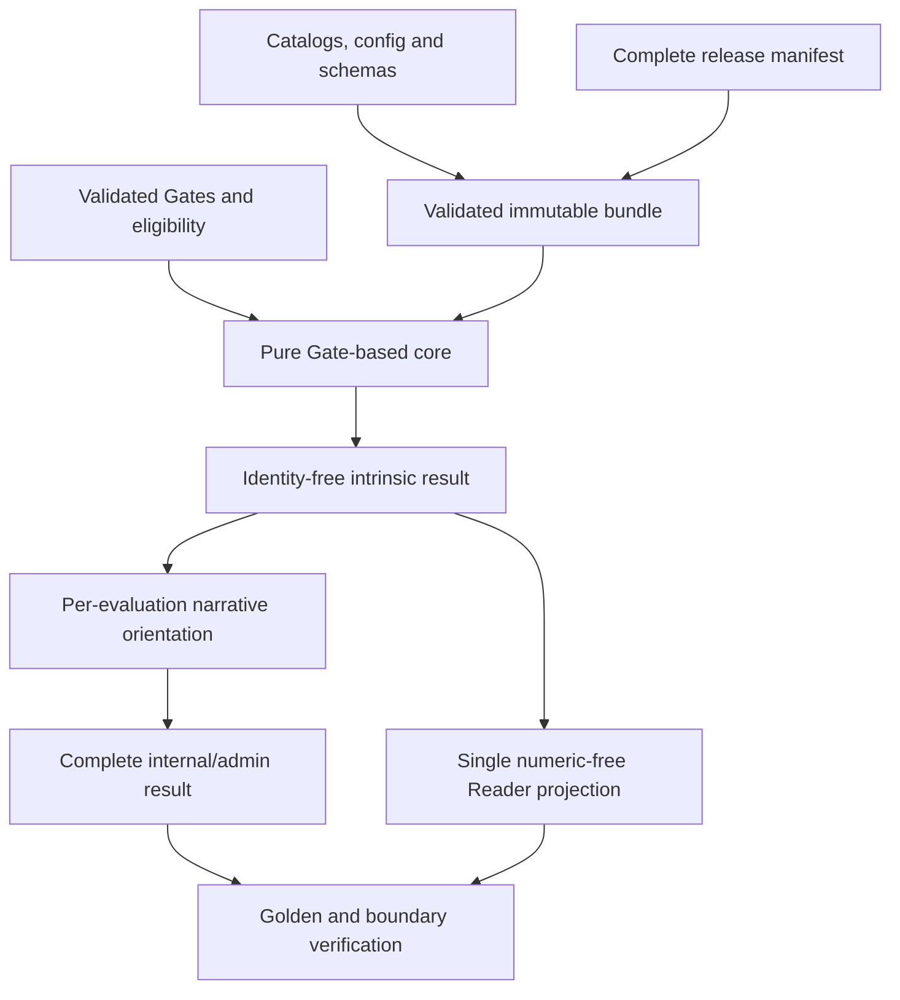

# HDE-EPIC040 — Whole-Change Implementation Plan v2.1

## 1. Identity, approval request and replacement boundary

| Field | Value |
| --- | --- |
| Logical identity | HDE-EPIC040-IMPLEMENTATION-PLAN |
| Version | 2.1 — complete successor; bounded ordinary denied-Plan revision of v2.0 |
| Artifact type / class | IMPLEMENTATION_PLAN / EPIC_IMPLEMENTATION_PLAN |
| Change | EPIC / HDE-EPIC040 / Separation Pass 3 |
| State | PLAN_PENDING_REVISED |
| Author/session | Same dedicated HDE-EPIC040 whole-change IA; retained for all decomposition, revisions and receipt duties |
| Execution posture | MANUAL_PROMPT_EXECUTION |
| Native inputs | IMPLEMENTATION_PLAN_ID: libfile_ee97f588a1b48191b465d0410c194606; PLAN_REVIEW_ID: libfile_aecae34a83e88191a205d22fd0348b62 |
| Exact predecessor | Plan v2.0, saved PLAN_PENDING; DENIED by separate Review v2.0; original SHA-256 f9ad6b36dfa753d7452aa3711b11333cdc1503a58d6f23493a51a0da266efe5c; body preserved |
| Governing review/redlines | Review v2.0 / DENY, Isis-50 2026-09-09T11:48:08Z; R040-IA30-01, R040-IA30-02, R040-IA30-03; embedded application report §14 |
| Approved Specification | HDE-EPIC040-SPECIFICATION v1.1; Thoth-17 APPROVE 2026-09-08T13:23:24Z against substantive v1.0 |
| Fresh mandatory Audit | HDE-EPIC040-IMPLEMENTATION-AUDIT v2.0 / AUDIT_COMPLETE / libfile_823ee8e9ecb0819185181ec7695265fb |
| Audit proof | libfile_2335e2e868148191a1a14564ef89c40a; audit-only |
| Research ADR / actual disposition | C040-06 v1.0, libfile_c9897950d9588191a2c822b65e7b31a8; NEW_CANON / APPROVED alternative A exactly by Isis-50 in Review v2.0 at 2026-09-09T11:48:08Z; unchanged proposal |
| Next review | IA-30, Isis-50, through mandatory GCFPE-ASSESS-10 |
| Approval/Proceed/implementation | None supplied by this Plan |

**Decision requested.** Isis-50: approve or deny this exact complete successor Plan v2.1, including the three individually applied Review v2.0 redlines in §14. Preserve C040-06's actual APPROVED decision without reopening its unchanged proposal. Plan v2.0 was separately DENIED; Plan v1.0 was PO-rejected and its historical approval does not transfer. This is ordinary IA-40 revision of replacement Plan v2.0, not a new Audit, rescope, remediation or implementation authorization.

The fresh Audit v2.0 was completed, saved and substantively read back before predecessor Plan v2.0 was drafted. This bounded revision retains that Audit and architecture, inspects affected current sources, and applies the returned redlines; it does not repeat the Audit. The unchanged approved Strategy Card, exact scope, completed research and separately decided ADRs remain authoritative inputs.

**Actionability conclusion.** The predecessor omitted an implementable no-user/admin chart-resolution path and its separate success proof. Sections 5.8 and 6.4 now specify admitted input classes, the existing internal identity bridge, complete chart sources and handoff shapes, mode-specific rails/refusals, the common evaluator and owned positive/adverse evidence. Section 8 retains every selected requirement and allocates the corrected boundary burden. The thirty-six assignments are complete and C040-06 is APPROVED unchanged; no general classification research or undecided ADR is deferred to PR authors. All three review corrections are accounted for in §14. This is the author's reviewable design-completeness claim, pending Isis-50's independent decision; no runtime feasibility test, implementation, CI or live readiness is claimed. Detailed per-file PR planning, PO Proceed, engineering review/CI, manual merges, QA and closure remain separate.

All runtime artifacts referenced here are in /Glow HDE 3.0. This document authorizes none of those later actions.

## 2. Exact scope and source collection

### 2.1 Six selected units

| PF09 unit | Exact source title | Source status | This Specification's disposition |
| --- | --- | --- | --- |
| HDE-SEPA005 | Production Magic10 mechanics configuration contract | Partial | In scope: coherent parent obligation |
| HDE-SEPA005.1 | Corrected canonical 36-Channel catalog | Partial | In scope |
| HDE-SEPA005.2 | Magic10 mechanics schema and default configuration | Partial | In scope |
| HDE-SEPA005.3 | Fail-closed mechanics configuration loader | Not done | In scope |
| HDE-SEPA005.4 | Mechanics configuration identity and deterministic comparison | Not done | In scope |
| HDE-SEPA005.5 | Separation implementation tests and governed artifacts | Not done | In scope |

### 2.2 Twenty-nine excluded Done/context units

| PF09 unit | Exact source title |
| --- | --- |
| HDE-SEPA001 | Persistence Layer |
| HDE-SEPA001.1 | Idempotent write path to DB |
| HDE-SEPA001.2 | Canonical byte-compare vs emitter |
| HDE-SEPA001.3 | Grants / DDL least-privilege posture |
| HDE-SEPA001.4 | No secrets/PII in logs |
| HDE-SEPA001.5 | Identity snapshot for services |
| HDE-SEPA001.6 | Persistence evidence indexing |
| HDE-SEPA002 | Error Envelope & Token Set |
| HDE-SEPA002.1 | Error envelope shape & numeric-free body |
| HDE-SEPA002.2 | Error transport headers (writers/errors) |
| HDE-SEPA002.3 | Error token map & casing |
| HDE-SEPA002.4 | Canonical JSON for error envelopes |
| HDE-SEPA002.5 | Reader↔CLI error parity & two-run identity |
| HDE-SEPA002.6 | CLI stderr/stdout discipline & usage exit 64 |
| HDE-SEPA002.7 | Writers/errors headers posture validation |
| HDE-SEPA002.8 | Error-envelope evidence & indexing |
| HDE-SEPA003 | Public Presenter / Emitter |
| HDE-SEPA003.1 | Single shared presenter/emitter symbol |
| HDE-SEPA003.2 | Canonical JSON & non-empty showcompat |
| HDE-SEPA003.3 | Streams discipline for presenter flows |
| HDE-SEPA003.4 | AB↔BA and two-run identity for presenter |
| HDE-SEPA003.5 | Preimage recompute & identity coupling |
| HDE-SEPA003.6 | Presenter evidence indexing |
| HDE-SEPA004 | Internal Ops Surface /internal/version |
| HDE-SEPA004.1 | GET/HEAD 200 parity |
| HDE-SEPA004.2 | Conditionals ignored (never 304) |
| HDE-SEPA004.3 | No-store & no ETag posture |
| HDE-SEPA004.4 | Two-run identity & identity coupling |
| HDE-SEPA004.5 | Internal ops evidence indexing |

These tables preserve all 35 pinned PF09.3 v1.1.3 units exactly once. Current v1.1.5 and its HDE-SEPA006 family do not replace or enlarge that inventory. Source statuses are historical inventory facts, not results of this Plan.

The selected requirement set is exactly K040-REQ-001 through K040-REQ-013. Acceptance set is exactly AC040-01 through AC040-09. Exact text remains in approved Specification §§5 and 11. The selected burden includes code, configuration, tests and governed evidence—not only documents.

### 2.3 Native and research lineage

| Artifact | Exact reference and role |
| --- | --- |
| Approved Specification v1.1 | libfile_12bab860949c8191881510875f051460; unchanged upstream scope/approval authority |
| Exact denied Plan v2.0 | libfile_ee97f588a1b48191b465d0410c194606; IA-40 native base, full original body retained |
| Exact Review v2.0 | libfile_aecae34a83e88191a205d22fd0348b62; IA-40 native redline authority; DENY with separate C040-06 APPROVE; original authored SHA-256 38fc2ee70cd2533d92a8e3e1526d6c0e33af326bb6755b612b90fb8cc1e28753 |
| Review v2.0 proof | libfile_317a2d48cbb88191800c69c204281445; audit-only |
| Fresh Audit / Plan creation proofs | libfile_2335e2e868148191a1a14564ef89c40a / libfile_629e236662ec81919376a539fb0b0a62; audit-only |
| Completed incoming IA-40 assessment / native handoff | libfile_369956d75c0081919353be5928fc5957 / libfile_b016de777d508191bf356c78722f9768; READY_WITH_LIMITS for this revision, no substantive approval |
| Reviewed Specification v1.0 | libfile_34fb7876c10081919a7f49306d08e91f; preserved substantive predecessor |
| Kickoff v1.0 | libfile_b2399ebf8778819191593946b1cdaa45; complete selected/excluded source membership |
| Fresh Audit v2.0 | libfile_823ee8e9ecb0819185181ec7695265fb; current findings IA040R-F01–F14 |
| New C040-06 ADR v1.0 | libfile_c9897950d9588191a2c822b65e7b31a8; complete proposal, all row evidence, original-source distinctions and PF12/PF01 drainage content |
| Research results v1.0 | libfile_4e75521ec5ec8191931024f60bf19de3 |
| Research evidence JSON v1.0 | libfile_79ecf48f01748191a8f6a55b780992a6; SHA-256 70ea20dc08981c991f4d8deb277b5e67a7a4ecd93b6b44781831ee60210c618a |
| Research query v1.0 | libfile_1ee719415ad8819181197eeb2bfbac82 |
| RCA v1.0 | libfile_01b0bc6232408191bc59e9f2bb5ee7d2; failure coverage §12 |
| Rejected Plan v1.0 | libfile_d477227231e48191a0d3960b5472b02e; immutable historical artifact only |
| Historical approving review v1.0 | libfile_c736de2930748191ad94ec289c0dcb1e; Isis-49 2026-09-09T03:57:16Z, no authority for this new Plan |
| Historical PR01 Instruction v1.0 | libfile_b8d9c4a0661481918225981b61e27c47; not dispatchable against replacement Plan |
| Historical Audit v1.1 / v1.0 | libfile_86e45fed0de48191965e232c5ee3aa79 / libfile_c8a9601b01688191a322b63a45f3c510 |
| Historical proof set | Audit libfile_662f408239e48191a1b7a74ffbb34c4d; Plan libfile_0eb44fee134881918458139b037e5440; review libfile_a8e3e65ad7108191aabe33578c90165e; never approval objects |

## 3. Single approved Strategy Card — preserved verbatim

The following four-key Card is copied unchanged from approved Specification §4. Its author-stage statements and named historical roles remain source history. The application report immediately afterward states this invocation's current phase and PO-directed reviewer change; it is not a competing Card.

### `outcome_fire`

- **Outcome:** After this change, the selected production Magic10 mechanics configuration contract is implemented as one coherent, deterministic, release-bound capability spanning the corrected catalog, strict default configuration, fail-closed loading, identity/comparison and governed verification.
- **Success signal:** Exact-source evidence decides every §11 criterion against the actual candidate and all thirteen kickoff requirements, without using prior token claims or document presence as implementation proof.
- **Scope line:** HDE-SEPA005 and its five selected subtasks only; the other twenty-nine PF09.3 units remain Done/context. PF09.3 v1.1.4 is outside the selected baseline.

### `surface_water`

- **Surface statement:** One governed production mechanics configuration and its already-governed internal FE/BE projections; no second public compatibility surface.
- **Promise check:** Preserve the existing public Reader's bands-only, numeric-free covenant, non-scoring Product metadata and FE/BE bundle compatibility. No public category expansion, payload extension or alternate configuration selector is authorized.
- **Minimal contract phrase:** One trusted release configuration supplies validated mechanics inputs and governed result contracts; consumers and evidence tools use projections, not competing authorities.

### `boundary_air`

- **Contract name:** Production Magic10 mechanics configuration contract.
- **Evolution posture:** Implement the current adopted configuration contract rather than retune it. Preserve current bundle schema identities and consumer promises. Where legitimate dependency regeneration is needed, it must reflect the governed source change without silently changing the consumer contract. A genuinely incompatible migration, structural mechanics change or new public promise requires its actual owner before execution; no coexistence period or migration mechanism is invented here.
- **Data posture:** Only the governed catalog, categories, caps, thresholds, source identities, immutable configuration/release identity, result schemas and bounded comparison evidence are needed. Identity or request metadata, viewer preferences, clocks, prose and mutable configuration handles must not become intrinsic operands. Exact allowed fields and values remain in the owning Canon.

### `stewardship_earth`

- **Ownership:** Master Scrum owns the kickoff. Isis-49 is the continuing Specification author selected by the Product Owner. The continuing Thoth reviewer owns approval or denial; IA, QA, authorized environment operators and the governed PF09 owner retain their later duties.
- **Phase signals:** Entry is the complete KICKOFF_READY handoff and the PO's selected class, identity, source and disposition. This authoring output is complete but SPECIFICATION_PENDING; its immediate destination is independent Thoth review through Analyzer middleware. Approval alone permits mandatory IA-10 audit-then-plan preparation, not implementation.
- **Safety note:** Invalid, ambiguous, stale, hash-mismatched or release-incoherent configuration produces no successful mechanics result. Comparison and current-row readiness remain read-only. Rollback is one complete compatible prior release, never mixed code/configuration/schema identities. No rollback or deployment is executed or authorized by this document.

### Strategy application to this replacement

- FIRE: the same production configuration outcome is retained. Exact row evidence, closed contracts, real mechanics and complete release closure replace the old uninvestigated prerequisite. No new empirical model or calibration scope.
- WATER: keep one Reader surface, existing FE/BE identities and exact Product metadata. Complete internal numerics stay internal; no second presenter or formula.
- AIR: retain the existing adopted versions and boundaries. Local candidate validation is explicitly not production admission; the former is a construction/test capability, not a alternate active configuration. No caller selector or hidden bypass flag.
- EARTH: fresh Audit preceded replacement Plan v2.0. Isis-50 denied that Plan and approved unchanged C040-06; the same whole-change IA applies the three exact redlines in this successor and returns it to the same Isis-50. Separate PR sessions and later action-time controls remain intact.
- Current phase: Separation design/approval preparation after completed research, not execution, verification, release or closure. Philosophy influenced the bounded component/release split, early same-root fixes, research single-home ADR and explicit reversibility.

## 4. Architecture and ownership

### 4.1 One data-to-result path

The complete configuration contract is a dependency-connected construction, not an isolated JSON file. All paths in this section are observed repository owners or exact missing paths required by current Canon; proposed internal symbols are labeled as design choices, not claimed existing APIs.




The core sees normalized Gates, an immutable bundle and release identity. Application UUID eligibility occurs before the core and any intrinsic cache lookup. Narrative orientation uses UUID only outside intrinsic math. Pure output and internal/admin augmentation are separate closed schemas. Reader receives its already-contracted public subset through the existing emitter.

### 4.2 Source owners and engineering homes

| Concern | Current controlling source | Owning repository locus / design consequence |
| --- | --- | --- |
| Static topology and classification | PF12 §2.1 plus C040-06 as actually APPROVED in Review v2.0 | catalog/gates_v1.json; catalog/channels_v1.json; schemas/channels_v1.schema.json |
| Adopted numerical model | PF01 §5.2–5.3 | catalog/magic10_mechanics_v1.json; engine/magic10/composite.py, signals.py, calculators.py; engine/core/core.py |
| Closed config and result shapes | PF12 §2.9 | Three named schemas under schemas/; registry_loader schema validation |
| Input admission and immutability | PF02 §2.1–2.2; PF12 §2.9 / manifest rules | engine/config/registry_loader.py; no I/O in core |
| Gate normalization | PF01 §4 | engine/bodygraph/gates.py; called by BodyGraph/application/readiness owners |
| Pair/config/release identity | PF01 §5.2.2; PF12 §§5–6 | Pure identity construction; manifest/source validation outside core |
| Reader/internal projection | PF05 §4.1.3 and §5.1.0; PF02 | engine/compat/compute.py, runtime/public.py, narratives/router.py, cli/main.py, http/compat_handler.py; adapter/http_reader.py; presenter/reader_v1/emitter.py |
| Current-row readiness | PF12 promoted path and PF01 Gate predicate | tools/bodygraph/check_magic10_gate_readiness.py; read-only current view |
| FE/BE projections | PF12 / PF14 configuration contracts | engine/config/bundles.py; tools/config/generate_bundles.py; docs/schemas/config_bundle_be.json and config_bundle_fe.json |
| Governed primary writers | PF12 §8 families / PF14 | tools/config/artifacts.py, generate_config_artifacts.py, tools/generate_registry_report.py; existing family-specific writers |
| Index/companion convergence | PF12 §8.1, §8.3, §8.6 | tools/evidence/update_evidence_index.py; preserve current sole-writer ownership |
| Complete release / external attestation | PF12 §§5–6 | scripts/cut_release_manifest.py, scripts/release_id_recompute.py, tools/evidence/build_release_attestation.py |
| Final repository explanation | Approved Plan / DOC-10 / PF03 | Final documentation PR after implementation units; existing docs homes, no runtime Plan mirror in repository |

### 4.3 Construction versus production admission

There are two explicitly different capabilities, not two mechanics authorities:

1. **Local authoring/candidate validation:** validate the proposed data/config/schema graph and generated compatibility artifacts in a selected repository root. It produces diagnostics and local verification results. It cannot return an active production mechanics handle or select a candidate release. It uses the same schema/relational validation implementation later used by release admission.
2. **Active release admission:** fixed authoritative config path, complete promoted roster, exact canonical bytes/hash/size, all schemas and cross-source closure, immutable configuration and release identity. Only this capability constructs the production-scoring bundle. No optional strictness argument, skip-manifest flag, caller config ID or fallback is exposed.

Suggested internal implementation separation in registry_loader.py: a validated capture/data structure with no active identity, and a distinct admitted immutable mechanics bundle produced only after complete release checks. These are proposed internal implementation types, not new public schemas. Base registry projections may consume the validated data they actually represent; they cannot advertise an active Magic10 identity.

Production generation of config.magic10 through its owning configuration generator must fail closed if active admission is unavailable. PR01 does not regenerate or advertise a new active config.magic10 snapshot from a partial release. It refreshes only the genuinely changed Channel/registry/FE/BE projections and their required companions. The active config snapshot is generated when the complete release exists.

Early component PRs do not claim deployable Magic10 completion. Each must pass its own current tests, changed-consumer regressions and applicable CI; later requirements are represented by explicit dependency checks, not waivers. Synthetic complete loader fixtures may test admission/refusal in isolation but are labeled fixtures, not the actual release. Once application cutover is wired, a partial actual release must refuse success; do not retain a successful old calculator as fallback to keep an integration test green. Deployment of the new Magic10 capability waits for complete verified release admission.

### 4.4 Acyclic dependency and safe promotion

Authoritative inputs are emitted first. Their exact source hashes are inserted into the canonical mechanics config. Complete promoted files are then represented in the manifest. release_id is derived from the manifest, never fed back into the manifest-bound config. Generated evidence and external attestation are downstream and never become source-hash inputs merely because they exist.

The old deployed release, if any, is not changed by repository authoring or merging. No automatic promotion of intermediate commits is assumed or authorized. If an actual repository workflow automatically deploys an intermediate branch/merge, the PR session must preserve the existing manual deployment boundary before that action; this Plan does not authorize disabling protections or changing deployment policy.

## 5. Complete technical design

### 5.1 Catalog correction — all assignments available

Use C040-06 §4 and §8, exact ADR libfile_c9897950d9588191a2c822b65e7b31a8, not model memory or schema enum inference. The data is available now:

| Channel | Gates | Gate-derived Center set | circuit_primary | substream | Channel-membership source |
| --- | --- | --- | --- | --- | --- |
| 01-08 | 1, 8 | g, throat | individual | knowing | Module 2, physical PDF page 38, printed page 15 |
| 02-14 | 2, 14 | g, sacral | individual | knowing | Module 2, physical PDF page 38, printed page 15 |
| 03-60 | 3, 60 | root, sacral | individual | knowing | Module 2, physical PDF page 38, printed page 15 |
| 04-63 | 4, 63 | ajna, head | collective | logic | Module 2, physical PDF page 43, printed page 20 |
| 05-15 | 5, 15 | g, sacral | collective | logic | Module 2, physical PDF page 43, printed page 20 |
| 06-59 | 6, 59 | sacral, solar_plexus | tribal | defense | Module 2, physical PDF page 52, printed page 29 |
| 07-31 | 7, 31 | g, throat | collective | logic | Module 2, physical PDF page 43, printed page 20 |
| 09-52 | 9, 52 | root, sacral | collective | logic | Module 2, physical PDF page 43, printed page 20 |
| 10-20 | 10, 20 | g, throat | individual | integration | Module 2, physical PDF page 37, printed page 14 |
| 10-34 | 10, 34 | g, sacral | individual | centering | Module 2, physical PDF page 41, printed page 18; Physical PDF68 / Module2 printed45, Exploration (34/10) |
| 10-57 | 10, 57 | g, spleen | individual | integration | Module 2, physical PDF page 37, printed page 14 |
| 11-56 | 11, 56 | ajna, throat | collective | sensing | Module 2, physical PDF page 45, printed page 22 |
| 12-22 | 12, 22 | solar_plexus, throat | individual | knowing | Module 2, physical PDF page 38, printed page 15 |
| 13-33 | 13, 33 | g, throat | collective | sensing | Module 2, physical PDF page 45, printed page 22 |
| 16-48 | 16, 48 | spleen, throat | collective | logic | Module 2, physical PDF page 43, printed page 20 |
| 17-62 | 17, 62 | ajna, throat | collective | logic | Module 2, physical PDF page 43, printed page 20; Physical PDF69 / printed46 starts Logic section; PDF73 / printed50 Acceptance (17/62); PDF74 / printed51 starts Abstract after continuation |
| 18-58 | 18, 58 | root, spleen | collective | logic | Module 2, physical PDF page 43, printed page 20 |
| 19-49 | 19, 49 | root, solar_plexus | tribal | ego | Module 2, physical PDF page 49, printed page 26 |
| 20-34 | 20, 34 | sacral, throat | individual | integration | Module 2, physical PDF page 37, printed page 14 |
| 20-57 | 20, 57 | spleen, throat | individual | knowing | Module 2, physical PDF page 38, printed page 15; Physical PDF65 / Module2 printed42, Brainwave (57/20) |
| 21-45 | 21, 45 | ego, throat | tribal | ego | Module 2, physical PDF page 49, printed page 26 |
| 23-43 | 23, 43 | ajna, throat | individual | knowing | Module 2, physical PDF page 38, printed page 15 |
| 24-61 | 24, 61 | ajna, head | individual | knowing | Module 2, physical PDF page 38, printed page 15 |
| 25-51 | 25, 51 | ego, g | individual | centering | Module 2, physical PDF page 41, printed page 18 |
| 26-44 | 26, 44 | ego, spleen | tribal | ego | Module 2, physical PDF page 49, printed page 26 |
| 27-50 | 27, 50 | sacral, spleen | tribal | defense | Module 2, physical PDF page 52, printed page 29 |
| 28-38 | 28, 38 | root, spleen | individual | knowing | Module 2, physical PDF page 38, printed page 15 |
| 29-46 | 29, 46 | g, sacral | collective | sensing | Module 2, physical PDF page 45, printed page 22 |
| 30-41 | 30, 41 | root, solar_plexus | collective | sensing | Module 2, physical PDF page 45, printed page 22 |
| 32-54 | 32, 54 | root, spleen | tribal | ego | Module 2, physical PDF page 49, printed page 26 |
| 34-57 | 34, 57 | sacral, spleen | individual | integration | Module 2, physical PDF page 37, printed page 14 |
| 35-36 | 35, 36 | solar_plexus, throat | collective | sensing | Module 2, physical PDF page 45, printed page 22 |
| 37-40 | 37, 40 | ego, solar_plexus | tribal | ego | Module 2, physical PDF page 49, printed page 26 |
| 39-55 | 39, 55 | root, solar_plexus | individual | knowing | Module 2, physical PDF page 38, printed page 15 |
| 42-53 | 42, 53 | root, sacral | collective | sensing | Module 2, physical PDF page 45, printed page 22 |
| 47-64 | 47, 64 | ajna, head | collective | sensing | Module 2, physical PDF page 45, printed page 22 |

Each Channel retains exactly id, gates, centers, circuit_primary, substream, primary_domain, domains and flags. Gate pairs are ascending and match the ID; Centers are sorted distinct sets derived from the Gate Catalog. All 36 metadata triples are fixed by ADR §8 and the current before-state. Do not discard or “clean up” Product fields.

Static reconciliation established 32 changed rows, 24 primary-field changes, 30 substream changes, five Gate-array reorderings and no Center-set changes. The required pre-mutation check is now **verify the supplied complete table and the actual C040-06 disposition against the current before-state**, not “obtain unspecified research.” If the repository has materially changed, report the exact drift and preserve user changes; mere SHA movement is not a new acceptance gate.

### 5.2 Strict Gate representation

One normalizer in the Canon-required engine/bodygraph/gates.py accepts a nonempty raw array of exact integers 1..64 or canonical decimal strings "1" through "64". Reject bool, float, signed/zero-padded/whitespace/decimal strings, out-of-range values, empty/missing arrays and duplicates after normalization, including [1,"1"]. Do not deduplicate invalid input into success.

Return an ascending unique tuple, unsigned 64-bit mask with Gate g at bit g-1, and exactly sixteen lowercase hexadecimal digits. Normalizer has no I/O or environment access. Persistence, resolver/adapter, application and readiness all call this same function. Center/catalog validation occurs through the admitted registry, not a second hardcoded topology.

Production Reader accepts only exact canonical lowercase UUID input IDs under PF05; it does not accept raw Gate arrays from public callers. The normalizer applies to the resolved complete chart.

### 5.3 Exact configuration construction

Construct one authoritative catalog/magic10_mechanics_v1.json and its strict schema. Initial identities: schema magic10_mechanics_config.v1; config_id m10-channel-state-v1.0.0; result_schema magic10_result.v1. Top-level keys are exactly category_weights, config_id, profiles, response_scale, result_schema, rounding, schema, signal_scale, signals and sources.

Fixed scales: response_scale=10000, signal_scale=2. rounding has signal=round_half_up_to_half_score_unit and category=round_half_up_once. No timestamp, note, seed, label, extra key, generated snapshot pointer or mutable handle.

sources has exactly four rows, each exactly path and sha256: caps→catalog/magic10_caps.json; categories→catalog/magic10.json; channels→catalog/channels_v1.json; thresholds→math/thresholds.json. Hash the validated exact emitted source bytes. Source-hash literals are not copied from the old uncorrected catalog. After the initial adopted config, a changed referenced source requires its own immutable config identity and complete release consequence; no in-place active-release mutation.

Profiles are an ASCII-profile-ID-ordered array. Every row has exactly profile_id and a nested responses object:

```json
{"profile_id":"activation_bp_v1","responses":{"companionship":5000,"compromise":2500,"dominance":7500,"electromagnetic":10000,"none":0}}
```


This is one complete illustrative profile row, not the entire config file. The three exact rows are determined by this table:

| profile_id | none | companionship | dominance | compromise | electromagnetic |
| --- | --- | --- | --- | --- | --- |
| activation_bp_v1 | 0 | 5000 | 7500 | 2500 | 10000 |
| coherence_bp_v1 | 0 | 10000 | 5000 | 2500 | 7500 |
| expression_bp_v1 | 0 | 7500 | 5000 | 2500 | 10000 |

Zero is a required valid response for none; it is not a valid Channel/category weight. All numeric schema fields reject booleans, floats and strings rather than coercing them.

The complete adopted twenty-signal map is reproduced from PF01 §5.2.4 for exact construction:

| Category | Signal ID | Exact construct | Operation or profile | Default Channel map |
| ----- | ----- | ----- | ----- | ----- |
| harmony | `rapport_delta` | Structural support through needs, values, care, communal bargains, and trusted transmission | `coherence_bp_v1` | `19-49`, `26-44`, `27-50`, `37-40` |
| harmony | `resonance_strength` | Attunement through rhythm, intimacy, mood-sensitive openness, and listening or witnessing | `coherence_bp_v1` | `05-15`, `06-59`, `12-22`, `13-33` |
| heat | `spark_intensity` | Relational charge through intimacy, shock, desire, and provocation or spirit | `activation_bp_v1` | `06-59`, `25-51`, `30-41`, `39-55` |
| heat | `momentum_flux` | Activated movement through mutation, deeds, commitment, and change or experience | `activation_bp_v1` | `03-60`, `20-34`, `29-46`, `35-36` |
| communication | `signal_clarity` | Capacity to formulate, organize, rationalize, or realize mental content | `expression_bp_v1` | `04-63`, `17-62`, `23-43`, `24-61`, `47-64` |
| communication | `exchange_density` | Capacity to exchange stories, emotional expression, witnessing, intuitive awareness, and transmission | `expression_bp_v1` | `11-56`, `12-22`, `13-33`, `20-57`, `26-44` |
| alignment | `vector_cohesion` | Coherence of direction, leadership, authentic presence, and action from conviction | `coherence_bp_v1` | `02-14`, `07-31`, `10-20`, `10-34` |
| alignment | `axis_agreement` | Coherence of principles, values, purpose, and continuity or ambition | `coherence_bp_v1` | `19-49`, `27-50`, `28-38`, `32-54` |
| comfort | `soothe_index` | Accessible intimacy, emotional openness, recognition of needs, and communal support | `coherence_bp_v1` | `06-59`, `12-22`, `19-49`, `37-40` |
| comfort | `buffer_resilience` | Embodied support through rhythm, survival awareness, preservation, and instinctive power | `coherence_bp_v1` | `05-15`, `10-57`, `27-50`, `34-57` |
| consistency | `pattern_integrity` | Repeatable rhythm, concentration, skill development, detail, and correction | `coherence_bp_v1` | `05-15`, `09-52`, `16-48`, `17-62`, `18-58` |
| consistency | `variance_stability` | Continuity through pulse, commitment, adaptation, and complete cycles | `coherence_bp_v1` | `03-60`, `29-46`, `32-54`, `42-53` |
| expansion | `growth_tendency` | Activation of mutation, improvement, transformation, and maturation | `activation_bp_v1` | `03-60`, `18-58`, `32-54`, `42-53` |
| expansion | `horizon_reach` | Activation through curiosity, meaningful risk, discovery, and new experience | `activation_bp_v1` | `11-56`, `28-38`, `29-46`, `35-36` |
| creativity | `novelty_factor` | Activation of contribution, mutation, unique insight, and initiation | `activation_bp_v1` | `01-08`, `03-60`, `23-43`, `25-51` |
| creativity | `expression_flow` | Expression through authentic presence, storytelling, emotion, talent, and experience | `expression_bp_v1` | `10-20`, `11-56`, `12-22`, `16-48`, `35-36` |
| drive | `willpower_current` | Activation of resources, material will, initiative, enterprise, and ambition | `activation_bp_v1` | `02-14`, `21-45`, `25-51`, `26-44`, `32-54` |
| drive | `focus_pressure` | Activation of concentration, improvement pressure, deeds, struggle, and cycle completion | `activation_bp_v1` | `09-52`, `18-58`, `20-34`, `28-38`, `42-53` |
| balance | `equilibrium_score` | Bilateral distribution of selected one-owner Channel mass | `twice_min_owner_mass_v1` | `02-14`, `07-31`, `21-45`, `26-44`, `32-54`, `37-40` |
| balance | `counterweight_ratio` | Share of selected Channel mass expressed through companionship or electromagnetic completion | `companionship_em_mass_v1` | `05-15`, `06-59`, `10-20`, `13-33`, `27-50`, `39-55` |

Ordinary signal rows have exactly channels, operation=weighted_state_sum_v1, profile_id and signal_id. Balance rows have exactly channels, operation and signal_id; no profile_id. Every Channel member is exactly channel_id plus weight=1 initially. Sort each list by channel_id. Preserve signal order obtained by flattening caps input pairs in category order; do not sort that ordered array alphabetically.

There are 90 default Channel-to-signal rows, every canonical Channel is used, no Channel repeats within a signal or appears in both signals of one category. Membership lists contain one through six unique valid rows. Channel weights and category-input weights have the already governed integer domain 1..3; this Plan chooses the adopted default 1 and [1,1], not discretionary retuning.

category_weights contains ten rows in catalog/magic10.json order: category_id, reducer=weighted_mean_half_unit_v1, weights=[1,1]. Join the ordered inputs from caps; do not duplicate signal IDs in this object. Caps remain the sole input-pair/min/max authority. Preserve existing category order and seed subset semantics; do not create missing seed categories.

### 5.4 Schemas and relational validator

Create schemas/magic10_mechanics_v1.schema.json, magic10_result_v1.schema.json and magic10_compat_result_v1.schema.json with closed objects at every governed level. Update schemas/channels_v1.schema.json for the complete required non-null enum including ego.

Schema validation is necessary but not sufficient. After duplicate-aware parse and raw canonical-form check, execute the actual local schema and then a shared relational validator for exact rosters/order, endpoint/catalog closure, caps joins, profile orderings, no double-map, fixed operations/scales, source paths/hash equality and initial adopted defaults. Reference resolution is local and bounded to the repository's selected schema set; no remote schema fetch.

Pure result top-level: exactly schema, config_id, release_id, pair_key, signals and categories; schema magic10_result.v1. Exactly twenty ordered signal rows {signal_id,q}, q integer0..200; exactly ten ordered category rows {category_id,score,band}, score integer0..100 and band Cool/Open/Warm/Glow. release_id/pair_key lowercase64hex. No identifiers, viewer preferences, keys, timestamps or copies of mutable config.

Internal result: schema magic10_compat_result.v1, same identity/scalar arrays, each category additionally has required nonempty shared_key, personal_lo_to_hi_key and personal_hi_to_lo_key. No extra category/top-level fields. Validate at production boundary and in independent tests, not only dataclass construction.

Preserve current docs/schemas/config_bundle_be.json and config_bundle_fe.json identities and promised fields. A stricter Channel source does not require replacing those schemas: the current BE string/null field admits the new non-null strings; FE remains its existing trimmed projection. Validate all generated examples against unchanged identities and compare metadata. No incompatible migration is presently required.

### 5.5 Immutable loading and source identity

Load outside core. Resolve one repository root once. Reject path escapes, symlink escapes, missing/ambiguous authoritative paths and unexpected source locations. Capture authoritative bytes and validate those captured bytes; do not hash one read while parsing another. Recheck for source change before publication/admission to reject an inconsistent capture.

Reject duplicate JSON object keys before json.loads loses them. Validate UTF-8/no BOM, one terminal LF, sorted compact objects, governed array order and numeric form. Re-serialization compares to disk bytes; it does not repair invalid active input and then hash the repaired copy. Decode only exact schema types, with explicit bool rejection for integers.

Run actual owning schemas and relational closure. Validate every manifest/member format before exact hash and size. The production loader rejects missing or extra promoted rows, path/hash/size mismatch, invalid formats and noncanonical bytes. It cannot use generated config snapshots, Markdown, a caller config ID, aliases, candidates or prior bundle as fallback.

Freeze recursively: frozen records, tuples for ordered collections, immutable mappings/records for every nested map. Copy out of temporary parser structures before freezing; no reference to mutable input survives. Test attempted mutation at every nested collection/response/source/caps/Channel level. Freeze after all validation, never as a substitute for it.

Retain configuration-byte digest, source-byte identities and manifest-derived release identity separately inside the immutable internal bundle. No free caller override enters scoring. Pair identity's fields stay exactly PF01's preimage; a useful internal digest is not an extra public/config field.

### 5.6 Canonical pure computation and numerical reference

The exact canonical call is compute_core(a, b, cfg, release_id). a/b contain validated normalized Gates, not precomputed compat_score. cfg is the admitted immutable bundle. No optional CoreConfig, band_priority, three-argument overload, uid hash seed or successful legacy calculator remains on the canonical path.

engine/magic10/composite.py classifies all thirty-six Channels once using C040-06 §6 / PF01 §6.1, normalizing full owner by numeric Gate-mask order. engine/magic10/signals.py evaluates the eighteen ordinary and two Balance operations. engine/magic10/calculators.py applies caps and the category reducer. engine/core/core.py coordinates pure inputs to the complete result and identity, with no time, file/database/network/environment/randomness/import-time work.

Illustrative pure integer arithmetic, derived from the adopted equations; this is design reference, not executed implementation:

```python
def ordinary_q(weighted_response_sum: int, total_weight: int) -> int:
    return (weighted_response_sum + 25 * total_weight) // (50 * total_weight)


def equilibrium_q(owner_lo_mass: int, owner_hi_mass: int, total_weight: int) -> int:
    return (800 * min(owner_lo_mass, owner_hi_mass) + total_weight) // (2 * total_weight)


def counterweight_q(companionship_or_em_mass: int, total_weight: int) -> int:
    return (400 * companionship_or_em_mass + total_weight) // (2 * total_weight)


def category_score(q0: int, q1: int, w0: int, w1: int, lower: int, upper: int) -> int:
    c0 = min(2 * upper, max(2 * lower, q0))
    c1 = min(2 * upper, max(2 * lower, q1))
    total_weight = w0 + w1
    score = (w0 * c0 + w1 * c1 + total_weight) // (2 * total_weight)
    return min(100, max(0, score))
```


Preconditions are validated positive integer weights and closed-domain responses/caps; the sample does not authorize permissive coercion. Round once after the complete weighted signal sum and once at category reduction. No floats. Bands use inclusive maxima 24,49,74,100: 0..24 Cool,25..49 Open,50..74 Warm,75..100 Glow.

Numerical responses are Glow-authored Product synthesis, not empirical relationship effect sizes or clinical doctrine. C040-06 changes classification evidence, not the adopted numeric model.

### 5.7 Intrinsic identity, cache and application orientation

Chart fingerprint preimage is exactly {schema:"magic10_chart_fingerprint.v1",gate_mask_hex}. Pair preimage is exactly schema magic10_pair_preimage.v1, members [fingerprint_lo,fingerprint_hi] in numeric Gate-mask order, config_id, release_id and result_schema magic10_result.v1. Hash canonical bytes using the owning serializer. Equal masks retain two equal members; no UUID tie-break enters intrinsic math.

Cache key: magic10:v1:<pair_key>. If a cache boundary is used by the current application, a hit must validate schema and embedded pair_key/config_id/release_id. Stale data is recomputed only with both valid Gate sets; otherwise ERR_M10_STALE_RESULT. Cache is an application concern, never core I/O. Do not build new persistent cache infrastructure for this Epic; use an injectable bounded cache seam and prove hit/stale/miss behavior without requiring production storage.

After complete chart resolution, decide UUID eligibility before core, router or intrinsic cache:
- Same canonical UUID and equal complete normalized projection: valid ineligible result; no core/cache/router/pair_key and Reader categories=[].
- Same canonical UUID and unequal complete normalized projection: ERR_READER_INVALID_CHART, not a successful ineligible result.
- Distinct canonical UUIDs, including equal Gate masks: eligible; full complete result.

Normalize narrative order by (gate_mask,canonical_person_id). UUID ASCII order breaks only equal-mask directional ties. Invoke router in both normalized directions; shared_key must agree or augmentation fails. Assemble full internal result per evaluation. Do not cache that augmented result solely by identity-free pair_key: different identities with the same Gates share intrinsic math but not necessarily personal orientation/keys. Caller projection chooses its personal key without rewriting stored symmetric output or intrinsic identity.

### 5.8 Bounded application/persistence/transport integration

Preserve complete chart data through engine/bodygraph/projection.py, v2_adapter.py, resolver.py and mapped_cache.py. Apply the shared normalizer before mapped persistence. Do not synthesize missing Gates, convert an incomplete chart to a UID-only success or perform a backfill.

Production Reader's existing contracted POST /api/reader?v=1 accepts only exact a_id/b_id lowercase canonical UUIDs. Implement its missing success path through read-only public.hde_body_graphs_current lookup for vendor='hdapi', selecting user_id/vendor/vendor_version/input_fingerprint/payload. Require both complete normalized projections. No writes, vendor call, arbitrary-string UUID5 conversion or fallback on this public path. Existing DB-access abstraction owns query construction; parameterize IDs and preserve least privilege and error mapping.

**Admin and no-user resolution contract — R040-IA30-01.** PR04 owns the following bounded application change, using PR01's strict contracts, PR02's normalizer/immutable bundle and PR03's one Gate-based core. The existing entry points remain `conjunction_public_resolved` in engine/compat/compute.py, the existing showcompat/conjunction branches and input helpers in engine/cli/main.py, and their sanctioned BodyGraph resolver. No new public route, CLI identity flag, loader migration or birth-to-Gates calculator is introduced.

**Source authority.** PF01 v1.3.7 §4 defines complete EvaluationParty, strict Gates and self/identity eligibility; §4.6 permits architecture-sanctioned resolution to supply identity without requiring the caller to construct it. PF02 v2.4.5 §§2.2.1 and 3.1 distinguish already-resolved computation, local-first resolution and birth-only/no-user admission. PF05 v2.5.2 §§3.7, 4.1.2, 6, 7.1–7.4 retain no-user inputs, CLI source selection, guarded vendor routes, read-only conjunction, dry-run/non-production persistence boundaries and separate proof classes. Current code supplies the existing birth seed, `resolve_db_user_id`, current-row lookup, v2 mapping and full-payload acquisition seams. Exact current source identities and bounded repository observations are in §9. These clauses authorize internal resolution; they do not authorize a public Reader identity conversion or a new persistent person/account model.

| Admitted application input | Identity resolution inside the boundary | Complete chart source and output |
| --- | --- | --- |
| Already-resolved chart with its existing trusted engine identity/provenance | Carry the resolver/DB `user_id`; canonicalize its UUID spelling. An admitted internal engine alias uses the existing `resolve_db_user_id` bridge before UUID canonicalization. Cross-check every supplied identity slot against its provenance; conflicting identities refuse. | Preserve the complete mapped BodyGraph, not just type/Gates. Validate and normalize it into the EvaluationParty described below. No vendor or DB lookup is needed for a complete file/stdin projection. A chart lacking both identity provenance and a complete sanctioned birth tuple is missing required internal metadata; do not invent an identity from its Gates. |
| Existing stored-user/admin lookup | Resolve the admitted engine user key using `resolve_db_user_id`, then `str(UUID(resolved_id))`; use that canonical value for the parameterized lookup and application identity. | Use the actual read-only lookup (`_fetch_db_bodygraph` or the existing injected local lookup), carrying payload plus verified row identity/source metadata. Resolver status/UID/cache metadata alone is not a chart. Validate a hit; an invalid hit fails instead of being hidden by a vendor fallback. |
| Complete birth-only/no-user input: birthdate, birthtime and location for each party, with no caller person_uid/user_id/app ID | Validate the existing birth input contract, then reuse `_derived_birth_uid` in engine/compat/compute.py. Its existing `birth-` seed is SHA-256 of `birth\|{trimmed birthdate}\|{trimmed birthtime}\|{trimmed location}`, first 32 hex characters. Pass that seed through existing `resolve_db_user_id` and canonicalize the returned UUID. This is the existing internal durability-alias bridge applied inside the sanctioned resolver, not a public identity requirement or a claim that an application user exists. | First use the permitted local lookup for that internal key. A verified complete hit can succeed with network rails closed and with no user-row creation. On an allowed miss, acquire a complete chart through the guarded existing route as specified below. Birth input/derived UUID alone never produces Gates, type, scores or a successful compat result. |

The existing `resolve_db_user_id` accepts the pinned synthetic alias map, otherwise preserves UUID inputs or derives UUID5 under its existing namespace for internal string aliases. It does not itself validate a chart or establish account ownership. Its raw UUID return may preserve noncanonical spelling, so the application adapter must normalize and validate the final RFC-4122 UUID before EvaluationParty creation. The existing `person-...` label is display/provenance metadata, never accepted literally as a canonical UUID. Where a mapped chart uses that label, check matching top-level/nested labels and the trusted resolver context that created them; only then bind the application copy to the resolved canonical UUID. Do not strip a prefix and assume ownership, override an independently conflicting identity, use the CLI's generic fallback UID, or derive identity from Gate masks. The existing birth tuple seed is deterministic lookup identity, not a new assertion of civil/person identity; contradictory charts under the same resolved identity take the inconsistent-self failure path. Preserve separately supplied trusted identities for distinct people even when their masks coincide.

**Source selection and rails.** The caller's existing source mode remains authoritative:

- Complete file/stdin charts are resolution-free: no DB or vendor fallback. Incomplete/type-only/birth-only file content cannot masquerade as a complete resolved chart.
- CLI `db` and `auto` remain DB-only under PF05 §4.1.2. A miss is the existing missing-chart failure; remove the current auto-mode birth fallback to vendor. Explicit CLI `vendor` remains vendor-only and uses the existing guarded route; do not silently replace it with a DB hit.
- The direct sanctioned no-user resolver retains PF02's local-first behavior. A local hit must bind the requested internal identity and, where supplied by that source, the expected input_fingerprint/vendor provenance. The birth seed and vendor input_fingerprint are distinct identities; use the owning request normalizer for the latter, never substitute one digest for the other. A local miss may acquire only when that invocation's existing route and operator authority permit acquisition and the existing SAFE_MODE/ALLOW_NETWORK/route guards pass. The resolver does not turn rails on for itself.
- Conjunction/chart resolution is read-only: use the existing dry-run acquisition posture with no upsert. Production user-bound persistence remains prohibited. Independently invoked non-production ingestion retains its separately governed explicit upsert, mapped validation, persistence and readback controls; it is not an implicit compatibility fallback. Readiness and the public Reader never acquire or write.
- Close the scoped acquisition capability before normalization/evaluation, including exception paths; restore the caller's original environment rather than editing process-wide settings. Do not use a second HTTP client, route inference from a base URL, unsupported timezone defaults or an automatic retry on another source. Keep existing route-family, credential and operator authorization checks. If an existing input timezone override cannot be honored by its selected route, preserve its owning refusal; do not silently use UTC.

**Acquisition and complete projection handoffs.** Introduce a private chart-resolution result within engine/bodygraph/resolver.py (proposed internal type `ResolvedCompatChart`, not a public JSON schema) with `canonical_person_id`, complete `mapped_chart` and private source provenance (`source`, bound `user_id`, `vendor`, `vendor_version`, `input_fingerprint` when present). No provenance becomes a scoring operand or new public field. Refactor the current acquisition internals to return this result to compatibility while preserving the existing public `bg:resolve` envelope and existing resolver entry points.

| Handoff | Exact material shape and decision |
| --- | --- |
| Existing v2 full-chart route → existing v2 adapter | Reuse configured full `ChartResult` route and `V2ChartAdapterContext`; context identity comes from the resolver, not the birth caller. `adapt_v2_chart_payload` already returns `resolved` and `cache` on valid full data. `ChartSimpleResult`, missing required full-result fields and route/context mismatches refuse. No fabricated adapter field is allowed. |
| Resolver → compatibility acquisition result | Retain the adapter's complete `resolved` mapping and verified context, including on dry-run. For existing v1 ingestion, `IngestOutcome.payload` is the actual payload source; the wrapper currently discards it. Preserve that payload at the private seam, but admit it to Gate-based success only if it supplies the complete governed mapped projection. Raw provider JSON or a type-only legacy object is not automatically a normalized chart. Do not guess a v1 field translation or substitute v2 fields into an incomplete v1 response. The already-governed full v2 mapping supplies the concrete birth-only success route. Preserve v1 transport availability and its typed invalid/missing-chart refusal where a complete governed projection is unavailable. |
| Existing local lookup → same acquisition result | Carry the actual complete stored mapped payload and bound current-row/internal identity. The current `resolve_bodygraph` auto/db metadata-only status is not a replacement for this lookup. A separately authorized non-dry ingest uses actual mapped-cache readback; a rows-written count or cache key cannot substitute for its chart. No SEPA006 loader migration is included. |
| Mapped payload → shared normalizer/projector | The mapped shape is `{bodygraph:{authority,birthDateUtc,centers,channelsLong,channelsShort,definition,gates,profile,strategy,type},person:{person_uid},person_uid}` with only the already allowed transient `source` removed by `project_bodygraph`. Preserve all ten BodyGraph values; never truncate to type or Gates. Validate complete shape, unsafe/unknown fields and identity-slot consistency before replacing the application copy's label slots with the verified canonical UUID. Preserve source-specific raw records unchanged. |
| Strict raw Gates → canonical projection | At every mapped ingress, validate raw `bodygraph.gates` before deduplication or persistence: nonempty array of integers 1..64 or canonical decimal strings; reject bools, whitespace, signs, leading zeroes, floats, missing/empty values, duplicates (including integer/string equivalents), out-of-range and unresolved catalog references. Sort only after validation. Retain all other normalized projection fields for equality; no default/synthesized mechanics values. |
| Projection → EvaluationParty → eligibility | Produce `{canonical_person_id, complete_normalized_projection, gates:ascending_unique_tuple, gate_mask:uint64, gate_mask_hex:16_lower_hex, chart_fingerprint}` according to PF01 §§4/5.2 and PR02. The mask/fingerprint come from the validated Gate tuple; no source/identity metadata contaminates them. Validate both parties independently before eligibility and pass the same immutable admitted mechanics bundle to PR03's evaluator. |

`_resolve_party` must replace both its early birth-to-UID-only return and resolved-UID-only return with the above chart-bearing result. `_person_and_chart_from_payload` and `_conjunction_party_from_payload` must preserve the complete chart and trusted identity context rather than dropping Gates. Ordinary birth-flag showcompat must use the same sanctioned resolver and existing birth-seed bridge, not a parallel CLI hash identity or `_chart_for` type synthesis. Existing complete file/stdin and stored-user flows retain their source policies; malformed legacy shapes fail truthfully. Pure `conjunction_public` receives only resolved/validated application inputs; it does not acquire, invent identity or run a second scoring formula.

The following is orchestration pseudocode for the proposed internal seam, not executed code or a new public API:

```python
def resolve_compat_party(raw, source_policy, bundle, lookup, acquisition):
    identity = resolve_existing_internal_identity(raw)  # birth seed or trusted engine/DB key
    mapped, provenance = obtain_complete_chart(
        raw, identity, source_policy, lookup, acquisition
    )  # source rules/rails above; no writes; scope closed before returning
    projection = validate_complete_projection(mapped, identity, provenance)
    return make_evaluation_party(projection, identity, bundle)

left = resolve_compat_party(a, policy, bundle, lookup, acquisition)
right = resolve_compat_party(b, policy, bundle, lookup, acquisition)
eligibility = validate_pair_eligibility(left, right)
if eligibility.is_self:
    return existing_ineligible_carrier()  # no core, intrinsic cache, router or pair_key
return evaluate_and_augment(left, right, bundle)  # one governed core; §5.7 ordering
```

Both complete projections must agree for a same-UUID self result; same UUID with any unequal normalized chart field refuses, including a profile-only change. Distinct canonical UUIDs with equal masks remain eligible. Normalize direction by `(gate_mask, canonical_person_id)` as §5.7 requires; reverse inputs must yield identical complete symmetric result bytes, with caller-personal presentation remaining separately owned. Acquiring charts is never evidence that a release is admitted: absent/invalid active release still refuses, with local fixture candidates remaining test-only.

**Failure, privacy and recovery.** Preserve provider/transport failures at their owning boundary: closed rails use `PROVIDER_REFUSED`/`PROVIDER_NETWORK_BLOCKED`; failed lookup uses the existing missing-chart path; malformed provider transport stays its provider error. Missing chart/Gates/required resolved identity maps through the existing application error mapping to `ERR_READER_MISSING_PARAM`; invalid chart/Gates, conflicting identity or inconsistent self maps to `ERR_READER_INVALID_CHART` at Reader-compatible application boundaries. Existing CLI carriers/exit rules translate these through their governed mappings, never print a successful matrix or raw request. Inspect and adjust only those already owned error mappings in PR04; do not invent an error token or weaken refusal to preserve an old fixture. Canonical Reader UUID grammar remains strict before lookup; the internal alias bridge is unreachable there. Log only permitted value-free operational keys; no birth tuple, chart, credentials, person label or identity-bearing debug dump is introduced. In particular the no-user dry-run seam must not inherit legacy ingest logging of user_id as an authorization to emit private values. No database/account creation, persisted alias map, backfill or production mutation is needed. On any resolution/validation failure, close acquisition, produce the owning failure and call neither core nor intrinsic cache/router. Restore resolver/projection/consumer changes as one compatible PR04 slice if rolled back; no successful UID/hash fallback is retained.

engine/compat/compute.py becomes orchestration, not a second calculator. engine/runtime/public.py obtains the harmony band from the validated result, not ts_v0. engine/http/compat_handler.py preserves dev/admin admission and production restrictions of its existing route. engine/cli/main.py emits complete magic10_compat_result.v1 for eligible ordinary showcompat stdout, with no legacy wrapper; Reader dump remains the separate existing single-emitter path. Self-pair handling must obey existing carrier/exit contracts and must not fabricate a pure/internal result where no such result exists.

The Reader envelope stays exactly reader_version, eligible, categories, meta, release_id, idempotence_hash; categories is either empty or the existing harmony band row. No q, score, UUID, Gate data, narrative keys, config object or pair_key leaks. Use presenter/reader_v1/emitter.py and existing transport headers/conditional/error behavior; no new presenter.

This is the necessary configuration/result/application dependency slice. It does not claim completion of every broader Reader, narratives, vendor or cache capability or of HDE-DIST008.1.

### 5.9 Golden comparison and readiness

The governing golden fixture path is tests/fixtures/magic10/v1/goldens.json. Build the complete eight-case collection from PF01 §9.5, with exact fixed expected objects/bytes/hashes and explicit kernel/application case type. Comparator belongs in existing tools/config tooling with tests in the existing config/core/application test homes; a proposed helper within tools/config/artifacts.py may coordinate comparison but must call canonical core/application functions, never implement another formula.

Comparator inputs: explicit local candidate root and complete golden collection. Validate those inputs, load via the same validation/admission machinery appropriate to the fixture, execute the canonical operation indicated by each case, compare all fields/order/identity/bytes, report every mismatch deterministically. It never activates a candidate, rewrites config/manifest/fixtures, replaces expected output or repairs a mismatch. Any new CLI spelling is a PR-level implementation proposal requiring exact tests/docs; this Plan does not claim an unimplemented command is runnable.

| Golden | Complete obligation / fixed oracle |
| --- | --- |
| M10-G001 | All-none kernel vector: all twenty q and ten scores zero, all bands Cool |
| M10-G002 | All-companionship kernel vector, not claimed a realizable full Gate-pair chart: category scores [100,50,75,100,100,100,50,63,50,50], with matching bands and complete signal output; tests both Balance operations |
| M10-G003 | Ownership Balance kernel oracle: three mapped one-owner Channels per side produces equilibrium q=200; all mass on one owner produces q=0 |
| M10-G004 | Gate pair A=[5,19,20,34,43,49], B=[9,12,15,22,23,52]; complete q=[25,63,0,38,40,20,0,25,50,38,50,0,0,0,50,20,0,60,0,33]; scores=[22,10,15,6,22,13,0,18,15,8], all Cool; exact state vector and identities retained |
| M10-G005 | Same eligible Gate inputs with changed distinct identities leave pure-result bytes and pair_key unchanged; do not infer identity independence of directional narratives |
| M10-G006 | Reducer boundary oracles 24,25,49,50,74,75,100 with proper bands; injected q-pair cases are kernel tests, not invented physically realizable charts |
| M10-G007 | Same canonical UUID, complete equal projections/Gates {1}, release='a' repeated64, exact PF01 metadata: no intrinsic result; Reader idempotence_hash 8214324eb0129ff1dc213a5d53bd9d7b3758a351032c5258f7ba28eace7adc15 |
| M10-G008 | Distinct canonical UUIDs with equal Gates {1}: eligible, full pure/internal output; chart fingerprint 7567338a3be5b35e00366bfe86f3f1ca8b89be1fd02be893abeb62a60dbc2d2b; pair_key 8a75eafcc4af664e073c1c4daec55f073f416af2c461039539f01717ac01d501; Reader idempotence_hash ae435ccc1f9d2043b4ee825f48c54ea421276d49d159b19271e46b24c04f2f6e |

Use full exact metadata and synthetic UUIDs from PF01 §9.5, not shortened substitutions from this table. §9.5 is complete retrievable current controlled source in the Audit ledger. Tests must assert the complete required outputs, not only this table's highlights.

Readiness at tools/bodygraph/check_magic10_gate_readiness.py enumerates only the selected current-row set through the existing DB access abstraction, read-only, and uses the same Gate predicate. Validate row metadata and required Gates; collect bounded aggregate/identity-safe diagnostics without dumping payloads. It has no UPDATE/INSERT/DELETE, acquisition, auto-repair or backfill. An inaccessible dataset yields unavailable/error, never all-ready. Current production rows are unobserved in this Plan. Offline fake-DB tests prove behavior; an actual live readiness claim requires separately authorized observation.

### 5.10 Complete manifest and external attestation

Preserve the legitimate fifteen current manifest members and union the exact promoted set below. Shared existing paths appear once. Recompute every listed member through scripts/cut_release_manifest.py after all intended source bytes are finalized. Do not self-list the manifest.

| Promoted class | Exact member paths |
| --- | --- |
| Mechanics data | catalog/magic10_mechanics_v1.json; catalog/channels_v1.json; catalog/magic10.json; catalog/magic10_caps.json; math/thresholds.json |
| Schemas | schemas/magic10_mechanics_v1.schema.json; schemas/magic10_result_v1.schema.json; schemas/magic10_compat_result_v1.schema.json; schemas/channels_v1.schema.json |
| Intrinsic owners | engine/bodygraph/gates.py; engine/bodygraph/v2_adapter.py; engine/config/registry_loader.py; engine/magic10/composite.py; engine/magic10/signals.py; engine/magic10/calculators.py; engine/core/core.py; engine/compat/compute.py |
| Persistence/resolution | engine/bodygraph/projection.py; engine/bodygraph/resolver.py; engine/bodygraph/mapped_cache.py; tools/bodygraph/check_magic10_gate_readiness.py |
| Integrated surfaces | engine/http/compat_handler.py; engine/runtime/public.py; engine/narratives/router.py; engine/cli/main.py; adapter/http_reader.py; presenter/reader_v1/emitter.py |
| Reader/errors | schemas/reader.v1.schema.json; adapter/schemas/error_v1.schema.json; engine/compat/error_tokens.py; errors/token_map/token_map.json |

These thirty-one promoted paths are an exact source set, not a request to change every existing member. Preserve existing legitimate narratives/serializer/identity members. Existing matching rows are refreshed; absent rows added. Reject unknown top/entry keys, duplicates/order errors, absolute/escaping/backslash/empty unsafe paths, invalid hash/size/date/version, missing members, format failures and non-input extras. Hash/size refers to exact validated bytes, not normalized replacements. Adopted manifest version 1.1.0 and built_at_utc 2026-08-24T18:04:49Z are source-defined values, not this run's clock.

Final read-only check uses the already governed manifest-only verification posture. Historical checked-in release evidence is not regenerated to fake current equality. External attestation is produced only after final repository documentation is committed in the actual clean candidate, into a separately supplied empty external directory; verify external evidence against that same candidate. A capture timestamp does not override portable mtime semantics of existing path proofs.

## 6. Ordered work-unit collection and dependency closure

Every unit below is newly bound to Plan v2.0, not to a similarly named old Instruction. Reusing stable logical work-unit IDs does not reuse old instructions or approval. The same whole-change IA will create new native instructions from the actual approving review. No detailed PR implementation Plan or PR session is created here.

| Order | Unit / one bounded intent | Required earlier deliveries | Outputs consumed by |
| --- | --- | --- | --- |
| 1 | HDE-EPIC040-PR01 — Source-proven catalog and exact contract data | Exact Plan approval including C040-06 disposition; no earlier PR | PR02–PR06 |
| 2 | HDE-EPIC040-PR02 — Strict immutable input and admission boundary | PR01 | PR03–PR06 |
| 3 | HDE-EPIC040-PR03 — Pure Gate mechanics and intrinsic identity | PR01, PR02 | PR04, PR05, PR06 |
| 4 | HDE-EPIC040-PR04 — Bounded application, identity and consumer integration | PR01–PR03 | PR05, PR06 |
| 5 | HDE-EPIC040-PR05 — Full golden comparison and read-only Gate readiness | PR01–PR04 | PR06 |
| 6 | HDE-EPIC040-PR06 — Complete release admission and evidence convergence | PR01–PR05 | PR07, OPS01 |
| 7 | HDE-EPIC040-PR07 — Final repository documentation through DOC-10 | PR01–PR06 | OPS01, later QA |
| 8 | HDE-EPIC040-OPS01 — Final clean-candidate external verification | PR07, all earlier units; action-specific Ops authority | Later independent QA/closure evidence |

The ordered chain is deliberate: each stage owns one testable architectural layer; actual release admission depends on all layers. PR01 is immediately designable from supplied facts once this Plan is approved. PR02 is not silently folded into PR01. PR07 is last repository mutation; OPS01 is final external verification after it. No unit proceeds merely because a future dependency is “expected.”

### 6.1 HDE-EPIC040-PR01 — Source-proven catalog and exact contract data

**Objective.** Deliver corrected source-backed catalog values and exact adopted data/schema contracts while preserving existing consumers and metadata.

**Inputs/prerequisites.** This exact Plan plus actual approving review; C040-06 explicit disposition; exact ADR row evidence and current before-state; current PF01/PF12; no missing general research task. Before affected edits verify all thirty-six rows and 108 metadata fields against the supplied evidence/current catalog. Actual drift returns by exact row/field; no invented replacement assignment.

**Owned files/component changes.**
- catalog/channels_v1.json: apply §5.1 table and only the verified topology/classification corrections; preserve metadata byte-equivalent values and governed set ordering.
- schemas/channels_v1.schema.json: required closed vocabulary/topology shape, non-null seven-way substream including ego.
- catalog/magic10_mechanics_v1.json and its three named config/result schema files: create exact §5.3–5.4 contracts.
- engine/config/registry_loader.py: only minimal raw Channel/schema/relational validation needed for valid local authoring and existing projections; complete active/deep-immutability ownership stays PR02. Avoid introducing a second validator.
- tools/generate_registry_report.py and tools/config/artifacts.py: correct evidenced root-bound reads at their actual functions; engine/config/bundles.py and tools/config/generate_bundles.py: preserve existing FE/BE identities and prove source-attribution equality.
- Existing tests/config/test_typed_bundles.py, test_registry_report.py, test_registry_report_determinism.py, test_config_artifacts.py, test_config_loader_unknown_ids_fail_closed.py and observed topology/arrays-as-sets tests: add bounded source/schema/projection cases. New test functions are implementation details, not new acceptance tokens.

**Deliverables and generation.** Canonical corrected catalog and config/schema inputs, local source/schema validation, metadata-preservation comparison, and regenerated actually affected registry/FE/BE primaries plus required hash/path/index/mirror companions through their owners. Preserve primary-before-derived ordering. Do not publish an active config.magic10 snapshot from incomplete release data. A band-edge source is unchanged unless its actual source bytes change; a generator root fix gets tests without a fake production snapshot.

**Positive/adverse proof.** All36 IDs and assignments; all64 Gate mapping; exact20/90/10 map closure; nested profiles; none=0 accepted, zero weight rejected; complete schema closure; metadata equality; FE/BE schemas unchanged; wrong circuit/substream, null, wrong center/order, missing/duplicate row/key, mixed source root and hash attribution mismatch all rejected. Include fixture roots containing deliberately different values to expose global ROOT leakage.

**Failure/recovery/security.** Atomic temp generation and replace only after validation; on failure no success report or partially updated companions. Preserve valid primaries for repair. No secrets, real charts, network/schema fetch, DB/vendor, release activation or public expansion. Restore catalog/schema/config/affected projections together if correction fails. No independent classification edits outside the decided table.

**Completion.** Source/data/schema/projection predicates pass in the PR's actual execution/CI, engineering/code/security review resolved, required evidence indexed; no complete Magic10 release claim. PR02 then owns immutable admission. AC040-02 is catalog/compatibility; AC040-03 is config/result shape.

### 6.2 HDE-EPIC040-PR02 — Strict immutable input and admission boundary

**Objective.** Construct one validated deeply immutable production bundle only from a complete admitted release; distinguish it from local authoring data.

**Inputs/dependencies.** Accepted PR01 outputs, fixed authoritative paths/schemas, current manifest/member contract; complete synthetic loader fixtures are test inputs, not production release proof.

**Owned loci.** engine/config/registry_loader.py and engine/bodygraph/gates.py; shared validation hooks consumed by engine/config/bundles.py and existing configuration tooling; existing tests/config/helpers.py, test_typed_bundles.py, test_manifest_schema.py and unknown-ID tests.

**Design.** Implement §5.2/5.5: duplicate-aware raw parse, schema execution, exact integer types, relational closure, safe-root capture, canonical-byte comparison, source/hash checks, recursive freeze. Separate candidate capture from active admission using internal types; only production admission supplies an active bundle. Existing lower-level registry projection contract is not silently made a caller-selectable mechanics path.

**Positive/adverse proof.** Full valid synthetic release loads; mutate every nested input/returned mapping and show no usable mutation; source changes between capture stages refuse; duplicate object keys refused; all Gate raw cases including [1,"1"]; bool/float/coerced strings rejected; missing/extra/unsafe manifest paths; schema/file/hash/size mismatch; malformed canonical bytes; active config missing with a valid-looking generated snapshot still refuses; identical source from two roots never mixes. Direct config selector/skip flags do not exist.

**Generation/evidence.** Regenerate only projections whose actual inputs/implementation attribution changed, using one root and owning writers; complete active config snapshot still awaits actual full release. Record tests and existing config/schema/manifest evidence families, no generic new token family.

**Failure/recovery/security.** Release admission failure emits owning typed failure with no partial handle. Do not cache a stale successful bundle as fallback. Zero network/schema fetch, safe paths, redacted diagnostics. Restore loader plus compatible callers/tests/typed interfaces together; no live settings modified.

**Completion.** Candidate versus admitted type/identity distinction and every validation/refusal/mutation boundary demonstrated in current tests/CI. Production conformance remains deliberately unclaimed until PR06 closes the actual release. PR03 can use the exact immutable interface with complete test fixtures.

### 6.3 HDE-EPIC040-PR03 — Pure Gate mechanics and intrinsic identity

**Objective.** Implement the one adopted integer kernel from normalized Gate inputs to complete pure result.

**Inputs/dependencies.** PR01 exact data/schemas and PR02 immutable admission/normalizer. C040-05's decided four-argument contract remains controlling; C040-06 supplies classification/state conformance, not new weights.

**Owned loci.** New Canon-required engine/magic10/composite.py and signals.py; engine/magic10/calculators.py; engine/core/core.py; their actual imports/callers; tests/core/test_engine_core_purity.py, test_engine_core_abba.py, test_engine_core_determinism.py. Update a signature-dependent existing caller in this PR where needed for a coherent build; application behavior changes remain PR04.

**Design.** Classify all36 once, owner-normalize, compute20 signal q values, cap and reduce10 categories, calculate exact fingerprint/pair identity and validate pure result. Enforce deterministic immutable values and integer-only §5.6. Remove CoreConfig/precomputed-score success path and tests that require it. Do not keep an overloaded old calculator to appease superseded PF14 text.

**Positive/adverse proof.** All16 classifier cases, explicit Integration exceptions, reversed charts/owner mass, G001–G006 core/kernel oracles, exact rounding/bands, altered identities not affecting pure bytes, malformed bundle/release identity refused, caps/closure mismatch, accidental I/O/environment/time/randomness/import side effects fail purity tests. Golden expected values are fixed from source; no test computes its expected result by calling the function under test.

**Generation/evidence.** Existing core purity/two-run/AB↔BA/JSON-compare family writers and companion indexing where required; preserve HDE-DIST008.1's separate whole-phase evidence scope. Tests prove this bounded kernel, not that unrelated Distillation work is complete.

**Failure/recovery/security.** No I/O or cache/narrative/UUID use inside core. Invalid inputs yield no partial matrix. Restore kernel and changed callers/tests as one compatible set if needed; no config retuning or expected-output rewriting to hide mismatch.

**Completion.** Complete pure schema, fixed math, pair identity, purity and reversal/determinism pass through actual PR engineering checks/CI. PR04 supplies real application eligibility/orientation and transports; those are not asserted by core tests.

### 6.4 HDE-EPIC040-PR04 — Bounded application, identity and consumer integration

**Objective.** Make existing selected consumers use valid Gate-based results and preserve public/private contracts.

**Inputs/dependencies.** PR01–PR03. Current PF01 eligibility, PF05 Reader/internal contracts, existing DB/resolver/transport security boundaries. No production operation is part of implementation verification.

**Owned loci.** engine/bodygraph/projection.py, v2_adapter.py, resolver.py, mapped_cache.py; only the necessary internal identity/dry-run payload/logging seams in engine/bodygraph/ingest.py; engine/compat/compute.py; engine/http/compat_handler.py; engine/runtime/public.py; engine/narratives/router.py; engine/cli/main.py; adapter/http_reader.py; presenter/reader_v1/emitter.py; only necessary governed error mappings in engine/compat/error_tokens.py, errors/token_map/token_map.json and existing error schemas when exact current Canon requires them. Existing bodygraph/compat/http/reader/CLI tests, including tests/compat/test_conjunction_no_user_boundary.py, tests/cli/test_showcompat_sources.py, test_hde_epic037_v2_adapter_to_compat.py and test_compat_endpoint_contract.py, cover the actual changed seams and distinct proof classes below.

**Design.** Implement §5.8's complete resolution contract: already-resolved chart, stored-user and birth-only inputs remain distinct; the existing birth seed/resolve_db_user_id bridge supplies canonical internal identity, never a new caller UUID requirement. Preserve chart-bearing resolver results, all normalized fields and verified source context through CLI/application handoffs. Honor DB-only auto/db, explicit vendor and direct no-user local-first policies; use guarded read-only acquisition, no implicit upsert or rail opening. Public Reader retains its separate exact UUID/current-view lookup. Eligibility precedes core/cache/router; valid self, inconsistent self and distinct equal-mask cases remain distinct. Stale intrinsic cache validation and bounded recomputation use one core. Per-evaluation directional augmentation validates all keys and unchanged numeric/order/identity fields. Remove hash/ts_v0 scoring, fabricated type/Gates and successful UID-only substitutes. No prerequisite or ownership is moved from PR01–PR03 or added from HDE-SEPA006.

**Public/internal contract.** Existing required Reader POST success is implemented at its current declared route, not a new route. No public inline charts/configs/weights or ten-category expansion. Reader remains numeric-free six-key output via its single emitter; ordinary eligible showcompat stdout is the full governed internal matrix. Preserve streams, LF, headers, no-store/error behavior, dev/admin gates and production restrictions.

**Positive/adverse proof.** G007/G008 application and Reader fixed byte/hash oracles; self calls neither core/cache/router; inconsistent self refuses; distinct equal-mask performs computation; AB/BA complete-result bytes identical; alternate UUIDs cannot contaminate cached narrative keys; mismatched shared keys refuse; public forbidden fields absent; canonical UUID rejection; query uses parameterized read-only current rows/vendor hdapi; missing/invalid Gates refuse before compute; no acquisition/write on public Reader or readiness; admin rails honored. Compare complete projection equality, not Gates alone, for same-person eligibility.

**Separate no-user success, refusal and side-effect proof — R040-IA30-02.** The PR04 engineering owner owns the actual boundary regressions in `tests/compat/test_conjunction_no_user_boundary.py`, the existing `tests/cli/test_showcompat_sources.py` source tests and the mapped-adapter integration tests. Use complete source-bound mapped ChartResult fixtures with every §5.8 projection field and valid Gates; fixtures identify the exact admitted source shape and actual seam. They do not claim a live vendor result.

| Proof class / home | Input, seam and decisive assertions |
| --- | --- |
| Successful no-user boundary / test_conjunction_no_user_boundary.py | Call actual `conjunction_public_resolved` with two complete birth tuples and **no caller person_uid/user_id/app ID**. The real boundary derives its internal keys and invokes the designed local-resolution seam; a fixture lookup supplies complete valid charts bound to those requests. Assert the keys came from the existing birth-seed/resolve_db_user_id path, capture full canonical EvaluationParties at the application handoff, and run the real PR03 evaluator with the same immutable admitted fixture bundle. Compare AB/BA complete result bytes and deterministic repeated output. A spy may count calls but must delegate to the real evaluator; no fabricated successful evaluator result or direct UUID injection into pure compute qualifies. |
| Successful permitted acquisition seam / no-user and mapped-adapter integration homes | On a real local miss with explicit permitted source policy and guarded test-only acquisition, return a complete full ChartResult through the existing adapter. Exercise context binding, complete chart retention and no-user handoff. No network is used; faked provider transport does not bypass validation or rails. Assert the scoped acquisition capability is closed before core evaluation and no DB/account write occurs. This is a fixture-level source path test, not authorized live smoke. |
| Closed-rails miss / same no-user test home | Two valid birth tuples, lookup miss, SAFE_MODE/ALLOW_NETWORK closed: assert the owning refusal, no core/cache/router and no vendor call/write. Convert the old birth-only/lookup-miss stable-hash-success fixture into this truthful negative case; it cannot count as positive no-user coverage. |
| Missing/invalid chart and identity / compat, CLI and adapter homes | Missing chart or missing/empty Gates; duplicate numeric-equivalent Gates; bool/noncanonical/out-of-range values; malformed full shape; unresolved identity; identity-slot mismatch; wrong-row provenance and profile-only inconsistent self all refuse before evaluator/cache/router. Preserve a separate distinct-person/equal-mask success and valid complete-self ineligible case. No synthesized Gates/type/fallback identity fixes a fixture. |
| Source and prohibited-side-effect matrix / test_showcompat_sources.py and boundary tests | Complete file/stdin data invokes no DB/vendor; db/auto misses invoke no vendor; explicit vendor respects its guard; local-first hit invokes no vendor; all conjunction paths write no DB/account; public Reader and readiness invoke no vendor/write on either success or failure. Spy on the actual owning calls, not only a status flag. Error logs/stdout do not leak private data. Type-only and empty-Gate fixtures become negative cases or receive authentic complete positive fixture data; legacy-wrapper assertions are changed to the current full internal matrix contract. |
| Separate Reader/internal regressions / existing Reader, HTTP and CLI homes | Keep strict caller UUID Reader tests and G007/G008 fixed oracles distinct from internal alias/admin and actual birth-only boundary tests. A successful Reader fixture cannot satisfy the no-user obligation. Preserve all eight G001–G008 goldens, full result schema/byte/hash assertions and K040-REQ-010/AC040-06. |

**Primary evidence and companions.** The PR04 engineer records the actual pytest/CI invocation and result for these existing test homes in the PR's native engineering/CI evidence, with exact source commit and test identity; this Plan and a mock result are not execution proof. The tests exercise the real application/evaluator/CLI producer. Changed BodyGraph source-selection/invariance snapshots remain owned by `tools/evidence/generate_bodygraph_policy_proofs.py`, including `artifacts/bodygraph/source_selection.snapshot.json` and `artifacts/bodygraph/source_invariance/{ab,ba,summary}.json` under their existing v2 run/summary schemas. These source-invariance proofs use independently materialized sources and full projection equality; they supplement, never substitute for, the actual no-user boundary test. Existing CLI/presenter outputs remain produced by the existing CLI/single emitter and their owning evidence collection; `tools/evidence/run_canonical_json_gate.py` validates canonical JSON and is not relabeled as their primary producer. Regenerate every actually affected schema/transport/hash/pathproof companion and Index/Mirror binding through its existing owner, primary first, from the same candidate root under §7.2. No new generic evidence family, fabricated passing snapshot, new promoted release member or transfer of PR06/OPS01 ownership is introduced. Local fixture/CI proof is not live vendor smoke, production readiness, independent QA or approval.

**Generation/evidence.** Existing application/Reader/core evidence families where actually changed; regenerate transport/presenter/schema companions through owning writers, not direct edits. Exact public bytes and request-side prohibited values stay distinct.

**Failure/recovery/security.** No database DDL/backfill, new vendor route, credentials or production test. Fakes/spies assert no forbidden effects. If a valid admitted release is unavailable, canonical integrated success refuses; no legacy fallback. Restore application/kernel/config interfaces together, keep active prior release untouched. A genuinely new public/schema/identity contract returns for governed decision before mutation.

**Completion.** Bounded real integration paths and regression proofs pass actual code/security/CI review. No claim that all broader Reader/admin/narrative capabilities or live data readiness are complete. PR05 then compares complete canonical outputs; PR06 supplies actual full release admission.

### 6.5 HDE-EPIC040-PR05 — Full golden comparison and read-only Gate readiness

**Objective.** Deliver the complete deterministic non-mutating comparison capability and current-row Gate-readiness tool.

**Inputs/dependencies.** PR01–PR04, complete PF01 §9.5, fixed golden path and PF12 evidence families.

**Owned loci.** tests/fixtures/magic10/v1/goldens.json; existing tools/config/artifacts.py / generate_config_artifacts.py as the bounded comparison tooling home; Canon-required tools/bodygraph/check_magic10_gate_readiness.py; existing config/core/bodygraph/application test homes. New helper/function names are selected in the detailed PR Plan; no unimplemented invocation is advertised as available here.

**Design.** Distinct compare mode is read-only and cannot call any write/activation helper. Exact complete fixture membership G001–G008, case type, inputs, expected results and identities are validated. Comparison uses canonical kernel/application entrypoints; kernel-only cases remain kernel-only. Readiness selects current-row metadata/payload through existing read-only DB abstraction and uses shared Gate validation; no vendor or persistence method.

**Positive/adverse proof.** All8 cases and full expected outputs; altered field/order/byte/identity yields mismatch; missing/duplicate/unknown fixture case refuses; source/config/manifest mismatch not equality; snapshots of all candidate inputs and fixtures unchanged after positive/negative/exception runs. Readiness good/bad/missing/duplicate/malformed rows, empty selection semantics, denied/unavailable DB and injected would-write/vendor spies; no false ready when unavailable. Report observed selection precisely without leaking birth/Gate payloads.

**Generation/evidence.** Golden fixture is a deterministic input, not automatically a manifest or Index member. Reuse existing governed config/core comparison and source-defined readiness evidence families, or the actual PR CI/test record where no governed primary is declared. No invented epic-local canonical compare path. Generated config snapshots still require active admission; comparison never invokes generation as a side effect.

**Failure/recovery/security.** Leave configuration/fixtures/release selection unchanged on any error; report exact mismatched case or source. Restore tools/tests/fixtures together, never rewrite expected values from failing actual output. DB execution remains separately authorized; this PR uses deterministic fakes/local tests.

**Completion.** Full non-mutating comparator and read-only readiness behavior demonstrated in actual PR checks/CI. No live current-row readiness verdict or QA PASS. PR06 can run the comparator against the complete actual candidate.

### 6.6 HDE-EPIC040-PR06 — Complete release admission and evidence convergence

**Objective.** Close the actual complete promoted release and its same-root deterministic generated evidence.

**Inputs/dependencies.** Accepted PR01–PR05 outputs; exact manifest roster and current member formats; canonical source files finalized before cutting.

**Owned loci.** scripts/cut_release_manifest.py (extend/validate exact promoted-membership construction where current cutter only refreshes existing rows); scripts/release_id_recompute.py; actual admission integration in registry_loader.py; existing tools/config/artifacts.py/generate_config_artifacts.py, tools/config/generate_bundles.py and tools/generate_registry_report.py; tools/evidence/update_evidence_index.py; owning attestation validator only where current contract gaps are evidenced; existing manifest/config/evidence tests. No new release ledger or duplicate Index.

**Design.** Preserve all legitimate existing members; add/refresh all31 promoted paths once, complete ASCII order; initial1.1.0/timestamp fixed by Canon. Validate member format then hash/size; reject non-input extras and self references. Compute release_id from exact manifest bytes. Active config source hashes refer only to four exact inputs, not to release/evidence outputs. Validate active admission from the actual candidate root, then generate config.magic10, band edges, registry report and FE/BE from the same capture where their contract requires them.

**Generation order.** Source/config/schema bytes → complete manifest/release → all applicable primary generated artifacts → owning index/skeleton assembly → read-only schema/hash/path/orientation/sentinel/mirror checks. Regenerate affected source hashes and dependent projections; never postpone already changed PR01–PR05 companions to this unit. This unit converges the final release-bound values and integrated evidence.

**Positive/adverse proof.** Actual complete admitted candidate and full golden comparison; deliberately omitted each promoted member, unsafe/duplicate/path/format/hash/size errors, mixed-root source capture, invalid config despite valid-looking snapshot, tampered primary/companion/Index linkage, dirty/inside-repo attestation destination tests. All configured evidence paths and file formats are validated; exact fixed canonical-JSON gate target/selector count remains governed—do not silently add these new schemas to a fixed historical roster.

**Failure/recovery/security.** No release activation/deployment. No circular manifest self/evidence inputs. On convergence failure, do not claim completeness or edit derived proofs by hand. Re-run owning writers on coherent unchanged inputs; if the source changes, recut dependent identities. Restore a complete compatible release set for rollback. Historical release proof files are not refreshed to counterfeit current equality.

**Completion.** Real candidate passes full release admission and current tests/CI with coherent evidence. Final external clean-candidate attestation is explicitly NOT final until PR07 documentation lands. PR07 may reference these results without manufacturing new outcomes.

### 6.7 HDE-EPIC040-PR07 — Final repository documentation through DOC-10

**Objective.** Make the implemented contract, source-backed taxonomy, ownership, comparison/readiness usage and release boundaries legible in existing repository documentation after all implementation.

**Inputs/dependencies.** PR01–PR06 actual deliveries and results, exact C040-06 decision, current owning Canon, and the current DOC-10 contract at actual instruction time. This is the final repository documentation unit required by IA-10.

**Owned scope.** Existing relevant repository documentation homes, current API/config/core/evidence usage and developer routing. The future DOC-10 instruction resolves exact target files from the delivered tree. It must not copy the whole runtime Plan/Audit into the repository or create a second Canon catalog. It points future developers to the decided C040-06 and permanent PF12/PF01 home once actually drained, while preserving any still-pending drainage state.

**Required content.** Actual supported four-argument core; current strict configuration/result schemas; canonical writer/source ownership; complete-versus-candidate release distinction; unchanged FE/BE and numeric-free Reader promises; actual comparator/readiness commands after implementation; non-mutation/security constraints; how to find the authoritative 36-row evidence/decision and why Integration uses the broad grouping. Remove misleading live-path descriptions of precomputed-score/core alternatives where actually affected, preserving history rather than rewriting outcomes.

**Positive/adverse proof.** Exact source attribution and command/path/symbol existence in delivered code; docs examples consistent with tested schemas; no false production/QA/approval/Canon-drained claims; links target the actual artifact/home; regenerated docs-controlled inventories/companions only when their current owner requires it.

**Recovery/security.** No source behavior or contract changes hidden as docs. No secrets/real chart examples. Restore documentation and its generated companions as a bounded set. Any newly found material code/design defect returns to the same IA under existing change control, not silently fixed by DOC-10.

**Completion.** Final docs and all required generated companions committed through the actual authorized PR lifecycle. This creates the clean final repository candidate for OPS01, not QA or closure approval.

### 6.8 HDE-EPIC040-OPS01 — Final clean-candidate external verification

**Objective.** Verify the final post-documentation candidate and produce the governed external attestation without repository mutation.

**Prerequisites.** All seven PR units complete under their real review/merge controls; actual clean final candidate identified; exact action-specific Ops instruction/authority; an empty external output directory outside repository. No fixed acceptance SHA is invented.

**Permitted action class.** Bounded local/source read-only manifest/member/admission and deterministic verification with tools/evidence/build_release_attestation.py, followed by its existing verify posture. Source repository must remain clean. Output is confined to its authorized external directory. The attestation input closure and writer safety are already owned by PF12; this Plan does not turn it into an arbitrary shell-run permission.

**Expected evidence.** Actual source commit, clean state, complete manifest SHA/release_id, complete member tree, validation results and required attestation files agree. Schema hde.release_attestation.v1 and source-defined release_admission value PR06R_B_FINAL_PASS are literal wire fields, not inherited acceptance from another Epic. Verify observed output, not an illustrative PASS string.

**Adverse checks.** Dirty candidate, missing member, malformed/hash-mismatched bytes, partial release, output inside repository, symlink/unsafe/nonempty external destination or tampered attestation cannot yield a current success. Preserve original failure evidence; do not modify candidate to make the check pass.

**Exclusions/recovery.** No merge, deploy, production request, vendor call, database readiness/backfill, Canon write or QA execution. Failed external capture is recoverable without deleting valid candidate/artifacts; return exact failure and affected owner. A candidate change after capture requires accurate attribution/reverification of affected evidence, not blind preservation of a stale final claim.

**Completion and next owner.** Native Ops result/evidence delivered to the existing workflow owner through mandatory Analyzer at the later actual transition. Independent QA selection/planning/execution and Isis closure remain separate. This Plan does not preselect ALL QA tasks or create a Live QA script.

## 7. Shared engineering, evidence and recovery obligations

### 7.1 Full PR engineering lifecycle

For every PR, the same whole-change IA authors the native unit instruction only after this exact Plan's approval. The operator assigns one dedicated PR session. PR-20 creates its detailed per-file implementation Plan and ends in its own current native state AWAITING_PO_PROCEED; that is not a whole-change PLAN_PENDING artifact or a GitHub PR.

The PO's actual PR-30 invocation supplies Proceed for that exact detailed Plan. The same PR session owns implementation, tests, actual code/security review, CI interpretation, bounded repairs/rechecks, documentation and its native handoff. No inherited HDE-CRD-0001 exception or prior green run applies. Manual merge/action-time controls and PR-40 lineage review retain their current native meanings. Intermediate merge dependence cannot turn an unfinished work unit into a completed receipt.

This whole-change Plan specifies architecture, required outcomes and evidence families; it does not pre-author the dedicated session's detailed task sequence, execute scripts or invent task/result/PR/commit IDs.

### 7.2 Canonical writers and evidence mapping

| Artifact family / projection | Authorized existing owner | Refresh point and integrity duty |
| --- | --- | --- |
| Channel/config/schema source bytes | Authorized selected PR engineer at exact catalog/schema homes | Validate before write; source hashes derived from actual corrected bytes; no generated snapshot as authority |
| Registry report | tools/generate_registry_report.py | PR01 affected catalog/projection change and later actual dependency changes; all metadata/content reads use same root |
| FE/BE bundles | engine/config/bundles.py via tools/config/generate_bundles.py | Same PR as changed input; exact source/payload attribution, unchanged consumer schema IDs |
| config.magic10 / band edges | tools/config/artifacts.py via tools/config/generate_config_artifacts.py | Active mechanics snapshot only after full active admission; band-edge source rooted correctly; no fake early active identity |
| Topology / arrays-as-sets / canonical comparison | Current PF12 family writers, including tools/evidence/generate_arrays_as_sets_report.py where applicable | Explicit target and actual changed family; tests/compare is not assumed part of default discovery |
| Core purity/two-run/AB↔BA/JSON compare | Current core family test/writer homes under PF12 / PF14 | PR03 and later actual core/application change; do not claim unrelated HDE-DIST008.1 complete |
| Human Index / Machine Mirror / required hashes / path proofs / sentinels | tools/evidence/update_evidence_index.py and existing family-specific companion owners | Only after valid primary bytes exist; finish all required companions in same affected PR |
| Freeze-Pack Manifest | scripts/cut_release_manifest.py | Listed input change refresh; full promoted admission only PR06 after missing owners are implemented |
| Current manifest-only validation | scripts/release_id_recompute.py under owning read-only posture | Does not refresh historical release evidence |
| Final attestation | tools/evidence/build_release_attestation.py | OPS01 after final docs; external output, same clean candidate; verification separate from creation |

Where a new contract needs tests but no Canon-defined primary family exists, retain the actual PR/test/CI result as exact-source evidence. Do not invent a generic canonical proof path, new Machine Mirror key or acceptance token. An actual new governed evidence family requires its existing Canon decision route before dependent publication.

### 7.3 Minimum adverse matrix

| Boundary | Positive baseline | Required adverse cases / no-success condition |
| --- | --- | --- |
| Catalog | Complete36 known pairs/sets/labels | Null/unknown/misassigned label; missing/extra/duplicate row; reversed pair; wrong/duplicate Center; metadata drift |
| Config shape | Exact ten top-level keys, nested three profiles,20 signals/90 defaults/10 pairs | Flat profile, extra/missing key, duplicate JSON key, bool/float/string numeric, none nonzero, zero weight, bad ordering, Balance profile present |
| Cross-source closure | Exact caps/category/Channel/threshold joins and hashes | Unmapped Channel/signal/category, duplicate same-category map, wrong input order, wrong scale/profile operation/caps range/hash |
| Bytes and path | Canonical exact bytes in one safe root | BOM/CRLF/extra LF/noncanonical order, source changed mid-capture, escaped/symlink/global-root read, normalized-hash laundering |
| Immutability | Valid frozen admitted bundle | Mutation through every nested field or leaked parser reference; stale fallback after failure |
| Gates | Nonempty unique1..64 canonical raw input | Missing/empty/duplicate, [1,"1"],0/65,bool,float,leading zero/sign/whitespace, nondecimal |
| Mechanics | Fixed oracles, all16states, bothBalance, boundaries | Missing state/owner, double counting, float/early round, alternate calculator, unknown result key/order/range |
| Identity/application | Valid self, inconsistent self, distinct equal-mask distinct | UUID leak into pure hash/score; inconsistent projection success; stale schema/identity cache hit; key orientation leak |
| Public/internal | Valid closed schemas and one emitter | Numeric/key/config/Gate/UUID leak; eligible partial matrix; UID-only chart; router changes score/shared mismatch |
| Comparison/readiness | Full8 cases and valid selected rows | Missing/extra/wrong expected case, identity mismatch, candidate/fixture write, DB/vendor call where prohibited, unavailable becomes ready |
| Release/evidence | Full promoted roster and converged primaries/companions | Missing/extra unsafe member, wrong bytes/hash/size, mixed root/candidate, index before primary, fake historical equality |
| External final proof | Clean final post-doc candidate | Dirty/changed source, in-repo/symlink/nonempty output, incomplete/tampered external proof |

No row above is an observed PASS. Each is a requirement for future implementation evidence.

### 7.4 Security and rollback

Use synthetic chart/UUID fixtures and presence-only operational context; never persist secrets, birth records or full Gate payloads in evidence. Remote schema resolution and uncontrolled filesystem traversal are prohibited. Production Reader/readiness stay read-only and never acquire vendor data. Existing admin/acquisition gates remain the owning boundaries, not blanket authority from this Plan.

Validate complete temporary outputs before replacing canonical primaries; no partial publication on failure. Regeneration uses the source-authorized writers. Restore compatible code/config/schema/generated projections/manifest as a set when rolling back; do not restore only a catalog with an incompatible new bundle or release identity. Keep the previously active complete release untouched until actual later release authority. Quarantine mismatched cache/evidence inputs as failures; do not edit them into equality.

An unexpected incompatible migration, new mathematics/public field/source conflict or material scope expansion stops the affected action and returns to the same IA and existing reviewer. Unrelated work is not silently accumulated.

## 8. Complete requirement-to-unit mapping

| Requirement | Concrete owning units | Observable design obligation |
| --- | --- | --- |
| K040-REQ-001 | PR01–PR07, OPS01 | One coherent selected capability; ordered complete dependency/evidence chain; PR04 owns the successful no-user/admin resolution boundary in §§5.8/6.4 |
| K040-REQ-002 | PR01, PR03, PR07; Plan review | Exact source homes and C040-06 disposition; C040-01–05 history retained |
| K040-REQ-003 | PR01; PR02 enforcement | Full36 assignment/pair/Center/schema correction |
| K040-REQ-004 | PR01, PR02, PR04, PR06 | Exact metadata and existing FE/BE/public contract compatibility; preserve complete chart/identity metadata and separate existing no-user versus Reader inputs |
| K040-REQ-005 | PR01, PR03, PR04 | Adopted20signal/config/default/pure/internal result contracts |
| K040-REQ-006 | PR01, PR02, PR06 | Single immutable manifest-bound active configuration; no partial release |
| K040-REQ-007 | PR02, PR03, PR04 | Strict schema-loaded immutable bundle, Gate normalization and result validation; complete source-to-EvaluationParty handoff, not UID/type-only success |
| K040-REQ-008 | PR01–PR06 | Full refusal matrix; no malformed/partial/fallback success; separate closed-rails miss, missing/invalid/duplicate Gates and identity conflict proofs |
| K040-REQ-009 | PR02, PR03, PR06, OPS01 | Distinct config/source/pair/manifest/repo identities and exact closure |
| K040-REQ-010 | PR03, PR04, PR05, PR06 | Complete8-case comparison through actual canonical code; read-only guarantee |
| K040-REQ-011 | PR01–PR06 | Schema/Gate/identity/adverse coverage and read-only readiness capability; distinct no-user success/refusal/side-effect tests in §6.4 |
| K040-REQ-012 | Each affected PR; PR06; OPS01 | Owning primary writers, same-root required companions and final external evidence; actual PR04 boundary test/CI results plus affected existing source-invariance and CLI families |
| K040-REQ-013 | Every unit; PR07; later authorized writers | Native exact source/use/result identities; no extra token ceremony |

| Criterion | Deciding implementation evidence |
| --- | --- |
| AC040-01 | New Plan/review scope and explicit register; six selected/29excluded; unchanged pinned source |
| AC040-02 | PR01 complete catalog and metadata/FE/BE compatibility; PR02 validation |
| AC040-03 | PR01 strict config/result schemas and exact defaults; PR03/04 produced result schema validation |
| AC040-04 | PR02 actual admission/immutability/schema execution; PR03/04 use only validated inputs; successful birth-only resolution delivers complete validated EvaluationParties |
| AC040-05 | PR02/03 exact identity behavior; PR06 complete actual manifest; OPS01 final candidate proof |
| AC040-06 | PR03/04 canonical behavior; PR05 complete golden/non-mutation; PR06 actual candidate comparison |
| AC040-07 | PR02 shared normalizer, PR04 complete chart/identity ingress and separately governed persistence integration with success/refusal proofs, PR05 read-only readiness capability |
| AC040-08 | Every affected PR evidence family and companions, including distinct PR04 no-user boundary proof and same-root source/CLI companions; PR06 convergence; OPS01 final external verification |
| AC040-09 | PR01/02 FE/BE preservation, PR03 purity, PR04 public/internal/no-user separation and prohibited-side-effect proof, PR05 read-only boundary, PR06/OPS01 no partial release |

The later independent QA Plan owns executable QA steps and actual selected tasks. No QA task selection, ALL assumption, attempt, retry or verdict exists here.

## 9. Current evidence and claim limits

The fresh Audit/source review observed amthorn78/glow-hdengine-v2 at 9065e6f0c01ad82a65c78687cd6c55e26ca33a1f, complete tree e07c4e4297c75fe83e0f286aa1cee46ffca6c62e, 7,042 entries. This IA-40 independently refreshed main and found that same commit/tree, then inspected the affected source files; it did not perform another complete tree traversal. This is not a fixed acceptance SHA or proof of runtime state.

The complete Audit records direct-child current Canon resolution, exact IDs/versions/modified times and bounded code evidence. Decisive current versions are PF01v1.3.7, PF02v2.4.5, PF03v1.8.7, PF05v2.5.2, PF09.3v1.1.5(status only), PF10v13.1.5, PF12v2.9.6, PF14v3.5.7, PF19v3.0.5 and PF27v2.0.5. Selected scope stays pinned PF09.3v1.1.3.

Research carries PF08/PF11 topology, inspected RAVE original page/diagram evidence, the Complete Guide transcript and scoped official Jovian corroboration, with source limits and PO attribution. No external research result supplies new scoring weights or independent approval.


**IA-40 affected-source verification.** The current complete IA-40 contract and membership/release register were retrieved directly; the exact Plan and Review were read by their native IDs, and the full Review §5 redlines govern this revision. Controlled Drive resolution was re-established through Glow `1MZXcC5tKMkI9n8EobkywIj1ifcF6IvZ3` → Core Docs `18T84WC_Jxjb75V37_eYcRqn8zOjHYgxu` → PFCanon `1gdBmaB_EqXdlwGBiaz-BP2tlhl9QfXd3`. The following direct current Markdown reads verify their PFCanon parent and affected content; older attachments were not used as currentness proof.

| Current source | Exact Drive identity / observed modification | Decisive use in this revision |
| --- | --- | --- |
| PF01 v1.3.7 | 1ILESkXCDr11Me6WvCBPpebfmQFwEz63p / 2026-09-01T02:58:42Z | §§4/5.2 complete EvaluationParty, strict Gates, canonical identity, self and orientation |
| PF02 v2.4.5 | 1y4JvZKVZR_5J_wynT4p3HtYgX4cRSIB6 / 2026-09-01T02:58:16Z | §§2.2.1/3.1 sanctioned no-user/local-first boundary; complete normalized source projection |
| PF05 v2.5.2 | 1P78CNLZhAIYYTHXOAi2aX1HoImo9TuXo / 2026-09-01T02:57:23Z | §§3.7/4.1.2/6/7.1–7.4 input, source, rails, full-chart acquisition and separate proof boundaries |
| PF12 v2.9.6 | 1PfbPLcgsI5T7UbbPK1bJNvcdsf3vMzsQ / 2026-09-09T04:19:43Z | Existing BodyGraph source-invariance family, primary writer, schemas and companion duties |
| PF03 v1.8.7 | 1M_PTWi-ySFs1NWIjFpd9p2IL-vsKbJEA / 2026-09-01T02:58:04Z | Complete bounded successor, exact redline application and source/claim precision |

At the same observed commit, engine/compat/compute.py confirms the early UID-only birth/resolved branches and existing birth seed; engine/bodygraph/ingest.py confirms the internal alias resolver and full IngestOutcome.payload; engine/bodygraph/resolver.py confirms guarded acquisition and metadata-only branches; engine/bodygraph/vendor_client.py confirms raw provider JSON is not a normalized projection; engine/bodygraph/v2_adapter.py and projection.py establish the full mapped shape; engine/cli/main.py confirms Gate-dropping helpers, fabricated type fallback and affected source selection. Existing tests/compat/test_conjunction_no_user_boundary.py and tests/cli/test_showcompat_sources.py expose the incomplete success fixtures. These static facts support the proposed changes; none is an executed regression result.

This IA-40 invocation performed read-only affected-source/repository inspection and static document verification only; completed research/catalog integrity comparisons remain attributed to the fresh Audit/research. No HDE tests, CI, DB/vendor/production operations, readiness, implementation, PR, merge, QA, deployment or closure has run. Source actually tested, storage of later evidence and review-time source remain separately attributable.

## 10. Review request, risks and current gates

| Item | Current state / owner |
| --- | --- |
| Exact Specification | Approved; unchanged upstream authority |
| Fresh Audit | Complete, saved before predecessor Plan v2.0; retained without rerun |
| Old Plan/instruction | PO-rejected design; retained history, no dispatch authority |
| Thirty-six-row source evidence | Complete, supplied and current-before-state matched; no remaining general research task |
| C040-06 | APPROVED alternative A exactly by Isis-50, 2026-09-09T11:48:08Z, Review v2.0; unchanged ADR; PF12/PF01 drainage pending, addendum due only at final complete Plan approval |
| Predecessor Plan / review | Plan v2.0 DENIED by Review v2.0; exact original bodies preserved |
| Successor Plan | v2.1 / PLAN_PENDING_REVISED; R040-IA30-01/02/03 individually applied in §14; independent Isis-50 IA-30 approval remains pending before new unit instructions |
| C040-01–04 | Decided and source corrections resolved; no repeated approval/drainage task |
| C040-05 | Decided; permanent PF14 correction pending/non-gating |
| PF10 publication state | Current2.2/2.3/2.4 bodies and index verified; stale historical preparation wording remains non-gating maintenance |
| Component execution/CI | Not performed; each future PR owns actual tests/reviews/results |
| Full release admission | Must be delivered by PR06; no partial active release or mixed-source evidence |
| Final external attestation | OPS01 only after PR07 clean final candidate |
| Live data/production | Unobserved; no readiness claim or blanket Ops authority |
| GCFPE automation | Held; this manual invocation does not activate it |
| Prompt provenance installation | Absent/pending non-gating for an authorized writer under a supported procedure |
| PF04 reported Astra Max stall | Unresolved and unattributed; no model cause or Epic consequence inferred |

Isis-50 must review the whole design against the exact Specification, fresh Audit, current evidence, all requirements/criteria and the complete carried register. The requested result is APPROVE or exact bounded DENY redlines under current IA-30. The next reviewer must not infer access transfer or approval from this file's completeness.

## 11. Complete carried Canon-conflict register

### 11.1 Current authoritative status overlay

This is one six-entry register. The original proposal/history text is retained in §§11.2–11.3 as immutable history; its author-stage pending statements are not current decisions. The current state is:

| ID | Current classification/status and exact decision | Current source/publication/drainage state |
| --- | --- | --- |
| C040-01 | CANON_RECONCILIATION / APPROVED exactly as proposed, Thoth-17 2026-09-08T13:23:24Z, Specification v1.0 represented by approved v1.1 libfile_12bab860949c8191881510875f051460 | Pinned scope/exclusions unchanged; current PF09.3v1.1.5 Notes agree; source predicate/correction resolved. Matching PF10 Addendum2.2 published. No source drainage pending. |
| C040-02 | CANON_RECONCILIATION / APPROVED, same exact Thoth decision and Specification binding | Current PF12 filename/body agreev2.9.6; historical mismatch retained, predicate/correction resolved. Addendum2.2 published. No source drainage pending. |
| C040-03 | CANON_RECONCILIATION / APPROVED, same exact Thoth decision and Specification binding | Current PF14 filename/body agreev3.5.7; historical version mismatch resolved. Addendum2.2 published. No metadata drainage pending; C040-05 remains separate. |
| C040-04 | CANON_RECONCILIATION / APPROVED, same exact Thoth decision and Specification binding | Current PF19 filename/body agreev3.0.5; historical mismatch resolved. Addendum2.2 published. No source drainage pending. |
| C040-05 | CANON_RECONCILIATION / APPROVED exactly alternativeA, Isis-49 2026-09-09T03:57:16Z against exact Planv1.0, review libfile_c736de2930748191ad94ec289c0dcb1e | Current PF14§6.7 retains contradictory legacy passages; permanent correction pending with governed PF14 maintainer. PF10v13.1.5 Addendum2.3 body AND index inserted; stale preparation-status wording remains pending/non-gating. |
| C040-06 | NEW_CANON / APPROVED alternative A exactly; Isis-50, 2026-09-09T11:48:08Z, HDE-EPIC040-IMPLEMENTATION-PLAN-REVIEW v2.0 against exact Plan v2.0 and ADR v1.0 libfile_c9897950d9588191a2c822b65e7b31a8 | Complete 36-row taxonomy and 16-case existing-state conformance approved without changed text. Plan v2.0 is separately DENIED for R040-IA30-01/02. Permanent PF12 §2.1 and PF01 §§6.1–6.2 drainage remains pending with their governed maintainers. Native standalone addendum is due at final complete Plan approval; none was prepared or published by this denial. |

C040-01–04 supporting resolution libfile_e0a486859cf88191ab9474a0c8dd0c22 is now inserted in PF10v13.1.5 as Addendum2.4, body AND index verified. Its original “publication pending” and index-limitation text is historical. Both inserted2.3 and2.4 bodies retain stale preparation/historical-status wording; reconcile through governed maintenance, not repeated decision or duplicate body insertion. The separate original C040-05 addendum is libfile_1f57caadf8688191a393f4b2a710149c.

No register entry is REJECTED or APPROVED_AS_CHANGED. The rejected object is the old implementation Plan, not a fabricated rejection of its separately decided ADRs. This register creates no new review stage.

### 11.2 Complete original C040-01–05 proposals and decision history — historical transcription

The following text is preserved from the old Plan's register solely for complete original proposals, source bindings, alternatives, interim treatment, affected requirements, risks, drainage ownership and decision history. Its historic status/version/publication statements are superseded only by the explicit current overlay in §11.1. It is not reused implementation architecture.

The complete original Specification proposals are preserved here. Their historical proposed wording is governed by the actual approval records immediately below.

| Proposal | Exact conflict and source binding | Proposed decision for Thoth | Consequence and later drainage |
| --- | --- | --- | --- |
| C040-01 — PF09 phase Notes versus explicit statuses | Complete pinned PF09.3 v1.1.3 disposition preserved in the kickoff: Notes describe HDE-SEPA003/HDE-SEPA004 as “extracted non-done task rows”; both tasks and all their subtasks explicitly say Done | Retain the explicit Done statuses and the PO-selected exclusion. Treat the contradictory Notes as a documentation inconsistency; correct the phase Notes to agree with the governed disposition without reopening, reaccepting or silently changing any row. Thoth may approve this resolution or provide its precise replacement. | Preserve the pinned kickoff unchanged. The governed PF09 source owner applies the approved clarification to the appropriate current Canon through later drainage; this does not adopt v1.1.4 for this Epic. |
| C040-02 — PF12 version identity mismatch | Controlled Markdown file `PF12-Canon-HDE-Schemas-and-Artifacts-v2.9.6.md`, Drive ID `1kDa_pHeZx7zSnjftfBelWBgYXay5zMKk`; §0.1 declares v2.9.5 | Retain the exact retrieved content and both identity labels for present traceability. Have the source owner establish the intended document version from its actual revision history, then align the filename and control header without introducing substantive changes by inference. No choice between v2.9.5 and v2.9.6 is fabricated here. Thoth must approve or change this bounded resolution. | IA Plan retains the verification/drainage responsibility. PF12's governed maintainer owns the approved version-control correction; any discovered substantive conflict requires its own explicit ADR resolution before dependent action. |
| C040-03 — PF14 version identity mismatch | Controlled Markdown file `PF14-Canon-HDE-Mechanics-Guide-v3.5.6.md`, Drive ID `1G6j4L4k0ExSvffp635-msbfV-qUjzjm8`; §0.1 declares v3.5.4 | Preserve exact retrieved content and both labels; establish the intended revision through the source owner's actual history before aligning filename and header. Do not assume two intervening revisions exist or introduce their supposed content. Thoth must approve or change this resolution. | PF14's governed maintainer owns later approved metadata drainage. No mechanics implementation or changed authority follows solely from the filename. |
| C040-04 — PF19 version identity mismatch | Controlled Markdown file `PF19-Canon-Glow-QA-Guide-v3.0.4.md`, Drive ID `1AD5u5MU3RUK2K3g3GUPNJetfnEkLBmyy`; §0.1 declares v3.0.3 | Preserve exact retrieved content and both labels; have the source owner verify the intended version, then align document-control metadata without inferring changed QA requirements. Thoth must approve or change this resolution. | PF19's governed maintainer owns later approved metadata drainage. QA criteria and actual outcomes remain unchanged unless a substantive change is separately established and decided. |


| ID | Classification; affected requirements | Alternatives and interim treatment | Actual status, reviewer, reviewed artifact and decision | Rationale, remaining risk and permanent drainage |
| --- | --- | --- | --- | --- |
| C040-01 | CANON_RECONCILIATION; K040-REQ-001, 002, 013; AC040-01 | Alternatives: follow contradictory phase Notes and reopen work, or preserve explicit Done disposition. Interim: preserve all 29 exclusions and pinned 1.1.3. | APPROVED; Thoth-17; HDE-EPIC040-SPECIFICATION v1.0, represented by approved v1.1 libfile_12bab860949c8191881510875f051460; 2026-09-08T13:23:24Z; approved exactly as proposed. | Explicit PO selection and row statuses control this scope. Risk: future readers misread Notes. Governed PF09 source owner clarifies current phase Notes; no reacceptance or row mutation here. |
| C040-02 | CANON_RECONCILIATION; K040-REQ-002, 005–012 | Alternatives: guess a version or verify history. Interim: use exact retrieved PF12 content with both labels. | APPROVED; same Thoth-17 decision, reviewed predecessor and time as C040-01. | No inferred substantive revisions. PF12 governed maintainer verifies actual history, then aligns filename/control metadata; intended version remains unproven. |
| C040-03 | CANON_RECONCILIATION; K040-REQ-002, 006–012 | Alternatives: infer missing revisions or verify history. Interim: preserve PF14 3.5.6 filename / 3.5.4 body and exact clauses. | APPROVED; same Thoth-17 decision, reviewed predecessor and time as C040-01. | Metadata cannot invent mechanics authority. PF14 governed maintainer owns bounded history verification and metadata drainage; no intended version inferred. |
| C040-04 | CANON_RECONCILIATION; K040-REQ-002, 011–013 | Alternatives: infer changed QA policy or verify history. Interim: preserve PF19 3.0.4 filename / 3.0.3 body and exact clauses. | APPROVED; same Thoth-17 decision, reviewed predecessor and time as C040-01. | QA outcomes and criteria do not change from filename alone. PF19 governed maintainer verifies history and aligns metadata; intended version remains unproven. |

Publication history for C040-01–04: current PF10 v13.1.2, exact file 1Zx271D9HazwYTKvjFdxDsPAAO584nbmC, modified 2026-09-08T15:44:01Z, contains both the Addendum Index entry and inserted Addendum 2.2 “Canonize HDE-EPIC040 source-conflict ADR decisions,” timestamp 090826 15:30. The inserted text identifies this exact Specification, Thoth-17 and approval time, and says the four bounded decisions need no repeated Thoth decision absent materially different evidence. Publication is verified; permanent PF09/PF12/PF14/PF19 drainage is still outstanding and non-gating. Do not recreate this matching addendum batch. No rejected entries were present in the supplied register.

### C040-05 — PF14 retains superseded precomputed-score test obligations

- Classification: CANON_RECONCILIATION; a newly evidenced editorial/normative overlap, not a proposed change to the adopted mathematics.
- Exact sources: current PF14 file 1G6j4L4k0ExSvffp635-msbfV-qUjzjm8, filename v3.5.6 / body v3.5.4, §6.7. Its opening Scope explicitly supersedes the precomputed-score scaffold; the first AB↔BA/determinism paragraphs require the four-argument Gate-based compute_core and complete magic10_result.v1. Later in the same section, paragraphs beginning “AB↔BA behavior tests live under” and “Determinism and JSON-compatibility tests live under” still require compat_score/CoreConfig, three-argument calls and custom band_priority. PF01 v1.3.7 §5.2 and PF02 v2.4.5 §2.1–2.2 independently support the Gate-based pure core.
- Repository evidence: engine/core/core.py and the three tests/core/test_engine_core_* files at the audited commit still implement the older scaffold. This demonstrates why the retained instructions could perpetuate the wrong contract; it is not a test execution result.
- Conflict statement: both test passages retain MUST language while prescribing incompatible inputs and outputs. The explicit supersession supplies a safe present reading, but the unlabelled older text remains misleading.
- Affected obligations: K040-REQ-002, 005, 007, 009–011; AC040-04, 05, 06, 08.
- Alternatives: (A) remove or clearly mark the old three-argument/precomputed-score test passages as historical while preserving the current contract; (B) retain them unchanged and rely on the opening supersession; (C) restore the old scaffold, which conflicts with the approved requirement and is not recommended.
- Proposed disposition: A. Keep the current exact four-argument contract and required Gate-based tests. Drain only the contradictory legacy passages; preserve the separate HDE-DIST008.1 evidence-wiring boundary and source history.
- Interim treatment: the explicit current supersession and PF01/PF02 control planned implementation. Do not keep a second calculator or optional scoring config to satisfy the old passage.
- Unresolved risk: another implementer could follow the obsolete tests; no mathematical uncertainty or approval is inferred.
- Permanent drainage target/owner: PF14 §6.7; governed PF14 maintainer through separately authorized Canon maintenance.
- Status: PROPOSED. Reviewer/session, reviewed artifact/version, decision time and decision rationale: not yet reviewed/decided. Next existing review boundary: Isis-49 in IA-30 for this Plan, under selected 090826.2 “Carried Canon-conflict register.” The Specification-era Thoth decisions and original PO wording remain preserved; this entry receives no invented Thoth decision.
- Decision history: first recorded by this dedicated IA during IA-10; no rejected predecessor, changed approval or PF publication exists for C040-05. If approved, IA-30 owns the standalone PF10 addendum preparation for this new disposition; manual publication remains separate.

The complete carried register has five entries: C040-01–04 APPROVED and already published as the verified matching PF10 batch; C040-05 PROPOSED for explicit Isis-49 disposition in IA-30 under the selected current workflow. No item is silently approved, rejected, erased or re-numbered. Permanent Canon maintenance remains separately owned.

**End of preserved historical register text.** Current C040-05 is APPROVED by the exact review in §11.1; current C040-01–04 source corrections are resolved; current PF10 body and index evidence is as stated in §11.1. Do not read the historical transcription as pending reapproval.

### 11.3 C040-06 — preserved complete original proposal history from Plan v2.0

**Historical transcription begins below.** Every original proposal word is retained. Its pending/reviewer/interim statements record the original author stage and are now governed by the actual APPROVED decision in §11.1, Review v2.0 and unchanged standalone ADR v1.0. This is not a new proposal or a request to repeat the decision.

- Classification/status: NEW_CANON / PROPOSED.
- Exact complete standalone artifact: HDE-EPIC040-C040-06-HD-mechanics-ADR-v1.0.md, libfile_c9897950d9588191a2c822b65e7b31a8, /Glow HDE 3.0.
- Exact sources and evidence: current PF12v2.9.6§2.1, PF01v1.3.7§6.1–6.2, complete research report/evidence identities in §2.3, and ADR§3's original PDF/controlled-source/official-Jovian/PO-source ledger. The ADR contains all36 Gate/Center/classification rows, original extracted facts, exact page/clause bindings, retained metadata,64 Gate facts,16 state cases and complete ambiguity history.
- Conflict/new-Canon statement: explicit authoritative row assignments and broad primary-group normalization are not supplied by a schema enum. Older formal structural Integration taxonomy and current broad Individual grouping must both be preserved without misclassifying10-34 or20-57. The research supplies complete facts; a governed explicit normalization record is proposed.
- Reviewer/session, reviewed artifact, decision time and rationale: not yet reviewed/decided. Existing owner: Isis-50 at IA-30 for this exact Planv2.0. No new Thoth decision is invented.

Approve all of the following as one bounded source-backed normalization and conformance decision:

1. Adopt the complete thirty-six-row assignment table in §4 as the authoritative classification and topology reference for the existing Channel Catalog contract. Maintain the current closed Channel roster and numeric-ascending zero-padded identity.
2. Define circuit_primary as the Product's broad grouping for these rows: individual, collective or tribal. Keep substream as the already adopted typed Channel classification label. This field name does not assert that a circuit, stream and Integration system are identical doctrinal levels.
3. Encode exactly 10-20, 10-57, 20-34 and 34-57 as individual/integration. Preserve the source distinction: Integration is structurally separate from the six formal circuits in older teaching, while current official Jovian broad-group explanations include it within Individual.
4. Encode 10-34 as individual/centering and 20-57 as individual/knowing. Gate-level captions and a drawn link among the four shared Gates do not override Channel-specific evidence.
5. Derive each Center set from the two authoritative Gate-center facts. Center arrays are sets, not positionally aligned Gate/Center tuples. Retain the nine canonical center IDs; do not introduce aliases in canonical output.
6. Preserve every current primary_domain, domains and flags value, and current FE/BE schema identities/promises. These metadata fields do not become mechanics operands. §8 records the exact before-state for reproducible preservation.
7. Use §6's complete sixteen-case truth table as a conformance expansion of the already adopted PF01 predicates, not as new scoring mathematics. Classify each Channel once, normalize full-Channel owner only for dominance/compromise, and do not double-count hanging-Gate provenance as an independent signal.
8. Drain the classification/provenance home into PF12 and the existing-state conformance clarification into PF01 using the proposed text in §10. Runtime mechanics must read the governed catalog and configuration, never this Markdown, a PDF, an LLM answer, a research JSON or a generated evidence snapshot.

**Affected requirements:** K040-REQ-002, K040-REQ-003, K040-REQ-004, K040-REQ-005, K040-REQ-007, K040-REQ-008, K040-REQ-010, K040-REQ-011, K040-REQ-012 and K040-REQ-013; AC040-01, AC040-02, AC040-03, AC040-04, AC040-06, AC040-08 and AC040-09. This supplies data semantics and regression oracles; it does not change caps or default numerical responses.

**Alternatives.**

- A — recommended: adopt the evidence-backed table and explicit broad-group normalization using existing enum values, preserving source distinctions and all Product contracts.
- B — retain the existing assignments or fill only nulls: rejected recommendation because current evidence shows twenty-four incorrect primary fields and sixteen incorrect non-null substreams in addition to fourteen nulls.
- C — invent a fourth primary value, use null for Integration, or classify every incident Channel from a Gate caption: not recommended; would change the existing closed schema, misrepresent Channel membership or both.
- D — treat every connection among Gates 10/20/34/57 as Integration: not recommended; conflicts with explicit Channel-level assignments and would incorrectly reclassify 10-34 and 20-57.

**Interim treatment.** The new Plan may be reviewed with this explicit proposal. Until its actual disposition, research is source evidence and the exact proposed design, not approved Canon. It is no longer an unresolved evidence-gathering task. A denial or changed disposition requires a complete bounded successor design under the existing review/revision path before affected implementation. No implementation is authorized by this document.

**Residual risk.** A future reader may confuse broad primary grouping with formal circuit membership or treat a non-exhaustive paragraph as a Channel list. The typed definition, exact table, source-specific provenance and explicit exceptions resolve that risk in the proposed design. Any genuinely new contradictory evidence returns to the existing reviewer/Canon owner; it is not silently merged.

## 12. Prior-failure closure and independent review checks

The PO rejected the old implementation design entirely. The prior RCA's earlier repair recommendation does not constrain this fresh rebuild. This section accounts for actual defects without inventing model causes, execution failures or platform events.

| Prior defect / concern | Explicit replacement treatment |
| --- | --- |
| Missing mandatory Analyzer run details in final delivery | Complete paste-ready GCFPE-ASSESS-10 invocation must appear in final response itself, plus a saved transport copy |
| Slow/unclear progress and oversized retrieval output | Bounded source inspections, progress updates and exact phase status; retrieval hiccups are not source defects or runtime failures |
| Response0 incorrectly treated as invalid | §5.3 and adverse matrix explicitly accept required none=0 and reject weight0 |
| Profile nesting lost | §5.3 complete nested profile example and exact closed profile/response object contract |
| PR01 wrongly owning PR02 deep immutability | PR01 owns data/local source validation/projections; PR02 explicitly owns full immutable admission; no silent transfer |
| AC040-02 / AC040-03 conflated | Catalog/compatibility and mechanics/result schema acceptance separated in §§6.1/8 |
| Critical research deferred beyond detailed planning | All36 source-backed records supplied in now-approved C040-06; no instruction to invent/research replacements later |
| Detailed PR Plan state and full engineering cycle misstated | §7.1 preserves PR-20 AWAITING_PO_PROCEED and later implementation/code/security/CI/repair/manual-merge/native-handoff boundaries |
| Fundamental assignments not investigated before readiness claim | Fresh Audit, completed original-source research, current catalog/metadata join and actual C040-06 approval retained |
| Abstract “ready” language overstated actionability | This successor closes the specified resolution/proof design gap and retains complete architecture/contracts/unit ownership; PLAN_PENDING_REVISED, no independent approval/implementation/CI/live-readiness claim |
| Generator root/mixed-source defects uncovered in fresh inspection | PR01 fixes actual root capture/attribution as soon as affected; PR02/PR06 close strict admission and release coupling |
| Prior C040 publication/source status carried stale | Current PF10v13.1.5 body AND index status verified; four source corrections resolved, only actual remaining maintenance carried |

Independent review must check that no selected acceptance burden is left as “someone will work it out.” In particular, reject the Plan if any of these fail: all36 assignments/source exceptions accessible; all20 map rows/three nested profiles and fixed formula contracts exact; actual immutable loader/refusal semantics specified; public/current-row eligibility and internal orientation handled; complete G001–G008 path owned; actual promoted manifest closure, canonical writers and final post-doc attestation ordered; no new public/schema/Canon authority silently introduced.

## 13. Prompt-use provenance and continuation

### Preserved actual IA-10 author use — history

GCFPE_PROMPT_USES:

- usage_id: GCFPE-USE-HDE-EPIC040-IA-10-20260909-02.
- change_identity: EPIC / HDE-EPIC040 / Separation Pass3.
- native_specification: libfile_12bab860949c8191881510875f051460 / HDE-EPIC040-SPECIFICATION v1.1.
- scope: HDE-SEPA005 and .1–.5; K040-REQ-001–013; AC040-01–09.
- prompt: IA-10 — Create Whole-Change Implementation Audit and Plan; AI Prompts / HDE IA.
- runtime/release: 090826.2 / GCFPE-20260908.2.
- exact_page/revision: 3d54590a-05eb-8139-adb8-d20cc7054fb3 / 2026-09-08T20:23:24.534Z.
- role/stage: continuing dedicated whole-change IA; fresh Audit THEN complete replacement Plan; explicit OPERATOR_DIRECT_RECOVERY.
- capture_time: 2026-09-09T08:50:30Z.
- actual_model/reasoning: unobserved as an execution-configuration evidence fact; no inference from human guidance.
- phase_outputs: Auditv2.0 libfile_823ee8e9ecb0819185181ec7695265fb; C040-06ADRv1.0 libfile_c9897950d9588191a2c822b65e7b31a8; Planv2.0 saved as libfile_ee97f588a1b48191b465d0410c194606 at 2026-09-09T09:13:37Z; short proofs are audit-only.
- previous_uses: retain GCFPE-USE-HDE-EPIC040-IA-10-20260908-01, GCFPE-USE-HDE-EPIC040-IA-30-20260909-01, GCFPE-USE-HDE-EPIC040-PR-10-20260909-01 and actual assessment records through exact preserved artifacts; earlier CF-E/kickoff history remains at original runtime versions. Prepared-only assessment instructions are not invented executed uses.
- repository_attempts/results: none; no PR/commit/test/QA/Ops output from this authoring invocation.
- repository_persistence: pending/non-gating; docs/changes/GCFPE_PROMPT_PROVENANCE.md absent from observed tree. An actually authorized later writer follows a genuinely installed supported procedure; no installation task or invented schema.
- later capture owners: each authorized PR engineer retains its own prompt/task/PR/commit/CI mappings; same IA receives actual delivery; QA/Isis retain their own later review/use outputs until a supported authorized writer can persist them. No extra closure gate.

### Actual IA-40 revision use and incoming decision/assessment

- usage_id: GCFPE-USE-HDE-EPIC040-IA-40-20260909-01.
- prompt: IA-40 — Prepare or Revise Whole-Change Implementation Plan; AI Prompts / HDE IA.
- runtime/release: 090926.1 / GCFPE-20260909.1.
- exact_page/revision: 3d64590a-05eb-8141-8a49-fca129a4be36 / 2026-09-09T10:06:57.439Z; complete current contract retrieved and applied.
- capture_time: 2026-09-09T12:33:08.488Z.
- role/stage: retained same dedicated whole-change IA; ordinary denied-Plan revision, GCF-12; no session conversion, replacement or delegation.
- native_inputs: Plan v2.0 libfile_ee97f588a1b48191b465d0410c194606; Review v2.0 libfile_aecae34a83e88191a205d22fd0348b62.
- applied_scope: R040-IA30-01, R040-IA30-02, R040-IA30-03; complete unchanged selected scope and units carried in this successor; application report §14.
- source_use: GCFPE-USE-HDE-EPIC040-IA-30-20260909-ISIS50-01; decision/capture 2026-09-09T11:48:08Z; IA-30 090926.1 / GCFPE-20260909.1; page 3d64590a-05eb-818e-b820-f60fc06e3b00, revision 2026-09-09T10:07:04.806Z. Exact Plan v2.0 DENY; C040-06 APPROVE alternative A unchanged. The source reviewer used EXPLICIT_PO_AUTHORIZED_REPLACEMENT; this IA revision retains its existing author session.
- incoming_assessment: GCFPE-USE-HDE-EPIC040-GCFPE-ASSESS-10-20260909-IA40-01; TRANSITION; 2026-09-09T12:03:34.424Z; READY_WITH_LIMITS for this revision only; report libfile_369956d75c0081919353be5928fc5957 and native handoff libfile_b016de777d508191bf356c78722f9768.
- earlier_assessment: actual GCFPE-USE-HDE-EPIC040-GCFPE-ASSESS-10-20260909-REBUILD-02, TRANSITION, 2026-09-09T11:00:41.204Z, 090926.1 / GCFPE-20260909.1, Analyzer page 3d64590a-05eb-81d4-9971-e86d14de99b1, revision 2026-09-09T10:06:11.291Z, READY_WITH_LIMITS for replacement IA-30. REBUILD-01 at 2026-09-09T09:15:55Z under 090826.2 remains preparation-only history. Preserve earlier actual uses through the exact source collection; do not invent executions.
- current_workflow: membership/release register 3d24590a-05eb-81ce-942a-d994cfca9fa1, direct revision 2026-09-09T10:43:32.221Z; source-reported .220Z remains history. Current catalog 3d64590a-05eb-811b-9c94-e7bf01cbb0b3. Selected release unchanged; automation held.
- actual_model/reasoning_configuration: unobserved; no inference from launch recommendation.
- result: this complete Plan v2.1 / PLAN_PENDING_REVISED; actual saved provider identity supplied in the verified continuation after saving; no invented self-ID or self-hash. The verification proof is audit-only.
- repository_attempts/results: none; static document checks only. Prompt-use repository persistence remains pending/non-gating for an authorized writer under a verified installed procedure; no tooling installation.

### Exact next substantive destination

IA-30 — Review Whole-Change Implementation Plan, AI Prompts / HDE IA, current runtime 090926.1 / GCFPE-20260909.1, page 3d64590a-05eb-818e-b820-f60fc06e3b00, revision 2026-09-09T10:07:04.806Z. Its complete current contract was inspected. Sole native substantive input is IMPLEMENTATION_PLAN_ID, populated with this complete Plan v2.1's actual saved identity in the continuation. The predecessor review and application report are lineage within that native package, not additional approval objects.

Actor: Isis, continuing independent reviewer **Isis-50**. session_disposition: RETAIN_EXISTING; role_session_ref: Isis-50. invocation_binding: EPIC / HDE-EPIC040 / ordinary revised whole-change Plan review / HDE-EPIC040-IMPLEMENTATION-PLAN v2.1 / Review v2.0 redlines R040-IA30-01 through R040-IA30-03 / GCF-12 return. context_conflict: NONE established. Return owner: this same dedicated whole-change IA for any later IA-40 revision. No platform ID, session creation/replacement/configuration, messaging or dispatch is supplied.

The mandatory next invocation is GCFPE-ASSESS-10 — Assess the Next GCFPE Workload in AI Prompts / HDE Change Flow, current 090926.1 / GCFPE-20260909.1, page 3d64590a-05eb-81d4-9971-e86d14de99b1, revision 2026-09-09T10:06:11.291Z. It assesses this exact complete revised-Plan review package; it does not execute IA-30 or approve the Plan. This outgoing Analyzer is prepared, not executed by IA-40. Its complete populated invocation must appear in the final response and the saved continuation. No prior assessment is reused as a result for this successor.

If Isis-50 approves the complete Plan, new PR-10 instructions use this exact successor and that actual new review; old Plan v1.0 approval/instruction does not transfer. If denied, preserve this complete successor and exact redlines; the same IA revises through the Analyzer/IA-40 path and returns to the same reviewer. Under the current IA-30 contract, the native standalone approved-decision addendum for C040-06 is due **at final complete Plan approval**. C040-06 is already approved unchanged; neither the denial nor this revision prepared/published that addendum. Manual PF10 publication and permanent PF12 §2.1/PF01 §§6.1–6.2 drainage remain separate. C040-01–05 decisions and existing published addenda are not repeated.

## 14. Embedded item-by-item application report

Exact base: Plan v2.0 / libfile_ee97f588a1b48191b465d0410c194606. Governing complete redlines: Review v2.0 §5 / libfile_aecae34a83e88191a205d22fd0348b62. Result: this entire Plan v2.1 / PLAN_PENDING_REVISED. All three original anchors matched once in the exact base. This report claims authored and statically verified application, not independent approval or runtime test success.

| Item | Disposition | Exact applied content and linked evidence |
| --- | --- | --- |
| R040-IA30-01 | Applied | §5.8 replaces the one anchored paragraph with input/identity/source-policy and handoff tables, existing birth-seed/resolve_db_user_id assessment, complete mapped chart and EvaluationParty shapes, local-first versus CLI db/auto/vendor rules, guarded acquisition and typed refusal/recovery. It identifies UID-only/Gate-dropping replacement seams and one evaluator with self/ABBA rules. §§1/6.4/8 reconcile actionability, owned files and requirement allocation; §9 binds current affected sources. No caller UUID, fabricated Gates, Reader UUID5 or new SEPA006 migration. |
| R040-IA30-02 | Applied | §6.4 preserves the anchored Positive/adverse proof paragraph byte-for-byte and inserts the separate proof matrix and primary/companion ownership immediately after it. Exact no-user and CLI test homes are owned; successful actual birth-boundary handoff is distinct from closed-rails/malformed-chart refusal and prohibited effects, and from Reader/admin coverage. Relevant §8 rows are reconciled; complete §5.9 G001–G008 and K040-REQ-010/AC040-06 remain unchanged. No execution, live smoke or QA claim. |
| R040-IA30-03 | Applied | §11.1 contains the review's exact replacement row. §§1/2.3/10/13 carry exact Review v2.0, current C040-06 approval, successor provenance and final-complete-Plan addendum trigger. §11.3 is explicitly historical and retains every word of its original proposal body. Original standalone ADR, all source bindings/alternatives/risks/owners, C040-01–05 history and decisions, and existing published addenda remain unchanged. |

**Strategy dimensions.** The one four-key Card in §3 remains verbatim. FIRE outcome/scope and WATER public/FE/BE promises are unchanged. AIR contract intent and intrinsic identity boundaries are unchanged; the revision concretizes the already-sanctioned source-to-application resolution and refusal architecture without new public inputs or math. EARTH ownership is unchanged: same IA author, same independent Isis-50 return reviewer; phase information advances from actual denial to pending revised Plan, carrying the ADR approval. These are application/status changes, not edits to the Card or Specification.

**Preservation and completeness checks.** The exact base file's original SHA-256 is unchanged. The complete Card, all six selected and twenty-nine excluded inventory rows, work-unit headings PR01–PR07/OPS01, full golden collection, unaffected design sections, complete original §11.2 history and §11.3 proposal body are preserved. All thirteen requirement and nine acceptance rows remain, with only the affected resolution/proof allocations amended. No unit rename, requirement removal, new release member, authority transfer, competing Card, new Canon decision or unresolved redline is introduced. PR07 remains final DOC-10 documentation; OPS01 remains final external clean-candidate verification after PR07. The exact saved successor is substantively verified before return; its short proof records the actual save/readback result and source digest outside the Plan's body.

**Remaining state.** All requested redlines are applied; independent approval of this complete successor remains pending. C040-06 is approved with pending governed drainage; C040-05/PF10 stale-wording maintenance remains non-gating. Completed research is retained, while future implementation must still verify its actual before-state. No HDE test, live readiness, QA attempt, selected QA task/ALL assumption, implementation, PR, merge, production, Ops or cross-session action occurred.

**PLAN_PENDING_REVISED. ASK OK?**
