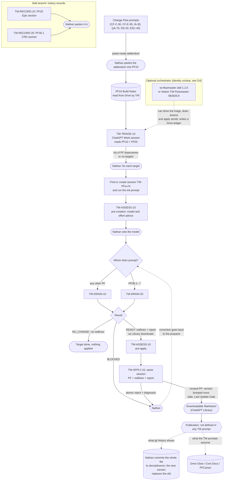

# The TW ecosystem before the rewrite — current-state baseline

**Nathan asked for the current state of the TW flow before any redesign.** This is that
reconstruction, recorded so the GTWPE rewrite starts from a shared baseline. It was first given in
the PE37 session on 2026-09-24. Two corrections found since are applied here and marked.

**Claude has not changed any TW prompt.** Every TW body is as its ChatGPT-era author left it.

## How it was read

| Source | Read | By |
|---|---|---|
| `tw-flowmaster` skill, `SKILL.md` | in full: 499 lines, 58,355 bytes, sha256 `e0fad7be…62a6`, revisions `TW_FLOWMASTER_SPECIALIZATION_REVISION 1.2.0`, `FLOWMASTER_CORE_REVISION 1.0.3` | read-only subagent |
| Notion `AI Prompts / HDE TW`, its 21 direct children, and the 6 children of *Glow Technical Writing Ecosystem* | the child lists read directly by PE37; the 8 selected TW bodies, the lane hub, the PE Metaprompt and UTIL-10 read in full | PE37 and a read-only subagent |
| Repository: `AGENTS.md`, `docs/prompt_ecosystem_management/`, `docs/pfcanon/` PF03, PF04, PF06, PF10, the `docs/pfcanon` history | the relevant sections; the history through the GitHub API, because the clone is shallow | read-only subagent; PE37 checked the PF10 and PF06 lines cited below |

**Not read:** the bodies of the five neighbouring pages (PF Doc Refresh 080726.1, PF Doc Refresh
Section 080926.4, PF09.x Phase Audit 040726.1, PF10 Condense — Work 090726.3, PLAN APPROVE FOR
IMPLEMENTATION 082926.1). The Release Register and the Round Tracking page were searched by keyword
only.

## The flow

The selected release is **TW-ALPHA-20260908.1**, chosen by the Notion page *Glow Technical Writing
Ecosystem* (last edited 2026-09-08). Every step runs in ChatGPT Work, and Nathan starts each one.

| # | Stage | Actor, session | Inputs | Outputs | Decision point | Canonical write |
|---|---|---|---|---|---|---|
| 0 | Addenda gather in PF10 | Change Flow prompts, then Nathan | a finished change | a paste-ready PF10 addendum | Nathan pastes it | PF10, by Nathan |
| 1 | Triage | TW-TRIAGE-10, one ChatGPT session | all of PF10, plus PF03 | ordered PF target list | Nathan picks targets | none |
| 2 | Session routing | Nathan, or the Flowmaster | the target | session `TW-PFxx-N`, initialized | a new session only after two searches find none | none |
| 3 | Pre-creation assessment | TW-ASSESS-10, same session | worker prompt, source, target PF | model and effort advice | Nathan sets the model | none |
| 4 | Redline creation | TW-DRAIN-10, or TW-DRAIN-20 for PF09.1–.7 | the target PF (Drive), PF10 | redlines and report: `READY`, `NO_CHANGE` or `BLOCKED` | none: `READY` goes straight on | none (Library download) |
| 5 | Pre-apply assessment | TW-ASSESS-10 | the `READY` package | model advice | Nathan sets the model | none |
| 6 | Apply | TW-APPLY-10, same session | PF, redlines, report | the revised PF with version, date and Last Update Gate, or an atomic reject | none | none (Library download) |
| 7 | Publication | Nathan | the downloaded PF | a new file in `docs/pfcanon` and/or Drive | only here, and only implicitly | **the only canonical write** |
| — | History records | TW-RECORD-10 and TW-RECORD-20 | the Epic or CRD specification and evidence | a paste-ready PF20 or PF30.1 section | Nathan pastes it | PF20 or PF30.1, by Nathan |
| — | Maintenance | TW-MGMT-10, through the PE Metaprompt | a change request | Notion successor pages | Nathan approves | Notion, and a Drive report |

Every handoff passes through Nathan, as a "formatted final-response handoff" carrying model advice
and filename or Library references. The Flowmaster, when used, sends instead. No TW handoff is a
GCFPE `NEXT_PROMPT_HANDOFF`.

## Findings

### A. Not in the repository

1. **All eight TW prompts live in Notion only.** None is in `project-prompt-contract-registry.md`,
   in `docs/graph/parts`, or among the GCFPE register's 55. The registry names TW only as the parent
   hub of UTIL-10.
2. **The Flowmaster lives only in the synced skills directory.**
3. **Runtime is external:** ChatGPT Work, ChatGPT Library, PF canon read from Drive, and two
   procedure documents in Drive `Glow / Ops` (*General Prompt Flow and Creation Guidelines*,
   *Prompt Selection and Session Delegation Protocol*).
4. **No TW run record exists in the repository.** The one redline-application report in
   `docs/ephemeral` is a Change Flow RS-30 run. Every TW control page says "Live follow-up trial
   pending; PF04 cause unresolved"; no live run is recorded after 2026-09-08.

### B. Contradictions

1. **Where PF canon lives.** The TW prompts say Drive. `D7`, the PE Metaprompt and UTIL-10 say
   `docs/pfcanon/`. `AGENTS.md` line 10 also says Drive. The Flowmaster contradicts itself (repository
   at line 335, Drive at 280 and 411, GitHub head at 293). The TW records cite PF10 v13.1; the
   repository holds v13.3.
2. **`AGENTS.md` cites PF10 by section numbers that no longer match (checked).** In
   `PF10-HDE-Build-Notes-v13.3.md`, §2.8 is PF10-FORM-001 (line 927), §2.9 is HDE-EPIC040-PR02-F02
   (960), §2.11 is the PR02 lineage review (1284), and §2.3 is EPIC040's core-test note (375). PF04
   §0.2 says not to cite PF10 by section number.
3. **Model routing.** The PE Metaprompt bans "workload-rating" content and its general rules govern
   TW (decision record, successor of 2026-09-23). TW-ASSESS-10 exists to rate workload.
4. **Handoff format.** TW's formatted final-response handoff against GCFPE's `NEXT_PROMPT_HANDOFF`.
5. **Redline vocabulary.** PF03 §8 and UTIL-10 use `INSERT`, `REPLACE`, `DELETE`; TW adds
   `FIND_AND_REPLACE`, then declares it invalid at count one.
6. **Inside the Flowmaster:** it "never creates … a session" yet requires creating the triage and
   replacement sessions; browser-and-tab wording sits beside Claude Code tools; its end codes
   contradict "all no-change is COMPLETE"; its state lists omit the assessment and no-change states.

### C. Redundancy

1. **Two PF redline appliers:** UTIL-10 (generic, repository, returns to the decision owner, and
   covers "a separately authorized PF redline") and TW-APPLY-10 (PF only, Library, bumps the
   version).
2. **Two assessments per target**, each a Nathan round trip.
3. **TW-APPLY-10 validates its own result and the Flowmaster re-checks it.**
4. **Unarchived predecessors** sit beside the selected pages under `AI Prompts / HDE TW`: five
   TW-MGMT-10 versions, earlier ASSESS, DRAIN and APPLY versions, the pre-rename analyzer and
   TW-Flowmaster-082626.8. The pre-alpha baselines and Reinit *TW* and *TW-Redliner* sit elsewhere.
5. **TW-RECORD-10 and TW-RECORD-20 write into PF20 and PF30.1**, which `AGENTS.md` now calls
   historical and reference-only.

### D. Gaps

1. **No approval between redline and apply.** PF03 §2 gives the Product Owner control of
   "authorized editorial changes"; no step asks him.
2. **Publication is undefined.** The Flowmaster says "never equate successful downloadable output
   with canonical publication". The `docs/pfcanon` history shows Nathan committing whole files, the
   new version replacing the old.
3. **No TW prompt owns removing drained addenda from PF10** (PF10 §7). *PF10 Condense — Work
   090726.3*, unread, may be that owner.
4. **Which orchestrator is current:** the installed skill is 1.2.0; the ecosystem page says
   "TW Flowmaster 1.1.6 is synchronized"; the alpha says "No Flowmaster … is included"; the only
   Notion Flowmaster, 082626.8, predates the alpha.

### E. Rules that bear on the single-session hypothesis

- **`AGENTS.md`:** `docs/pfcanon/**` is read-only by default. The exception is a direct, specific
  Product Owner instruction to add, replace, rename or remove *identified* files. It does not cover
  "independent editorial changes".
- **`glow-write-boundary`:** `docs/pfcanon/` is read-only, with no exception: "If a task appears to
  require a canon edit, stop and say so."
- **Decision record, successor of 2026-09-23:** "The TW ecosystem is out of your scope for now." AF-012
  stays open for it. Nathan's instruction of 2026-09-24 has since started the TW rewrite; the
  decision record does not yet say so.
- **Precedent:** two agent-authored PF-Canon writes exist, #410 and #411, each under an explicit
  Product Owner grant for exactly that change, each bumping the version in filename and header.

## Corrections since the first report

| As first reported, 2026-09-24 | Correct |
|---|---|
| PF06 §0.2 line 72 bars agents from modifying PF-Canon, and bears on the hypothesis | **Narrower.** The sentence is "Coding agents and Implementation Agents MAY NOT directly modify PF-Canon documents as part of implementation PR work." The next lines make a needed canon change "separate documentation work". A TW session doing documentation work is not what it bars. The binding constraints are `AGENTS.md` and `glow-write-boundary` (E above) |
| UTIL-10's Notion page was last edited 2026-09-24 at 15:58Z, which the register does not explain | **Explained.** It is the closeout-residuals landing: `docs/ephemeral/modifications/evidence/closeout-residuals/execute/landing/UTIL-10.check.json` records the page fetched at `2026-09-24T15:58:46.985Z`, validator exit 0, pass `true` |
| `AI Prompts / HDE TW` has 21 direct children (*How it was read*) | **20.** W1 listed them on 2026-09-28 (`CHECKPOINT.md` §4.6); PE37's count was wrong. Nothing else in this record rests on the number (ledger E-005) |
