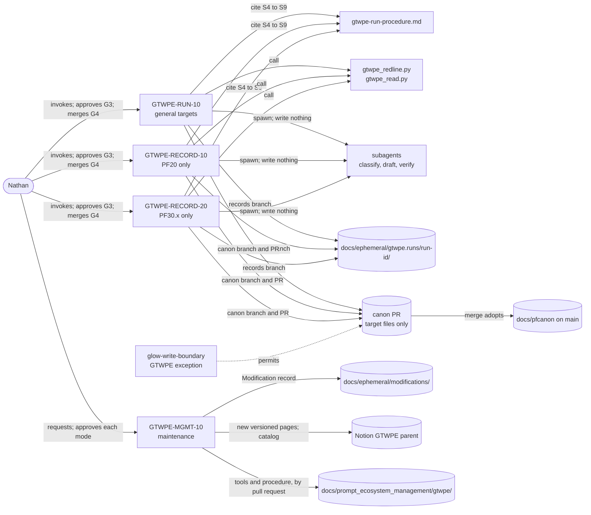
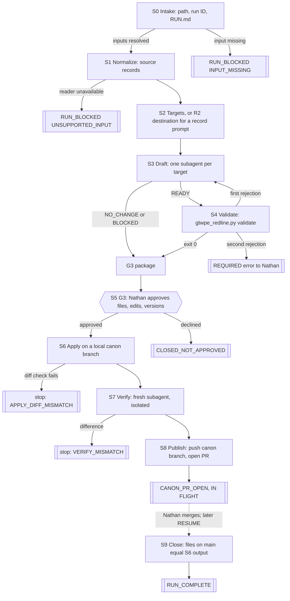
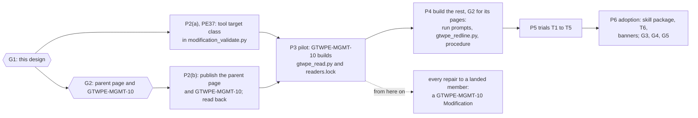

# GTWPE design package, v1.1

**The GTWPE turns an approved input into finished, merged PF documents in one managing session, and
it is built change prompt first.** GTWPE-MGMT-10, the prompt that changes the GTWPE itself, is
published and proven on one small real change before anything else is built. From then on, every
repair to a landed GTWPE member runs through it (plan v1.2 §16). Nathan approves each canon change
(G3) and merges each canon pull request (G4).

**Result: `AWAITING_APPROVAL` (G1).** Nothing in this package writes a page, a tool, a prompt, a
skill or a canon file (plan §6).

Approval sentinel: `ASK OK?`

## Contents

0. What G1 approves, and what changed from v1.0
1. Sources relied on
2. Membership
3. The ecosystem at a glance
4. Prompt contracts
5. A run, stage by stage
6. Producer and consumer contracts
7. Subagents: briefs, capture, post-check and cost
8. The change package and its validator
9. Resolutions: E-003, E-004, E-006, E-007, Q1 to Q3
10. Canon and rulings the plan predates
11. GTWPE-MGMT-10, specified: the change prompt, built first
12. Change plan
13. Test specification
14. Decisions for G1
15. Errors for the ledger
16. Open findings, listed as accepted risks
17. Reviews ledger
18. What this package does not claim

## 0. What G1 approves, and what changed from v1.0

G1 approves this version, pinned by its version number (plan §6), and only this version:

- the membership in §2;
- GTWPE-MGMT-10's specification in §11, from which its body is authored at P2;
- the contracts in §4 to §8;
- the resolutions in §9;
- the change plan in §12, in plan v1.2's order, and the test specification in §13;
- each decision in §14, at the default or recommendation stated there, unless Nathan's approval says otherwise.

A later version needs its own approval. Approving G1 authorizes P2 to begin; it writes nothing.

### 0.1 What changed from v1.0

v1.0 was not approved. Plan v1.2 §16 put the change prompt first, and PE37 settled the open choices
under Nathan's delegation of 2026-09-28 (§10.7).

| Change | Where | Why |
|---|---|---|
| The build order: GTWPE-MGMT-10 first (P2), its pilot (P3), then the rest (P4 to P6) | §2.2, §3, §12, §13 | Plan v1.2 §16.1 |
| GTWPE-MGMT-10 specified in full: its record, its three modes, how each kind of target changes, how it reads prompt bodies, and its drift check | §11; §4.4 | Plan v1.2 §16.1, P2(b); Nathan, 2026-09-28: "Make sure that the tw mgmt prompt works" |
| Its lineage pinned, and a change to its source added to its triggers | §11.1; §11.4, A0 | E-019 |
| Its records use the validator's new `tool` class | §11.3; §14 D-8 | E-017; plan v1.2 P2(a) |
| v1.0's unfounded `closure` risk removed | §16 | E-018 |
| Its *Writes* made consistent with the shared *Boundaries* | §4; §4.4 | The P1 diff check's listed finding #10 |
| RQ-1: PF27 is a candidate only with a specification, and only for a template it owns | §4.1.1; §5.1 S2; §13.3 | E-020, accepted and fixed in the build |
| RQ-2: every input's record is written by `gtwpe_read.py`, and S2 searches each source at its blob | §5.1 S1, S2; §6 H2; §13.2; §13.3 | E-021: the reader half in P3, the search half in P4 |
| RQ-3: a Notion page that is a prompt body is not an accepted input | §4.1; §5.1 S1; §9.2; §13.1; §13.3 | E-022: PE37's decision under Nathan's delegation |
| The post-check watches the harness's `tool-results/` and `subagents/` directories | §7.5 | E-016 |
| The token measure is uncached input plus cache writes plus output | §7.6; §12.5 | Plan v1.2 §16.3, which settles v1.0's D-11 |
| The P1r dry run's six repairs, DRr-1 to DRr-6, and decisions D-14 and D-15 | §4.1; §5.1; §11.4; §11.5; §11.7; §12.2; §13.2; §13.3; §14 | `design/DRY-RUN-P1r.md` |

## 1. Sources relied on

**PF canon, from `docs/pfcanon/` on `main`.** In this record PF10 is cited by addendum number and
title (PF03 §9; HDE Governance §0.2).

| Source | Read | Used for |
|---|---|---|
| PF03 — Technical Writing Best Practices | complete | §1 writing only; §3 complete reads, no ellipsis; §6 source precedence; §7 document control and finding accounting; §8 and §15.2 the redline format; §11 state language; §12 when to ask |
| PF06 — Change Process Guide | complete | §0.1A process ownership; §0.2 canon edits are separate documentation work, the PO squash-merges; §0.6.10 one-pass redline bundles; §1.0.3, §1.0.6, §1.1.2, §3.5.1, §6.3 PF30 and PF20 records; §1.1.11 `ASK OK?`; §3.5.2.8 post-QA drainage ordering |
| PF10 — HDE Build Notes | complete | §1 to §9 precedence, §7 drained guidance; 2.8 PF10-FORM-001; 2.14 Specification format authority; 2.29 PF10-CANON-001; 2.30 PF10-CITE-001; 2.31 PF10-HDR-001 |
| PF27 — Plan Templates | complete | *Review guardrails* (materiality, rendered escapes, redline bundles, review stability); §2 the Epic record and archive-on-close; §2A the CRD profile and compact PF30 contract |
| PF30.1 — HDE CRD Records | complete | §2 ownership; §3.1 CRD IDs; §3.2 record lifecycle; §3.3 vocabularies; §4 record contract; §6 volumes; §7 template |
| HDE Governance (PF04) | §0, §9.1 to §9.6, found by the canon-first search; §9.1.6 re-read in full in P1r | §9.1.1 historical homes; §9.1.2 conflicts; §9.1.3 advice; §9.1.6 prompt ecosystems; §9.3.1 change log |
| HDE Phased Epics (PF20) | front matter, §0, Phase Exit Criteria, §1, and the §2 heading index, found by the canon-first search | its reference-ledger posture, drain posture and Build Notes posture; its record order |

**Repository, other.** `AGENTS.md` at sha256 `2a28ac5c15d348f8` (changed after P0; §10.1). Plan
v1.2, read in full from PE37's branch at `0ecb6a1`, and `ERRORS.md` at the same commit (E-001 to
E-023). `CHECKPOINT.md`, including §8's rulings and §10.1's relay record. P1's records,
`design/DRY-RUN-P1.md` and `design/REVIEW-P1-DIFFCHECK-R1.md`. In `docs/prompt_ecosystem_management/`:
`gcfpe.decision-record.md` (D20 to D22 and D26 re-read in full in P1r, D23 to D25 in P1);
`modification-template.md`, `ecosystem-change-management.md`, `notion-write-boundary.md` and
`reviewer-prompt-template.md`, re-read in full in P1r; `modification_validate.py` (its header, its
constants and its checks at lines 330 to 420) and `closure.py` (its header), read in P1r;
`README.md`, `session-working-rules.md`, `execution-and-delegation-model.md`,
`prompt-body-content-policy.md`, `skill-packaging-and-delivery.md`, `authoritative-surfaces.md`,
`pe-succession/pe36-to-pe37.md` and `operating-procedures/carried-forward-operating-rules.md`. From
`docs/ephemeral/`: `pe37.stage5/MGMT-10-REVISION.md`, on what the source body holds since `D26`, and
`modifications/MODIFICATION-20260923-closeout-residuals.md`, its *Harness files* and cost sections.

**Notion, read-only under `D22`.** In P1: the eight selected TW bodies, the proposed GCFPE-MGMT-10
body (`3e34590a05eb811b93d2da9b4ef8106d`) and, at P0, the PE Metaprompt 091426.1. Page IDs, edit
times and the rules kept are in `design/P1-SOURCE-NOTES.md`. In P1r, one title-only search at
2026-09-28T14:42Z found the source body unchanged since 2026-09-24T11:00Z and no later versioned
GCFPE-MGMT-10 page; P1r fetched no body. No body is copied into this record.

### 1.1 The PF03, PF06 and PF10 check for new prompts

The PE Metaprompt requires a complete PF03, PF06 and PF10 check before a new Glow prompt is made.
All three were read in full (P1 source notes). The four GTWPE prompts must meet each rule below, and
this design meets it where stated.

| Rule | Source | Where the design meets it |
|---|---|---|
| Read every relied-on source completely; an unknown stays unknown | PF03 §3 | Drafters read the complete target (§7.3); `UNKNOWN` and `BLOCKED` are returns, never guesses |
| No ASCII three-period or Unicode ellipsis in a PF document | PF03 §3 | V8 |
| Source precedence: the operator, the complete target, the owning canon, then PF10 where an addendum speaks | PF03 §6 | The brief frame's settled rules (§7.2 item 4) |
| Document control changes only on explicit authority; every finding of an audit source is accounted for | PF03 §7, §15.1 | G3 approves each exact value (§8.4); B-DRAFT's change ledger accounts for every finding |
| The redline format and its placement rules | PF03 §8, §15.2 | §8.1; V1 to V7 |
| "applied", "committed" and "merged" only on direct evidence | PF03 §11 | The run report says "applied" after S6's diff check and "merged" only after S9 |
| Ask only when the answer changes the result | PF03 §12 | Subagents never ask; the manager asks at G3 or on a named blocker |
| A canon edit is separate documentation work; the PO squash-merges | PF06 §0.2 | A GTWPE run is separate canon maintenance, never part of an implementation PR; Nathan merges |
| One-pass redline bundles, original anchor space, no overlap | PF06 §0.6.10 | V4 to V7; a failing bundle returns to its drafter once |
| `ASK OK?` on approval-submitted artifacts | PF06 §1.1.11 | The G3 package and this design |
| Drainage only after the epic's QA is complete | PF06 §3.5.2.8 | §10.5; §14 D-3 |
| PF30 and PF20 records | PF06 §1.0.3, §1.0.6, §1.1.2, §3.5.1, §6.3 | The dedicated record prompts (§4.2, §4.3), within HDE Governance §9.1.1 (§10.3) |
| Precedence, the latest base version, addenda scoped individually | PF10 §1 to §9 | B-CLASSIFY-PF10 reads one logical base version through EOF; a later addendum governs only where scopes overlap |
| Agent-authored addendum form | PF10 2.8 | Not applicable: PF10 is never a GTWPE target |
| Specification format authority and terms | PF10 2.14 | PF27 through GTWPE-RUN-10, PF30 through GTWPE-RECORD-20; new text says "Specification" |
| Canon is `docs/pfcanon/` on `main`; a superseded version leaves it; agents write only under exact PO authority | PF10 2.29 | S6 replaces the versioned file; G3 is the exact authority |
| No PF10 locator in another PF | PF10 2.30 | V9 |
| No header model-advice review | PF10 2.31 | No model or effort content anywhere (`D7`, §9.4) |

## 2. Membership

### 2.1 Current members and their disposition

| Current | Disposition | What carries into the GTWPE, and where |
|---|---|---|
| TW-TRIAGE-10 090726.2 | Folded into S2 of GTWPE-RUN-10 | One logical PF10 base version, read through EOF; ownership established by reading the target; "a search hit or matching heading is not enough"; PF09 routed only to the actual phase file. Its "A title containing Canon is not an eligibility rule" is superseded by Nathan's ruling (§10.2) |
| TW-DRAIN-10 090826.1 | Subagent brief B-DRAFT inside GTWPE-RUN-10 | The change ledger (redline, already represented, out of ownership, blocking); exact redlines against the unchanged original; `READY`, `NO_CHANGE` (exactly `no redlines`), `BLOCKED`. Its `FIND_AND_REPLACE` is dropped: PF03 §8 has `INSERT`, `REPLACE` and `DELETE` only |
| TW-DRAIN-20 090826.1 | Subagent brief B-DRAFT-PF09 inside GTWPE-RUN-10 | The six dimensions: subtasks, tasks, phase statuses, new rows, evidence, Epic information. Board data is never a prerequisite |
| TW-APPLY-10 090826.1 | Replaced by `gtwpe_redline.py`, S6 and S7 | Whole-batch rejection; byte-exact application in descending offset order; untouched bytes verified; no metadata-only version bump. **Not carried:** its standing authority to derive version, date and Last Update Gate. G3 approves those values (PF03 §7, §15.1) |
| TW-ASSESS-10 090826.2 | Retired | Nothing. Nathan sets effort per turn and PE37 recommends it (plan §2.5); no GTWPE body carries model or effort content (`D7`, §9.4) |
| TW-RECORD-10 090726.2 | **GTWPE-RECORD-10**, the dedicated PF20 prompt | Completed Epics only; specification approval alone is insufficient; nonduplication; no identifiers allocated |
| TW-RECORD-20 090726.2 | **GTWPE-RECORD-20**, the dedicated PF30 prompt | The approved CRD Specification with its approval evidence; the PO allocates CRD IDs; nonduplication; exact PF30 vocabulary |
| TW-MGMT-10 090826.2 | Replaced by **GTWPE-MGMT-10** | Publication as a new versioned sibling, never overwrite, rename, move or delete; recheck and exact-title search before each create; readback; the catalog is updated only after the full set passes; both sides of every changed relationship |
| `tw-flowmaster` 1.2.0 (freeze digest `2 fd6c344b…`) | Retired through a `D24` skill package, installed by Nathan (P6) | Nothing. GTWPE-RUN-10's single session is the orchestrator |
| Glow Technical Writing Ecosystem page, selecting TW-ALPHA-20260908.1 | Kept intact; superseded banner at G5 | None of its pages is rewritten (plan §2.5) |
| The five unread neighbours, TW Strength Analyzer 090726.1, TW-Flowmaster-082626.8 and the predecessor versions under HDE TW | Not members of TW-ALPHA or of the GTWPE; untouched | *PF10 Condense — Work 090726.3* is PF10 work, which the GTWPE never does (§10.2) |
| UTIL-10, the GCFPE redline applier | Not a GTWPE member; unchanged | "other ecosystems do not become GCFPE members by proximity" (HDE Governance §9.1.6) |

### 2.2 Proposed membership

| Member | Kind | Home | Built | Writes canon |
|---|---|---|---|---|
| **GTWPE-MGMT-10 — Manage the GTWPE** | the change prompt | Notion, under the GTWPE parent page | **first**, in P2(b); proven by the pilot in P3 | nothing in canon |
| The GTWPE parent page and its catalog block | control | Notion, `AI Prompts / HDE TW` (ruling 3 of 2026-09-25) | P2(b) | nothing; the catalog lists each member's current version and the lineage pins (§11.7), and becomes the TW selection authority at G5 |
| `gtwpe_read.py` and `readers.lock` | tool | `docs/prompt_ecosystem_management/gtwpe/` | P3, by GTWPE-MGMT-10's pilot | nothing |
| **GTWPE-RUN-10 — Run the Glow Technical Writing Flow** | prompt | Notion, under the GTWPE parent page | P4 | the general targets (§8.7), through S4 to S9 |
| **GTWPE-RECORD-10 — Record an Epic in HDE Phased Epics** | prompt, dedicated | Notion | P4 | PF20 only, through S4 to S9 |
| **GTWPE-RECORD-20 — Record a CRD in HDE CRD Records** | prompt, dedicated | Notion | P4 | PF30.x only, through S4 to S9 |
| `gtwpe_redline.py` and its selftest | tool | `docs/prompt_ecosystem_management/gtwpe/` | P4 | applies an approved package; never chooses one |
| `gtwpe-run-procedure.md` | shared procedure | the same directory | P4 | nothing |
| `glow-write-boundary`'s GTWPE exception | skill interface | the synced skills tree, through `D24` | P6 | permits the canon write in §8.7, nothing more |

**After P3, a landed member changes only through GTWPE-MGMT-10** (§11). A member not yet landed is
fixed in place by the phase building it (plan §8, `D26-B`).

**Why a shared procedure.** The three run prompts share S4 to S9. Written into three bodies, the
stages would drift apart, which is the failure the GCFPE-MGMT-10 redesign names ("One body means one
authority for the shared spine"). Each run prompt therefore cites `gtwpe-run-procedure.md` for S4 to
S9, the subagent brief frame and the post-check, and states only its own intake and drafting. Procedure lives in
`docs/prompt_ecosystem_management/` (kickoff workaround `D2`). The procedure carries no prompt body.

**Alternative, if Nathan meant briefs rather than prompts** (§14, D-1). The two record prompts could
instead be dedicated subagent briefs inside GTWPE-RUN-10, as TW-DRAIN-10 and TW-DRAIN-20 become.
This design reads "dedicated prompts" literally.

## 3. The ecosystem at a glance





The build order (plan v1.2 §16.1). From P3 on, every repair to a landed member is a GTWPE-MGMT-10
Modification.



## 4. Prompt contracts

Every GTWPE prompt shares these terms:

- **Identity.** The first two lines are `<PROMPT ID> — <title> — <MMDDYY.N>` and
  `Prompt Version: <MMDDYY.N>` (the PE Metaprompt's general rule; the TW ecosystem is outside `D23-G`,
  §14 D-5). There is no header of model, effort or workload advice (`D7`), and no selection state
  (`prompt-body-content-policy.md`).
- **Returns.** One result per return to Nathan, ending `DECISION NEEDED`, `NOTHING NEEDED` or
  `IN FLIGHT`. No prompt emits a `NEXT_PROMPT_HANDOFF` or hands off to another prompt (`D5`).
- **References.** External documents are cited by controlled directory, versionless name and section
  (HDE Governance §9.1.6; PF10 2.14). A body restates no rule it can cite.
- **Boundaries.** No GTWPE prompt merges, installs, creates sessions or writes to Drive, and none
  writes `docs/pfcanon/PF10-*` (Nathan, 2026-09-28). Beyond that, each prompt writes only what its
  own *Writes* row lists. The three run prompts write the run's records (§5.2) and the canon files
  Nathan approved at G3, and never Notion. GTWPE-MGMT-10 writes its Modification record, the GTWPE's
  own files and the GTWPE's Notion pages (§4.4, §11.2), and never a canon file or a run record.

### 4.1 GTWPE-RUN-10 — Run the Glow Technical Writing Flow

| Field | Contract |
|---|---|
| Purpose | Turn one Path A or Path B input (plan §2.1, §2.2) into approved, applied and merged changes to the general targets |
| Owner | Nathan invokes it and holds G3 and G4. The managing session runs it |
| Inputs | `START` with any of: **(a)** a document: a repository path, an upload, pasted text, a Notion page that is not a prompt body, named by its title and page ID (§5.1 S1), or a Drive file Nathan names specifically (§9.4 `D10`); **(b)** a specification: the repository path of an approved Epic or CRD Specification under `docs/ephemeral/`; **(c)** `PF10`: the applicable PF10 file set (§9.5 Q2), whole or narrowed to named addenda. Optional: a slug, and a selection within (a). Or `RESUME <run-id>`. Or Nathan's G3 reply in the same session. §4.1.1 maps plan §2.2's rows to these inputs |
| Outputs | The run records (§5.2); the G3 package; one canon PR; the run report |
| Writes | The records branch and the run directory; the canon branch, holding only files Nathan approved at G3. After P6's install, `glow-write-boundary`'s exception permits the canon write; before it, the write is refused (E-002) |
| Reads | The inputs; `docs/pfcanon/` on `main`; the procedure; Notion and Drive only for a named input |
| Approval effects | Nathan's G3 approval, recorded verbatim, is `AGENTS.md`'s explicit direction for each named file (line 16). His merge adopts the change (plan ruling 1). A PR merge approves nothing else (D21-C) |
| Dependencies | `gtwpe_redline.py`, `gtwpe_read.py`, `readers.lock`, `gtwpe-run-procedure.md`; the PF canon cited in §1 |
| Exclusions | PF10, PF20 and PF30.x (§8.7); drafting any target itself, since each target has its own drafting subagent (plan §2.4); any action another prompt owns |
| Results | `AWAITING_APPROVAL` (the G3 package; `DECISION NEEDED`) · `CANON_PR_OPEN` (`IN FLIGHT`) · `RUN_COMPLETE` · `NO_CHANGE_COMPLETE` (every target `NO_CHANGE` and none unsure) · `RUN_BLOCKED: <code>` (`DECISION NEEDED`) · `CLOSED_NOT_APPROVED` · `CLOSED_NOT_ADOPTED` |
| Completion | `RUN_COMPLETE` when S9 finds every approved file on `main` equal to the S6 output. A due PF20 or PF30 record is named in the run report as information, never handed off |
| Resume | Only at the checkpoints in §5.3 (`D26-C`) |

#### 4.1.1 Plan §2.2's rows as invocations

| Plan §2.2 row | Inputs given | Targets | PF27; the PF20 or PF30 record |
|---|---|---|---|
| A document only | (a) | The eligible PFs the document bears on | Not touched. A missing specification never blocks Path A |
| A specification and PF10 | (b) and (c) | The PFs the PF10 set's addenda address | PF27 evaluated: `CHANGE` only where the specification changes a template PF27 owns, otherwise `NO_CHANGE: <reason>` (plan §2.2). The due record is named for GTWPE-RECORD-10 or GTWPE-RECORD-20 |
| A specification, a document, and PF10 | (a), (b) and (c) | The union of both rows | As the row above |
| A specification without PF10 | (b) | The specification's own targets | As above. PF10 is treated as absent, not as an error |
| PF10 only | (c) | The PFs its addenda address | Not touched |
| Nothing usable | None resolves | None | `RUN_BLOCKED: INPUT_MISSING`, listing the accepted inputs |

A document with PF10 and no specification, (a) and (c), takes the union of their targets and touches
neither PF27 nor a record.

**PF27 is never a target in a run without (b).** Nathan's instruction of 2026-09-25 reads "PF27 and
PF30 are updated only when a specification exists" (plan §1). S2 admits PF27 only with (b), and
`targets-check` refuses it otherwise (§5.1; E-020).

### 4.2 GTWPE-RECORD-10 — Record an Epic in HDE Phased Epics

| Field | Contract |
|---|---|
| Purpose | Add one completed Epic's historical record to PF20, or make one bounded correction to an existing record, as a separately authorized historical drainage action (HDE Governance §9.1.1) |
| Owner | Nathan invokes; G3 and G4 are his |
| Inputs | The approved Epic Specification (repository path) with its approval evidence; the evidence that the Epic is closed (the closure decision and its source); supporting records Nathan names. Or `RESUME <run-id>` |
| Rules | PF20 takes completed Epics only and adds each "only once, at epic close" (PF27 §2; PF06 §1.1.2, §3.5.1, §6.3). Specification approval alone is insufficient. The record follows PF27 §2's Epic record template (PF10 2.14), using the "Specification" terms in new text (PF10 2.14). A prior record is updated only when the change "prevents future reader confusion" (PF20 §0, Drain posture). New text names HDE Build Notes by title only (PF10 2.30 governs over PF20's older "Prefer the relevant Addendum entry"). No Epic or issue ID is allocated |
| Destination | The single PF20 file on `main`. A new record goes after the last record as `### 2.<next> <Epic ID> …`, without the outer bold of the older headings (PF03 §8). Because PF20 has no end marker, the edit is a `REPLACE` of its last unique line that reproduces it (PF03 §8 widening) |
| Nonduplication | Search PF20 for the Epic ID first. PF20 already holds two records for HDE-EPIC038 (§2.23 and §2.24); the prompt reports such duplicates and never adds a third |
| Outputs, writes, results | As §4.1, for PF20 only |
| Dependencies, exclusions, completion | As §4.1, except that it writes only PF20, never another file, and is invoked by Nathan alone, never by another prompt. `RUN_COMPLETE` when S9 finds the new PF20 file on `main` equal to S6's output |
| Cost | PF20 is 952,515 B, about 318,000 tokens; its drafter reads all of it (§7.6) |

### 4.3 GTWPE-RECORD-20 — Record a CRD in HDE CRD Records

| Field | Contract |
|---|---|
| Purpose | Register a CRD, record a material change, or record its closure in PF30.x, as a separately authorized historical drainage action (HDE Governance §9.1.1) |
| Owner | Nathan invokes; G3 and G4 are his |
| Inputs | The approved CRD Specification with its approval evidence; for a material update or closure, the exact-source lineage (PR, commit, QA, closure decision). Or `RESUME <run-id>` |
| Rules | The CRD ID is the PO's to allocate and must already exist (PF30.1 §3.1); a missing ID is `RUN_BLOCKED: CRD_ID_MISSING`. One primary record per CRD, updated in place in its originating volume; the material-change history is append-only (§3.2, §4.2). Exact controlled vocabularies (§3.3). No inferred implementation, QA, acceptance, drainage or closure (§3.2, §5). Specification approval is a planned baseline only. "Specification approval" replaces "CRD Plan approval" in new text (PF10 2.14). New text names HDE Build Notes by title only (PF10 2.30), even where the §7 template asks for "exact references" |
| Destination | A new registration goes to the one `Active` volume, currently PF30.1 (§6); an update goes to the record's originating volume. The prompt never opens, closes or rolls over a volume |
| Outputs, writes, results | As §4.1, for PF30.x only. `RUN_BLOCKED: CRD_ID_MISSING` and `RUN_BLOCKED: APPROVAL_EVIDENCE_MISSING` are added |
| Dependencies, exclusions, completion | As §4.1, except that it writes only PF30.x, never another file, and is invoked by Nathan alone, never by another prompt. `RUN_COMPLETE` when S9 finds the PF30.x file on `main` equal to S6's output |

### 4.4 GTWPE-MGMT-10 — Manage the GTWPE

It is built first (P2) and proven by the pilot (P3). §11 specifies it.

| Field | Contract |
|---|---|
| Purpose | Manage one GTWPE Modification, everything Nathan hands in together, from request to applied and verified result, through `ANALYZE`, `PLAN` and `EXECUTE` (§11.4) |
| Owner | Nathan requests the change and approves each mode. The managing session runs it |
| Inputs | `MODE` and the subject: the request for `ANALYZE`, or the Modification ID for `PLAN` and `EXECUTE` |
| Outputs | The Modification record and its evidence; new versioned prompt pages; tool, lock, selftest and procedure changes by pull request; the catalog update; a `D24` skill package when the skill exception is in scope |
| Writes | The record and its evidence under `docs/ephemeral/modifications/`, on the Modification's branch; `docs/prompt_ecosystem_management/gtwpe/`, through that branch's pull request; in Notion, new child pages of the GTWPE parent page and the parent's catalog block, under the destination rule G2 establishes (§14 D-10). Never a canon file, a run record, or any other Notion page |
| Reads | The GTWPE's pages, files and records; the sources its drift check watches (§11.7); prompt bodies only as §11.6 allows |
| Approval effects | `analyze_approved_by` and `plan_approved_by` are written only on Nathan's approval, quoting his words; a merge approves nothing (D21-C). Merges, installs and the selection of a new version are his (§11.4, X4) |
| Dependencies | The selected PE Metaprompt, with the kickoff's workarounds until its repair; `modification-template.md`, `modification_validate.py` with the `tool` class P2(a) adds, `reviewer-prompt-template.md`, `ecosystem-change-management.md`, `execution-and-delegation-model.md`, `gcfpe.decision-record.md`; §6's handoff table, for closure and tier |
| Exclusions | PF canon; the GCFPE's register, catalog, graph, registry, validator and PE Metaprompt; TW-ALPHA's pages before G5; running a GTWPE run |
| Results | `PRODUCT_OWNER_ACTION_PENDING`, `PROMOTION_CHECKPOINT_REQUIRED`, `ECOSYSTEM_CHANGE_COMPLETE`, `IMPLEMENTATION_BLOCKED` (§11.8). It hands off to no prompt |
| Completion | `ECOSYSTEM_CHANGE_COMPLETE` once `EXECUTE` has verified what landed after Nathan's merges and installs |
| Resume | Only at the checkpoints in §11.8 (`D26-C`) |

## 5. A run, stage by stage

### 5.1 The stages

The three run prompts share S4 to S9 through the procedure. The record prompts replace S2 with R2 and
use their own drafting brief.

| Stage | What the manager does | Output | Check that can fail | On failure |
|---|---|---|---|---|
| S0 Intake | Determine the path (plan §2.2), the run ID, the branches; snapshot `origin/main` | `RUN.md` at `INTAKE` | Every input resolves to a readable identity | `RUN_BLOCKED: INPUT_MISSING` naming it, with the accepted inputs |
| S1 Normalize | Record every input with `gtwpe_read.py` (E-021). A repository input (the specification, PF10, an addendum file, a repository document) gets only a `.json` pointer record: path, blob SHA and a unit index computed from the blob, with no copy of its bytes. A file from outside the repository (an upload, or a Drive file Nathan named, once downloaded) is converted by the pinned reader for its type (§9.2) into a `.md` that the `.json` indexes. Pasted text is saved as given, and a Notion page is read with the connector, each into a `.md` that `gtwpe_read.py` indexes. **A Notion page that is a prompt body is refused before it is fetched** (PE37 under Nathan's delegation, 2026-09-28; E-022). Nathan names a Notion page input by its title and page ID, because a search by page ID alone does not return the page. S1 searches Notion for the title with highlights off, which returns no body, and takes the result whose ID matches. The page is refused when that result's title carries a prompt identity (`<ID> — <title> — <MMDDYY.N>`) or its path lies under `AI Prompts` | `source/NN-<name>.json`, plus `source/NN-<name>.md` for an input from outside the repository | `gtwpe_read.py` exits 0: each record carries origin, type, reader and version, byte count, sha256, and a unit index covering the whole input or the stated selection | `RUN_BLOCKED: UNSUPPORTED_INPUT <type>`, including `notion-prompt-body`, and `notion-page-unidentified` when no search result matches the ID; never a guessed conversion |
| S2 Targets (RUN-10) | Build the candidates: every eligible PF the source names by number or title, found by an exact search of each recorded source at its blob or in its `.md` (E-021), and every eligible PF whose purpose-and-scope sections the manager finds the source bears on, each with its reason (plan §2.2). For (c), add the PFs that B-CLASSIFY-PF10 maps from the PF10 set. **PF27 is a candidate only when (b) is given, and then only for a template PF27 owns that the specification changes** (E-020). Then classify each candidate (§7.3). With (b), evaluate PF27 and name a due PF20 or PF30 record | `targets.md` | `gtwpe_redline.py targets-check`: every target cites a source unit that exists in a record, passes the eligibility guard for this prompt (§8.7), and is not PF27 in a run without (b) | An unsure target is named for G3, never dropped or added silently |
| R2 Destination (RECORD-10, RECORD-20) | Resolve the volume, the insertion point and nonduplication by exact search | `targets.md` | The ID exists, is unique in the family, and the destination is unambiguous | `RUN_BLOCKED` naming the missing fact |
| S3 Draft | Spawn one drafting subagent per target (§7); capture each return programmatically (§7.4) | `drafts/<key>.return.md` and `.redlines.md` | The return parses and ends `END OF REDLINES`, or is exactly `no redlines`, or is `BLOCKED` with its reasons | A malformed return is re-dispatched once, then logged |
| S4 Validate | `gtwpe_redline.py validate` | `validate/<key>.json` | Exit 0 (§8.2) | The whole batch goes back to its drafter once with the diagnostic; a second failure is a `REQUIRED` error for Nathan (plan §8) |
| S5 / G3 | Assemble the G3 package; stop and return `AWAITING_APPROVAL` | `G3-PACKAGE.md` | Nathan's reply is recorded verbatim, and `gtwpe_redline.py approval-check` confirms it names the run and each file, or the package version whose file list is fixed | Declined: `CLOSED_NOT_APPROVED`. Changed by him: a new package version, S4 again, G3 again |
| S6 Apply | Fetch `main`; check each base blob is unchanged (§9.1); create the canon branch; `git mv` to the new filename; `gtwpe_redline.py apply`; commit locally | `apply/<key>.json`, `apply/<key>.diff` | The script's diff check: the output equals the one-pass simulation byte for byte, and every changed byte belongs to an approved operation | Stop, keep no file, log `REQUIRED` |
| S7 Verify | Spawn a fresh verifier that sees the approved package, the base and the local commit, never S6's report (§7.3) | `verify/<key>.md` | `gtwpe_redline.py verify-check`: the verifier reports every approved operation present exactly and no unexplained hunk, and its hunks match `apply/<key>.json`. The comparison runs centrally, never in the verifier | Stop; PE37 compares centrally (plan §8) |
| S8 Publish / G4 | Re-check the base blobs; push the canon branch; open the PR | The PR, and `RUN.md` at `CANON_PR_OPEN` | `gtwpe_redline.py pr-check`: `git diff --name-status origin/main...<canon branch>` lists exactly the approved files, and the branch's diff equals S6's | CI red or a conflict: diagnose; fix only within the approved edits, or back to G3 |
| S9 Close | Entered only at `RESUME`, from `main` | `REPORT.md`, `RUN.md` at `COMPLETE` | Each approved file on `origin/main` has the S6 output's blob; each old versioned filename is gone | `RUN_BLOCKED: MAIN_DIFFERS` with the difference |

### 5.2 Records, identities and branches

- **Run ID:** `gtwpe-<yyyymmdd>-<slug>`, lowercase ASCII, because every repository directory is
  lowercase (HDE Governance §0.4).
- **Run directory:** `docs/ephemeral/gtwpe.runs/<run-id>/` holding `RUN.md`, `source/`, `targets.md`,
  `drafts/`, `validate/`, `G3-PACKAGE.md`, `apply/`, `verify/`, `postcheck/` and `REPORT.md`. It never
  holds a whole PF copy, which would be a committed copy of derived output (`STALE-001`); `apply/`
  holds the diff and the identities.
- **Records branch:** `docs/<yyyymmdd>-gtwpe-run-<slug>`, holding only the run directory, pushed at each
  checkpoint. A records PR may be opened to preserve it: "Merging preserves the record and approves
  nothing (D21-C)". In P5, W1's trials record on `docs/20260925-gtwpe-w1` instead.
- **Canon branch:** `docs/<yyyymmdd>-gtwpe-canon-<slug>` from `origin/main` at S6, holding only the
  approved canon files. Its PR body follows the template headings, and its *What merging does* states
  which PF versions become current on `main` and that no QA, acceptance or closure follows (`AGENTS.md`
  line 74). Nathan squash-merges (PF06 §0.2).
- **`RUN.md` frontmatter:** `run_id`, `prompt` and its version, `path`, `status`, `inputs`, `main_at_s0`,
  `records_branch`, `canon_branch`, `canon_pr`, `targets` (key, path, base blob, outcome), `g3` (Nathan's
  words, date, package version), `cost` (time and tokens), `result`. Statuses: `INTAKE`, `NORMALIZED`,
  `TARGETED`, `DRAFTED`, `VALIDATED`, `AWAITING_APPROVAL`, `APPROVED`, `APPLIED`, `VERIFIED`,
  `CANON_PR_OPEN`, `COMPLETE`, `NO_CHANGE_COMPLETE`, `BLOCKED`, `CLOSED_NOT_APPROVED`,
  `CLOSED_NOT_ADOPTED`.

### 5.3 Checkpoints and failure after an external write

`RUN.md` is committed and pushed to the records branch after S1, after S4, when the G3 approval is
recorded, before S8 and after S8. Resume is only at those points (`D26-C`). **S8's push and PR are
the first external write.** After it, a failure takes `D26-B`'s path and nothing more: a failure
record in the run directory, a read-only sweep of what landed, the freeze kept, and a return to
Nathan. S9 detects the merge only by files on `main`, never by commit subjects (`D26-C`).

## 6. Producer and consumer contracts

Common to every handoff: files are UTF-8 with LF line endings; identities are repository paths plus
git blob SHAs, or Notion page IDs plus `page_last_edited_at`; nothing is passed by memory; a consumer
that cannot parse its input stops with the stage's blocked code and never repairs the input.

| # | Producer → consumer | Artifact and format | Required fields and provenance | Consumer's check | Invalid input → return to |
|---|---|---|---|---|---|
| H1 | Nathan → S0 | The invocation | Path A, Path B or both; each input's identity | Each input resolves | Nathan, `INPUT_MISSING` |
| H2 | S1 → S2 | Source record `.json`, written by `gtwpe_read.py`, plus a `.md` only for an input from outside the repository | origin (a repository path and blob SHA, or the outside identity), type, reader and version, bytes, sha256, selection, units with stable anchors | Units cover the whole source or the stated selection; `gtwpe_read.py` exited 0 | S1, once; then Nathan |
| H3 | S2 → S3 | Drafting brief (§7.2) | run ID, target path and base blob, eligibility class, the source units mapped to it with locations, the brief variant, a capture nonce | The target is eligible for this prompt; the units exist | Manager (a brief is never sent invalid) |
| H4 | Drafter → manager | Return: JSON envelope plus PF03 §15.2 redline blocks, between nonce markers (§7.4) | outcome, coverage rows, coupled edits, document-control proposal, blocked items, `wrote_anything: no` | Parses; set equality with the assigned units; every quoted anchor matches the base bytes | The drafter, once; then logged |
| H5 | S4 → S5 | `validate/<key>.json` and `G3-PACKAGE.md` | per-operation spans, counts, conflicts, simulation result; the package version | Exit 0, or the batch is rejected whole | S3 |
| H6 | Nathan → S6 | His G3 reply | run ID; each file or the package version | Recorded verbatim; names every file applied | Nathan, `DECISION NEEDED` |
| H7 | S6 → S7 | The local canon commit, `apply/<key>.json` | base and output blob SHAs, byte counts | Not shown to the verifier; kept for the central comparison | Stop |
| H8 | Verifier → manager | Return between nonce markers | per operation: present exactly, absent or altered; unmapped hunks | Parses; covers every approved operation | Stop; central comparison |
| H9 | S8 → Nathan | The canon PR | changed paths, PR body, run ID | Paths equal the approved files | Stop; fix within the approved edits |
| H10 | `main` → S9 | The merged files | blob SHAs on `origin/main` | Equal to S6's output | `MAIN_DIFFERS` to Nathan |
| H11 | A run → GTWPE-MGMT-10 | A defect in the run report, carried by Nathan | the failing stage, evidence, the run ID | ANALYZE classifies it (A to E) | Nathan |
| H12 | GTWPE-MGMT-10 → Nathan | A mode's return: the record at its new status, and the approval it asks for | the Modification ID, the mode, the record's commit, what approving means | — | — |
| H13 | Nathan → GTWPE-MGMT-10 | His approval of `ANALYZE` or `PLAN` | the Modification ID and the mode | Quoted in `analyze_approved_by` or `plan_approved_by`, then `modification_validate.py` exits 0 | Nathan, `DECISION NEEDED` |

**Size and tool assumptions.** The largest eligible targets are PF19 (657,008 B), PF14 (654,042 B),
PF12 (583,759 B) and PF04 (558,988 B), and for GTWPE-RECORD-10, PF20 (952,515 B). At the measured
3.0 bytes a token, a drafter's context at completion stays under about 450,000 tokens (§7.6). A
subagent's context limit is assumed to match the session's 1,000,000 (P0 §4.1). T4 and T2b test it.

**Version compatibility.** Each record names its producer: the prompt ID and version, and the tool
version constant. A consumer that finds another version's record re-validates it and never assumes
compatibility. A run started under one GTWPE version finishes under it; a new version applies from
the next run.

## 7. Subagents: briefs, capture, post-check and cost

### 7.1 When the manager delegates

By workload, never one agent per change for its own sake (proposed GCFPE-MGMT-10 spine). The manager
classifies S2 candidates itself when there are three or fewer and their relevant sections total under
about 60,000 tokens; otherwise it spawns one classifier per candidate. Every drafted target gets its
own drafter (plan §2.4). Every applied target gets its own verifier. Subagents cannot spawn subagents
(P0 §4.2), and they cannot ask Nathan anything (plan §2.4).

### 7.2 The brief frame (E-006)

Every brief is filled from a template in `gtwpe-run-procedure.md`. It carries, in order:

1. **Identity:** "You are a worker inside run `<run-id>`. You did not produce what you are given."
2. **The write-nothing clause, verbatim in every brief:** "You write nothing. Do not create, edit, move
   or delete any file, including under `/tmp`. Do not run a git command that changes any state. Do not
   create, edit or comment on a Notion page, a Drive file, a GitHub issue or pull request. Do not merge,
   push, install, create a session or spawn an agent. Reading is fine. Your answer is your return."
3. **Scope:** the exact target path and base blob, the source units by path and anchor, and the counts
   the manager precomputed, so coverage is arithmetic (`execution-and-delegation-model.md` §2).
4. **The settled rules**, as citations, never paraphrases: PF03 §3, §7, §8 and §15.2; PF06 §0.6.10;
   PF27 *Review guardrails* on rendered escapes; the variant's own rules (§7.3). "Apply them; do not revisit them. If a
   rule looks wrong, say so and stop."
5. **The escape hatch:** "Report any in-scope line your instructions do not cover"
   (`ecosystem-change-management.md` §2 Step 2).
6. **The return format** (§7.4), with the nonce.

### 7.3 The five briefs

| Brief | Stage | Reads | Returns |
|---|---|---|---|
| **B-CLASSIFY** | S2 | the candidate PF's scope and ownership sections, and the sections the source units point at, in full | per source unit: `TARGET` (with the PF section), `ALREADY_REPRESENTED` (with the location), `OUT_OF_OWNERSHIP` (with the owning PF), or `UNSURE` (with the question) |
| **B-CLASSIFY-PF10** | S2, Path B | the whole PF10 set: one logical base version through EOF, plus the named addendum files | per addendum: the permanent PFs it names or bears on, its QA state as recorded (PF06 §3.5.2.8), and whether it supersedes an older one |
| **B-DRAFT** | S3, general targets | the complete target; the assigned units; PF03 in full | the change ledger and redlines. It also lists the target's own maintenance edits (§8.5) and any PF10 next-revision duty naming this target |
| **B-DRAFT-PF09** | S3, a PF09.x phase file | as B-DRAFT | as B-DRAFT, plus the six dimensions, each changed, already represented, out of scope, no relevant change or blocked, with locations; development-board data is never required; no ID, phase, approval, completion or evidence is fabricated |
| **B-RECORD-PF20**, **B-RECORD-PF30** | S3 for the record prompts | the complete destination volume; the Specification; the evidence | the record as redlines, with every field sourced or marked `Unknown` with a reason where the schema allows it |
| **B-VERIFY** | S7 | the approved package, and a diff it computes itself with read-only git: `git diff -M origin/main <local-commit>` in a live run, or `git diff --no-index <base copy> <output copy>` on scratch copies in a trial. Neither writes a file | per operation: present exactly, absent or altered; every hunk not explained by an operation. It never reads S6's `apply/` files (`execution-and-delegation-model.md` §7) |

### 7.4 Capture: returns are extracted, never retyped

Subagents write nothing, so their returns reach the run records through the manager. Retyping them
would risk the defect `EVID-001` records (curly quotes flattened, a line dropped). **The manager
captures each return programmatically.** Each brief carries a fresh nonce, and the return begins
`GTWPE-RETURN <nonce>` and ends `END GTWPE-RETURN <nonce>`. Then `gtwpe_redline.py capture --nonce <n>`
reads the harness's own subagent transcripts under `~/.claude/projects/<project>/<session>/subagents/`,
finds the one assistant message holding both markers, and writes the text between them.

- **Proved in P1.** The P0 probe subagent's transcript is still on disk at
  `…/subagents/agent-acdc66a7d5db676cf.jsonl`, and a JSON parse extracted its final 1,111-character
  answer. P1's diff-check record is captured the same way (§17).
- **Failure is loud.** Zero matches, two different matches, or no transcript directory gives
  `RUN_BLOCKED: CAPTURE_UNAVAILABLE`. There is no manual fallback.
- **Limit.** The layout is the harness's, not a documented interface; a change to it fails loudly (§16).

### 7.5 The post-check: evidence that "writes nothing" held

A subagent's tools include Write, Edit, Bash, Notion writes, GitHub `merge_pull_request` and
`create_session` (P0 §4.2). The brief is the control, and the manager checks it afterwards.
`gtwpe_redline.py postcheck snapshot` runs before each spawn and `postcheck compare` after it:

| Surface | Snapshot | A difference means |
|---|---|---|
| The working tree | `git status --porcelain=v1 -uall`, `git rev-parse HEAD`, `git branch --list`, `git stash list` | a local write |
| The remote | `git ls-remote --heads origin` | a push or a new branch |
| Scratch | the file lists of `/tmp` and the session scratchpad | a file written outside the repository |
| GitHub | the open PRs and the PRs updated since the snapshot (MCP, read by the manager) | a PR created, changed or merged |
| Notion | `page_last_edited_at` of the GTWPE parent page and of `AI Prompts / HDE TW` (read by the manager) | a page created or edited under the GTWPE tree |
| Sessions | `list_sessions` (read by the manager) | a session created |
| The harness's store | the file lists of this session's `tool-results/` and `subagents/` directories (E-016) | a file other than the spawned agent's own transcript, its metadata file, and the tool results the harness saved for it. Those are expected, and the run report names each one (`D22` condition 5) |

Any difference stops the run, and the post-check file records it. **Limits:** a Notion write outside
the two watched pages, and a write that is undone before the check, are not detected. §14 D-6 offers a
structural control.

### 7.6 Cost on the record (`D26-D`)

These figures are cost estimates. They are not model, effort or workload fields. The plan's
measure for the twice-the-estimate stop is uncached input plus cache writes plus output (plan v1.2
§16.3). On that measure a subagent costs about its context at completion.

**Unit.** *Context at completion*: the total the Agent tool reports for a finished subagent, the same
measure as P0's probe: 97,191 tokens over 4 tool uses. Estimates use the probe as the base and add the
text each subagent reads, at the measured 3.0 bytes a token (§10.6), plus its output.
*Cumulative input* also counts every re-read of the context across the subagent's tool calls. For a
subagent that reads its target in 25,000-token slices, it is about calls × mean context, mostly cache
reads.

| Subagent | Reads | Context at completion | Cumulative input |
|---|---|---|---|
| B-CLASSIFY, one candidate | scope and relevant sections, 10k–60k | 110k–160k | 0.5M–1.0M |
| B-CLASSIFY-PF10, Path B | PF10 (316,408 B ≈ 105k) and named addenda | about 215k | about 1.5M |
| B-DRAFT, small target (PF03, PF23, PF29: 29–60 KB) | target 10k–20k, units, PF03 13k | 125k–140k | 0.7M–0.9M |
| B-DRAFT, PF09.x (71–195 KB) | target 24k–65k | 145k–190k | 1.0M–1.6M |
| B-DRAFT, PF06 (415 KB) | target 138k | about 265k | about 2.5M |
| B-DRAFT, PF04, PF12, PF14, PF19 (559–657 KB) | target 186k–219k | 310k–345k | 3M–4M |
| B-RECORD-PF30 (PF30.1, 40 KB) | volume 13k, Specification 5k–20k | 125k–145k | 0.7M–0.9M |
| B-RECORD-PF20 (PF20, 952 KB) | volume 318k, Specification | about 450k | about 6M |
| B-VERIFY, any target | package and the diff | 105k–125k | 0.4M–0.6M |

**Per run, subagents plus a fresh manager.** A Path A run on one small target is about 0.4M in
context at completion. Cumulative, it is about 4M–5M, most of it the manager re-reading its own
context over some thirty tool calls. A Path B run with five targets, one of them PF04, is about 2.5M,
or about 20M cumulative. A GTWPE-RECORD-20 run is about 0.4M, or about 4M. A GTWPE-RECORD-10 run is
about 0.7M, or about 10M. The P5 and P6 estimates in §12.5 use these figures.

## 8. The change package and its validator

### 8.1 Package format

One file per target, `drafts/<key>.redlines.md`: a header (run ID, prompt and version, target path,
base blob, drafter nonce, package version), the document-control proposal (§8.4), then PF03 §15.2
redline blocks, each labelled `CONTENT`, `COUPLED` (§8.5) or `NEXT_REVISION` (§8.5), then
`END OF REDLINES`. `G3-PACKAGE.md` lists every target with its outcome, its redlines, its
document-control changes (old and new values), its source citations, the S4 result, each unsure target
with its question, each `NO_CHANGE` and `BLOCKED` result, and a ready-to-send approval sentence naming
every file. It carries `ASK OK?` (PF06 §1.1.11; PF27 *Review guardrails*).

### 8.2 `gtwpe_redline.py validate`: what exit 0 means

| # | Check | Error code |
|---|---|---|
| V1 | The package parses; each block has every PF03 §15.2 field; the operation is `INSERT`, `REPLACE` or `DELETE` | `PARSE`, `OPERATION` |
| V2 | The target passes the eligibility guard for this prompt (§8.7) | `TARGET_INELIGIBLE` |
| V3 | The base file's blob on `origin/main` equals the package's base blob | `BASE_CHANGED` |
| V4 | The heading path matches exactly once, and each boundary line matches exactly once within its scope, against raw bytes (escapes included) | `ANCHOR_COUNT` |
| V5 | An `INSERT`'s two boundary lines are adjacent; a `REPLACE` or `DELETE` range is inclusive and ordered | `BOUNDARY` |
| V6 | No two operations overlap; no `INSERT` sits at or inside another operation's range; no two `INSERT`s share a gap | `OVERLAP` |
| V7 | A one-pass application in descending offset order succeeds, and each paste text lands where its boundaries say | `SIMULATION` |
| V8 | Paste text has no ASCII three-period or Unicode ellipsis (PF03 §3), is not wrapped whole in a code fence, and adds no outer-bold heading (PF03 §8) | `PASTE_FORM` |
| V9 | In a target other than PF10, paste text cites no PF10 locator: no section, addendum number, heading, paragraph or version (PF10 2.30; `AGENTS.md` line 20) | `CITE_PF10_LOCATOR` |
| V10 | Paste text pins no PF file version in a citation (PF10 2.14) | `CITE_VERSION_PINNED` |
| V11 | Document control changes only fields the target already has; the filename's version token equals the new `Version`; each date keeps the target's own format; the version increases | `DOC_CONTROL` |
| V12 | The package holds at least one `CONTENT` operation (no metadata-only bump) | `METADATA_ONLY` |
| V13 | LF only; the result still ends as the base did | `LINE_ENDING` |

V9 and V10 may be overridden per operation only by an entry in the package that Nathan's G3 approval
names; a historical citation kept verbatim is the expected case.

### 8.3 `apply` and its diff check

`gtwpe_redline.py apply` re-runs V1 to V13 on the current base, applies the operations once in
descending offset order, writes the new file and compares it with the S4 simulation byte for byte. It
also checks that every byte outside the operations' spans is unchanged. It records the base and output
blob SHAs, the sha256 values and the byte counts. The whole file is never regenerated (plan §2.4).

### 8.4 Document control

Field sets differ by PF: PF10 has `Name`, `Version`, `Effective Date`, `Status` and `Invocation tag`,
with no Last Update Gate. PF03 and PF04 have `Title`, `Version`, `Status`, `Effective date`,
`Last Update Gate` and `Invocation tag`. PF30.1 uses `Document status` and adds the volume fields.
PF20 writes `**Title**:`. PF16 has an H1 title with `Status`, `Version`, `Date`, `Last Update Gate` and
`Invocation tag` beneath it. **The drafter proposes values only
for fields the target already has, in its own format; Nathan approves each exact value at G3** (PF03
§7, §15.1). The new filename replaces only the version token in the old one. For a filename with no
version token, the file keeps its name and is updated in place. The superseded version leaves
`docs/pfcanon/`, and git history retains it (PF10 2.29).

### 8.5 Edits the target itself requires

A drafter finds and proposes, as labelled blocks in the same package:

- **`COUPLED`, the target's own maintenance rules.** HDE Governance §9.3.1: every normative PF04
  change adds a Change Log entry (`GOV-YYYYMMDD-<shortslug>`, class `NON_EPIC` with its §9.4 record) in
  the same change. Among the other eligible targets, HDE CLI-API-Vendor Ref §11.1 and HDE Schemas and
  Artifacts §9 carry the same kind of duty. HDE Math Spec states that it keeps no revision history.
- **`NEXT_REVISION`, PF10 duties that fall due when this PF is next revised.** For example, 2.31
  removes five sentences of HDE Governance §9.1.6 "When HDE Governance is next revised"; 2.30 names
  drain targets in PF04, PF09.x and PF14; 2.14 says "PF27 and PF30 adopt the same terms on their next
  revision". Each such block is shown at G3, where Nathan keeps or strikes it.

### 8.6 Raw bytes

Anchors and quotes are judged against raw bytes (PF03 §8; PF27 *Review guardrails*). PF files carry escapes from the
Google Docs export, such as `\[`, `\_` and `\<eof\>`, and an anchor reproduces them exactly. No
redline removes a display-layer escape on its own (PF27 *Review guardrails*). An addition at the end of a file with no
end marker, such as PF20, is a `REPLACE` of the last unique line that reproduces it.

### 8.7 Merge targets: Nathan's rulings, and the guard

| Class | Files on `main` today | Written only by |
|---|---|---|
| General | PF03, and every PF file with "canon" in its title except the PF30 family: PF01, PF02, PF04, PF05, PF06, PF07, PF09.1 to PF09.7, PF12, PF14, PF16, PF17, PF19, PF23, PF27, PF29 | GTWPE-RUN-10 |
| PF20 | `PF20-Reference-HDE-Phased-Epics-*` | GTWPE-RECORD-10 |
| PF30 | `PF30.<n>-Canon-HDE-CRD-Records-*`; today PF30.1 | GTWPE-RECORD-20 |
| Never | PF10; the other Reference files (PF08, PF11, PF13, PF15, PF18, PF21, PF31); `PF-Invocation.md`; `PF-Reference-Glow Story.md` | no GTWPE prompt |

Sources: Nathan, 2026-09-28: "No, pF10 will NEVER be a merge target, EVER>"; "with the exception of
PF03 only files with "canon" in their title are valid merge targets"; "PF20 and PF30 are special
targets with dedicated prompts" (`CHECKPOINT.md` §8).

**Guard (`GUARD-001`: a ruling ships with a guard).** `gtwpe_redline.py` holds the class rule. `validate`
and `apply` refuse a path outside the invoking prompt's class (V2), and S8 refuses a PR whose changed
paths leave it. A title check compares the filename with the in-document title (the `Title`, `Name` or
H1 line) and refuses a mismatch as `TARGET_TITLE_MISMATCH` for Nathan. Today all 34 files agree. The P6
skill exception is worded to the same classes and names PF10 as excluded. Selftest cases must fail on a
PF10 target, a Reference target, a PF30 target through GTWPE-RUN-10, and a general target through a
record prompt (§13.3).

## 9. Resolutions: E-003, E-004, E-006, E-007, Q1 to Q3

### 9.1 E-003: the canon PR's branch, and how S9 sees the merge without waiting

- **Branch.** One canon branch per run, `docs/<yyyymmdd>-gtwpe-canon-<slug>`, cut from `origin/main`
  at S6, holding only the approved files; the run records live on the separate records branch (§5.2).
- **No waiting.** At S8 the run returns `CANON_PR_OPEN` with `IN FLIGHT` and the session may end. No
  stage, run or relay waits on the PR (Nathan, 2026-09-28: PRs "cannot gate"). S9 runs only when
  Nathan invokes `RESUME <run-id>`.
- **Detection by files on `main`** (`D26-C`), never by commit subjects or PR state:
  `git fetch origin main`; for each approved file, `git rev-parse origin/main:<new path>` must equal
  the S6 output blob, and `git cat-file -e origin/main:<old path>` must fail when the filename changed.
  All equal: `RUN_COMPLETE`. None present, PR still open: `CANON_PR_OPEN` again, nothing done. PR closed
  unmerged: `CLOSED_NOT_ADOPTED`. Present with other bytes (for example, an edit in GitHub before the
  merge): `RUN_BLOCKED: MAIN_DIFFERS`, with the diff. Squash merges keep blob SHAs, so detection holds.
- **The base moving.** Before S6 and again at S8, each target's blob on `origin/main` is compared with
  the base blob drafted against. **Equal: proceed.** Other commits on `main` do not matter ("A
  changed/different/unavailable SHA alone does not revoke approval", `AGENTS.md` line 92). **Changed:**
  the package is re-validated against the new base. If every anchor resolves to the same text and the
  approved version still follows the new base's version, the approval stands. Otherwise G3 is repeated
  for that file only. "An approval of the old text never carries over" (plan §8).

### 9.2 E-004: pinned readers, or `BLOCKED` per type

- **The set**, in `docs/prompt_ecosystem_management/gtwpe/readers.lock`, as a pip requirements file with
  exact versions and `--hash` pins, resolved and recorded in P3: `pypdf` (`.pdf`; P0 resolved 6.19.0),
  `openpyxl` (`.xlsx`), `mammoth` (`.docx` to HTML), `markdownify` and `beautifulsoup4` (HTML to
  Markdown, also used after `mammoth`). `.csv` uses the standard library; Markdown and text are read
  as they are. The skills named in plan §2.3 (`docx`, `pdf`, `xlsx`) remain the reading guidance. Where a
  skill names a tool that pip cannot provide (`pandoc`, `pdftotext`), the lock's library is used.
- **The lock lists the full dependency closure,** because `--no-deps` installs nothing unlisted: for
  example `cobble` under `mammoth`, `soupsieve` under `beautifulsoup4`, `et-xmlfile` under `openpyxl`.
- **Provisioning**, once per run and outside the repository:
  `PYTHONDONTWRITEBYTECODE=1 python3 -m pip install --require-hashes --no-deps --target "$SCRATCH/gtwpe-readers" -r readers.lock`.
  The source record names the reader, its version and the lock's sha256.
- **`BLOCKED` per type.** An install failure, a hash mismatch, an import error, a conversion error, or
  empty text from a non-empty file (a scanned PDF, for example; there is no OCR) gives
  `RUN_BLOCKED: UNSUPPORTED_INPUT <type>` for that input. Nothing is guessed, and a run whose required
  input is blocked does not continue (plan §2.3).
- **P3's pilot builds and tests it** through GTWPE-MGMT-10 (§13.2): a synthetic file of each type, a
  repository input recorded as a pointer, and the blocked path, proved by pointing the install at an
  unreachable index.
- **Prompt bodies.** A Notion page that is a prompt body is `UNSUPPORTED_INPUT notion-prompt-body` in
  every configuration (PE37 under Nathan's delegation, 2026-09-28; E-022). This narrows plan §2.3's
  Notion row.

### 9.3 E-006: the subagent brief and the post-check

The brief is §7.2, with the write-nothing clause verbatim in every brief. The post-check is §7.5, run by
the manager around every spawn, and in P1 around the diff-check reviewer (§17). A structural control is
offered at §14 D-6.

### 9.4 E-007: PE defects D5, D7, D8 and D10

| Defect | Handling in the GTWPE | Where the PE repair goes |
|---|---|---|
| **D5**, two handoff rules | Every GTWPE prompt returns to Nathan and hands off to no prompt, with no `NEXT_PROMPT_HANDOFF` (§4). A due PF20 or PF30 record is named as information in the run report | The MGMT-10 promotion Modification (E-007) |
| **D7**, the model-advice ban forbids evaluating effort | No model, effort or workload content in any GTWPE body, contract or brief. Subagents inherit the session's model: the Agent call passes no `model`. HDE Governance §9.1.3's advice duty is for "downstream-session" prompts, and the GTWPE hands none off. §9.1.6 permits, and does not require, a human model header (PF10 2.31). A definition-level setting is evaluated only when Nathan asks (the PE test's proposed ruling) | The same |
| **D8**, a PE refactor misses non-GCFPE consumers | GTWPE-MGMT-10 lists a PE Metaprompt change among its triggers, and its drift check finds one (§11.4, A0). Its `ANALYZE` runs the `D26-E` search, broad match minus permitted exceptions, over every GTWPE body, brief, procedure and tool, for text the new PE rule contradicts | The same: the PE's own change process should reach non-GCFPE consumers |
| **D10**, Drive against `D7` | A Drive file is a Path A input **only when Nathan names that specific file** in the invocation, by ID or link. It is read once at S1 through the Drive connector, and the record holds its ID, name, `modifiedTime`, MIME type and reader. It is never PF authority, never searched for, and never written ("A file lives there only where Nathan directs that specific file", `authoritative-surfaces.md`). §14 D-4 | The same |

### 9.5 Q1 to Q3

| Question | Plan default | Status in this design |
|---|---|---|
| Q1: does an Epic specification update PF20? | No | **Superseded by Nathan's ruling of 2026-09-28**: PF20 is a special target with a dedicated prompt, GTWPE-RECORD-10 (§4.2). The record is added only for a completed Epic, at close (PF27 §2) |
| Q2: what is "the applicable PF10 file set"? | The current `docs/pfcanon/PF10-*.md`, plus the `PF10_BUILD_NOTES_ADDENDUM` files the specification names | **Default kept.** The current PF10 is one logical base version: the unlettered file, or the complete verified contiguous lettered set (PF10 §3, §4). A named addendum file is an approved decision text not yet inserted into PF10. **The whole set is source only: the GTWPE never inserts, adds or removes a PF10 addendum** (Nathan, 2026-09-28) |
| Q3: is §2.3 the complete list of types? | Yes; others are `UNSUPPORTED_INPUT` until added through GTWPE-MGMT-10 | **Default kept** |

## 10. Canon and rulings the plan predates

### 10.1 `AGENTS.md` changed after P0

Five commits on 2026-09-27 changed it from sha256 `94c38926…` (50,015 B) to `2a28ac5c…` (55,079 B).

- **Line 16 replaced the exception plan §1 and §2.4 S5 quote.** It now reads: "Agents must not modify
  any PF canon document, PF10 included, unless the current prompt explicitly directs the agent to modify
  that particular file." The design meets it at G3: Nathan's reply is in the running prompt, and it
  names each file, or a package version whose file list is fixed (§5.1 S5).
- **Lines 11 and 12:** "Existing PF canon documents are not rewritten merely to incorporate those later
  changes. Further canonical changes are normally introduced through a new PF10 addendum". The GTWPE's
  purpose is to revise permanent PFs, from a document (Path A) or from PF10 (Path B). The design treats
  each G3 approval as the explicit exception, never as routine. §14 D-2 asks Nathan to confirm that
  posture.
- **Line 29:** "The historical Epic and CRD records documents are reference-only, not planning,
  registration or approval gates". The record prompts write records; no run waits on one.
- **Line 74** sets the canon PR's *What merging does*. **Line 92** sets how a moved base is judged (§9.1).

### 10.2 Nathan's rulings of 2026-09-28

Three rulings in P1, recorded verbatim in `CHECKPOINT.md` §8: PF10 is never a merge target; only PF03
and files with "canon" in their title are valid merge targets; PF20 and PF30 are special targets with
dedicated prompts. §8.7 applies them, §2 changes the membership to match, and Q1 is superseded.

### 10.3 HDE Governance §9.1.1: the historical homes

"**HDE Phased Epics** and **HDE CRD Records** are historical/reference homes only… The active workflow
MUST NOT create, update or synchronize their entries", and "Only a separately authorized historical
drainage action may add the approved planned baseline as planned state and actual implementation, PR,
Ops, QA, evidence, variances and disposition as distinct actual state." That conflicts with PF06 §1.0.3
and §1.0.6 and PF27 §2A, which put a PF30 record before implementation and at closure. HDE Governance
owns "the authority, approval, permission and claim boundaries". The record prompts fit §9.1.1 as it
stands: each run is invoked separately and approved at G3, and no workflow step waits on one. The
conflict between the three documents is Nathan's to settle. The GTWPE does not settle it.

### 10.4 PF30 records only CRDs

Plan §2.2 says "PF30.1 gets the change's record" whenever a specification exists. An Epic Specification
has no PF30 record (PF30.1 §1, §2); its history goes to PF20, at close. GTWPE-RUN-10's Path B names the
due record prompt accordingly.

### 10.5 Drainage ordering and next-revision duties

PF06 §3.5.2.8: drainage into canon "occurs only after all QA tasks for the epic are complete". Path B
therefore records each addendum's QA state (B-CLASSIFY-PF10). An addendum whose QA is incomplete or
unknown is not drafted; it is listed at G3, and drafting it needs Nathan's direction there. The
`NEXT_REVISION` blocks (§8.5) carry PF10's duties that fall due when a PF is next revised.

### 10.6 Measurements

PF text through the Read tool runs at about **3.0 bytes a token**: lines 1000 to 1459 of PF27 are
85,734 B and returned 28,668 tokens. P0 and the analysis assumed 4. Ten PF files are now 300 KB or
more; PF10 crossed the line since P0.

### 10.7 Plan v1.2, and the decisions under Nathan's delegation

Nathan's words of 2026-09-28, "Make sure that the tw mgmt prompt works so I can repair the rest of
the prompts, because I am sure none of this works right. that is what I want. All these code words
and references mean nothing to me. I need the problem solved", are his G0 for plan v1.2, as PE37
records it (plan v1.2 §16.4). He delegated the open choices to PE37, which decided that RQ-1 to RQ-3
are accepted risks fixed in the build, and that a Notion prompt body is not an accepted input. This
design applies both (§0.1). "The tw mgmt prompt" is GTWPE-MGMT-10.

## 11. GTWPE-MGMT-10, specified: the change prompt, built first

GTWPE-MGMT-10 is the GTWPE's change prompt. HDE Governance §9.1.6 describes the change process it
carries: "intake, investigation, impact assessment, repair, quality control, publication/readback,
documentation and the exact next/resume route". That section also says a management scope "does not
extend automatically to another ecosystem", so the GTWPE has its own. It is published first (P2(b))
and proven by the pilot (P3), and from then on it is the only route by which a landed GTWPE member
changes. Its body is authored from this section at P2(b). The body carries behaviour only. The pins
and the catalog are page state on the parent page (`prompt-body-content-policy.md`).

### 11.1 Lineage, pinned

Derived from *GCFPE-MGMT-10 — Manage an Ecosystem Change — PROPOSED BODY (D20 redesign)*, Notion
`3e34590a05eb811b93d2da9b4ef8106d`, **pinned as last edited 2026-09-24T11:00:24.691Z**. That is the
`D26` revision PE37's stage 5 recorded (`pe37.stage5/MGMT-10-REVISION.md`). The source is
`APPROVED_FOR_TESTING` and not promoted, and GCFPE's promotion is not waited on (plan v1.2 §16.2).
The PE Metaprompt's rule is to "duplicate and customize the prompt for each ecosystem as requested,
record lineage, and approve updates separately". A later change to the source does not change
GTWPE-MGMT-10. The drift check reports it (§11.4, A0), and adopting it is a GTWPE-MGMT-10
Modification of its own (E-019).

### 11.2 What it may change

| It may change | By this route (§11.5) |
|---|---|
| The four GTWPE prompt pages | A new versioned sibling page. The selected page is never edited |
| `docs/prompt_ecosystem_management/gtwpe/`: the tools, the lock, the selftests and the procedure | A commit on the Modification's branch, merged by Nathan |
| The GTWPE parent page's catalog block | An update under the G2 destination rule |
| The GTWPE wording of `glow-write-boundary`'s exception | A `D24` skill package, installed by Nathan |

It never changes PF canon, a run's records, the GCFPE's register, catalog, graph, registry,
validator or PE Metaprompt, or TW-ALPHA's pages before G5. It never runs a GTWPE run. A finding
outside a Modification's frozen scope goes back to Nathan in the record; there is no GTWPE backlog
page unless he makes one.

### 11.3 The record

One run is one Modification (`D21`), at `docs/ephemeral/modifications/`, in the format of
`modification-template.md` 2.1. `modification_validate.py` exits 0 on it at every mode boundary. The
GTWPE's own rules:

| Field | GTWPE rule |
|---|---|
| `artifact_type` | `GCFPE_MODIFICATION_RECORD`, the format's type, which the validator requires (line 340). It names the format, not the ecosystem |
| `ecosystem` | `GTWPE`: an added key, which the validator ignores, so that a GCFPE session scanning the directory can tell the record apart |
| `modification_id` | `MODIFICATION-<yyyymmdd>-gtwpe-<slug>` |
| `targets` | `prompt` (a GTWPE prompt page); `tool` (a script with its lock and selftest: the class P2(a) adds, E-017); `rule` (a procedure file); `notion_control` (the catalog block); `skill` (the `glow-write-boundary` exception) |
| `closure` | Read from §6's handoff table, since the GTWPE has no graph parts for `closure.py`. `upstream` names the producers of every handoff the changed member consumes, `downstream` the consumers of every handoff it produces, and `state_sharers` the members sharing one of its result codes. The validator does not read `closure` (E-018) |
| `gate_tier` | **2** when a part changes a §6 handoff (its artifact, format, required fields or consumer check) or a result code: both sides of the handoff change in the same Modification, and the gate re-runs every selftest case and trial that exercises it. **1** when a part changes what a member produces or does, and no handoff: the gate covers the member and the consumers §6 names. **0** only when a part provably changes neither, such as a correction to a code comment: the member's own checks. A new member or tool is at least 1. The Modification's tier is its highest part's |
| `estimate`, `interaction_cost_predicted`, `interaction_cost_actual`, `reviews` | As the template (`D26-A`, `D26-D`). Tokens are uncached input plus cache writes plus output (plan v1.2 §16.3) |
| Branch | `docs/<yyyymmdd>-modification-gtwpe-<slug>`, holding the record and, at `EXECUTE`, its repository changes |

### 11.4 The three modes

One session may carry all three modes, pausing for Nathan's approval between them (`D21-D`). Each
mode writes only its own section of the record, its frontmatter fields and its evidence files
(template rule 1, as the source body applies it: `pe37.stage5/MGMT-10-REVISION.md`, contradiction 3). Every step's check names a command, or a named readback for a Notion write.

**`ANALYZE`**, given a request:

| # | Step | Check |
|---|---|---|
| A0 | **Drift check.** Compare the PE Metaprompt page and the GCFPE-MGMT-10 source page with the catalog's pins, at the minute resolution of a Notion search that returns titles and edit times and fetches no body. Run `git log <the catalog's last-close commit>..origin/main` over the watched paths (§11.7) | Each change found is recorded in §A as a trigger finding, with the `D26-E` search it calls for. The run continues; adopting a change is Nathan's choice |
| A1 | Create the record from the template on its branch, at `ANALYZING`; copy the request verbatim; number the items | `git cat-file -e <branch>:<record path>` succeeds. The validator runs at A7, since it requires `targets`, `gate_tier` and `readiness` once a record is past `INTAKE` |
| A2 | Group the items into parts, and give each part its class (A to E), targets, closure and tier (§11.3). For a member change, give every other member an affected or unaffected disposition with a reason (HDE Governance §9.1.6) | Checked at A7: the validator requires each part's class, and `targets` and `gate_tier` from their vocabularies |
| A3 | Measure the scope by broad match minus permitted exceptions, and state the method with the number (`SCOPE-001`). For a rule change, run the `D26-E` search for surviving old text | The search command and its count are in §A |
| A4 | Record contradictions, risks and open questions, and set `readiness`, which is advice and never a refusal | Checked at A7: `readiness` from its vocabulary |
| A5 | Set `interaction_cost_predicted`, with its breakdown, and the `estimate` for `PLAN` and `EXECUTE` | The validator requires `estimate` from `ANALYZED` |
| A6 | Reviews under `D26-A`: a dry run of §A first; then at most two full reviews and one diff check, each briefed by the second template of `reviewer-prompt-template.md`, committed before its reviewers are spawned. Every round goes in `reviews` | The validator's cap and dry-run checks |
| A7 | Set the status to `ANALYZED`, commit and push; return `PRODUCT_OWNER_ACTION_PENDING`, asking for `ANALYZE` approval | `modification_validate.py` exits 0; the record on the branch equals the local file |

On Nathan's approval, his words go into `analyze_approved_by` with the date,
`item_count_at_approval` is set to the number of items, and the scope freezes (template rule 3). The
validator requires that count from `PLANNING` on.

**`PLAN`**, given the Modification ID. The validator refuses it while `analyze_approved_by` is empty:

| # | Step | Check |
|---|---|---|
| PL1 | Set the status to `PLANNING`. Write §P: ordered steps by part, each with its target, exact edit, authority, verification and rollback. A prompt edit is given as its shortest unique anchor and its new text, never a longer passage of the body (§11.6). A tool or rule change names its selftest cases, including one that fails without each new check (`CHK-001`), and its guard proof | Checked at PL4: the validator requires §P and the recorded `ANALYZE` approval |
| PL2 | List the open findings accepted as risks, the Product Owner actions with how each is verified, and what is out of scope | Checked at PL4, with §P |
| PL3 | Reviews under `D26-A`: a dry run of §P, then at most two full reviews and one diff check, as in A6 | The validator's cap and dry-run checks |
| PL4 | Set the status to `PLANNED`, commit and push; return `PRODUCT_OWNER_ACTION_PENDING`, asking for `PLAN` approval | `modification_validate.py` exits 0; the record on the branch equals the local file |

On Nathan's approval, his words go into `plan_approved_by` with the date.

**`EXECUTE`**, given the Modification ID. The validator refuses it while `plan_approved_by` is empty:

| # | Step | Check |
|---|---|---|
| X1 | Set the status to `EXECUTING`. Apply §P's steps in order, each target by its route (§11.5). Give each step and item a disposition with evidence in §E | Each step's own verification |
| X2 | Push the branch and open its pull request; return `PRODUCT_OWNER_ACTION_PENDING` for Nathan's merge, and for his install where the skill exception changed | `modification_validate.py` exits 0 at `EXECUTING` |
| X3 | Resume after the merge, from `main`. Detect the merge by files on `main`, never by commit subjects (`D26-C`). Re-run each gate from `main`; for the skill, compare the installed digest | `git rev-parse origin/main:<path>` equals the branch's blob for every changed file |
| X4 | Update the catalog block. Its last-close commit becomes X3's merge commit. Where the Modification changed a prompt page, that row moves to the new version if the approved plan names the selection; if it does not, the row stays, and the mode ends with `PROMOTION_CHECKPOINT_REQUIRED` after X5 | The catalog block, read back |
| X5 | Record `interaction_cost_actual` against the prediction, with the reason for any difference, and the actual author, checker and acceptor of each part (HDE Governance §9.1.6). Set the status to `COMPLETE`. Restart the branch from `origin/main`, commit the record and push it. Nathan merges it when he chooses, and nothing waits on that merge (D21-C) | `modification_validate.py` exits 0 at `COMPLETE`; the record on the branch equals the local file |

A failure after the first external write takes `D26-B`'s path and nothing more: a failure record, a
read-only sweep of what landed, the freeze kept, and a return to Nathan.

**Capturing a reviewer's record.** Reviewers write nothing, so a record reaches the repository by
capture (§7.4), never by retyping (`EVID-001`). Until P4 builds `gtwpe_redline.py capture`, the
capture is the method P1 used (§17): a JSON parse of the reviewer's own transcript for its final
handback message, written to the record file unedited, with its byte count and sha256 recorded and
the transcript named in the record's *Harness files* section.

### 11.5 How each kind of target changes

| Target | Route | Verification | Rollback |
|---|---|---|---|
| A prompt page | A new versioned sibling under the GTWPE parent page. Search for the exact new title first; duplicate the current version's page in Notion; apply the approved edits to the duplicate; set its identity lines to the new version. The current page is never edited, renamed, moved or deleted (TW-MGMT-10's rule, §2.1) | Read the new page back whole, into the session's context (§11.6): its identity lines; for each approved edit, its new text present and its replaced anchor absent; its section headings the same as the current version's, except as the plan changes them; and, after X4, the catalog's link to it. HDE Governance §9.1.6 asks to "read back complete changed published bodies and required links" | Before X4, Nathan archives the unselected page; after X4, the catalog selects the prior version again. Neither needs a copy of a body |
| A tool, lock, selftest or procedure file | A commit on the Modification's branch, merged by Nathan | The selftest at 100%; a guard proof in which each new check, disabled in a scratch copy, fails its own cases; for a rule change, the `D26-E` search; after the merge, X3 | Before the merge, the pull request is closed unmerged; after it, a new Modification reverses the change |
| The catalog block | An update to the parent page | Read back: its rows equal the plan's | The prior rows, which the plan records, restored the same way |
| The skill exception | A `D24` package: two reviewer subagents on the first template; Nathan installs | The post-install digest comparison | Nathan reinstalls the prior digest |

### 11.6 Reading prompt bodies (`D22`)

- **Who reads a body.** The managing session, live, into its context. The next read goes back to
  Notion. Workers do not fetch a prompt body, with two exceptions the plan must name: an isolated
  readback worker, and the pilot's cold run (§13.2).
- **Harness files.** A session or worker transcript, or a tool-results save, that holds a body is
  read only within the check in hand: the fetch, its readback, or the capture of that check's worker
  return (§7.4). It is never hashed or byte-compared as the body's identity and never a source for
  later work. It is left to the harness's teardown and never read again. The record's *Harness
  files* section names each one (`D22` condition 5), as `MODIFICATION-20260923-closeout-residuals`
  does.
- **The repository.** No body enters it, and no passage longer than an edit's shortest unique
  anchor (plan §4). HDE Governance §9.1.6 states the same of GCFPE bodies: they "must not be
  published or mirrored as executable bodies in Drive or the repository".

### 11.7 The catalog block and the watched sources

The catalog block on the GTWPE parent page holds one row per prompt member: its ID, title, current
version and page ID, and from G5 whether it is selected. The tools and the procedure have no row:
they are identified by their paths on `main`, at the last-close commit. It also holds the lineage pins: the GCFPE-MGMT-10
source page's ID and pinned edit time, the PE Metaprompt's page ID and edit time, and the commit at
which the last GTWPE Modification closed; P2(b) sets that commit to `origin/main` as it writes the
block. P2(b) writes the block first. After that, only `EXECUTE` changes it (X4).

The watched paths for A0 are the repository sources the GTWPE cites that can change under it:

- `docs/pfcanon/PF03-*`, `PF04-*`, `PF06-*`, `PF10-*`, `PF20-*`, `PF27-*` and `PF30.*`;
- `AGENTS.md`;
- in `docs/prompt_ecosystem_management/`: `gcfpe.decision-record.md`, `modification-template.md`,
  `modification_validate.py`, `reviewer-prompt-template.md`, `ecosystem-change-management.md`,
  `execution-and-delegation-model.md`, `notion-write-boundary.md`, `prompt-body-content-policy.md`,
  and the `gtwpe/` directory.

### 11.8 Results, returns and resume

| Result | When | Named state |
|---|---|---|
| `PRODUCT_OWNER_ACTION_PENDING` | A mode waits on Nathan for an approval, a merge or an install. It is not terminal | `DECISION NEEDED` for an approval; `IN FLIGHT` for a merge or an install |
| `PROMOTION_CHECKPOINT_REQUIRED` | New versions have passed their gates, and their selection waits on Nathan because the approved plan did not name it | `DECISION NEEDED` |
| `ECOSYSTEM_CHANGE_COMPLETE` | `EXECUTE` has verified what landed, after Nathan's merges and installs | `NOTHING NEEDED`, or `DECISION NEEDED` when a finding stays open |
| `IMPLEMENTATION_BLOCKED` | A named blocker; after an external write, with `D26-B`'s failure record | `DECISION NEEDED` |

It hands off to no prompt and emits no `NEXT_PROMPT_HANDOFF` (`D5`). It resumes only at a mode
boundary, before the first external write by restarting the mode, or at a post-merge step started
from `main` (`D26-C`).

### 11.9 What is customized from the source

| Point | GCFPE-MGMT-10 proposed body | GTWPE-MGMT-10 |
|---|---|---|
| Scope | GCFPE members, graph parts, the registry | §11.2 |
| Dependency closure | `closure.py` over graph parts | §6's handoff table (§11.3) |
| Tier | Whether the rebuilt graph part moved | Whether a §6 handoff or a member's output changes (§11.3) |
| Member comparison | — | Every other member gets an affected or unaffected disposition with a reason (A2) |
| Triggers | A request | A request; a run defect (H11); a change the drift check finds (A0): to the PE Metaprompt (`D8`), to the source page (E-019), or on a watched path (§11.7) |
| Prompt changes | Bodies edited in place | New versioned sibling pages, selected through the catalog (§11.5) |
| Records | `docs/ephemeral/modifications/`, format 2.1 | The same, with `ecosystem: GTWPE` and a `gtwpe-` slug (§11.3) |
| Notion writes | GCFPE maintenance surfaces | New child pages of the GTWPE parent and its catalog block, under the destination rule G2 establishes (`notion-write-boundary.md`) |
| May not change | — | §11.2 |

### 11.10 Relation to the PE

GTWPE-MGMT-10 authors prompt changes through the selected PE Metaprompt, under the kickoff's
workarounds, until the PE repair lands. The PE's GCFPE overlay does not apply to the GTWPE. Its
general rules do (decision record, successor of 2026-09-23).

## 12. Change plan

### 12.1 Order

Plan v1.2 §16.1's order. After P3, a landed member changes only through GTWPE-MGMT-10. A defect in
something not yet landed is fixed in place by the phase building it (plan §8).

| Phase | Deliverable | Validation | Gate |
|---|---|---|---|
| **P1r** | This design, v1.1 | V1r: plan v1.2 §16.2 settled; the reviews ledger within the caps (§17) | **G1** on v1.1 |
| **P2 Foundations** | (a) PE37 adds the `tool` target class to `modification_validate.py`, with selftest cases, in its own pull request (E-017). (b) W1 creates the GTWPE parent page with its catalog block, and GTWPE-MGMT-10 under it, authored from §11 through the PE Metaprompt, and reads each write back | V2: the validator's selftest at 100%, and a GTWPE record with `targets: [tool]` passes; each page read back (§12.2) | **G2** before the first Notion write |
| **P3 Pilot** | GTWPE-MGMT-10 runs `ANALYZE`, `PLAN` and `EXECUTE` on one small real change: `gtwpe_read.py`, `readers.lock` and the reader's selftest (E-004, and the reader half of E-021). §13.2 specifies it | V3: the record validates at every mode; every step has a disposition; interaction cost, actual against predicted; every pilot finding recorded | Nathan's approvals inside the Modification, and his merge |
| **P4 Build** | GTWPE-RUN-10, GTWPE-RECORD-10 and GTWPE-RECORD-20; `gtwpe_redline.py` with its nine subcommands and `selftest.py`; `guard_proof.py`; `gtwpe-run-procedure.md`, holding S4 to S9, the brief frame and §6's handoff table. The fixes for RQ-1 and RQ-3, and S2's half of RQ-2's, are built in (§13.3) | V4: the selftest at 100% and the guard proof; each page read back | **G2** for these pages |
| **P5 Trials** | T1 to T5 on scratch copies (§13.1) | V5: each expected result matched; each mismatch in `ERRORS.md`, and repaired through GTWPE-MGMT-10 | — |
| **P6 Adoption** | (1) The `D24` skill package: `glow-write-boundary`'s GTWPE exception, `tw-flowmaster` retired, `flowmaster-validate` updated. Two reviewer subagents, Nathan's install, then the post-install digest comparison. (2) Only then T6, live through S5 to S9. (3) Superseded banners on TW-ALPHA's pages and a decision-record entry | V6: T6's files on `main` equal the approved edits; the skills installed and read back | **G3 and G4** in T6; **G5** |

### 12.2 The Notion writes

**For G2 at P2(b)**, in this order, each read back before the next: (1) create *GTWPE —
Glow Technical Writing Prompt Ecosystem* under `AI Prompts / HDE TW`
(`3c74590a05eb8176baf8cb59f1631f3c`), with a catalog block that lists no member yet; (2) create
GTWPE-MGMT-10 under it; (3) update the catalog block with GTWPE-MGMT-10's version and page ID and the
lineage pins (§11.7). **For G2 at P4:** create GTWPE-RUN-10, GTWPE-RECORD-10 and GTWPE-RECORD-20
under the parent, then update the catalog block.

Each G2 request lists every write with its title, parent and identity lines, and gives each body in
the request itself for review. Bodies are authored in the session. Any scratch draft is deleted
after publication and disclosed (`D22`); no body enters the repository (plan §4). **The readback** fetches each page whole into the session's context, with no
file kept (`D22`). It checks the exact title and the parent; for a prompt page, its two identity
lines and every section heading of the approved body, in order; and for the catalog block, that its
rows equal the approved rows. A difference stops the phase (`D26-B`). **The destination
rule G2 establishes** (§14 D-10): GTWPE-MGMT-10 may create child pages of the GTWPE parent page and
update the parent's catalog block, and may write nothing else in Notion.

### 12.3 Compatibility and selection

TW-ALPHA-20260908.1 stays selected on its page until G5. The GTWPE runs alongside it from P5. A run
touches no TW page. At G5 the GTWPE catalog becomes the selection and the TW pages get banners; no
page is moved, rewritten or deleted.

### 12.4 Rollback, compensation and in-flight work

| Change | Before it lands | After it lands |
|---|---|---|
| A tool or procedure in the repository | Discard the branch | A GTWPE-MGMT-10 Modification (§11.5) |
| A Notion page | Not written until G2 | `D26-B`: a failure record, a read-only sweep, the freeze kept, a return. For a prompt page from P3 on, the catalog selects the prior version again (§11.5) |
| A canon PR | Close it unmerged: `CLOSED_NOT_ADOPTED` | Compensation, never rollback: a new run whose package reverses the edits, approved at G3 |
| A skill | Nathan does not install | Nathan reinstalls the prior digest (`CHECKPOINT.md` §4.4) |

A TW session already in flight finishes under TW-ALPHA. The GTWPE starts no run on its behalf.

### 12.5 Estimates (`D26-D`)

Plan v1.2 §16.3's figures, on its measure: uncached input plus cache writes plus output.

| Phase | Time | Tokens | What drives it |
|---|---|---|---|
| P1r | about 2 h | about 2M | One dry run, and one full review by two reviewers at about 0.45M each |
| P2 | about 1.5 h | about 1M | Two pages and their readback. P2(a) is PE37's |
| P3 | about 2.5 h | about 2M | Three modes, one `PLAN` review by two reviewers, and the cold run at about 0.25M |
| P4 | about 3 h | about 2.5M | Three prompts, nine subcommands and the procedure |
| P5 | about 3 h | about 2M | T1 to T5. The trials' subagents alone come to about 2.5M (§7.6), so P5 may pass 2M, while staying under twice it |
| P6 | about 2 h, plus Nathan's installs | about 1M | T6's cost follows §7.6 |

At twice any phase's estimate, W1 stops and PE37 re-prices it with Nathan.

## 13. Test specification

### 13.1 Trials of the run prompts (P5; T6 in P6)

Fixtures are synthetic Markdown or scratch copies. No prompt body is stored (`D22`). T1 to T5 write
only to scratch copies and to `docs/ephemeral/` (plan §11).

| Trial | Input | Expected result |
|---|---|---|
| T1 | Path A: a short synthetic Markdown document asking for one wording fix in a scratch copy of PF03 | One target, PF03; PF27 and PF30.1 untouched; a one-operation package passes S4; S6's output differs from the base only in that span; S7 finds zero differences; S8 and S9 run dry: the PR body is written, and `detect-merge` runs against a synthetic merged repository |
| T2a | GTWPE-RECORD-20: a synthetic CRD Specification with a synthetic approval, against a scratch copy of PF30.1 | A new record inserted in CRD-ID order, with exact vocabulary and "Specification approval"; no ID allocated; V9 passes. A second invocation for the same ID is refused as a duplicate |
| T2b | GTWPE-RECORD-10: a synthetic completed Epic, against a scratch copy of PF20 | A record appended by a `REPLACE` of the last unique line; an Epic without closure evidence is refused |
| T2c | Path B: a synthetic Specification and a synthetic PF10 file of two addenda (one naming PF23 as a drain target, one with its QA incomplete) | PF23 is drafted; the second addendum is listed at G3 and not drafted; PF27 gets `NO_CHANGE: <reason>`; the due PF30 record is named, not drafted |
| T3 | A PF09 phase target: synthetic evidence for one subtask, against a scratch copy of PF09.x | All six dimensions accounted for; nothing fabricated |
| T4 | A target of 300 KB or more: PF04, PF12, PF14 or PF19 (scratch copy), with a one-line change | The exact-edit path; the output equals the base outside one span; for PF04, the §9.3.1 `COUPLED` entry is proposed |
| T5 | Negative cases: a non-unique anchor; overlapping edits; `.pptx`; a missing input; the base changed after S4; a PF10 target; a Reference target; a PF30 target through GTWPE-RUN-10; PF27 in a run without a specification; a missing capture marker; a Notion page that is a prompt body | Each fails loudly with its code: `ANCHOR_COUNT`, `OVERLAP`, `UNSUPPORTED_INPUT pptx`, `INPUT_MISSING`, `BASE_CHANGED`, `TARGET_INELIGIBLE` (four times), `CAPTURE_UNAVAILABLE`, `UNSUPPORTED_INPUT notion-prompt-body` |
| T6 | One real change Nathan approves, run live through S5 to S9 (P6) | The whole flow end to end. Candidates, for Nathan at P6: the "Specification" terms in PF30.1 (PF10 2.14), or the five superseded sentences in HDE Governance §9.1.6 (PF10 2.31). Each is subject to §14 D-2 |

### 13.2 The pilot of GTWPE-MGMT-10 (P3)

**What it proves:** that GTWPE-MGMT-10, as published, carries one real change from request to a
verified landing, with its record valid at every mode, before any repair depends on it.

| Item | Specification |
|---|---|
| The change | `gtwpe_read.py`, `readers.lock` and the reader's selftest, as §5.1 S1 and §9.2 specify. The reader records every input: a repository input as a `.json` pointer with a unit index computed from the blob, and a file from outside the repository through the lock's reader for its type (E-004, and the reader half of E-021) |
| The record | `MODIFICATION-<yyyymmdd>-gtwpe-reader-pilot`, `targets: [tool]`, one part of class B (applying this approved design), tier 1 (a new tool that produces H2) |
| Who runs it | W1, as a GTWPE-MGMT-10 session: at the start of each mode it reads the published body live, and it follows the body. Where the body is silent, ambiguous or wrong, W1 records a pilot finding before it acts, and never fills the gap from this design unrecorded |
| Reviews | `ANALYZE`: a dry run. `PLAN`: a dry run, then one full review by two reviewers on the second template, their records captured by script. Every round goes in the ledger |
| The cold run | After §A is recorded, one fresh subagent, briefed with §7.2's write-nothing clause, is given only the published body's page ID and the pilot's request. It fetches the body and returns the §A it would write, and writes nothing (§11.6 names it). W1 compares that return with the recorded §A, and each material difference is a pilot finding against the body |
| The reader's selftest | One positive case for each type in plan §2.3 other than a Notion page: Markdown, text, `.docx`, `.pdf`, HTML, `.xlsx` and `.csv`; a repository input recorded as a pointer, whose unit index covers the whole blob; a stated selection. Negative cases, each with its code: a hash mismatch in the lock, an unreachable index, a scanned PDF with no text, an unknown type, and a unit index that misses a unit. The guard proof: each check, disabled in a scratch copy, fails its own cases |
| V3 | `modification_validate.py` exits 0 at `ANALYZED`, `PLANNED`, `EXECUTING` and `COMPLETE`; every step and item has a disposition; the reader's files on `main` equal the branch's (X3); the selftest passes from `main`; interaction cost, actual against predicted; the pilot findings listed |
| After it | Each pilot finding against GTWPE-MGMT-10 becomes an item of a GTWPE-MGMT-10 Modification: its first real repair. A finding against this design goes to Nathan in the pilot's record |

### 13.3 P4 selftest, at least 30 cases

Positive: one of each operation; two non-overlapping operations; an `INSERT` beside a `REPLACE` that
does not touch it; an escaped anchor matched on raw bytes; an end-of-file addition by `REPLACE`; a
document-control change in each of the four field sets; a filename without a version token; capture of
a well-formed return; `detect-merge` in each of its four outcomes; the post-check with no change.
Negative, each with its code: a missing field; an unknown operation; a boundary matching twice; a
heading path matching zero times; non-adjacent `INSERT` boundaries; an overlap; two `INSERT`s at one
gap; a simulation that misplaces text; an ellipsis; a whole-block fence; an outer-bold heading; a PF10
locator in PF04; a version-pinned citation; a metadata-only package; a changed base; CRLF; each of the
four eligibility refusals; a filename and title mismatch; a capture with no match and one with two; a
post-check with a new file under `/tmp`. One positive and one negative case each for `targets-check`,
`approval-check`, `verify-check` and `pr-check`. **Guard proof:** each check disabled in a scratch copy fails
its own cases.

**The carried fixes, each with a case that fails without it:** `targets-check` refuses PF27 in a run
without (b) (E-020); S2's exact search finds a PF named only inside a repository input's blob (E-021);
a Notion page that is a prompt body is refused before any fetch, once by its title and once by its
path, and a page whose title search finds no matching ID is `notion-page-unidentified` (E-022). **The post-check:** a new file in `subagents/` other than the spawned agent's own, and a
new `tool-results/` file the harness did not save for it (E-016).

## 14. Decisions for G1

Each has a default. G1's approval takes the default unless Nathan's words say otherwise.

| # | Decision | Default or recommendation | Why it is his |
|---|---|---|---|
| D-1 | Are GTWPE-RECORD-10 and GTWPE-RECORD-20 separate prompts, or dedicated briefs inside GTWPE-RUN-10? | **Separate prompts**, sharing S4 to S9 through `gtwpe-run-procedure.md` | His ruling's wording, "dedicated prompts", settles which |
| D-2 | `AGENTS.md` lines 11 and 12 make a new PF10 addendum the normal route, and PF10 is never a GTWPE target. Confirm that the GTWPE revises permanent PFs only on his per-file G3 direction, as the explicit exception | **Confirm** | A policy question under his rulings |
| D-3 | PF06 §3.5.2.8: in Path B, an addendum whose QA is incomplete or unknown is listed at G3, not drafted, unless he directs | **Confirm** | Canon states the order; exceptions are his |
| D-4 | `D10`: a Drive file is a Path A input only when he names that specific file | **Confirm** | E-007 routes this decision to him |
| D-5 | Identity lines: keep the PE's two lines, including `Prompt Version:`, since TW is outside `D23-G` and AF-012 is open for it. Or adopt `D23-G`'s no-release-line rule for the GTWPE | **Keep the PE's lines** | `D23-G`'s scope is his ruling |
| D-6 | Two project agent definitions under `.claude/agents/`: `gtwpe-reader` (`tools: Read, Grep, Glob`) for classifiers and drafters, and `gtwpe-verifier` (`tools: Read, Grep, Glob, Bash`) for S7's read-only `git diff`. They remove Write, Edit and every MCP tool (Notion writes, GitHub merges, session creation); a drafter could then write nothing at all | **Recommended.** They sit outside `glow-write-boundary`'s paths, so they need his instruction or the P6 exception. Without them, §7.5 stands alone. P4 must also confirm that a session picks up a definition added mid-session | A write outside the permitted paths |
| D-7 | Capture subagent returns from the harness transcripts (§7.4), with no manual fallback | **Adopt** | It relies on an undocumented harness layout |
| D-8 | GTWPE-MGMT-10's records use `docs/ephemeral/modifications/` and `modification_validate.py`, with the `tool` class P2(a) adds, `artifact_type: GCFPE_MODIFICATION_RECORD` and `ecosystem: GTWPE` (§11.3) | **Adopt** | It reuses a GCFPE control |
| D-9 | Plan §1's other two controls, the PE Metaprompt's "read-only" line and the release register's PF rule, are GCFPE controls outside GTWPE-MGMT-10's scope. Route them to a GCFPE Modification under PE37 before T6, or rule that they do not govern GTWPE runs | **A GCFPE Modification, before T6** | Another ecosystem's controls |
| D-10 | The destination rule for GTWPE-MGMT-10's Notion writes: it may create child pages of the GTWPE parent page and update the parent's catalog block, and nothing else | **Establish it at G2** | Notion writes need an explicit rule |
| D-11 | Which token measure the estimates use | **Settled** by PE37 in plan v1.2 §16.3: uncached input plus cache writes plus output. Not for G1 | — |
| D-12 | A prompt change lands as a new versioned sibling page, selected through the catalog, rather than as an edit in place (§11.5) | **Adopt.** It keeps TW-MGMT-10's rule, and it makes a rollback a re-selection that needs no copy of a body | It differs from the GCFPE's in-place edits |
| D-14 | The pilot's branch. GTWPE-MGMT-10 opens `docs/<yyyymmdd>-modification-gtwpe-<slug>` for each Modification (§11.3), while the kickoff tells W1 to "Work on one branch, docs/20260925-gtwpe-w1" | **The pilot uses its own branch**, as the prompt specifies, so it tests the path Nathan will use. W1's records stay on `docs/20260925-gtwpe-w1` | The kickoff is his |
| D-15 | Does the *Glow HDE Living Prompt Flow Map* record GTWPE prompts? HDE Governance §9.1.6 introduces the map within its GCFPE governance text, and does not say | **No.** The GTWPE catalog is its navigation, and D-10's destination rule does not reach the map | Canon is silent, so the answer is his |
| D-13 | Who runs the pilot: W1, as a GTWPE-MGMT-10 session checked by the cold run (§13.2), or a fresh session Nathan starts with the published body | **W1, with the cold run.** A fresh session is the truer test, and costs Nathan one action | It needs his action if he chooses the fresh session |

## 15. Errors for the ledger

P1's P1-1 to P1-11 are entered as E-009 to E-019 (`ERRORS.md` at `0ecb6a1`). New in P1r, for PE37 to
enter. W1 does not write the ledger.

| # | Class | Severity | Finding | Evidence | Proposed disposition |
|---|---|---|---|---|---|
| P1r-1 | PLAN_DEFECT | LISTED | v1.0's D-10 limited GTWPE-MGMT-10's Notion writes to "the GTWPE parent page and its catalog block only", while its §4.4 had it produce successor prompt pages | v1.0 §4.4, §14 D-10 | Fixed in v1.1: §14 D-10 names child pages of the parent |
| P1r-2 | PLAN_DEFECT | LISTED | v1.0 gave GTWPE records no rule for `gate_tier`, which the validator requires beyond `INTAKE`; the template computes it from `closure.py`, which cannot run on the GTWPE | `modification_validate.py` `REQUIRED_BEYOND_INTAKE`; `modification-template.md` | Fixed in v1.1: §11.3 |
| P1r-3 | PLAN_DEFECT | LISTED | v1.0 named triggers for GTWPE-MGMT-10, such as a PE Metaprompt change, and no step that detects one | v1.0 §11 | Fixed in v1.1: §11.4, A0 |
| P1r-4 | SOURCE | LISTED | The validator requires `artifact_type: GCFPE_MODIFICATION_RECORD` (line 340), so a GTWPE record carries the GCFPE type | `modification_validate.py` line 340 | Accepted in §11.3 with the `ecosystem` key. A type of its own would be a GCFPE change, as E-017 is |

## 16. Open findings, listed as accepted risks

Listed, not repaired (`D26-A` rule 4). Each is a loud stop, outside the normal path, or carried to
the build by PE37's decision.

**Carried to the build** (E-020 to E-022, accepted under Nathan's delegation). Until P3 and P4 build
them, the fixes §0.1 lists for RQ-1 to RQ-3 exist only as this design's text. Each is proved by a
selftest case that fails without it (§13.2, §13.3).

| Finding | Path | Likelihood | Consequence | Why listed |
|---|---|---|---|---|
| Capture depends on the harness's transcript layout | normal | low per release | `CAPTURE_UNAVAILABLE` stops the run | Loud; no silent path. D-7 |
| The post-check misses a Notion write outside the two watched pages | failure | low | An unauthorized page could survive unseen | The brief forbids it; D-6 would remove the tool |
| A subagent's context limit is unverified above 450k | normal, for PF20 | low | A drafter fails to finish: a loud `BLOCKED` | T2b and T4 measure it |
| PF20 holds two records for HDE-EPIC038 | — | — | A reader may be confused | Reported, not repaired: PF20's drain posture allows only a bounded correction on Nathan's direction |
| Pasted text and a Notion page reach S1's `.md` through the session, with no programmatic capture | normal, Path A | low | A retyped source could differ from what Nathan gave (`EVID-001`), and nothing checks it | P4 settles it where it builds RUN-10's S1; T1 exercises it |
| A GCFPE session scanning `docs/ephemeral/modifications/` meets GTWPE records typed `GCFPE_MODIFICATION_RECORD` | normal, for the GCFPE | low | A GCFPE tool could count a GTWPE record as its own | The `ecosystem` key marks it; a GCFPE change is outside GTWPE-MGMT-10 |
| A GTWPE-MGMT-10 worker's harness file that holds a prompt body is read once more, to capture that worker's return (§11.6) | normal, when a plan names such a worker | low | Read strictly, `D22` counts the capture as a second read | It is the check in hand, and it is disclosed, as GCFPE's follow-up did. The pilot names only the cold run |
| The P1 diff check's other listed findings: #1 to #4, #6 to #9, #11 and #12, and #10's half on §4.2 and §4.3. #5 falls away with RQ-3's option (i), and #13 was fixed when P1's ledger was written (`c7ceb41`) | as recorded | as recorded | as recorded | Not repaired unless Nathan opts in (`D26-A` rule 4); `design/REVIEW-P1-DIFFCHECK-R1.md` |
| A new versioned prompt page is read back whole, but no bytes are compared (§11.5) | normal, for a prompt change | low | A change Notion's duplication made inside an unedited paragraph could pass | `D22` forbids comparing the body's bytes; the duplicate is Notion's own copy; the pilot changes no prompt page |

## 17. Reviews ledger

`D26` shape: `{mode, kind, date, required_open, outcome}`. The mode is `PLAN`: this design is
reviewed as a plan. P1's budget was one dry run and one diff check. Plan v1.2 gives P1r one dry run
and one fresh full review, the first of the two full reviews `D26-A` allows. P1r's rows are added
after each round.

```yaml
reviews:
  - mode: PLAN
    kind: DRY_RUN
    date: 2026-09-28
    required_open: 8
    outcome: "P1, v1.0: DR-1 to DR-8 (seven R1, one R3) and 4 listed, in design/DRY-RUN-P1.md; all 8 repaired in 42badb7"
  - mode: PLAN
    kind: DIFF_CHECK
    date: 2026-09-28
    required_open: 3
    outcome: "P1, v1.0: RQ-1 to RQ-3 (two R1, one R3) and 13 listed, in design/REVIEW-P1-DIFFCHECK-R1.md; returned to Nathan, then accepted as risks under his delegation and fixed in the build (E-020 to E-022)"
  - mode: PLAN
    kind: DRY_RUN
    date: 2026-09-28
    required_open: 6
    outcome: "P1r, v1.1 at d087e4d: DRr-1 to DRr-6 (all R1) and 3 listed, in design/DRY-RUN-P1r.md; all 6 repaired in the commit after 4e3a3db, which also adds D-14 and D-15"
  - mode: PLAN
    kind: FULL
    date: 2026-09-28
    required_open: 5
    outcome: "P1r, v1.1 at a33647c, two reviewers: GTWPE-P1R-R1-A (2 required, 31 listed) and GTWPE-P1R-R1-B (4 required, 24 listed), in design/REVIEW-P1r-R1-A.md and -B.md; 5 distinct, since A's RF-2 and B's RB-4 are one. 6 to 5 does not halve (D26-A rule 5), and P1r's budget of one dry run and one full review is spent: returned to Nathan through PE37, DECISION NEEDED, not repaired"
```

The full review was two fresh `general-purpose` reviewers, GTWPE-P1R-R1-A and GTWPE-P1R-R1-B, each
briefed only by `design/REVIEW-BRIEF-P1r-FULL.md` (commit `f94448b`). Each brief as sent equals the
committed brief: sha256 `cf1490fd…` and `21a9053e…`, 9,102 bytes each. Each record was captured by
script from the reviewer's own transcript, as its handback message: 24,894 and 21,565 bytes, sha256
`34f84b88…` and `c62a9656…`, written unedited with a final newline added. The post-check found no
write attributable to either reviewer; reviewer A disclosed one harness save of an oversized
`grep` output (`CHECKPOINT.md` §10.5).

## 18. What this package does not claim

It writes and approves nothing: no prompt, page, tool, skill or canon file exists because of it. It
claims no test result: the pilot, T1 to T6 and the selftests are specified, not run. It does not
claim that GTWPE-MGMT-10 works; the pilot is the test of that (§13.2). It does not settle the canon
conflict in §10.3, and it edits no PF document. It does not change the GCFPE's controls, register,
validator or PE Metaprompt; P2(a)'s validator change is PE37's. Merging the records branch preserves
this record and approves nothing (D21-C).
