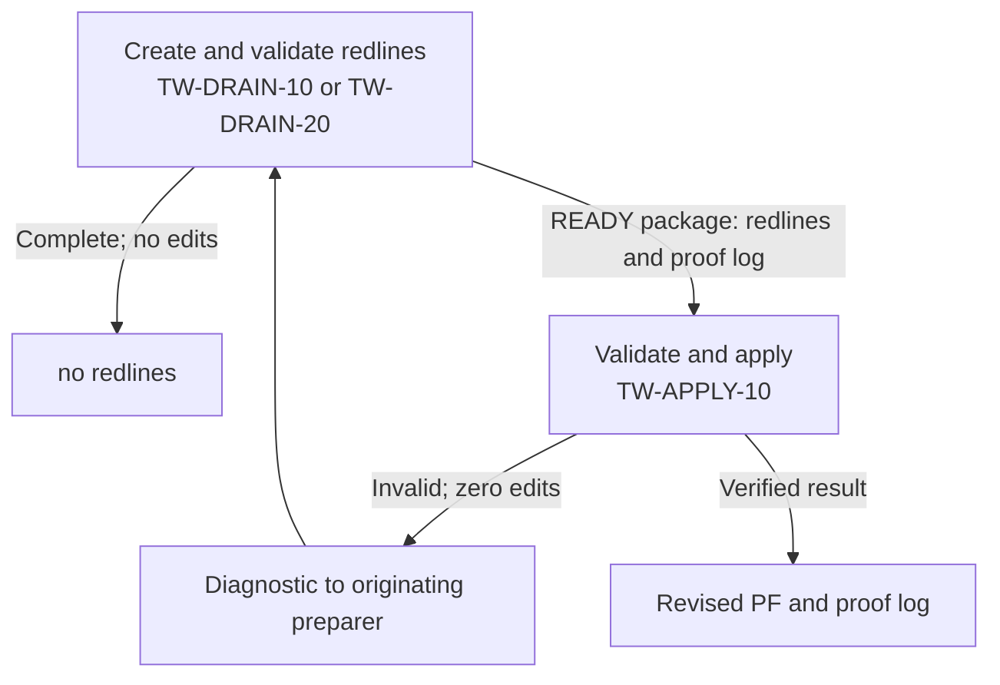

# MODIFICATION-20261005-gtwpe-tw-repository-io

C2 of the writing-side build: the six operational TW prompts take PF canon from the repository and
write their outputs there, the drains and the apply write a proof log beside each artifact they make
(GTWPE-D1), GTWPE-MGMT-10 replaces TW-MGMT-10 as the TW prompts' maintainer, and a new TW-ALPHA
release selects them. The prompts themselves stay in Notion.

## Intake

Not through triage. The request came from PE39 on 2026-10-05 and is copied verbatim in the front
matter. It runs C2, the second change in the order Nathan approved in
MODIFICATION-20261005-gtwpe-writing-side (§A A.5), through GTWPE-MGMT-10 100526.2. Its six numbered
points, under "What C2 is", are ITEM-01 to ITEM-06, in its order. What it puts outside C2 is
recorded in §A, not taken here.

## §A — Analysis

*Written by MODE = ANALYZE. Requires nothing upstream. Frozen once approved.*

This session ran the mode as a GTWPE-MGMT-10 session, following *GTWPE-MGMT-10 — Manage the GTWPE —
100526.2*, the version the catalog selects. It was fetched live at the start of the mode, and again after
a context compaction, as its *Reading prompt bodies* requires; both fetches show it edited
2026-10-05T16:36:11.384Z. The mode started at 2026-10-05T19:39:01Z, with `main` at `20d0dd8`. The request
is in the front matter, verbatim. The record is on `docs/20261005-modification-gtwpe-tw-repository-io`,
the Modification's own branch, as 100526.2 requires (*Entry contract*; *The record*, its *Branch* row). Its
open pull request is amthorn78/glow-hdengine-v2#575. The session's harness had named another branch, and
nothing was pushed there.

### Consult

- **Repository**, on `main` at `20d0dd8`.
  - C1's record, MODIFICATION-20261005-gtwpe-writing-side. Its approved §A sets C2's place in the order
    (A.5) and frames what C2 carries: A.1, A.4 and A.8.
  - The error ledger on `main`, among them E-029, E-032 and E-033.
  - The GTWPE decision record, whole: GTWPE-D1 and what follows from it.
  - The record of TW's latest selection, MODIFICATION-20260930-gtwpe-tw-model-advice: its dispositions,
    the pages it wrote, its Flowmaster question and its control texts.
  - `TW-MGMT-10-ANALYSIS-20260924.md`, findings F1 (the canon source is inverted) and F2 (output has no
    lawful destination).
  - In `docs/prompt_ecosystem_management/`: `modification-template.md` 2.1; `ecosystem-change-management.md`
    §1 and §2; the header of `gtwpe/gtwpe_record_check.py`; and `gcfpe.decision-record.md` `D22`.
  - No `docs/*-modification-gtwpe-*` branch was open (`git ls-remote`), so this ID is new.
- **Installed skills**, read as files: the *Technical Writing specialization* of `tw-flowmaster` 1.3.0's
  `SKILL.md`, through its *Selected-catalog TW profile*.
- **Canon**, on `main` at `20d0dd8`, unchanged since `31deec4`.
  - Searched with `git grep` for the task's terms: `PF10-CANON-001`, `ChatGPT Library`, `change-process
    documents`, `proof log`, `redlines file`, `downloadable`, `TW prompt`, `TW-ALPHA` and the member IDs.
  - Read in full: HDE Build Notes (PF10) 2.29 PF10-CANON-001 and 2.38 PF10-AINEUTRAL-001; HDE Governance
    (PF04) §9.1.3 to §9.1.6.
  - Canon names no TW prompt. It uses "proof log" only for evidence about the engine itself, as GTWPE-D1
    records.
- **Notion, read-only.**
  - The GTWPE parent page and its catalog, edited 2026-10-05T16:37:57.178Z: GTWPE-MGMT-10 at 100526.2,
    checked-through commit `31deec4`.
  - The selection page, *Glow Technical Writing Ecosystem*, edited 2026-10-05T00:30:29.861Z.
  - The six TW bodies that change, at 100426.1, each fetched live after the compaction and read whole
    (*The members, read live*).
  - *HDE TW*, *Alpha 1*, the Glow Operations Hub and the architecture page, for A3.
  - A search for "Glow HDE Living Prompt Flow Map" finds no page by that name, as on 2026-09-30.

### Drift check (A0)

`git fetch origin main`; the commit examined is `20d0dd84898b2d26ae7e7122eba16ac640350ba7` (`20d0dd8`),
#574's merge.

**(a) The lineage sources.** Searches with highlights off on `PE Metaprompt` and `GCFPE-MGMT-10` found no
page that the catalog does not record and that is newer than its record. The other PE Metaprompt hits are
archived predecessors dated 2026-09-12 and 2026-09-13. The other GCFPE-MGMT-10 hits are the archived
`091326.2` and control or tracking pages. Each recorded page was fetched for its exact edit time. The PE
Metaprompt's fetch and the register's were saved by the harness and read by script (*Harness files*).

| Source | Recorded in the catalog | Found, by fetch | Trigger finding |
|---|---|---|---|
| GCFPE-MGMT-10 | Pinned: the proposed body, 2026-09-24T11:00:24.691Z. Selected: `091426.1`, 2026-09-24T15:38 | 11:00:24.691Z; `091426.1` (`3db4590a05eb81d1bb64ebcb3ca8eb54`) at 15:38:34.295Z; the register selects it | None |
| PE Metaprompt | Pinned and selected: `091426.1`, 2026-09-23T17:17:22.217Z | 17:17:22.217Z; the register selects it (`3db4590a05eb8174be35d9e35acb3f77`) | None |

The register page was at 2026-09-23T17:43:39.489Z, the edit time the catalog records.

**(b) The watched paths.** `git log 31deec4..20d0dd8` over *The watched sources* lists nothing. The range
holds two commits, #573 and #574. They change ten files, all under `docs/ephemeral/`, as PE39's request
expects.

No trigger finding. X4 re-pins nothing and moves the checked-through commit to the commit it examines.

### The members, read live

Each member that changes was fetched whole into this session's context after the compaction and read
whole. Each edit time equals the one C1 recorded, so no member has changed since its selection.

| Member | Version, page | Edited | Parent |
|---|---|---|---|
| TW-TRIAGE-10 — Identify PF10 Drain Targets | 100426.1, `3ef4590a05eb818e8295e1b9b2a09248` | 2026-10-04T13:43:27.279Z | *HDE TW* |
| TW-DRAIN-10 — Prepare PF Document Redlines | 100426.1, `3ef4590a05eb81d2a49fcf337bdfd831` | 2026-10-04T14:07:14.620Z | *HDE TW* |
| TW-DRAIN-20 — Prepare PF09 Redlines | 100426.1, `3ef4590a05eb81358170d58214cb1018` | 2026-10-04T14:08:48.149Z | *HDE TW* |
| TW-RECORD-10 — Create Epic History Section | 100426.1, `3ef4590a05eb81f28e25fb2cb7044eaa` | 2026-10-04T14:16:53.241Z | *HDE TW* |
| TW-RECORD-20 — Create CRD History Section | 100426.1, `3ef4590a05eb81cba424e4d3ec08871f` | 2026-10-04T14:20:11.935Z | *HDE TW* |
| TW-APPLY-10 — Apply Validated Redlines | 100426.1, `3ef4590a05eb8107a59bcc474348ca5e` | 2026-10-04T16:28:52.435Z | *HDE TW* |

TW-MGMT-10 100426.1 (`3ef4590a05eb81b5bc74f393bdf358b9`, under the selection page) does not change. It
leaves the selection, and its page stays as it is. It was read whole in this mode before the compaction and
not again, since no step here relies on its text. Its disposition rests on the selection page and on the
lines in the six members that name it.

### The change, settled

The request's six points, by item. C1's approved §A, which the request cites (A.1, A.5 and A.8), frames
them.

**ITEM-01. The prompts stay in Notion.**
- No TW prompt body or copy enters the repository: C2 changes where the prompts read and write, not where
  they live.
- Nathan's words make this a rule for TW. It matches HDE Governance §9.1.6, which keeps reusable GCFPE
  prompt bodies single-homed in Notion, and HDE Build Notes 2.29: "GCFPE prompt bodies remain single-homed
  in Notion".
- One point is open: whether an edit's shortest unique anchor counts as an excerpt (Q-2). Until Nathan
  answers, this record quotes no TW body beyond a short clause.
- Verified at `EXECUTE`: the branch changes only the record and its evidence, and no evidence file holds
  more of a body than Q-2's answer allows.

**ITEM-02. Reading.**
- **R1, canon.** Each of the six reads current authoritative PF Markdown from `docs/pfcanon/` on `main`,
  read-only, and records the commit it read. The PF10 build notes and PF09's phase files are resolved
  there too. A Drive copy, a native Google Doc, memory or reconstructed text is no substitute. HDE Build
  Notes 2.29: "PF-Canon is held in `docs/pfcanon/` on `main`", and "A native Google Doc, a Markdown export,
  a Google Drive folder or a Notion page confers no PF authority".
- **R2, other inputs.** The change source, a drain's package and a record's specification come as attached
  files or repository paths, never from Drive or ChatGPT Library. This is C1 §A A.1's row for the
  architecture's §2, which the request cites.

**ITEM-03. Writing.**
- **R3, outputs.** Each prompt that writes a file:
  - writes it at the repository path its invocation names, under `docs/ephemeral/`;
  - commits it and pushes it on the branch the invocation names, which then has one open pull request,
    opened if none is;
  - never merges, writes under `docs/pfcanon/`, or writes to Google Drive or ChatGPT Library (HDE Build
    Notes 2.29; HDE Governance §9.1.3, whose "prohibition on Drive persistence" stands);
  - stops on an invocation that names no such path, as a missing input, and invents none;
  - gives each output's repository path in its final response.

  TW-TRIAGE-10 still writes nothing: its list stays in the response.
- **R6, run mode.** Each prompt runs as Nathan's direct invocation, or as a pass inside a session he
  started. A pass needs no `TW-PFxx-x` document session of its own. No prompt creates or messages another
  session.

**ITEM-04. Proof logs.**
- **R4.** One file serves as each report and its artifact's proof log, so the two cannot drift apart
  (`DERIV-001`; C1 §A A.8):
  - TW-DRAIN-10's and TW-DRAIN-20's processing report becomes the proof log of the redlines file;
  - TW-APPLY-10's application report becomes the proof log of the revised PF.
- Each proof log is saved beside its artifact, in the same directory, and named after it.
- It carries GTWPE-D1's requirement and its eight minimum items in Nathan's words, so that GTWPE-MGMT-10's
  readback can find each by phrase. The report's present contents stay with them.
- TW-APPLY-10's proof log also states, for each applied operation, its redline ID and the basis the
  preparer's proof log gives for it, not only a pointer to it.

The `GTWPE-D1` record that A2 asks for:

| Prompt | Writes before the change | Writes after it | How the part leaves `GTWPE-D1` whole |
|---|---|---|---|
| TW-DRAIN-10 | A redlines Markdown file, for `READY` and for `BLOCKED` work kept as non-applicable redlines, and a processing report, to Library. Nothing for the exact `no redlines` exit | The redlines file and its proof log (the processing report), beside it and named after it, at the invocation's path. Nothing for `no redlines` | A separate proof log for the redlines file, with all eight minimum items in Nathan's words, linked by its name, its place and the identities it records (item 8). Today the report lacks item 5 and the deviations of item 7 (C1 §A A.8) |
| TW-DRAIN-20 | As TW-DRAIN-10, for a PF09 phase file | As TW-DRAIN-10 | As TW-DRAIN-10 |
| TW-APPLY-10 | The revised PF, a final updated PF Markdown file, and an application report, to Library. A diagnostic and no PF on failure | The revised PF and its proof log (the application report), beside it and named after it. A diagnostic and no PF on failure | A separate proof log for the revised PF, with all eight items, the basis of each applied operation stated, and the same link. Today the report gives item 4 only by pointer and lacks item 5 and deviations |
| TW-RECORD-10, TW-RECORD-20 | One paste-ready section file | The same file, at the invocation's path | Not bound: a section is neither artifact type. C3 binds them once each writes its section into a PF20 or PF30 drafts copy |
| TW-TRIAGE-10 | A list in the response | The same | Not bound |

No prompt writes both artifact types, so no combined proof log is defined. Neither a diagnostic nor
TW-APPLY-10's optional no-change report is an artifact: neither creates a revised PF.

**ITEM-05. The maintainer.**
- **R5.** Each of the six names GTWPE-MGMT-10 as its maintainer where it now names TW-MGMT-10, and keeps it
  no prerequisite on document turns.
- GTWPE-MGMT-10 100526.2 is already "the route by which a TW-ALPHA member is repaired" (*Native purpose*).
  Its "until G5" (E-033) stays for C6, as the request says.
- TW-MGMT-10 leaves the selection. Its page is not edited, since the route never edits an existing
  TW-ALPHA page.

**ITEM-06. The new release.**
- A new TW-ALPHA release, «R» (`TW-ALPHA-<yyyymmdd>.N`, dated by its selection), selects the six new
  versions. TW-MGMT-10 is not among them.
- The change alters how the TW flow runs (below), so the release carries a new *Current operation*, and the
  one it replaces becomes historical.
- The interacting skill `tw-flowmaster` is Q-1.

**Not in C2**, as the request says:
- C3's document rules, the Last Update Gate among them, which waits for Nathan's PF10 sentence;
- the Flow Manager (C4), the Change Manager (C5) and adoption (C6);
- E-033, which stays for C6.

### How the TW flow runs, after the change (A3)

The selected release's *Current operation* describes the flow:
- a drain, TW-DRAIN-10 or TW-DRAIN-20, ends at `no redlines` or with a `READY` package;
- TW-APPLY-10 validates and applies the package, or returns a diagnostic to the originating preparer;
- triage stays list-only, and the record prompts section-only.

Its text also keeps the rules of TW-ALPHA-20260908.1's historical operation, among them "Current Drive
PFCanon and repository mirrors stay read-only to TW workers".

C2 keeps the shape and changes how each step reads, writes and hands on:
- canon comes from `docs/pfcanon/` on `main`, and other inputs are attached files or repository paths;
- each output goes to the invocation's path under `docs/ephemeral/`, committed and pushed, its path named in
  the final response;
- a `READY` package is the redlines file and its proof log, by repository path, and a verified result is the
  revised PF and its proof log;
- a step runs as Nathan's direct invocation or as a pass inside a session he started;
- GTWPE-MGMT-10 maintains the prompts.

So the change alters how the flow runs. The new release carries its own *Current operation* stating this,
and the 2026-09-08 rules it keeps no longer include the Drive sentence. `PLAN` writes the text, and the
route's readback requires exactly one *Current operation* heading on the page.

### Per part: closure, tier, class and targets

One part, PART-01: the six new versions and the new release, which land together. A new version with no
selection has not landed. A selection that mixed repository and Library input and output would break the
drain-to-apply handoff, whose two sides change here.

- **Targets.**
  - `prompt`: the six new versions, each a new versioned sibling under *HDE TW*.
  - `notion_control`: the selection page's three writes; the current-release note on *Alpha 1*, *HDE TW*
    and the Operations Hub; and the catalog's checked-through commit at X4.
- **Closure**, from the relationships in the selected release's *Current operation*:
  - upstream, the producers of the handoffs the changed members consume (the drains' `READY` package and
    TW-APPLY-10's diagnostic): TW-APPLY-10, TW-DRAIN-10 and TW-DRAIN-20;
  - downstream, their consumers: the same three;
  - state sharers: TW-DRAIN-10 and TW-DRAIN-20, which share `READY`, `NO_CHANGE` and `BLOCKED`.

  TW-TRIAGE-10 and the record prompts have no recorded relationship with another member. Every member in
  the closure changes here.
- **Tier 2.**
  - The part changes a handoff: what a `READY` package holds (the report becomes the proof log), where it
    lives (a repository path, not Library), and TW-APPLY-10's intake check. Both sides change in this
    Modification.
  - TW has no executable selftest, and no live trial has run since 2026-09-08. So the gate is a static
    check of both sides of the handoff, with the whole-page readbacks, as the last TW change's was.
- **Class B, rule application.** The part carries rulings already made into the prompts:
  - HDE Build Notes 2.29 (`D7`), on where canon is read and where change-process documents are stored;
  - GTWPE-D1;
  - Nathan's approved order (C1 §A A.5), with his words that writing prompts do not belong in the
    repository.
- **Authoring.**
  - Through the selected PE Metaprompt's general rules, with GTWPE-MGMT-10's workarounds (*Relation to the
    PE Metaprompt*): only the approved edits and the two identity lines change, references stay versionless,
    and no model or effort text is added.
  - "Converge on existing wording" (`ecosystem-change-management.md` §2, step 3): the GCFPE's
    Drive-to-repository storage pass applied the same rule to 44 prompts. Its wording, such as the
    *Artifact and source boundaries* of GCFPE-MGMT-10 091426.1 (read live at A0), is the model for R1 and
    R3.

### Member dispositions (HDE Governance §9.1.6)

| Member or interface | Disposition | Reason |
|---|---|---|
| TW-TRIAGE-10, TW-DRAIN-10, TW-DRAIN-20, TW-RECORD-10, TW-RECORD-20, TW-APPLY-10 | Affected: a new version each | R1, R5 and R6 reach all six; R2 and R3 the five that take inputs or write files; R4 the drains and the apply |
| TW-MGMT-10 100426.1 | Affected: leaves the selection; page unchanged | Request item 5: GTWPE-MGMT-10 maintains the TW prompts |
| TW-ASSESS-10 | Unaffected | Retired and unselected since TW-ALPHA-20261004.1 |
| GTWPE-MGMT-10 100526.2 | Unaffected | It already repairs TW-ALPHA members and makes the selection writes. Its route text assumes eight members (F-1, below). Its "until G5" stays for C6 (E-033) |
| The GTWPE catalog | Unaffected, but for X4's checked-through commit | Its members note already says the TW prompts join the catalog when the build selects them, which is C6 |
| `tw-flowmaster` 1.3.0, `flowmaster-validate` 3.3.2 | Affected | Q-1 |
| `glow-write-boundary`, `glow-artifact-storage` | Unaffected | `docs/ephemeral/` is a path a session may write, and the new route stays inside it |
| The PE Metaprompt 091426.1; the GTWPE decision record | Unaffected | The authoring control, and the ruling applied |
| UTIL-10 (GCFPE) | Unaffected | GCFPE-owned; it overlaps TW-APPLY-10 in name only (TW-MGMT-10 analysis, F10) |
| The GCFPE register and Flow Index; the *Living Prompt Flow Map* | Unaffected | The first two list no TW member, and no page by the third's name exists |

### Scope, and how it was measured (`SCOPE-001`)

**Method: broad match minus permitted exceptions, by reading.**
- Each body came back inline and complete, with no truncation flag, and was read in context.
- Every count below was made by reading the fetch, then checked by a second reading of the same fetch. No
  command counted over a body.
- Matches are case-insensitive, on the stem.
- The broad terms, by rule:
  - R1: `Drive`, `PFCanon`, `mirror`;
  - R2 and R3: `Library`, `download`, `upload`, `reference`, `retriev`, `attach`;
  - R4: `report`;
  - R5: `TW-MGMT-10`;
  - R6: `session`, `initiat`.

**What is in scope.** A passage is a contiguous stretch of in-scope text. Each passage:
- reads or resolves PF canon or PF10 through Drive, names Drive as PF authority, or forbids the
  repository's canon as a "repository mirror" (R1);
- takes an input from Library, Drive or an unnamed "authorized" reference (R2);
- routes an output to a download, an "artifact route" or Library (R3);
- names the pair a drain or the apply writes, defines its report's contents, or hands the package on (R4);
- names TW-MGMT-10 as maintainer or as no prerequisite (R5);
- or requires a dedicated `TW-PFxx-x` document session, or Nathan's own launch in a way that excludes a pass
  (R6).

**The permitted exceptions, kept unchanged:**
- the bans on writing to Drive, which HDE Governance §9.1.3 keeps, though a sentence around one may change;
- a native Google Doc as no substitute for canon;
- "mirror" in the rule on current-repository claims, which concerns the repository's code, not canon;
- generic locators that a repository path satisfies: a "usable retrieval reference", a provider ID or
  usable retrieval reference, actual accessible references, attachments or usable references, evidence and
  source-ledger references, and "Reference" in PF titles;
- a "report" that means the same file once the pair is defined, or that names no artifact: the verb, the
  preflight's "existing report", the save-recovery rules, a legacy package's report, TW-APPLY-10's optional
  no-change report, and the record prompts' ban on producing a report, which is C3's to change;
- the drains' and TW-APPLY-10's *Purpose*, which name the report and stay true once the pair is defined;
- "session" in naming rules, in the bans on creating or messaging another session, in "originating
  preparer/session" lineage, and where Nathan owns or normally starts the session, none of which a pass
  inside a session he started contradicts;
- the relationship lines that say Nathan invokes the next prompt, read with R6's general rule;
- TW-TRIAGE-10's ban on creating files or changing repositories, since it writes nothing.

**Each member's broad hits, by term:**

| Member | `Drive` | `PFCanon` | `mirror` | `Library` | `download` | `upload` | `reference` | `retriev` | `attach` | `report` | `TW-MGMT-10` | `session` | `initiat` |
|---|---|---|---|---|---|---|---|---|---|---|---|---|---|
| TW-TRIAGE-10 | 2 | 1 | 1 | 0 | 0 | 0 | 3 | 0 | 1 | 2 | 1 | 5 | 1 |
| TW-DRAIN-10 | 6 | 1 | 3 | 1 | 3 | 1 | 14 | 8 | 2 | 20 | 2 | 10 | 3 |
| TW-DRAIN-20 | 6 | 2 | 3 | 1 | 3 | 1 | 15 | 8 | 2 | 23 | 2 | 11 | 2 |
| TW-RECORD-10 | 4 | 3 | 2 | 1 | 3 | 1 | 11 | 7 | 1 | 8 | 2 | 7 | 2 |
| TW-RECORD-20 | 4 | 2 | 2 | 1 | 3 | 1 | 7 | 7 | 1 | 8 | 2 | 6 | 2 |
| TW-APPLY-10 | 5 | 2 | 2 | 2 | 6 | 1 | 7 | 7 | 3 | 20 | 2 | 9 | 3 |

**Each member's passages:**

| Member | Hits | In passages | Kept as exceptions | Passages in scope |
|---|---|---|---|---|
| TW-TRIAGE-10 | 17 | 6 | 11 | 5 |
| TW-DRAIN-10 | 74 | 32 | 42 | 15 |
| TW-DRAIN-20 | 79 | 33 | 46 | 16 |
| TW-RECORD-10 | 52 | 22 | 30 | 12 |
| TW-RECORD-20 | 46 | 20 | 26 | 10 |
| TW-APPLY-10 | 69 | 36 | 33 | 14 |

**The passages, by member and section.**
- **TW-TRIAGE-10 (5).**
  - *Coded identity*: the line on who initiates invocations (R6); the maintainer line (R5).
  - *Purpose and authority*: the sentence that reads canon "through Google Drive" (R1); the sentence that
    makes Drive sources read-only (R1).
  - *Source identity and routing*, step 1: "repository mirror" among the forbidden substitutes (R1).
- **TW-DRAIN-10 (15).**
  - *Coded identity*: who initiates invocations (R6); the maintainer line (R5).
  - *Authority and sources*:
    - the session-identity sentences, with `TW-PFxx-x` (R6);
    - TW-MGMT-10 as no prerequisite (R5);
    - canon "through Google Drive in `Glow / Core Docs / PFCanon`" (R1);
    - "repository mirror" as a substitute (R1);
    - the read-only line, with the output route and its bans (R1, R3).
  - *Output identity and save recovery*: "a download" (R3).
  - *Intake and source scope*: the input route (R2); PF10 "in the authoritative Drive directory" (R1); "All
    PF authority still comes from current Drive Markdown" (R1).
  - *Completion, outputs and handoff*: the pair (R4); the report's contents (R4, R3); the references in the
    `READY` handoff (R4, R3); the download links and the Drive ban (R3).
- **TW-DRAIN-20 (16).** TW-DRAIN-10's fifteen, word for word, and *PF09 coverage*'s phase file resolved in
  `Glow / Core Docs / PFCanon` (R1).
- **TW-RECORD-10 (12).**
  - *Coded identity*: who initiates (R6); the maintainer line (R5).
  - *Purpose*: the specification taken "directly or through a usable authorized reference" (R2).
  - *Authority and sources*: the session identity (R6); TW-MGMT-10 as no prerequisite (R5); canon through
    Drive (R1); "repository mirror" (R1); the read-only line with the output route (R1, R3).
  - *Output identity*: "a download" (R3).
  - *Destination*: the target and its schema resolved "from Drive" (R1).
  - *Section-only output*: "one downloadable UTF-8 Markdown file" (R3).
  - *PF20 schema*: "in the PFCanon directory" (R1).
- **TW-RECORD-20 (10).** TW-RECORD-10's twelve, less two: its *Purpose* names no input route, and its PF30
  line names no directory.
- **TW-APPLY-10 (14).**
  - *Coded identity*: who initiates (R6); the maintainer line (R5).
  - *Authority and sources*: the session identity (R6); TW-MGMT-10 as no prerequisite (R5); canon through
    Drive (R1); "repository mirror" (R1); the read-only line with the output route (R1, R3).
  - *Output identity*: "a download" (R3).
  - *Intake*:
    - the inputs, "their preparation report" and how Nathan identifies them: attachments, Library or
      legacy ID fields (R2, R4);
    - current PF authority as "Drive" (R1).
  - *Deterministic final document-control header*: "the changed downloadable PF" (R3).
  - *Exact application and preservation*: the pair and the report's contents (R3, R4).
  - *Invalidity, failure and return*: "a downloadable Markdown diagnostic" (R3).
  - *Diagnostic handoff*: the diagnostic attached rather than named by its path (R3).

**Total: 72 passages in the six members**, with each new version's two identity lines on top: 12.

**The rule-change search (`D26-E`), for the plan.** After the edits, `PFCanon`, `upload`, `TW-MGMT-10`
and `TW-PFxx-x` survive nowhere in the new pages. `Drive` and `Library` survive only in the bans R3 keeps,
and `mirror` only in the repository-claims rule. `PLAN` turns this into absence checks by phrase.

### Pages that name TW's current release (A3)

**Method.** Searches with highlights off on:
- `TW-ALPHA-20261004.1`;
- `100426.1`;
- the six member IDs together;
- `TW-MGMT-10 Manage the Glow TW Ecosystem`;
- the six member titles;
- "current TW release selected TW-ALPHA".

Each page found that could name the current release was fetched (a page last edited before 2026-10-04
cannot). *Alpha 1* and the Hub were saved by the harness and read by script.

| Page | Edited | Names TW's current release | Written by the route |
|---|---|---|---|
| *Glow Technical Writing Ecosystem*, the selection page, `3d44590a05eb8171ab6ff4dab33b00ef` | 2026-10-05T00:30:29.861Z | Yes: its status line and `## Selected release — TW-ALPHA-20261004.1`, with the page's one *Current operation* | Yes: the three selection writes |
| *Alpha 1 — Implementation and Validation*, `3d44590a05eb81fe991ff0114cb43029` | 2026-10-04T17:10:29.105Z | Yes: `## Selected release — TW-ALPHA-20261004.1`, with its seven rows | Yes: the current-release note |
| *HDE TW*, `3c74590a05eb8176baf8cb59f1631f3c` | 2026-10-04T17:10:53.751Z | Yes: `## Current TW release — TW-ALPHA-20261004.1`, which names TW-MGMT-10 100426.1 as maintenance owner | Yes: the current-release note |
| *Glow Operations Hub*, `3ce4590a05eb814f8892f88ff8539308` | 2026-10-04T17:11:07.810Z | Yes: `## Current Glow TW release — TW-ALPHA-20261004.1`, on "the exact seven-member catalog" | Yes: the current-release note |
| *GTWPE Target Architecture — Document-Writing Flow* | 2026-10-05T16:16:17.223Z | No: its dated update of 2026-10-05 names TW-ALPHA-20261004.1 as what the model-advice change made | No (N-1) |
| The GTWPE parent page and catalog; GTWPE-MGMT-10's pages | 2026-10-05 | No: they name TW-ALPHA, but no release | No: X4 writes only the catalog's checked-through commit |
| The TypeSafe usage-log row *GTWPE W1 — first TW repair* | 2026-10-05 | Only as a dated log entry | No |
| Older pages, such as *Glow TW Alpha Implementation Handoff 090726.1*, earlier member versions and GCFPE pages | Before 2026-10-04 | No | No |

**Coverage.** This is the set the record of TW's latest selection wrote: in its *The control texts*, the
selection section on the selection page and *Alpha 1*, and a note on *HDE TW* and on the Hub. Each
member's own text names the selection page as holding its selection.

**Stale text.** C2 makes two notes stale:
- *HDE TW*'s names TW-MGMT-10 100426.1 as maintenance owner;
- the Hub's speaks of "the exact seven-member catalog".

The route replaces neither. It puts each new note above the old one and makes the old heading historical.

### Contradictions and risks

1. **The TW Flowmaster skill (Q-1).**
   - **What it does.** Installed `tw-flowmaster` 1.3.0 has a *Selected-catalog TW profile*. It applies when
     the selected drain and apply prompts carry the exact no-redlines contract, which the new versions still
     do. The profile drives each document through separate sessions, reads the Source Blob and results from
     Drive, and keeps its ledger there (*Source and action lanes*). It also checks a `READY` package and an
     Apply result as saved report pairs.
   - **What would happen.** Against the new release, a Flowmaster run would hand the prompts no output path
     and no repository inputs. Each would stop at its missing-input rule. That is a loud failure, not a
     silent one, provided `PLAN` keeps that rule.
   - **Canon.** HDE Governance §9.1.6: "An edited subgroup is not ready while an affected counterpart
     remains incompatible."
2. **The route assumes eight members (F-1).** *How each kind of target changes* has the new section list
   "the eight members with only the changed rows new". The new release has six members, all new. The plan
   adapts the text, as the last TW change did with seven.
3. **TW-MGMT-10's page stays runnable.** Unselected, its text still makes it the sole TW maintenance owner.
   The route never edits an existing TW-ALPHA page, as with TW-ASSESS-10. The selection page and the three
   notes say that GTWPE-MGMT-10 maintains the TW prompts.
4. **No executable check exists for TW.** The tier 2 gate is static, and no live TW trial has run since
   2026-09-08. The selection page already records runtime behaviour as unproven. C2 changes where every
   step reads and writes, so its first live run is untried.
5. **Where a proof log sits.**
   - The request puts each proof log beside its artifact.
   - C1 §A A.4 sketched the Flow Manager's drafts folder as holding only the replacement documents, with
     the proof logs under `passes/<target>/`.
   - C2 follows the request. C4 settles its own layout with it.
6. **The readbacks are heavy.** Six whole pages are read back by this session, and four control pages. A
   compaction during `EXECUTE` is likely. The body's rule covers it: fetch live again, and never recover a
   body from a transcript.
7. **One reader of the bodies.** The scope rests on this session's reading. No worker can check it, since
   workers do not fetch bodies (`D22`). `PLAN`'s dry run reads the bodies again.
8. **The phrase check sees phrases, not meaning** (`D14`'s note). Carrying GTWPE-D1's eight items in
   Nathan's own words lets the readback find each by phrase. The reviews read for behaviour.
9. **Excerpts (Q-2).** The plan's anchors are short passages of the bodies.

### Defect classes matched (`ecosystem-change-management.md` §4)

- `SCOPE-001`: the scope above is measured by broad match minus exceptions, by reading.
- `GUARD-001`: GTWPE-D1 lands in the three TW prompts that write its artifacts, with its guard:
  GTWPE-MGMT-10's prompt route checks it by phrase on each new page.
- `DERIV-001`: the report and the proof log become one file. The four release pages restate the selection
  by hand.
- `FUNC-001`: `tw-flowmaster` would run the old Drive route by function (Q-1).
- `NAME-001`: TW-APPLY-10's application report is bound by what it accompanies, a final PF, not by its name.

### Findings against GTWPE-MGMT-10 100526.2

- **F-1:** its selection route is worded for eight members (risk 2). It was first recorded by
  MODIFICATION-20260930-gtwpe-tw-model-advice, which adapted it the same way.

### Candidates for separate Modifications (recorded, not taken)

- **F-1**, in a later GTWPE-MGMT-10 repair. It could go with E-033, which the request keeps for C6.
- **N-1.** The architecture page's dated update of 2026-10-05 calls TW-ALPHA-20261004.1 the release the
  model-advice change made "now". It stays true as a dated note. A current wording is the facilitator's, as
  E-032's page fixes were.
- **N-2.** *Alpha 1* still carries a `### Current operation` heading under its historical TW-ALPHA-20260908.1
  release. E-029's fix renamed that heading only on the selection page. Outside the current TW section, it
  is not the route's to write: the facilitator's.
- **For C4:** the layout of the run directory against the request's proof log beside each artifact (risk 5).

### Open questions for the Product Owner

**Q-1. The TW Flowmaster skill (risk 1).**
- **(a) Select the new release in this Modification.** The selection page and the three notes say that
  `tw-flowmaster` 1.3.0 and `flowmaster-validate` 3.3.2 do not run it. TW runs by Nathan's direct
  invocations until the Flow Manager (C4), and C6 retires the skill, as the approved order has it. This
  waives HDE Governance §9.1.6's readiness rule for the skill, which is Nathan's to do.
- **(b) Update `tw-flowmaster`, with any `flowmaster-validate` assertion that pins its wording, in this
  Modification.** It goes through the skill route, and the new release is selected only after Nathan
  installs it, as the last TW change did. That adds a skill part, a skill review cycle and an install, for a
  skill C6 retires.
- **Recommendation: (a).**
  - The approved order already replaces the skill with the Flow Manager (C4) and retires it (C6), so
    updating it now is work C6 throws away.
  - The manual flow is how TW runs.
  - A Flowmaster run against the new release stops loudly; it does not produce a wrong result.

**Q-2. Excerpts in the repository (risk 9).**
- **The two texts.** The request's item 1: "No TW prompt body, copy or excerpt enters the repository."
  GTWPE-MGMT-10 100526.2, *Reading prompt bodies*: "No body enters it, and no passage longer than an edit's
  shortest unique anchor, or, before `PLAN` sets the anchors, than the clause at issue."
- **The practice.** `PLAN` gives each edit as its shortest unique anchor and its new text, in a committed
  `edits.json`, as every earlier TW change has. The last one, MODIFICATION-20260930-gtwpe-tw-model-advice,
  committed 69 edits: 51 located by an anchor and 18 by the two ends of a span. An anchor is a short excerpt
  of a body.
- **(a) Read item 1 as 100526.2 does:** no body, no copy, and no excerpt longer than an edit's shortest
  unique anchor (in `ANALYZE`, the clause at issue). `PLAN`'s checker holds each anchor to that limit.
- **(b) Read it literally:** no anchor is committed. The exact edits would then exist only in one session's
  context. No reviewer could check them, and no fresh session could resume from the record (`D26-C`). This
  analysis has designed no other way to give `PLAN` its edits.
- **Recommendation: (a).** It keeps every body in Notion, which Nathan's words ask for. It also keeps the
  plan reviewable and resumable.

### Readiness and interaction cost

`NEEDS_RULING`, for Q-1 and Q-2. It is advice, not a refusal. No item waits on another item's execution,
and every item's scope is measured.

    interaction_cost = 2 open rulings + 2 + 3 review rounds + 0 skill review cycles + 0 installs + 1 merge = 8

- **Review rounds:** this mode's dry run; `PLAN`'s dry run; and one full review by a single reviewer. A
  second reviewer or a diff check comes only if that review finds a required defect, by the request's
  standing direction.
- **Q-1's option (b)** would add a skill review cycle and an install, making 10.
- **The merge** is the record's pull request, amthorn78/glow-hdengine-v2#575. It is not to be merged before
  the record is `COMPLETE`. No repository file other than the record and its evidence changes, so X2 waits
  for no merge.
- **Splitting saves nothing.** The six versions and the release land as one selection. Splitting one rule
  across runs is what `ecosystem-change-management.md` §1 warns against.

The estimate is in the front matter. Time is the meter, and twice the estimate is where the session stops.

### Dry run (A6)

By this session, read-only, before any return to Nathan. No full review: as in each earlier GTWPE
Modification, `ANALYZE` runs a dry run only, and `PLAN` carries the full review.

| # | Gate | Result |
|---|---|---|
| D1 | `gtwpe_record_check.py` and `modification_validate.py` on a scratch copy of this record at `ANALYZED`, with this round in `reviews` | Both exit 0, 1/1 |
| D2 | Both selftests, from this branch at `20d0dd8`'s files | `gtwpe_record_check.py --selftest` 17/17; `modification_validate.py --selftest` 66/66 |
| D3 | The front matter parses (PyYAML), and its request equals PE39's message; every table in the record has one column count in every row, by script | Parses; the request is verbatim; 7 tables, each consistent |
| D4 | A0 reproduced: `git fetch origin main`; `origin/main`; `git log 31deec4..origin/main` over *The watched sources* | Still `20d0dd8`; no commit |
| D5 | The new versions' titles and the new release label are free | *HDE TW* (edited 2026-10-04T17:10:53.751Z) lists no TW member version after 100426.1, and the selection page names no release after TW-ALPHA-20261004.1 |
| D6 | The scope counts, by a second reading of the six fetches, made before this row | It corrected TW-DRAIN-20's `reference` count from 14 to 15 (its *PF09 coverage*, item 5). It also added `PFCanon` to the broad terms, which found two lines that say "PFCanon" but not "Drive": TW-DRAIN-20's PF09 phase file and TW-RECORD-10's PF20 line. Both are counted above. Every other count was confirmed. No command counted over a body |
| D7 | The record tools need no change for this Modification | By reading at `20d0dd8`: `TARGETS` holds `prompt` and `notion_control`, and the record check needs only the subsections this record has |

No required defect.

### Harness files (`D22` condition 5)

- **Inline fetches, held only in this session's transcript**, which the harness keeps and leaves to its
  teardown:
  - GTWPE-MGMT-10 100526.2, twice: at the mode's start and after the compaction.
  - The seven TW bodies at 100426.1 before the compaction, and the six that change again after it.
  - GCFPE-MGMT-10's proposed body and `091426.1`, fetched at A0 for their edit times.
  - The control pages: the GTWPE parent page, the selection page (twice), *HDE TW* and the architecture
    page.
- **Harness saves, each read by a script that printed only what the check needed:**
  - the PE Metaprompt `091426.1` fetch, `mcp-Notion-notion-fetch-1791229658527.txt`: its title, edit time
    and path;
  - the register, `mcp-Notion-notion-fetch-1791229659479.txt`: its edit time and the two rows of *Current
    selection* that name GCFPE-MGMT-10 and the PE Metaprompt;
  - *Alpha 1*, `toolu_01XJCM3rNWLKfzM1oF7aWKTG.json`, and the Operations Hub,
    `mcp-Notion-notion-fetch-1791229909775.txt`, both control pages: each one's edit time, headings, term
    counts and current TW release section.

  Earlier in this session the harness refused `rm` on its tool-results directory ("Session Transcript
  Tampering"), as `D22`'s refinement of 2026-09-23 foresees. So each save is left to its teardown and not
  read again. So is the PE Metaprompt save from C1's `EXECUTE`, `mcp-Notion-notion-fetch-1791218129501.txt`,
  which this mode did not read. No save was hashed or compared as a body's identity.
- **The session transcript.** After the compaction, `A1`'s verbatim copy of the request needed PE39's
  message, which only the transcript held. A script read it once and printed only the user's typed
  messages that held the request's opening words, never a tool result. The request was saved from it to
  `c2_request.txt` in the scratchpad.
- **Scratch files**, in this session's scratchpad: a copy of PF04 from `main` (canon, not a prompt body);
  the scripts `user_request.py`, `save_meta.py` and `ctl_section.py`; and a scratch copy of this record for
  the dry run.

### Canon and rulings relied on

- **`AGENTS.md`:** the canon-first rule; canon is read-only; the CI-exempt paths; the pull request's
  headings.
- **HDE Build Notes (PF10):**
  - 2.29 PF10-CANON-001: canon in `docs/pfcanon/` on `main`; change-process documents, redlines and
    reports among them, stored in `docs/ephemeral/`; ChatGPT Library and Drive neither destinations nor
    authorities; GCFPE prompt bodies single-homed in Notion. Used for ITEM-01 to ITEM-03.
  - 2.38 PF10-AINEUTRAL-001: no governance requirement for a provider, product, model or effort level;
    this session's Notion reads.
- **HDE Governance (PF04):**
  - §9.1.3: the prohibition on Drive persistence, which stands; final results identify the actual saved
    file. Its human-advice rule for a downstream session is left to Nathan by 2.38, and he settled it for
    the TW prompts (MODIFICATION-20260930-gtwpe-tw-model-advice, E-F2), so no TW prompt carries model
    advice.
  - §9.1.6: every other member's disposition; reconciling interacting skills (Q-1); readback; author,
    checker and acceptor at X5; reusable bodies single-homed in Notion.
- **Rulings:**
  - GTWPE-D1 (ITEM-04).
  - In `gcfpe.decision-record.md`: `D7`; `D14`'s note of 2026-09-23; `D22`, read in this mode, with its
    refinement; and `D21` and `D26` as GTWPE-MGMT-10 100526.2 states them.
  - Nathan's approved order, C1 §A A.5, approved 2026-10-05, and his words that writing prompts do not
    belong in the repository, as the request quotes them. His direction of 2026-09-29 that no TW prompt
    carries model advice. No TypeSafe scoring.
- **`ecosystem-change-management.md`:** §1, one rule applied wherever it reaches; §2, class B and
  converging on existing wording.
- **GTWPE-MGMT-10 100526.2**, as fetched at the start of this mode: *Entry contract*, *The spine*, `MODE =
  ANALYZE`, *How each kind of target changes*, *The watched sources* and *Relation to the PE Metaprompt*.

**This mode's own cost.** Time: from 2026-10-05T19:39:01Z to A7 at about 2026-10-05T20:09Z, about 30
minutes by the session's clock. Tokens: not measured by this session.

## §P — Plan

*Written by MODE = PLAN. Requires analyze_approved_by. Frozen once approved.*

This session ran the mode as a GTWPE-MGMT-10 session, following *GTWPE-MGMT-10 — Manage the GTWPE —
100526.2*, fetched live at the start of the mode: edited 2026-10-05T16:36:11.384Z, unchanged since §A.

- **Input:** §A as Nathan approved it at `8cd6fcc` on 2026-10-05. His words are in `analyze_approved_by`,
  committed and pushed at `daa0496`, and the mode started with that recording, at 2026-10-05T22:44:34Z.
- **Authoring control:** the selected PE Metaprompt 091426.1, edited 2026-09-23T17:17:22.217Z. It was
  read in this mode for its general rules: characters 0 to 27,716 and 55,300 to 75,528 of its content's
  75,528. The rest is its GCFPE overlay, which GTWPE-MGMT-10's workarounds set aside.
- **How the edits follow its general rules and the body's workarounds:**
  - the two identity lines move to the new version, by the `MMDDYY.N` rule;
  - each new page is a sibling under the exact source parent, after a title check;
  - references stay versionless, and each rule is said once in each prompt, where the prompt already says
    it;
  - PF resources are read from `docs/pfcanon/`, and working artifacts are written under `docs/ephemeral/`
    with their repository path recorded, as the PE's own rules for Glow work say;
  - no runtime-selection, configuration or workload text is added;
  - everything outside the approved edits is kept.

### Nathan's directions, and how this plan applies them

- **Q-1, option (a).** The new release is selected in this Modification (X4.3). The selection page and the
  three notes say that `tw-flowmaster` 1.3.0 and `flowmaster-validate` 3.3.2 do not run it, and that TW
  runs by Nathan's direct invocations until the Flow Manager (C4). His waiver of HDE Governance §9.1.6's
  interacting-skill readiness is in the `override` block. No skill is changed or installed.
- **Q-2, option (a), with his correction.** The words "copy or excerpt" in the request's item 1 were
  PE39's. Nathan's direction was "writing prompts do not belong in repo." Item 1 is read as GTWPE-MGMT-10
  100526.2 states it:
  - no body and no copy enters the repository;
  - no passage of a body longer than an edit's shortest unique anchor does either.

  Each anchor in `edits.json` is the exact text its edit replaces, cut to the clause at issue, and no kept
  text beside an anchor is committed. The longest anchor is OUT-A, the read-only line with the output
  route, at 220 characters. Apart from the anchors, §P quotes each body only in its first line, its
  headings and its last words, for the populated and heading checks. Those are short identifying phrases,
  none longer than an anchor.
- **"this flow can be simplified, let's not overcomplicate this".**
  - One part, six new pages, one call of edits each.
  - No readback worker: 100526.2's route asks for this session's whole-page readback.
  - No tool, skill or install, and no merge before `COMPLETE`.
  - The control-page texts reuse the page's own form, as the last TW change wrote it.
- **One dry run and one full review by a single reviewer.** A second reviewer or a check of the repair's
  diff only if that review finds a required defect.
- **Stop rather than produce substandard results.** A failed check stops the run, and nothing is repaired
  in flight (*How the plan runs*).
- **The stop rule's meter is time.**
  - The recorded estimate is about 3.5 h for `PLAN` and about 3 h for `EXECUTE`.
  - So this mode stops at 7 h on the meter from 22:44Z, leaving out each wait for Nathan.
  - `EXECUTE` stops at 6 h from X1.1, not counting a wait for Nathan.
- **`GTWPE-MGMT-10` 100526.2's own `GTWPE-D1` guard applies** (request item 4). The three bound prompts'
  new pages are read back for `GTWPE-D1`'s requirement and each of its eight minimum items, by phrase
  (X1.3, check 11).
  - The new texts carry the eight items in Nathan's own words, as edits PL-B and PL-F list them, so that
    the phrase check finds each one.
  - `edits_check.py`'s `PROOF` check holds those texts to the decision record's wording before anything
    is sent.
- **No TW prompt carries model, effort or strength advice, and no TypeSafe scoring.** `edits_check.py`'s
  `EXCLUDED` check holds every new text to the PE's authoring exclusion. Nothing is scored.

### How the plan runs

`EXECUTE` applies the steps below in order, and every step's check must pass before the next starts.

- **X1** makes the six new pages, one member at a time, and reads each back (W1 to W18).
- **X2** commits and pushes the record. No repository file other than the record and its evidence changes,
  and nothing is installed, so the run goes straight on, as X2 provides.
- **X3** does not apply.
- **X4** runs the drift check over the range since `20d0dd8`, the commit §A examined. It then makes the
  control writes:
  - the catalog's checked-through commit (W19);
  - the selection, with its new *Current operation* (W20);
  - the current-release notes on *Alpha 1*, *HDE TW* and the Operations Hub (W21 to W23).
- **X5** closes the record.

**A stop.** A failed check, or a tool error, stops the run. The Modification has one part:
- before W1, a failed precondition stops the run with nothing written, and it returns
  `IMPLEMENTATION_BLOCKED`;
- from W1 on, a failure takes `D26-B`'s path (*Failure path*), and nothing more is written.

**Waiting for each write.**
- Every `notion-update-page` call is sent with `allow_async: false`.
- If a call still returns an async task, the run polls it until it reports success, and only then makes
  the step's check.
- A task that reports failure is a tool error, and the page is fetched again before anything else.
- On the failure path, every pending task is polled to its end before the sweep.

**Every text below is sent exactly as written**, with the values substituted and nothing else changed.
Each member's edits go in one call, printed from the committed `edits.json` by script.

### Values

| Value | What it is, and when it is fixed |
|---|---|
| «D» | `EXECUTE`'s UTC date at X1.1, as `yyyy-mm-dd` |
| «V» | At X1.2, by the PE Metaprompt's version rule: «D» as `MMDDYY`, then `.1`, the version of all six new pages. Each member's current version, 100426.1, is of an earlier date, so N starts at 1. For «D» = 2026-10-05 it is `100526.1`; for 2026-10-06, `100626.1`. A child of *HDE TW* that already carries a new title is a collision, and a stop (X1.0 (4)): the PE forbids incrementing to evade one |
| «ID:…» | At X1.3, each new page's ID as its duplication returns it, written as 32 hex digits without dashes: «ID:TRIAGE», «ID:DRAIN-10», «ID:DRAIN-20», «ID:RECORD-10», «ID:RECORD-20», «ID:APPLY-10» |
| «S» | At X4.1: the UTC date, as `yyyy-mm-dd` |
| «R» | At X4.3's pre-read: `TW-ALPHA-<yyyymmdd of «S»>.N`, where N is one more than the highest N the selection page names for that date, or 1 if it names none |
| «PA» | `plan_approved_date` |
| «M», «m» | At X4.1: `origin/main` after `git fetch origin main`, in full and as its first seven characters |
| «H» | Fixed in this plan: the sha256 of `edits.json` as committed with this plan (*Values fixed in this plan*) |

### Evidence files

In `docs/ephemeral/modifications/evidence/gtwpe-tw-repository-io/`, committed with this section:

| File | What it is |
|---|---|
| `edits.json` | The 94 edits, W3 for each member: for each, its member, rule key, item, rule, where it sits, its anchor (`old`) and its new text; each member's page, title prefix and edit time; `GTWPE-D1`'s requirement and eight items; §A's counts before; and the phrases that must be absent after |
| `edits_check.py` | The file's consistency check. It reads `edits.json` and the GTWPE decision record only, and writes nothing. It also derives each member's counts after and the check phrases' counts. `--inject` shows that each check fails on its own fault (dry run P2) |
| `ctl_check.py` | The pre-read and readback of *Alpha 1* and the Operations Hub, whose fetches the harness saves. It is a copy, byte-identical, of `evidence/gtwpe-tw-model-advice/ctl_check.py`, the script the last TW change used for the same two pages, both at sha256 `4e968007698d833dd6d3e50d0fd6ed8daffdbd75e3865f3e1c32c9a1720923c5`. It is copied so that this record does not depend on another record's evidence, which Nathan may prune |
| `PLAN-REVIEW-BRIEF.md` | PL3's review brief, committed before the reviewer is spawned |
| `PLAN-REVIEW.md` | The reviewer's return, captured unedited from its own transcript |

### Values fixed in this plan

| Value | Fixed as |
|---|---|
| «H» | `768d9255303185d90f9ac3dffa95b8161ebfc96811de8606ecae6e22aa84d542`, the sha256 of `edits.json`, 44,233 bytes, as the dry run's repairs left it (*Dry run (PL3)*) |

### The edits, by rule

`edits.json` holds each edit's exact anchor and new text. Each rule key is one text, sent in every member
it reaches (`edits_check.py`'s `SHARED` check).

| Rule key | Item, rule | What it does | Members |
|---|---|---|---|
| ID-1, ID-2 | identity | The title line's version and `Prompt Version:` become «V» | All six |
| RUN-A, RUN-B | ITEM-03, R6 | Nathan initiates invocations "directly or through a session he started that runs this prompt as a pass" | RUN-A: TRIAGE, RECORD-10, RECORD-20. RUN-B: DRAIN-10, DRAIN-20, APPLY-10 |
| RUN-C | ITEM-03, R6 | The `TW-PFxx-x` document-session identity gives way to a session Nathan started, or a pass inside one; the target/volume is the invocation's | The five document prompts |
| MNT-A, MNT-B, MNT-C | ITEM-05, R5 | GTWPE-MGMT-10 maintains the prompt, and is no prerequisite on document turns | MNT-A and MNT-C: every member that names TW-MGMT-10 so; MNT-B: APPLY-10's "this role" |
| CAN-A | ITEM-02, R1 | Canon is read from `docs/pfcanon/` on `main`, and the commit read is recorded | All six |
| CAN-B | ITEM-02, R1 | A Google Drive copy, not a "repository mirror", is among the forbidden substitutes | All six |
| CAN-C | ITEM-02, R1 | TRIAGE: every PF and source is read-only, no longer "Drive and PF sources" | TRIAGE |
| CAN-D, CAN-E | ITEM-02, R1 | PF10 is resolved, and all PF authority comes, from `docs/pfcanon/` on `main` | The drains |
| CAN-F | ITEM-02, R1 | The PF09 phase file is resolved in `docs/pfcanon/` on `main` | DRAIN-20 |
| CAN-G, CAN-H | ITEM-02, R1 | The record's target and schema, and PF20, are resolved in `docs/pfcanon/` on `main` | CAN-G: the record prompts. CAN-H: RECORD-10 |
| CAN-I | ITEM-02, R1 | Current authoritative PF Markdown remains `docs/pfcanon/` on `main` | APPLY-10 |
| IN-A, IN-B, IN-C | ITEM-02, R2 | Inputs come as attached files or repository paths, never from Google Drive or ChatGPT Library; APPLY-10's legacy ID fields go | IN-A: the drains. IN-B: RECORD-10. IN-C: APPLY-10 |
| OUT-A, OUT-B | ITEM-03, R1, R3 | The read-only line and the output route: outputs are written at the repository path the invocation names under `docs/ephemeral/`, and committed and pushed on its branch, which then has one open pull request, opened if none is. A missing path is a missing input, and the prompt stops and asks. The prompt never merges or writes to Drive, ChatGPT Library or `docs/pfcanon/`. "repository mirror" and "create a PR" go | The five document prompts |
| OUT-C | ITEM-03, R3 | "a download" becomes "an output file" | The five document prompts |
| OUT-D | ITEM-03, R3 | The section file goes to the repository path the invocation names | The record prompts |
| OUT-E | ITEM-03, R3 | The final response gives each output's repository path and commit; nothing is written to Drive or Library | The drains |
| OUT-F, OUT-G, OUT-H, OUT-I | ITEM-03, R3 | APPLY-10's "downloadable PF", "revised download", "downloadable Markdown diagnostic" and attached diagnostic become the revised PF and a diagnostic named by its repository path. OUT-G also gives each output's repository path, with the commit that holds it, in the final response | APPLY-10 |
| PL-A, PL-B, PL-C, PL-D | ITEM-04, R4 | The drains write the redlines file and, beside it and named after it (`.proof-log` before `.md`), its separate proof log, which is the processing report. It records `GTWPE-D1`'s eight items in Nathan's words, with the report's present contents, and its outputs by repository path; the `READY` handoff carries the redlines file and its proof log by repository path | The drains |
| PL-E, PL-F, PL-G | ITEM-04, R4 | TW-APPLY-10 takes the redlines and their proof log. It writes the revised PF and, beside it and named after it, its separate proof log, which is the application report, with the eight items and, for each applied operation, the basis itself: the redline's ID, rationale and source-ledger reference | APPLY-10 |

Per member: TRIAGE 7 edits, DRAIN-10 19, DRAIN-20 20, RECORD-10 15, RECORD-20 13, APPLY-10 20; 94 in all.
They cover §A's 72 passages and the 12 identity lines. A passage with two clauses at issue takes one edit
per clause, so that no anchor carries kept text. Eight passages take two edits each:
- the read-only line with its output route (OUT-A and OUT-B), in each of the five document prompts;
- the drains' report contents (PL-B and PL-C), in each drain;
- TW-APPLY-10's inputs (PL-E and IN-C).

One passage takes three: TW-APPLY-10's paragraph on actual edits (PL-F, PL-G and OUT-G). That makes 82 body
edits for 72 passages.

**ITEM-01** is kept by the edits' form, as Q-2's answer reads it, and verified at X5: the branch changes
only the record and its evidence, and `edits.json` holds no passage longer than its anchors.

### The new pages' checks

What the readback (X1.3, step g) expects of each new page.
- **Counts by term.** Counted by reading, case-insensitive, on the stem. `edits_check.py` derives each
  count from §A's count before, less the anchors' occurrences and plus the new texts'. The `pfcanon`
  column counts `docs/pfcanon/`.
- **Check phrases.** Each occurs 0 times in the current version (dry run P3). After the edits it occurs as
  many times as the new texts hold it.

| Member | `Drive` | `pfcanon` | `mirror` | `Library` | `download` | `upload` | `reference` | `retriev` | `attach` | `report` | `TW-MGMT-10` | `session` | `initiat` |
|---|---|---|---|---|---|---|---|---|---|---|---|---|---|
| TRIAGE | 1 | 1 | 0 | 0 | 0 | 0 | 3 | 0 | 1 | 2 | 0 | 6 | 1 |
| DRAIN-10 | 4 | 5 | 1 | 3 | 0 | 0 | 11 | 5 | 3 | 18 | 0 | 12 | 3 |
| DRAIN-20 | 4 | 6 | 1 | 3 | 0 | 0 | 12 | 5 | 3 | 21 | 0 | 13 | 2 |
| RECORD-10 | 3 | 5 | 0 | 2 | 0 | 0 | 10 | 7 | 2 | 8 | 0 | 8 | 2 |
| RECORD-20 | 2 | 4 | 0 | 1 | 0 | 0 | 7 | 7 | 1 | 8 | 0 | 7 | 2 |
| APPLY-10 | 4 | 4 | 0 | 2 | 0 | 0 | 5 | 5 | 2 | 21 | 0 | 11 | 3 |

| Member | Check phrases after, with counts |
|---|---|
| TRIAGE | `GTWPE-MGMT-10` 1; `` `docs/pfcanon/` on `main` `` 1; `as a pass` 1 |
| DRAIN-10 | `GTWPE-MGMT-10` 2; `` `docs/pfcanon/` on `main` `` 3; `` `docs/ephemeral/` `` 1; `as a pass` 2; `separate proof log` 2; `` `.proof-log` before `.md` `` 1; `attached files or repository paths` 1; `opened if none is` 1; `stop and ask for it` 1; `by repository path` 1 |
| DRAIN-20 | As DRAIN-10, with `` `docs/pfcanon/` on `main` `` 4 |
| RECORD-10 | `GTWPE-MGMT-10` 2; `` `docs/pfcanon/` on `main` `` 3; `` `docs/ephemeral/` `` 1; `as a pass` 2; `attached file or a repository path` 1; `opened if none is` 1; `stop and ask for it` 1 |
| RECORD-20 | `GTWPE-MGMT-10` 2; `` `docs/pfcanon/` on `main` `` 2; `` `docs/ephemeral/` `` 1; `as a pass` 2; `opened if none is` 1; `stop and ask for it` 1 |
| APPLY-10 | As DRAIN-10, with `` `docs/pfcanon/` on `main` `` 2 and `by repository path` 0 |

**The current versions' structure.** The new pages keep it, since no edit touches a heading or a page's end.

| Member | Headings, in order | Last words |
|---|---|---|
| TRIAGE | Coded identity and relationships; Purpose and authority; Source identity and routing; Output (4) | "chooses a new session for Nathan." |
| DRAIN-10 | Coded identity and relationships; Purpose; Authority and sources; Turn preflight and continuity; Output identity and save recovery; Intake and source scope; General PF preparation; Exact redline contract; Producer validation before READY; Completion, outputs and handoff; Formatted final-response handoff (11) | "for the exact no-change exit." |
| DRAIN-20 | As DRAIN-10, with Development-board independence and PF09 coverage and native semantics after Intake and source scope, and no General PF preparation (12) | As DRAIN-10 |
| RECORD-10 | Coded identity and relationships; Purpose and minimal inputs; Authority and sources; Turn preflight and continuity; Output identity and save recovery; Destination, source roles and record preparation; Section-only output and completion; PF20 schema and native detail (8) | "without a cleanup pass." |
| RECORD-20 | As RECORD-10, with PF30 schema and native detail last (8) | "produce a full PF30 artifact." |
| APPLY-10 | Coded identity and relationships; Purpose and selection boundary; Authority and sources; Turn preflight and continuity; Output identity and save recovery; Intake and preparation-state verification; Accepted operations and whole-batch validation; Deterministic final document-control header; Exact application and preservation; Invalidity, failure and return; Diagnostic handoff (11) | "Do not resend or correct it yourself." |

Each heading is a second-level `##` heading. Each member's first line now reads `<title prefix> — 100426.1`,
its title prefix being `edits.json`'s.

### Before any write: X1.0, the preconditions

All read-only. If one fails, nothing is written, and the run returns `IMPLEMENTATION_BLOCKED`.

0. GTWPE-MGMT-10 100526.2, `3f04590a05eb8128b8c8ff3650ab2d5a`, fetched live at the start of `EXECUTE`:
   edited 2026-10-05T16:36:11.384Z.
1. Each of the six members' current pages, fetched live:
   - its edit time is §A's (*The members, read live*);
   - its first line, headings and last words are the table's.

   A later edit means the anchors may have moved, so the plan is wrong. Its recovery is a new
   Modification, Nathan's to order.
2. `edits.json`'s sha256 is «H», and `edits_check.py` exits 0 on it.
3. In each member's fetch, by reading, checked by a second reading:
   - every `old` of that member occurs once;
   - each `absent_after` phrase occurs exactly as many times as the member's `old` texts hold it;
   - each check phrase occurs 0 times.
4. *HDE TW*, `3c74590a05eb8176baf8cb59f1631f3c`, fetched: no child page carries any of the six new titles,
   `<title prefix> — «V»`.
5. The control pages carry their old texts once, at the edit times the dry run found (P4). A later edit is
   read and recorded; the run stops only if an old text is gone or occurs twice.
   - The selection page, `3d44590a05eb8171ab6ff4dab33b00ef`: SEL-1 and SEL-2.
   - *HDE TW*: HDE-OLD.
   - The GTWPE parent page, `3ea4590a05eb818c915bdfd3d150c44b`: CAT-OLD.
   - *Alpha 1*, `3d44590a05eb81fe991ff0114cb43029`, and the Operations Hub,
     `3ce4590a05eb814f8892f88ff8539308`: `ctl_check.py pre` exits 0 on each one's save.
6. The PE Metaprompt 091426.1, `3db4590a05eb8174be35d9e35acb3f77`, fetched: edited
   2026-09-23T17:17:22.217Z. This is the PE's rule to recheck source and control versions immediately
   before publication or a selection change. The harness saves that fetch, and a script reads its edit time
   alone.
7. `git fetch origin main` succeeds, and `origin/main` is recorded in §E. A change to a watched path since
   `20d0dd8` is not a stop here; X4.1 records it.
8. The record checked out holds this plan with `plan_approved_by` set.

### The steps

Twenty-three Notion writes, W1 to W23. The plan makes no other.

| # | part | target | edit | authority | verification | rollback |
|---|---|---|---|---|---|---|
| X1.1 | — | the record | Set the status to `EXECUTING`. Fix «D» and «PA», and record them in §E with the UTC time, which starts the clock | GTWPE-MGMT-10 X1 | The values are in §E before X1.2 | None needed |
| X1.2 | — | — | The preconditions X1.0 (0) to (8); fix «V» | This plan | Each as X1.0 states it | None needed |
| X1.3 | PART-01 | `prompt` | For each member in the order TRIAGE, DRAIN-10, DRAIN-20, RECORD-10, RECORD-20, APPLY-10: **(a)** Fetch *HDE TW*: no child page titled `<title prefix> — «V»`. **(b)** **Write 1** (W1, W4, W7, W10, W13, W16): `notion-duplicate-page` on the member's current page; «ID» is the returned ID. **(c)** Fetch «ID» until populated: at most six fetches, the second onwards after a wait of about 20 seconds, run as a background `sleep 20`, since the harness blocks a foreground sleep. Populated means: its first nonblank line is `<title prefix> — 100426.1`; its last heading and last words are the table's; and the fetch reports no truncation or unknown block. **(d)** **Write 2**: `notion-update-page`, `update_properties`, `allow_async: false`: title `<title prefix> — «V»`. **(e)** **Write 3**: `notion-update-page`, `update_content`, `allow_async: false`: the member's edits from `edits.json`, in file order, in one call, each `old_str` and `new_str` printed from the committed file by script, with «V» substituted in its two identity edits | The prompt-page route; ITEM-02 to ITEM-05; this plan's approval (`notion-write-boundary.md`) | **(f)** The call returns an ID different from the current page's; populated by the sixth fetch, with *HDE TW* as parent; otherwise stop (`D26-B`). **(g)** Fetch «ID» whole, into this session's context, and check it. Every count is made by reading and checked by a second reading. (1) The title is exactly `<title prefix> — «V»`; (2) the parent is *HDE TW*; (3) the first two nonblank lines are that title and `Prompt Version: «V»`; (4) each edit's new text is present whole, read against `edits.json`, at the place its `where` names; (5) each `absent_after` phrase occurs 0 times in the page's content, not its title property or the fetch's URLs; (6) each check phrase occurs at its count (*The new pages' checks*); (7) the 13 terms occur at their counts after, and each hit is in a new text or one of §A's exceptions; (8) the headings, in order, are the table's; (9) the page ends with the table's last words; (10) the fetch reports no truncation or unknown block; (11) for DRAIN-10, DRAIN-20 and APPLY-10, `GTWPE-D1`'s requirement, `separate proof log`, and each of its eight minimum items, as `edits.json`'s `gtwpe_d1` words them, occur by phrase. **(h)** Fetch *HDE TW*: exactly one child page carries the new title, and it is «ID»; fetch the current page: its edit time is unchanged. A failed check stops the run (`D26-B`); a hit in (7) that still says what an edit removes is a wrong plan (*If the plan is wrong*) | Before X4, Nathan archives the new pages; the current pages are never touched |
| X2 | — | the record | Commit the record with X1's values and dispositions. Run `gtwpe_record_check.py` and `modification_validate.py` on it at `EXECUTING`; push. No repository file other than the record and its evidence changes, and nothing is installed, so the run goes on to X4 | GTWPE-MGMT-10 X2 ("Otherwise push the record and go on to X4") | Both exit 0; after the push, the branch's blob equals the local file; amthorn78/glow-hdengine-v2#575 is open | — |
| X3 | — | — | Not applicable: X2 waits for no merge or install. Recorded `NOT_APPLICABLE` with that reason | GTWPE-MGMT-10 X3 | The disposition is in §E | — |
| X4.1 | — | — | `git fetch origin main`; fix «M», «m» and «S»; `git log --format='%H %cI %s' 20d0dd8..«M»` over *The watched sources*, leaving out this Modification's own files. For each commit, a trigger finding in §E with its `D26-E` search: the change's own terms in 100526.2 as fetched at X1.2 and in `docs/prompt_ecosystem_management/gtwpe/` at «M», each with its count | GTWPE-MGMT-10 X4; §A *Drift check*, which examined through `20d0dd8` | Every commit the log lists has a trigger finding in §E. A change that contradicts the GTWPE is recorded for Nathan and does not stop the run | None needed |
| X4.2 | — | `notion_control` | **W19.** The GTWPE parent page. Pre-read: fetch it; CAT-OLD once, by reading; record its edit time, headings and child pages in §E. Then `update_content`, `allow_async: false`: CAT-OLD becomes CAT-NEW | GTWPE-MGMT-10 X4 ("set the checked-through commit") | Fetch it again: CAT-NEW present and CAT-OLD absent, by reading; the members table, the lineage pins, the *Approved design* entry, the headings and the child pages as the pre-read showed them | The reverse replacement, with its text taken from this readback |
| X4.3 | PART-01 | `notion_control` | **W20.** The selection page. Pre-read: fetch it; fix «R» from it; SEL-1's old text once and SEL-2's once; `Selected release — «R»` absent; record its edit time, headings and child pages in §E. Then `update_content`, `allow_async: false`, two replacements in one call, in this order: SEL-1, then SEL-2 | The route for TW-ALPHA's selection, its writes (1) to (3); ITEM-05, ITEM-06; Q-1 | Fetch it again, by reading, checked by a second reading. (1) The first line is the new status line. (2) Below it, `## Selected release — «R»`, with «S» and «PA» as sent and its six rows, each linking its «ID» and ending `; «V».`. (3) Below them, `### Current operation`, with the diagram and the three paragraphs as sent. (4) Then `## Historical selected release — TW-ALPHA-20261004.1`, and within that section `### Historical operation — TW-ALPHA-20261004.1`. (5) Exactly one heading on the page is named `Current operation`. (6) The heading list is the pre-read's, with the new section's two headings added at the top and the two renamed. (7) The child pages are as the pre-read showed them, and nothing else on the page changed | The reverse replacements, with their texts taken from this readback; or a newer release selecting the prior versions by the same writes |
| X4.4 | PART-01 | `notion_control` | **W21.** *Alpha 1*. Pre-read: fetch it; the harness saves it; `python3 ctl_check.py pre <save> <scratch>/alpha1.json '## Selected release — TW-ALPHA-20261004.1'` exits 0. Then one replacement: A1-OLD becomes A1-NEW | The route's write (4) | Fetch it again; `python3 ctl_check.py post <save> <scratch>/alpha1.json '## Selected release — «R»' '## Historical selected release — TW-ALPHA-20261004.1' --has 'Selected: «S».' --has '«PA»' --row TW-TRIAGE-10=«ID:TRIAGE»@«V» --row TW-DRAIN-10=«ID:DRAIN-10»@«V» --row TW-DRAIN-20=«ID:DRAIN-20»@«V» --row TW-RECORD-10=«ID:RECORD-10»@«V» --row TW-RECORD-20=«ID:RECORD-20»@«V» --row TW-APPLY-10=«ID:APPLY-10»@«V»` exits 0, every check `PASS`. Each save is deleted after its check, or, where the harness refuses, left to its teardown and named in §E | As X4.3 |
| X4.5 | PART-01 | `notion_control` | **W22.** *HDE TW*. Pre-read: fetch it; HDE-OLD once, as its first line, by reading; record its edit time, headings and child pages (the six new ones among them since X1.3) in §E. Then one replacement: HDE-OLD becomes HDE-NEW | The route's write (4) | Fetch it again: the page begins with HDE-NEW, with «R», «V» and «PA» as sent; the heading list is the pre-read's, with HDE-NEW's heading added above the renamed one; the child pages as the pre-read showed them | As X4.3 |
| X4.6 | PART-01 | `notion_control` | **W23.** The Operations Hub. Pre-read: fetch it; the harness saves it; `python3 ctl_check.py pre <save> <scratch>/hub.json '## Current Glow TW release — TW-ALPHA-20261004.1'` exits 0. Then one replacement: HUB-OLD becomes HUB-NEW | The route's write (4) | Fetch it again; `python3 ctl_check.py post <save> <scratch>/hub.json '## Current Glow TW release — «R»' '## Historical Glow TW release — TW-ALPHA-20261004.1' --has '**«R» is selected.**' --has 'Every member is at «V»' --has '«PA»' --has 'six-member catalog'` exits 0, every check `PASS`; the saves as X4.4 | As X4.3 |
| X5 | — | the record | Record every step's and item's disposition. ITEM-01 is `VERIFIED` when `git diff --stat origin/main...HEAD` lists only files under `docs/ephemeral/modifications/` and `edits_check.py` still exits 0. Record `interaction_cost_actual` against 8, the actual author, checker and acceptor of the part, and the time on the clock. Set the status to `COMPLETE`; commit and push. The branch is kept, since X2 waited for no merge. Return `ECOSYSTEM_CHANGE_COMPLETE` with X4.1's trigger findings | GTWPE-MGMT-10 X5 | Both checks exit 0 at `COMPLETE`; after `git fetch`, the branch's blob equals the local file | — |

### The control texts

Control-page text, quoted in full. These are page state, not prompt bodies. Each old text occurs once on
its page (dry run P4). A mention is compared by its link, since Notion can show a linked page by its title.

**SEL-1**, on the selection page: the 20261004.1 release's *Current operation* heading.

```
### Current operation
```
```
### Historical operation — TW-ALPHA-20261004.1
```

**SEL-2**, on the selection page: the status line and the current release's heading, two lines.

```
**Status: TW-ALPHA-20261004.1 selected; model advice removed and TW-ASSESS-10 retired. Live follow-up trial pending; PF04 cause unresolved.**
## Selected release — TW-ALPHA-20261004.1
```

SEL-2's new text is the line below, a newline, *SECTION*, a newline, and
`## Historical selected release — TW-ALPHA-20261004.1`:

```
**Status: «R» selected; the TW prompts read and write through the repository, with a proof log beside each artifact. Live follow-up trial pending; PF04 cause unresolved.**
```

SEL-1 is sent first, while the page has one `### Current operation` heading; SEL-2 then adds the new one.
SEL-1's new text does not contain SEL-2's old text, so each still matches once when sent.

*SECTION*, on the selection page:

````
## Selected release — «R»
**Selected: «S».** Authority: MODIFICATION-20261005-gtwpe-tw-repository-io, run through GTWPE-MGMT-10 on Nathan's plan approval of «PA». The six operational TW prompts read PF canon from `docs/pfcanon/` on `main`, take their other inputs as attached files or repository paths, and write their outputs at the repository path each invocation names under `docs/ephemeral/`, never to Google Drive or ChatGPT Library. TW-DRAIN-10, TW-DRAIN-20 and TW-APPLY-10 write a separate proof log beside each redlines file and each revised PF, as GTWPE-D1 requires. GTWPE-MGMT-10 maintains the TW prompts, so TW-MGMT-10 100426.1 is not selected. Every row below is new. Its *Current operation*, directly below this list, replaces the one under TW-ALPHA-20261004.1, which is now historical. TW Flowmaster 1.3.0 and flowmaster-validate 3.3.2 do not run this release, and Nathan waived HDE Governance §9.1.6's interacting-skill readiness for them: TW runs by Nathan's direct invocations until the Flow Manager (C4) replaces the Flowmaster, which C6 retires. All old prompt pages remain intact.
- `TW-TRIAGE-10` — <mention-page url="https://app.notion.com/p/«ID:TRIAGE»"/> — PF10 target list only; «V».
- `TW-DRAIN-10` — <mention-page url="https://app.notion.com/p/«ID:DRAIN-10»"/> — General PF redlines and proof log, or exact no redlines; «V».
- `TW-DRAIN-20` — <mention-page url="https://app.notion.com/p/«ID:DRAIN-20»"/> — PF09 redlines and proof log; board optional; «V».
- `TW-RECORD-10` — <mention-page url="https://app.notion.com/p/«ID:RECORD-10»"/> — PF20 paste-ready section only; «V».
- `TW-RECORD-20` — <mention-page url="https://app.notion.com/p/«ID:RECORD-20»"/> — PF30 paste-ready section only; «V».
- `TW-APPLY-10` — <mention-page url="https://app.notion.com/p/«ID:APPLY-10»"/> — Atomic validated application: revised PF and proof log, with bounded header provenance; «V».
### Current operation

Each transition is a Nathan-initiated invocation, made directly or as a pass inside a session he started, or a handoff honored by a separately authorized controller; none is automatic dispatch. Every step reads PF canon from `docs/pfcanon/` on `main` and takes its other inputs as attached files or repository paths. It writes its outputs at the repository path the invocation names under `docs/ephemeral/`, commits and pushes them on the branch the invocation names, and gives each output's repository path in its final response. It never merges, and never writes to Google Drive, ChatGPT Library or `docs/pfcanon/`. A READY package is the redlines file and its proof log, by repository path; for a complete READY package, Nathan invokes TW-APPLY-10 with them. No assessment runs before creation or before application, and no prompt gives model, surface or effort advice: Nathan chooses each session's configuration. TW-TRIAGE-10 stays list-only, and TW-RECORD-10 and TW-RECORD-20 still end with paste-ready sections only, with no Apply step.
The rules for drains, PF09, package validation, Apply metadata and PF20/PF30 in the historical operation of TW-ALPHA-20260908.1, below, still apply, except its assessment steps, its model or effort advice, and its reading and writing through Google Drive and ChatGPT Library.
Next manual entry: invoke the selected drain prompt, TW-DRAIN-10 for a general PF or TW-DRAIN-20 for PF09, with the target PF, the incoming sources as attached files or repository paths, the exact selected scope, and the repository path and branch for its outputs. No live task or scope is selected by this note.
````

**A1-OLD** is `## Selected release — TW-ALPHA-20261004.1` on *Alpha 1*. **A1-NEW** is the text below, a
newline, and `## Historical selected release — TW-ALPHA-20261004.1`:

```
## Selected release — «R»
**Selected: «S».** Authority: MODIFICATION-20261005-gtwpe-tw-repository-io, run through GTWPE-MGMT-10 on Nathan's plan approval of «PA». The six operational TW prompts read PF canon from `docs/pfcanon/` on `main`, take their other inputs as attached files or repository paths, and write their outputs at the repository path each invocation names under `docs/ephemeral/`, never to Google Drive or ChatGPT Library. TW-DRAIN-10, TW-DRAIN-20 and TW-APPLY-10 write a separate proof log beside each redlines file and each revised PF, as GTWPE-D1 requires. GTWPE-MGMT-10 maintains the TW prompts, so TW-MGMT-10 100426.1 is not selected. Every row below is new. The release's *Current operation* is on <mention-page url="https://app.notion.com/p/3d44590a05eb8171ab6ff4dab33b00ef"/>. TW Flowmaster 1.3.0 and flowmaster-validate 3.3.2 do not run this release: TW runs by Nathan's direct invocations until the Flow Manager (C4). All old prompt pages remain intact.
- `TW-TRIAGE-10` — <mention-page url="https://app.notion.com/p/«ID:TRIAGE»"/> — PF10 target list only; «V».
- `TW-DRAIN-10` — <mention-page url="https://app.notion.com/p/«ID:DRAIN-10»"/> — General PF redlines and proof log, or exact no redlines; «V».
- `TW-DRAIN-20` — <mention-page url="https://app.notion.com/p/«ID:DRAIN-20»"/> — PF09 redlines and proof log; board optional; «V».
- `TW-RECORD-10` — <mention-page url="https://app.notion.com/p/«ID:RECORD-10»"/> — PF20 paste-ready section only; «V».
- `TW-RECORD-20` — <mention-page url="https://app.notion.com/p/«ID:RECORD-20»"/> — PF30 paste-ready section only; «V».
- `TW-APPLY-10` — <mention-page url="https://app.notion.com/p/«ID:APPLY-10»"/> — Atomic validated application: revised PF and proof log, with bounded header provenance; «V».
```

**HDE-OLD** is `## Current TW release — TW-ALPHA-20261004.1`, *HDE TW*'s first line. **HDE-NEW:**

```
## Current TW release — «R»
<mention-page url="https://app.notion.com/p/3d44590a05eb8171ab6ff4dab33b00ef">Glow Technical Writing Ecosystem</mention-page> selects «R»: TW-TRIAGE-10, TW-DRAIN-10, TW-DRAIN-20, TW-RECORD-10, TW-RECORD-20 and TW-APPLY-10, each at «V». They read PF canon from `docs/pfcanon/` on `main` and write their outputs at the repository path each invocation names under `docs/ephemeral/`; the drains and the apply write a separate proof log beside each redlines file and revised PF. Entry: the selected drain prompt. Maintenance owner: GTWPE-MGMT-10, as the <mention-page url="https://app.notion.com/p/3ea4590a05eb818c915bdfd3d150c44b"/> catalog selects it; TW-MGMT-10 is not selected. TW Flowmaster 1.3.0 does not run this release. Exact rows: <mention-page url="https://app.notion.com/p/3d44590a05eb81fe991ff0114cb43029"/>. Changed by MODIFICATION-20261005-gtwpe-tw-repository-io, run through GTWPE-MGMT-10 on Nathan's plan approval of «PA».
## Historical TW release — TW-ALPHA-20261004.1
```

**HUB-OLD** is `## Current Glow TW release — TW-ALPHA-20261004.1`. **HUB-NEW:**

```
## Current Glow TW release — «R»
**«R» is selected.** <mention-page url="https://app.notion.com/p/3d44590a05eb8171ab6ff4dab33b00ef"/> and <mention-page url="https://app.notion.com/p/3d44590a05eb81fe991ff0114cb43029"/> hold the exact six-member catalog. Every member is at «V»: the TW prompts read PF canon from `docs/pfcanon/` on `main` and write their outputs at the repository path each invocation names under `docs/ephemeral/`, and the drains and the apply write a separate proof log beside each artifact. Maintenance: GTWPE-MGMT-10, as the <mention-page url="https://app.notion.com/p/3ea4590a05eb818c915bdfd3d150c44b"/> catalog selects it; TW-MGMT-10 is not selected. TW Flowmaster 1.3.0 does not run this release. Changed by MODIFICATION-20261005-gtwpe-tw-repository-io, run through GTWPE-MGMT-10 on Nathan's plan approval of «PA».
## Historical Glow TW release — TW-ALPHA-20261004.1
```

**CAT-OLD**, in the GTWPE catalog's *Checked-through commit*:

```
`31deec4bfc9278dcd33854ae112a3ef918cd142a` (`31deec4`), examined by `EXECUTE` of MODIFICATION-20261005-gtwpe-writing-side on 2026-10-05.
```

**CAT-NEW:**

```
`«M»` (`«m»`), examined by `EXECUTE` of MODIFICATION-20261005-gtwpe-tw-repository-io on «S». Before it, `31deec4`, examined by `EXECUTE` of MODIFICATION-20261005-gtwpe-writing-side.
```

The catalog's members table, lineage pins and *Approved design* entry do not change. C2 adds no TW
member to the GTWPE catalog, which is C6's work. A0 found no lineage trigger, and X4.1 records any later
one for Nathan.

### Failure path (`D26-B`)

From W1 on, a failed check or a tool error stops the run, and nothing more is built or written:

1. **A failure record** in §E. It holds every step's disposition and the failed step with its evidence,
   and marks the steps after it `NOT_RUN`, citing the stop. It is committed and pushed, and reaches `main`
   in the branch's open pull request, amthorn78/glow-hdengine-v2#575. Nathan merges that pull request
   although the record is not `COMPLETE`: the failure-record exception of his merge rule, as 100526.2's
   *Boundaries* states it.
2. **A read-only sweep** of what landed, after every pending task has been polled to its end. Each new
   page, *HDE TW*, the selection page, *Alpha 1*, the Operations Hub, the GTWPE parent page and the branch
   with #575 are each read once, and what each now says is recorded in §E.
3. **The freeze kept:** no further Notion write. The part, having applied steps, is `BLOCKED` with its
   applied steps named, and the Modification stays `EXECUTING`.
4. **A return to Nathan**, `IMPLEMENTATION_BLOCKED`, ending `DECISION NEEDED`.
   - Before X4.3, the new pages are unselected, and he archives them.
   - A control write is reversed only when its own check failed: by its reverse replacement, with its text
     taken from that write's readback, made by Nathan or at his direction.
   - After X4.3, a newer release selecting the prior versions, made by the same writes, is the rollback.

   No page is restored from its history, and no rollback needs a copy of a prompt body.

### Open findings, accepted as risks

Approving this plan accepts each of these (`DISP-001`).

| # | Finding | Likelihood | Consequence | Why listed, not repaired |
|---|---|---|---|---|
| K-1 | The `GTWPE-D1` readback reads phrases, not meaning (`D14`'s note of 2026-09-23) | Low | A text that keeps the eight phrases while weakening what they ask passes its readback | The reviews read for behaviour; the eight items are carried in Nathan's own words |
| K-2 | `tw-flowmaster` 1.3.0 still drives TW through Drive (§A risk 1) | Low: TW runs by Nathan's direct invocations | A Flowmaster run against the new release stops at the prompts' missing-input rule | Nathan's waiver (Q-1, the `override` block); C4 replaces it, C6 retires it |
| K-3 | The route's text speaks of "the eight members" (F-1); this release has six, all new | Certain | None: the plan's texts state six | A GTWPE-MGMT-10 repair, a candidate in §A |
| K-4 | Notion may render sent text differently, such as escaping a character or showing a mention by its title | Low | A check phrase read as missing | A miss stops the run loudly; the readback compares mentions by their links |
| K-5 | Every count on a body is by reading, with no save to run a command over | Low | A miscount | Each is checked by a second reading, and a miss is a loud stop |
| K-6 | TW-MGMT-10 100426.1's page stays runnable, and its text still names it the sole TW maintenance owner (§A risk 3) | Low | Someone invokes it to change a TW prompt outside GTWPE-MGMT-10 | The route never edits an existing TW-ALPHA page; the selection page and the three notes name GTWPE-MGMT-10 |
| K-7 | No executable check exists for TW, and no live trial has run since 2026-09-08 (§A risk 4) | Medium | A runtime fault in the new reading and writing is found only in use | A live trial is Nathan's, after this Modification; the readbacks check both sides of the changed handoff |
| K-8 | The proof log beside its artifact, named after it, fixes a layout the Flow Manager (C4) must keep (§A risk 5) | Certain | C4's drafts folder holds each revised PF and its proof log together | The request directs "beside it, named after it"; C4 settles its layout with it |
| K-9 | The drains carry `GTWPE-D1`'s eighth item word for word, "the correct redlines file or final PF file", although a drain writes only redlines | Certain | A reader sees the final PF named in a drain's list | Nathan's wording kept whole, so that the phrase readback finds it; nothing in a drain writes a final PF |
| K-10 | The readbacks are heavy: six whole pages and five control pages | High | A compaction during `EXECUTE` | The body's rule covers it: fetch live again, never recover a body from a transcript |
| K-11 | The merge rule is a statement, not a gate | Low | A branch merged early | Pull requests "cannot gate" (Nathan, 2026-09-28); the rule is Nathan's own |
| K-12 | TW-RECORD-20 names no route for its inputs, before or after the change. ITEM-02's R2 covers "a record's specification", but §A gave TW-RECORD-20 no input-route passage, because its *Purpose* names none (dry run P7) | Low: Nathan supplies its inputs | A TW-RECORD-20 run accepts a specification Nathan gives it by a reference outside the repository, where the other five prompts would stop | The scope froze at the analysis's approval, and a new passage would widen it. Adding the route is a separate Modification (`spawned_from` this one), Nathan's to order |
| K-13 | CAN-A tells each prompt to record the canon commit it read, as §A's R1 directs for all six; TW-TRIAGE-10 writes nothing, and its result stays a list (dry run P7) | Medium | A TW-TRIAGE-10 run names the commit beside its list, or keeps it internal | Dropping the recording for TW-TRIAGE-10 would rewrite the analysis, which `PLAN` may not. Either outcome is harmless; a change is Nathan's opt-in |
| K-14 | This session's permission classifier refused `git fetch origin main` in the dry run (P5), although X1.0 (7) and X4.1 need it | Medium | `EXECUTE` stops at X1.0 (7) with nothing written, and returns `IMPLEMENTATION_BLOCKED` | A loud stop before any write. Nathan can allow the command (PO-4); `EXECUTE` then restarts, since nothing was written (`D26-C`) |

### Product Owner actions

| # | Action | How it is verified |
|---|---|---|
| PO-1 | Approve this plan. It authorizes W1 to W23 and nothing else in Notion (`notion-write-boundary.md`), made from this session (HDE Build Notes, PF10-AINEUTRAL-001). It names the selection of the new release on the selection page (X4.3) and the current-release notes on *Alpha 1*, *HDE TW* and the Operations Hub (X4.4 to X4.6) | His words go into `plan_approved_by` with the date; the validator refuses `EXECUTING` without them |
| PO-2 | Merge amthorn78/glow-hdengine-v2#575 when he chooses, after the record is `COMPLETE`, and not before: his rule of 2026-09-29 | Nothing waits on that merge (`D21-C`) |
| PO-3 | Only after a failure: archive the unselected new pages if the failure came before X4.3; merge #575, carrying the failure record | The read-only sweep, after he acts |
| PO-4 | If he chooses, before `EXECUTE`: allow `git fetch origin main` in the session that runs it, which this session's permission classifier refused in the dry run (K-14) | X1.0 (7) passes; if it does not, the run stops there with nothing written |

### Explicitly not in scope

- C3 to C6, each its own Modification in the approved order; E-033, which stays for C6.
- F-1's repair of GTWPE-MGMT-10's route text, and N-1 and N-2 of §A, which are the facilitator's.
- TW-MGMT-10's page, any other existing TW-ALPHA page, `tw-flowmaster` and `flowmaster-validate`.
- Every text of the six bodies outside the 94 edits, the human-readable report wording among it (§A's
  exceptions).
- Any change to the GTWPE catalog beyond its checked-through commit.

### Dry run (PL3)

By this session, read-only, from about 2026-10-05T22:57Z to 23:30Z, before any full review: every
normal-path gate and readback the run can make before a write. A context compaction at about 23:00Z lost
the bodies read before it. Each was fetched live again before any step relied on it, as the body
requires, and so was GTWPE-MGMT-10 100526.2 itself.

| # | Gate | Result |
|---|---|---|
| P1 | `gtwpe_record_check.py` and `modification_validate.py` on a scratch copy of this record at `PLANNED`, with this round in `reviews` | Both exit 0 |
| P2 | `edits_check.py` on `edits.json`; then each of its ten `--inject` faults, applied in memory | `PASS`, exit 0: 94 edits; the eight `GTWPE-D1` items read from the decision record; longest anchor OUT-A, 220 characters; the counts after and the check phrases as *The new pages' checks* gives them. Each fault exits 1 and is caught by its own code, 10/10. A fault in one member's edit also fails `SHARED`; a fault that brings back a removed phrase or an anchor also fails `ABSENT` or `OVERLAP` |
| P3 | Each member's current page, fetched live, by reading, checked by a second reading: its edit time; its first line, headings and last words; each `old` once; each `absent_after` phrase as many times as the member's `old` texts hold it; each check phrase 0 times | All as stated, at §A's edit times. TRIAGE, DRAIN-10, DRAIN-20, RECORD-10 and RECORD-20 were checked from fetches made just before the compaction, and each was fetched again after it, at an unchanged edit time, for P7, where the result was read again. APPLY-10 was checked after it. No anchor occurs in a heading |
| P4 | The control pages, fetched: the selection page, *HDE TW* and the GTWPE parent page, by reading; *Alpha 1* and the Operations Hub by `ctl_check.py pre` on their saves | Each at §A's edit time. The selection page, 2026-10-05T00:30:29.861Z: SEL-1's heading once and SEL-2's two lines once, as the page's first two lines; no release dated 2026-10-05; 14 headings; 8 child pages. *HDE TW*, 2026-10-04T17:10:53.751Z: HDE-OLD once, as its first line; 11 headings; 27 child pages. The GTWPE parent page, 2026-10-05T16:37:57.178Z: CAT-OLD once; 5 headings; 5 child pages. *Alpha 1*, 2026-10-04T17:10:29.105Z, and the Hub, 2026-10-04T17:11:07.810Z: `ctl_check.py pre` exits 0 on each, its anchor once, 32 and 139 headings, neither truncated nor with an unknown block; neither names a release dated 2026-10-05 |
| P5 | `git fetch origin main` | Not exercised. This session's permission classifier refused the command at about 23:25Z, and it was not retried (K-14). `main` was last read at `20d0dd8`, for §A |
| P6 | The PE Metaprompt's general rules, as read in this mode, and X1.0 (6) | Its fetch's save, read by a script for its title and edit time alone: 091426.1, edited 2026-09-23T17:17:22.217Z, unchanged. For «D» = 2026-10-05, «V» is `100526.1`, and no child page of *HDE TW* carries 100526. The identity edits keep the two lines' form; `EXCLUDED` finds no model, surface or effort term; the new texts cite the GTWPE and GTWPE-D1 by name, with no version, page ID or link |
| P7 | Each passage an edit touches, read whole with its new text in place, by reading, in P3's fetches | 94 edits read. Four defects in this plan's own new texts, repaired below. Two gaps the analysis leaves, listed rather than repaired, since `PLAN` may not widen the scope or rewrite the analysis: K-12 and K-13 |
| P8 | Every step of *The steps* names a check that could fail, and every value is fixed once (*Values*) | By reading: yes. X3 is `NOT_APPLICABLE` by X2's own rule |

**Repaired in the dry run,** in `edits.json`'s new texts alone, before any review. No anchor, member, edit
count or passage changed.
1. **PL-C.** The drains' proof log was to give "the commit holding each output". It is itself an output,
   and cannot name the commit that holds it, as the body's own "The report need not contain its own
   self-referential hash" recognizes. It now gives repository paths. The commit stays in the final
   response (OUT-E), written after the push.
2. **PL-G.** The same in TW-APPLY-10's proof log: it now gives output identities, versions and repository
   paths.
3. **PL-B and PL-F.** "Within that, it contains". In TW-APPLY-10 it follows a mention of the preparer's
   proof log, and could be read as describing that one. It is now "It also contains:" in the drains, and
   "The application report also contains" in TW-APPLY-10.
4. **OUT-G.** R3 has each prompt that writes a file give each output's repository path in its final
   response. TW-APPLY-10's edits did so only for its diagnostic. OUT-G sits in the paragraph §A lists for
   the pair and the report's contents. It now begins "Give each output's repository path, with the commit
   that holds it, in the final response."

«H» is the repaired file's sha256. One count after changed: TW-APPLY-10's `report`, from 20 to 21.

No required defect is open. Not exercised: any Notion write; the duplication and its polling; how Notion
renders the new texts (K-4); and P5 (K-14).

### Harness files (`D22` condition 5), for `PLAN`

- **This session's transcript** holds, from this mode:
  - GTWPE-MGMT-10 100526.2, fetched inline twice: at the mode's start, and again after the compaction,
    as the body requires;
  - the six members' current pages, fetched inline twice each: for P3 before the compaction, and for P3
    and P7 after it;
  - three control pages fetched inline once each: the selection page, *HDE TW* and the GTWPE parent
    page.

  No script read the transcript for a body. Every anchor and count on a body was found by reading. It
  is left to teardown.
- **Harness saves**, each read only by a script that printed what its check needed:
  - the PE Metaprompt 091426.1, twice. `mcp-Notion-notion-fetch-1791240338462.txt` was read for its
    general rules in four slices, content characters 0 to 13,600, 13,550 to 27,720, 55,300 to 66,520 and
    66,480 to 75,528. `mcp-Notion-notion-fetch-1791241843971.txt` was read for its title and edit time
    (P6);
  - *Alpha 1*, `toolu_01KF9a8mRX3ysMf1yoEnDNjY.json`, and the Operations Hub,
    `mcp-Notion-notion-fetch-1791241797302.txt`: `ctl_check.py pre`, and its heading list and current TW
    section printed (P4).

  Nothing was written from a save, hashed or compared. The harness refused this session's `rm` of the two
  control-page saves, as it refused one in `ANALYZE`. Every save is left to its teardown and not read
  again. §A's saves were not read in this mode.
- **Scratch**, in this session's scratchpad. None holds a prompt body:
  - the §P draft;
  - `build_edits.py`, which wrote `edits.json`, and its copy and `edits.json`'s as they stood before the
    dry run's repairs;
  - the two control pages' `ctl_check.py` states, which are their heading lists;
  - the dry run's notes, which are results only;
  - a copy of this record at `PLANNED` for P1;
  - `capture.py`.

### Canon and rulings relied on, for `PLAN`

- Nathan's approval of 2026-10-05, quoted in `analyze_approved_by`, with his Q-1 and Q-2 answers and his
  correction; and the request's standing directions.
- GTWPE-MGMT-10 100526.2, as fetched live in this mode:
  - from the spine: *Read these*, *What this prompt may change*, *The record*, *Scope freezes at
    analysis approval*, *Reviews are bounded*, *Reading prompt bodies*, *The Product Owner is never
    blocked by this prompt*, *Boundaries* and *Failure contract*;
  - `MODE = PLAN` and `MODE = EXECUTE`;
  - *How each kind of target changes*, *The watched sources* and *Relation to the PE Metaprompt*.
- The PE Metaprompt 091426.1's general rules, as read in this mode:
  - its version rule and identity lines;
  - publication as a sibling under the exact parent, after a title check;
  - its rules for Glow work on PF resources and working artifacts;
  - its authoring exclusion;
  - its recheck of source and control versions before publication.
- The GTWPE decision record at `20d0dd8`: `GTWPE-D1`, whose requirement and eight items `edits_check.py`
  reads.
- `gcfpe.decision-record.md`:
  - `D14`, with its note of 2026-09-23;
  - `D21`, `D22` and `D26`.
- `reviewer-prompt-template.md`, the *ANALYZE and PLAN review brief*; `modification-template.md` 2.1;
  `notion-write-boundary.md`.
- HDE Governance (PF04) §9.1.6, and HDE Build Notes (PF10) 2.29 PF10-CANON-001 and 2.38
  PF10-AINEUTRAL-001, on `main` at `20d0dd8`, as §A read them.
- MODIFICATION-20260930-gtwpe-tw-model-advice, the last TW change, for the selection route's form, the
  control pages' texts and `ctl_check.py`. MODIFICATION-20261005-gtwpe-writing-side, for the plan's
  shape.
