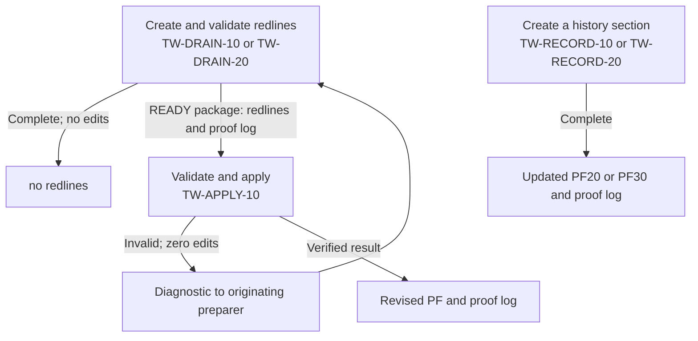

# MODIFICATION-20261006-gtwpe-tw-document-rules

C3 of the writing-side build, the writing flow's document rules: TW-APPLY-10 and the drains carry
every document-control field forward from the actual change, the Last Update Gate by Nathan's rule;
nothing they produce says Draft; TW-DRAIN-20 judges every PF09 row on the evidence; TW-RECORD-10 and
TW-RECORD-20 insert their section into a repository copy of PF20 or PF30, with a report and a proof
log; and a new TW-ALPHA release selects them. The prompts themselves stay in Notion.

## Intake

Not through triage. The request came from PE39 on 2026-10-06 and is copied verbatim in the front
matter. It runs C3, the third change in the order Nathan approved in
MODIFICATION-20261005-gtwpe-writing-side (§A A.5), through GTWPE-MGMT-10 100526.2. Its eight numbered
points, under "What C3 is", are ITEM-01 to ITEM-08, in its order. What it puts outside C3 is
recorded in §A, not taken here.

## §A — Analysis

*Written by MODE = ANALYZE. Requires nothing upstream. Frozen once approved.*

This session ran the mode as a GTWPE-MGMT-10 session, following *GTWPE-MGMT-10 — Manage the GTWPE —
100526.2*, the version the catalog selects. The mode started at 2026-10-06T11:18:32Z, when PE39's request
arrived, with `main` at `b1bd769`. A context compaction came during the consult, before any step relied on
the body; the body was then fetched live, edited 2026-10-05T16:36:11.384Z. The request is in the front
matter, verbatim. The record is on `docs/20261006-modification-gtwpe-tw-document-rules`, its open pull
request amthorn78/glow-hdengine-v2#580.

### Consult

- **Repository**, on `main` at `b1bd769`.
  - C1's record, MODIFICATION-20261005-gtwpe-writing-side: §A A.1, A.4 (R2 to R8), A.5's C3 row, A.6
    (E-010), A.7 and A.8, and its `analyze_approved_by`.
  - C2's record, MODIFICATION-20261005-gtwpe-tw-repository-io, whole: its §A is this analysis's model, and
    its §E holds the readbacks of the six members and the four control pages.
  - The target architecture record, whole: §§4, 5, 8 and 9, and Nathan's answers 6 and 8.
  - The error ledger: E-010, E-033 and E-038.
  - amthorn78/glow-hdengine-v2#579, open and unmerged at head `3db2cf2`: its update to the architecture
    record ("no PF10 sentence for the Last Update Gate") and ledger row E-039.
  - In `docs/prompt_ecosystem_management/`: `modification-template.md` 2.1, `ecosystem-change-management.md`
    §2 and §4, `gtwpe/gtwpe.decision-record.md` (GTWPE-D1) and the header of `gtwpe/gtwpe_record_check.py`.
  - No other `docs/*-modification-gtwpe-*` branch carries this ID (`git ls-remote`).
- **Canon**, on `main` at `b1bd769`, unchanged since `31deec4`.
  - Searched with `git grep` for `Last Update Gate`, `Invocation tag`, `Draft`, `status`, `history`,
    `change log`, `volume`, `rollover` and the PF09 status values.
  - Read in full: Technical Writing Best Practices §3, §7, §14 and §15.1; HDE Governance §9.1.1, §9.1.6,
    §9.2 and §9.3; HDE Build Notes 2.29 PF10-CANON-001, 2.30 PF10-CITE-001 and 2.38 PF10-AINEUTRAL-001;
    HDE CRD Records §0 to §3.3, §4.2, §6 and §7; HDE Phased Epics' front matter and §0; HDE Build Checklist
    — Distillation §0.3 and §0.6.
- **Notion, read-only.** The GTWPE parent page and catalog; the selection page, *Alpha 1*, *HDE TW* and the
  Operations Hub; the six TW members (*The members, read live*); the lineage sources (A0).

### Drift check (A0)

`git fetch origin main`; the commit examined is `b1bd7699243395a708a1d49a82df7e0b61efcccb` (`b1bd769`),
#578's merge.

**(a) The lineage sources.** Searches with highlights off on `PE Metaprompt` and `GCFPE-MGMT-10` found no
page that the catalog does not record and that is newer than its record. The other PE Metaprompt hits are
archived predecessors dated 2026-09-12 and 2026-09-13 and pages that mention it. The other GCFPE-MGMT-10
hits are the archived `091326.1` and `091326.2` and control or tracking pages. Each recorded page was
fetched for its exact edit time. The PE Metaprompt's fetch and the register's were saved by the harness and
read by script (*Harness files*).

| Source | Recorded in the catalog | Found, by fetch | Trigger finding |
|---|---|---|---|
| GCFPE-MGMT-10 | Pinned: the proposed body, 2026-09-24T11:00:24.691Z. Selected: `091426.1`, 2026-09-24T15:38 | 11:00:24.691Z; `091426.1` (`3db4590a05eb81d1bb64ebcb3ca8eb54`) at 15:38:34.295Z; the register selects it | None |
| PE Metaprompt | Pinned and selected: `091426.1`, 2026-09-23T17:17:22.217Z | 17:17:22.217Z; the register selects it (`3db4590a05eb8174be35d9e35acb3f77`) | None |

The register page was at 2026-09-23T17:43:39.489Z, the edit time the catalog records.

**(b) The watched paths.** `git log 1dec848..b1bd769` over *The watched sources* lists nothing. The range
holds two commits, amthorn78/glow-hdengine-v2#577 and amthorn78/glow-hdengine-v2#578. They change four
files, all under `docs/ephemeral/`, as PE39's request says.

No trigger finding. X4 re-pins nothing and moves the checked-through commit to the commit it examines.

### The members, read live

Each member was fetched whole into this session's context after the compaction and read whole. Each edit
time equals the readback time C2 recorded at X1.3, so no member has changed since its selection.

| Member | Version, page | Edited | Parent |
|---|---|---|---|
| TW-TRIAGE-10 — Identify PF10 Drain Targets | 100626.1, `3f14590a05eb81789e16d978795db77d` | 2026-10-06T03:18:14.556Z | *HDE TW* |
| TW-DRAIN-10 — Prepare PF Document Redlines | 100626.1, `3f14590a05eb81319ed0ebb00e14eedf` | 2026-10-06T03:19:43.487Z | *HDE TW* |
| TW-DRAIN-20 — Prepare PF09 Redlines | 100626.1, `3f14590a05eb81fa8c9bd34c9909c48d` | 2026-10-06T03:21:38.944Z | *HDE TW* |
| TW-RECORD-10 — Create Epic History Section | 100626.1, `3f14590a05eb8103babefccf8a92d748` | 2026-10-06T03:22:55.389Z | *HDE TW* |
| TW-RECORD-20 — Create CRD History Section | 100626.1, `3f14590a05eb81bc9127e36a85df1040` | 2026-10-06T03:23:58.670Z | *HDE TW* |
| TW-APPLY-10 — Apply Validated Redlines | 100626.1, `3f14590a05eb8156acaef4053b356625` | 2026-10-06T03:24:55.124Z | *HDE TW* |

### The C1 approval's check for a PF10 sentence (E-039)

- **What the C1 approval said.** Nathan's `analyze_approved_by` of MODIFICATION-20261005-gtwpe-writing-side
  (2026-10-05): "he will add one sentence to PF10 exempting the Last Update Gate from addendum 2.30 before C3
  starts; C3's ANALYZE confirms that sentence is on main."
- **What changed.** On 2026-10-06 Nathan ruled that the gate needs no PF10 change: it records the source an
  update used, and it is not a citation of HDE Build Notes (request, item 2). So that check no longer
  applies, and this analysis does not make it. The ruling is recorded in the architecture record's update
  "no PF10 sentence for the Last Update Gate", in amthorn78/glow-hdengine-v2#579. That pull request is open,
  and on `main` the update of 2026-10-06 still says C3 needs the sentence first.
- **Canon agrees.** HDE Build Notes 2.30 PF10-CITE-001's drain-target table names HDE Governance §0.2 and
  sections of the Build Checklist and the Mechanics Guide, but no document's front matter, though seventeen
  PF headers carry a gate of `BN` or `PF10` and a version, and three more a filename naming a PF10 version.
  Technical Writing Best Practices §15.1 treats the gate as a document-control value.
- **E-039.** This closes ledger row E-039, which #579 adds. The ledger is not this record's to edit, so
  closing the row is PE39's.

### The change, settled

The request's eight points, by item. C1's approved §A (A.1, A.4 to A.8) and the architecture record frame
them. `PLAN` writes the exact texts.

**ITEM-01. Document control (R4).**
- **TW-APPLY-10** derives every document-control field the revision changes, as architecture §5 lists them,
  where today its header contract covers three: the version, bumped once as today; the effective date and
  any other date the document's control fields carry; the Last Update Gate (ITEM-02); the change or revision
  history the document's own rules require, which arrives as a content redline and is applied like any
  other; internal references whose version-sensitive information must change, where today it synchronizes
  only a title's embedded version; and a check that all of them agree, a disagreement being a blocker.
- **The invocation tag stays.** Every PF header carries the same `INV-f2ac55d77ce9aacc`, so it does not
  depend on the revision.
- **The drains** draft, as a content redline, the change-history entry the target's own rules require. Canon
  examples: HDE Governance §9.3 requires a Doc-Delta entry in §9.3.1 for every normative change; HDE
  CLI-API-Vendor Ref §11.1 and HDE Schemas and Artifacts §9 hold change logs; an HDE CRD Records entry keeps
  its own material-change history (§4.2). They also supply, as today, the baseline's control-field schema.
- **Authority.** Technical Writing Best Practices §7 and §15.1 forbid changing a document-control value
  "unless the Product Owner or a governing source explicitly authorizes" it. Nathan's architecture §5 is
  that authorization, and TW-APPLY-10's header contract already carries it for three fields.

**ITEM-02. The Last Update Gate.**
- **The rule**, in TW-APPLY-10 and the drains, replacing "the exact deduplicated filenames of upstream
  sources": the gate names the source that justified the update, in Nathan's form (answer 6). That is `BN`
  and the version number of the PF file used when the source is a PF document, and `BN` and the source
  filename when it is not.
- **Several sources.** The present rule's handling stays: each source, deduplicated, in source order, now
  each in Nathan's form. Supporting reading is not a source of the update. A source whose identity cannot
  be resolved still blocks the metadata step.
- **The handoff.** The drains supply each source's identity (the PF file and its version, or the filename)
  in the package, and TW-APPLY-10 derives the gate from it.

**ITEM-03. No Draft (R5).**
- **TW-APPLY-10:** the revised PF carries no `Draft` or similar status language, no placeholder, TODO,
  unresolved drafting note, editorial comment or instruction to a future writer, and no stale status. A
  stale status field takes the value the document's own rules require (architecture §4: "Do not preserve an
  old document status merely because the source copy contained stale status information"); a value it
  cannot establish is a blocker.
- **The one exception** is what canon requires: a new PF30 volume's review copy carries Document status
  `Draft` and Volume status `Pending activation` (HDE CRD Records §6). Only TW-RECORD-20 writes one.
- **The drains** account for any such marker in their target as a hygiene redline. Nathan's architecture §4
  is the authorization TW-DRAIN-10's *General PF preparation* requires for hygiene.
- **TW-RECORD-10 and TW-RECORD-20** meet the same rule in their file (ITEM-05). TW-TRIAGE-10 writes no
  document.

**ITEM-04. PF09 row status (R6).** TW-DRAIN-20 judges every potentially affected row on all the evidence:
update it, leave it open, close it, or otherwise change it. It never leaves a row open because no
instruction says to close it, and never closes one only because related work shipped. The resulting PF09
shows the project's current state, not an accumulation of earlier row states. What stays: Done needs the
phase owner's completion and acceptance evidence, and unrelated rows are not touched. HDE Build Checklist —
Distillation agrees: "An existing PF09 status does not override contradictory current repository reality"
(§0.3), and Done requires every condition of §0.6.

**ITEM-05. PF20 and PF30 (R2, R3, R7, R8).**
- **Output.** Each record prompt writes the updated PF20 or PF30 Markdown file at the repository path the
  invocation names: the current canon file from `docs/pfcanon/` on `main`, with its one section inserted at
  the place the target's order requires, by an exact insertion. Every other byte is preserved and checked,
  as TW-APPLY-10 checks preservation. A report goes with it (ITEM-06). There is still no TW-APPLY-10 step
  (Nathan, 2026-09-29: PF20 and PF30 "don't need a redliner").
- **Control fields**, as ITEM-01 to ITEM-03.
- **Reconciliation (R7).** Each reads the original specification and every applicable PF10 change that
  modifies, clarifies, supersedes or extends it, never either alone (architecture §9). Today each reads only
  PF10's lifecycle controls.
- **PF30 as a volume family (R8), TW-RECORD-20.** It works in the volume the record belongs in: for a new
  CRD, the one volume whose Document status is `Canon` and Volume status `Active` (HDE CRD Records §6). It
  reports when that volume looks due for rollover, which is Nathan's determination. It opens a new volume
  only when the invocation carries his rollover decision, as §6 sets it: the next PF30.x; its review copy at
  Document status `Draft` and Volume status `Pending activation`; the reciprocal *Previous volume* and *Next
  volume* fields; and the prior volume's Volume status `Closed to new CRDs`. That writes two files, each
  with its own proof log. "Do not assume a second volume exists or open a new one" and "produce a full PF30
  artifact" go.
- **PF20 as one document (answer 8), TW-RECORD-10.** It keeps PF20's single structure and invents no volume.
- **Unchanged:** historical eligibility, approval evidence, nonduplication and identity rules, and "An
  existing record is not permission to create a duplicate or silently revise it through this creation
  role": an update to an existing record still goes through a drain.
- **E-010 stays as §A A.6 carries it.** HDE Governance §9.1.1 permits a PF20 or PF30 entry only as "a
  separately authorized historical drainage action". The invocation is that authorization, and the file is a
  copy in the pull request, never canon.

**ITEM-06. GTWPE-D1.** Each updated PF20 or PF30 file gets its own proof log beside it, named after it (the
file's name with `.proof-log` before `.md`), with all eight minimum items in Nathan's words and the link to
its file. As C2 did for the drains and the apply, the report is that proof log, so one file holds both
(`DERIV-001`). *GTWPE-D1, prompt by prompt* gives each prompt.

**ITEM-07. K-12.** TW-RECORD-20 takes its inputs as attached files or repository paths, never from Google
Drive or ChatGPT Library, in one sentence of its *Purpose*, as TW-RECORD-10's already says. It is an
absence, found by reading: TW-RECORD-20's *Purpose* names no input route.

**ITEM-08. A new TW-ALPHA release.** The five changed members, each at «V», with TW-TRIAGE-10 carried at
100626.1, by the three selection writes and the three current-release notes. C3 alters how the TW flow runs
(*How the TW flow changes*), so the new section carries a new *Current operation*. «V» follows the PE
Metaprompt's rule at execution: `100626.2` if `EXECUTE` runs on 2026-10-06, otherwise that date's `.1`; the
release label is `TW-ALPHA-<yyyymmdd>.N` on the same date.

### Per part: closure, tier, class and targets

One part, PART-01: the five new versions and the new release, which land together. The gate rule changes
both sides of the drain-to-apply handoff, and every rule here reaches several members, so splitting by rule
would split one member's new version across parts.

- **Targets.**
  - `prompt`: five new versions, of TW-DRAIN-10, TW-DRAIN-20, TW-RECORD-10, TW-RECORD-20 and TW-APPLY-10,
    each a new versioned sibling under *HDE TW*.
  - `notion_control`: the selection page's three writes; the current-release note on *Alpha 1*, *HDE TW* and
    the Operations Hub; and the catalog's checked-through commit at X4.
- **Closure**, from the relationships in the selected release's *Current operation*:
  - upstream, the producers of the handoffs the changed members consume (the drains' `READY` package and
    TW-APPLY-10's diagnostic): TW-APPLY-10, TW-DRAIN-10 and TW-DRAIN-20;
  - downstream, their consumers: the same three;
  - state sharers: TW-DRAIN-10 and TW-DRAIN-20, which share `READY`, `NO_CHANGE` and `BLOCKED`, and all
    five, which share `PARTIAL_PACKAGE` in their common save-recovery rules. C2 listed only the drains.

  TW-TRIAGE-10 and the record prompts have no recorded relationship with another member. Every member in
  the closure changes here.
- **Tier 2.**
  - The part changes a handoff: what a `READY` package carries for the gate (each source's identity) and for
    the change history (a content redline), and TW-APPLY-10's check of it. Both sides change here.
  - It changes a recorded relationship: the *Current operation* says the record prompts "still end with
    paste-ready sections only".
  - TW has no executable selftest, and no live trial has run since 2026-09-08. The gate is a static check of
    both sides of the handoff, with the whole-page readbacks, as C2's was.
- **Class B, rule application.** The part carries rulings already made into the prompts: Nathan's target
  architecture §§4, 5, 8 and 9 and his answers 6 and 8; his ruling of 2026-10-06 on the gate; GTWPE-D1; and
  his approved order (C1 §A A.5).
- **Authoring.** Through the selected PE Metaprompt's general rules, with GTWPE-MGMT-10's workarounds: only
  the approved edits and the two identity lines change, references stay versionless, and no model or effort
  text is added. Where a rule is already worded in a member, the new text converges on that wording
  (`ecosystem-change-management.md` §2, step 3): TW-RECORD-10's input sentence for ITEM-07, and the drains'
  and TW-APPLY-10's GTWPE-D1 passages for ITEM-06.

### Member dispositions (HDE Governance §9.1.6)

| Member or interface | Disposition | Reason |
|---|---|---|
| TW-DRAIN-10, TW-DRAIN-20, TW-APPLY-10 | Affected: a new version each | ITEM-01 to ITEM-03; and ITEM-04 for TW-DRAIN-20 |
| TW-RECORD-10, TW-RECORD-20 | Affected: a new version each | ITEM-01 to ITEM-03, ITEM-05 and ITEM-06; and ITEM-07 for TW-RECORD-20 |
| TW-TRIAGE-10 | Unaffected; carried into the new release at 100626.1 | It writes no document and sets no document-control field |
| TW-MGMT-10, TW-ASSESS-10 | Unaffected | Neither is selected |
| GTWPE-MGMT-10 100526.2 | Unaffected | Its route already repairs TW-ALPHA members and makes the selection writes, and its GTWPE-D1 guard applies to the five new versions. Its route text is worded for eight members (F-1). Its "until G5" stays for C6 (E-033) |
| The GTWPE catalog | Unaffected, but for X4's checked-through commit | The TW prompts join it at C6 |
| `tw-flowmaster` 1.3.0, `flowmaster-validate` 3.3.2 | Affected | Q-1 |
| `glow-write-boundary`, `glow-artifact-storage` | Unaffected | The record prompts' outputs stay under `docs/ephemeral/`, a path a session may write |
| The PE Metaprompt 091426.1; the GTWPE decision record | Unaffected | The authoring control, and the ruling applied |
| The GCFPE register and Flow Index | Unaffected | They list no TW member |

### GTWPE-D1, prompt by prompt

| Prompt | Writes before C3 | Writes after C3 | How the part leaves GTWPE-D1 whole |
|---|---|---|---|
| TW-DRAIN-10 | A redlines file, for `READY` and for `BLOCKED` work kept | The same | Unchanged: its processing report is the separate proof log beside the redlines file, named after it, with all eight items and the link. C3 does not edit that passage, and the readback checks it by phrase |
| TW-DRAIN-20 | As TW-DRAIN-10, for a PF09 phase file | The same | As TW-DRAIN-10 |
| TW-APPLY-10 | The final updated PF | The same | Unchanged: its application report is the separate proof log, stating the basis of each applied operation. C3 edits its header contract, not that passage |
| TW-RECORD-10 | A paste-ready section file, neither artifact type | The final updated PF20 file | Added: the report, a separate proof log beside the file, named after it, with all eight items in Nathan's words and the link (ITEM-06) |
| TW-RECORD-20 | As TW-RECORD-10 | The final updated PF30 file; on a rollover, the new volume and the prior volume's revised file | Added, as TW-RECORD-10: one proof log for each file it writes |
| TW-TRIAGE-10 | A list in its response | The same | Not bound |

No combined proof log is defined: no prompt writes both artifact types.

### Scope, and how it was measured (`SCOPE-001`)

**Method: broad match minus permitted exceptions, by reading.**
- Each body came back inline and whole, with no truncation flag, and was read in context.
- Each count below was made by reading one fetch, then checked by a second, independent reading of a
  second fetch at A6 (the request's standing direction; ledger E-035). The second reading corrected two
  counts (*Dry run (A6)*, D5). No command counted over a body.
- Matches are case-insensitive, at the start of a word: `version` not inside "conversion"; `date`, `gate`,
  `history` and `done` as words, so not "update", "validate", "gateway" or "historical".
- The broad terms, by rule, over the members each rule reaches:
  - ITEM-01 and ITEM-02: `version`, `date`, `history`, `header`, `gate`;
  - ITEM-03: `draft`, `status`, `placeholder`;
  - ITEM-04, TW-DRAIN-20 only: `clos`, `open`, `done`;
  - ITEM-05 and ITEM-06, the record prompts: `section`, `paste`, `insert`, `volume`, `PF10`, `report`,
    `proof`;
  - ITEM-07, TW-RECORD-20 only: `attach`, `reference`, `Drive`, `Library`.

**What is in scope.** A passage is a contiguous stretch of in-scope text. Each passage:
- sets or limits a document-control field, its authority, its check or its source provenance (ITEM-01,
  ITEM-02);
- governs status language, markers or hygiene in a produced document (ITEM-03);
- governs a PF09 row's status on the evidence (ITEM-04);
- defines a record prompt's output, its relationships, its volume handling or its reading of PF10 (ITEM-05,
  ITEM-06);
- or names TW-RECORD-20's input route (ITEM-07).

**The permitted exceptions, kept unchanged:**
- the identity lines, which the route changes as identity, not as rule text;
- a version that identifies a prompt, source, target, specification or output: in the preflight, output
  identity, intake, proof-log contents and handoffs;
- "gate" as a check: the page-count gate, a development or approval gate, launch gates, a violated gate, and
  TW-RECORD-20's ban on inferring a CRD number from "a Last Update Gate", which stays true;
- `status` in schema questions, in PF10's source-defined statuses, in save and validation status, in the
  record prompts' rules for the record's own content, and in TW-DRAIN-20's six dimensions and report
  classifications, which ITEM-04 leaves as they are;
- "history" as a source's material category in the drains' ledger, and the record prompts' historical
  content and titles;
- `placeholder` in the rules that keep placeholders out of a redline payload and a handoff, which agree with
  ITEM-03;
- TW-APPLY-10's version bullet, its header-location and conflict rules, its header before/after record, and
  the no-change report's "version bump", which already meet R4;
- in the record prompts: `report` in the shared save-recovery rules and the preflight; `insert` in the ban on
  inserting into an authoritative PF, which still holds because the file is a copy; `volume` naming the
  assigned target or its parts and in the duplicate check; `PF10` in the authority rule; and the generic
  locators (an attachment, a retrieval reference, evidence references), the Drive copy as no substitute, and
  the ban on writing to Drive or Library.

**Each member's broad hits, by term**, ITEM-01 to ITEM-04:

| Member | `version` | `date` | `history` | `header` | `gate` | `draft` | `status` | `placeholder` | `clos` | `open` | `done` |
|---|---|---|---|---|---|---|---|---|---|---|---|
| TW-TRIAGE-10 | 9 | 0 | 0 | 0 | 0 | 0 | 2 | 0 | — | — | — |
| TW-DRAIN-10 | 24 | 2 | 1 | 6 | 3 | 0 | 5 | 2 | — | — | — |
| TW-DRAIN-20 | 25 | 3 | 1 | 6 | 3 | 0 | 19 | 2 | 7 | 3 | 3 |
| TW-RECORD-10 | 12 | 2 | 5 | 0 | 3 | 1 | 5 | 0 | — | — | — |
| TW-RECORD-20 | 13 | 1 | 3 | 0 | 4 | 1 | 9 | 0 | — | — | — |
| TW-APPLY-10 | 24 | 11 | 0 | 9 | 6 | 0 | 3 | 0 | — | — | — |

ITEM-05 to ITEM-07, in the record prompts:

| Member | `section` | `paste` | `insert` | `volume` | `PF10` | `report` | `proof` | `attach` | `reference` | `Drive` | `Library` |
|---|---|---|---|---|---|---|---|---|---|---|---|
| TW-RECORD-10 | 13 | 3 | 8 | 12 | 3 | 8 | 0 | — | — | — | — |
| TW-RECORD-20 | 13 | 4 | 8 | 13 | 3 | 8 | 0 | 1 | 5 | 2 | 1 |

**Each member's passages:**

| Member | Hits | In passages | Kept as exceptions | Passages in scope |
|---|---|---|---|---|
| TW-TRIAGE-10 | 11 | 0 | 11 | 0 |
| TW-DRAIN-10 | 43 | 12 | 31 | 4 |
| TW-DRAIN-20 | 72 | 21 | 51 | 5 |
| TW-RECORD-10 | 75 | 31 | 44 | 7 |
| TW-RECORD-20 | 89 | 36 | 53 | 8 |
| TW-APPLY-10 | 53 | 20 | 33 | 7 |

**The passages, by member and section.**
- **TW-APPLY-10 (7)**, all in *Deterministic final document-control header* but the last:
  - the opening two sentences: the standing authority for three fields, and what it does not authorize,
    "status or invocation-tag changes" among it (ITEM-01, ITEM-03);
  - the date bullet (ITEM-01);
  - the gate bullet (ITEM-02);
  - the sentence on a title's embedded version (ITEM-01, version-sensitive references);
  - "Report old/new values, source-file provenance and actual execution date" (ITEM-01, ITEM-02);
  - "Other header/title/status/invocation-tag changes need separately explicit authorization" (ITEM-01,
    ITEM-03);
  - in *Exact application and preservation*, the verification of the metadata plan (ITEM-01 to ITEM-03).
- **TW-DRAIN-10 (4).**
  - *Exact redline contract*: the paragraph on Apply's standing authority and the source filenames
    preparation supplies (ITEM-01, ITEM-02); the paragraph reserving "those three document-control fields"
    (ITEM-01, ITEM-03).
  - *General PF preparation*: "Any hygiene or deletion still needs exact selected-source or Nathan
    authorization" (ITEM-03), found by reading, with no broad hit.
  - *Completion, outputs and handoff*: the `READY` handoff's "source-file header provenance" (ITEM-02).
- **TW-DRAIN-20 (5).** TW-DRAIN-10's four, word for word, and in *PF09 coverage and native semantics* the
  paragraph on status meanings, Done and closing or reopening rows (ITEM-04).
- **TW-RECORD-10 (7).**
  - *Coded identity*: the relationship paragraph, "This role terminates with its paste-ready section" and no
    TW-APPLY-10 handoff (ITEM-05).
  - *Purpose*: its first sentence, "one complete historical Epic record section for the actual assigned
    PF20 document or existing volume" (ITEM-05).
  - *Destination*: the volume sentences (ITEM-05, PF20 as one document); the PF06, PF10 and PF27 reading
    sentences (ITEM-05, R7); the ban on choosing "final PF insertion/section numbering" (ITEM-05, placement).
  - *Section-only output and completion*: the whole section, its heading and four paragraphs (ITEM-01 to
    ITEM-03, ITEM-05, ITEM-06).
  - *PF20 schema*: "with current PF10 lifecycle overrides" (ITEM-05, R7).
- **TW-RECORD-20 (8).** TW-RECORD-10's seven, but in its *Purpose* the sentence on its inputs is in scope
  too (ITEM-07), and its *PF30 schema* holds two passages in place of PF20's one: the sentence on the volume
  family and PF10 overrides (ITEM-05, R7 and R8), and "produce a full PF30 artifact" (ITEM-05).

**Total: 31 passages in five members**, with each new version's two identity lines on top: 10.

**The rule-change search (`D26-E`).** The old texts are the gate as "filenames of upstream sources", the
record prompts' "paste-ready section" output, "Do not ... open a new one" and "a full PF30 artifact".
- In the members: only in the passages above.
- In GTWPE-MGMT-10 100526.2, by reading its fetch at the mode's start: none.
- In `docs/prompt_ecosystem_management/gtwpe/` at `b1bd769`, by `git grep`: `Last Update Gate` 0,
  `source filename` 0, `paste-ready` 0, `Section-only` 0, `full PF` 0, `rollover` 0; "proof log" 11, all in
  GTWPE-D1.
- On the control pages: the selection page's current *Current operation* says the record prompts "still end
  with paste-ready sections only" and that the Apply metadata and PF20/PF30 rules of TW-ALPHA-20260908.1
  "still apply"; that operation's own text sets the gate to "the deduplicated exact upstream source
  filenames". *Alpha 1*'s current rows call the record prompts "paste-ready section only". The route makes
  each of these historical, as a dated record, rather than rewriting it.

`PLAN` turns this into absence checks by phrase on the new pages.

### Pages that name TW's current release (A3)

**Method.** Searches with highlights off on `TW-ALPHA-20261006.1`, on `100626.1` and on a member title.
Each page found that could name the current release was fetched; a page last edited before 2026-10-06 cannot.
*Alpha 1* and the Operations Hub were saved by the harness and read by script.

| Page | Edited | Names TW's current release | Written by the route |
|---|---|---|---|
| *Glow Technical Writing Ecosystem*, the selection page, `3d44590a05eb8171ab6ff4dab33b00ef` | 2026-10-06T03:30:15.790Z | Yes: its status line and `## Selected release — TW-ALPHA-20261006.1`, with the page's one *Current operation* | Yes: the three selection writes |
| *Alpha 1 — Implementation and Validation*, `3d44590a05eb81fe991ff0114cb43029` | 2026-10-06T03:30:55.483Z | Yes: `## Selected release — TW-ALPHA-20261006.1`, with its six rows | Yes: the current-release note |
| *HDE TW*, `3c74590a05eb8176baf8cb59f1631f3c` | 2026-10-06T03:31:27.379Z | Yes: `## Current TW release — TW-ALPHA-20261006.1` | Yes: the current-release note |
| *Glow Operations Hub*, `3ce4590a05eb814f8892f88ff8539308` | 2026-10-06T03:31:55.832Z | Yes: `## Current Glow TW release — TW-ALPHA-20261006.1` | Yes: the current-release note |
| The GTWPE parent page and catalog, `3ea4590a05eb818c915bdfd3d150c44b` | 2026-10-06T03:29:32.421Z | No: it names TW-ALPHA, but no release | No: X4 writes only the checked-through commit |
| The two archived `100626.1` pages in *04 Archived Prompt Versions* | 2026-10-06 | No: unselected copies, named by version | No |
| Older pages, such as the architecture page, earlier member versions and GTWPE-MGMT-10's pages | Before 2026-10-06 | No | No |

**Coverage.** This is the set the record of TW's latest selection, C2's, wrote (X4.3 to X4.6). Each member's
own text names the selection page as holding its selection.

### How the TW flow changes (A3)

C3 alters how the TW flow runs, as the selection page's *Current operation* describes it:
- TW-RECORD-10 and TW-RECORD-20 end with an updated PF20 or PF30 file and its proof log at a repository
  path, not with a paste-ready section, and still with no Apply step;
- TW-APPLY-10 brings every document-control field forward, the gate in Nathan's form, and writes no Draft;
- the drains supply each source's identity and draft the change-history entry;
- TW-DRAIN-20 judges row status on all the evidence.

So the new release's section carries a new *Current operation*, and the present one becomes historical. It
also replaces the present one's statement that the Apply metadata and PF20/PF30 rules of TW-ALPHA-20260908.1
still apply.

### Contradictions and risks

1. **The TW Flowmaster skill (Q-1).** `tw-flowmaster` 1.3.0 and `flowmaster-validate` 3.3.2 do not run
   TW-ALPHA-20261006.1, and Nathan waived HDE Governance §9.1.6's interacting-skill readiness for that release
   only ("An edited subgroup is not ready while an affected counterpart remains incompatible"). C3's release
   keeps the gap. A Flowmaster run would hand the prompts no repository path, and each would stop at its
   missing-input rule, which `PLAN` keeps: a loud stop, not a wrong result.
2. **The Last Update Gate and HDE Phased Epics.** PF20's §0 says that when PF10 is referenced inside PF20,
   "avoid BN version strings". Nathan's ruling of 2026-10-06 settles it: the gate records the source an update
   used, and it is not a citation of HDE Build Notes. `PLAN` words the rule so that a TW-RECORD-10 run does not
   stop on that passage. Canon is not changed.
3. **The gate for a PF source other than PF10.** Nathan's form, `BN` and that PF's version, names the version
   but not the document. It is applied as Nathan worded it, and the proof log names the file. The TW flow's
   change sources are PF10, a specification or another non-PF source, so the case is rare.
4. **Document-control authority.** Technical Writing Best Practices §15.1 says "Do not invent, infer,
   normalize, or increment a document-control value", and §7 allows a change only on the Product Owner's or a
   governing source's explicit authorization. Nathan's architecture §§4 and 5 give it, as TW-APPLY-10's
   header contract already says for three fields. Not a conflict.
5. **E-010.** HDE Governance §9.1.1 against the Change Process Guide and Plan Templates on PF20 and PF30
   records stays Nathan's. The record prompts follow §9.1.1: one section, only when the invocation names it,
   only into a copy in the pull request.
6. **A PF30 rollover writes two files.** The new volume is a new document, written as HDE CRD Records §6
   sets it; the prior volume's revised file changes only its Volume status and *Next volume* fields. Each has
   its own proof log. Rollover is rare and always Nathan's decision.
7. **Placement of the inserted section.** PF30 orders records by CRD ID (§3.2). PF20 keeps its records last,
   under §2, numbered 2.2 to 2.25, and two of them, 2.23 and 2.24, carry the same HDE-EPIC038 record. The
   record prompts' existing rule decides placement: the target's established convention "only where uniquely
   supported", otherwise an exact input blocker; and "leave unrelated history intact".
8. **PF20's size.** PF20 is 952,515 bytes, about 317,000 tokens at ledger E-013's 3.0 bytes a token. The
   record prompts already require reading the whole target; C3 does not change that. A session that cannot
   hold it stops, and C4's capacity stop (S1) is the general answer.
9. **No executable check exists for TW.** The tier 2 gate is static, and no live TW trial has run since
   2026-09-08. C3's first live run is untried.
10. **One reader of the bodies.** The scope rests on this session's reading; workers do not fetch bodies
    (`D22`). The A6 dry run and `PLAN`'s dry run each read them again.
11. **The phrase check sees phrases, not meaning** (`D14`'s note). Carrying the rules close to Nathan's words
    lets the readback find each by phrase; the reviews read for behaviour.

### Defect classes matched (`ecosystem-change-management.md` §4)

- `SCOPE-001`: the scope above is measured by broad match minus exceptions, by reading, twice.
- `GUARD-001`: GTWPE-D1 lands in the two record prompts, with its guard: GTWPE-MGMT-10's prompt route checks it
  by phrase on each new page.
- `DERIV-001`: the document-control fields are derived from the actual change, not copied forward; the
  record prompts' report and proof log become one file; the four release pages restate the selection by hand.
- `FUNC-001`: `tw-flowmaster` would run TW the old way (Q-1).
- `NAME-001`: the record prompts become bound by GTWPE-D1 because of what they write, not their names.

### Findings against GTWPE-MGMT-10 100526.2

- **F-1:** its selection route is worded for eight members: write (1) "lists the eight members with only the
  changed rows new". The new release has six, five of them new. `PLAN` adapts the text, as C2 and the
  model-advice change did.

### Candidates for separate Modifications (recorded, not taken)

- **F-1**, in a later GTWPE-MGMT-10 repair, with E-033 for C6.
- **PF20 volumes**, if Nathan formally splits PF20 (answer 8). TW-RECORD-10 then needs a volume rule like
  TW-RECORD-20's.

### Open questions for the Product Owner

**Q-1. The TW Flowmaster skill, for this release (risk 1).**
- **(a) Waive HDE Governance §9.1.6's interacting-skill readiness for `tw-flowmaster` again, for this
  release.** The grounds are C2's: C4 replaces the skill, C6 retires it, and a Flowmaster run stops loudly
  rather than producing a wrong result. The selection page and the three notes say that `tw-flowmaster` 1.3.0
  and `flowmaster-validate` 3.3.2 do not run it, and the override block records the waiver.
- **(b) Update the skill first,** through the skill route: a skill part, a skill review cycle and an install,
  for a skill C6 retires.
- **Recommendation: (a).**

### Readiness and interaction cost

`NEEDS_RULING`, for Q-1. It is advice, not a refusal. No item waits on another item's execution, and every
item's scope is measured.

    interaction_cost = 1 open ruling + 2 + 3 review rounds + 0 skill review cycles + 0 installs + 1 merge = 7

- **Review rounds:** this mode's dry run; `PLAN`'s dry run; and one full review by a single reviewer. A second
  reviewer or a diff check comes only if that review finds a required defect, by the request's standing
  direction.
- **Q-1's option (b)** would add a skill review cycle and an install, making 9.
- **The merge** is the record's pull request, amthorn78/glow-hdengine-v2#580. It is not to be merged before the
  record is `COMPLETE`. No repository file other than the record and its evidence changes, so X2 waits for no
  merge.
- **Splitting saves nothing.** The five versions and the release land as one selection, and the gate rule
  spans both sides of a handoff.

The estimate is in the front matter. Time is the meter, and twice the estimate is where the session stops.

### Dry run (A6)

Every normal-path gate and readback of this mode, read-only, by this session. No full review ran.

| # | Gate or readback | Result |
|---|---|---|
| D1 | Both record checks on a scratch copy at `ANALYZED`: `modification_validate.py` and `gtwpe_record_check.py` | Both exit 0 |
| D2 | The front matter parses (PyYAML), its `request` equals PE39's message, and every table in the record has one column count in every row, by script | Parses; the request is verbatim; every table consistent |
| D3 | A0 reproduced: `git fetch origin main`; `origin/main`; `git log 1dec848..origin/main` over *The watched sources* | Still `b1bd769`; no commit |
| D4 | The new titles and the new release label are free | *HDE TW* (edited 2026-10-06T03:31:27.379Z) lists no member version after 100626.1, and the selection page (edited 03:30:15.790Z) names no release after TW-ALPHA-20261006.1 |
| D5 | The scope counts, by a second, independent reading of a second fetch of each of the six bodies, each at the edit time in *The members, read live* | Two counts corrected: `version` in TW-DRAIN-10, 23 to 24, and in TW-DRAIN-20, 24 to 25, both "versionless role name" in the handoff, a kept exception. Every other count, and every passage, confirmed |
| D6 | The record tools need no change for this Modification | By reading at `b1bd769`: `TARGETS` holds `prompt` and `notion_control`, and the record check needs only the subsections this record has |

No required defect.

### Harness files (`D22` condition 5)

- **Inline fetches, held only in this session's transcript**, which the harness keeps and leaves to its
  teardown:
  - GTWPE-MGMT-10 100526.2, once, after the compaction;
  - the six TW bodies at 100626.1, twice each: the scope's first reading and A6's second;
  - GCFPE-MGMT-10's proposed body and `091426.1`, fetched at A0 for their edit times;
  - the control pages: the GTWPE parent page, the selection page and *HDE TW*.
- **Harness saves, each read by a script that printed only what the check needed:**
  - the PE Metaprompt `091426.1` fetch, `mcp-Notion-notion-fetch-1791285895858.txt`: its title, edit time
    and path;
  - the register, `mcp-Notion-notion-fetch-1791285896481.txt`: its edit time and the two rows of *Current
    selection* that name GCFPE-MGMT-10 and the PE Metaprompt;
  - *Alpha 1*, `toolu_01Nr7BUZDpK3eaAjyoD9HJgW.json`, and the Operations Hub,
    `mcp-Notion-notion-fetch-1791286201813.txt`, both control pages: each one's edit time, headings, term
    counts and current TW release section.

  Earlier in this session the harness refused `rm` on its tool-results directory ("Session Transcript
  Tampering"), as `D22`'s refinement of 2026-09-23 foresees. So each save is left to its teardown and not read
  again. No save was hashed or compared as a body's identity.
- **The session transcript.** After the compaction, A1's verbatim copy of the request needed PE39's message,
  which only the transcript held. A script read it once and printed only the user's typed message that held
  "run C3", and its timestamp, never a tool result. The request was saved from it to `c3_request.txt` in the
  scratchpad.
- **Scratch files**, in this session's scratchpad: copies of canon from `main` (not prompt bodies); the
  scripts `user_request.py`, `save_meta.py` and `ctl_section.py`; the request; drafts of this section; and a
  scratch copy of this record for the dry run.

### Canon and rulings relied on

- **`AGENTS.md`:** the canon-first rule; canon is read-only; the CI-exempt paths; the pull request's headings.
- **Technical Writing Best Practices** §3, §7, §14 and §15.1.
- **HDE Governance** §9.1.1, §9.1.6, §9.2 and §9.3.
- **HDE Build Notes** 2.29 PF10-CANON-001, 2.30 PF10-CITE-001 and 2.38 PF10-AINEUTRAL-001.
- **HDE CRD Records** §0 to §3.3, §4.2, §6 and §7.
- **HDE Phased Epics:** its front matter and §0.
- **HDE Build Checklist — Distillation** §0.3 and §0.6.
- **HDE CLI-API-Vendor Ref** §11.1 and **HDE Schemas and Artifacts** §9, by their headings.
- **Rulings:** GTWPE-D1; `D21`, `D22` and `D26` (`gcfpe.decision-record.md`); Nathan's target architecture,
  §§4, 5, 8 and 9, his answers 6 and 8, and his directions of 2026-09-29; his ruling of 2026-10-06 on the
  gate; C1's approved §A (A.1, A.4 to A.8); and C2's override, for Q-1.

## §P — Plan

*Written by MODE = PLAN. Requires analyze_approved_by. Frozen once approved.*

This session runs the mode as a GTWPE-MGMT-10 session, following *GTWPE-MGMT-10 — Manage the GTWPE —
100526.2*, fetched live at the start of the mode, edited 2026-10-05T16:36:11.384Z, as at `ANALYZE`.

- **Input:** §A as Nathan approved it at `f8bbb6c` on 2026-10-06. His words are in `analyze_approved_by`,
  committed and pushed at `ad43910`. The mode started at 2026-10-06T12:30:32Z, when his approval arrived.
- **Authoring control:** the selected PE Metaprompt 091426.1, edited 2026-09-23T17:17:22.217Z (A0), through
  its general rules with GTWPE-MGMT-10's workarounds (*Relation to the PE Metaprompt*): only the approved
  edits and the two identity lines change; references stay versionless; no runtime-selection, configuration
  or workload text is added; everything outside the approved edits is kept.
- **`main`** is at `b1bd769`, as §A examined it.

### Nathan's directions, and how this plan applies them

- **The Last Update Gate, his ruling of 2026-10-06** (`analyze_approved_by`; the architecture record's update
  "the gate for a source other than PF10", in amthorn78/glow-hdengine-v2#579). A change's source is PF10 or
  a file that is not a PF document, never another PF. The gate is `BN` and the PF10 version used when the
  source is PF10, and the source's filename alone, with no `BN`, for any other source. Where §A says `BN`
  and the source filename, this plan builds his form, and §A's risk 3 falls away. The new texts:
  - give the PF10 form by example, `BN 13.5` for PF10 v13.5, the form today's canon gates use (`BN 12.8.9`);
  - say "A PF document other than PF10 is never a source, though it may be read in support", since the
    drains and the record prompts read other PFs as topic owners;
  - say "it is not a citation of HDE Build Notes", his reason, so that a run that reads HDE Build Notes
    2.30 PF10-CITE-001 or HDE Phased Epics §0 ("avoid BN version strings") does not stop on it (§A risk 2);
  - join several sources with `; `, in source order. His rule names one source. The present rule already
    lists several, deduplicated, in source order, and gives no separator, so the separator is this plan's
    choice (K-3).
- **Q-1, option (a).** The new release is selected in this Modification (X4.3). The selection page and the
  three notes say that `tw-flowmaster` 1.3.0 and `flowmaster-validate` 3.3.2 do not run it, and that TW runs
  by Nathan's direct invocations until the Flow Manager (C4). His waiver is in the `override` block. No skill
  is changed or installed.
- **"this flow can be simplified, let's not overcomplicate this".** One part; five new pages, one call of
  edits each; no tool, skill or install; no merge before `COMPLETE`. The readback checks each edit directly
  (its new text present, its anchor absent) and predicts no term counts: ledger E-035 showed counts made by
  reading to be a fragile gate, and the route does not require them.
- **One dry run and one full review by a single reviewer;** a second reviewer or a check of the repair's diff
  only if that review finds a required defect.
- **Stop rather than produce substandard results.** A failed check stops the run, and nothing is repaired in
  flight (*How the plan runs*).
- **The meter is time.** The estimate is about 4 h for `PLAN` and about 3 h for `EXECUTE`. This mode stops at
  8 h on the meter from 12:30:32Z, and `EXECUTE` at 6 h from X1.1, not counting a wait for Nathan.
- **GTWPE-MGMT-10 100526.2's GTWPE-D1 guard applies to every prompt this change touches.** All five new pages
  are read back for GTWPE-D1's requirement and its eight minimum items, by phrase (X1.3 (g)(9)). The record
  prompts' new texts carry the eight items in Nathan's words, and `edits_check.py`'s `PROOF` check holds them
  to the decision record before anything is sent.
- **No TW prompt carries model, effort or strength advice; no TypeSafe scoring.** `edits_check.py`'s
  `EXCLUDED` check holds every new text to the PE's authoring exclusion. Nothing is scored.
- **Excerpts.** No body enters the repository, and no passage longer than an edit's anchor. Each anchor in
  `edits.json` is the exact text its edit replaces, cut to the clause at issue. The longest are REC-FIELDS,
  210 characters in each record prompt, and AP-REF, 145. Apart from the anchors, §P names each body only by
  its headings, first line and last words.

### Findings on §A (recorded, not edited)

`PLAN` does not rewrite the analysis. Three of its statements are inexact; neither changes the scope, the items
or the members, and the plan follows the bodies as fetched.
- **P-1.** §A's passage list says TW-DRAIN-20 holds "TW-DRAIN-10's four, word for word". It has three of them:
  TW-DRAIN-20 has no *General PF preparation*, so it has no hygiene sentence. The drains' no-Draft rule
  (ITEM-03) therefore goes in their shared *Exact redline contract* text (DC-HIST), in both drains.
- **P-2.** §A says TW-RECORD-10's and TW-RECORD-20's *Section-only output and completion* has "its heading and
  four paragraphs". It has three.
- **P-3.** §A's risk 6 says that on a PF30 rollover "the prior volume's revised file changes only its Volume status
  and *Next volume* fields". A rollover run still creates its one record, and HDE CRD Records §6 lets only the
  volume whose Document status is `Canon` and Volume status `Active` accept a new CRD, as §A's own R8 statement
  says; the new volume's review copy is `Pending activation`, which "MUST NOT accept CRD registrations". So the
  prior volume's revised file also carries the record, and the review copy carries none (REC-VOL). Found in the
  dry run, which repaired this plan's own text to match (*Dry run (PL3)*, DR-1).

### How the plan runs

`EXECUTE` applies the steps below in order, and every step's check must pass before the next starts.
- **X1** makes the five new pages, one member at a time, and reads each back (W1 to W15). TW-TRIAGE-10 does not
  change; the new release carries it at 100626.1.
- **X2** commits and pushes the record. No repository file other than the record and its evidence changes, and
  nothing is installed, so the run goes straight on.
- **X3** does not apply.
- **X4** runs the drift check over the range since `b1bd769`, then makes the control writes: the catalog's
  checked-through commit (W16), the selection with its new *Current operation* (W17), and the current-release
  notes on *Alpha 1*, *HDE TW* and the Operations Hub (W18 to W20).
- **X5** closes the record.

**A stop.** A failed check or a tool error stops the run. Before W1, a failed precondition stops it with
nothing written, and it returns `IMPLEMENTATION_BLOCKED`. From W1 on, a failure takes `D26-B`'s path
(*Failure path*), and nothing more is written.

**Waiting for each write.** Every `notion-update-page` call is sent with `allow_async: false`. If a call still
returns an async task, the run polls it until it reports success, and only then makes the step's check. A
task that reports failure is a tool error, and the page is fetched again before anything else.

**Every text is sent exactly as written**, with the values substituted and nothing else changed. Each
member's edits go in one call, printed from the committed `edits.json` by script, in file order.

### Values

| Value | What it is, and when it is fixed |
|---|---|
| «D» | `EXECUTE`'s UTC date at X1.1, as `yyyy-mm-dd` |
| «V» | At X1.2, by the PE Metaprompt's version rule, the version of all five new pages. Each member's current version is `100626.1`. If «D» is 2026-10-06, «V» is `100626.2`; otherwise «D» as `MMDDYY`, then `.1`. A child of *HDE TW* that already carries a new title is a collision, and a stop (X1.0 (4)): the PE forbids incrementing to evade one |
| «ID:…» | At X1.3, each new page's ID as its duplication returns it, as 32 hex digits without dashes: «ID:DRAIN-10», «ID:DRAIN-20», «ID:RECORD-10», «ID:RECORD-20», «ID:APPLY-10» |
| «S» | At X4.1: the UTC date, as `yyyy-mm-dd` |
| «R» | At X4.3's pre-read: `TW-ALPHA-<yyyymmdd of «S»>.N`, where N is one more than the highest N the selection page names for that date, or 1 if it names none |
| «PA» | `plan_approved_date` |
| «M», «m» | At X4.1: `origin/main` after `git fetch origin main`, in full and as its first seven characters |
| «H» | Fixed in this plan: the sha256 of `edits.json` as committed with it (*Values fixed in this plan*) |

### Evidence files

In `docs/ephemeral/modifications/evidence/gtwpe-tw-document-rules/`, committed with this section:

| File | What it is |
|---|---|
| `edits.json` | The 57 edits, each member's W3: its member, rule key, item, rule, where it sits, its anchor (`old`) and its new text; each member's page, title prefix and edit time; GTWPE-D1's requirement and eight items; the phrases that must be absent after; the rules for sending |
| `edits_check.py` | The file's consistency check. It reads `edits.json` and the GTWPE decision record only, and writes nothing. Its checks are `SHAPE`, `ONELINE`, `DIFFER`, `VALUES`, `SHARED`, `OVERLAP`, `ABSENT`, `PROOF`, `EXCLUDED`, `GATE` and `NODRAFT`; `--inject` shows that each fails on its own fault (dry run P1) |
| `ctl_check.py` | The pre-read and readback of *Alpha 1* and the Operations Hub, whose fetches the harness saves. A byte-identical copy of `evidence/gtwpe-tw-repository-io/ctl_check.py`, sha256 `4e968007698d833dd6d3e50d0fd6ed8daffdbd75e3865f3e1c32c9a1720923c5`, copied so that this record does not depend on another record's evidence, which Nathan may prune |
| `PLAN-REVIEW-BRIEF.md` | PL3's review brief, committed before the reviewer is spawned |
| `PLAN-REVIEW.md` | The reviewer's return, captured unedited from its own transcript |

### Values fixed in this plan

| Value | Fixed as |
|---|---|
| «H» | `395394d128a1dae29b220703a4b6579cc413a293d3491b746faf23ff255029a9`, the sha256 of `edits.json`, 39,797 bytes, as Nathan's opt-in repair left it (*Repair round 2 (PL3)*). The dry run's repairs had left it at `fc3510c8…`, 38,960 bytes, and the first repair round at `54fc3da0…`, 39,555 bytes |

### The edits, by rule

`edits.json` holds each edit's exact anchor and new text. Each rule key is one text, sent in every member it
reaches (`edits_check.py`'s `SHARED` check).

| Rule key | Item, rule | What it does | Members |
|---|---|---|---|
| ID-1, ID-2 | identity | The title line's version and `Prompt Version:` become «V» | All five |
| DC-AUTH | ITEM-01, R4 | TW-APPLY-10's standing authority covers every document-control field the revision changes, not three | The drains |
| DC-SRC, DC-SUB | ITEM-02 | Preparation supplies each source's identity, the PF10 file and its version or the source file's filename, in source order; another PF is never a source; the redlines file never stands in for one | The drains |
| DC-HIST | ITEM-01, ITEM-03, R4, R5 | The header's control fields stay Apply's. A change-history entry the target's rules require is prepared as a content redline in the target's own entry format, naming, where that format records them, the version Apply will derive and the preparation date as the revision date, while a date the format gives another meaning, such as an HDE CRD Records material-change row's decision date, keeps that meaning; Apply returns the package to its preparer when it disagrees. The revised PF says nothing of being a draft: the drain removes any other such marker in the target, which the rule authorizes as hygiene, and canon's own, as in a template or a record kept as history, stays | The drains |
| DC-OTHER | ITEM-03, R5 | "status" leaves the list of header changes that need separate authorization, since Apply now corrects a stale status | The drains |
| PF09-JUDGE, PF09-EVID | ITEM-04, R6 | Every potentially affected row is judged on all the evidence; never left open for lack of an instruction, never closed only because related work shipped; PF09 shows current state. "if the selected source supports it" becomes "if the evidence supports it" | DRAIN-20 |
| REC-END-PF20, REC-END-PF30 | ITEM-05, R2 | The role ends with the updated PF20 or PF30 file and its proof log | One record prompt each |
| REC-PUR-PF20, REC-PUR-PF30 | ITEM-05, R2, R8 | The purpose: one section inserted into a copy of PF20, or of the PF30 volume it belongs in | One record prompt each |
| REC-INPUT | ITEM-07, K-12 | TW-RECORD-20's inputs come as attached files or repository paths, never from Google Drive or ChatGPT Library | RECORD-20 |
| REC-MISSING | ITEM-05, R8 | A missing volume is still a blocker; only Nathan's rollover decision opens a new one | RECORD-20 |
| REC-PF10 | ITEM-05, R7 | Each reads every PF10 change that modifies, clarifies, supersedes or extends the specification, and reconciles the two, never either alone | The record prompts |
| REC-PLACE | ITEM-05, R3 | The entry is placed and numbered only as the target's established record order and heading convention uniquely support | The record prompts |
| REC-HEAD | ITEM-05, R2 | *Section-only output and completion* becomes *Output and completion* | The record prompts |
| REC-OUT-PF20, REC-OUT-PF30 | ITEM-05, R2, R3 | The output: the current file from `docs/pfcanon/` on `main`, copied byte for byte, with the entry inserted once, by an exact insertion, never regenerated | One record prompt each |
| REC-FIELDS-PF20, REC-FIELDS-PF30 | ITEM-01 to ITEM-03, ITEM-05, ITEM-06 | The control fields brought forward as one set that agrees, as ITEM-01 lists them (the version; the effective date and any other control date that records the revision; internal restatements of the version or date; the change history), the gate in Nathan's form (the specification's filename, then `BN` and the PF10 version when a PF10 change is reconciled); no Draft in the inserted entry or the control fields, and every other byte as canon has it; beside each file, its separate proof log, the record report, named after it, with GTWPE-D1's eight items in Nathan's words; no redline package; the file is a proposed replacement, not canon | One record prompt each |
| REC-PATH, REC-ENDPT-PF20, REC-ENDPT-PF30 | ITEM-05, R2 | The conversation names each output's repository path and commit; delivering the file and its proof log is the endpoint | The record prompts |
| REC-CHECK, REC-READ | ITEM-01, ITEM-03, ITEM-05 | Before saving: the file differs from its original only by the entry and its control fields, the fields agree, and they carry no Draft marker; every saved file is read back | The record prompts |
| REC-BLOCK-PF20, REC-BLOCK-PF30 | ITEM-03, R5 | An unresolved input writes no updated PF; an incomplete entry is never inserted or delivered | One record prompt each |
| REC-VOL | ITEM-05, ITEM-03, R8, R5 | PF30 as a volume family: a new CRD's record goes only in the `Canon` and `Active` volume; a split reported when it looks due; a new volume only on Nathan's rollover decision, as PF30's rolling-volume rules set it: the record still goes in the active volume, whose updated copy also takes `Closed to new CRDs` and a *Next volume* field, and the next volume's review copy holds no record yet, a *Previous volume* field, and `Draft` and `Pending activation`, the only such status the prompt writes; the two files take effect together when Nathan publishes them; each file its own proof log | RECORD-20 |
| REC-FILES | ITEM-05, R2 | "produce a full PF30 artifact" becomes "write any PF30 file that *Output and completion* and the volume rule above do not name" | RECORD-20 |
| AP-AUTH, AP-AGREE | ITEM-01, ITEM-03, R4, R5 | Standing authority for every document-control field the revision changes, the change-history entry among them, in the document's own entry format, naming the version and the revision date only where that format records them; status leaves the excluded list; every version, date, change-history and gate value agrees, or the package returns to the preparer | APPLY-10 |
| AP-DATE | ITEM-01, R4 | Any other control date that records the revision takes the execution date too | APPLY-10 |
| AP-GATE | ITEM-02 | The gate in Nathan's form, from the package's sources | APPLY-10 |
| AP-REF | ITEM-01, R4 | Every internal restatement of the document's own version or date is synchronized, not only a title's | APPLY-10 |
| AP-STATUS | ITEM-03, R5 | A stale status takes the value the document's own rules and classification require, or blocks | APPLY-10 |
| AP-VERIFY | ITEM-01 to ITEM-03 | The verification covers the gate's form, the change-history entry, agreement, and no Draft marker or stale status beyond what canon requires there; any failure stops application | APPLY-10 |

Per member: DRAIN-10 7 edits, DRAIN-20 9, RECORD-10 14, RECORD-20 18, APPLY-10 9; 57 in all, 10 of them
identity edits.

### §A's passages, and how the plan meets each

| Member | §A's passages | Met by |
|---|---|---|
| TW-APPLY-10 (7) | The authority and its exclusions; the date bullet; the gate bullet; the embedded-version sentence; "Report old/new values, source-file provenance and actual execution date"; the other-header sentence; the verification | AP-AUTH and AP-AGREE; AP-DATE; AP-GATE; AP-REF; **kept**: "source-file provenance" stays true, since every source the gate names is a file or a labelled fileless source; AP-STATUS; AP-VERIFY |
| TW-DRAIN-10 (4) | The authority paragraph; the reserving paragraph; the hygiene sentence; the `READY` handoff's "source-file header provenance" | DC-AUTH, DC-SRC and DC-SUB; DC-HIST and DC-OTHER; **kept**: DC-HIST states the standing hygiene authorization the sentence asks for; **kept**: the handoff carries the sources' identities, as before |
| TW-DRAIN-20 (5 in §A; 4, P-1) | As TW-DRAIN-10, without the hygiene sentence; the status paragraph | As TW-DRAIN-10; PF09-JUDGE and PF09-EVID |
| TW-RECORD-10 (7) | The relationship paragraph; the purpose; the volume sentences; the PF06, PF10 and PF27 reading; the numbering ban; the output section; the PF20 schema's PF10 overrides | REC-END-PF20; REC-PUR-PF20; **kept**: they already keep PF20 one document ("Do not invent volumes"), as answer 8 asks; REC-PF10; REC-PLACE; REC-HEAD, REC-OUT-PF20, REC-FIELDS-PF20, REC-PATH, REC-ENDPT-PF20, REC-CHECK, REC-READ and REC-BLOCK-PF20; **kept**: the schema's PF10 overrides stay, and REC-PF10 states the reconciliation |
| TW-RECORD-20 (8) | As TW-RECORD-10, with its inputs, and its PF30 schema's two passages | As TW-RECORD-10 with the PF30 rule keys; REC-INPUT; REC-MISSING for the volume sentences; REC-VOL; REC-FILES |

### The new pages' checks

What the readback (X1.3, step g) expects of each new page, beyond each edit's new text present and its anchor
absent.

**Structure.** Each heading is a second-level `##` heading. Before the edits each member's first line reads
`<title prefix> — 100626.1`; after them, `<title prefix> — «V»`.

| Member | Headings after, in order | Last words after |
|---|---|---|
| DRAIN-10 | Coded identity and relationships; Purpose; Authority and sources; Turn preflight and continuity; Output identity and save recovery; Intake and source scope; General PF preparation; Exact redline contract; Producer validation before READY; Completion, outputs and handoff; Formatted final-response handoff (11, unchanged) | "for the exact no-change exit." |
| DRAIN-20 | As DRAIN-10, with Development-board independence and PF09 coverage and native semantics after Intake and source scope, and no General PF preparation (12, unchanged) | As DRAIN-10 |
| RECORD-10 | Coded identity and relationships; Purpose and minimal inputs; Authority and sources; Turn preflight and continuity; Output identity and save recovery; Destination, source roles and record preparation; **Output and completion**, renamed from *Section-only output and completion*; PF20 schema and native detail (8) | "without a cleanup pass." |
| RECORD-20 | As RECORD-10, with PF30 schema and native detail last (8) | "the volume rule above do not name.", after REC-FILES; before it, "produce a full PF30 artifact." |
| APPLY-10 | Coded identity and relationships; Purpose and selection boundary; Authority and sources; Turn preflight and continuity; Output identity and save recovery; Intake and preparation-state verification; Accepted operations and whole-batch validation; Deterministic final document-control header; Exact application and preservation; Invalidity, failure and return; Diagnostic handoff (11, unchanged) | "Do not resend or correct it yourself." |

**GTWPE-D1, on all five pages.** `separate proof log` and each of the eight minimum items, as `edits.json`'s
`gtwpe_d1` words them, occur by phrase: in the drains and TW-APPLY-10 in their unchanged proof-log passages,
in the record prompts in REC-FIELDS.

**The rule-change search (`D26-E`).** Beside the absence checks by phrase, a broad match by reading, with no
predicted count. Every hit is either in a new text or in kept text with the exception that keeps it, and
§E records each. A hit that still says what an edit removes is a wrong plan, and a stop.

| Member | Terms | What a hit must not still say | Exceptions that keep a hit |
|---|---|---|---|
| The drains | `filename`, `draft` | That the gate is upstream source filenames | Output file names; a filename that does not prove access; a fileless source's provenance; the proof log's input and output filenames; filename-only claims in a handoff; DRAIN-20's historical PF09 filenames |
| DRAIN-20, also | `close` | That a row closes or stays open for want of an instruction or because related work shipped | Product closure; the Done rule; the evidence rule; unrelated rows |
| The record prompts | `paste`, `full PF`, `report`, `draft`, `filename` | A paste-ready section as the output; a ban on a full PF or a report; a retained draft | `report` in the save-recovery rules and the preflight; output file names; access; a filename saying Approved (TW-RECORD-20) |
| RECORD-20, also | `volume` | That no new volume may be opened | The assigned target or its parts; the duplicate check; the current volume; the ban on inventing volumes, which REC-MISSING's new text follows with Nathan's rollover decision |
| APPLY-10 | `filename`, `draft`, `status` | That the gate is upstream source filenames, or that a stale status is out of bounds | Output file names; access and identity proof; a legacy package's identity; the kept ban on substituting the redlines file's name; `status` in a schema or ownership question |

### Before any write: X1.0, the preconditions

All read-only. If one fails, nothing is written, and the run returns `IMPLEMENTATION_BLOCKED`.

0. GTWPE-MGMT-10 100526.2, `3f04590a05eb8128b8c8ff3650ab2d5a`, fetched live at the start of `EXECUTE`:
   edited 2026-10-05T16:36:11.384Z.
1. Each of the five members' current pages, fetched live: its edit time is §A's (*The members, read live*);
   its first line reads `<title prefix> — 100626.1`; its headings and last words are *The new pages' checks*'
   headings before the edits. A later edit means the anchors may have moved, so the plan is wrong; its
   recovery is a new Modification, Nathan's to order.
2. `edits.json`'s sha256 is «H», and `edits_check.py` exits 0 on it.
3. In each member's fetch, by reading, checked by a second reading: every `old` of that member occurs once in
   the page's content; each `absent_after` phrase occurs exactly as many times as the member's `old` texts
   hold it.
4. *HDE TW*, `3c74590a05eb8176baf8cb59f1631f3c`, fetched: no child page carries any of the five new titles,
   `<title prefix> — «V»`.
5. The control pages carry their old texts once, at the edit times the dry run found. A later edit is read and
   recorded; the run stops only if an old text is gone or occurs twice.
   - The selection page, `3d44590a05eb8171ab6ff4dab33b00ef`: SEL-1 and SEL-2.
   - *HDE TW*: HDE-OLD.
   - The GTWPE parent page, `3ea4590a05eb818c915bdfd3d150c44b`: CAT-OLD.
   - *Alpha 1*, `3d44590a05eb81fe991ff0114cb43029`, and the Operations Hub,
     `3ce4590a05eb814f8892f88ff8539308`: `ctl_check.py pre` exits 0 on each one's save.
6. The PE Metaprompt 091426.1, `3db4590a05eb8174be35d9e35acb3f77`, fetched: edited 2026-09-23T17:17:22.217Z.
   This is the PE's rule to recheck source and control versions just before publication or a selection
   change. The harness saves that fetch, and a script reads its edit time alone.
7. `git fetch origin main` succeeds, and `origin/main` is recorded in §E. A change to a watched path since
   `b1bd769` is not a stop here; X4.1 records it.
8. The record checked out holds this plan with `plan_approved_by` set.

### The steps

Twenty Notion writes, W1 to W20. The plan makes no other.

| # | part | target | edit | authority | verification | rollback |
|---|---|---|---|---|---|---|
| X1.1 | — | the record | Set the status to `EXECUTING`. Fix «D» and «PA», and record them in §E with the UTC time, which starts the clock | GTWPE-MGMT-10 X1 | The values are in §E before X1.2 | None needed |
| X1.2 | — | — | The preconditions X1.0 (0) to (8); fix «V» | This plan | Each as X1.0 states it | None needed |
| X1.3 | PART-01 | `prompt` | For each member in the order DRAIN-10, DRAIN-20, RECORD-10, RECORD-20, APPLY-10: **(a)** Fetch *HDE TW*: no child page titled `<title prefix> — «V»`. **(b)** **Write 1** (W1, W4, W7, W10, W13): `notion-duplicate-page` on the member's current page; «ID» is the returned ID. **(c)** Fetch «ID» until populated: at most six fetches, the second onwards after a wait of about 20 seconds, run as a background `sleep 20`, since the harness blocks a foreground sleep. Populated means: its first nonblank line is `<title prefix> — 100626.1`; its last heading and last words are the current page's; the fetch reports no truncation or unknown block. **(d)** **Write 2**: `notion-update-page`, `update_properties`, `allow_async: false`: title `<title prefix> — «V»`. **(e)** **Write 3**: `notion-update-page`, `update_content`, `allow_async: false`: the member's edits from `edits.json`, in file order, in one call, each `old_str` and `new_str` printed from the committed file by script, with «V» substituted in its two identity edits | The prompt-page route; ITEM-01 to ITEM-07; this plan's approval (`notion-write-boundary.md`) | **(f)** The call returns an ID different from the current page's; populated by the sixth fetch, with *HDE TW* as parent; otherwise stop (`D26-B`). **(g)** Fetch «ID» whole, into this session's context, and check it, every check by reading and checked by a second reading: (1) the title is exactly `<title prefix> — «V»`; (2) the parent is *HDE TW*; (3) the first two nonblank lines are that title and `Prompt Version: «V»`; (4) each edit's new text is present whole, read against `edits.json`, at the place its `where` names; (5) each edit's `old` and each `absent_after` phrase occur 0 times in the page's content, not its title property or the fetch's URLs; (6) the headings, in order, are *The new pages' checks*' headings after; (7) the page ends with its last words after; (8) the fetch reports no truncation or unknown block; (9) GTWPE-D1's requirement and its eight items occur by phrase; (10) the `D26-E` broad match of *The new pages' checks*, each hit recorded in §E with its edit or the exception that keeps it. **(h)** Fetch *HDE TW*: exactly one child page carries the new title, and it is «ID»; fetch the current page: its edit time is unchanged. A failed check stops the run (`D26-B`); a hit in (10) that still says what an edit removes is a wrong plan (*If the plan is wrong*) | Before X4, Nathan archives the new pages; the current pages are never touched |
| X2 | — | the record | Commit the record with X1's values and dispositions. Run `gtwpe_record_check.py` and `modification_validate.py` on it at `EXECUTING`; push. No repository file other than the record and its evidence changes, and nothing is installed, so the run goes on to X4 | GTWPE-MGMT-10 X2 ("Otherwise push the record and go on to X4") | Both exit 0; after the push, the branch's blob equals the local file; amthorn78/glow-hdengine-v2#580 is open | — |
| X3 | — | — | Not applicable: X2 waits for no merge or install. Recorded `NOT_APPLICABLE` with that reason | GTWPE-MGMT-10 X3 | The disposition is in §E | — |
| X4.1 | — | — | `git fetch origin main`; fix «M», «m» and «S»; `git log --format='%H %cI %s' b1bd769..«M»` over *The watched sources*, leaving out this Modification's own files. For each commit, a trigger finding in §E with its `D26-E` search: the change's own terms in 100526.2 as fetched at X1.2 and in `docs/prompt_ecosystem_management/gtwpe/` at «M», each with its count | GTWPE-MGMT-10 X4; §A *Drift check*, which examined through `b1bd769` | Every commit the log lists has a trigger finding in §E. A change that contradicts the GTWPE is recorded for Nathan and does not stop the run | None needed |
| X4.2 | — | `notion_control` | **W16.** The GTWPE parent page. Pre-read: fetch it; CAT-OLD once, by reading; record its edit time, headings and child pages in §E. Then `update_content`, `allow_async: false`: CAT-OLD becomes CAT-NEW | GTWPE-MGMT-10 X4 ("set the checked-through commit") | Fetch it again: CAT-NEW present and CAT-OLD absent, by reading; the members table, the lineage pins, the *Approved design* entry, the headings and the child pages as the pre-read showed them | The reverse replacement, with its text taken from this readback |
| X4.3 | PART-01 | `notion_control` | **W17.** The selection page. Pre-read: fetch it; fix «R» from it; SEL-1's old text once and SEL-2's once; `Selected release — «R»` absent; record its edit time, headings and child pages in §E. Then `update_content`, `allow_async: false`, two replacements in one call, in this order: SEL-1, then SEL-2 | The route for TW-ALPHA's selection, its writes (1) to (3); ITEM-08; Q-1 | Fetch it again, by reading, checked by a second reading: (1) the first line is the new status line; (2) below it, `## Selected release — «R»`: its paragraph as sent, with «S», «PA» and its sentence on TW Flowmaster and flowmaster-validate, and its six rows, TW-TRIAGE-10's ending `; 100626.1.` and linking its current page, each other linking its «ID» and ending `; «V».`; (3) below them, `### Current operation`, with the diagram and the four paragraphs as sent; (4) then `## Historical selected release — TW-ALPHA-20261006.1`, and within that section `### Historical operation — TW-ALPHA-20261006.1`; (5) exactly one heading on the page is named `Current operation`; (6) the heading list is the pre-read's, with the new section's two headings added at the top and the two renamed; (7) the child pages are as the pre-read showed them, and nothing else on the page changed | The reverse replacements, with their texts taken from this readback; or a newer release selecting the prior versions by the same writes |
| X4.4 | PART-01 | `notion_control` | **W18.** *Alpha 1*. Pre-read: fetch it; the harness saves it; `python3 ctl_check.py pre <save> <scratch>/alpha1.json '## Selected release — TW-ALPHA-20261006.1'` exits 0. Then one replacement: A1-OLD becomes A1-NEW | The route's write (4) | Fetch it again; `python3 ctl_check.py post <save> <scratch>/alpha1.json '## Selected release — «R»' '## Historical selected release — TW-ALPHA-20261006.1' --has 'Selected: «S».' --has '«PA»' --has "TW Flowmaster 1.3.0 and flowmaster-validate 3.3.2 do not run this release: TW runs by Nathan's direct invocations until the Flow Manager (C4)." --row TW-TRIAGE-10=3f14590a05eb81789e16d978795db77d@100626.1 --row TW-DRAIN-10=«ID:DRAIN-10»@«V» --row TW-DRAIN-20=«ID:DRAIN-20»@«V» --row TW-RECORD-10=«ID:RECORD-10»@«V» --row TW-RECORD-20=«ID:RECORD-20»@«V» --row TW-APPLY-10=«ID:APPLY-10»@«V»` exits 0, every check `PASS`. Each save is left to the harness's teardown and named in §E | As X4.3 |
| X4.5 | PART-01 | `notion_control` | **W19.** *HDE TW*. Pre-read: fetch it; HDE-OLD once, as its first line, by reading; record its edit time, headings and child pages (the five new ones among them since X1.3) in §E. Then one replacement: HDE-OLD becomes HDE-NEW | The route's write (4) | Fetch it again: the page begins with HDE-NEW, with «R», «V», «PA» and its sentence on TW Flowmaster and flowmaster-validate as sent; the heading list is the pre-read's, with HDE-NEW's heading added above the renamed one; the child pages as the pre-read showed them | As X4.3 |
| X4.6 | PART-01 | `notion_control` | **W20.** The Operations Hub. Pre-read: fetch it; the harness saves it; `python3 ctl_check.py pre <save> <scratch>/hub.json '## Current Glow TW release — TW-ALPHA-20261006.1'` exits 0. Then one replacement: HUB-OLD becomes HUB-NEW | The route's write (4) | Fetch it again; `python3 ctl_check.py post <save> <scratch>/hub.json '## Current Glow TW release — «R»' '## Historical Glow TW release — TW-ALPHA-20261006.1' --has '**«R» is selected.**' --has 'are at «V»' --has '«PA»' --has 'six-member catalog' --has "TW Flowmaster 1.3.0 and flowmaster-validate 3.3.2 do not run this release: TW runs by Nathan's direct invocations until the Flow Manager (C4)."` exits 0, every check `PASS`; the saves as X4.4 | As X4.3 |
| X5 | — | the record | Record every step's and item's disposition. Each of ITEM-01 to ITEM-07 is `VERIFIED` when every edit that carries it passed (g)(4) and (5) on its page; ITEM-08 when X4.3 to X4.6 passed. Record `interaction_cost_actual` against 7, the actual author, checker and acceptor of the part, and the time on the clock. Set the status to `COMPLETE`; commit and push. The branch is kept, since X2 waited for no merge. Return `ECOSYSTEM_CHANGE_COMPLETE` with X4.1's trigger findings | GTWPE-MGMT-10 X5 | Both checks exit 0 at `COMPLETE`; after `git fetch`, the branch's blob equals the local file; `git diff --stat origin/main...HEAD` lists only files under `docs/ephemeral/modifications/` | — |

### The control texts

Control-page text, quoted in full. These are page state, not prompt bodies. Each old text occurs once on its
page (dry run P4). A mention is compared by its link, since Notion can show a linked page by its title.

**SEL-1**, on the selection page: the TW-ALPHA-20261006.1 release's *Current operation* heading.

```
### Current operation
```
```
### Historical operation — TW-ALPHA-20261006.1
```

**SEL-2**, on the selection page: the status line and the current release's heading, two lines.

```
**Status: TW-ALPHA-20261006.1 selected; the TW prompts read and write through the repository, with a proof log beside each artifact. Live follow-up trial pending; PF04 cause unresolved.**
## Selected release — TW-ALPHA-20261006.1
```

SEL-2's new text is the line below, a newline, *SECTION*, a newline, and
`## Historical selected release — TW-ALPHA-20261006.1`:

```
**Status: «R» selected; the TW prompts bring each document's control fields forward from the actual change, and the record prompts insert their PF20 or PF30 section into a repository copy, with a proof log. Live follow-up trial pending; PF04 cause unresolved.**
```

SEL-1 is sent first, while the page has one `### Current operation` heading; SEL-2 then adds the new one.
SEL-1's new text does not contain SEL-2's old text, so each still matches once when sent.

*SECTION*, on the selection page:

````
## Selected release — «R»
**Selected: «S».** Authority: MODIFICATION-20261006-gtwpe-tw-document-rules, run through GTWPE-MGMT-10 on Nathan's plan approval of «PA». TW-APPLY-10 brings every document-control field of a revised PF forward from the actual change, and the fields agree: the version, the dates, the Last Update Gate, the change history the document's own rules require, a stale status and version-sensitive references; the drains supply each source's identity and draft the change-history entry as a content redline. The Last Update Gate is `BN` and the PF10 version used when the source is PF10, and the source's filename alone for any other source; a PF other than PF10 is never a source. No produced document says Draft or carries placeholders, TODOs, editorial notes or a stale status, except where canon requires it, as in a template, a record kept as history or a new PF30 volume's review copy. TW-DRAIN-20 judges every potentially affected PF09 row on all the evidence. TW-RECORD-10 and TW-RECORD-20 insert their one section into a copy of PF20 or of the right PF30 volume at the repository path the invocation names, and write a separate proof log beside each file, as GTWPE-D1 requires; TW-RECORD-20 opens a new PF30 volume only on Nathan's rollover decision. Five rows below are new; TW-TRIAGE-10 is unchanged. Its *Current operation*, directly below this list, replaces the one under TW-ALPHA-20261006.1, which is now historical. TW Flowmaster 1.3.0 and flowmaster-validate 3.3.2 do not run this release, and Nathan waived HDE Governance §9.1.6's interacting-skill readiness for TW Flowmaster for it: TW runs by Nathan's direct invocations until the Flow Manager (C4) replaces the Flowmaster, which C6 retires. All old prompt pages remain intact.
- `TW-TRIAGE-10` — <mention-page url="https://app.notion.com/p/3f14590a05eb81789e16d978795db77d"/> — PF10 target list only; 100626.1.
- `TW-DRAIN-10` — <mention-page url="https://app.notion.com/p/«ID:DRAIN-10»"/> — General PF redlines and proof log, with any change-history redline, or exact no redlines; «V».
- `TW-DRAIN-20` — <mention-page url="https://app.notion.com/p/«ID:DRAIN-20»"/> — PF09 redlines and proof log; rows judged on all the evidence; board optional; «V».
- `TW-RECORD-10` — <mention-page url="https://app.notion.com/p/«ID:RECORD-10»"/> — PF20 section inserted into a repository copy of PF20, with its proof log; «V».
- `TW-RECORD-20` — <mention-page url="https://app.notion.com/p/«ID:RECORD-20»"/> — PF30 section inserted into a repository copy of its volume, with its proof log; «V».
- `TW-APPLY-10` — <mention-page url="https://app.notion.com/p/«ID:APPLY-10»"/> — Atomic validated application: revised PF and proof log, with every document-control field brought forward; «V».
### Current operation

Each transition is a Nathan-initiated invocation, made directly or as a pass inside a session he started, or a handoff honored by a separately authorized controller; none is automatic dispatch. Every step reads PF canon from `docs/pfcanon/` on `main` and takes its other inputs as attached files or repository paths. It writes its outputs at the repository path the invocation names under `docs/ephemeral/`, commits and pushes them on the branch the invocation names, and gives each output's repository path in its final response. It never merges, and never writes to Google Drive, ChatGPT Library or `docs/pfcanon/`. A READY package is the redlines file and its proof log, by repository path; for a complete READY package, Nathan invokes TW-APPLY-10 with them. No assessment runs before creation or before application, and no prompt gives model, surface or effort advice: Nathan chooses each session's configuration. TW-TRIAGE-10 stays list-only. TW-RECORD-10 and TW-RECORD-20 insert their one section into a copy of PF20 or of the right PF30 volume and end with that updated file and its proof log, with no Apply step.
Every revised or updated PF has its document-control fields brought forward from the actual change, as one set that agrees: the version, bumped once; the dates, set to the execution date; the change history the document's own rules require; version-sensitive references; and the Last Update Gate, `BN` and the PF10 version used when the source is PF10, or the source's filename alone for any other source. No produced document says Draft or carries placeholders, TODOs, editorial notes or a stale status, except where canon requires it, as in a template, a record kept as history or a new PF30 volume's review copy.
The rules for drains, PF09, package validation and application in the historical operation of TW-ALPHA-20260908.1, below, still apply, except its assessment steps, its model or effort advice, its reading and writing through Google Drive and ChatGPT Library, its Last Update Gate of upstream source filenames, and its paste-ready PF20/PF30 sections.
Next manual entry: invoke the selected drain prompt, TW-DRAIN-10 for a general PF or TW-DRAIN-20 for PF09, or a record prompt for PF20 or PF30, with the target PF, the incoming sources as attached files or repository paths, the exact selected scope, and the repository path and branch for its outputs. No live task or scope is selected by this note.
````

**A1-OLD** is `## Selected release — TW-ALPHA-20261006.1` on *Alpha 1*. **A1-NEW** is the text below, a newline,
and `## Historical selected release — TW-ALPHA-20261006.1`:

```
## Selected release — «R»
**Selected: «S».** Authority: MODIFICATION-20261006-gtwpe-tw-document-rules, run through GTWPE-MGMT-10 on Nathan's plan approval of «PA». TW-APPLY-10, and the record prompts for their own file, bring every document-control field forward from the actual change, the Last Update Gate as `BN` and the PF10 version used, or the filename of a source other than PF10; no produced document says Draft, except where canon requires it. TW-DRAIN-20 judges every potentially affected PF09 row on all the evidence. TW-RECORD-10 and TW-RECORD-20 insert their section into a repository copy of PF20 or PF30, with a separate proof log beside each file, as GTWPE-D1 requires. Five rows below are new; TW-TRIAGE-10 is unchanged. The release's *Current operation* is on <mention-page url="https://app.notion.com/p/3d44590a05eb8171ab6ff4dab33b00ef"/>. TW Flowmaster 1.3.0 and flowmaster-validate 3.3.2 do not run this release: TW runs by Nathan's direct invocations until the Flow Manager (C4). All old prompt pages remain intact.
- `TW-TRIAGE-10` — <mention-page url="https://app.notion.com/p/3f14590a05eb81789e16d978795db77d"/> — PF10 target list only; 100626.1.
- `TW-DRAIN-10` — <mention-page url="https://app.notion.com/p/«ID:DRAIN-10»"/> — General PF redlines and proof log, with any change-history redline, or exact no redlines; «V».
- `TW-DRAIN-20` — <mention-page url="https://app.notion.com/p/«ID:DRAIN-20»"/> — PF09 redlines and proof log; rows judged on all the evidence; board optional; «V».
- `TW-RECORD-10` — <mention-page url="https://app.notion.com/p/«ID:RECORD-10»"/> — PF20 section inserted into a repository copy of PF20, with its proof log; «V».
- `TW-RECORD-20` — <mention-page url="https://app.notion.com/p/«ID:RECORD-20»"/> — PF30 section inserted into a repository copy of its volume, with its proof log; «V».
- `TW-APPLY-10` — <mention-page url="https://app.notion.com/p/«ID:APPLY-10»"/> — Atomic validated application: revised PF and proof log, with every document-control field brought forward; «V».
```

**HDE-OLD** is `## Current TW release — TW-ALPHA-20261006.1`, *HDE TW*'s first line. **HDE-NEW:**

```
## Current TW release — «R»
<mention-page url="https://app.notion.com/p/3d44590a05eb8171ab6ff4dab33b00ef">Glow Technical Writing Ecosystem</mention-page> selects «R»: TW-DRAIN-10, TW-DRAIN-20, TW-RECORD-10, TW-RECORD-20 and TW-APPLY-10 at «V», and TW-TRIAGE-10 at 100626.1. They read PF canon from `docs/pfcanon/` on `main` and write their outputs at the repository path each invocation names under `docs/ephemeral/`, with a separate proof log beside each redlines file and each revised or updated PF. TW-APPLY-10 and the record prompts bring every document-control field forward from the actual change, the Last Update Gate as `BN` and the PF10 version used, or the filename of a source other than PF10, and the record prompts insert their PF20 or PF30 section into a repository copy. Entry: the selected drain prompt, or a record prompt for PF20 or PF30. Maintenance owner: GTWPE-MGMT-10, as the <mention-page url="https://app.notion.com/p/3ea4590a05eb818c915bdfd3d150c44b"/> catalog selects it; TW-MGMT-10 is not selected. TW Flowmaster 1.3.0 and flowmaster-validate 3.3.2 do not run this release: TW runs by Nathan's direct invocations until the Flow Manager (C4). Exact rows: <mention-page url="https://app.notion.com/p/3d44590a05eb81fe991ff0114cb43029"/>. Changed by MODIFICATION-20261006-gtwpe-tw-document-rules, run through GTWPE-MGMT-10 on Nathan's plan approval of «PA».
## Historical TW release — TW-ALPHA-20261006.1
```

**HUB-OLD** is `## Current Glow TW release — TW-ALPHA-20261006.1`. **HUB-NEW:**

```
## Current Glow TW release — «R»
**«R» is selected.** <mention-page url="https://app.notion.com/p/3d44590a05eb8171ab6ff4dab33b00ef"/> and <mention-page url="https://app.notion.com/p/3d44590a05eb81fe991ff0114cb43029"/> hold the exact six-member catalog. TW-DRAIN-10, TW-DRAIN-20, TW-RECORD-10, TW-RECORD-20 and TW-APPLY-10 are at «V», and TW-TRIAGE-10 at 100626.1. The TW prompts read PF canon from `docs/pfcanon/` on `main` and write their outputs at the repository path each invocation names under `docs/ephemeral/`, with a separate proof log beside each artifact; each revised or updated PF has its document-control fields brought forward from the actual change, and the record prompts insert their PF20 or PF30 section into a repository copy. Maintenance: GTWPE-MGMT-10, as the <mention-page url="https://app.notion.com/p/3ea4590a05eb818c915bdfd3d150c44b"/> catalog selects it; TW-MGMT-10 is not selected. TW Flowmaster 1.3.0 and flowmaster-validate 3.3.2 do not run this release: TW runs by Nathan's direct invocations until the Flow Manager (C4). Changed by MODIFICATION-20261006-gtwpe-tw-document-rules, run through GTWPE-MGMT-10 on Nathan's plan approval of «PA».
## Historical Glow TW release — TW-ALPHA-20261006.1
```

**CAT-OLD**, in the GTWPE catalog's *Checked-through commit*:

```
`1dec8482c719b496e2fa60d03cdc0338bd678d28` (`1dec848`), examined by `EXECUTE` of MODIFICATION-20261005-gtwpe-tw-repository-io on 2026-10-06.
```

**CAT-NEW:**

```
`«M»` (`«m»`), examined by `EXECUTE` of MODIFICATION-20261006-gtwpe-tw-document-rules on «S». Before it, `1dec848`, examined by `EXECUTE` of MODIFICATION-20261005-gtwpe-tw-repository-io.
```

The catalog's members table, lineage pins and *Approved design* entry do not change: the TW prompts join the
catalog at C6. A0 found no lineage trigger, and X4.1 records any later one for Nathan.

### Failure path (`D26-B`)

From W1 on, a failed check or a tool error stops the run, and nothing more is built or written:

1. **A failure record** in §E. It holds every step's disposition and the failed step with its evidence, and
   marks the steps after it `NOT_RUN`, citing the stop. It is committed and pushed, and reaches `main` in the
   branch's open pull request, amthorn78/glow-hdengine-v2#580. Nathan merges that pull request although the
   record is not `COMPLETE`: the failure-record exception of his merge rule, as 100526.2's *Boundaries*
   states it.
2. **A read-only sweep** of what landed, after every pending task has been polled to its end. Each new page,
   *HDE TW*, the selection page, *Alpha 1*, the Operations Hub, the GTWPE parent page and the branch with #580
   are each read once, and what each now says is recorded in §E.
3. **The freeze kept:** no further Notion write. The part, having applied steps, is `BLOCKED` with its applied
   steps named, and the Modification stays `EXECUTING`.
4. **A return to Nathan**, `IMPLEMENTATION_BLOCKED`, ending `DECISION NEEDED`.
   - Before X4.3, the new pages are unselected, and he archives them.
   - A control write is reversed only when its own check failed: by its reverse replacement, with its text
     taken from that write's readback, made by Nathan or at his direction.
   - After X4.3, a newer release selecting the prior versions, made by the same writes, is the rollback.

   No page is restored from its history, and no rollback needs a copy of a prompt body.

### Open findings, accepted as risks

Approving this plan accepts each of these (`DISP-001`).

| # | Finding | Likelihood | Consequence | Why listed, not repaired |
|---|---|---|---|---|
| K-1 | The GTWPE-D1 readback reads phrases, not meaning (`D14`'s note of 2026-09-23) | Low | A text that keeps the eight phrases while weakening what they ask passes its readback | The review reads for behaviour; the eight items are carried in Nathan's own words |
| K-2 | `tw-flowmaster` 1.3.0 still drives TW through Drive (§A risk 1) | Low: TW runs by Nathan's direct invocations | A Flowmaster run against the new release stops at the prompts' missing-input rule | Nathan's waiver (Q-1, the `override` block); C4 replaces it, C6 retires it |
| K-3 | Several sources are joined by `; `, in source order: the plan's choice, since Nathan's rule names one source and the present rule gives no separator | Certain | Nothing reads the gate mechanically today; a later change can choose another separator | The smallest deterministic choice; the present rule's order and deduplication are kept |
| K-4 | Where the target's entry format records a revision date, as HDE Governance §9.3.1's does on `main`, a drain dates the change-history entry it prepares with the preparation date; a date the format gives another meaning keeps it. A package applied on a later day disagrees with Apply's execution date | Medium for direct invocations a day apart; none within one Flow Manager run (C4) | A loud stop: TW-APPLY-10 returns the package to its preparer, which re-dates the entry in a corrected package | The architecture asks that every date match the actual revision and that the fields agree (§5); a later date silently carried would not |
| K-5 | Notion may render sent text differently, such as escaping a character, showing a mention by its title, or shifting italics | Low | A new text read as missing | A miss stops the run loudly; mentions are compared by their links |
| K-6 | Every check over a body is by reading, with no save to run a command over (ledger E-035) | Low | A misread | Each is checked by a second reading; the readback predicts no counts, so a miscount cannot fail it; a miss is a loud stop |
| K-7 | No executable check exists for TW, and no live trial has run since 2026-09-08 (§A risk 9) | Medium | A runtime fault in the new rules is found only in use | A live trial is Nathan's, after this Modification; the readbacks check both sides of the changed handoff |
| K-8 | The route's text speaks of "the eight members" (F-1); this release has six, five of them new | Certain | None: the plan's texts state six | A GTWPE-MGMT-10 repair, a candidate in §A |
| K-9 | The readbacks are heavy: five whole pages and five control pages | High | A compaction during `EXECUTE` | The body's rule covers it: fetch live again, never recover a body from a transcript |
| K-10 | The record prompts copy a large canon file byte for byte: PF20 is 952,515 bytes (§A risk 8) | Medium | A session that cannot read or copy it whole stops | The prompts already require reading the whole target; C4's capacity stop is the general answer |
| K-11 | A new PF30 volume is a new document, written in the current volume's established structure under PF30's rolling-volume rules: a matter of judgement, not an insertion | Low: rollover is rare, and only on Nathan's decision | Its first version needs Nathan's review like any draft in the pull request | Canon sets the volume's fields; the structure is the current volume's |
| K-12 | The record prompts carry GTWPE-D1's eighth item word for word, "the correct redlines file or final PF file", though they write only final PF files | Certain | A reader sees the redlines file named in a record prompt's list | Nathan's wording kept whole, so that the phrase readback finds it |
| K-13 | The gate's example, `BN 13.5` for PF10 v13.5, names today's PF10 version | Certain | The example ages as PF10 moves | It shows the form, as an example; the rule is the PF10 version used |
| K-14 | §A's findings P-1 to P-3 | Certain | Three inexact statements in the frozen analysis | None changes the scope, an item or a member; *Findings on §A* records each |
| K-15 | The merge rule is a statement, not a gate | Low | A branch merged early | Pull requests "cannot gate" (Nathan, 2026-09-28); the rule is Nathan's own |
| DC-R1 | **Repaired in *Repair round 2 (PL3)*, at Nathan's opt-in; no longer open.** As found, DC-HIST had a drain name the version TW-APPLY-10 will derive in every change-history entry, and give a dated entry the preparation date; AP-AUTH expected the same. An HDE CRD Records §4.2 material-change row, which §A names among the entries the drains draft, has no version column, and its Date is the decision's (*Diff check (PL3)*) | Not low, as Nathan's opt-in corrects: every update to an existing CRD record goes through a drain, and each material change adds a row, so it was the normal path for PF30 record updates | A drain updating a PF30 record would have written a stray version and the preparation date into the row | Repaired: the checker's smallest correction, applied exactly, at Nathan's opt-in by his `review_cap` override |
| L1 | After a rollover, the pull request proposes PF30.1 at `Closed to new CRDs` holding a CRD registered in that same version, and the next volume at `Pending activation`: no volume is `Active` until Nathan publishes the review copy | Low: only Nathan decides a rollover | A careful run may stop on §6's "no new CRD may be registered", or he reviews the proposal | A loud stop or a reviewed proposal. DR-1 follows §A's R8 and HDE CRD Records §6, and the record report says the two files take effect together |
| L2 | On a rollover, the review copy's version, effective date and gate are left to judgement (§6 sets the version suffix "when that volume is created"), and REC-ENDPT-PF30 names one file and one proof log where a rollover writes two of each | Low | A judgement in a copy Nathan reviews (K-11) | Not one of the four required kinds |
| L3 | REC-MISSING's "only Nathan's rollover decision opens a new volume" could be read as letting a rollover stand in for a missing active volume | Low | REC-VOL still puts the record in the active volume, so such a run ends at a blocker | A loud stop |
| L4 | REC-FIELDS' "every internal restatement of the document's own version or date" lacks AP-REF's guard, "only when it exactly duplicates"; HDE-CRD-0001's "Last material update: `2026-09-07`" equals PF30.1's effective date | Low, and lower since R-1's repair keeps earlier records as canon has them | A careless run could change it | Not silent on the plain reading: REC-CHECK's "differs only by" and R-1's repair stand against it. Nathan's opt-in |
| L6 | DC-HIST's hygiene rule reaches a `Draft` status in the header, which the same paragraph reserves to Apply and AP-STATUS sets | Low: no PF header on `main` says Draft | Overlapping operations meet Apply's kept conflict rules | A loud stop |
| L7 | Glow Infrastructure marks unknown facts OPEN or TBD (its §2.1: "Replace TBD as facts are confirmed"), and each drain run must judge whether canon requires them there | Low to medium for each run on that document | A block, or a proposed removal visible in the redlines and the proof log | S-1's repair names the test, "unless canon requires that exact language there"; the judgement remains |
| L8 | AP-GATE's kept "Never substitute the redlines artifact/report filename or an inferred gate token" sits beside a rule that requires values such as `BN 13.5` | Low | A cautious run reads a conflict and stops | A loud stop |
| L9 | *SECTION*'s third *Current operation* paragraph keeps the historical operation of TW-ALPHA-20260908.1's rules by reference | Not measurable from the record | A superseded rule asserted again by reference | The session read that operation in P7's fetch: its Apply sentence has no "only", its gate rule is excepted, and it says nothing of a status or of a row set on instruction |
| L10 | HDE-NEW and HUB-NEW rename only the old heading, so C2's present-tense notes sit under historical headings | Certain | Low: wording | The pattern ledger E-038 records, which the request leaves to PE39 after C3 |
| L11 | X4.3 (2), X4.4 and X4.6 check «PA» by its text, which «S» also matches when approval and selection fall on one UTC day | Medium | A missing «PA» would pass | Carried from C2's review (its L8), which Nathan accepted |
| L12 | X1.3 (g) predicts no counts, so a stray duplicate shows only if it changes a heading or the last words, and a stray copy from a repeated W1 is not counted by (h) | Very low | Silent clutter | `OVERLAP` rules out a resend's duplicate, and W1 runs once per member |
| L13 | `ONELINE`'s injected fault exercises only the `new` half, and `VALUES` would not catch another «…» value left in a `new` | Low | None today: «V» is the only value in a `new` | Not one of the four required kinds |
| L14 | §P goes on past its findings on §A, P-1 to P-3, where template rule 1 says to return to Nathan | Certain | Procedural | Each is disclosed in *Findings on §A* and K-14, and goes to Nathan with this plan |
| L15 | §P had no *Canon and rulings relied on* | Certain | Procedural | Added at PL4 |
| DC-L1 | **Repaired in *Repair round 2 (PL3)*, at Nathan's opt-in; no longer open.** K-4 said that a drain dates the change-history entry with the preparation date, unconditionally. It now states the condition, as the repaired DC-HIST does | Certain | None now | Repaired at Nathan's direction |
| DC-L2 | The DC-HIST row of *The edits, by rule* summarizes the exception as "canon's own ... stays", looser than the edit's "unless canon requires that exact language there" | Low | The plan states a looser rule than the prompts carry; the text sent governs | Plan text only |
| DC-L3 | "a record kept as history" has no bound; canon keeps records as history only in PF20 and PF30 | Low: on `main` no other document has a marker to keep | A kept marker, visible in the redlines and the proof log | Not silent |
| DC-L4 | On a rollover, REC-FIELDS-PF30's "every other byte stays as canon has it" and REC-CHECK's "each updated file" do not name the review copy | Very low | A loud stop, or a review copy Nathan reviews | Rollover only, on his decision; REC-VOL is explicit |
| DC-L5 | REC-FIELDS-PF30's "The inserted record ... carry no ... placeholder" has no "unless canon requires" clause, and a record entered with its planned state carries HDE CRD Records §7's `Pending` and `Not completed` values | Low | A loud stop | §7 defines those as values |
| DC-L6 | REC-FIELDS' kept "any change or revision history entry the document's own rules require" could be read to reach an inserted CRD record's own material-change rows, DC-R1's root on the record prompts' side | Low | Misdated rows, or a stop | Not the natural reading, as the checker found; DC-R1's correction would settle the drains' side |

### Product Owner actions

| # | Action | How it is verified |
|---|---|---|
| PO-1 | Approve this plan. It authorizes W1 to W20 and nothing else in Notion (`notion-write-boundary.md`), made from the session that runs `EXECUTE` of this plan (HDE Build Notes, PF10-AINEUTRAL-001). It names the selection of the new release on the selection page (X4.3) and the current-release notes on *Alpha 1*, *HDE TW* and the Operations Hub (X4.4 to X4.6) | His words go into `plan_approved_by` with the date; the validator refuses `EXECUTING` without them |
| PO-2 | Merge amthorn78/glow-hdengine-v2#580 when he chooses, after the record is `COMPLETE`, and not before: his rule of 2026-09-29 | Nothing waits on that merge (`D21-C`) |
| PO-3 | Only after a failure: archive the unselected new pages if the failure came before X4.3; merge #580, carrying the failure record | The read-only sweep, after he acts |

### Explicitly not in scope

- C4 to C6, each its own Modification in the approved order; E-033, which stays for C6; E-038, PE39's after C3.
- F-1's repair of GTWPE-MGMT-10's route text.
- TW-TRIAGE-10, TW-MGMT-10's page, any other existing TW-ALPHA page, `tw-flowmaster` and `flowmaster-validate`.
- Every text of the five bodies outside the 57 edits.
- Any change to the GTWPE catalog beyond its checked-through commit.
- A PF20 volume rule, until Nathan formally splits PF20 (answer 8); E-010's canon conflict, which stays Nathan's.
- Any change to canon.

### Dry run (PL3)

By this session, read-only, from 12:49Z to 13:12Z on 2026-10-06, before any full review: every normal-path
gate and readback the run can make before a write. A context compaction early in the dry run lost the bodies
read before it, TW-DRAIN-10's and TW-DRAIN-20's among them. Every check below was made after it, on bodies
fetched live again, as the body requires, and GTWPE-MGMT-10 100526.2 was fetched again too.

| # | Gate | Result |
|---|---|---|
| P1 | `edits_check.py` on `edits.json`; then each of its eleven `--inject` faults, applied in memory | `PASS`, exit 0: 57 edits; the eight `GTWPE-D1` items read from the decision record; the longest anchors REC-FIELDS, 210 characters, and AP-REF, 145. Each fault exits 1 and is caught by its own code, 11/11. Run again after the repairs below, with the same result |
| P2 | GTWPE-MGMT-10 100526.2, fetched live | Edited 2026-10-05T16:36:11.384Z, unchanged: X1.0 (0) holds |
| P3 | Each member's current page, fetched live, by reading, checked by a second reading section by section: its edit time; its first two lines; its headings and last words; each `old` once; each `absent_after` phrase as many times as the member's `old` texts hold it | All as stated, at §A's edit times. Every anchor occurs once: DRAIN-10's 7, DRAIN-20's 9, RECORD-10's 14, RECORD-20's 18 and APPLY-10's 9. `100626.1` occurs twice in each, in the two identity lines, and every other absent phrase once. The headings and last words are those *The new pages' checks* gives before the edits. No anchor but REC-HEAD's is a heading. X1.0 (1) and (3) hold |
| P4 | Each passage an edit touches, read whole with its new text in place, in P3's fetches | 57 edits read. Three defects in this plan's own new texts and two gaps in its exception table, repaired below (DR-1 to DR-4) |
| P5 | The `D26-E` broad match of *The new pages' checks*, run over P3's fetches by reading: each hit sits in an anchor, or in kept text with a listed exception | Each hit accounted for once DR-4 added two exceptions. No kept hit says what an edit removes |
| P6 | GTWPE-D1 on the drains and TW-APPLY-10, whose proof-log passages no edit touches: `separate proof log` and the eight items, by phrase | Present on all three pages. The record prompts carry them in REC-FIELDS, which `PROOF` checks |
| P7 | The control pages: the selection page, *HDE TW* and the GTWPE parent page, fetched, by reading; *Alpha 1* and the Operations Hub by `ctl_check.py pre` on their saves | Each at §A's edit time. The selection page, 2026-10-06T03:30:15.790Z: SEL-1's heading once, the page's only `Current operation` heading; SEL-2's two lines once, as the page's first two lines; no release dated 2026-10-06 but `.1`; 16 headings; 8 child pages. *HDE TW*, 03:31:27.379Z: HDE-OLD once, as its first line; 12 headings; 33 child pages, none titled with `100626.2`. The GTWPE parent page, 03:29:32.421Z: CAT-OLD once; 5 headings; 5 child pages. *Alpha 1*, 03:30:55.483Z, and the Hub, 03:31:55.832Z: `ctl_check.py pre` exits 0 on each, its anchor once, 33 and 140 headings, neither truncated nor with an unknown block, neither naming TW-ALPHA-20261006.2. X1.0 (4) and (5) hold |
| P8 | X1.0 (6): the PE Metaprompt, fetched; the harness saved the fetch, and `save_meta.py` read its title and edit time alone | 091426.1, edited 2026-09-23T17:17:22.217Z, unchanged. For «D» = 2026-10-06, «V» is `100626.2`, which no child page of *HDE TW* carries (P7) |
| P9 | X1.0 (7) and X4.1: `git fetch origin main`, then X4.1's `git log` over *The watched sources* from `b1bd769` | The fetch succeeded; `origin/main` is `b1bd769`, so the log lists no commit |
| P10 | `gtwpe_record_check.py` and `modification_validate.py` on a scratch copy of this record at `PLANNED`, with this round in `reviews` | The first run of `gtwpe_record_check.py` failed: §P had no *Harness files* subsection yet, which `PLANNED` requires. With it written, both exit 0 |
| P11 | Every step of *The steps* names a check that could fail, and every value is fixed once (*Values*, *Values fixed in this plan*) | By reading: yes. X3 is `NOT_APPLICABLE` by X2's own rule |

**Repaired in the dry run,** in `edits.json`'s new texts and §P's tables, before any review. No anchor, member,
edit count, value or Notion write changed.
1. **DR-1, REC-VOL (TW-RECORD-20).** On a rollover, the new PF30 volume's review copy was to hold "this record
   as its first". HDE CRD Records §6 says a `Pending activation` volume "MUST NOT accept CRD registrations",
   and "Only a PF30.x volume whose document status is Canon and whose volume status is Active may accept a new
   CRD registration"; §A's R8 statement also puts a new CRD's record there. The record now stays in the active
   volume, whose updated copy on a rollover also takes `Closed to new CRDs` and its *Next volume* field. The
   review copy holds no record yet, its *Previous volume* field, and `Draft` and `Pending activation`. The two
   files take effect together when Nathan publishes them, and the record report says so. *Findings on §A*
   records §A's inexact risk 6 as P-3.
2. **DR-2, REC-FIELDS (both record prompts).** It listed four control fields. ITEM-05 has the record prompts
   set "that document's control fields as ITEM-01 does", and §A's ITEM-01 also names any other date that
   records the revision and the internal restatements of the document's version or date. Both are added, in
   TW-APPLY-10's words (AP-DATE, AP-REF). Neither PF20 nor PF30.1 restates its own version today, so no
   current output changes.
3. **DR-3, DC-HIST (both drains).** "TW-APPLY-10 returns an entry that disagrees with the fields it derives"
   now reads "TW-APPLY-10 returns the package to its preparer when that entry disagrees with the fields it
   derives".
4. **DR-4, the `D26-E` table.** Two kept hits had no listed exception: TW-RECORD-20's "Do not invent volumes",
   and TW-APPLY-10's "equal filenames/version labels alone are insufficient". Added: "the ban on inventing
   volumes, which REC-MISSING's new text follows with Nathan's rollover decision", and "access and identity
   proof".

«H» is the repaired file's sha256 (*Values fixed in this plan*).

No required defect is open. Not exercised: any Notion write; the duplication and its polling; how Notion
renders the new texts (K-5).

### Full review (PL3)

One reviewer, GTWPE-TW-DOCUMENT-RULES-PLAN-A, a fresh general-purpose subagent, neither forked nor
context-inheriting, as Nathan's approval directs.
- **Brief.** Its only brief was `PLAN-REVIEW-BRIEF.md`: 13,907 bytes, sha256
  `97460f5f9d5d6f396d0dfc7cc212b4ddf7dd103b9e9f3e7043b995322fd58bd2`. The brief was committed and pushed at
  `3a12db1` before the reviewer was spawned, at about 13:09Z, and the reviewer confirmed that sha256 before
  reviewing.
- **The run.** It reviewed §P at `fd14d32`. It fetched no prompt body and wrote nothing. It ran for about 32
  minutes, and the harness reported 548,728 subagent tokens.
- **The capture.** Its return came back through the harness's `SubagentHandback` call. The session captured
  that call's `message` with `capture.py`, from the reviewer's own transcript, found by the path the harness
  gave for its agent ID. The capture is `PLAN-REVIEW.md`: 20,443 bytes, sha256
  `302b5671ea5c389f331c5cbd30a5f99e93f310941027d0da3d5de0643af24fb6`, the message's 20,442 bytes and one final
  LF. Its first line, `1`, is its own count of required findings. It carries the `## Canon relied on` block
  the brief required (ledger E-036).

**Result: 1 required finding, R-1, and 15 listed, L1 to L15.**
- **R-1, confirmed by the session against canon on `main`.** The record prompts said that the updated PF20 or
  PF30 "carries no ... placeholder, TODO", and their check before saving that no "placeholder or TODO
  remains". Yet they copy the file byte for byte. HDE CRD Records (PF30.1) has 46 lines with a backticked
  `<…>` marker, its §7 record template among them. HDE Phased Epics (PF20) §2.6.1 reads "Date completed: TBD",
  and its §1 keeps fourteen `\<allocated\>` entries. HDE Governance §9.1.1 says to "Preserve existing
  PF20/PF30 content and original identities as dated history". Every normal run would meet the contradiction.
- **S-1, found by the session while confirming R-1, and counted required (`D26-A` rule 3; R4).** The drains'
  and TW-APPLY-10's no-Draft rule (DC-HIST, AP-VERIFY) excepted only what "the document's own canonical
  format requires". That does not reach a record kept as history. A drain on PF20, where the record prompts'
  kept text sends an update of an existing record, would be told to remove §2.6.1's "TBD" silently, and
  TW-APPLY-10 would stop a drain that kept it.
- **L5, counted required by the session (`D26-A` rule 3; R1).** DC-HIST had a drain date every change-history
  entry with the preparation date, and AP-AUTH expected the entry to name the date. HDE CLI-API-Vendor Ref
  §11.1 sets "One line per version", and its entries, like the HDE Copy Tonality Guide's change log, carry no
  date. On the normal path for those targets, a drain would add a date their format does not have, or
  TW-APPLY-10 would stop a package that kept the format.

All three are repaired below (*Repair round (PL3)*). As Nathan directed, a check of the repair's diff follows.

The other fourteen listed findings go to Nathan unrepaired (`D26-A` rule 4; the brief's §5). The session adds
to four of them:
- **L9.** The session read the historical operation of TW-ALPHA-20260908.1 in P7's fetch of the selection
  page. Its Apply sentence names the version, the date and the gate, without "only", and *SECTION* excepts
  its gate rule. It says nothing of a status, or of a row's status set on instruction. So *SECTION* brings
  back no superseded rule by reference.
- **L10** is the pattern ledger E-038 records, which the request leaves to PE39 after C3. It is listed here
  and not raised again.
- **L14.** *Findings on §A* records P-1 to P-3, and the plan goes to Nathan with them at PL4, with
  `DECISION NEEDED`.
- **L15.** PL4 adds *Canon and rulings relied on, for `PLAN`*, as each mode's section has one.

### Repair round (PL3)

By this session, on R-1, S-1 and L5, from about 13:45Z, in `edits.json`'s new texts and in §P. No anchor,
member, edit count, value or Notion write changed: only the texts below and the tables that describe them.

| Finding | Where | Repair |
|---|---|---|
| R-1 | REC-FIELDS-PF20 and REC-FIELDS-PF30 | "The updated PF20 carries no" becomes "The inserted entry and the control fields carry no", and in TW-RECORD-20 "The inserted record and the control fields carry no". Each sentence now ends "every other byte stays as canon has it, a template's placeholders and earlier records among them". PF30 keeps its review-copy exception |
| R-1 | REC-CHECK, in both record prompts | "and that no `Draft` status language, placeholder or TODO remains." becomes "and that the inserted entry and those fields carry no `Draft` status language, placeholder or TODO." |
| R-1 | *SECTION* and its *Current operation* (W17); A1-NEW (W18) | The selection page's two sentences, "No produced document says Draft or carries placeholders, TODOs, editorial notes or a stale status, except a new PF30 volume's review copy", now end "except where canon requires it, as in a template, a record kept as history or a new PF30 volume's review copy". A1-NEW's "no produced document says Draft" adds "except where canon requires it". Otherwise each would state a rule the repaired prompts no longer have |
| S-1 | DC-HIST, in both drains; AP-VERIFY | "unless the document's own canonical format requires that exact language" becomes "unless canon requires that exact language there, as in a template or a record kept as history": ITEM-03's own "except where canon requires it". The drains remove "any other such marker in the target" |
| L5 | DC-HIST, in both drains; AP-AUTH | A drain prepares the entry "in the target's own entry format", and dates it with the preparation date only "where that format dates an entry". TW-APPLY-10 expects the date it derives on the same condition |

Checked after the repair:
- `edits_check.py` passes, and each of its eleven `--inject` faults is still caught by its own code.
- Each repaired passage was read again with its new text in place, in P3's fetches, made in this mode after
  the compaction. Each still reads as one sentence of its prompt, and none contradicts kept text.
- «H» is the repaired file's sha256 (*Values fixed in this plan*).

L4, which sits in DR-2's text, is not touched: it is listed, and its repair is Nathan's to opt into.

### Diff check (PL3)

One checker, GTWPE-TW-DOCUMENT-RULES-PLAN-DC, a fresh general-purpose subagent, neither forked nor
context-inheriting. It checked the repair's diff, `fd14d32..6679e4b`, which Nathan's approval allows once the
full review has found a required defect. It is the last round his direction and `D26-A` rule 2 allow.
- **Brief.** Its only brief was `PLAN-DIFFCHECK-BRIEF.md`: 10,724 bytes, sha256
  `7be65241579c8a87ee33a3c2564ce9aa1e65639da5cd1c1cee7831f21d74010b`. The brief was committed and pushed at
  `d15bada` before the checker was spawned, at about 13:50Z, and the checker confirmed that sha256.
- **The run.** It read no prompt body and no Notion page, and wrote nothing. It ran for about 26 minutes, and
  the harness reported 424,240 subagent tokens.
- **The capture.** The session captured its `SubagentHandback` message with `capture.py`, as for the review:
  `PLAN-DIFFCHECK.md`, 25,078 bytes, sha256
  `2739e934e390a87e064b066ff0ff1c1089f98f1417574d6e4c00626f6de97997`, the message's 25,077 bytes and one final
  LF. Its first line is `1`, and it carries its `## Canon relied on` block.

**Result: 1 required finding, DC-R1, and 7 listed, DC-L1 to DC-L7.** R-1 and S-1 are fixed, and L5 is fixed for
the formats it named. The required count fell from 3 to 1, so `D26-A` rule 4's halving test passes. Of the
round's eight findings, two sit wholly and three partly in text the repair round added.
- **DC-R1, confirmed by the session against canon on `main`, and open.** DC-HIST has a drain name, in every
  change-history entry, the version TW-APPLY-10 will derive, and give a dated entry the preparation date.
  AP-AUTH expects the same. §A names an HDE CRD Records entry's own material-change history (§4.2) among the
  entries the drains draft. That table's columns are Date, Affected fields, Approved change or deviation,
  Decision source and Build Notes reference. It has no version, and its Date is the decision's: HDE-CRD-0001's
  five rows are dated 2026-09-05 to 2026-09-07, in a volume effective 2026-09-07. A drain that updates a PF30
  record would write a stray version and the preparation date into the row. When TW-APPLY-10 runs the same
  day, that passes every check; on a later day the package is returned. Its root predates the repair; the
  clauses "in the target's own entry format" and "where that format dates an entry" are the repair's.
- **Why it is not repaired.** The cap is reached: Nathan directed one full review and, on a required finding,
  one check of the repair's diff (`D26-A` rule 2; template rule 8). A repair now would go unchecked. It goes to
  Nathan open. Applying the correction below, with a check, is his opt-in by his `review_cap` override;
  approving the plan as it stands accepts DC-R1 with the other open findings (`DISP-001`).
- **The checker's smallest correction, not applied:**
  - in DC-HIST, "naming the version TW-APPLY-10 will derive, the baseline version bumped once by the target's
    established scheme, and, where that format dates an entry, the preparation date as the revision date"
    becomes "naming, where that format records them, the version TW-APPLY-10 will derive, the baseline version
    bumped once by the target's established scheme, and the preparation date as the revision date; a date the
    format gives another meaning, such as an HDE CRD Records material-change row's decision date, keeps that
    meaning";
  - in AP-AUTH, "naming the version this plan derives and, where that format dates an entry, the date it
    derives" becomes "naming, where that format records them, the version and the revision date this plan
    derives".
- **DC-L7** asked that every open finding be listed where Nathan's approval accepts it. They now are, under
  *Open findings, accepted as risks*: DC-R1, the review's L1 to L4 and L6 to L15, and the checker's DC-L1 to
  DC-L6, each with the reason it is listed.

### Repair round 2 (PL3), Nathan's opt-in

Nathan's words, 2026-10-06:

> Nathan opts in to repairing DC-R1 of the PLAN of MODIFICATION-20261006-gtwpe-tw-document-rules at 87b6058, overriding review_cap for one more round. PE39 checked the plan: main's modification_validate.py and gtwpe_record_check.py each pass all seven GTWPE records (7/7), edits_check.py passes on edits.json at «H» 54fc3da0…6a0364, main is still b1bd769, the branch changes only docs/ephemeral/, the gate texts carry Nathan's ruling of 2026-10-06, and DC-R1 holds against HDE CRD Records §4.2 on main. DC-R1 is not low-likelihood: §A says every update to an existing CRD record goes through a drain, and each material change adds a material-change row, so it is the normal path for PF30 record updates. The repair: apply the diff checker's smallest correction to DC-HIST in both drains and to AP-AUTH exactly as *Diff check (PL3)* gives it, and bring the plan's own descriptions of those texts (the DC-HIST and AP-AUTH rows, K-4 and DC-L1) into line with it. Repair nothing else. Then one check of that repair's diff by a fresh checker, and record the override in the override block. If the check finds no required defect, return the plan for Nathan's approval; if it finds one, stop and report it unrepaired. Report in at most five plain sentences ending with exactly what he must approve.

By this session, from about 16:02Z, in `edits.json`'s new texts and in §P alone. No anchor, member, edit
count, value or Notion write changed.

| Finding | Where | Repair |
|---|---|---|
| DC-R1 | DC-HIST, in both drains; AP-AUTH | The checker's smallest correction, applied exactly as *Diff check (PL3)* gives it. A script took both strings from that section and checked them against the checker's captured return, `PLAN-DIFFCHECK.md`, before applying them |
| DC-R1 | *The edits, by rule*: the DC-HIST and AP-AUTH rows | Each now describes the repaired text: the version and the revision date are named only where the entry's format records them, and a date the format gives another meaning, such as an HDE CRD Records material-change row's decision date, keeps that meaning |
| DC-L1 | K-4 | K-4 now states its condition: a drain dates the entry with the preparation date where the target's format records a revision date, as HDE Governance §9.3.1's does on `main` |
| DC-R1, DC-L1 | *Open findings, accepted as risks* | Both rows now say they are repaired and no longer open. DC-R1's row carries the likelihood as Nathan's opt-in corrects it |

Also recorded from his words:
- **`review_cap`.** The `override` block names it for this one round, past `D26-A`'s cap of one diff check.
- **DC-R1's likelihood.** It is not low: every update to an existing CRD record goes through a drain, and each
  material change adds a row, so it was the normal path for PF30 record updates.
- **Nothing else is repaired.** AP-AGREE's "version, date, change-history and gate values", which the checker
  offered to make explicit with "of this revision", is unchanged. So is every other open finding.

**What changed in the evidence.** `edits.json`: the new text of DC-HIST in both drains and of AP-AUTH. «H» is
now `395394d128a1dae29b220703a4b6579cc413a293d3491b746faf23ff255029a9` (39,797 bytes). `edits_check.py` is
unchanged; it passes, and each of its eleven `--inject` faults is still caught by its own code. Each repaired
passage was read again with its new text in place, in P3's fetches: each still reads as one sentence of its
prompt.

The status is `PLANNING` from this repair round until the check of its diff returns.

### Harness files (`D22` condition 5), for `PLAN`

- **This session's transcript** holds every prompt body fetched inline in this mode:
  - GTWPE-MGMT-10 100526.2: at the mode's start, and again after the compaction (P2);
  - before the compaction: TW-DRAIN-10's and TW-DRAIN-20's current pages, fetched for the dry run's first
    anchor checks, and any other member page this mode fetched for PL1. The compaction lost them, and no
    check relies on them;
  - after the compaction: all five members' current pages, once each (P3 to P6);
  - three control pages, once each: the selection page, *HDE TW* and the GTWPE parent page (P7).

  No script read the transcript for a body. Every anchor and count on a body was found by reading. It is
  left to teardown.
- **Harness saves**, each read only by a script that printed what its check needed:
  - *Alpha 1*, `toolu_01PNXSKyzPJKyY4aSP2bXtQd.json`, and the Operations Hub,
    `mcp-Notion-notion-fetch-1791291864082.txt`: `ctl_check.py pre`, then from its state file the heading count
    and whether a heading names TW-ALPHA-20261006.2 (P7);
  - the PE Metaprompt 091426.1, `mcp-Notion-notion-fetch-1791291879240.txt`: `save_meta.py`, which printed
    its title, edit time and path alone (P8).

  Nothing was written from a save, hashed or compared. The harness refused this session's `rm` of a save
  in an earlier mode, so each save is left to its teardown and is not read again. §A's saves were not read
  in this mode.
- **The reviewer's transcript**, the output file the harness gave for its agent ID in this session's tasks
  directory. `capture.py` read it twice for its one `SubagentHandback` call, at transcript line 480: first
  printing only its shape, then writing its message to `PLAN-REVIEW.md`. The reviewer fetched no prompt body
  (its brief, §1), so the transcript holds none. It is left to teardown.
- **One side effect of the reviewer's run,** as it reported it, not its own act: the repository's PostToolUse
  hook updated `.git/canon_relied_on_hook.json` after its shell commands, as it does after this session's.
  It reported no output of its own saved to a file by the harness.
- **The checker's transcript**, the output file the harness gave for its agent ID in this session's tasks
  directory. `capture.py` read it twice for its one `SubagentHandback` call, at transcript line 356, as for the
  reviewer's, and wrote `PLAN-DIFFCHECK.md`. The checker fetched no prompt body, so the transcript holds none.
  It is left to teardown.
- **One side effect of the checker's run,** as it reported it, not its own act: the repository's hook rewrote
  `.git/canon_relied_on_hook.json` after its shell commands, as before. It reported no output of its own saved
  to a file by the harness.
- **Scratch**, in this session's scratchpad. None holds a prompt body:
  - the §P drafts;
  - `edits.json` and this record as they stood before the dry run's repairs, and the three scripts that made
    the repairs and wrote the dry run;
  - the two control pages' `ctl_check.py` states, which are their heading lists;
  - a copy of this record at `PLANNED`, for P10;
  - `edits.json` and this record as they stood before the repair round, and the scripts that made the repair
    and wrote it into this record;
  - `capture.py`;
  - this record as it stood before PL4, the script that wrote PL4, and the draft of *Canon and rulings relied
    on, for `PLAN`*.

### Cost of this mode

- **Time.** From 12:30:32Z on 2026-10-06, when Nathan's approval arrived, to PL4 at about 14:30Z: about
  2 h on the meter, against the recorded estimate of about 4 h, so under it and under twice it. The dry run
  took about 23 minutes, the full review about 32, the repair round about 6, and the diff check about 26.
- **Interaction cost.** §A predicted 7, with three review rounds. This mode's diff check, which the full
  review's required finding called for under Nathan's direction, is a fourth: 8 so far. X5 records the actual.
- **Tokens.** Not measured by this session. The harness reported subagent tokens of 548,728 for the reviewer
  and 424,240 for the checker.

### Canon and rulings relied on, for `PLAN`

- Nathan's approval of 2026-10-06, quoted in `analyze_approved_by`: his Q-1 answer and his ruling on the Last
  Update Gate; and the request's standing directions.
- GTWPE-MGMT-10 100526.2, as fetched live in this mode:
  - from the spine: *Read these*, *What this prompt may change*, *The record*, *Scope freezes at analysis
    approval*, *Reviews are bounded*, *Reading prompt bodies*, *Boundaries* and *Failure contract*;
  - `MODE = PLAN` and `MODE = EXECUTE`;
  - *How each kind of target changes*, *The watched sources* and *Relation to the PE Metaprompt*.
- The PE Metaprompt 091426.1's general rules, as §A read them, and its recheck of source and control versions
  before publication (X1.0 (6); P8).
- The GTWPE decision record at `b1bd769`: `GTWPE-D1`, whose requirement and eight items `edits_check.py`
  reads.
- `gcfpe.decision-record.md`: `D21`, `D22` and `D26`.
- `reviewer-prompt-template.md`, the *ANALYZE and PLAN review brief*; `modification-template.md` 2.1;
  `notion-write-boundary.md`; `prompt-body-content-policy.md`.
- Canon on `main` at `b1bd769`:
  - HDE CRD Records (PF30.1): its front matter, §3.2, §6 and §7, read again in this mode for DR-1 and R-1, and
    §4.2 with HDE-CRD-0001's material-change history in §8, for DC-R1;
  - HDE Phased Epics (PF20): its front matter, §1 and §2.6.1, for DR-2 and R-1;
  - HDE Governance (PF04) §9.1.1, for R-1 and S-1, and §9.3.1, for L5;
  - HDE CLI-API-Vendor Ref (PF05) §11.1 and the HDE Copy Tonality Guide (PF15)'s change log, for L5;
  - as §A read them: Technical Writing Best Practices §7 and §15.1, HDE Governance §9.1.6, HDE Build Notes
    2.29 PF10-CANON-001, 2.30 PF10-CITE-001 and 2.38 PF10-AINEUTRAL-001, and HDE Build Checklist —
    Distillation §0.3 and §0.6.
- Nathan's target architecture, `docs/ephemeral/gtwpe.rewrite/GTWPE-TARGET-ARCHITECTURE-20260929.md` on
  `main`: §4, read again for R-1, and §§5, 8 and 9 with his answers 6 and 8, as §A read them.
- The GTWPE error ledger, `docs/ephemeral/gtwpe.rewrite/ERRORS.md`: E-035, on counts made by reading, and
  E-036, on the canon block in a review's return.
- MODIFICATION-20261005-gtwpe-tw-repository-io, the last TW change, for the selection route's form, the
  control pages' texts, `ctl_check.py`, `capture.py`'s method and the briefs' form.
