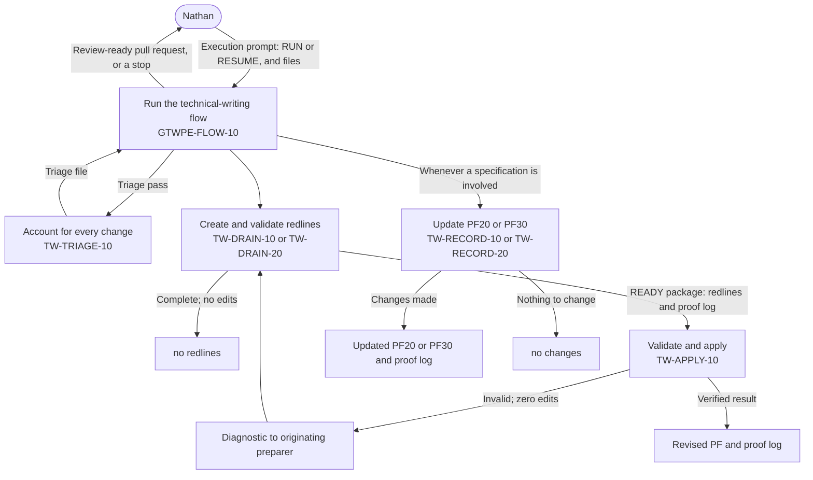

# MODIFICATION-20261007-gtwpe-tw-flow-rulings

The GTWPE's technical-writing flow brought into line with Nathan's rulings of 2026-10-07: a run takes only
files as inputs, every PF10 addendum is drained through a triage prompt that is part of the run, and PF20 and
PF30 are updated through their own prompts whenever a specification is involved; with every member checked
again against his words.

## Intake

Not through triage. Nathan's request, copied verbatim in the front matter, gives three files on `main` and
nothing else. At `128836aef7d45ae9f8c8118d2c5ab025d5ec634a` (`128836a`), the commit this mode examines:

| File | Blob | Bytes |
|---|---|---|
| `docs/ephemeral/gtwpe.rewrite/PE40-INIT-20261007.md` | `d41c071617f10ff21f738ac5092a5bbcf6341e3c` | 9,306 |
| `docs/ephemeral/gtwpe.rewrite/ERRORS.md` | `515002cfa0d5d07d7c72bc7f674b583d0a7f702b` | 52,236 |
| `docs/ephemeral/gtwpe.rewrite/GTWPE-TARGET-ARCHITECTURE-20260929.md` | `be57ef3222ee7d4d533fabc66f1722670154d317` | 29,177 |

**What the request is.** Nathan's words, where these files record them. The files also carry text by PE37,
PE39 and PE40: PE39's handover around Nathan's quoted rulings, each ledger row's finding and disposition, and
the readings and status updates in the architecture record. This record uses that text only to find Nathan's
words and as claims to check against the live sources, never as the request (ruling 5; ledger E-048 and
E-054).

**The items.** ITEM-01 to ITEM-08 number the outcomes Nathan's words ask for, in the order of PE40-INIT's
rulings 1 to 5:

| Nathan's words, where recorded | Item |
|---|---|
| Ruling 1, "this needs to be explicitly documented"; rulings 2 and 3 are rulings of the same kind | ITEM-01 |
| Ruling 1: "the only inputs should be the filenames. Any other context will corrupt the run. this needs to be explicitly documented. you may not pass arbitrary context in handoffs", then "make sure this is clear in the operations hub. this is very important at every phase." (E-045) | ITEM-02, and ITEM-07 for GTWPE-MGMT-10's own request |
| Ruling 2: "Whether or not an addendum states an explicit drain target, it needs to be drained." E-044 and E-052: "all pf docs should be updated based on context and scope, not whether or not the addenda specify a drain target." | ITEM-03 |
| Ruling 2: "part of this run is to have a prompt evaluate the drain targets." (E-051) | ITEM-04 |
| Ruling 3: "PF20 and PF30 must be updated as part of this. of course." E-046 and E-052: "If there is a spec involved, those docs are updated. if not, then not. its basic." E-053: "PF30 and PF20 DON't need the redliner. They should not need that step. They never have." | ITEM-05 |
| Ruling 4: "make sure the pF09 docs are assigned the right prompts too." (E-047) | ITEM-06 |
| Ruling 5: "I have to believe everything is wrong now." E-048: "So you did all of this wrong. Days wasted. Fix it" | ITEM-08 |

**Handed in, and not an item.**

| Row or text | Disposition |
|---|---|
| E-043, the TypeSafe ladder and the HD scoring script | Outside this prompt's route. Neither scoring skill runs or validates the TW flow or the GTWPE, so GTWPE-MGMT-10 may not change them (*What this prompt may change*). Returned to Nathan. PE40-INIT and E-043's own PE40 check both say it is redone only if he asks |
| E-049, E-050 | Fixed; PE40-INIT lists them for the record only |
| E-054 | Fixed. Its lesson binds this analysis: where Nathan's recorded words settle a question, a prompt's text or a canon reading that points elsewhere is a defect to fix, not an option to offer |
| The other rows marked `OPEN`: E-004, E-006, E-007, E-009, E-010, E-015, E-016, E-020, E-021, E-022 and E-033 | None carries a ruling of 2026-10-07, and each names its own route. §A records which of them this Modification's rulings bear on |

## §A — Analysis

*Written by MODE = ANALYZE. Requires nothing upstream. Frozen once approved.*

This session ran the mode as a GTWPE-MGMT-10 session, following *GTWPE-MGMT-10 — Manage the GTWPE — 100526.2*,
fetched live at the start of the mode: edited 2026-10-05T16:36:11.384Z, the version the catalog selects. The
mode started at 2026-10-07T04:55:40Z, when Nathan's request arrived, with `main` at `128836a`. The record is on
`docs/20261007-modification-gtwpe-tw-flow-rulings`, the Modification's own branch, with its open pull request
amthorn78/glow-hdengine-v2#590. The session's harness had named another branch; nothing was pushed there, since
the next mode finds a record only on a `docs/*-modification-gtwpe-*` branch.

### Consult

- **Repository**, on `main` at `128836a`.
  - The three request files, whole (*Intake*).
  - C1 to C4's records: MODIFICATION-20261005-gtwpe-writing-side §A A.2, A.4, A.5 and A.6 and its approval;
    MODIFICATION-20261006-gtwpe-flow-manager's front matter, §A whole and §E's readback times. C2's and C3's
    records for their items, parts and estimates.
  - `CHECKPOINT.md` §8, Nathan's rulings of 2026-09-28; implementation plan v1.2 §1, the source of the PF27
    gate (ITEM-03).
  - In `docs/prompt_ecosystem_management/`: `modification-template.md` 2.1, `ecosystem-change-management.md`,
    `execution-and-delegation-model.md`, `notion-write-boundary.md`, `prompt-body-content-policy.md` and
    `reviewer-prompt-template.md`, whole; in `gcfpe.decision-record.md`, `D21`, `D22`, `D23`'s clarification on
    subagents, `D24` and `D26`, whole; `gtwpe/gtwpe.decision-record.md` and `gtwpe/gtwpe.handoffs.md`, whole;
    the headers of `gtwpe/gtwpe_record_check.py` and `modification_validate.py`, and the validator's `check()`.
  - `AGENTS.md` and `.github/pull_request_template.md`.
  - No `docs/*-modification-gtwpe-*` branch carries this ID (`git ls-remote`): the only such branch is C2's,
    `docs/20261005-modification-gtwpe-tw-repository-io`, whose record is `COMPLETE` on `main`. The ID is new.
- **Canon**, on `main` at `128836a`, unchanged since `fffadb5` (`git log` over `docs/pfcanon/`). Searched with
  `git grep` for the task's terms: `drain`, `addend`, `PF20`, `PF30`, `PF27`, `PF09`, `rollover`, `material
  update`, `historical drainage`, `prompt ecosystem`, `handoff`, `technical writing`, `redline`. Read in full
  where it governs; *Canon and rulings relied on*, at the end of this section, says what each is used for.
- **Notion, read-only.** GTWPE-MGMT-10 100526.2; GTWPE-FLOW-10 100726.1 and the six selected TW prompts
  (*The members, read live*); the GTWPE parent page and its catalog; the *Glow Technical Writing Ecosystem*
  page; *HDE TW*, *Alpha 1* and the Glow Operations Hub; the architecture page; the lineage sources and the
  register (A0); and searches on every member's ID, title and version and on TW's current release (A3).
- **Installed skills**, read for this task: `glow-write-boundary` and `glow-workspace-currency`.

### Drift check (A0)

`git fetch origin main`; the commit examined is `128836aef7d45ae9f8c8118d2c5ab025d5ec634a` (`128836a`),
amthorn78/glow-hdengine-v2#589's merge.

**(a) The lineage sources.** Searches with highlights off on `PE Metaprompt` and `GCFPE-MGMT-10` found no page
that the catalog does not record and that is newer than its record. The other PE Metaprompt hits are archived
predecessors dated 2026-09-12 and 2026-09-13; the other GCFPE-MGMT-10 hits are the archived `091326.1` and
`091326.2` and control or tracking pages. The selected `091426.1` page did not appear in the results (a search
can miss a page); it was fetched by its recorded ID. Each recorded page was fetched for its exact edit time. The
PE Metaprompt's fetch and the register's were saved by the harness and read by script (*Harness files*).

| Source | Recorded in the catalog | Found, by fetch | Trigger finding |
|---|---|---|---|
| GCFPE-MGMT-10 | Pinned: the proposed body, 2026-09-24T11:00:24.691Z. Selected: `091426.1`, 2026-09-24T15:38 | 11:00:24.691Z; `091426.1` (`3db4590a05eb81d1bb64ebcb3ca8eb54`) at 15:38:34.295Z; the register selects it | None |
| PE Metaprompt | Pinned and selected: `091426.1`, 2026-09-23T17:17:22.217Z | 17:17:22.217Z; the register selects it (`3db4590a05eb8174be35d9e35acb3f77`) | None |

The register page was at 2026-09-23T17:43:39.489Z, the edit time the catalog records.

**(b) The watched paths.** `git log b65e918..origin/main` over *The watched sources* lists nothing. The range
holds five commits, amthorn78/glow-hdengine-v2#584 and #586 to #589, which change 22 files, all under
`docs/ephemeral/`.

No trigger finding. X4 re-pins nothing and moves the checked-through commit to the commit it examines.

### The members, read live

Each member was fetched whole into this session's context and read whole. Each edit time equals the one its
last recorded readback gives (C3's or C4's `EXECUTE`), so no member has changed since its selection. The
selection page selects TW-ALPHA-20261006.2 with the six TW prompts below.

| Member | Version, page | Edited |
|---|---|---|
| GTWPE-MGMT-10 — Manage the GTWPE | 100526.2, `3f04590a05eb8128b8c8ff3650ab2d5a` | 2026-10-05T16:36:11.384Z |
| GTWPE-FLOW-10 — Run the Technical Writing Flow | 100726.1, `3f24590a05eb81798286d600250655d6` | 2026-10-07T00:09:42.961Z |
| TW-TRIAGE-10 — Identify PF10 Drain Targets | 100626.1, `3f14590a05eb81789e16d978795db77d` | 2026-10-06T03:18:14.556Z |
| TW-DRAIN-10 — Prepare PF Document Redlines | 100626.2, `3f14590a05eb819f8390f5b92fc4c8ab` | 2026-10-06T16:39:55.231Z |
| TW-DRAIN-20 — Prepare PF09 Redlines | 100626.2, `3f14590a05eb81a58043d304b7452801` | 2026-10-06T16:45:43.111Z |
| TW-RECORD-10 — Create Epic History Section | 100626.2, `3f14590a05eb81d399a7c3ab1fd6fb66` | 2026-10-06T16:47:37.162Z |
| TW-RECORD-20 — Create CRD History Section | 100626.2, `3f14590a05eb81eaaf0cedac0de274b9` | 2026-10-06T16:49:11.220Z |
| TW-APPLY-10 — Apply Validated Redlines | 100626.2, `3f14590a05eb81daa3cfee9956585cd5` | 2026-10-06T16:50:52.240Z |

The control pages, by fetch:

| Page | Edited | Against its last recorded readback |
|---|---|---|
| GTWPE parent page, with the catalog | 2026-10-07T01:59:25.993Z | Equal to C4's X4 readback. Members: GTWPE-MGMT-10 100526.2 and GTWPE-FLOW-10 100726.1; checked-through commit `b65e918` |
| *Glow Technical Writing Ecosystem* (the selection page) | 2026-10-07T02:12:01.288Z | Equal to E-041's readback |
| *HDE TW* | 2026-10-07T02:12:11.957Z | Equal to E-041's readback; 38 child pages |
| *Alpha 1 — Implementation and Validation* | 2026-10-07T02:11:56.963Z | Equal to E-041's readback; 34 headings |
| Glow Operations Hub | 2026-10-07T04:23:05.337Z | Later than E-041's readback (02:11:59.113Z). Its top now holds the red callout PE40-INIT records; its *Current Glow TW release — TW-ALPHA-20261006.2* section reads as E-041 left it |
| *GTWPE Target Architecture — Document-Writing Flow* | 2026-10-07T02:13:39.342Z | Equal to E-041's readback |

### The check against Nathan's words (ITEM-08)

Every member, and every control the GTWPE reads, was checked against Nathan's words in the three request files
and against the live sources, rather than against C1 to C4's records or PE39's or PE40's statements. Where this
check reaches the same result as a ledger row's PE40 check, the row is cited; where it differs, it says so.
Quotations from prompt bodies are the clause at issue, from this session's live fetch, and the dry run checks
each against a second fetch.

#### ITEM-01. The rulings, recorded

`gtwpe.decision-record.md` holds one ruling, GTWPE-D1. None of Nathan's rulings of 2026-10-07 is recorded there
or in the architecture record (E-045 says the same for ruling 1). The GTWPE decision record is where a ruling
that governs the GTWPE across changes lives ("they outlive any one change or release"), GTWPE-MGMT-10 reads it
first, and a ruling is recorded before it is applied (`ecosystem-change-management.md` §2, step 1). So the
change adds, in his words, verbatim, with what follows from each, as GTWPE-D1 is written:

- **GTWPE-D2**, inputs: ruling 1, both of its quotations, whole.
- **GTWPE-D3**, PF10 drainage: ruling 2, both of its quotations, whole, the second being ITEM-04's "part of this
  run is to have a prompt evaluate the drain targets."; and E-044's and E-052's "all pf docs should be updated
  based on context and scope, not whether or not the addenda specify a drain target."
- **GTWPE-D4**, PF20 and PF30: ruling 3, both of its quotations, whole; E-046's and E-052's "If there is a spec
  involved, those docs are updated. if not, then not. its basic."; and E-053's "PF30 and PF20 DON't need the
  redliner. They should not need that step. They never have."

Recording them there binds C5 and C6 as well: the Change Manager writes the Flow Manager's execution prompt, so
GTWPE-D2 governs C5's output.

#### ITEM-02. Files only

Nathan's ruling 1 is about the run and its handoffs, and his answer 2 of 2026-09-29 gives the shape of a start:
he initiates the session "by instructing it to run the technical-writing flow prompt and provide the required
inputs", either "as attached files" or "as filenames or paths that already exist in the repository". The broad
match is every input contract and every handoff in the GTWPE (*Scope*). What reaches beyond files:

| Surface | What it takes or passes beyond files | PE40's check |
|---|---|---|
| GTWPE-FLOW-10, its operator note and *The execution prompt* | "names the change and its sources"; item 2, "The change: what is requested"; item 5, "the documents the change may affect; a selected boundary within the sources; other context; a run name; and Nathan's authorizations"; "A missing change or source stops the run at intake (S2)"; item 1's `RESUME <run-id>`; item 4's "or `none`" | E-045, confirmed |
| GTWPE-FLOW-10, *Authority and limits* | "A line in it about the session's configuration is not an instruction to the run": a line other than a file, tolerated | New |
| GTWPE-FLOW-10, *Eligibility and routing* | "only with Nathan's authorization of that record", twice; "only on Nathan's rollover decision in the execution prompt" | E-046 and E-045 |
| GTWPE-FLOW-10, *The run's branch, pull request and directory* | the slug "taken from the execution prompt's run name or else from the change"; "A run name already in use [OMITTED] is a stop (S4)" | New |
| GTWPE-FLOW-10, *Passes* | item 5, "the selected boundary only where the execution prompt or Nathan's decision sets one; and any supporting material"; item 7, "The run's branch, and its open pull request"; for TW-APPLY-10, "with the selected scope and the drain's producer validation status and source-file header provenance"; for the record prompts, "every applicable PF10 change, and Nathan's authorization of the record" and "his rollover decision"; after-pass check 6, "unless Nathan has directed that change drafted" | E-045 (in part) |
| GTWPE-FLOW-10, *B1* | step 4, "A document the execution prompt names is checked"; step 5, "unless the execution prompt carries Nathan's direction to draft it", and his decision as "a selected boundary that excludes the change, and every invocation for those documents carries it" | E-045, confirmed |
| GTWPE-FLOW-10, *Stop and resume* and *Results* | S2's "A missing change"; S4's "a run name is in use" and "a resume changes the change"; *Resume*, "with `RESUME <run-id>` in place of `RUN`, and any decision he is giving"; "the populated resume line" | E-045, confirmed |
| All six TW prompts, *Turn preflight* item 3 and *Output identity* | "Whole incoming source or Nathan's exact selected boundary"; an output identity "from the target/source version, exact selection and run identity" | New |
| TW-DRAIN-10 and TW-DRAIN-20, *Intake and source scope* | "Nathan may optionally select agendas/sections and provide relevant supporting material"; "Accept explicit selections"; "A supplied legacy `PF10_BUILD_NOTES_VERSION` is an explicit identity hint" | New |
| TW-DRAIN-10 and TW-DRAIN-20, *Exact redline contract* | "For genuinely fileless input, retain the actual supplied title and conversation/source reference" | New |
| TW-DRAIN-10 and TW-DRAIN-20, *Completion, outputs and handoff* and *Formatted final-response handoff* | the next invocation carries "selected scope, producer validation status and source-file header provenance"; the handoff holds "known risks/anomalies", gates and a "populated copyable invocation using the next prompt's native ordinary-language inputs", and asks for "usable references, not placeholders or filename-only claims" | New |
| TW-TRIAGE-10, *Source identity and routing* | step 1, "an explicitly supplied legacy `PF10_BUILD_NOTES_VERSION`"; step 3, "the selected current PF10 requirements" | New |
| TW-RECORD-10, *Purpose and minimal inputs* and *Destination* | "with an exact Epic identity and target when not uniquely resolvable"; "or an explicit attributable Nathan statement"; "Resolve any Nathan-selected supporting section"; "ask Nathan for the destination" | New |
| TW-RECORD-20, *Destination* and *PF30 schema* | "Resolve any Nathan-selected supporting section"; "ask Nathan for the destination"; "only when the invocation carries his rollover decision" | New |
| TW-APPLY-10, *Deterministic final document-control header*, the no-change report and *Diagnostic handoff* | "an explicit authorized target version when supplied"; "explicitly fileless sources"; "Only when Nathan explicitly requests a no-change report"; a "populated invocation returning to that preparer" that carries "task selection" | New |
| `gtwpe.handoffs.md` | F1: "the change", "or `none`", and the optional "selected boundary, other context, a run name, and Nathan's authorizations"; F1's check, "a resume keeps the change"; F2: "any selected boundary and supporting material" and "the run's branch and its open pull request"; F4: "the selected scope, the producer validation status and source-file header provenance"; F7: "every applicable PF10 change; Nathan's authorization of the record; any rollover decision"; H11: "the failing stage, evidence, the run ID"; lightly, F3's and F5's returns, F6's lineage and F9's resume line, which the files they name already hold | E-045 for F1, F2, F4 and F7; the rest new |
| The selection page, *Current operation* of TW-ALPHA-20261006.2 | "Next manual entry: [OMITTED] the exact selected scope" | E-045, confirmed |
| The Operations Hub, *Current Glow TW release* | States no rule on inputs. The red callout above it carries Nathan's words, but it is outside GTWPE-MGMT-10's route | — |

**Permitted exceptions** (not reached): naming the prompt to run, as answer 2 does, and GTWPE-MGMT-10's `MODE`;
the Modification ID that its `PLAN` and `EXECUTE` take, which names the record's file; an output location given
as a path, which is a filename; a prompt's own Notion reads of its selection and of
the prompt bodies it runs; text that describes behaviour without asking for an input; and Nathan's approvals to
GTWPE-MGMT-10 (H13), which `D21` requires quoted into the record.

**The "selected boundary" goes.** Under ruling 1 a boundary in words cannot be passed, and under ruling 2 no
addendum is left out of a run: "if there are addenda in PF10, that means they need to be drained, otherwise they
would not be in there" (Nathan, E-044). Every pass reads the whole of every source it is given.

**What a run needs beyond files reaches it as a file.** The analysis reads ruling 1 as covering Nathan's own
inputs to a run, since the execution prompt it was given about is his. So: a resume names the run by its
`RUN.md`, a file; a decision Nathan gives at a stop (a canon conflict, a pass's question, a held-back PF10
change, a PF30 rollover) is a file the resume names; and what a pass needs about the run itself, its branch and
pull request, it reads from `RUN.md`. A run or pass given anything beyond the prompt to run and its files stops
at intake and names what it was given, as GTWPE-FLOW-10 already stops on an execution prompt that asks for what
it rules out. A PF document is named by its directory and versionless name, which canon asks of every prompt
and which still names one file on `main` (risk 14). The plan sets the exact forms.

**"make sure this is clear in the operations hub."** The Hub's current TW section is on GTWPE-MGMT-10's route (the
current-release note on each page that names TW's current release), so the new note there states the rule and
cites GTWPE-D2. The callout at the Hub's top is outside the route, and its last sentence, "GTWPE-FLOW-10
100726.1 still asks for more than filenames; that fix is open", goes stale at X4 (*Pages outside the route*).

#### ITEM-03. Every addendum drained

- **GTWPE-FLOW-10 lets an addendum go undrained.** B1 step 4 decides, document by document, "whether the change
  may affect it"; nothing accounts for every addendum; and B1 step 7, B3 and *Results* end `RUN_NO_CHANGE` when
  no document is affected. Confirmed, as E-044's PE40 check found.
- **PF27 is gated on a specification.** *Eligibility and routing*: "PF27 only when the run has a governing
  specification that changes a template PF27 owns." The gate comes from implementation plan v1.2 §1, which
  lists "PF27 and PF30 are updated only when a specification exists" among things Nathan's message of 2026-09-25
  "also instructed": a summary, not his words (E-052). His ruling, "all pf docs should be updated based on
  context and scope", removes the gate for PF27, a general document. PF30 keeps its specification rule, by his
  separate rule for PF20 and PF30 (ITEM-05).
- **TW-TRIAGE-10 can return no target.** "Return only a simple list of actual target basenames, or one concise
  supported no-target/error result", and its *Output*'s sentence "that no PF target requires drain". Confirmed,
  as E-051's PE40 check found.
- **The drains already account for each change** they are given: "an actionable redline, already represented
  with an exact equivalence location, out of this target's documented ownership [OMITTED], or a blocking unresolved
  item". That fits the rule, per document.
- **Canon bears on timing, not on whether.** HDE Build Notes keeps an addendum authoritative "until the guidance
  is formally reviewed and drained into the relevant permanent PF document" (*Precedence, versioning, and
  scope* §1), and removes drained guidance when it is formally revised (§7). Drainage comes after the change's
  QA, by the Change Process Guide's *Post-QA documentation drainage ordering (normative)* ("only after all QA
  tasks for the epic are complete"), and after its closure decision: "The runtime flow completes required
  QA/reporting and the Isis closure decision before its manual PF10 drainage" (HDE Governance §2.0.19,
  *Post-closure maintenance ordering*; §9.1.5). GTWPE-FLOW-10's B1 step 5 holds a change back only until its
  epic's QA is recorded complete, which is short of canon: a PF10 change that belongs to an epic or a CRD is
  drafted only once the run's files show that change closed, and is otherwise held back and accounted for.
  Nathan's 2026-09-28 ruling "No, pF10 will NEVER be a merge target, EVER>" stands, as `CHECKPOINT.md` §8
  records it.

What follows, for the plan: in a run with a PF10 source, every addendum is accounted for in `RUN.md` and the
pull request: the documents it drains into; where it is already represented, as a pass that read the document
shows it, by a drain's verified `no redlines` with its exact equivalence location, or by the record pass for PF20
or PF30, for each document the addendum bears on; or why it cannot drain in this run (held back until its
change's closure, by canon's ordering; a PF20 or PF30 part with no specification in the run; or a home that is
no eligible document, such as PF10 itself). The triage pass's reading routes an addendum's documents to their
passes and never closes an addendum by itself, as B1 step 4 already says of triage: "When unsure, route it: a
drain's verified `no redlines` is the authoritative answer that it is not affected." No run ends `RUN_NO_CHANGE`
or `RUN_REVIEW_READY` with an addendum unaccounted for, and `RUN_NO_CHANGE` remains only for a run in which every
addendum is shown already represented, or which has no PF10 source and changes no document.

#### ITEM-04. A triage prompt in the run

- GTWPE-FLOW-10 runs no triage prompt: B1 step 4 is its own triage, and `gtwpe.handoffs.md` has no TW-TRIAGE-10
  row. Confirmed, as E-051's PE40 check found. C4's *Member dispositions* left TW-TRIAGE-10 "Unaffected; not
  run": "It is PF10-only and list-only", and its eligibility sentence "contradicts Nathan's ruling of 2026-09-28
  until C5". Nathan's direction is that "the discipline of the prompts is not glossed over" (architecture
  record, *Redlining discipline*).
- TW-TRIAGE-10 is the selected prompt for this job and already allows it: "Nathan initiates every invocation and
  return, directly or through a session he started that runs this prompt as a pass." So the run invokes it as
  its triage pass and takes its return, as it does the drains'.
- TW-TRIAGE-10 needs repair before the run can rely on it, each point from Nathan's words:
  1. **Eligibility.** "including Reference documents where relevant. A title containing Canon is not an
     eligibility rule." Against Nathan's 2026-09-28 rulings: "with the exception of PF03 only files with "canon"
     in their title are valid merge targets", "PF20 and PF30 are special targets with dedicated prompts", and
     PF10 never a target.
  2. **No target.** Its no-target result, against ITEM-03.
  3. **A bare list.** One bullet per target basename cannot show that every addendum is accounted for. Its
     return names, for each addendum, the documents it bears on, which the run routes to their passes, or why
     none in this run (ITEM-03). It never closes an addendum as already represented: only a pass that reads the
     document can show that.
  4. **PF10 only.** "The incoming source is `PF10-HDE-Build-Notes`; do not generalize this alpha to other source
     types." Against the architecture's execution-time triage "against these inputs" (§2) and its full-context
     rule (§7), and Nathan's "based on context and scope": it evaluates the drain targets against every source
     the run has, the specification included.
  5. **Optional.** "This prompt is optional routing help" stays true of a direct invocation, which Nathan's
     ruling does not address; in a run it is part of the run.
- **C5.** C1's §A A.5 proposed C5 as "TW-TRIAGE-10 extended" into the Change Manager. This Modification makes
  TW-TRIAGE-10 the run's triage pass instead; C5's own `ANALYZE` settles the Change Manager's prompt in that
  light. Recorded, not decided here.

#### ITEM-05. PF20 and PF30

- **The authorization gate.** GTWPE-FLOW-10's PF20 and PF30 rows run the record prompts "only with Nathan's
  authorization of that record", and F1 and F7 carry it. Confirmed, as E-046's PE40 check found. Nathan's rule
  replaces it: "If there is a spec involved, those docs are updated. if not, then not." With any specification
  among the run's inputs, PF20 and PF30 are both updated, each through its own prompt, TW-RECORD-10 and
  TW-RECORD-20, on the run's context and scope; without one, neither. What each takes is set by its own scope
  (HDE Phased Epics §0; HDE CRD Records §1): an Epic Specification's record goes in PF20 and a CRD
  Specification's in PF30, and each document takes the PF10 changes that bear on it (S-7). Canon sets when an
  epic's record may go in PF20 (*Canon*, below).
- **The redliner on PF30.** GTWPE-FLOW-10 sends "A change to an existing record: TW-DRAIN-10, then TW-APPLY-10".
  Against E-053's ruling. Confirmed.
- **The record prompts refuse updates.** Both: "An existing record is not permission to create a duplicate or
  silently revise it through this creation role", and "Nathan may invoke the appropriate drain for such work".
  Their output checks allow only "the inserted entry and its control fields". So the record prompts make every
  change a run makes to their document, an existing record's included:
  - TW-RECORD-20, as HDE CRD Records §4.2 requires: "The affected current-state fields MUST be updated in the
    existing CRD entry", with one appended material-change row, earlier rows never overwritten; in the volume that
    holds the record, since a volume `Closed to new CRDs` still takes "all required material, correction,
    continuation, and closure updates" (§6).
  - TW-RECORD-10, within HDE Phased Epics' *Drain posture*: "do not mass-edit historical epic records", and
    "Only update a prior epic record when the change prevents future reader confusion".
- **One pass chain per document.** "A document that would need two, such as a new record and a change to an
  existing record in one PF30 volume, or two records in PF20, is a stop". With the record prompt making every
  change to its document, one pass makes them all; the plan settles what of this stop remains.
- **Addendum changes to PF20 and PF30.** HDE Build Notes 2.14 says "PF27 and PF30 adopt the same terms on their
  next revision", and PF30.1 uses "CRD Plan" 15 times on 14 lines (`grep -o`, by command). A PF30 revision is TW-RECORD-20's,
  since PF30 never goes to the redliner (E-053). So TW-RECORD-20 carries each applicable PF10 change that bears on
  a PF30 volume in context and scope (ITEM-03), beside any record it adds, and TW-RECORD-10 does the same for
  PF20. When no specification is in the run, neither is revised, and the run accounts for such an addendum as
  waiting for one (ITEM-03).
- **Canon.** Nathan's rule is stated from his words, not argued from canon ("this is meaningless distinction",
  E-054). Read for the canon-first rule only: HDE Governance §9.1.1 makes PF20 and PF30 historical homes that
  "The active workflow MUST NOT create, update or synchronize", reserves additions to "a separately authorized
  historical drainage action", and asks to "Preserve existing PF20/PF30 content and original identities as dated
  history"; its table and §9.1.5 put PF10 drainage after closure, as maintenance an authorized manual operator
  does. A run Nathan starts is that maintenance, not the active workflow, and S-7's update of an existing CRD
  record keeps its earlier rows and its identity, as HDE CRD Records §4.2 asks. Canon also sets when: PF20 takes
  an epic's record "only once, at epic close", and "In-flight epics MUST NOT be added" (Plan Templates §2,
  *Historical-only posture (normative)*; Change Process Guide §1.1.2, §3.5.1 and §6.3). So PF20 takes an Epic
  Specification's record only when the run's files show the epic closed; otherwise that part waits, accounted
  for as ITEM-03 says, and TW-RECORD-10 keeps its rule that the epic's completed or historical posture is
  established from the evidence it is given, which is a file. E-010, canon's own conflict on PF20 and PF30
  records, stays open and his.
- **The first live run** (HDE Build Notes and the HDE-EPIC040 Specification, as PE40-INIT names them): a
  specification is involved, so PF20 and PF30 are both updated. PF20 takes HDE-EPIC040's record, which is new
  (`git grep -c HDE-EPIC040` over HDE Phased Epics is 0), and the PF10 changes that bear on PF20; PF30 takes the
  PF10 changes that bear on it, such as 2.14's terms, and no new record, since no CRD Specification is in the
  run. HDE-EPIC040 was closed on 2026-09-29 by `docs/ephemeral/HDE-EPIC040-CL-E-10-closure-decision-v1.2.md`
  (`CLOSE`). HDE Build Notes records its QA verdict ("It is not closure") and not that decision, so the decision
  must be among the run's inputs; without it, HDE-EPIC040's PF20 record and its PF10 changes wait.

#### ITEM-06. PF09

No defect, and no change of its own. GTWPE-FLOW-10 sends each PF09 phase document to TW-DRAIN-20, then
TW-APPLY-10, and keeps PF09 out of the general route. That is architecture §6 ("PF09 uses its own specialized
prompt") and *Redlining discipline* (every document but PF20 and PF30 goes through redline creation and redline
apply, with a report for each phase). TW-DRAIN-20's scope lines agree: "PF09 preparation belongs here" and "For
a complete READY package, Nathan invokes TW-APPLY-10"; TW-APPLY-10 takes packages "from actual TW-DRAIN-10/20
preparer"; and TW-DRAIN-20 judges every potentially affected row "on all the available evidence", architecture
§8 nearly word for word. This agrees with E-047's PE40 check. Which phase files a run takes is the triage pass's
(ITEM-04). TW-DRAIN-20 changes for ITEM-02 and ITEM-05 only. Nathan's approval of this analysis accepts it, which
closes E-047.

#### ITEM-07. GTWPE-MGMT-10's own request

GTWPE-MGMT-10's entry contract takes "the request in whatever form it arrives: a defect in a GTWPE run's
report, a sentence, a finding, a policy instruction", and asks for "the subject, the expected result, the
actual or requested result, and an example". A relayed request therefore reaches the analysis whole, as
context, and A1 copies it verbatim as the request. That is the route by which PE39's interpretations entered C1
to C4 (E-048: "PE39 wrote long change requests to the C1 to C4 workers carrying its own interpretations"). Under
ruling 1, a request handed to it carries only the files that record it, as Nathan's request for this
Modification does. Its workers and reviewers are handed only filenames, their committed brief among them.

**This differs from PE40's check,** which found "no defect found against the rulings in GTWPE-MGMT-10, whose
request may arrive "in whatever form", filenames included" (E-048). PE40 asked whether the prompt requires more than filenames; this
analysis asks whether it lets more than filenames pass in a handoff. Nathan's approval settles it; dropping
ITEM-07 leaves the rest of the Modification unchanged.

#### Everything else the check covered

Found consistent with Nathan's words, with no change: the architecture's §§4, 5 and 10 (no Draft status;
document control; the completion standard), built in C3 and checked in GTWPE-FLOW-10's B4 and B6; §6's PF03
special case; §7, full-context reading, in every pass; §8, in TW-DRAIN-20; §9, in both record prompts; answers 3
to 8; the stop rule (S1 to S6); no model or strength advice in any TW prompt or in GTWPE-FLOW-10; and GTWPE-D1
in every writer. Answer 8's "divided into additional logically organized volumes" is, by HDE CRD Records §6, the
Product Owner's determination; GTWPE-FLOW-10 stops for it (S4), which stays, with his decision given as a file
(ITEM-02). One more defect, under ITEM-05: TW-DRAIN-10's and TW-DRAIN-20's *Exact redline contract* keep "such
as an HDE CRD Records material-change row's decision date", written for the PF30 drain route ITEM-05 removes;
it goes with that route.

Found wrong against the live sources in GTWPE-MGMT-10, which ITEM-07 gives a new version, and fixed there under
ITEM-08: "until G5", in the six places E-033 lists (*Native purpose*; two rows of *What this prompt may change*;
*Notion writes*; the `prompt` and `notion_control` entries of the `targets` row), where the approved order of
changes has no G5 and adoption is C6, so the bound becomes the adoption change, as E-033 proposes; the selection
route's "lists the eight members", where TW-ALPHA has six (C3's F-1); and its two pointers to the design
package's §6 handoff table (*Read these*; the `closure` row of *The record*), which C4 replaced with
`docs/prompt_ecosystem_management/gtwpe/gtwpe.handoffs.md`. Likewise in GTWPE-FLOW-10, which ITEM-02 to ITEM-05
give a new version: the two links to `http://RUN.md` that Notion made of plain `RUN.md` at its publication
(E-042), which the ledger keeps as "a candidate for the prompt's next version", written as inline code, with the
check for bare file names that its finding F-E1 proposes.

### What the analysis settles, for Nathan's approval

Each follows from his words and the canon cited; none is his own words, so each is listed for his approval.

| # | Settled | From |
|---|---|---|
| S-1 | Ruling 1 covers Nathan's own inputs to a run. A resume, a decision at a stop and a rollover decision reach a run as files; a run or pass given anything beyond the prompt to run and its files stops at intake and names it | Ruling 1; GTWPE-FLOW-10's existing intake stop |
| S-2 | Attached files stay allowed beside repository paths | Answer 2 |
| S-3 | No selected boundary anywhere: every pass reads every source whole | Ruling 1; E-044 |
| S-4 | Every addendum accounted for, and counted as already represented only on a pass's verified finding for each document it bears on; a change held back until its epic or CRD is shown closed; `RUN_NO_CHANGE` only as ITEM-03 states | Ruling 2; E-044's ruling; HDE Build Notes front matter §1 and §7; the Change Process Guide's post-QA ordering; HDE Governance §2.0.19 and §9.1.5; GTWPE-FLOW-10's B1 step 4 |
| S-5 | TW-TRIAGE-10 is the run's triage pass, evaluating every source; it stays optional for a direct invocation | Ruling 2; architecture §2 and §7 |
| S-6 | With any specification among the run's inputs, PF20 and PF30 are both updated, each through its own prompt, on the run's context and scope: the specification's record in the document whose scope it is, an epic's only once its closure is among the run's files, and each document's applicable PF10 changes. Without a specification, neither | Ruling 3; E-046's and E-052's ruling; HDE Phased Epics §0; HDE CRD Records §1; Plan Templates §2; Change Process Guide §1.1.2, §3.5.1 and §6.3 |
| S-7 | The record prompts make every change to their document in a run: an existing record's update, and the PF10 changes that bear on the document in context and scope, such as 2.14's terms for PF30 | E-053's ruling; E-044's ruling; HDE Build Notes 2.14; HDE CRD Records §4.2 and §6; HDE Phased Epics *Drain posture* |
| S-8 | GTWPE-MGMT-10's own request is files only (ITEM-07) | Ruling 1; E-048 |

### What changes, by surface

| Surface | Route (*How each kind of target changes*) | Items |
|---|---|---|
| GTWPE-FLOW-10 | A new versioned sibling under the GTWPE parent page; the catalog selects it at X4 | 02, 03, 04, 05, 08 |
| GTWPE-MGMT-10 | A new versioned sibling under the GTWPE parent page; the catalog selects it at X4 | 07, 08 |
| TW-TRIAGE-10 | A new versioned sibling under *HDE TW*, selected by a new TW-ALPHA release | 02, 03, 04 |
| TW-DRAIN-10, TW-DRAIN-20 | The same | 02, 05 |
| TW-RECORD-10, TW-RECORD-20 | The same | 02, 05 |
| TW-APPLY-10 | The same | 02 |
| `gtwpe/gtwpe.decision-record.md` | A commit on this branch; Nathan merges at X2 | 01 |
| `gtwpe/gtwpe.handoffs.md` | The same commit and merge: F1, F2, F4, F6, F7, F9 and H11, the triage pass's two new rows, and the diagram | 02, 04, 05 |
| The selection page | The three selection writes, with a new *Current operation*, since the change alters how the TW flow runs | 02, 04, 05 |
| *HDE TW*, *Alpha 1*, the Operations Hub | The current-release note in each page's current TW section; on the Hub, the note states the rule (ITEM-02) | 02 |
| The GTWPE catalog | X4: the two rows, and the checked-through commit | — |

All six TW prompts change, so the new TW-ALPHA release has no unchanged row.

### Per part: closure, tier, class and targets

**One part,** PART-01, all eight items. A part is "one rule across its surfaces, above all" (`D21-B`): ruling 1
reaches every member, and rulings 2 and 3 share GTWPE-FLOW-10, the handoff table and the TW selection with it,
so splitting them would split a rule (the `D12` error) and put one page's edits in two parts.

- **Class B**, rule application: Nathan has ruled, and the ruling is the authorization. ITEM-01 records his
  rulings before they are applied, as a rule change needs (`ecosystem-change-management.md` §2, step 1).
- **Targets:** `prompt` (two GTWPE pages; six TW-ALPHA members), `rule` (the decision record and the handoff
  table), `notion_control` (the catalog; the selection page and the three pages that name TW's current release).
  No `tool`: the record format and its checks are unchanged. No `skill`.
- **Closure,** read from `gtwpe.handoffs.md` and the TW-ALPHA *Current operation*, on the changed handoffs:
  GTWPE-FLOW-10 consumes from and produces to TW-TRIAGE-10 (new), TW-DRAIN-10, TW-DRAIN-20, TW-APPLY-10,
  TW-RECORD-10 and TW-RECORD-20, and to GTWPE-MGMT-10 through H11; GTWPE-MGMT-10 consumes H11, whose producer is
  a run. TW-DRAIN-10 and TW-DRAIN-20 share their outcomes (`READY`, `NO_CHANGE`, `BLOCKED`; `COMPLETE_PACKAGE`,
  `PARTIAL_PACKAGE`). Every member the closure names changes in this Modification.
- **Tier 2:** it changes handoffs (F1, F2, F4, F6, F7, F9, H11 and two new rows) and TW-ALPHA relationships (the
  triage pass joins the run; the record prompts become the only route to PF20 and PF30), on both sides, in this
  Modification. No selftest or trial exercises a prompt handoff today; the gate is `PLAN`'s two-sided check of
  every invocation against the bodies it reaches, as C4 made it, and each new page's readback.

### Member dispositions (HDE Governance §9.1.6)

| Member or interface | Disposition | Reason |
|---|---|---|
| GTWPE-MGMT-10 | Affected | ITEM-07; ITEM-08, its own wrong text (*Everything else the check covered*) |
| GTWPE-FLOW-10 | Affected | ITEM-02 to ITEM-05; ITEM-08, the two `RUN.md` links (E-042) |
| TW-TRIAGE-10 | Affected | ITEM-02 to ITEM-04 |
| TW-DRAIN-10, TW-DRAIN-20 | Affected | ITEM-02; ITEM-05's PF30 clause |
| TW-RECORD-10, TW-RECORD-20 | Affected | ITEM-02, ITEM-05 |
| TW-APPLY-10 | Affected | ITEM-02 |
| TW-MGMT-10 (not selected since TW-ALPHA-20261006.1), TW-ASSESS-10 (retired) | Unaffected | Not selected; nothing runs them |
| The GTWPE catalog | Affected | X4: two rows and the checked-through commit |
| `gtwpe.decision-record.md` | Affected | ITEM-01; GTWPE-D1 unchanged |
| `gtwpe.handoffs.md` | Affected | ITEM-02, ITEM-04, ITEM-05 |
| `gtwpe_record_check.py`; `modification_validate.py`, `modification-template.md`, `reviewer-prompt-template.md` | Unaffected | The record format and its checks are unchanged; the last three are shared GCFPE controls, outside this prompt's route |
| The selection page; *HDE TW*, *Alpha 1*, the Operations Hub | Affected | The selection writes and the current-release notes |
| The architecture page and record | Unaffected by the route; left stale | Outside the route (*Pages outside the route*) |
| `tw-flowmaster` 1.3.0, `flowmaster-validate` 3.3.2 | Affected | Skills that interact with the TW-ALPHA selection and have not run its releases since C2. HDE Governance §9.1.6 reconciles interacting skills in one coherent successor selection, and Nathan waived that for TW Flowmaster one release at a time (C2's and C3's `override`). The new release needs his decision again (Q-1) |
| `glow-write-boundary`, the GTWPE exception | Unaffected | No write boundary changes: a run still writes only under `docs/ephemeral/` |
| `typesafe-scoring`, `hd-typesafe-scoring` | Outside the GTWPE | E-043 (*Intake*) |
| The PE Metaprompt 091426.1 | Unaffected | Used by `PLAN` to author, under GTWPE-MGMT-10's workarounds |

### GTWPE-D1, prompt by prompt (A2)

| Prompt | Writes, before and after | How the part keeps GTWPE-D1 whole |
|---|---|---|
| GTWPE-FLOW-10 | Neither artifact, before and after | Its *Proof logs (GTWPE-D1)* section, with the requirement verbatim and the B6 check, is not edited |
| GTWPE-MGMT-10 | Neither | Its guard (*Boundaries*; the proof-log check by phrase on a new page) is not edited |
| TW-TRIAGE-10 | Neither, before and after: its triage is a return, not an artifact | Nothing to keep |
| TW-DRAIN-10, TW-DRAIN-20 | The redlines file and its separate proof log, before and after | The proof-log paragraph, its eight minimum items and "named after it" are not edited; ITEM-02's edits are in intake and handoff text |
| TW-APPLY-10 | The revised PF and its separate proof log, before and after | The same |
| TW-RECORD-10 | The updated PF20 and its proof log, before; after, also for an existing record's update and for the PF10 changes it carries | The proof log and its eight items are kept; what it "also records" (where the entry went, the control fields before and after, that nothing else changed) is extended to every change it makes |
| TW-RECORD-20 | The updated PF30 volume, and on a rollover the next volume's review copy, each with its proof log; after, also for an existing record's update and for the PF10 changes it carries, with or without a new record | The same; one proof log per file, as now |

### Scope, and how it was measured (`SCOPE-001`)

**Method:** broad match by reading. For each rule, its broad terms were matched across each member's whole live
body, section by section, the permitted exceptions subtracted, and every remaining passage read in context. Every
body was fetched inline, so no harness save exists to count over by script; by `D22`, each count was made by
reading, and the dry run checks it by a second reading of a second fetch. The repository files were counted by
`grep`. This is also A3's `D26-E` search for these rulings: the passages reached are the text they contradict.

- **Ruling 1's terms:** `select`, `boundary`, `the change`, `context`, `supporting material`, `authoriz`,
  `decision`, `direction`, `statement`, `ask`, `fileless`, `run name`, `RESUME`, `invocation`, `handoff`,
  `supplied`. Exceptions as ITEM-02 lists them.
- **Ruling 2's:** `drain` as drainage (not the TW-DRAIN prompts), `no-target`, `no PF target`, `not affected`,
  `RUN_NO_CHANGE`, `list`, `optional`, `PF10-only` and `generalize`, `PF27`, `only when the run has`.
  Excepted: another TW prompt's note that TW-TRIAGE-10 is optional routing help, which S-5 keeps true of a
  direct invocation; in a run, GTWPE-FLOW-10 runs it.
- **Ruling 3's:** `PF20`, `PF30`, `record`, `authoriz`, `existing`, `appropriate drain`, `creation`, `insert`,
  `HDE CRD Records`. Excepted: PF20 and PF30 named as eligible, or in a record prompt's own schema text.

**Sections reached**, of each body's sections (the identity block, with a title heading that has no text of
its own, counted as one):

| Body | Sections | Ruling 1 | Ruling 2 | Ruling 3 |
|---|---|---|---|---|
| GTWPE-FLOW-10 | 20 | 11: identity; *Authority and limits*; *The execution prompt*; *Eligibility and routing*; *The run's branch, pull request and directory*; *Passes*; *B1*; *B5*; *Redo from canon*; *Stop and resume*; *Results* | 6: *Eligibility and routing*; *RUN.md*; *Passes*; *B1*; *B3*; *Results* | 4: *The execution prompt*; *Eligibility and routing*; *Passes*; *Stop and resume* |
| TW-TRIAGE-10 | 5 | 1: *Source identity and routing* (step 1's supplied version; step 3's "selected") | 4: *Coded identity and relationships*; *Purpose and authority*; *Source identity and routing*; *Output* | 2: *Coded identity and relationships* (it names only the two drains as next prompts); *Source identity and routing* (PF20 and PF30 as targets) |
| TW-DRAIN-10 | 12 | 8, two of them light: *Authority and sources* (light: "the explicit current Nathan directive"); *Turn preflight*; *Output identity*; *Intake and source scope*; *General PF preparation* (light: "Nathan authorization"); *Exact redline contract*; *Completion, outputs and handoff*; *Formatted final-response handoff* | 0 | 1: *Exact redline contract* |
| TW-DRAIN-20 | 13 | 9, three of them light: as TW-DRAIN-10, with its two PF09 sections in place of *General PF preparation*, which it does not have: *Development-board independence* (light: "selected sources") and *PF09 coverage and native semantics* (light: "selected prompt/source") | 0 | 1: *Exact redline contract* |
| TW-RECORD-10 | 9 | 5, one light: *Authority and sources* (light); *Purpose and minimal inputs*; *Turn preflight*; *Output identity*; *Destination, source roles and record preparation* | 0 | 4: identity (its title); *Purpose and minimal inputs*; *Destination, source roles and record preparation*; *Output and completion* |
| TW-RECORD-20 | 9 | 5, one light: *Authority and sources* (light); *Turn preflight*; *Output identity*; *Destination, source roles and record preparation*; *PF30 schema and native detail* | 0 | 5, one light: identity (its title); *Purpose and minimal inputs*; *Destination, source roles and record preparation*; *Output and completion*; *PF30 schema and native detail* (light: an update's volume) |
| TW-APPLY-10 | 12 | 8, two of them light: *Authority and sources* (light); *Turn preflight*; *Output identity*; *Intake and preparation-state verification*; *Deterministic final document-control header*; *Exact application and preservation* (the no-change report); *Invalidity, failure and return* (light: "ask Nathan to identify it"); *Diagnostic handoff* | 0 | 0 |
| GTWPE-MGMT-10 | 24 | 3: *Entry contract*; *Reviews are bounded* (the brief a reviewer is handed); *One session, and workers by workload* | 0 | 0 |

**ITEM-08's fixes in GTWPE-MGMT-10,** by reading its fetch after this session's context was compacted, each count
equal to an earlier reading of the same version, edited 2026-10-05T16:36:11.384Z: "G5" six times, in *Native
purpose*, *What this prompt may change* and *The record* (E-033's six); "§6" twice, in *Read these* and *The
record* (C4's dry run, D5); "eight members" once, in *How each kind of target changes* (C3's F-1). Five sections,
none of them among ruling 1's three. In GTWPE-FLOW-10, by reading its third fetch: the two `RUN.md` links, in the
heading of *RUN.md* and in the table of *The run's branch, pull request and directory*, E-042's "exactly those two
links"; both sections are among ruling 1's or ruling 2's already.

The plan measures each passage's exact anchor and count, by two independent readings where no save exists (ledger
E-035's lesson), and runs `D26-E`'s search for surviving old text on each new page.

**In the repository,** by reading the file whole: `gtwpe.handoffs.md`, 9 of its 12 rows reached, F1, F2, F4, F7 and
H11 fully and F3, F5, F6 and F9 lightly (a pass's return is its outcome and the paths of what it wrote; what more
it says is in those files), with F8, H12 and H13 not reached; its *Common rules* gain the rule, and the triage
pass two new rows and a node in the diagram. `gtwpe.decision-record.md`: three new entries; `git grep` on
ruling 1's terms finds three lines, its `applies_to` and two in GTWPE-D1, each a "handoff" through which the
proof-log rule must survive, which stays. `gtwpe_record_check.py`: one
line, a selftest fixture's quoted heading; no change.

### Pages that name the members or TW's current release (A3)

Searched with highlights off on each member's ID, title and version, and on `TW-ALPHA-20261006.2`; each page
found fetched or read, with each page the members name as holding their selection and each page C3's record
(TW's latest selection) says it wrote.

| Page | Names | Written by the route |
|---|---|---|
| The GTWPE parent page, with the catalog | GTWPE-MGMT-10 100526.2; GTWPE-FLOW-10 100726.1 | Yes, at X4 |
| *Glow Technical Writing Ecosystem* | TW-ALPHA-20261006.2 and its six members, and its *Current operation* | Yes: the three selection writes |
| *HDE TW* | TW-ALPHA-20261006.2 in *Current TW release*; the members as child pages | Yes: the current-release note. The new pages become children |
| *Alpha 1 — Implementation and Validation* | TW-ALPHA-20261006.2's rows | Yes: the current-release note |
| Glow Operations Hub | TW-ALPHA-20261006.2 in *Current Glow TW release*; the callout names GTWPE-FLOW-10 100726.1 | The current TW section, yes; the callout, no |
| *GTWPE Target Architecture — Document-Writing Flow* | GTWPE-FLOW-10, by mention; C1 to C4's status | No |
| Usage-log pages under *TypeSafe effort scorer — uses* | Past scoring requests, by title | No: dated logs of past use, not current state |
| *04 Archived Prompt Versions* | The archived unselected copies of TW-TRIAGE-10 and TW-DRAIN-10 100626.1 | No |
| Earlier versions of each member | Their own titles | No |

The new TW-TRIAGE-10 and TW-DRAIN-10 titles must be unique among *HDE TW*'s children and also differ from the
archived copies' titles, which reuse 100626.1.

**Does the change alter how the TW flow runs?** Yes: the triage prompt becomes part of a run, the record prompts
take every change to PF20 and PF30, and the entry takes only files. The new release's section carries a new
*Current operation*, and the current one becomes historical.

### Contradictions and risks

1. **The architecture's "context".** §1 has the manager decide "what context must be passed", and §2 lists "any
   additional context identified during manager triage". Ruling 1 is later: "Any other context will corrupt the
   run." Under it that context is passed as files.
2. **Nathan loses the TW prompts' optional selections** in a direct invocation, a behaviour his ruling requires
   (S-3). Recorded so he sees it.
3. **A stop becomes heavier to resume.** A decision at a stop is a file the resume names (S-1).
4. **An addendum with no eligible home,** such as one whose only home is PF10 itself, cannot drain, since PF10 is
   never a target; the run reports it (S-4) rather than leave it silently.
5. **Held-back addenda** wait for their epic's or CRD's closure, by canon's ordering (ITEM-03), and the run
   accounts for them. A run's files must include each closure decision it relies on, as the first live run shows
   (ITEM-05).
6. **The record prompts' role widens** from inserting one section to every change a run makes to their document
   (S-7), beyond Nathan's "they only get one SECTION" of 2026-09-29. His words of 2026-10-07 require it: PF30
   "must be updated" in the first run, which has no CRD record to add, so its update there can only be the PF10
   changes that bear on it; and "They should not need that step" keeps the redliner out.
7. **The record prompts' titles** ("Create Epic History Section", "Create CRD History Section") no longer describe an update; the plan decides
   whether a title changes, and if it does, every page naming it takes the new title.
8. **TW-TRIAGE-10 stops being list-only:** its return carries each addendum's targets (ITEM-04). The selection page
   says "TW-TRIAGE-10 stays list-only", which the new release's text replaces.
9. **ITEM-07 differs from PE40's check** (E-048).
10. **Eight bodies change at once.** Under `D26-F`'s "about ten live bodies"; but its first trigger holds, since
    Nathan refuted C4's completion (E-045, E-046, E-051), so this mode's review is a full one by two fresh
    reviewers, the template's number.
11. **Counts by reading** over eight bodies can be wrong, as in E-035; the plan makes each count twice,
    independently.
12. **The record and ledger rows outside this prompt.** E-020's premise ("PF27 can change in a run with no
    specification" as a defect) is reversed by E-052's ruling once this lands; E-006, E-016 and E-022 still read
    `OPEN` though C4 carried them (C4 ITEM-07, `VERIFIED`); E-004, E-009, E-015 and E-021 still read `OPEN` though
    C1's §A A.6 found them moot. The ledger is PE40's to keep (*Pages outside the route*).
13. **This mode's own reviewers** are handed only their committed brief's filename (ruling 1). The brief's content
    is the template's, which GTWPE-MGMT-10 requires.
14. **Versioned filenames.** HDE Build Notes 2.14 says "Do not pin a PF file version in a prompt", and HDE
    Governance §9.1.6 asks a temporary handoff prompt, as well as a durable body, for "the controlled directory,
    versionless document name and appropriate section", while it keeps "exact source binding in run artifacts".
    So an execution prompt, and every invocation, names a PF document by its directory and versionless name, such
    as `PF10-HDE-Build-Notes` in `docs/pfcanon/`, which still names one file on `main`; the run resolves it there
    and records the file and its blob in `RUN.md`. Nathan asked for the first run "using the latest PF10". Every
    other file is named by its repository path.
15. **The TW Flowmaster skill (Q-1).** `tw-flowmaster` 1.3.0 and `flowmaster-validate` 3.3.2 have not run the
    TW-ALPHA releases since C2, and a Flowmaster run against the new release would stop loudly rather than
    produce a wrong result, as for C3's (its risk 1). Nathan's waivers covered C2's and C3's releases only.

### Defect classes matched (`ecosystem-change-management.md` §4)

- **DERIV-001,** nearest: the PF27 gate is a summary of Nathan's message restated as a rule (plan v1.2 §1), and
  the PF20 and PF30 authorization gate a canon reading set against his recorded architecture (E-046).
- **SCOPE-001:** the scope above is measured by broad match minus exceptions, with its method.
- **GUARD-001,** as a limit: the GTWPE has no registry, so a ruling's guard is each page's readback and `D26-E`'s
  search, as in C1 to C4.
- **SCOPE-002:** the selection writes and the notes touch only each page's current TW section (E-038's lesson).

### Candidates for separate Modifications (recorded, not taken)

- **E-035's candidate:** counts over a body by script where a save exists.
- **Ruling 1 in the GCFPE.** The Operations Hub's *Prompt ecosystem worker output standard* lets a GCFPE handoff
  carry "the minimum context it needs". If "at every phase" reaches the GCFPE, that is GCFPE-MGMT-10's to change.

### Pages outside the route that this change leaves stale

For Nathan to authorize, or PE40 to do, after X4, as E-041 was done:

- **N-1:** the Operations Hub's red callout, last sentence: "GTWPE-FLOW-10 100726.1 still asks for more than
  filenames; that fix is open".
- **N-2:** the architecture page's status line of 2026-10-07 and its "resume with `RESUME <run-id>`"; the
  repository architecture record's status updates.
- **N-3:** the ledger: E-044 to E-048, E-051 to E-053, and the stale rows in risk 12.

### Open questions for the Product Owner

**Q-1. The TW Flowmaster skill, for this release (risk 15).**
- **(a) Waive HDE Governance §9.1.6's interacting-skill readiness for `tw-flowmaster` again, for this
  release.** Recommended. The grounds are C2's and C3's: GTWPE-FLOW-10 now runs the TW prompts as passes, C6
  retires the skill, and a Flowmaster run stops loudly rather than producing a wrong result. The selection page
  and the three notes say that `tw-flowmaster` 1.3.0 and `flowmaster-validate` 3.3.2 do not run the new release,
  and the `override` block records the waiver.
- **(b) Update `tw-flowmaster`, with any `flowmaster-validate` assertion that pins its wording, in this
  Modification.** It adds the `skill` target, a skill review cycle and Nathan's install.

S-1 to S-8 are settled from his words and canon, and his approval accepts them.

### Readiness and interaction cost

`NEEDS_RULING`, for Q-1. It is advice, not a refusal. No item waits on another item's execution, and every
surface's scope is measured.

    interaction_cost = 1 open ruling + 2 + 6 review rounds + 0 skill review cycles + 0 installs + 2 merges = 11

- **Review rounds:** this mode's dry run, its full review by two reviewers, and one check of the repair's diff;
  `PLAN`'s dry run, one full review and one check of a repair's diff.
- **Q-1's option (b)** would add a skill review cycle and an install, making 13.
- **Merges:** the branch's pull request at X2, which carries the decision record and the handoff table; then the
  record's pull request after X5.
- **Splitting saves nothing:** the items share GTWPE-FLOW-10, the handoff table and the selection. Moving ITEM-07
  to a run of its own would add two approvals, two review rounds and a merge.
- **Calibration:** C2 to C4 predicted 8, 7 and 7 and cost 14, 11 and 13, each above its prediction by rulings,
  diff checks and extra merges; on that record this one may cost more than 11.

**The estimate,** in the front matter: `PLAN` about 10 h and `EXECUTE` about 5 h, not counting waits for Nathan.
Time is the meter the session can read; tokens are not measured. Twice the estimate is where the session stops.

### Dry run (A6)

Every normal-path gate and readback of this mode, read-only, by this session, before any full review. What it
found was corrected in this section before the review, and the table says what each correction was.

| # | Gate or readback | Result |
|---|---|---|
| D1 | Both record checks on a scratch copy of this record at `ANALYZED`, with this round in `reviews`: `modification_validate.py` and `gtwpe_record_check.py` | Both exit 0, 1/1 each |
| D2 | The front matter parses (PyYAML), its `request` equals Nathan's message, and every table in the record has one column count in every row, by script | Parses; the request is verbatim; 15 tables, each with one column count in every row |
| D3 | A0 reproduced: `git fetch origin main`; `origin/main`; `git log b65e918..origin/main` over *The watched sources* | Still `128836a` at 2026-10-07T05:46Z; the watched-path log is empty |
| D4 | Every member and control page fetched again, for its edit time | Each unchanged: the eight members as *The members, read live* gives them; on 2026-10-07, the GTWPE parent page 01:59:25.993Z, the selection page 02:12:01.288Z, *HDE TW* 02:12:11.957Z, *Alpha 1* 02:11:56.963Z with 34 headings, the Operations Hub 04:23:05.337Z and the architecture page 02:13:39.342Z |
| D5 | The scope counts, by a second, independent reading of a second fetch of each body | Two counts corrected and one exception stated. GTWPE-FLOW-10 has 20 sections, not 21: the first reading counted its title heading, which has no text of its own, as a section, where it counted GTWPE-MGMT-10's, the only other, within the identity block; the table's header now says how the identity block counts. TW-DRAIN-20's ruling 1 reach is 9 sections, three light, not 8: *Development-board independence* ("selected sources") was missed. Ruling 2's term `optional` matches the TW prompts' note that TW-TRIAGE-10 is optional routing help, and the counts of 0 stood on an exception the record did not state; *Scope* now states it. A third fetch of GTWPE-FLOW-10 and TW-DRAIN-20 settled the two counts. Every other count confirmed, section by section |
| D6 | Each quotation from a repository file is found in its source on `origin/main`, whitespace collapsed, by script | 66 of 66, after four corrections. Answer 2 had been quoted without its list markers; it is now quoted in parts. The phrase quoted from E-044 as a rule, "an execution prompt names the sources; it never narrows them", was PE39's lesson, cut before "on PE39's inference"; Nathan's own words in that row replace it. "to be settled at C5" was PE39's account of C4 (E-051); C4's own words replace it. A bold phrase in quotation marks was not Nathan's wording; it now quotes him. And by `grep -o` and `grep -c`, "CRD Plan" appears 15 times on 14 lines of PF30.1 |
| D7 | Each quotation from a Notion page, checked against this session's second fetch, by reading | Each found as quoted |
| D8 | A3's `D26-E` search over the GTWPE's repository files, and the record tools | The search had covered the handoff table only; `git grep` now covers `docs/prompt_ecosystem_management/gtwpe/` (*Scope*). `TARGETS` holds `prompt`, `rule` and `notion_control`, and the record check needs only the subsections this record has, so no tool changes |
| D9 | The record's lists, against each other and against the bodies | *Per part*'s tier 2 list of changed handoffs left out F9, which *What changes* names; added. The `PLAN` and `EXECUTE` input, a Modification ID, was matched by ruling 1's terms and not listed as an exception; it names the record's file, and the exceptions now say so |

No required defect is left open.

### Full review (A6)

- **The reviewers.** Two fresh general-purpose subagents, GTWPE-TW-FLOW-RULINGS-ANALYZE-A and -B, neither
  forked nor context-inheriting, as the template sets. Each was handed nothing but its brief's repository path
  (ruling 1; risk 13): `ANALYZE-REVIEW-A-BRIEF.md` and `ANALYZE-REVIEW-B-BRIEF.md` in
  `docs/ephemeral/modifications/evidence/gtwpe-tw-flow-rulings/`, committed and pushed at `024425c` before
  either was spawned, at 05:51Z. Each confirmed its brief's sha256 at that commit (A `15fb79b2…`, B `ae6a9c56…`),
  and that `024425c` adds only the two briefs to `cc6b923`.
- **The runs.** Each reviewed §A at `cc6b923`, read no Notion page and wrote nothing. A ran for about 39 minutes
  and B for about 37; the harness reported 605,411 and 558,319 subagent tokens. B reported one side effect that
  was not its act: the harness saved one oversized output of its, a grep of `ERRORS.md`, which holds no prompt
  body (*Harness files*).
- **The captures.** Each return came back through the harness's `SubagentHandback` call. `capture.py` read each
  reviewer's own transcript, found by the path the harness gave for its agent ID, twice: first printing only the
  call's shape (one call each: A's at transcript line 585, 20,623 characters; B's at line 596, 22,599 characters),
  then writing its message, with one final LF:
  - `ANALYZE-REVIEW-A.md`: 20,708 bytes, sha256 `416ad54b534b956746400e71e5d4f7d1f949d0abe802c25ef57e71b4d98ff5ea`;
    first line `1`.
  - `ANALYZE-REVIEW-B.md`: 22,653 bytes, sha256 `6b58d32138173e4b9459fb61d18b4c8d44eb514f0e3fb83d017c45c83156e65b`;
    first line `3`.

  Each carries the `## Canon relied on` block the brief required.

**Result: A, 1 required and 22 listed; B, 3 required and 20 listed.** The session tested each required finding
against its source and confirmed all four, and it confirmed three listed findings as required under the fixed
rubric's R1. The round closes with 7 distinct required defects, each repaired in this section:

- **RQ-1** (B's R-1, with A's L1). S-6 narrowed "If there is a spec involved, those docs are updated" by type of
  specification, so the first live run would have left PF30 untouched, against ruling 3's "PF20 and PF30 must be
  updated as part of this". Confirmed against PE40-INIT's ruling 3 and ledger E-046 and E-052. Repaired in
  ITEM-05 (*The authorization gate*, *Addendum changes*, *The first live run*), S-6, risk 6 and *GTWPE-D1, prompt
  by prompt*.
- **RQ-2** (A's R-1, with B's L5, which the session confirmed as required). Canon's timing was missing: PF20
  takes an epic's record "only once, at epic close" (Plan Templates §2; Change Process Guide §1.1.2, §3.5.1 and
  §6.3), and PF10 drainage follows the Isis closure decision (HDE Governance §2.0.19 and §9.1.5). §A said the PF20
  rule "conflicts with no canon" and gave the post-QA ordering alone. Confirmed by reading those sections on
  `main`. Repaired in ITEM-03 (the canon bullet and what follows from it), ITEM-05 (*Canon*, which now cites
  §9.1.1 in full, as B's L6 asked, and *The first live run*, which needs HDE-EPIC040's closure decision among its
  files), S-4, S-6, risk 5 and the canon table.
- **RQ-3** (B's R-2). The new TW-ALPHA release needs Nathan's decision on `tw-flowmaster`'s readiness, as C2's
  and C3's did. Confirmed against their `override` blocks and Q-1s, and C4's disposition. Repaired in *Member
  dispositions*, risk 15, Q-1, readiness (`NEEDS_RULING`) and the interaction cost.
- **RQ-4** (B's R-3, with A's L5). The triage pass's reading alone could count an addendum as already
  represented. Confirmed against E-044's ruling and GTWPE-FLOW-10's own B1 step 4. Repaired in ITEM-03's
  accounting, ITEM-04's repair 3 and S-4.
- **RQ-5** (B's L13 and A's L17, confirmed as required). ITEM-01's "both sentences" and "two sentences" would
  leave ruling 2's third sentence, the basis of ITEM-04, out of GTWPE-D3. Repaired in ITEM-01.
- **RQ-6** (B's L8 and A's L14, confirmed as required). Risk 14 let an execution prompt pin a PF version, but
  HDE Build Notes 2.14 and HDE Governance §9.1.6 cover temporary prompts too. Confirmed by reading both. Repaired
  in risk 14 and ITEM-02.
- **RQ-7** (A's L13, confirmed as required). ITEM-08 says what is found wrong is fixed, yet §A left E-033's
  "until G5" and C3's F-1 in GTWPE-MGMT-10, which this Modification re-versions, as candidates; the same held
  for E-042's two links in GTWPE-FLOW-10. Repaired in *Everything else the check covered*, *What changes*,
  *Member dispositions*, *Scope* and *Candidates*.

After the repair, the session ran D1, D2 and D6 again: both record checks exit 0, on the record at `ANALYZING` and
on a scratch copy at `ANALYZED`; the front matter parses, the request is verbatim and all 16 tables are even; and
83 of 83 repository quotations are found, the repair's own included.

### Diff check (A6)

- **The checker.** One fresh general-purpose subagent, GTWPE-TW-FLOW-RULINGS-ANALYZE-DC, neither forked nor
  context-inheriting, handed nothing but its brief's repository path, `ANALYZE-DIFFCHECK-BRIEF.md`, committed and
  pushed at `798b4c3` before it was spawned, at 06:45Z. It confirmed the brief's sha256,
  `6e8adccf0b4f1a5f05fccdc38e7254050021df83b7ce1d864f805809138d512d`, and that `798b4c3` adds only the brief to
  `a14fcf3`. This is the one check of the repair's diff that `D26-A` rule 2 allows.
- **The run.** It read the record at `a14fcf3` whole and the repair diff over `cc6b923..a14fcf3`, read no Notion
  page and wrote nothing. It ran for about 36 minutes, and the harness reported 513,405 subagent tokens. The
  harness saved one oversized output of its, a grep of `ERRORS.md`'s row headings, which holds no prompt body
  (*Harness files*).
- **The capture.** `capture.py` read its transcript, found by the path the harness gave for its agent ID, twice,
  as for the reviewers (one `SubagentHandback` call, at transcript line 607, 16,977 characters), and wrote
  `ANALYZE-DIFFCHECK.md`: 17,052 bytes, sha256 `99785e02d394c61badc4ea12120e87313b031e61d0aa1109b54b0e3b7d12260c`;
  first line `0`.

**Result: no required defect; RQ-1 to RQ-7 each fixed where *Full review (A6)* says; 8 listed, DC-L1 to DC-L8.**
The count of distinct confirmed required defects went from 7 to 0. Six of the eight listed findings sit in text
the repair added, which is `D26-A` rule 5's second stop signal; the cap is reached in any case, so §A goes to
Nathan with every open finding listed. The session refuted one: DC-L4 says ITEM-03's new quotation of GTWPE-FLOW-10's
B1 step 4 could not be checked, and the session found it verbatim in its third fetch of that body, read after the
repair.

### Listed findings, accepted as risks (A6)

Not repaired, by `D26-A` rule 4; each goes to Nathan with its reason, and repairing one is his opt-in. Where
two rounds found the same thing, it is listed once.

| Finding | Reason it stays listed |
|---|---|
| A's L2, B's L7: S-7 against "they only get one SECTION"; the record prompts' drift control | RQ-1's repair derives S-7 from his words of 2026-10-07 (risk 6), and the record prompts' check that nothing else changed now covers every change they make. `PLAN` makes that check exact |
| A's L3: ITEM-07 as an open question | §A states that ITEM-07 differs from PE40's check and that dropping it leaves the rest unchanged; his approval decides it |
| A's L4: files only do not stop a facilitator's interpretation arriving as a file | A failure path. `PLAN` can carry the Intake's rule, that the request is Nathan's words where the files record them, into the entry contract, within ITEM-07 |
| A's L6: no accounting reason for a superseded addendum | Low. `PLAN` sets the accounting list |
| A's L7, B's L11: the triage pass's return is inline | Loud: `PLAN` makes the return a file or names it as an exception |
| A's L8, B's L1: ITEM-02's table omits passages *Scope* counts | *Scope* is the complete measure, and `PLAN`'s anchors and `D26-E` search work from it |
| A's L9, B's L4: the handoff rows F3, F5, F6 and F9 and the *Common rules* | `PLAN` settles each row against both sides, as tier 2 requires |
| A's L10: TW-TRIAGE-10's ruling 3 sections against its items | Low; the dispositions at `EXECUTE` |
| A's L11: the catalog's *Approved design* entry names C1's §A and design v1.2, which these rulings reverse in part | Low to moderate. The decision record governs; X4 could add a pointer to GTWPE-D2 to GTWPE-D4 if Nathan opts in |
| A's L12, B's L15: the PF27 gate's and C5's reversals of C1's approved §A are not rows of the S table | §A states both (ITEM-03; ITEM-04's *C5*), and the return to Nathan names them |
| A's L15, B's L18: the predicted cost | Now 11, with Q-1 and this mode's diff check; the calibration bullet says it may cost more |
| A's L16, B's L14: the Intake's table maps not every word of his | Low; no item changes |
| A's L18: the H13 exception admits any text in an approval | Low; `D21` requires his approval quoted |
| A's L19: ruling 2's reach omits GTWPE-FLOW-10's B6 and its pull-request text | Low; `PLAN`'s counts |
| A's L20: a PF20 pass may not fit (PF20 and PF10 read whole) | Likelihood unknown, and S1 stops loudly; `PLAN` tests S1 for a record pass |
| A's L21, B's L19: *Member dispositions* omits `glow-artifact-storage`, `glow-workspace-currency`, the GCFPE register and the Flow Index | Low; none changes |
| A's L22: ITEM-02's "clear in the Operations Hub" and the stale callout N-1 | N-1 is outside the route; the return asks Nathan to authorize it with X4 |
| B's L2: "All six TW prompts" includes TW-TRIAGE-10, which has no *Turn preflight* | Loud at `PLAN`'s anchors |
| B's L3: `closure.state_sharers` leaves out the record prompts and TW-APPLY-10, which share `PARTIAL_PACKAGE` (C3) | No effect: every member the closure names changes here |
| B's L6: S-7 against E-010, which stays his | RQ-2's repair cites §9.1.1 whole; S-7's update keeps a record's earlier rows and identity. The canon conflict stays his |
| B's L9: S-3 reaches direct invocations | S-3 is listed for his approval as a reading |
| B's L10: without a selected boundary, "leave it out" needs a form | Loud; S-1's decision file carries it, and `PLAN` sets the form |
| B's L12: a run in which every addendum waits and nothing is drafted has no stated result | Low; `PLAN` states it |
| B's L16: *Scope*'s `git grep` count for the decision record and the checker used only some of ruling 1's terms | With all of them, by `git grep` again: five lines in the decision record and seven ignoring case, the extra ones its own name, "decision record", and a title, "the Change Process Guide"; and two lines in the checker, four ignoring case. None is text the rulings contradict |
| B's L17: PART-01 has no `name` | Neither validator checks it |
| B's L20: no FUNC-001 match | `PLAN`'s `D26-E` search states the functional test: does anything make a run or pass take, or a handoff carry, more than the prompt to run and files |
| DC-L1: ITEM-03 counts an addendum as already represented on "a drain's verified `no redlines` with its exact equivalence location", but a drain's no-change return is exactly `no redlines`, and F3 and F8 do not change | The location is the basis of the drain's own verified coverage, which its rules already require; a return that names it in a file would change F3 and F8, which §A did not measure. Certain to need settling at `PLAN`, which would stop and return loudly. A one-line repair, at Nathan's opt-in |
| DC-L2: S-6 and the first live run update PF30 from PF10 changes alone, against architecture §9's "The agent must not update PF20 or PF30 from PF10 alone", which §A does not name, and *Everything else* still lists §9 as unchanged | Nathan's ruling in E-052, given on 2.14's change to PF30 itself, supports the update, and risk 6 states it. Naming §9 beside risk 6 and taking it off the unchanged list is a one-line repair, at his opt-in |
| DC-L3: "A run Nathan starts is that maintenance" does not hold for a CRD Specification's record of an in-flight CRD | Low. Its canon timing is E-010's open conflict, which stays his |
| DC-L4: the new quotation of GTWPE-FLOW-10's B1 step 4 is unverified | Refuted by the session: verbatim in its third fetch of that body |
| DC-L5: N-3 omits E-033 and E-042, which ITEM-08 now fixes, and the Intake still files E-033 among the rows not taken | Outside the route; the return names both for N-3 |
| DC-L6: risk 14's versionless name departs from answer 2's letter; its 2.14 quotation stops before "artifact, plan, ledger, report, or addendum"; a lettered PF10 set is several files | Low; `PLAN` sets the forms, with a loud stop at intake at worst |
| DC-L7: the closure hold-back is presented as canon's requirement, though §2.0.19's bullet also says "preparation does not prove physical drainage" | The stricter reading errs toward waiting, visibly; low |
| DC-L8: the triage pass alone still decides which documents an addendum bears on | Nathan's design, triage at execution time (architecture §2), with B1 step 4's "route it" when unsure |

### Harness files (`D22` condition 5)

- **Inline fetches, held only in this session's transcript**, which the harness keeps and leaves to its
  teardown:
  - GTWPE-MGMT-10 100526.2, three times: at the mode's start, in the dry run, and after this session's context
    was compacted, before A6 relied on it again (*Reading prompt bodies*).
  - GTWPE-FLOW-10 100726.1 and TW-DRAIN-20 100626.2, three times each: for the analysis, in the dry run, and
    once more to settle D5's two counts.
  - TW-TRIAGE-10, TW-DRAIN-10, TW-RECORD-10, TW-RECORD-20 and TW-APPLY-10, twice each: for the analysis and in
    the dry run.
  - GCFPE-MGMT-10's proposed body and `091426.1`, at A0, for their edit times.
  - The control pages: the GTWPE parent page, with the catalog, the selection page, *HDE TW* and the
    architecture page, each for the analysis and again in the dry run, and the parent page once more for the
    architecture page's ID.
- **Harness saves**, each read by a script that printed only what its check needed:
  - `mcp-Notion-notion-fetch-1791349522422.txt`, the PE Metaprompt `091426.1`: its edit time, for A0;
  - `mcp-Notion-notion-fetch-1791349540466.txt`, the register: its edit time and the *Current selection*
    rows that name GCFPE-MGMT-10 and the PE Metaprompt;
  - `mcp-Notion-notion-fetch-1791349580299.txt` and `mcp-Notion-notion-fetch-1791351317984.txt`, the
    Operations Hub, a control page, for the analysis and the dry run: its edit time, its current TW section
    and the callout at its top;
  - `toolu_01GEHJZjduBWJSV7YUUCc4tt.json` and `toolu_01EybegVeomBnkjMKpc7qGE4.json`, *Alpha 1*, a control
    page, for the analysis and the dry run: its edit time and its headings.

  No save was hashed or compared as a body's identity. The harness refused this session's `rm` of the saves
  ("Session Transcript Tampering"), so they are left to its teardown and never read again (`D22` condition 4).
- **Saves that hold no prompt body:** `bz21dfdmt.txt`, an oversized command output of HDE Governance §9.1; and
  `b0hdnp35v.txt`, reviewer B's oversized grep of `ERRORS.md`, which the session did not open.
- **The reviewers' transcripts**, the output files the harness gave for their agent IDs in this session's tasks
  directory. They hold no prompt body: neither reviewer read a Notion page. `capture.py` read each twice for its
  one `SubagentHandback` call, first printing only the call's shape, then writing its message to
  `ANALYZE-REVIEW-A.md` or `ANALYZE-REVIEW-B.md`. They are left to the harness's teardown.
- **The checker's transcript**, the output file the harness gave for its agent ID in this session's tasks
  directory. It holds no prompt body. `capture.py` read it twice for its one `SubagentHandback` call and wrote
  `ANALYZE-DIFFCHECK.md`. Its run left one harness save, `bhytaqauy.txt`, a grep of `ERRORS.md`'s row headings,
  which holds no prompt body and which the session did not open. Both are left to the harness's teardown.
- **The session transcript.** A1's verbatim copy of the request needed Nathan's message, which only the
  transcript held. A script read it once, for that message alone, and saved it to `request.txt` in the
  scratchpad.
- **Scratch files**, in this session's scratchpad, none holding a prompt body: `request.txt`; `build_a1.py`
  and `build_a.py`, which build this record; the drafts of its body; `dry/quotes_repo.py`, D6's check, run again
  after the repair; `capture.py`; the briefs' source; and the scratch copies of this record for the dry run.

### Canon and rulings relied on

Canon read from `docs/pfcanon/` on `main` at `128836a`, cited by title and section.

| Source | Used for |
|---|---|
| **HDE Governance** §9.1.6 | Every other member given a disposition with a reason; affected producers, consumers and interacting skills reconciled in one coherent successor selection, an edited subgroup not ready while a counterpart is incompatible (the one part; Q-1); author, checker and acceptor recorded at `EXECUTE`; management prompt bodies single-homed in Notion; external references, in durable bodies and in temporary handoff prompts, by controlled directory and versionless document name, with exact source binding kept in run artifacts (risk 14) |
| **HDE Governance** §9.1.1, with *Historical drainage* | PF20 and PF30 are historical homes the active workflow does not update; only a separately authorized historical drainage action adds to them; existing content and identities are preserved as dated history; PF10 drainage after closure is an authorized manual operator's. Read for ITEM-05's canon check only, and not argued from (E-054) |
| **HDE Governance** §2.0.19, *Post-closure maintenance ordering*, and §9.1.5 | PF10 drainage follows the Isis closure decision (ITEM-03, S-4) |
| **HDE Build Notes**, *Precedence, versioning, and scope* §1, §2 and §5 to §9 | An addendum governs until drained; drained guidance leaves at formal revision; every addendum is searched (ITEM-03) |
| **HDE Build Notes** 2.14 | PF27 and PF30 adopt the terms on their next revision (ITEM-05, S-7); the reference posture, "Do not pin a PF file version in a prompt" (this record; risk 14) |
| **HDE Build Notes** 2.37 | HDE-EPIC040's QA verdict, which "is not closure" (ITEM-05, the first live run) |
| **HDE Build Notes** 2.29 | Canon from `docs/pfcanon/` on `main`; change-process documents in `docs/ephemeral/`; the canon search before any analysis |
| **HDE Build Notes** 2.38 | No provider or product is required; the surface that writes Notion confers no permission (`EXECUTE`'s writes) |
| **Change Process Guide**, *Post-QA documentation drainage ordering (normative)* | Drainage after the change's QA (ITEM-03) |
| **Change Process Guide** §1.1.2, §3.5.1 and §6.3; **Plan Templates** §2, *Historical-only posture (normative)* | PF20 takes an epic's record only once, at epic close, and never an in-flight epic's (ITEM-05, S-6) |
| **HDE CRD Records** §1, §2, §4.2 and §6 | CRD history is PF30's; an existing record is updated in place with one appended row; a closed volume still takes updates; rollover is the Product Owner's (ITEM-05) |
| **HDE Phased Epics** §0, *Drain posture* | Epic history is PF20's; prior records are not mass-edited (ITEM-05) |
| Nathan's rulings of 2026-09-28, `CHECKPOINT.md` §8 | Eligibility: PF03 and the Canon-titled documents; PF20 and PF30 through their own prompts; PF10 never a target (ITEM-03, ITEM-04) |
| The architecture record, Nathan's words of 2026-09-29 and later | The target, answers 1 to 8, *Redlining discipline*, the stop rule, no model advice (ITEM-02 to ITEM-08) |
| GTWPE-D1 (`gtwpe.decision-record.md`) | Kept whole by every changed prompt (*GTWPE-D1, prompt by prompt*) |
| Nathan's rulings of 2026-10-07 (PE40-INIT rulings 1 to 5; the ledger's E-044, E-046, E-052 and E-053) | The request |
| `gcfpe.decision-record.md` `D21`, `D22`, `D23`'s clarification, `D24`, `D26` | One Modification in one part; reading bodies and harness files; workers within the task; fresh reviewers on a committed brief; the bounded review, `D26-E`'s old-text search and `D26-F`'s first trigger |
| `AGENTS.md` | The canon-first rule; PF canon read-only; the pull request's headings |

**Canon is silent** on how a technical-writing prompt's inputs and handoffs are given: no PF document governs the
GTWPE's flow, and a search for `execution prompt` finds nothing. On drainage it sets the timing (after the change's QA
and its closure decision) and keeps an addendum authoritative until drained, without saying which run drains
it. Nathan's
rulings govern there. This record uses PF03's omission marker, `[OMITTED]`, in quotations.

## §P — Plan

*Written by MODE = PLAN. Requires analyze_approved_by. Frozen once approved.*

This session runs the mode as a GTWPE-MGMT-10 session, following *GTWPE-MGMT-10 — Manage the GTWPE — 100526.2*,
fetched live at 12:39Z, after this session's context was compacted: edited 2026-10-05T16:36:11.384Z, as at
`ANALYZE`. The mode's first steps, before the compaction, followed it as this session last read it at `ANALYZE`,
without a fetch of its own; *Harness files* records that lapse, and every step this plan relies on was made or
checked after the fetch. The context was compacted again at about 14:30Z, during PL3's repair; GTWPE-MGMT-10 was
fetched live again at 14:49Z, unchanged, before the repair round was recorded, and the repair's new anchors were
checked against GTWPE-FLOW-10 and TW-APPLY-10 fetched live at 14:38Z (*Repair round (PL3)*).

- **Input:** §A as Nathan approved it at `b4219de` on 2026-10-07. His words are in `analyze_approved_by`,
  committed and pushed at `0da4fd3` with the status `PLANNING`, `item_count_at_approval` and the `override`
  block his Q-1 answer sets. The mode started at 2026-10-07T12:17:03Z, when his approval arrived.
- **Authoring control:** the selected PE Metaprompt 091426.1, edited 2026-09-23T17:17:22.217Z (A0), through its
  general rules with GTWPE-MGMT-10's workarounds (*Relation to the PE Metaprompt*): mode *Ecosystem Update*;
  only the approved edits and each member's two identity lines change; new versions by the execution date;
  references stay versionless; no runtime-selection, configuration or workload text is added; everything outside
  the approved edits is kept. Its GCFPE overlay does not apply; of it, only its last line was read, at the edge of
  a range. Its general rules were read again after the second compaction, and the texts this plan wrote after the
  first one were checked against them (*Repair round (PL3)*).
- **`main`** is at `128836a`, as §A examined it (`git fetch origin main`, 13:00Z).

### Nathan's directions, and how this plan applies them

- **His approval of the analysis** (`analyze_approved_by`):
  - "ITEM-07 stays": GTWPE-MGMT-10 takes its request as the files that record it, and hands its reviewers and
    workers nothing but their committed brief's path (G-MGMT-10-E03, E04, E06, E07, E15 and E16).
  - "S-1 to S-8 are accepted, including S-7 for PF10 changes to PF20 and PF30, which sets aside the
    architecture's §9 sentence ... for those changes (DC-L2)": TW-RECORD-10 and TW-RECORD-20 carry each PF10
    change that bears on their document, a held-back one aside, with or without a record (*The edits, by rule*,
    R4), and GTWPE-D4 records his words.
  - "DC-L1: a drain's `no redlines` return stays exactly as it is, and the equivalence location stays inside
    the drain": no edit touches a drain's no-change exit, and F3 still carries the exact `no redlines`. The
    equivalence location stays in the drain's own accounting. GTWPE-D3 records his words.
  - "Q-1: (a)": no skill changes. The `override` block records the waiver, and the selection page and the three
    notes say that TW Flowmaster 1.3.0 and flowmaster-validate 3.3.2 do not run the new release.
- **Ruling 1, "this is very important at every phase"**, binds this mode too. Each reviewer is handed nothing
  but its committed brief's repository path (§A risk 13), and every invocation this plan writes for a GTWPE run
  gives the prompt to run and files only.
- **The PE Metaprompt's handoff rule.** Its general rule asks a continuation's `NEXT_PROMPT_HANDOFF` block to
  state "current status, relevant decisions, constraints, unresolved items" (*Authoring and validation
  exclusion*). Under ruling 1 a handoff carries files only, so a TW prompt's handoff gives its outcome, each
  output's repository path and the prompt to run, and those facts stay in the files it wrote (S-HANDOFF-1,
  S-HANDOFF-2, APPLY-10's diagnostic handoff). Nathan's ruling governs where the two meet: the decision record is
  read first and a ruling is not relitigated (GTWPE-MGMT-10, *Read these; do not restate them*).
- **Ruling 5, "I have to believe everything is wrong now".** Every edit was checked against the bodies read live
  in this mode after the compaction, all eight of them, and against Nathan's words, not against C1 to C4's
  records. That reading found what §A missed (*Findings on §A*). The repair round's new anchors were checked the
  same way, against GTWPE-FLOW-10 and TW-APPLY-10 fetched live at 14:38Z.
- **The meter is time.** The estimate is about 10 h for `PLAN` and about 5 h for `EXECUTE`, not counting waits for
  Nathan. This mode stops at 20 h on the meter from 12:17:03Z, and `EXECUTE` at 10 h from X1.1.
- **GTWPE-D1.** Every new page that writes a redlines file or a final PF file is read back for GTWPE-D1's
  requirement and its eight minimum items, by phrase (X1.3 (g)(9)), and `edits_check.py`'s `PROOF` check holds
  every edit that touches a proof-log passage to the decision record's words before anything is sent.
- **No model, effort or strength advice; no TypeSafe scoring.** `edits_check.py`'s `EXCLUDED` check holds every
  new text to the PE's authoring exclusion. Nothing is scored.
- **Excerpts.** No body enters the repository, and no passage longer than an edit's anchor. Each anchor in
  `edits.json` is the exact text its edit replaces or removes, cut to the clause at issue. Where an edit removes
  a passage whole, its anchor is that passage: the longest are S-WHOLE, 643 characters in each drain, the
  drains' paragraph of selection rules; G-FLOW-10-E40, 556, B1 step 5's hold-back by selected boundary; and
  TRIAGE-10-E14, 476, its list-only output. Apart from the anchors, §P quotes a body only where a check reads a
  kept clause, each quotation a clause long: about ten in *The two-sided check*, and a few in *Findings on §A* and
  *Repair round (PL3)*. It names each body otherwise by its headings, first line and last words.

### Findings on §A (recorded, not edited)

`PLAN` does not rewrite the analysis. Reading the eight bodies again for the edits found five statements of §A
that the plan cannot follow exactly. None adds an item, a member, a target or a Notion write; each goes to Nathan
with this plan, and his approval of it accepts the plan's answer.

- **P-1. A held-back change and the drains.** §A says "the drains already account for each change they are given ...
  That fits the rule, per document" (ITEM-03), and gives the drains and the record prompts ITEM-02 and ITEM-05 only
  (*Member dispositions*). But GTWPE-FLOW-10 kept a held-back PF10 change out of a pass by a selected boundary ("His
  decision to leave it out is a selected boundary that excludes the change"), which S-3 removes. A pass that reads
  PF10 whole has no other way to know which changes wait, so on the normal path a document that a held-back change
  and another change both bear on would be drafted with the held-back change, and after-pass check 6 would stop it
  every time. The plan gives the drains (S-HOLD) and the record prompts (their purpose edits) canon's timing as one
  more accounting disposition: a change, from PF10 or another source, that belongs to an epic or a CRD the files
  given do not show closed is held back, as the triage file reports it, is not drafted, and is named in any proof
  log the pass writes; a CRD's own PF30 record is not held back. This applies ITEM-03, which S-4 approved, in the
  members §A already changes; check 6 stays as the run's own check.
- **P-2. F8 changes.** §A's *Scope* lists F8 among the rows not reached. Under S-7 a record pass can find nothing to
  change, and a missing-evidence question now stops it only when nothing else changes, so the record prompts gain
  the exact `no changes` result and F8 carries it, as F3 carries `no redlines`. The record prompts' own sides
  change in the same Modification, as tier 2 requires.
- **P-3. An output location on a branch.** §A's exceptions name "an output location given as a path, which is a
  filename". A TW prompt writes "on the branch the invocation names", so the plan reads the location as a path on
  a branch: a pass invocation names its branch through the run's `RUN.md`, and a direct invocation names the
  branch with the path (S-BRANCH).
- **P-4. A mode of TW-APPLY-10.** Its no-change report runs only on Nathan's request: "Only when Nathan explicitly
  requests a no-change report". The plan
  treats that request as a mode of the prompt, like GTWPE-MGMT-10's `MODE`, which §A's exceptions name, and the
  report's other inputs as files (APPLY-10-E13).
- **P-5. Passages §A did not list.** The plan's reading found these, each reached by ruling 1 or by ruling 2 and
  each now edited: in GTWPE-FLOW-10, *Purpose*'s "Turn one requested change" (a run drains every change its files
  carry); in TW-DRAIN-20, *PF09 coverage*'s "unless the selected source authorizes a precise change"; in both
  drains, "explicit Nathan or applicable source authorization" for a header change; in TW-APPLY-10, "no blocking
  selected change", "selected incoming scope", "affected selection", "ask Nathan to identify it" and "ask for that
  identity". *Scope* measured the sections these sit in, so its counts of sections stand.

### What the plan settles

§A left these to `PLAN`.

- **The triage file.** TW-TRIAGE-10 writes one Markdown file, `triage.md`, in its pass directory,
  `passes/triage/01-tw-triage-10/`: the files it read, each by repository path and commit; then, for each change
  in source order, each PF10 addendum among them, its identity and source, the epic or CRD it belongs to and
  whether the files show that change closed, the eligible documents it bears on, and, for any part of it that
  cannot drain in this run, the reason (no eligible home, such as PF10 itself; or PF20 or the PF30 family, named,
  with no specification among the files). It is neither of
  GTWPE-D1's artifact types, so it has no proof log. A superseded change is accounted for like any other, by the
  documents its subject bears on, and its pass applies PF10's own precedence (A's L6).
- **The hold-back** (RQ-1). GTWPE-FLOW-10 holds back each change, from PF10 or another source, that belongs to an
  epic or a CRD the run's files do not show closed, as canon's drainage ordering requires (GTWPE-D3). A CRD's own
  PF30 record is not held back: HDE CRD Records §3.2 enters it when the CRD is registered, and TW-RECORD-20 makes
  it from the CRD's approval evidence.
- **The routing.** GTWPE-FLOW-10 routes each document the triage file names for a change not held back, and,
  whenever the run has a governing specification, PF20 and each PF30 volume, except PF20 when the Epic's record
  waits and nothing else bears on it. A routed document's pass decides whether it is affected.
- **The endings.** A run that drafts nothing ends `RUN_NO_CHANGE` only when every change in its account is shown
  already represented, with no part left to drain, or the account holds no change; otherwise it ends `RUN_STOPPED`
  (S4), naming each change, or part of one, that cannot drain in this run and why (B's L12). A run with drafts ends
  `RUN_REVIEW_READY` with every change's account in `RUN.md` and the pull request.
- **A decision is a file** (B's L10). A decision a stop asked for, a PF30 rollover and a closure decision are
  files; a resume gives `RESUME`, the run's `RUN.md` and decision files only. A new closure decision is a new
  source, so it starts a new run, which keeps a resumed run's sources unchanged.
- **The record prompts' titles** (§A risk 7): *Update Epic History* and *Update CRD History*. Their codes are
  unchanged. The selection page, *Alpha 1* and *HDE TW* name the new pages by mention, which shows the new
  titles; the GTWPE catalog does not list the TW prompts.
- **The record prompts' no-change result** is exactly `no changes`, after complete reading of the document and of
  every source; missing evidence or incomplete reading is never `no changes`.
- **The handoff table's new rows** are F10, GTWPE-FLOW-10 to TW-TRIAGE-10, and F11, the triage file back. They sit
  after F1, in the order a run takes them.
- **The bare file names** (E-042's F-E1). `edits_check.py`'s `BARE` check refuses any new text that writes a file
  name outside inline code, and X1.3 (g)(11) checks each new page by phrase for `http://RUN.md`.

### How the plan runs

`EXECUTE` applies the steps below in order, and every step's check must pass before the next starts.

- **X1** makes the eight new pages, one member at a time, and reads each back (W1 to W24): the six TW prompts
  under *HDE TW*, then GTWPE-FLOW-10 and GTWPE-MGMT-10 under the GTWPE parent page. It then copies the two
  repository files from the evidence directory into `docs/prompt_ecosystem_management/gtwpe/` (X1.4).
- **X2** commits the record and pushes the branch. The decision record and the handoff table are repository files
  other than the record, so the mode returns `PRODUCT_OWNER_ACTION_PENDING` for Nathan's merge of
  amthorn78/glow-hdengine-v2#590.
- **X3**, after the merge, detects it by the files on `main` and re-runs the record checks there.
- **X4** runs the drift check over the range since `128836a`, then makes the control writes: the catalog (W25), the
  selection with its new *Current operation* (W26), and the current-release notes on *Alpha 1*, *HDE TW* and the
  Operations Hub (W27 to W29).
- **X5** closes the record on the branch restarted from `origin/main`, with its own pull request.

**A stop.** A failed check or a tool error stops the run. Before W1, a failed precondition stops it with nothing
written, and it returns `IMPLEMENTATION_BLOCKED`. From W1 on, a failure takes `D26-B`'s path (*Failure path*), and
nothing more is written.

**Waiting for each write.** Every `notion-update-page` call is sent with `allow_async: false`. If a call still
returns an async task, the run polls it until it reports success, and only then makes the step's check. A task
that reports failure is a tool error, and the page is fetched again before anything else.

**Every text is sent exactly as written**, with the values substituted and nothing else changed. Each member's
edits go in one call, printed from the committed `edits.json` by script, in file order. The control texts are
printed from this section as committed, by script.

### Values

| Value | What it is, and when it is fixed |
|---|---|
| «D» | `EXECUTE`'s UTC date at X1.1, as `yyyy-mm-dd` |
| «V» | At X1.2, by the PE Metaprompt's version rule, the new version of the six TW prompts and GTWPE-MGMT-10: «D» as `MMDDYY`, then `.1`. None of their current versions is dated 2026-10-07 or later |
| «VF» | At X1.2, GTWPE-FLOW-10's new version: «V», except when «D» is 2026-10-07, where its current version is `100726.1` and «VF» is `100726.2`. In `edits.json`, «V» in a member's identity edits and new title is that member's own new version, so GTWPE-FLOW-10's take «VF». A child page that already carries a new title is a collision and a stop (X1.0 (4)): the PE forbids incrementing to evade one |
| «ID:…» | At X1.3, each new page's ID as its duplication returns it, as 32 hex digits without dashes: «ID:TRIAGE-10», «ID:DRAIN-10», «ID:DRAIN-20», «ID:RECORD-10», «ID:RECORD-20», «ID:APPLY-10», «ID:FLOW-10», «ID:MGMT-10» |
| «M», «m» | At X3: the commit on `origin/main` that brought the two repository files, in full and as its first seven characters |
| «S» | At X4.1: the UTC date, as `yyyy-mm-dd` |
| «R» | At X4.3's pre-read: `TW-ALPHA-<yyyymmdd of «S»>.N`, where N is one more than the highest N the selection page names for that date, or 1 if it names none |
| «PA» | `plan_approved_date` |
| «H», «HD», «HT» | Fixed in this plan: the sha256 of `edits.json`, of the evidence copy of `gtwpe.decision-record.md` and of the evidence copy of `gtwpe.handoffs.md`, as committed (*Values fixed in this plan*) |

### Evidence files

In `docs/ephemeral/modifications/evidence/gtwpe-tw-flow-rulings/`, committed with this section:

| File | What it is |
|---|---|
| `edits.json` | The 205 edits, each member's W3: its ID, item, rule, shared key, its anchor (`old`) and its new text; each member's page, current version, edit time, new title and parent; the phrases that must be absent after; the value rule for «V» |
| `edits_check.py` | The file's consistency check. It reads `edits.json` and the GTWPE decision record only, and writes nothing. Its checks are `SHAPE`, `ONELINE`, `DIFFER`, `VALUES`, `SHARED`, `OVERLAP`, `ABSENT`, `PROOF`, `EXCLUDED`, `SELECT` and `BARE`; `--inject` shows that each fails on its own fault (dry run P1) |
| `gtwpe.decision-record.md` | The decision record's new version, 1.1: GTWPE-D1 unchanged, and GTWPE-D2 to GTWPE-D4 added. X1.4 copies it byte for byte to `docs/prompt_ecosystem_management/gtwpe/` |
| `gtwpe.handoffs.md` | The handoff table's new version, 1.1. X1.4 copies it the same way |
| `ctl_check.py` | The pre-read and readback of *Alpha 1* and the Operations Hub, whose fetches the harness saves. A byte-identical copy of `evidence/gtwpe-tw-document-rules/ctl_check.py`, sha256 `4e968007698d833dd6d3e50d0fd6ed8daffdbd75e3865f3e1c32c9a1720923c5`, copied so that this record does not depend on another record's evidence |
| `PLAN-REVIEW-A-BRIEF.md`, `PLAN-REVIEW-B-BRIEF.md` | PL3's review briefs, committed before either reviewer is spawned |
| `PLAN-REVIEW-A.md`, `PLAN-REVIEW-B.md` | The reviewers' returns, captured unedited from their own transcripts |
| `PLAN-DIFFCHECK-BRIEF.md` | The brief of PL3's one check of the repair's diff, committed before the checker is spawned |
| `PLAN-DIFFCHECK.md` | The checker's return, captured unedited from its own transcript |

### The edits, by rule

`edits.json` holds each edit's exact anchor and new text; this table says what they do. Each shared key is one
text, sent in every member it reaches (`edits_check.py`'s `SHARED` check). The rules are §A's, as approved:

- **R1, files only** (ITEM-02; S-1 to S-3, S-8): a run, a pass and a TW prompt take files only; no selected
  boundary; every source read whole; decisions as files; handoffs carry files only.
- **R2, every addendum accounted for** (ITEM-03; S-4): the account in `RUN.md` and the pull request; the PF27 gate
  gone; held back until closure; the endings.
- **R3, the triage pass** (ITEM-04; S-5).
- **R4, PF20 and PF30** (ITEM-05; S-6, S-7).
- **R6, GTWPE-MGMT-10** (ITEM-07, ITEM-08).
- **R7, the two `RUN.md` links** (ITEM-08, E-042).

ITEM-06 has no edit of its own (§A, ITEM-06).

**Shared keys**

| Key | Rule | What it does | Members |
|---|---|---|---|
| S-BRANCH | R1 | Outputs are pushed on the branch the invocation names, or that the run record it names, `RUN.md`, gives | The drains, the record prompts, TW-APPLY-10 |
| S-DIRECTIVE | R1 | A material conflict is resolved through Nathan's explicit decision, given as a file, not "the explicit current Nathan directive" | The same five |
| S-PREFLIGHT-3 | R1 | Preflight item 3 becomes "The whole of every incoming source, with nothing narrowing it." | The same five |
| S-OUTPUT-ID | R1 | Output identity from the target/source version and run identity; the selection label and boundary fingerprint go | The same five |
| S-PREFLIGHT-5 | R1 | "source selection" becomes "source identities" | The drains, TW-APPLY-10 |
| S-INTAKE | R1 | The inputs are files only; the target by its directory and versionless name; an input that is not a file is not taken; a missing identity is a stop that names the file or fact | The drains |
| S-WHOLE, S-PF10, S-LEDGER, S-DEPS, S-DEPS-2 | R1 | Every incoming source read whole, with no selection; PF10 read through EOF, with no supplied version hint; the change ledger, dependencies and blocked changes over every incoming source | The drains |
| S-FILELESS | R1 | The fileless-input provenance and the selection boundaries go | The drains |
| S-HOLD | R2 | A fifth accounting disposition, held back: a change, from PF10 or another source, of an epic or a CRD the files do not show closed, as the triage file reports it, is not drafted, and any proof log names it with the closure it waits for (P-1; RQ-1) | The drains |
| S-HEADER-AUTH | R1 | Nathan's authorization of another header change is given as a file | The drains |
| S-CRD-DATE | R4 | The example of a PF30 material-change row's date goes with the PF30 drain route | The drains |
| S-AGREE, S-READY, S-NOCHANGE, S-BLOCKED, S-PROOF-SCOPE, S-REBASE | R1 | Selection drops out of the outcomes, the agreement of the two files, the proof log's scope line and the rebase rule | The drains |
| S-NEXT, S-HANDOFF-1, S-HANDOFF-2 | R1 | The handoff to TW-APPLY-10 carries the original, the redlines file and the proof log by repository path and nothing else; the final-response handoff gives the save status, each output's path and commit, the next owner and the prompt to run, and an invocation with files only | The drains |
| S-DEST | R1 | Ambiguous placement is a stop that names the volumes; the destination is Nathan's, given as a file | The record prompts |
| S-SUPPORT | R1 | The specification and every other source are read whole; the Nathan-selected supporting section goes | The record prompts |

**Each member's own edits**

| Member | Edits | What they do |
|---|---|---|
| GTWPE-FLOW-10 (55) | E01, E02 | Identity, to «VF» |
| | E03, E06 to E12, E17, E19, E26 to E29, E31, E33, E45, E46, E48, E49, E51 to E55 (R1) | The operator note, the configuration line and the execution prompt's items 1 to 5: `RUN` or `RESUME` and files, files alone meaning `RUN`, and naming the prompt not an input (RQ-8), PF documents by directory and versionless name, decisions as files, and nothing else, with the stop at intake for anything else; the rollover decision as a file; the slug from the specification's or first source's file name, and the run-name stop gone; the invocation: its pass directory, the target by versionless name with its base blob in `RUN.md`, every source whole with no boundary, the run's `RUN.md` for the branch and pull request; TW-APPLY-10's line without the selected scope; S2 and S4; *Resume* by `RUN.md` and decision files; the return's resume line; B5's reviewer handed only its committed brief's path, and the `review/` cell and *Authority* naming the briefs (E52 to E55, RQ-7, appended after E51 so that no earlier ID moves) |
| | E04, E13, E24, E25, E36 to E38, E40 to E44, E47, E50 (R2) | *Purpose*: every change the files carry; the PF27 gate gone; `RUN.md`'s account of every change and each held-back change's closure; *Its return*: `no redlines` or `no changes` shows each change not held back that the triage file names for the document already represented (RQ-5); check 6 without the direction to draft, for any held-back change; B1 steps 5 to 7 and B3's ending: the triage's account, with the reason for any part of a change that cannot drain (RQ-2), the hold-back by closure of every change, a CRD's own record aside (RQ-1), with routing and each routed document's base blob in `RUN.md`, and the endings; B6's pull-request account; S4's cell; the `RUN_NO_CHANGE` row |
| | E05, E21, E22, E30, E32, E39 (R3) | *Purpose* names the triage pass; its pass directory, key and `triage.md`; its invocation line; B1 step 4 creates the branch, directory, `RUN.md` and pull request before the triage pass, which needs them |
| | E14 to E16, E18, E34, E35 (R4) | The PF20 and PF30 rows: TW-RECORD-10 and TW-RECORD-20 whenever the run has a governing specification, every change not held back that each document takes, no authorization, and no redliner for PF30; the one-pass-chain rule; the record pass's inputs |
| | E20, E23 (R7) | The two `RUN.md` links become inline code |
| GTWPE-MGMT-10 (17) | E01, E02 | Identity, to «V» |
| | E03, E04, E06, E07, E15, E16 (R6, ITEM-07) | The operator note and the entry contract: the request is the files that record it, and Nathan's words in them are the request; a request given otherwise is not taken; reviewers and workers are handed only their committed brief's path |
| | E05, E09 to E13 (R6, ITEM-08) | "until G5" becomes "until C6", six places (E-033) |
| | E08, E14 (R6, ITEM-08) | The two pointers to the design package's §6 table name `gtwpe.handoffs.md` |
| | E17 (R6, ITEM-08) | "lists the eight members" becomes "lists every member" (C3's F-1) |
| TW-TRIAGE-10 (14) | E01, E02 | Identity, to «V» |
| | E03 to E05, E07, E11, E12 (R3) | It writes the triage file and returns its path; it accounts for every change, each PF10 addendum among them, against every source the invocation gives, PF10 only when it is among them; the eligible documents as Nathan's rulings of 2026-09-28 set them, PF20 and the PF30 family only with a specification, and otherwise named in the reason a part of a change cannot drain (RQ-2); "When unsure, name the document" |
| | E06, E08 (R1) | It writes only the triage file, on the branch the invocation names or `RUN.md` gives; files only; the supplied version hint goes |
| | E09, E10, E13, E14 (R2) | Every change in PF10, each addendum, whether or not it names a drain target, and every change another source carries; never closes a change as represented; the triage file's check and form: each change's documents, and the reason for any part that cannot drain (RQ-2) |
| TW-DRAIN-10 (28) | E01, E02 | Identity, to «V» |
| | E27, E28 (R1) | "selected changes" and "exact selected-source or Nathan authorization" go |
| TW-DRAIN-20 (29) | E01, E02 | Identity, to «V» |
| | E27 to E29 (R1) | "selected sources", "selected prompt/source" and "unless the selected source authorizes" go |
| TW-RECORD-10 (21) | E01, E02 | Identity and title, *Update Epic History* |
| | E09 to E21 (R4, R2) | Every change PF20 takes: an Epic Specification's record, inserted or updated in place, only on the Epic's completed posture, given as a file; each other change, from PF10 or another source, that bears on PF20, held-back ones aside (P-1; RQ-1); the role line and the output contract name every such change, and the gate names the specification only when the update makes or changes a record, and each other source by its filename (PO-6); the comparison before saving; the `no changes` exit; the proof log and the check that nothing else changed cover every change |
| TW-RECORD-20 (22) | E01, E02 | Identity and title, *Update CRD History* |
| | E09 to E21 (R4, R2) | As TW-RECORD-10 for a PF30 volume: a CRD Specification's record in the volume it belongs in, updated in place as HDE CRD Records §4.2 requires; the CRD checks only for a CRD Specification; a CRD's own record never held back (RQ-1); the written volume is the one the changes bear on |
| | E22 (R1) | The rollover decision is among the files given |
| TW-APPLY-10 (19) | E01, E02 | Identity, to «V» |
| | E08 to E19 (R1) | Selection drops out of intake, baseline match and the report; no supplied target version; no fileless source; the no-change report's evidence as files; an unknown origin is a stop that Nathan answers with a file; the diagnostic handoff gives the diagnostic's path and an invocation with files only; E19, appended after E18, an input given as anything but a file is not taken, Nathan's request of a no-change report aside (RQ-3) |

In all, GTWPE-FLOW-10 55, GTWPE-MGMT-10 17, TW-TRIAGE-10 14, TW-DRAIN-10 28, TW-DRAIN-20 29, TW-RECORD-10 21,
TW-RECORD-20 22 and TW-APPLY-10 19: 205 edits, 16 of them identity edits.

### §A's passages, and how the plan meets each

| §A's passage (ITEM-02's table, *Scope*, ITEM-03 to ITEM-08) | Met by |
|---|---|
| GTWPE-FLOW-10: operator note, *The execution prompt*, the configuration line | G-FLOW-10-E03, E06 to E12 |
| GTWPE-FLOW-10: *Eligibility and routing*, the authorization gate, the rollover, the PF27 gate, the PF30 redliner, the one-chain rule | E13 to E18 |
| GTWPE-FLOW-10: the slug and the run-name stop | E19 |
| GTWPE-FLOW-10: *Passes*, items 3 to 7, the by-prompt lines, check 6 | E26 to E35, E37, E38 |
| GTWPE-FLOW-10: B1 steps 4 and 5, B1 step 7, B3, B6 step 5 | E39 to E44 |
| GTWPE-FLOW-10: S2, S4, *Resume*, *Results* and the return | E45 to E51 |
| GTWPE-FLOW-10: *B5* and *Redo from canon* (§A's *Scope*, ruling 1) | E52 to E55: B5's reviewer is handed only its committed brief's path, and *Authority* and the `review/` cell name the briefs. *Redo from canon* gives a pass the finding as a file, `review/<NN>-consistency.md`, through E29's sources; no edit there |
| GTWPE-FLOW-10: no triage prompt (ITEM-04); every addendum (ITEM-03) | E04, E05, E21, E22, E24, E25, E30, E32, E36, E39 to E44, E47, E50 |
| GTWPE-FLOW-10: the two `RUN.md` links (ITEM-08) | E20, E23 |
| The six TW prompts: *Turn preflight* item 3 and *Output identity* | S-PREFLIGHT-3 and S-OUTPUT-ID in five; TW-TRIAGE-10 has neither (B's L2) and is met by its own E06 and E07 |
| The drains: intake, fileless input, completion and handoff | S-INTAKE, S-WHOLE, S-PF10, S-LEDGER, S-DEPS, S-DEPS-2, S-FILELESS, S-AGREE, S-READY, S-NOCHANGE, S-BLOCKED, S-PROOF-SCOPE, S-NEXT, S-REBASE, S-HANDOFF-1, S-HANDOFF-2; DRAIN-10-E27, E28; DRAIN-20-E27 to E29 |
| The drains: "such as an HDE CRD Records material-change row's decision date" (ITEM-05) | S-CRD-DATE |
| TW-TRIAGE-10: step 1's supplied version, step 3's "selected"; eligibility, no target, a bare list, PF10 only, optional (ITEM-04's five points) | E08, E11; E11, E04, E14, E05 and E07; **kept**: "optional routing help" stays true of a direct invocation, which E04 says |
| TW-RECORD-10: inputs, posture, destination, the existing-record refusal, the output check | E09 to E21, S-DEST, S-SUPPORT |
| TW-RECORD-20: destination, schema, the existing-record refusal, the output check | E09 to E22, S-DEST, S-SUPPORT |
| TW-APPLY-10: the target version, fileless sources, the no-change report, the diagnostic handoff | E11, E12, E13, E17; E08 and E10, in the *Intake* section *Scope* counts; E09, E14 to E16 and E18 (P-5); E19, the refusal of an input that is not a file (RQ-3) |
| GTWPE-MGMT-10: the entry contract, the brief a reviewer is handed, workers (ITEM-07) | G-MGMT-10-E03, E04, E06, E07, E15, E16 |
| GTWPE-MGMT-10: "until G5", the §6 pointers, "the eight members" (ITEM-08) | E05, E08 to E14, E17 |
| `gtwpe.handoffs.md`: F1, F2, F4, F7 and H11; F3, F5, F6 and F9 lightly; the common rule; the triage pass's rows and node | The evidence file `gtwpe.handoffs.md`, with F8 (P-2) |
| `gtwpe.decision-record.md` (ITEM-01) | The evidence file `gtwpe.decision-record.md`: GTWPE-D2 to GTWPE-D4 |
| The selection page's "Next manual entry", with "the exact selected scope" | *SECTION*'s *Current operation* |
| "make sure this is clear in the operations hub" | HUB-NEW, which quotes ruling 1 and cites GTWPE-D2 |

### The new pages' checks

What the readback (X1.3, step (g)) expects of each new page, beyond each edit's new text present and its anchor
absent.

**Structure.** Before the edits each member's first line reads its current title; after them, its new title from
`edits.json`, and its second line `Prompt Version: «V»`, or «VF» for GTWPE-FLOW-10.

| Member | Headings after, in order | Last words after |
|---|---|---|
| GTWPE-FLOW-10 | `# Run the Technical Writing Flow`; Purpose; Authority and limits; The execution prompt; Sources and reading; Eligibility and routing; The run's branch, pull request and directory; **`RUN.md`**, from `[RUN.md](http://RUN.md)`; Passes; The flow; `###` B1 Scope, B2 Redlines, B3 Drafts, B4 Document control, B5 Consistency, B6 Complete, Redo from canon; Proof logs (GTWPE-D1); Stop and resume; Results (20; one renamed) | "It names no other prompt to run." |
| GTWPE-MGMT-10 | `# Manage the GTWPE`; Native purpose; Lineage; Entry contract; The spine — true in every mode, with its twelve `###` subsections from *Read these; do not restate them* to *Failure contract*; `MODE = ANALYZE`; `MODE = PLAN`; `MODE = EXECUTE`; How each kind of target changes; The watched sources; Result routing; Relation to the PE Metaprompt (24, unchanged) | "which only `ANALYZE` scopes." |
| TW-TRIAGE-10 | Coded identity and relationships; Purpose and authority; Source identity and routing; Output (4, unchanged) | "The triage file never executes a drain or chooses a new session for Nathan."; before it, "This list never executes a drain or chooses a new session for Nathan." |
| TW-DRAIN-10 | Coded identity and relationships; Purpose; Authority and sources; Turn preflight and continuity; Output identity and save recovery; Intake and source scope; General PF preparation; Exact redline contract; Producer validation before READY; Completion, outputs and handoff; Formatted final-response handoff (11, unchanged) | "No handoff is emitted for the exact no-change exit." |
| TW-DRAIN-20 | As TW-DRAIN-10, with Development-board independence and PF09 coverage and native semantics after Intake and source scope, and no General PF preparation (12, unchanged) | As TW-DRAIN-10 |
| TW-RECORD-10 | Coded identity and relationships; Purpose and minimal inputs; Authority and sources; Turn preflight and continuity; Output identity and save recovery; Destination, source roles and record preparation; Output and completion; PF20 schema and native detail (8, unchanged) | "without a cleanup pass." |
| TW-RECORD-20 | As TW-RECORD-10, with PF30 schema and native detail last (8, unchanged) | "and the volume rule above do not name." |
| TW-APPLY-10 | Coded identity and relationships; Purpose and selection boundary; Authority and sources; Turn preflight and continuity; Output identity and save recovery; Intake and preparation-state verification; Accepted operations and whole-batch validation; Deterministic final document-control header; Exact application and preservation; Invalidity, failure and return; Diagnostic handoff (11, unchanged) | "Do not resend or correct it yourself." |

**GTWPE-D1, by phrase.** `separate proof log` and each of the eight minimum items, in the decision record's words,
occur on GTWPE-FLOW-10 (*Proof logs (GTWPE-D1)*, not edited), on both drains and TW-APPLY-10 (their proof-log
passages, not edited), and on both record prompts (their proof-log passages, whose "also records" sentence E19
widens to every change). On GTWPE-MGMT-10, its guard sentence "No revision, consolidation, retirement or handoff
drops or weakens `GTWPE-D1`" and its readback clause "`GTWPE-D1`'s proof-log requirement and each of its minimum
items present, by phrase" occur once each. TW-TRIAGE-10 writes neither artifact.

**Absent, by phrase.** Each member's `absent_after` phrases occur 0 times in the page's content, not its title
property or the fetch's URLs; and `http://RUN.md` occurs 0 times on GTWPE-FLOW-10 (E-042).

**The rule-change search (`D26-E`).** Beside the absence checks, a broad match by reading, with no predicted count.
Every hit is either in a new text or in kept text with an exception that keeps it, and §E records each. A kept hit
that still says what an edit removes is a wrong plan, and a stop.

| Member | Terms | What a hit must not still say | Exceptions that keep a hit |
|---|---|---|---|
| All eight | `select` | That a source or its scope is narrowed by a selection, or that a selection is an input | A release or version selection (the TW selection, "selected versions", "another ecosystem's selected application prompt", "documented current selection/identity"); TW-APPLY-10's heading *Purpose and selection boundary*, which is about that release selection; "select a newer specification", a choice of version |
| All eight | `boundary`, `boundaries` | That a source has a boundary | The edit boundary of a target; launch and session boundaries; a section's boundary in a locator; a clean boundary of a run (B1 to B6); TW-APPLY-10's heading *Purpose and selection boundary* |
| All eight | `context` | That context other than files is passed | Reading context ("to fit context", "available context", "in its own context"); "the supplied change context", Nathan's term in the architecture for what the files carry (TW-DRAIN-20); "all relevant source context" (B6) |
| The TW prompts | `ask`, `request` | That a non-file answer is an input | A stop that names a missing file or fact; a return to the preparer through the diagnostic file; "request that fact" (TW-RECORD-20), answered as a file; Nathan's request of a no-change report, a mode (P-4) |
| The TW prompts, GTWPE-FLOW-10 | `authoriz` | That an authorization other than a file is an input, or that a PF20 or PF30 record needs one | Standing authority (TW-APPLY-10's header contract); a source's authorization; Nathan's authorization given as a file; the ban on "separately authorized" publication of a PF |
| The TW prompts | `fileless`, `supplied` | That a fileless input is taken | A file supplied ("supplied evidence", "Supplied original-baseline artifacts"); "supplied legacy package", a file |
| GTWPE-FLOW-10, TW-TRIAGE-10 | `RUN_NO_CHANGE`, `not affected`, `optional`, `PF27` | That a run ends `RUN_NO_CHANGE` with a change unaccounted for, or that PF27 waits for a specification | The new endings; "optional routing help" for a direct invocation (S-5); PF27 named as eligible |
| GTWPE-FLOW-10, the record prompts | `appropriate drain`, `creation`, `insert`, `existing` | That a change to an existing record goes to a drain, or that a record prompt only creates | "inserted once" for a new record; an existing record updated in place; "section creation" in the preflight's list of task kinds |
| GTWPE-MGMT-10 | `whatever form`, `G5`, `§6`, `eight`, `brief` | That a request is taken in any form, that G5 bounds the route, that the §6 table is the GTWPE's, or that eight members are listed | `D26`'s *ANALYZE and PLAN review brief*; the brief committed before a reviewer is spawned |

### Before any write: X1.0, the preconditions

All read-only. If one fails, nothing is written, and the run returns `IMPLEMENTATION_BLOCKED`.

0. GTWPE-MGMT-10 100526.2, `3f04590a05eb8128b8c8ff3650ab2d5a`, fetched live at the start of `EXECUTE`: edited
   2026-10-05T16:36:11.384Z.
1. Each of the eight members' current pages, fetched live: its edit time is `edits.json`'s `edited`; its first
   line is its current title; its headings and last words are *The new pages' checks*' headings before the edits
   (for GTWPE-FLOW-10, with `[RUN.md](http://RUN.md)` where the new page has `` `RUN.md` ``) and its last words
   before. A later edit means the anchors may have moved, so the plan is wrong; its recovery is a return to
   `PLAN`, Nathan's to order.
2. `edits.json`'s sha256 is «H», and `edits_check.py` exits 0 on it; the evidence copies of
   `gtwpe.decision-record.md` and `gtwpe.handoffs.md` have sha256 «HD» and «HT».
3. In each member's fetch, by reading, checked by a second reading: every `old` of that member occurs once in the
   page's content; each `absent_after` phrase occurs exactly as many times as the member's `old` texts hold it.
4. *HDE TW*, `3c74590a05eb8176baf8cb59f1631f3c`, fetched: no child page carries any of the six new TW titles. The
   GTWPE parent page, `3ea4590a05eb818c915bdfd3d150c44b`, fetched: no child page carries either new GTWPE title.
5. The control pages carry their old texts once. A later edit than the dry run found is read and recorded; the run
   stops only if an old text is gone or occurs twice.
   - The selection page, `3d44590a05eb8171ab6ff4dab33b00ef`: SEL-1 and SEL-2.
   - *HDE TW*: HDE-OLD, as its first line.
   - The GTWPE parent page: CAT-FLOW, CAT-FLOW-PAGE, CAT-MGMT, CAT-MGMT-PAGE and CAT-COMMIT.
   - *Alpha 1*, `3d44590a05eb81fe991ff0114cb43029`, and the Operations Hub, `3ce4590a05eb814f8892f88ff8539308`:
     `ctl_check.py pre` exits 0 on each one's save.
6. The PE Metaprompt 091426.1, `3db4590a05eb8174be35d9e35acb3f77`, fetched: edited 2026-09-23T17:17:22.217Z.
   This is the PE's rule to recheck source and control versions just before publication or a selection change.
   The harness saves that fetch, and a script reads its edit time alone.
7. `git fetch origin main` succeeds, and `origin/main` is recorded in §E. A change to a watched path since
   `128836a` is not a stop here; X4.1 records it.
8. The record checked out holds this plan with `plan_approved_by` set.

### The steps

Twenty-nine Notion writes, W1 to W29. The plan makes no other.

| # | part | target | edit | authority | verification | rollback |
|---|---|---|---|---|---|---|
| X1.1 | — | the record | Set the status to `EXECUTING`. Fix «D» and «PA», and record them in §E with the UTC time, which starts the clock | GTWPE-MGMT-10 X1 | The values are in §E before X1.2 | None needed |
| X1.2 | — | — | The preconditions X1.0 (0) to (8); fix «V» and «VF» | This plan | Each as X1.0 states it | None needed |
| X1.3 | PART-01 | `prompt` | For each member in the order TW-TRIAGE-10, TW-DRAIN-10, TW-DRAIN-20, TW-RECORD-10, TW-RECORD-20, TW-APPLY-10, GTWPE-FLOW-10, GTWPE-MGMT-10, with its parent from `edits.json` (*HDE TW*, or the GTWPE parent page): **(a)** Fetch the parent: no child page carries the member's new title. **(b)** **Write 1** (W1, W4, W7, W10, W13, W16, W19, W22): `notion-duplicate-page` on the member's current page; «ID» is the returned ID. **(c)** Fetch «ID» until populated: at most six fetches, the second onwards after a wait of about 20 seconds, run as a background `sleep 20`, since the harness blocks a foreground sleep. Populated means: its first nonblank line is the member's current title; its last heading and last words are the current page's; the fetch reports no truncation or unknown block. **(d)** **Write 2**: `notion-update-page`, `update_properties`, `allow_async: false`: the new title from `edits.json`, with «V», or «VF» for GTWPE-FLOW-10. **(e)** **Write 3**: `notion-update-page`, `update_content`, `allow_async: false`: the member's edits from `edits.json`, in file order, in one call, each `old_str` and `new_str` printed from the committed file by script, with the member's version substituted in its two identity edits and nothing else changed | The prompt-page route; ITEM-02 to ITEM-08; this plan's approval (`notion-write-boundary.md`) | **(f)** The duplication returns an ID different from the current page's; the copy is populated by the sixth fetch, under the member's parent; otherwise stop (`D26-B`). **(g)** Fetch «ID» whole, into this session's context, and check it, every check by reading and checked by a second reading: (1) the title is exactly the new title; (2) the parent is the member's; (3) the first two nonblank lines are the new title and `Prompt Version:` with the new version; (4) each edit's new text is present whole, read against `edits.json`; (5) each edit's `old` and each `absent_after` phrase occur 0 times in the page's content, not its title property or the fetch's URLs; (6) the headings, in order, are *The new pages' checks*' headings after; (7) the page ends with its last words after; (8) the fetch reports no truncation or unknown block; (9) GTWPE-D1 by phrase, as *The new pages' checks* sets it for the member; (10) the `D26-E` broad match of *The new pages' checks*, each hit recorded in §E with its edit or the exception that keeps it; (11) for GTWPE-FLOW-10, `http://RUN.md` 0 times. **(h)** Fetch the parent: exactly one child page carries the new title, and it is «ID»; fetch the current page: its edit time is unchanged. A failed check stops the run (`D26-B`); a hit in (10) that still says what an edit removes is a wrong plan (*If the plan is wrong*) | Before X4, Nathan archives the new pages; the current pages are never touched |
| X1.4 | PART-01 | `rule` | `cp` the evidence files `gtwpe.decision-record.md` and `gtwpe.handoffs.md` to `docs/prompt_ecosystem_management/gtwpe/`; commit them with the record | The repository route for a procedure file; ITEM-01, ITEM-02, ITEM-04, ITEM-05 | Their sha256 are «HD» and «HT»; `git diff --name-only origin/main...HEAD` lists only the record, its evidence and these two files; the `D26-E` search for old handoff text the new rows contradict, `git grep -n -F -e 'a selected boundary' -e 'RESUME <run-id>' -e 'or `none`' -e "authorization of the record" -e 'the selected scope' -e 'A defect in the run report' -- docs/prompt_ecosystem_management/gtwpe/`, finds no hit (dry run P9) | Before the merge, a commit on the branch restores both files from `origin/main`. After it, a new Modification reverses them |
| X2 | — | the record | Commit the record with X1's values and dispositions. Run `gtwpe_record_check.py` and `modification_validate.py` on it at `EXECUTING`; push. Update amthorn78/glow-hdengine-v2#590's title and description. Return `PRODUCT_OWNER_ACTION_PENDING` for Nathan's merge of #590, ending `IN FLIGHT` | GTWPE-MGMT-10 X2 ("If a part changed a repository file other than the record and its evidence ... push the branch, open its pull request, and return") | Both checks exit 0; after the push, the branch's blob of each changed file equals the local file; #590 is the branch's one open pull request | Before the merge, as X1.4 |
| X3 | — | — | Only after Nathan's merge, in this session or a fresh one started from `main`: `git fetch origin main`; detect the merge by files on `main`, never by commit subjects (`D26-C`); fix «M» and «m»; run both record checks on the record as `main` holds it | GTWPE-MGMT-10 X3 | `git rev-parse origin/main:<path>` equals the branch's blob for the two `gtwpe/` files, the record and each evidence file; «M» is `git log -1 --format=%H origin/main -- docs/prompt_ecosystem_management/gtwpe/gtwpe.decision-record.md docs/prompt_ecosystem_management/gtwpe/gtwpe.handoffs.md`; both checks exit 0 | A new Modification reverses the files |
| X4.1 | — | — | Fix «S». `git log --format='%H %cI %s' 128836a..«M»` over *The watched sources*, leaving out this Modification's own files. For each commit, a trigger finding in §E with its `D26-E` search: the change's own terms in 100526.2 as fetched at X1.2 and in `docs/prompt_ecosystem_management/gtwpe/` at «M», each with its count | GTWPE-MGMT-10 X4; §A *Drift check*, which examined through `128836a` | Every commit the log lists has a trigger finding in §E. A change that contradicts the GTWPE is recorded for Nathan and does not stop the run. A0 found no lineage trigger, so nothing is re-pinned | None needed |
| X4.2 | PART-01 | `notion_control` | **W25.** The GTWPE parent page. Pre-read: fetch it; CAT-FLOW, CAT-FLOW-PAGE, CAT-MGMT, CAT-MGMT-PAGE and CAT-COMMIT once each, by reading; record its edit time, headings and child pages in §E. Then `update_content`, `allow_async: false`, five replacements in one call, in that order (*The control texts*) | GTWPE-MGMT-10 X4 ("Where a part changed a prompt page, move its selection to the new version if the approved plan names the selection"; "set the checked-through commit") | Fetch it again, by reading, checked by a second reading: (1) the members table has its two rows, GTWPE-MGMT-10's with «V» in its title and version cells and its page cell in the rendered form *The control texts* gives, and GTWPE-FLOW-10's with «VF» likewise; (2) CAT-COMMIT's new text present as sent, and the five old texts absent; (3) the page's opening paragraph, the catalog's own opening, the members note, the lineage pins, the *Recorded on 2026-09-29* paragraph, the *Approved design* entry, the five headings and the child pages, the two new GTWPE pages among them since X1.3, as the pre-read showed them | The reverse replacements, with their texts taken from this readback, never from page history |
| X4.3 | PART-01 | `notion_control` | **W26.** The selection page. Pre-read: fetch it; fix «R» from it; SEL-1's old text once and SEL-2's once; `Selected release — «R»` absent; record its edit time, headings and child pages in §E. Then `update_content`, `allow_async: false`, two replacements in one call, in this order: SEL-1, then SEL-2 | The route for TW-ALPHA's selection, its writes (1) to (3); ITEM-02, ITEM-04, ITEM-05; Q-1 | Fetch it again, by reading, checked by a second reading: (1) the first line is the new status line; (2) below it, `## Selected release — «R»`: its paragraph as sent, with «S», «PA» and its sentence on TW Flowmaster and flowmaster-validate, and its six rows, each linking its «ID» and ending `; «V».`; (3) below them, `### Current operation`, with the diagram and the six paragraphs as sent; (4) then `## Historical selected release — TW-ALPHA-20261006.2`, and within that section `### Historical operation — TW-ALPHA-20261006.2`; (5) exactly one heading on the page is named `Current operation`; (6) the heading list is the pre-read's, with the new section's two headings added at the top and the two renamed; (7) the child pages are as the pre-read showed them, and nothing else on the page changed | The reverse replacements, with their texts taken from this readback; or a newer release selecting the prior versions by the same writes |
| X4.4 | PART-01 | `notion_control` | **W27.** *Alpha 1*. Pre-read: fetch it; the harness saves it; `python3 ctl_check.py pre <save> <scratch>/alpha1.json '## Selected release — TW-ALPHA-20261006.2'` exits 0. Then one replacement: A1-OLD becomes A1-NEW | The route's write (4) | Fetch it again; `python3 ctl_check.py post <save> <scratch>/alpha1.json '## Selected release — «R»' '## Historical selected release — TW-ALPHA-20261006.2' --has 'Selected: «S».' --has '«PA»' --has 'TW Flowmaster 1.3.0 and flowmaster-validate 3.3.2 do not run this release' --row TW-TRIAGE-10=«ID:TRIAGE-10»@«V» --row TW-DRAIN-10=«ID:DRAIN-10»@«V» --row TW-DRAIN-20=«ID:DRAIN-20»@«V» --row TW-RECORD-10=«ID:RECORD-10»@«V» --row TW-RECORD-20=«ID:RECORD-20»@«V» --row TW-APPLY-10=«ID:APPLY-10»@«V»` exits 0, every check `PASS`. Each save is left to the harness's teardown and named in §E | As X4.3 |
| X4.5 | PART-01 | `notion_control` | **W28.** *HDE TW*. Pre-read: fetch it; HDE-OLD once, as its first line, by reading; record its edit time, headings and child pages, the six new TW pages among them since X1.3, in §E. Then one replacement: HDE-OLD becomes HDE-NEW | The route's write (4) | Fetch it again: the page begins with HDE-NEW, with «R», «V», «PA», the Flow Manager's «ID» and its sentence on TW Flowmaster and flowmaster-validate as sent; the heading list is the pre-read's, with HDE-NEW's heading added above the renamed one; the child pages as the pre-read showed them | As X4.3 |
| X4.6 | PART-01 | `notion_control` | **W29.** The Operations Hub. Pre-read: fetch it; the harness saves it; `python3 ctl_check.py pre <save> <scratch>/hub.json '## Current Glow TW release — TW-ALPHA-20261006.2'` exits 0. Then one replacement: HUB-OLD becomes HUB-NEW | The route's write (4); ITEM-02's "make sure this is clear in the operations hub" | Fetch it again; `python3 ctl_check.py post <save> <scratch>/hub.json '## Current Glow TW release — «R»' '## Historical Glow TW release — TW-ALPHA-20261006.2' --has '**«R» is selected.**' --has 'are at «V»' --has '«PA»' --has 'six-member catalog' --has '**Files only, at every phase.**' --has 'the only inputs should be the filenames. Any other context will corrupt the run.' --has 'GTWPE-D2' --has 'TW Flowmaster 1.3.0 and flowmaster-validate 3.3.2 do not run this release'` exits 0, every check `PASS`; the saves as X4.4 | As X4.3 |
| X5 | — | the record | Record every step's and item's disposition. ITEM-01 is `VERIFIED` when X1.4 and X3 passed; ITEM-02 to ITEM-05, ITEM-07 and ITEM-08 when every edit that carries the item passed (g)(4) and (5) on its page, X1.4 and X3 passed for its handoff rows, and, for ITEM-02, X4.6 passed; ITEM-06, which has no edit, when GTWPE-FLOW-10's PF09 row and TW-TRIAGE-10's routing sentence read back as *The new pages' checks* expects. Record `interaction_cost_actual` against 11, with every merge and review round; the actual author, checker and acceptor of the part (HDE Governance §9.1.6); and the time on the clock. Set the status to `COMPLETE`. Restart the branch from `origin/main`, since X2 waited for a merge; commit the record and push; open its pull request. Return `ECOSYSTEM_CHANGE_COMPLETE` with X4.1's trigger findings and the pages outside the route (N-1 to N-3) | GTWPE-MGMT-10 X5 | Both checks exit 0 at `COMPLETE`; after the push, the branch's blob equals the local file; `git diff --stat origin/main...HEAD` lists only the record | — |

### The control texts

Control-page text, quoted in full. These are page state, not prompt bodies. Each old text occurs once on its
page, by the dry run's reading (P7). A mention is compared by its link, since Notion can show a linked page by
its title.

**SEL-1**, on the selection page: the TW-ALPHA-20261006.2 release's *Current operation* heading, the page's only
heading of that name.

```
### Current operation
```
```
### Historical operation — TW-ALPHA-20261006.2
```

**SEL-2**, on the selection page: the status line and the current release's heading, the page's first two
lines.

```
**Status: TW-ALPHA-20261006.2 selected; the TW prompts bring each document's control fields forward from the actual change, and the record prompts insert their PF20 or PF30 section into a repository copy, with a proof log. Live follow-up trial pending; PF04 cause unresolved.**
## Selected release — TW-ALPHA-20261006.2
```

SEL-2's new text is the line below, a newline, *SECTION*, a newline, and
`## Historical selected release — TW-ALPHA-20261006.2`:

```
**Status: «R» selected; every TW prompt takes files only, every change, each PF10 addendum among them, is accounted for through the triage pass, and PF20 and PF30 are updated through their own prompts whenever a specification is involved. Live follow-up trial pending; PF04 cause unresolved.**
```

SEL-1 is sent first, while the page has one `### Current operation` heading; SEL-2 then adds the new one. SEL-1's
new text does not contain SEL-2's old text, so each still matches once when sent.

*SECTION*, on the selection page:

````
## Selected release — «R»
**Selected: «S».** Authority: MODIFICATION-20261007-gtwpe-tw-flow-rulings, run through GTWPE-MGMT-10 on Nathan's plan approval of «PA», applying his rulings of 2026-10-07, which `docs/prompt_ecosystem_management/gtwpe/gtwpe.decision-record.md` records as GTWPE-D2 to GTWPE-D4. Every TW prompt takes its inputs as files only, attached or by repository path, with a PF document named by its directory and versionless name; nothing narrows a source, every source is read whole, and every handoff carries files only (GTWPE-D2). TW-TRIAGE-10 accounts for every change in the files it is given, each PF10 addendum among them, against every source, and writes that account as one triage file: in a run of the Flow Manager it is the triage pass, and invoked directly it stays optional routing help (GTWPE-D3). A change, from PF10 or another source, that belongs to an epic or a CRD the files do not show closed is held back, and no pass drafts it; a CRD's own PF30 record is not held back. TW-RECORD-10 and TW-RECORD-20 make every change a run makes to PF20 or to a PF30 volume: the specification's record, inserted once or an existing record updated in place, and each other change not held back that bears on the document; PF20 takes an Epic's record only when the files show the Epic closed; each ends with the updated file and its proof log, or exactly `no changes`; and neither document goes to a redliner (GTWPE-D4). Every row below is new. Its *Current operation*, directly below this list, replaces the one under TW-ALPHA-20261006.2, which is now historical. TW Flowmaster 1.3.0 and flowmaster-validate 3.3.2 do not run this release, and Nathan waived HDE Governance §9.1.6's interacting-skill readiness for TW Flowmaster for it: TW runs by Nathan's direct invocations or through the Flow Manager, <mention-page url="https://app.notion.com/p/«ID:FLOW-10»"/>, which runs these prompts as passes, and C6 retires the Flowmaster. All old prompt pages remain intact.
- `TW-TRIAGE-10` — <mention-page url="https://app.notion.com/p/«ID:TRIAGE-10»"/> — Accounts for every change, each PF10 addendum among them, in one triage file; the Flow Manager's triage pass; «V».
- `TW-DRAIN-10` — <mention-page url="https://app.notion.com/p/«ID:DRAIN-10»"/> — General PF redlines and proof log, with any change-history redline, or exact no redlines; files only; «V».
- `TW-DRAIN-20` — <mention-page url="https://app.notion.com/p/«ID:DRAIN-20»"/> — PF09 redlines and proof log; rows judged on all the evidence; board optional; files only; «V».
- `TW-RECORD-10` — <mention-page url="https://app.notion.com/p/«ID:RECORD-10»"/> — Every change PF20 takes, with its proof log, or exact no changes; «V».
- `TW-RECORD-20` — <mention-page url="https://app.notion.com/p/«ID:RECORD-20»"/> — Every change a PF30 volume takes, with its proof log, or exact no changes; «V».
- `TW-APPLY-10` — <mention-page url="https://app.notion.com/p/«ID:APPLY-10»"/> — Atomic validated application: revised PF and proof log, with every document-control field brought forward; files only; «V».
### Current operation

Nathan starts a run by giving GTWPE-FLOW-10 an execution prompt with files only: `RUN` and the run's files, or `RESUME` and the run's `RUN.md` (GTWPE-D2). The Flow Manager runs each TW prompt as a pass inside that session and gives each pass only the prompt to run and files: its pass directory, its target by its directory and versionless name, its sources by repository path, where to write, and the run's `RUN.md`. Nathan may also invoke any TW prompt directly, with files only. Every step reads PF canon from `docs/pfcanon/` on `main`, takes its other inputs as attached files or repository paths and reads each whole, writes its outputs at the repository path the invocation names under `docs/ephemeral/`, commits and pushes them on the branch the invocation names, or that the run's `RUN.md` gives, and gives each output's repository path in its final response. It never merges, and never writes to Google Drive, ChatGPT Library or `docs/pfcanon/`. No assessment runs before creation or before application, and no prompt gives model, surface or effort advice: Nathan chooses each session's configuration.
Every change is accounted for, each PF10 addendum among them (GTWPE-D3). The triage pass evaluates the drain targets against every source and writes one triage file: for each change, the epic or CRD it belongs to and whether the files show that change closed, the eligible documents it bears on, and why any part of it cannot drain in this run. Each routed document's pass decides whether it is affected: a drain's verified `no redlines`, or a record pass's `no changes`, is the authoritative answer that a change is already represented there. A change that belongs to an epic or a CRD the run's files do not show closed waits for that closure, and the run lists it; a CRD's own PF30 record does not wait. The eligible documents are PF03, every PF document with `Canon` in its title, and `PF20-Reference-HDE-Phased-Epics`; PF10 is never a target. Each PF09 phase file goes to TW-DRAIN-20 and every other general document to TW-DRAIN-10, each then to TW-APPLY-10.
Whenever the run has a specification, PF20 and PF30 are both updated, each through its own prompt and never through a redliner (GTWPE-D4): TW-RECORD-10 makes every change PF20 takes, and TW-RECORD-20 every change a PF30 volume takes, the specification's record and each other change not held back that bears on the document, and each ends with the updated file and its proof log, or exactly `no changes`, with no Apply step. PF20 takes an Epic's record only when the run's files show the Epic closed. Without a specification, neither is updated, and the part of each change that bears on them waits for one.
Every revised or updated PF has its document-control fields brought forward from the actual change, as one set that agrees: the version, bumped once; the dates, set to the execution date; the change history the document's own rules require; version-sensitive references; and the Last Update Gate, `BN` and the PF10 version used when the source is PF10, or the source's filename alone for any other source. No produced document says Draft or carries placeholders, TODOs, editorial notes or a stale status, except where canon requires it, as in a template, a record kept as history or a new PF30 volume's review copy.
The rules for drains, PF09, package validation and application in the historical operation of TW-ALPHA-20260908.1, below, still apply, except its assessment steps, its model or effort advice, its reading and writing through Google Drive and ChatGPT Library, its Last Update Gate of upstream source filenames, its paste-ready PF20/PF30 sections, and its selected scope: every source is now read whole.
Next manual entry: start GTWPE-FLOW-10 with an execution prompt that gives `RUN` and the run's files; or invoke a TW prompt directly with files only: its target by its directory and versionless name, each source as an attached file or a repository path, and the repository path and branch for its outputs. No live task or scope is selected by this note.
````

**A1-OLD** is `## Selected release — TW-ALPHA-20261006.2` on *Alpha 1*. **A1-NEW** is the text below, a newline,
and `## Historical selected release — TW-ALPHA-20261006.2`:

```
## Selected release — «R»
**Selected: «S».** Authority: MODIFICATION-20261007-gtwpe-tw-flow-rulings, run through GTWPE-MGMT-10 on Nathan's plan approval of «PA», applying his rulings of 2026-10-07 (GTWPE-D2 to GTWPE-D4). Every TW prompt takes files only and reads every source whole; TW-TRIAGE-10 accounts for every change, each PF10 addendum among them, in one triage file, as the Flow Manager's triage pass; a change, from PF10 or another source, of an epic or a CRD the files do not show closed is held back, a CRD's own PF30 record aside; and TW-RECORD-10 and TW-RECORD-20 make every change PF20 or a PF30 volume takes whenever a specification is involved, or return exactly `no changes`, with a separate proof log beside each file, as GTWPE-D1 requires. Every row below is new. The release's *Current operation* is on <mention-page url="https://app.notion.com/p/3d44590a05eb8171ab6ff4dab33b00ef"/>. TW Flowmaster 1.3.0 and flowmaster-validate 3.3.2 do not run this release: TW runs by Nathan's direct invocations or through the Flow Manager, <mention-page url="https://app.notion.com/p/«ID:FLOW-10»"/>, which runs these prompts as passes. All old prompt pages remain intact.
- `TW-TRIAGE-10` — <mention-page url="https://app.notion.com/p/«ID:TRIAGE-10»"/> — Accounts for every change, each PF10 addendum among them, in one triage file; the Flow Manager's triage pass; «V».
- `TW-DRAIN-10` — <mention-page url="https://app.notion.com/p/«ID:DRAIN-10»"/> — General PF redlines and proof log, with any change-history redline, or exact no redlines; files only; «V».
- `TW-DRAIN-20` — <mention-page url="https://app.notion.com/p/«ID:DRAIN-20»"/> — PF09 redlines and proof log; rows judged on all the evidence; board optional; files only; «V».
- `TW-RECORD-10` — <mention-page url="https://app.notion.com/p/«ID:RECORD-10»"/> — Every change PF20 takes, with its proof log, or exact no changes; «V».
- `TW-RECORD-20` — <mention-page url="https://app.notion.com/p/«ID:RECORD-20»"/> — Every change a PF30 volume takes, with its proof log, or exact no changes; «V».
- `TW-APPLY-10` — <mention-page url="https://app.notion.com/p/«ID:APPLY-10»"/> — Atomic validated application: revised PF and proof log, with every document-control field brought forward; files only; «V».
```

**HDE-OLD** is `## Current TW release — TW-ALPHA-20261006.2`, *HDE TW*'s first line. **HDE-NEW:**

```
## Current TW release — «R»
<mention-page url="https://app.notion.com/p/3d44590a05eb8171ab6ff4dab33b00ef">Glow Technical Writing Ecosystem</mention-page> selects «R»: TW-TRIAGE-10, TW-DRAIN-10, TW-DRAIN-20, TW-RECORD-10, TW-RECORD-20 and TW-APPLY-10, each at «V». Every TW prompt takes its inputs as files only, attached or by repository path, and reads every source whole (GTWPE-D2). They read PF canon from `docs/pfcanon/` on `main` and write their outputs at the repository path each invocation names under `docs/ephemeral/`, with a separate proof log beside each redlines file and each revised or updated PF. TW-TRIAGE-10 accounts for every change, each PF10 addendum among them, in one triage file, as the Flow Manager's triage pass (GTWPE-D3), and TW-RECORD-10 and TW-RECORD-20 make every change PF20 or a PF30 volume takes whenever a specification is involved (GTWPE-D4). Entry: the Flow Manager, <mention-page url="https://app.notion.com/p/«ID:FLOW-10»"/>, with an execution prompt that gives `RUN` and the run's files; or a TW prompt invoked directly, with files only. Maintenance owner: GTWPE-MGMT-10, as the <mention-page url="https://app.notion.com/p/3ea4590a05eb818c915bdfd3d150c44b">GTWPE — Glow Technical Writing Prompt Ecosystem</mention-page> catalog selects it; TW-MGMT-10 is not selected. TW Flowmaster 1.3.0 and flowmaster-validate 3.3.2 do not run this release: TW runs by Nathan's direct invocations or through the Flow Manager, which runs these prompts as passes. Exact rows: <mention-page url="https://app.notion.com/p/3d44590a05eb81fe991ff0114cb43029"/>. Changed by MODIFICATION-20261007-gtwpe-tw-flow-rulings, run through GTWPE-MGMT-10 on Nathan's plan approval of «PA».
## Historical TW release — TW-ALPHA-20261006.2
```

**HUB-OLD** is `## Current Glow TW release — TW-ALPHA-20261006.2`. **HUB-NEW:**

```
## Current Glow TW release — «R»
**«R» is selected.** <mention-page url="https://app.notion.com/p/3d44590a05eb8171ab6ff4dab33b00ef"/> and <mention-page url="https://app.notion.com/p/3d44590a05eb81fe991ff0114cb43029"/> hold the exact six-member catalog. TW-TRIAGE-10, TW-DRAIN-10, TW-DRAIN-20, TW-RECORD-10, TW-RECORD-20 and TW-APPLY-10 are at «V». **Files only, at every phase.** Nathan's ruling of 2026-10-07: "the only inputs should be the filenames. Any other context will corrupt the run. this needs to be explicitly documented. you may not pass arbitrary context in handoffs". A GTWPE run, each of its passes, every TW prompt invoked directly and GTWPE-MGMT-10 take files only, attached or by repository path, with a PF document named by its directory and versionless name, and no description of the change, selected boundary, run name, authorization or other context; every handoff carries files only, and Nathan's decisions reach a run as files. `docs/prompt_ecosystem_management/gtwpe/gtwpe.decision-record.md` records the rule as GTWPE-D2. Every change, each PF10 addendum among them, is accounted for through the triage pass, TW-TRIAGE-10 (GTWPE-D3), and PF20 and PF30 are updated through TW-RECORD-10 and TW-RECORD-20 whenever a specification is involved (GTWPE-D4). The TW prompts read PF canon from `docs/pfcanon/` on `main` and write their outputs at the repository path each invocation names under `docs/ephemeral/`, with a separate proof log beside each artifact. Maintenance: GTWPE-MGMT-10, as the <mention-page url="https://app.notion.com/p/3ea4590a05eb818c915bdfd3d150c44b"/> catalog selects it; TW-MGMT-10 is not selected. TW Flowmaster 1.3.0 and flowmaster-validate 3.3.2 do not run this release: TW runs by Nathan's direct invocations or through the Flow Manager, <mention-page url="https://app.notion.com/p/«ID:FLOW-10»"/>, which runs these prompts as passes. Changed by MODIFICATION-20261007-gtwpe-tw-flow-rulings, run through GTWPE-MGMT-10 on Nathan's plan approval of «PA».
## Historical Glow TW release — TW-ALPHA-20261006.2
```

**The catalog**, on the GTWPE parent page: five replacements, sent in one call in this order.

**CAT-FLOW**, GTWPE-FLOW-10's title and version cells, two lines:

```
<td>GTWPE-FLOW-10 — Run the Technical Writing Flow — 100726.1</td>
<td>100726.1</td>
```
```
<td>GTWPE-FLOW-10 — Run the Technical Writing Flow — «VF»</td>
<td>«VF»</td>
```

**CAT-FLOW-PAGE**, its page cell:

```
<mention-page url="https://app.notion.com/p/3f24590a05eb81798286d600250655d6">GTWPE-FLOW-10 — Run the Technical Writing Flow — 100726.1</mention-page> `3f24590a05eb81798286d600250655d6`
```
```
<mention-page url="https://app.notion.com/p/«ID:FLOW-10»"/> `«ID:FLOW-10»`
```

**CAT-MGMT**, GTWPE-MGMT-10's title and version cells, two lines:

```
<td>GTWPE-MGMT-10 — Manage the GTWPE — 100526.2</td>
<td>100526.2</td>
```
```
<td>GTWPE-MGMT-10 — Manage the GTWPE — «V»</td>
<td>«V»</td>
```

**CAT-MGMT-PAGE**, its page cell:

```
<mention-page url="https://app.notion.com/p/3f04590a05eb8128b8c8ff3650ab2d5a">GTWPE-MGMT-10 — Manage the GTWPE — 100526.2</mention-page> `3f04590a05eb8128b8c8ff3650ab2d5a`
```
```
<mention-page url="https://app.notion.com/p/«ID:MGMT-10»"/> `«ID:MGMT-10»`
```

Read back, Notion renders each new page cell with the page's title inside the mention, as C1's and C4's X4
found; X4.2 checks that form:

```
<mention-page url="https://app.notion.com/p/«ID:FLOW-10»">GTWPE-FLOW-10 — Run the Technical Writing Flow — «VF»</mention-page> `«ID:FLOW-10»`
<mention-page url="https://app.notion.com/p/«ID:MGMT-10»">GTWPE-MGMT-10 — Manage the GTWPE — «V»</mention-page> `«ID:MGMT-10»`
```

**CAT-COMMIT**, the checked-through commit:

```
`b65e9181e0e5d349ddb236de817e7b85a32f00e1` (`b65e918`), examined by `EXECUTE` of MODIFICATION-20261006-gtwpe-flow-manager on 2026-10-07.
```
```
`«M»` (`«m»`), examined by `EXECUTE` of MODIFICATION-20261007-gtwpe-tw-flow-rulings on «S». Before it, `b65e918`, examined by `EXECUTE` of MODIFICATION-20261006-gtwpe-flow-manager.
```

CAT-FLOW is sent before CAT-MGMT, so that when «V» is `100726.1` the old version cell `<td>100726.1</td>` is gone
before CAT-MGMT writes a cell with that text; and each two-line old text holds a title cell, so neither matches
the other's new text. The members note, the lineage pins and the *Approved design* entry do not change. A0 found
no lineage trigger, and X4.1 records any later one for Nathan.

### Failure path (`D26-B`)

From W1 on, a failed check or a tool error stops the run, and nothing more is built or written:

1. **A failure record** in §E. It holds every step's disposition and the failed step with its evidence, and marks
   the steps after it `NOT_RUN`, citing the stop. It is committed and pushed, and reaches `main` in #590 before
   X2's merge, or after it in a record-only pull request from the branch restarted at `origin/main`. Nathan merges
   it although the record is not `COMPLETE`: the failure-record exception of his merge rule, as 100526.2's
   *Boundaries* states it.
2. **A read-only sweep** of what landed, after every pending task has been polled to its end: each new page, the
   two parents and their child pages, the selection page, *Alpha 1*, the Operations Hub, and the branch with #590,
   each read once, and what each now says recorded in §E.
3. **The freeze kept:** no further Notion write. The part, having applied steps, is `BLOCKED` with its applied steps
   named, and the Modification stays `EXECUTING`.
4. **A return to Nathan**, `IMPLEMENTATION_BLOCKED`, ending `DECISION NEEDED`.
   - Before X4, the new pages are unselected, and he archives them, with any copy a failed W1 left.
   - A control write is reversed only when its own check failed: by its reverse replacement, with its text taken
     from that write's readback, made by Nathan or at his direction.
   - After X4.3, a newer release selecting the prior versions, made by the same writes, is the TW rollback; after
     X4.2, the catalog's reverse replacements are the GTWPE rollback.

   No page is restored from its history, and no rollback needs a copy of a prompt body.

### Open findings, accepted as risks

Approving this plan accepts each of these (`DISP-001`). §A's risks and listed findings, approved with the
analysis, stand where this plan does not settle them; this plan settles A's L6 (a superseded change), A's L7 and
B's L11 (the triage pass's return is a file), A's L9 and B's L4 (each handoff row against both sides), B's L10 (a
decision's form is a file), B's L12 (the stated result of a run in which every change waits) and B's L20 (the
functional test is `D26-E`'s table above). DC-L1 and DC-L2 Nathan ruled on. The PL3 reviews' listed findings are
in *Listed findings, accepted as risks (PL3)*, each with its reason, and are accepted with these.

| # | Finding | Likelihood | Consequence | Why listed, not repaired |
|---|---|---|---|---|
| K-1 | The GTWPE-D1 readback reads phrases, not meaning (`D14`'s note of 2026-09-23) | Low | A text that keeps the eight phrases while weakening what they ask passes its readback | The review reads for behaviour; no edit touches a proof-log minimum item |
| K-2 | Every check over a body is by reading, with no save to run a command over (ledger E-035): eight bodies, 200 anchors | Low | A misread | Each is checked by a second reading; the readback predicts no counts, so a miscount cannot fail it; a miss is a loud stop |
| K-3 | Notion may render sent text differently, such as escaping a character, showing a mention by its title, or making a link of a file name | Low | A new text read as missing | A miss stops the run loudly; mentions are compared by their links; `BARE` keeps file names in inline code |
| K-4 | No executable check exists for the TW prompts or the Flow Manager, and no live run has used a release since 2026-09-08 (§A, tier 2) | Medium | A runtime fault in the new rules is found only in use | The gate is static, the two-sided check (dry run P5) and each page's readback; the first live run is Nathan's, after this Modification |
| K-5 | The readbacks are heavy: eight whole pages and five control pages | High | A compaction during `EXECUTE` | The body's rule covers it: fetch live again, never recover a body from a transcript |
| K-6 | `tw-flowmaster` 1.3.0 still drives TW through Drive (§A risk 15) | Low: TW runs by Nathan's direct invocations or the Flow Manager | A Flowmaster run against the new release stops at the prompts' missing-input rule | Nathan's waiver (Q-1, the `override` block); C6 retires it |
| K-7 | The hold-back rests on the triage file's closure field, read the same way by the Flow Manager and each pass (P-1) | Low | A pass that reads a change's closure otherwise drafts it, and check 6 stops its document, or holds it back where the Flow Manager did not, and its no-change result then counts a waiting change as represented | Each pass reads the triage file, which a run gives every pass; the first is a loud stop. The second needs a pass to depart from a file it is told to follow |
| K-8 | A PF10 change whose only home is PF10 itself can never drain, so a run that drafts nothing else ends `RUN_STOPPED`, not `RUN_NO_CHANGE` (§A risk 4) | Low | A loud stop naming the change, every time until Nathan decides what becomes of it | §A's rule: the run reports it rather than leave it silently |
| K-9 | A record pass reads the whole of PF20, 952,515 bytes, or a PF30 volume, with PF10 and every source (A's L20) | Medium | S1 stops the run before the pass | A loud stop; S1 already sizes a record pass that way |
| K-10 | HDE-EPIC040's PF20 record and its held-back changes wait unless its closure decision is among the first live run's files (§A ITEM-05) | Medium | The first run drafts without that record, and lists it as waiting | Visible in `RUN.md` and the pull request; the files are Nathan's to give |
| K-11 | In a direct invocation, a record prompt or a drain whose every applicable change is held back returns `no changes` or `no redlines`, and writes no proof log naming the waiting change | Low | Nathan sees a no-change result while a change waits | In a run, `RUN.md` lists every held-back change; DC-L1 keeps the drain's no-change exit exactly as it is |
| K-12 | The record prompts carry GTWPE-D1's eighth item word for word, "the correct redlines file or final PF file", though they write only final PF files (C3's K-12) | Certain | A reader sees the redlines file named in a record prompt's list | Nathan's wording kept whole, so that the phrase readback finds it |
| K-13 | The record prompts' new titles, *Update Epic History* and *Update CRD History*, are not what their earlier pages and the dated release sections call them | Certain | Two names for one role across the selection page's history | The codes are the stable identity; historical sections are dated records |
| K-14 | *SECTION*'s *Current operation* keeps the historical operation of TW-ALPHA-20260908.1's rules by reference, as the current one does (C3's L9) | Not measurable from the record | A superseded rule asserted again by reference | Its exceptions now name the selected scope too |
| K-15 | HDE-NEW and HUB-NEW rename only the old heading, so C3's present-tense note sits under a historical heading (C3's L10) | Certain | Low: wording | The pattern ledger E-038 records |
| K-16 | X4.3 (2), X4.4 and X4.6 check «PA» by its text, which «S» also matches when approval and selection fall on one UTC day (C3's L11) | Medium | A missing «PA» would pass | Carried, as Nathan accepted it in C3 |
| K-17 | The merge rule is a statement, not a gate (C3's K-15) | Low | A branch merged early | Pull requests "cannot gate" (Nathan, 2026-09-28); the rule is Nathan's own |
| K-18 | §A's findings P-1 to P-5, and this plan's going on past them where GTWPE-MGMT-10's *The record* says to return to Nathan | Certain | Five inexact statements in the frozen analysis | None adds an item, member, target or write; each goes to Nathan with this plan, and his approval accepts its answer |
| K-19 | GTWPE-MGMT-10's new entry contract refuses a request given as anything but files | Certain, when it happens | A loud stop that names the files needed | Nathan's ruling 1, as S-8 applies it |
| K-20 | A worker's brief must now be committed before the worker is spawned (G-MGMT-10-E16) | Certain | One commit per worker; most Modifications have none | Ruling 1: a worker, like a reviewer, gets a file's path and nothing else |
| K-21 | The PE Metaprompt's handoff content rule ("current status, relevant decisions, constraints, unresolved items") is set aside for the TW prompts' handoffs | Certain | A handoff carries less than the PE asks; the facts are in the files it names | Nathan's ruling governs (*Nathan's directions*) |
| K-22 | F10 and F11 sit after F1, out of numeric order | Certain | Cosmetic | The order a run takes them |
| K-23 | §A's DC-L3, DC-L5, DC-L6, DC-L7 and DC-L8, and A's L11 (the catalog's *Approved design* entry) | As §A states | As §A states | Approved with the analysis; A's L11 stays Nathan's opt-in |
| K-24 | Before the first compaction, this mode followed GTWPE-MGMT-10 and drafted three members' edits without a live fetch in its own context; and it read the PE Metaprompt's general rules, its authoring control, only then, though DR-1 to DR-5 were written after (*Harness files*, the lapse; A's L23, B's L20) | Certain | None found: the approval recorded at `PLANNING` follows the procedure as fetched at 12:39Z; every anchor of the three members was checked against its live page; and the general rules, read again from a fetch at 14:29Z, found no text of this plan that breaks them (*Repair round (PL3)*) | Disclosed. The plan relies only on the checks made after the fetches, and `EXECUTE`'s X1.0 fetches every page again before any write |
| K-25 | A proof log that names a held-back change, as S-HOLD and the record prompts ask, could be read by check 6 as taking that change as a basis | Low | A loud S4 stop for that document | The proof log names it as held back, which is not a basis; a loud stop |
| K-26 | DC-R1: S4's *When* cell (G-FLOW-10-E47) still stops a triage file that "names an ineligible document", while B1 step 5 stops only one that names it "to route", and the triage file names PF20 or the PF30 family in a reason when no specification is given (*Diff check (PL3)*) | Medium: every run without a specification while HDE Build Notes 2.14 waits for PF30, wherever the Flow Manager applies S4's cell as written | `RUN_STOPPED` (S4) where the run should go on; loud, but no decision file clears it | Not open: repaired on Nathan's order of 2026-10-07 (PO-6), as *Diff check (PL3)* stated it (*Nathan's decision on DC-R1 and DC-R2*); K-28 |
| K-27 | DC-R2: TW-RECORD-10's and TW-RECORD-20's role line, output contract and Last Update Gate (E09, E14, E15) still name only the record and PF10 changes, while their E10 makes "each other change, from PF10 or another source" (*Diff check (PL3)*) | Low as a path; certain as text | A record pass may leave out a change from another source, and `RUN.md` would show the document drained or the change represented: silent | Not open: repaired as K-26 was |
| K-28 | The corrections of DC-R1 and DC-R2 had no independent check: Nathan ordered them without a `review_cap` override (PO-6), so `D26-A` rule 2's cap stands | Low: seven new texts changed, each by the clause *Diff check (PL3)* stated, with no anchor moved | A defect in the seven texts would be found only by the session's own checks or at `EXECUTE`'s readbacks, which read each page whole | Nathan's ruling; a self-check is not independent validation, so it is listed |

### Product Owner actions

| # | Action | How it is verified |
|---|---|---|
| PO-1 | Approve this plan, which accepts every open finding (`DISP-001`). It authorizes W1 to W29 and nothing else in Notion (`notion-write-boundary.md`), made from the session that runs `EXECUTE` of this plan (HDE Build Notes, PF10-AINEUTRAL-001). It names the selection of the new GTWPE versions in the catalog (X4.2) and of the new TW-ALPHA release on the selection page (X4.3), and the current-release notes on *Alpha 1*, *HDE TW* and the Operations Hub (X4.4 to X4.6) | His words go into `plan_approved_by` with the date; the validator refuses `EXECUTING` without them |
| PO-2 | Merge amthorn78/glow-hdengine-v2#590 at X2, with the two `gtwpe/` files and the record at `EXECUTING`: the exception of his merge rule for the pull request the plan opens | X3 detects it by files on `main` |
| PO-3 | Merge the record's pull request after X5, when he chooses | Nothing waits on that merge (`D21-C`) |
| PO-4 | Only after a failure: archive the unselected new pages, or a copy a failed W1 left; merge the pull request carrying the failure record | The read-only sweep, after he acts |
| PO-5 | After X4, authorize or have PE40 make the changes outside the route that the change leaves stale: N-1, the Operations Hub callout's last sentence; N-2, the architecture page's status line and "resume with `RESUME <run-id>`", and the repository architecture record's status; N-3, the ledger rows §A names, with E-033 and E-042 (DC-L5) | His; nothing in this Modification waits on it |
| PO-6 | Decide DC-R1 and DC-R2 (K-26, K-27): done. Nathan ordered both corrections as *Diff check (PL3)* states them, with no `review_cap` override, on 2026-10-07 | His words in *Nathan's decision on DC-R1 and DC-R2 (PO-6)*; the repair's checks there; the round in `reviews` |

### Explicitly not in scope

- C5, the Change Manager; C6, adoption, with the retirement of `tw-flowmaster`.
- E-043 and the scoring skills; N-1 to N-3; ruling 1 in the GCFPE (§A's candidate); E-035's count-by-script
  candidate; E-010, which stays Nathan's; a PF20 volume rule, until Nathan splits PF20.
- Every text of the eight bodies outside the 200 edits; TW-MGMT-10's pages and every archived or earlier page.
- Any change to the catalog beyond W25's five texts, the architecture page or the ledger.
- The first live run, which is Nathan's to start after this Modification, and its execution prompt.
- Any change to canon.

### Values fixed in this plan

| Value | Fixed as |
|---|---|
| «H» | `eed54794bc34ea4e00c3b47720dc306375dbef5b69169efa472855f4d24f276f`, the sha256 of `edits.json`, 114,657 bytes, as committed with this section |
| «HD» | `d7fad191f04b4923c2c0e03b03f44e1ee074eacab5b8c61bf1feaefbd968f44b`, the sha256 of the evidence copy of `gtwpe.decision-record.md`, 15,231 bytes |
| «HT» | `13eb81de042f66bcb667cc97bd42d658ff2169201b52e62c0d4af4a663980aa4`, the sha256 of the evidence copy of `gtwpe.handoffs.md`, 10,515 bytes |

### Dry run (PL3)

By this session, read-only, from 12:39Z to 13:27Z on 2026-10-07, before any full review: every normal-path
gate and readback the run can make before a write. A context compaction early in the mode, at 12:39Z, lost the
bodies read before it. Every check below was made after it, on bodies fetched live again, GTWPE-MGMT-10 100526.2
first, as the body requires.

| # | Gate | Result |
|---|---|---|
| P1 | `edits_check.py` on `edits.json`; then each of its eleven `--inject` faults, applied in memory | `PASS`, exit 0: 200 edits over eight members; the eight GTWPE-D1 items read from the decision record. Each fault exits 1 and is caught by its own code, 11 of 11, some with others beside it (`DIFFER`'s injected fault also trips `ABSENT`, `OVERLAP` and `SHARED`) |
| P2 | GTWPE-MGMT-10 100526.2, fetched live at 12:39Z | Edited 2026-10-05T16:36:11.384Z: X1.0 (0) holds. The approval recorded at `PLANNING` (`0da4fd3`) follows its rules: his name, the date and his words in `analyze_approved_by`, `item_count_at_approval` set, and the `override` block his Q-1 answer sets |
| P3 | Each member's current page, fetched live after the compaction, read by this session against `edits.json`: its edit time; its first two lines; its headings and last words; each `old` once; each `absent_after` phrase as many times as the member's `old` texts hold it. Each count was made by reading, while the edits were written, and checked by a second reading here, section by section | All as stated, at `edits.json`'s edit times, which are §A's. Every anchor occurs once in its page. The headings and last words are those *The new pages' checks* gives, with GTWPE-FLOW-10's `[RUN.md](http://RUN.md)` before its edit. One absent phrase was case-blind: GTWPE-MGMT-10's "until G5" does not match its "Until G5 it may also create", so `Until G5` was added (DR-4). X1.0 (1) and (3) hold |
| P4 | Each passage an edit touches, read whole with its new text in place | Four defects in this plan's own new texts, repaired below (DR-1 to DR-3, DR-5) |
| P5 | The two-sided check: every input each pass's prompt requires, as the new texts leave it, is in GTWPE-FLOW-10's new invocation, and every return it gives is consumed (*The two-sided check*, below) | Every requirement is met and every return consumed, once DR-1 had widened the triage's account |
| P6 | The `D26-E` broad match of *The new pages' checks*, run over P3's fetches with the new texts in place, by reading | Each hit sits in a new text, or in kept text with a listed exception. No kept hit says what an edit removes |
| P7 | The control pages, fetched: the selection page, *HDE TW* and the GTWPE parent page by reading; *Alpha 1* and the Operations Hub by `ctl_check.py pre` on their saves | Each at §A's edit time. The selection page, 2026-10-07T02:12:01.288Z: SEL-1's heading once, the page's only `Current operation` heading; SEL-2's two lines once, as the page's first two lines; no release dated 2026-10-07 or later; 18 headings; 8 child pages. *HDE TW*, 02:12:11.957Z: HDE-OLD once, as its first line; 13 headings; 38 child pages, none carrying a new title. The GTWPE parent page, 01:59:25.993Z: the five catalog old texts once each; 5 headings; 6 child pages, none carrying a new title. *Alpha 1*, 02:11:56.963Z, and the Hub, 04:23:05.337Z: `ctl_check.py pre` exits 0 on each, its anchor once, 34 and 141 headings, neither truncated nor with an unknown block. X1.0 (4) and (5) hold |
| P8 | X4.4's and X4.6's readbacks, simulated: `sim_ctl.py`, a scratch script, applied A1-NEW and HUB-NEW with sample values to the two saves, and `ctl_check.py post` ran with this plan's own arguments; then once with a row's version wrong | Both exit 0, every check `PASS`: 14 checks on *Alpha 1*, 13 on the Hub. The wrong version fails its row, exit 1. Notion's own rendering is not simulated (K-3) |
| P9 | The repository files: X1.4's `D26-E` search, run on a scratch copy of `docs/prompt_ecosystem_management/gtwpe/` with the two new files in place; the broad match of ruling 1's terms (`select`, `boundar`, `context`, `authoriz`, `run name`, `in plain language`) over the same copy, by reading; every quotation in the new decision-record entries against its source, by script; every table row's column count | The search finds no hit, where the same search on `main` finds 5 lines in `gtwpe.handoffs.md`. Every broad-match hit is a prohibition, Nathan's own words, a release selection, "context and scope" in his words, or `gtwpe_record_check.py`'s fixture. All 11 block quotations are found verbatim, in PE40-INIT, the ledger or `analyze_approved_by`, and the three inline ones in PE40-INIT, `CHECKPOINT.md` and HDE Build Notes 2.14, whitespace collapsed. The hook's "Canon relied on" check, which an evidence file named for a decision record meets, led to a canon line in each new entry. Every handoff row has 8 cells |
| P10 | X1.0 (6): the PE Metaprompt, fetched; the harness saved the fetch, and a script read its title, edit time and handoff rule alone | 091426.1, edited 2026-09-23T17:17:22.217Z, unchanged. For «D» = 2026-10-07, «V» is `100726.1` and «VF» `100726.2`, which no child page of either parent carries (P7) |
| P11 | X1.0 (7) and X4.1: `git fetch origin main`, then X4.1's `git log` over *The watched sources* from `128836a` | The fetch succeeded; `origin/main` is `128836a`, so the log lists no commit; `git log` over `docs/pfcanon/` ends at `fffadb5`, as §A found |
| P12 | `gtwpe_record_check.py` and `modification_validate.py` on a scratch copy of this record at `PLANNED`, with this round in `reviews`; the front matter and every table, by script; every quotation of a repository file in §P against its source, by script | Both exit 0. The front matter parses; `analyze_approved_by` is Nathan's message verbatim; every table has one column count in every row; every repository quotation is found |
| P13 | Every step of *The steps* names a check that could fail, and every value is fixed once (*Values*, *Values fixed in this plan*) | By reading: yes. Each Notion write's check reads the page back, and each failure mode ends in `D26-B` |

**Repaired in the dry run,** in `edits.json`'s new texts and the evidence files, before any review. No member,
target or Notion write changed; one edit was added (DR-1).

1. **DR-1, the run's account (P4, P5).** The new texts accounted only for PF10 changes. GTWPE-FLOW-10's own
   triage, which the triage pass replaces, worked from any source, and Nathan's architecture takes "any other file
   or collection of source material that contains the change context" (answer 2). A source other than PF10 that
   carried a change would have reached no document, silently. The triage pass now accounts for every change, each
   PF10 addendum among them, and reads PF10 only when it is among its sources (TRIAGE-10-E04, E05, E07, E09,
   E14); GTWPE-FLOW-10's account, endings and pull-request text say "every change" (G-FLOW-10-E05, E16, E24, E36,
   E40, E42 to E44, E46, E50); and GTWPE-D3's last bullet, F9, F11 and the control texts follow. A run ends
   `RUN_NO_CHANGE` when every change in its account is shown already represented, or its account holds none,
   which keeps §A's rule for PF10 and holds a run's other changes to it too.
2. **DR-2, item 5 of the execution prompt** (G-FLOW-10-E11) now names "no authorization" among what is not
   passed, as GTWPE-D2 does.
3. **DR-3, the PF20 and PF30 routing rows** (G-FLOW-10-E14, E15) carry "each PF10 change not held back", as B1 step
   6 and the record prompts do.
4. **DR-4, `Until G5`**, added to GTWPE-MGMT-10's absent phrases (P3).
5. **DR-5, the triage purpose** (TRIAGE-10-E04) was reworded once DR-1 widened it, so that it reads as one rule.

«H», «HD» and «HT» are the repaired files' sha256 (*Values fixed in this plan*).

No required defect is open. Not exercised: any Notion write; the duplications and their polling; how Notion
renders the new texts (K-3).

#### The two-sided check (P5)

Each requirement is quoted from the new texts in `edits.json`, or from the kept text of the live body, by its
shortest clause.

| Prompt | It requires or returns | GTWPE-FLOW-10's new texts meet it in |
|---|---|---|
| All six | Runs "directly or through a session he started that runs this prompt as a pass" (kept) | *Authority and limits*; invocation item 2 |
| All six | Inputs are files: "an input given as anything but a file is not taken" | "It is the pass's whole brief, and it gives only the prompt to run and files" (E26) |
| All six | "on the branch the invocation names, or that the run record it names, `RUN.md`, gives" | Item 7, the run's `RUN.md`; B1 step 4 opens the pull request before any pass; check 4 after each pass |
| All six | "An invocation that names no such path or branch is a missing input" (kept, and TW-TRIAGE-10's E06) | Items 6 and 7, in every invocation |
| TW-TRIAGE-10 | The sources: "`PF10-HDE-Build-Notes` when it is among them, and any specification or other file that carries a change" | Item 5 and its by-prompt line, "every input file among its sources" |
| TW-TRIAGE-10 | Writes "only the triage file, at the repository path the invocation names under `docs/ephemeral/`" | Item 6: `triage.md` in its pass directory |
| TW-TRIAGE-10 | Returns the triage file's path with its commit, or "one concise error" | *Its return*: B1 step 5 takes its account; an error stops the run (S4) |
| TW-TRIAGE-10 | Names eligible documents only: PF03, the Canon-titled documents, PF09's phase files, PF20 and the PF30 family, the last two only with a specification | B1 step 5's check, "names an ineligible document", against *Eligibility and routing*'s same set |
| The drains, the record prompts, TW-APPLY-10 | "Use the target/volume the invocation assigns" (kept); the target "by its directory and versionless name in `docs/pfcanon/`" (S-INTAKE) | Item 4 |
| The drains, TW-APPLY-10 | "Confirm exact prompt/version, target baseline, source identities" | Item 1; item 4, with the base blob in `RUN.md` |
| The drains, the record prompts, TW-APPLY-10 | Output identity "from the target/source version and run identity" | Item 3: the pass directory, whose path is its run identity |
| The drains, the record prompts, TW-APPLY-10 | "A filename or an attachment mentioned in another session does not prove access here" (kept) | B1 step 4 commits attached inputs under `inputs/`, and every pass gets them by repository path |
| The drains | When the source is PF10, "resolve `PF10-HDE-Build-Notes` in `docs/pfcanon/` on `main`" (kept) | Item 5: PF10 by its directory and versionless name |
| The drains, the record prompts | A PF10 change is held back "as the triage file reports it when one is given" (S-HOLD; their purpose edits) | Item 5: the triage file among every pass's sources once it is written; B1 step 6 holds back the same changes |
| The drains | Return `READY`, exactly `no redlines`, or `BLOCKED`; `COMPLETE_PACKAGE` or `PARTIAL_PACKAGE` (kept) | *Its return*: each consumed |
| The drains | For `READY`, "Carry the exact original, the completed redlines file and its proof log, each by repository path and nothing else" (S-NEXT) | TW-APPLY-10's by-prompt line and item 4 |
| The drains | "On a returned Apply diagnostic, preserve original/package/originating-session lineage" (kept) | *Its return*: a new drain pass carrying the diagnostic, the package and the earlier pass's identity, its directory (item 3) |
| The drains | A blocked dependency names "the decision or file needed from Nathan" (S-DEPS-2) | *Its return*: `BLOCKED` is a stop (S3), unless the run already holds the file, which it supplies once; a question is a stop (S4); his answer comes back as a decision file (*Resume*; item 5) |
| TW-APPLY-10 | "minimal inputs are the exact original PF, the earlier redlines and their proof log" (kept), "each as a file" | Item 4 and TW-APPLY-10's by-prompt line |
| TW-APPLY-10 | "If the original changed after preparation, require reconciliation by the preparer" (kept) | *Before each pass*: a changed target goes back to B2 |
| TW-APPLY-10 | Two files, or a diagnostic, "at the repository path the invocation names" (kept) | Item 6: `pf-canon-drafts/` with the file name; its own pass directory for a diagnostic |
| TW-APPLY-10 | Its diagnostic handoff gives the diagnostic's path and "a populated invocation returning to that preparer" with files only (APPLY-10-E17) | *Its return*: the diagnostic goes back to the drain that prepared the package, as a new pass |
| TW-APPLY-10 | A no-change report "Only when Nathan explicitly requests" it (kept) | Never requested in a run: `no redlines` is recorded |
| TW-RECORD-10 | Its inputs: "the approved specification, the other sources, and, for an Epic's record, the evidence of the Epic's completed or historical posture" | Item 5 and its by-prompt line: the Epic's closure decision, as a file |
| TW-RECORD-10 | Without that evidence, no Epic record, and "the other changes the sources require" | B1 step 6 routes PF20 then only for a change not held back, so the pass has other changes to make |
| TW-RECORD-10, TW-RECORD-20 | Return the updated file and its proof log, or exactly `no changes`; a missing input named in the conversation | *Its return*: a draft for B4; `no changes` as "not affected"; a missing input is a stop (S4) |
| TW-RECORD-20 | For a CRD Specification, "the CRD's actual specification-approval evidence" | Its by-prompt line; the approval evidence comes among the run's files |
| TW-RECORD-20 | "Open a new volume only when his rollover decision is among the files given", the review copy "at the repository path the invocation names for it" (kept) | Its by-prompt line: the decision's file and `pf-canon-drafts/` for the review copy; execution prompt item 4 |
| TW-RECORD-10, TW-RECORD-20 | Ambiguous placement: "stop and name them: the destination is Nathan's to give, as a file" (S-DEST) | A stop (S4); his decision comes back as a file |
| GTWPE-MGMT-10 | H11: a defect in a run, as the files that record it | The run's return names its pull request, and its `RUN.md` holds the record (F9) |

Every line the new texts add to an invocation is one a prompt's intake reads: the pass directory (output identity
and the originating preparer), the target by versionless name, the triage file (the hold-back), and the run's
`RUN.md` (the branch and its one pull request).

### Full review (PL3)

- **The reviewers.** Two fresh general-purpose subagents, GTWPE-TW-FLOW-RULINGS-PLAN-A and -B, neither forked
  nor context-inheriting, as the template sets. Each was handed nothing but its brief's repository path (ruling
  1): `PLAN-REVIEW-A-BRIEF.md` and `PLAN-REVIEW-B-BRIEF.md` in
  `docs/ephemeral/modifications/evidence/gtwpe-tw-flow-rulings/`, 13,242 bytes each, committed and pushed at
  `f77a77b` at 13:30:43Z, before either was spawned, at 13:30:51Z and 13:30:52Z. Each confirmed its brief's sha256
  at that commit (A `154caacf…`, B `e811945c…`), and that `f77a77b` adds only the two briefs to `1f73053`.
- **The runs.** Each reviewed §P at `1f73053`, with §A and every evidence file, read no Notion page or prompt body,
  and wrote nothing. By the harness's completion notices, A ran for about 52 minutes with 113 tool calls and B for
  about 54 with 109; the notices give no token count, so tokens are not measured. The side effects they reported
  were not their acts: the repository's PostToolUse hook updated `.git/canon_relied_on_hook.json` (A), and the
  harness saved one oversized output of A's, a grep of `ERRORS.md`, which holds no prompt body. B also ran the two
  record checks, in check mode, beyond its brief's named tools; they write nothing.
- **The captures.** Each return came back through the harness's `SubagentHandback` call. `capture.py` read each
  reviewer's own transcript, found by the path the harness gave for its agent ID (A `a176a826705fc17cd`, B
  `ac43851bfb186d0cc`), and wrote its message unedited, with one final LF: A's at 14:23Z, after printing the
  call's shape alone; B's at 14:25Z, directly, since the script writes only when the transcript holds exactly one
  handback call. Both shapes were printed again at 14:48Z for this record: one call each, A's at transcript line
  547, 25,223 characters, and B's at line 591, 26,246 characters.
  - `PLAN-REVIEW-A.md`: 25,303 bytes, sha256 `13ec7d87ddf22c74b9cf8e43d04c140ce28899b012c4b2f4331b224e4cee5534`;
    first line `4`.
  - `PLAN-REVIEW-B.md`: 26,313 bytes, sha256 `85f78cc274e6dbed8d5460afb5f1980a73c709ece8786e67485d4490ccd1e5a8`;
    first line `3`.

  Each carries the `## Canon relied on` block the brief required, and each closes as the brief allows (`IN
  FLIGHT`).

**Result: A, 4 required and 25 listed; B, 3 required and 28 listed.** The session tested each required finding
against its source and confirmed all of them, which come to five distinct defects. It confirmed three listed
findings as required under the fixed rubric, R1 to R4 (A's L1, A's L10 and B's L6), and refuted two (A's L8 and
L9). The round closes with 8 distinct required defects, each repaired in *Repair round (PL3)*:

- **RQ-1** (A's R-1, with B's RQ-B2, which it settles the other way). The hold-back covered PF10 changes only,
  while DR-1 made the run account for and route every change. A specification's change of an epic or a CRD the
  files do not show closed would have been drafted and applied, silently. Confirmed against the Change Process
  Guide's *Post-QA documentation drainage ordering (normative)*, HDE Governance §2.0.19 and §9.1.1's *Historical
  drainage* ("a Specification or Plan alone does not supersede canon"), read again on `main` at 14:40Z. B's
  one-word correction would have brought the selection page down to the narrower rule; the session took A's, which
  canon supports, and kept a CRD's own PF30 record outside the hold-back, as TW-RECORD-20 already treats it: HDE
  CRD Records §3.2 enters "the initial PF30 record" when the CRD is registered, and §4.2 updates it in place. So
  the record prompts make a CRD's record as before, and E-010's open conflict stays where it was. B's L17, that no
  step records a routed document's base blob in `RUN.md`, and B's L28, E18 without "not held back", are repaired
  in the same texts.
- **RQ-2** (A's R-2 = B's RQ-B3). The triage file gave each change its documents or the reason it cannot drain,
  never both. Without a specification, the PF20 or PF30 part of a change that also bears on a general document
  got no account, and the change could be counted drained. Confirmed with HDE Build Notes 2.14, which binds PF27
  and PF30 ("PF27 and PF30 adopt the same terms on their next revision"). *What the plan settles*' endings, A's L2
  and B's L1, are repaired with it.
- **RQ-3** (A's R-3). TW-APPLY-10 alone had no files-only refusal, though GTWPE-D2, *SECTION*, HUB-NEW and P5 say
  every TW prompt has one. Confirmed by script over `edits.json`, and against TW-APPLY-10 fetched live at 14:38Z:
  its sentence "They come as attached files or repository paths, never from Google Drive or ChatGPT Library" says
  where its files come from, not what it refuses.
- **RQ-4** (A's R-4 = B's L2). The handoff table 1.1 still said rows H11 to H13 are "carried unchanged", though it
  changes H11. Confirmed by `diff` against `main`.
- **RQ-5** (A's L1 = B's L16, confirmed as R4). E36 and F8 counted "each change the triage file routed to" a
  document as already represented when it returned `no redlines` or `no changes`. The triage file names documents
  for every change, held-back ones included, and a drain holds those back and drafts nothing, so a run could
  return `RUN_NO_CHANGE` while a change waited: a wrong result code, silent but for `RUN.md`'s list.
- **RQ-6** (B's RQ-B1 = A's L3). GTWPE-D2 to GTWPE-D4 credited Nathan's approval of the analysis with
  consequences only this plan adds: P-2's `no changes`, P-3's "a path on a branch", P-4's mode, DR-1's account and
  the triage file's settlement. Confirmed against `analyze_approved_by`, which names none of them. B's L27, the
  second quotation in GTWPE-D2 attributed to the ledger as well, is repaired with it: that sentence is in
  PE40-INIT alone.
- **RQ-7** (A's L10, confirmed as R3). B5 briefed a fresh reviewer subagent in the session's own words, "briefed
  to write nothing", with no committed brief, while ruling 1, as GTWPE-D2 applies it, hands every reviewer nothing
  but its brief's path. §A's *Scope* counts B5 among ruling 1's sections, and no edit reached it. Confirmed against
  GTWPE-FLOW-10 fetched live again at 14:38Z.
- **RQ-8** (B's L6, confirmed as R1). E06, E12 and E45 stopped "an execution prompt that gives anything beyond
  `RUN` or `RESUME` and files", with no exception for naming the prompt to run, which GTWPE-D2 excepts, and
  nothing said what a message of file names alone means, which is what ruling 1 describes. Every run starts by
  naming the prompt (its operator note: "Start this prompt in a new session with an execution prompt"), so on the
  normal path a literal reading stops at intake.

**Refuted.** A's L8: C4's ITEM-04 gave the sentence before E06's anchor as "every other instruction in it is read
within those limits". GTWPE-FLOW-10 as fetched at 14:38Z has no such sentence: the paragraph's sentence before
the configuration line ends "or the route each document takes". A's L9: a B5 finding on a PF20 or PF30 draft
would go through the redliner. *Redo from canon* runs "its drain on the same sources, with the finding as
supporting material, then TW-APPLY-10; or its record pass again, with the finding", so a record document goes back
through its own pass.

**The stop rules** (`D26-A` rule 4, as GTWPE-MGMT-10 states them). This is the mode's first full review, so there
is no earlier round for the required defects to halve from. Of the eight, RQ-1, RQ-2 and RQ-6 sit partly in
DR-1's text; RQ-3, RQ-4, RQ-5, RQ-7 and RQ-8 sit in text older than the dry run's repair, so most of the round's
findings do not sit in the last repair's text. Time was about 2.1 h on the meter, against the estimate of about
10 h. So the session repairs, then makes the one check of the repair's diff that rule 2 allows, and runs no
second full review.

### Repair round (PL3)

By this session, from 14:31Z to 15:03Z on 2026-10-07, after its context's second compaction, on the record
at `f77a77b`. Every new or changed anchor was checked against its page fetched live in this round, GTWPE-FLOW-10
and TW-APPLY-10 at 14:38Z; every other anchor is unchanged and was checked at P3. Every changed passage was read
whole with its new text in place, as P4 reads them, on those two pages and on TW-TRIAGE-10, both drains and both
record prompts, fetched live at 14:57Z for that reading. All seven were unchanged since `edits.json`'s edit times.

**The PE Metaprompt's general rules, read again** (A's L23, B's L20). Fetched at 14:29Z, just before the
compaction, and read from the harness's save at 14:31Z to 14:33Z, by script: 091426.1, edited
2026-09-23T17:17:22.217Z, as at A0; its headings, and its general rules, the same lines the first read printed.
Every text this plan wrote after the first compaction, the edits as DR-1 to DR-5 and this round leave them, the
control texts and the two repository files, was checked against them:

- *Identity and Notion publication*: new versions by its rule for `MMDDYY.N` (*Values*); each new page a
  duplicate under its parent after a title check, and read back whole (X1.3 (a), (g), (h)); no existing prompt
  page updated; source and control versions checked again just before the writes (X1.0).
- *Authoring and validation exclusion*: no new text adds a runtime-selection, internal-processing,
  operator-access or workload field (`EXCLUDED`, and this round's reading). TW-TRIAGE-10's bans on appending model
  advice and on "a mandatory model-assessment stage" stay in its new texts (E03, E04, E14): they are among the
  permitted exceptions of MODIFICATION-20260930-gtwpe-tw-model-advice, "prohibitions that stop a prompt producing
  or acting on model advice". Its handoff content rule is set aside for the TW prompts by ruling 1 (*Nathan's
  directions*; K-21).
- *Standards and preservation*: native roles, labels and final sentinels outside the edits are kept (*The new
  pages' checks*); no subject-matter canon is copied into a prompt, since the hold-back's reason is one clause and
  canon owns its timing; and a change is closed only when the files show it closed, as the rule "Do not infer
  closure from implementation, partial evidence" requires, so missing closure evidence holds a change back.
- *Source acquisition and completeness*: every Notion source fetched by its exact ID and read whole.
- The general rule to return to design when a change alters payload flows: this Modification is the GTWPE's
  design route. Its analysis and this plan, with the handoff table and its diagram (`gtwpe.handoffs.md` 1.1), go to
  Nathan for approval before any page is written, and the plan holds edits, not replacement bodies.
- *Authoring and quality control* item 7, producer-consumer contracts in both directions: P5, and its successor
  below for the rows this round changes.

No text of this plan breaks them. The reading also found two inexact statements in *Harness files*, corrected
there: the first fetch's header was read, each line cut to 300 characters, and its line ranges were counted from 0.

**The repairs**

| # | Texts changed |
|---|---|
| RQ-1 | S-HOLD (DRAIN-10-E15, DRAIN-20-E15): "A change, from PF10 or another source, is held back when"; RECORD-10-E10 and RECORD-20-E10: "each other change, from PF10 or another source", and in RECORD-20-E10 "A CRD's own record is never held back: it is made from the CRD's approval evidence."; G-FLOW-10-E14, E15 and E18: "each other change not held back"; E25; E37, its anchor widened to "a PF10 change that `RUN.md` holds back, unless Nathan has directed that change drafted."; E41: every change held back, with the CRD-record exception and "Record in `RUN.md` each routed document's canon path, its base blob and its route, and commit and push" (B's L17); E47; F3, F8; GTWPE-D3's *Canon sets the timing*, with §9.1.1's *Historical drainage* and HDE CRD Records §3.2; GTWPE-D4's third and fourth bullets; *SECTION*'s three paragraphs on the hold-back and the record prompts; A1-NEW; P-1; *What the plan settles*, a new *The hold-back* bullet |
| RQ-2 | TRIAGE-10-E04, E11 (without a specification, PF20 or the PF30 family named in a part's reason, never among a change's documents) and E14; G-FLOW-10-E24, E40 ("names an ineligible document to route"), E42, E43, E44, E46 and E50 ("with no part left to drain"); F11; GTWPE-D3's first and last bullets; GTWPE-D4's first bullet; *SECTION*'s second and third paragraphs; *What the plan settles*: the triage file and the endings (A's L2, B's L1) |
| RQ-3 | APPLY-10-E19, new, after E18: its anchor is the intake sentence "They come as attached files or repository paths, never from Google Drive or ChatGPT Library."; its new text keeps that sentence with "only" and adds "and, apart from Nathan's request of a no-change report, an input given as anything but a file is not taken: stop and name it", so that the anchor is absent after (`OVERLAP`) |
| RQ-4 | `gtwpe.handoffs.md`'s opening: "Rows H11 to H13, GTWPE-MGMT-10's, are carried; H11 takes files only from version 1.1 (GTWPE-D2)." |
| RQ-5 | G-FLOW-10-E36: "each change not held back that the triage file names for it is already represented there"; F8 the same |
| RQ-6 | GTWPE-D2 to GTWPE-D4: each names both approvals, the plan's consequences by label (GTWPE-D2: P-3, P-4 and its reading of the handoff rule; GTWPE-D3: DR-1, P-2, the triage file's settlement, RQ-1 and RQ-2; GTWPE-D4: P-2, RQ-1 and RQ-2), and both approval fields. GTWPE-D2's second quotation is attributed to PE40-INIT alone (B's L27) |
| RQ-7 | G-FLOW-10-E52 to E55, new, after E51: *Authority and limits* names "the review briefs"; the `review/` cell holds "Each consistency review's brief, as `<NN>-brief.md`, and its return, captured unedited as `<NN>-consistency.md`"; B5 step 1 writes the brief to `review/<NN>-brief.md`, commits and pushes it, and starts the reviewer with nothing but its path (GTWPE-D2); step 4's reviewer is "briefed as step 1 says". *Proof logs (GTWPE-D1)* is not edited: its list of what the Flow Manager writes that is not an artifact leaves the briefs out, and a brief is neither of GTWPE-D1's artifact types |
| RQ-8 | G-FLOW-10-E06 and E45: "anything beyond naming this prompt, `RUN` or `RESUME`, and files"; E07 adds "Files given alone mean `RUN`, and naming this prompt to start it is not an input."; F1 the same |

The new edits are appended after each member's last, so that no earlier ID moves: 205 edits, GTWPE-FLOW-10 55
and TW-APPLY-10 19. G-FLOW-10-E37's, E52's and E55's anchors are each the shortest that is unique and absent from
its own new text, as PL1 asks.

**Record corrections, which change no step:**

- K-24 and *Harness files*: the PE Metaprompt's general rules were read only before the first compaction (A's
  L23, B's L20); the first fetch's header was read; the line ranges given were counted from 0. Each is now stated,
  with this round's reads. On B's L20's second point: this mode tried no deletion of a save, since the harness
  refused the same action at `ANALYZE`, and `D22` condition 4 leaves a save it will not delete to its teardown.
- *Excerpts* (B's L26): §P quotes kept clauses where a check reads them, about ten in *The two-sided check*.
- The intro and the authoring-control bullet: the second compaction, this round's fetches, and the one overlay
  line read.
- *Nathan's directions*, *Evidence files*, *The edits, by rule* and *§A's passages*, for the counts and texts
  above.

**Corrections to the dated dry run,** recorded here and not made in it, since a dated record is not corrected in
place:

- DR-1 credits "any other file or collection of source material that contains the change context" to answer 2;
  the words are answer 5's (A's L4, B's L27).
- P8 simulated the *Alpha 1* and Hub readbacks at 13:13Z on A1-NEW and HUB-NEW as they stood before DR-1 changed
  them at 13:18Z, so it did not test the texts committed at `1f73053`. This round found it when its simulated copy
  no longer held the committed text. It was run again at 14:47Z on the repaired texts, from the dry run's own
  simulated copies, never a harness save: `ctl_check.py post` with the plan's own arguments exits 0, every check
  `PASS`, 14 on *Alpha 1* and 13 on the Hub; with one row's version wrong, that row fails, exit 1.
- P9's "Every handoff row has 8 cells" counted the parts a row splits into on its bars. Each row has the header's
  six columns, and still does.

**Checks after the repair**

| Check | Result |
|---|---|
| `edits_check.py` on `edits.json`; then each of its eleven `--inject` faults | `PASS`, exit 0: 205 edits over eight members; the eight GTWPE-D1 items read from the decision record. Each fault exits 1 under its own code, 11 of 11 |
| The six new or widened anchors, in the fetches of 14:38Z, by reading, checked by a second reading | G-FLOW-10-E37's, E52's, E53's, E54's and E55's, and APPLY-10-E19's, each once; none in another edit's anchor, and none overlapping one in its page. Both pages unchanged since `edits.json`'s edit times |
| Each changed passage, read whole with its new text in place, on the seven pages fetched in this round | Each reads as one rule with its neighbours. S-HOLD, the record prompts' hold-back sentence, B1 step 6, check 6 and S4 now hold back the same changes. One wording was tightened in the reading: B5 step 1's new text became two sentences, so that "It reads every change" plainly means the reviewer |
| The two-sided check, for the rows this round changes (below) | Every requirement met, every return consumed |
| The control texts | SEL-1 and CAT-FLOW still go first; no new text holds a later old text of its call. A1-NEW's and HUB-NEW's readbacks, simulated: as above |
| The repository files: X1.4's `D26-E` search on a scratch copy of `docs/prompt_ecosystem_management/gtwpe/` with the new files; every quotation in the new entries against its source; each table row's columns | X1.4's search finds no hit, where the same search on `main` finds 5 lines. All 11 block quotations and 5 inline ones in GTWPE-D2 to GTWPE-D4 are found verbatim in their sources, by script, whitespace collapsed. All 14 handoff rows have the header's six columns |
| Both record checks, on a scratch copy of the record at `PLANNED` with this round in `reviews`; every table in §P even; every quotation in §P against its source | Both exit 0, on the record at `PLANNING` and on a scratch copy at `PLANNED`; the front matter parses; all 18 tables in §P are even. Of 218 quoted spans in §P, 148 are found by script in the repository or this record's evidence; 1 is Nathan's approval with an elision; 33 are kept clauses of a prompt body or the PE Metaprompt, each found by reading in this round's fetches; 1 quotes the dry run; and 35 are not quotations: 14 spans between two quotations, 12 mention links and 9 diagram labels |

**The two-sided check, for the rows this round changes,** quoted from the new texts:

| Prompt or party | It requires or returns | GTWPE-FLOW-10's new texts meet it in |
|---|---|---|
| All six | "an input given as anything but a file is not taken", TW-APPLY-10's own now among them, its no-change report's request aside | E26: "it gives only the prompt to run and files"; a run never requests a no-change report |
| The drains, the record prompts | A change, from PF10 or another source, is held back "as the triage file reports it when one is given" | Item 5: the triage file among every pass's sources once written; B1 step 6 holds back the same changes, from every source |
| TW-RECORD-20 | "A CRD's own record is never held back: it is made from the CRD's approval evidence" | B1 step 6: "a CRD Specification's own PF30 record does not wait"; its by-prompt line carries the approval evidence |
| TW-TRIAGE-10 | Each change's eligible documents, and the reason for any part that cannot drain, PF20 or the PF30 family named only in a reason when no specification is among the files | B1 step 5 records both; its stop is for "an ineligible document to route"; B1 step 7 and B3 name each change, or part of one, that cannot drain |
| The drains, the record prompts | Exactly `no redlines` or `no changes` | *Its return*: "each change not held back that the triage file names for it is already represented there", so a held-back change is never counted represented |
| B5's reviewer, a subagent | Its brief as a committed file, by path only | B5 step 1 writes, commits and pushes `review/<NN>-brief.md` before the reviewer starts; *Authority and limits* and the `review/` cell name it |
| Nathan, starting a run (F1) | "Files given alone mean `RUN`", and naming the prompt is not an input | E06, E07 and E45; S2 stops anything else |

### Diff check (PL3)

- **The checker.** One fresh general-purpose subagent, GTWPE-TW-FLOW-RULINGS-PLAN-DC, neither forked nor
  context-inheriting, handed nothing but its brief's repository path: `PLAN-DIFFCHECK-BRIEF.md`, 12,631 bytes,
  committed and pushed at `c72afb6` at 15:05:54Z, before it was spawned, at 15:06Z. It confirmed the brief's
  sha256, `28b97bbd8e41b5442fb1b15104b15f3549301bd2f70775ec0d5538eeec8f1a96`, and that `c72afb6` adds only the
  brief to `9fefe96`. This is the one check of the repair's diff that `D26-A` rule 2 allows.
- **The run.** It read the record at `9fefe96` and the repair diff over `1f73053..9fefe96`, ran `edits_check.py`
  and its eleven faults, read no Notion page or prompt body, and wrote nothing. By the harness's completion notice
  it ran for about 44 minutes, with 128 tool calls and 559,942 subagent tokens. The side effects it reported were
  not its acts: the harness saved one oversized output of its, about 30 KB of the record's repair diff, which holds
  no prompt body and which it did not open; and the repository's PostToolUse hook updated
  `.git/canon_relied_on_hook.json`.
- **The capture.** `capture.py` read its own transcript, found by the path the harness gave for its agent ID
  (`a1c1631065d0f0c17`), first printing only the call's shape (one `SubagentHandback` call, at transcript line 694,
  24,542 characters), then writing its message unedited with one final LF, at 15:52Z:
  `PLAN-DIFFCHECK.md`, 24,620 bytes, sha256 `a6b87b25e2cd54cd73affe5cf87912dfd583a26eafe20609221264431391a770`;
  first line `2`. It carries the `## Canon relied on` block the brief required, and closes `DECISION NEEDED`.

**Result: 2 required, DC-R1 and DC-R2; 12 listed.** Its listed findings are DC-L1 to DC-L12 in its return; below
they are PDC-L1 to PDC-L12, to keep them apart from §A's DC-L1 to DC-L8, which Nathan ruled on. It found RQ-1 to
RQ-8 each fixed where *Repair round (PL3)* says, RQ-1 and RQ-2 each with a new defect in the repair's own text.
The session tested both required findings against the committed text, by script over `edits.json` at `9fefe96`,
and confirmed them:

- **DC-R1** (R1, the normal path; the stop is loud). RQ-2's repair narrowed B1 step 5's stop to a triage file that
  "names an ineligible document to route" (G-FLOW-10-E40), and F11's check to "every document it names to route
  eligible", because the triage file now names PF20 or the PF30 family in a reason when no specification is given
  (TRIAGE-10-E11, E14). S4's *When* cell, which the same round rewrote for RQ-1 (G-FLOW-10-E47), still stops a
  triage file that "names an ineligible document". "Ineligible" stands in those two new texts only, one with "to
  route" and one without. HDE Build Notes 2.14 binds PF30 ("PF27 and PF30 adopt the same terms on their next
  revision"), so in every run without a specification the triage file names PF30 in 2.14's reason, and a Flow
  Manager that applies S4's cell as written stops the run where it should go on. **Smallest correction:** in
  G-FLOW-10-E47's new text, "or names an ineligible document;" becomes "or names an ineligible document to route;".
- **DC-R2** (R2, a silent inconsistency in two prompt bodies; also R4). RQ-1's repair widened what a record pass
  makes to "each other change, from PF10 or another source, that bears on" its document (RECORD-10-E10,
  RECORD-20-E10), as G-FLOW-10-E14, E15 and E18, GTWPE-D4 and *SECTION* now say. The same prompts' role line,
  output contract and Last Update Gate still name only the record and PF10 changes: E09, "an Epic's record and the
  PF10 changes that bear on PF20" (TW-RECORD-20: "a CRD's record and the PF10 changes that bear on the volume");
  E14, "and each applicable PF10 change at the passage it bears on"; and E15, "when the update carries or
  reconciles an applicable PF10 change", with no form for another source. Each of E09, E14 and E15 says "PF10
  change", and none says "from PF10 or another source". A record pass given a change from a source other than PF10
  may then leave it out, and `RUN.md` would show the document drained, or on `no changes` the change represented.
  **Smallest correction,** in both record prompts: E09's "the PF10 changes that bear on PF20" (TW-RECORD-20: "on
  the volume") becomes "each other change, from PF10 or another source, that bears on PF20" (or "on the volume");
  E14's "and each applicable PF10 change at the passage it bears on" becomes "and each other change the sources
  require, from PF10 or another source, at the passage it bears on"; and E15 names another source by its filename
  alone, as *SECTION*'s last-update rule does.

**Refuted: PDC-L11.** The first save's third range was printed as `lines[291:353]`, counted from 0 and ending
before 353: lines 291 to 352 counted from 0, which are 292 to 353 counted from 1, as *Harness files* now gives
them. The save's text has 353 lines.

**Corrections, recorded here and not made in place:**

- *Full review (PL3)* says the harness's completion notices gave no token count. They did: 647,816 subagent
  tokens for A and 629,535 for B. The session's first search looked for another tag.
- PDC-L12: RQ-5 sits partly in DR-1's text too, since DR-1 changed G-FLOW-10-E36. Four of the eight then sit
  partly in DR-1's text, still not most, so *The stop rules*' conclusion holds.

**The trend and the stop** (`D26-A` rules 2 and 5, as GTWPE-MGMT-10 states them). Distinct confirmed required
defects went from 8 to 2, which halves. Both sit in text the last repair added, as do ten of the twelve listed
findings in whole or in part: rule 5's second signal. And this was the mode's one check of the repair's diff,
after which rule 2 sends the output to Nathan. So DC-R1 and DC-R2 are not repaired here: a repair now would be
text no check has read. They stay open, as K-26 and K-27, each with its correction above; repairing them is
Nathan's to order (PO-6), and a check of that repair needs his `review_cap` override.

**Checks at PL4,** on the record at `PLANNED` with this round in `reviews`: both record checks exit 0, and
all 18 tables in §P are even. Of 242 quoted spans in §P, 162 are
found by script in the repository or this record's evidence; 1 is Nathan's approval with an elision; 33 are kept
clauses of a prompt body or the PE Metaprompt, each found by reading in this round's fetches; 1 quotes the dry run;
3 are wordings no text holds yet, the two corrections this section proposes and the phrase PDC-L7 finds missing;
and 42 are not quotations: 21 spans between two
quotations, 12 mention links and 9 diagram labels.

### Nathan's decision on DC-R1 and DC-R2 (PO-6), and the repair it orders

A successor to *Diff check (PL3)*, which stays as written. Nathan, 2026-10-07, on the plan at `ec91f04`, verbatim:

> Nathan, PO-6: make both corrections, K-26 (DC-R1) and K-27 (DC-R2), as Diff check (PL3) states them, rerun the checks, and bring the plan back for approval. No review_cap override.

It is not an approval of the plan: `plan_approved_by` stays empty, and the plan comes back to him at `PLANNED`.
Without the override, no reviewer checks this repair (`D26-A` rule 2's cap stands); the session's own checks
below are the only ones, and K-28 lists that.

**The corrections, as *Diff check (PL3)* states them,** made by this session at 16:33Z, in `edits.json`'s new texts
only; no anchor changed, and no edit was added or removed:

| Finding | Edit | New text now |
|---|---|---|
| DC-R1 | G-FLOW-10-E47, S4's *When* cell | "or names an ineligible document to route;" |
| DC-R2 | RECORD-10-E09, RECORD-20-E09, the role line | "an Epic's record and each other change, from PF10 or another source, that bears on PF20"; TW-RECORD-20: "a CRD's record and each other change, from PF10 or another source, that bears on the volume" |
| DC-R2 | RECORD-10-E14, RECORD-20-E14, the output contract | "and each other change the sources require, from PF10 or another source, at the passage it bears on" |
| DC-R2 | RECORD-10-E15, RECORD-20-E15, the Last Update Gate | "then, for each other source whose change the update carries, its filename alone, then, when the update carries or reconciles an applicable PF10 change," |

**The checks, run again:**

| Check | Result |
|---|---|
| `edits_check.py` on `edits.json`; then each of its eleven `--inject` faults | `PASS`, exit 0: 205 edits over eight members, the eight GTWPE-D1 items read from the decision record. Each fault exits 1 under its own code, 11 of 11 |
| `edits.json` against its version at `ec91f04`, by script | Seven new texts changed, the seven above; no anchor and no other edit changed. "names an ineligible document" now stands only with "to route", in E40 and E47 |
| Each changed passage, read whole with its new text in place, in the fetches of 14:38Z (GTWPE-FLOW-10) and 14:57Z (both record prompts), held in this session's context with no compaction since | Each reads as one rule: S4's cell and B1 step 5 stop the same triage file; each record prompt's role line, purpose, output contract and gate now name the same changes. E15 stays before the kept "`BN` and the version number of the PF10 file used" |
| The two-sided check, for the rows the corrections touch | B1 step 5, S4 and F11 agree on "to route". A record pass given a change from another source makes it (E09, E10, E14) and names that source in the gate by its filename alone (E15), as *SECTION*'s last-update rule and B4's check 3 have it |
| The two `gtwpe/` files and the control texts | Unchanged: GTWPE-D4 and *SECTION* already state the wider rule, and «HD» and «HT» stand |
| Both record checks, on the record at `PLANNED` with this round in `reviews`; every table in §P; every quotation in §P | Both exit 0, at `PLANNED`; all 20 tables in §P are even. Of 249 quoted spans in §P, 170 are found by script in the repository or this record's evidence; 1 is Nathan's approval with an elision; 34 are kept clauses of a prompt body or the PE Metaprompt, each found by reading in this mode's fetches after the second compaction; 1 quotes the dry run; 1 is the phrase PDC-L7 finds missing; and 42 are not quotations: 21 spans between two quotations, 12 mention links and 9 diagram labels |

«H» is the corrected `edits.json`'s sha256 (*Values fixed in this plan*). K-26 and K-27 are closed by this repair.

### Listed findings, accepted as risks (PL3)

Not repaired, by `D26-A` rule 4; each goes to Nathan with its reason, and repairing one is his opt-in. Where both
reviewers found the same thing, it is listed once; the check of the repair's diff adds PDC-L1 to PDC-L12, PDC-L11
refuted. Its two required findings, DC-R1 and DC-R2, are K-26 and K-27. Approving this plan accepts each
(`DISP-001`).

| Finding | Reason it stays listed |
|---|---|
| A's L4, B's L27: DR-1 credits the "change context" sentence to answer 2, not answer 5 | The dry run is dated; *Repair round (PL3)* corrects it, and no prompt or repository text cites it |
| A's L5: no unit for counting a specification's changes, so the Flow Manager and the triage pass may count differently | Loud: B1 step 5 stops (S4). The Flow Manager records the triage file's account as the run's; the first live run, with HDE-EPIC040's Specification, will show the unit |
| A's L6, B's L24: F2's "selected version, page and edit time" and "that it runs as a pass inside the session Nathan started" are not among GTWPE-D2's exceptions; the *Common rules*' "Every handoff passes the prompt to run and files" reads onto the returns; *SECTION*'s resume names no decision files | The version, page and edit time are the Flow Manager's own reads of its selection, which GTWPE-D2 excepts; the launch mode is each TW prompt's own kept rule. A pass that refuses either stops loudly at intake. The returns carry outcomes and paths. Low |
| A's L7, B's L4: TW-APPLY-10 keeps "Other header, title or invocation-tag changes need separately explicit authorization and exact validated edits" | The `D26-E` exceptions "a source's authorization" and the header contract's standing authority keep it, and no run asks for such a change. Low |
| A's L11, B's L9: an Epic Specification without its closure decision, with nothing else for PF20: RECORD-10-E20 names the missing evidence, and the run stops (S4), which K-10 and P5 do not say | Loud, naming the closure decision it needs; low to medium on the first live run only if that decision is left out |
| A's L12, B's L8: RECORD-20 speaks of "the volume the changes bear on" and "any PF30 volume", while each pass has one volume | PF30.1 is the only volume today; with a second, the checks after a pass stop a write to a volume it was not given (S6). Low |
| A's L13, B's L7: GTWPE-FLOW-10's "governing specification" against TW-TRIAGE-10's and GTWPE-D4's "a specification among the files" | Loud: B1 step 5 stops on PF20 or PF30 named to route without a governing specification. Low |
| A's L14, B's L23 (second): HUB-NEW's "no … authorization or other context" for GTWPE-MGMT-10, and G-MGMT-10-E03's "its subject, given only as files", against its mode, Modification ID and approvals | GTWPE-D2, which HUB-NEW cites, lists those exceptions. A strict reading stops loudly. Low |
| A's L15, B's L23 (first): G-MGMT-10-E06 makes "Nathan's words in those files" the request, and a `RUN.md` alone holds none | Loud: `ANALYZE` names the files it needs. Low to medium; Nathan carries H11 and adds his words as a file |
| A's L16, B's L21: the PE Metaprompt's handoff rule is set aside on ruling 1 and GTWPE-D2, not in *Relation to the PE Metaprompt* | GTWPE-MGMT-10 reads the decision record first and does not relitigate a ruling; recording it there is a new edit, at Nathan's opt-in. Low |
| A's L17: the triage file and decision files are among every pass's sources, and nothing says they are not sources for TW-APPLY-10's Last Update Gate | The gate names "the sources that justified the update", and neither file carries a change; a uniform misreading would show at B4 or in Nathan's review. Low |
| A's L18: GTWPE-FLOW-10 grows by a net 3,256 characters with this round's edits, to about 30,800, near the harness's save threshold, while X1.3 (g) reads the page whole into context | If the harness saves the fetch, the readback reads the save within its check, as `D22` allows, and §E names it. Medium; no wrong result |
| A's L19: on `RESUME`, an attached decision file has no commit step | Loud: a pass given a path its branch lacks stops (S2). Low |
| A's L20: a run stopped because a change cannot drain still returns a resume line | One futile resume, which the same stop ends. Low |
| A's L21: `closure.state_sharers` leaves out the record prompts, which now share `no changes` | No effect: every member the closure names changes in this Modification |
| A's L22, B's L25: `edits_check.py`'s word lists are narrow, `OVERLAP` cannot see anchors that overlap in a body, and TRIAGE-10-E03 and E14 keep "model advice" | No new text uses a gap, by both reviewers' reading and this round's; the model-advice bans are the permitted exceptions above; X1.3 (g) reads each page whole. Low |
| A's L24, B's L13: the readback's `D26-E` table drops some of §A's ruling 1 terms | The absence checks by phrase cover every removed passage, and the whole-page readback reads the rest. Low |
| A's L25, B's L3, B's L14: TW-TRIAGE-10 keeps its title; *The edits, by rule* defines no R5; the record prompts' E09 to E21 are labelled "(R4, R2)" where `edits.json` tags R4, so X5 sets ITEM-03 without their hold-back text | The title is the role's stable name; the rest is bookkeeping, and the hold-back text is verified at X5 under ITEM-05. Low |
| B's L5: APPLY-10-E11 removes "an explicit authorized target version when supplied" | Each target's own scheme increments; a non-incremental version would need a new rule. Low |
| B's L10: *What the plan settles* says a new closure decision starts a new run, while E48 and E49 let a resume add a decision file | Either way the change stays held back until a run's triage file shows it closed, and `RUN.md` lists it. Low; loud, or K-7 |
| B's L11: S-HOLD and the record prompts' hold-back bind direct invocations too, where the prompt judges closure itself | It applies canon's timing wherever a change drains, and the proof log names each change it holds back. Medium; Nathan's opt-in to limit it to runs |
| B's L12: K-11's reason rests on DC-L1, which covers only the drains' `no redlines`; the record prompts' exact `no changes` is P-2's | K-11's consequence holds for both, and Nathan's approval of this plan accepts P-2. Low |
| B's L15: X5 marks ITEM-06 `VERIFIED` by a PF09-row reading that *The new pages' checks* does not set | Both passages it reads are kept text, read in the whole-page readback. Low; bookkeeping |
| B's L18: S1 is not sized for the triage pass, which reads PF10, 489,946 bytes, every source and the target owners' content | Loud S1 stop; S1 sizes any pass by what it must read. Medium in a small context |
| B's L19: a failure after X1.4's commit and before X3, or W25 landing and W26 failing, leaves mismatched selections | `D26-B`'s return names each applied step, and the steps carry the rollbacks: X1.4's restore commit, the catalog's reverse replacements. Low |
| B's L22: §P carries on past P-1 to P-5, where GTWPE-MGMT-10's *The record* says to return | K-18; each goes to Nathan with this plan |
| PDC-L1: GTWPE-D3's provenance does not name *What the plan settles*' endings, from which its last bullet's stop comes | Provenance only: the sentence names the plan's approval, which covers it. Low |
| PDC-L2: B's L11's reason above says the proof log names each change held back, but the exact no-change exit writes no proof log (K-11), so in a direct invocation a held-back change, now any change of an epic or a CRD not shown closed, can be named nowhere | Fixing it touches the drains' exact no-change exit, which DC-L1 keeps as it is; Nathan's to rule. Low to medium for a direct drain given PF10 alone |
| PDC-L3: a CRD's own record, made while its other changes are held back, names them as affected canon and drainage targets (HDE CRD Records §4.1), which check 6 could read as taking a held-back change as a basis | Loud: a stop for PF30 (S4), in K-25's family. Low to medium, for an in-flight CRD |
| PDC-L4: nothing says whether a material update to a CRD's record, carried by a PF10 change of that unclosed CRD, is part of the CRD's own record, which RECORD-20-E10 never holds back | The update waits, listed in `RUN.md`. Low |
| PDC-L5: GTWPE-D3 and GTWPE-D4 rest the CRD-record exception on HDE CRD Records §3.2, the side of E-010 that HDE Governance §9.1.1 contradicts | Nothing is decided: the record prompts make a CRD's record as before, and GTWPE-D4 leaves E-010 to Nathan. Low |
| PDC-L6: a resume given as `RUN.md` and a decision file without `RESUME` starts a new run, since files given alone mean `RUN` | Visible: a new pull request, while the stopped run stays stopped; the resume line carries `RESUME`. Low |
| PDC-L7: TRIAGE-10-E03 and B1 step 6 route "each document the file names", without "among a change's documents", now that a reason can name PF20 or PF30 | E16's "not routed" and E40's "to route" keep them apart; at worst a loud stop at the record pass. Low |
| PDC-L8: *SECTION*'s second paragraph says a `no redlines` or `no changes` is the answer that "a change" is represented, without RQ-5's "not held back" | Its next sentence says a held-back change waits, and the prompts carry RQ-5. Low; a control page's wording |
| PDC-L9: with 2.14's PF30 part counted, every run without a specification that drafts nothing ends `RUN_STOPPED`, and its resume cannot clear the stop; K-8 names only a change whose home is PF10 | S-4's rule, as GTWPE-D3 states it: loud every time, naming the change. Certain with today's PF10 |
| PDC-L10: *Excerpts*' list of where §P quotes a body leaves out *The new pages' checks* | A record's wording; *Checks after the repair* counts the 33 kept clauses wherever they sit. None |
| PDC-L12: *The stop rules* place RQ-5 in text older than the dry run's repair, though DR-1 changed E36 | Corrected in *Diff check (PL3)*; the conclusion holds. None |

### Harness files (`D22` condition 5), for `PLAN`

- **Inline fetches, held only in this session's transcript**, which the harness keeps and leaves to its teardown:
  - Before the first compaction, 12:22Z to 12:38Z: TW-TRIAGE-10, TW-DRAIN-10, TW-RECORD-10, TW-RECORD-20 and
    TW-APPLY-10, to write their edits, and *HDE TW*.
  - After it, 12:39Z to 12:57Z: GTWPE-MGMT-10 100526.2 first, before any later step relied on it (*Reading prompt
    bodies*); then GTWPE-FLOW-10, the selection page, *HDE TW*, the GTWPE parent page, and the six TW prompts again,
    for the edits' checks and this dry run's readings.
  - After the second compaction, at about 14:30Z: GTWPE-FLOW-10 and TW-APPLY-10 at 14:38Z, for the repair's new
    anchors; GTWPE-MGMT-10 100526.2 at 14:49Z, before the repair round was recorded; and TW-TRIAGE-10, TW-DRAIN-10,
    TW-DRAIN-20, TW-RECORD-10 and TW-RECORD-20 at 14:57Z, to read each changed passage in place. Each was at
    `edits.json`'s edit time, and GTWPE-MGMT-10 at 2026-10-05T16:36:11.384Z.
- **A lapse, disclosed.** GTWPE-MGMT-10, GTWPE-FLOW-10 and TW-DRAIN-20 were not fetched in this mode before the
  first compaction. The mode's first steps, recording Nathan's approval at `PLANNING` (`0da4fd3`), followed
  GTWPE-MGMT-10 as this session last read it at `ANALYZE`, at 05:40Z, in an earlier context; and the first drafts of
  the edits to GTWPE-FLOW-10, GTWPE-MGMT-10 and TW-DRAIN-20 were written from what the context then held, §A's
  quotations of the clauses at issue and the summary of the earlier context, not from a fetch. That is short of the
  body's rule to fetch a body live again before any step relies on it (`D22`). After the first compaction each was
  fetched live, the recorded approval was checked against the procedure, and every one of their anchors against its
  page (P3); this plan relies on those checks alone (K-24). The PE Metaprompt's general rules, the authoring
  control, were likewise read only before the first compaction, though DR-1 to DR-5 were written after it (A's L23,
  B's L20). They were read again from a third fetch, and the texts written after the first compaction were checked
  against them (*Repair round (PL3)*).
- **Harness saves**, each read by a script that printed only what its check needed:
  - `mcp-Notion-notion-fetch-1791375678741.txt`, the PE Metaprompt 091426.1, at 12:21Z, before the first
    compaction: its headings; its general rules, lines 37 to 129, 174 to 208 and 292 to 353 of the saved text,
    counted from 1 (this list first gave them counted from 0, as 36 to 128, 173 to 207 and 291 to 353); and its
    header, lines 1 to 36, each cut to 300 characters, which this list first said was not read. Its GCFPE overlay was
    not read.
  - `mcp-Notion-notion-fetch-1791378222316.txt`, the PE Metaprompt again, after the first compaction: its title and
    edit time (P10), and the one line of its content that holds `NEXT_PROMPT_HANDOFF`, the handoff rule this plan
    sets aside for the TW prompts, printed in two parts, with the heading above it.
  - `mcp-Notion-notion-fetch-1791383347141.txt`, the PE Metaprompt a third time, fetched at 14:29Z, just before the
    second compaction, and read after it, at 14:31Z to 14:33Z: its title, version and edit time; its headings; its
    general rules, the first read's lines with each range starting one line earlier, so that the GCFPE overlay's last
    line was read too; and, from its header, only the lines naming its title and version.
  - `toolu_01B28zThuQnQ6jdTAk55JYnZ.json`, *Alpha 1*, and `mcp-Notion-notion-fetch-1791377489504.txt`, the
    Operations Hub, both control pages: their edit times, flags, heading counts and current TW sections, printed by
    `ctl_section.py`, a scratch script; `ctl_check.py pre` on each (P7); and `sim_ctl.py`, which read each to write a
    simulated copy, `sim_alpha1.json` and `sim_hub.json`, in the scratchpad (P8).

  No save was hashed or compared as a body's identity. This mode tried no `rm` on these saves: the harness refused
  it for the saves of `ANALYZE` ("Session Transcript Tampering"), a refused action is not retried, and `D22`
  condition 4 leaves a save the harness will not delete to its teardown. None is read again.
- **The session transcript.** `approval_extract.py`, a scratch script, read it once for Nathan's approval message
  alone, printing only its time and length, and saved it to `analyze_approval.txt` in the scratchpad, from which
  `analyze_approved_by` was built. Three more scripts read it to make this list exact, printing only the time and
  page name of each Notion fetch of the day, and the time, tool and description of each call before the
  compaction; none printed a tool result. After the second compaction, four more did so for this list, for *Full
  review (PL3)* and for *Diff check (PL3)*: one printed only this session's own commands that named the first two
  saves, which showed how their lines had been counted; one only the time, tool and label of each call since
  13:20Z; one only the PLAN reviewers' agent IDs, durations and tool-call counts from the harness's completion
  notices; and one only those notices' token counts, which the first search had missed. None printed a tool
  result's text. These are reads outside the checks `D22` names, made for its condition 5, and disclosed here.
- **The reviewers' and the checker's transcripts**, `subagents/agent-a176a826705fc17cd.jsonl` (A),
  `subagents/agent-ac43851bfb186d0cc.jsonl` (B) and `subagents/agent-a1c1631065d0f0c17.jsonl` (the check of the
  repair's diff), in this session's harness directory, each opened only by `capture.py`, for its own return: A's
  and B's at 14:23Z and 14:25Z, and again at 14:48Z for the handback call's shape and the first and last
  timestamps; the checker's at 15:52Z. None holds a prompt body: none of them fetched one.
- **Scratch files**, in this session's scratchpad, none holding a prompt body: `build_p.py`, which builds this
  record; `edits_build.py`, `edits_shared.py`, `edits_tw.py` and `edits_gtwpe.py`, which build `edits.json`, and
  their backups; the drafts of this section and of the two repository files and the control texts; `plan_design.md`,
  the plan's working notes; `ctl_section.py`; the dry run's directory, with `sim_ctl.py`, its two simulated saves
  and a copy of `docs/prompt_ecosystem_management/gtwpe/` with the new files in place; and, for the repair round,
  `pe_rules.py`, which prints a range of a save's lines; `resim_rq.py`, which wrote the repaired simulated copies
  from the dry run's own, and those copies; `review_pl3.md`, its sections; and `pre_rq/`, the copies of every file
  it changed, as they stood before it.

### Cost of this mode

On the meter, from 12:17:03Z: about 3.8 h to this return, not counting the wait for Nathan's decision on PO-6, against the estimate of about 10 h. The session's own tokens are not
measured: its meter shows none it can read without opening a file that holds a body. The harness's completion
notices give its subagents' tokens: 647,816 for reviewer A, 629,535 for reviewer B and 559,942 for the checker.

- **Review rounds so far:** four: the dry run, the full review by two reviewers, the one check of the repair's diff, and the session's checks of the repair Nathan ordered (PO-6).
- **The prediction** was 11 (§A, *Readiness and interaction cost*), with three `PLAN` rounds. Nathan's ordered
  repair adds a fourth, as `D26-A` rule 4 prices a repair he opts in to, so `PLAN` runs one above it. `EXECUTE`
  adds its merge at X2 and the record's merge after X5, both counted there.

### Canon and rulings relied on, for `PLAN`

Canon read from `docs/pfcanon/` on `main` at `128836a`, unchanged since `fffadb5`, cited by title and section. Each
was read whole at `ANALYZE`, in this session; the drainage-ordering passages were read again here, and, for the
repair, HDE Governance §9.1.1's *Historical drainage* and HDE CRD Records §3.2 and §4.2, at 14:40Z.

| Source | Used for |
|---|---|
| **HDE Governance** §9.1.6 | Every changed member's disposition and the one coherent successor selection; the TW Flowmaster waiver for the new release (Q-1, `override`); external references by controlled directory and versionless name (execution prompt item 2, item 4, S-INTAKE) |
| **HDE Governance** §2.0.19, *Post-closure maintenance ordering*, §9.1.1, *Historical drainage* ("a Specification or Plan alone does not supersede canon"), and §9.1.5; **Change Process Guide**, *Post-QA documentation drainage ordering (normative)* | The hold-back: a change, from PF10 or another source, drains only after its QA and its closure decision (B1 step 6; S-HOLD; the record prompts; GTWPE-D3; RQ-1) |
| **HDE Governance** §9.1.1 | PF20 and PF30 as historical homes, added to by a separately authorized historical drainage action, which a run Nathan starts is (GTWPE-D4) |
| **Change Process Guide** §1.1.2, §3.5.1 and §6.3; **Plan Templates** §2, *Historical-only posture (normative)* | PF20 takes an epic's record only at epic close (the PF20 row; B1 step 6; TW-RECORD-10; GTWPE-D4) |
| **HDE CRD Records** §1, §4.2 and §6 | A CRD's record in PF30, updated in place with one appended row; a closed volume still takes updates; rollover is the Product Owner's (TW-RECORD-20) |
| **HDE CRD Records** §3.2 | "the initial PF30 record is entered" when the CRD is registered, and later updates modify the same entry: a CRD's own record is never held back (RQ-1; GTWPE-D3, GTWPE-D4) |
| **HDE Phased Epics** §0, *Drain posture* | An epic's record in PF20; prior records not mass-edited (TW-RECORD-10) |
| **HDE Build Notes** 2.14 | Versionless references in a prompt (the PE's rule; execution prompt item 2); PF27 and PF30 adopt its terms on their next revision (TW-RECORD-20; the first live run) |
| **HDE Build Notes** 2.38 | No provider or product is required; the surface that writes Notion confers no permission (PO-1) |
| **HDE Build Notes**, *Precedence, versioning, and scope* | A superseded change is accounted for like any other, and its pass applies PF10's own precedence (*What the plan settles*) |
| Nathan's rulings of 2026-09-28, `CHECKPOINT.md` §8 | The eligible documents (TRIAGE-10-E11; *Eligibility and routing*) |
| Nathan's rulings of 2026-10-07, and his approval of §A | The request; GTWPE-D2 to GTWPE-D4 |
| The architecture record, Nathan's words of 2026-09-29 and later | Sources that carry "the change context" (DR-1); *Redlining discipline*; the record prompts' own route |
| GTWPE-D1 (`gtwpe.decision-record.md`) | Kept whole by every changed prompt (*The new pages' checks*) |
| `gcfpe.decision-record.md` `D21`, `D22`, `D26` | One Modification in one part; reading bodies and harness files; the bounded review and `D26-E`'s search |
| `AGENTS.md` | The canon-first rule; PF canon read-only; the pull request's headings |
| The PE Metaprompt 091426.1, its general rules | The authoring control (*Nathan's directions*), read again for the repair round |
| MODIFICATION-20260930-gtwpe-tw-model-advice, its permitted exceptions | TW-TRIAGE-10's bans on model advice, kept as "prohibitions that stop a prompt producing or acting on model advice" (*Repair round (PL3)*) |
| GTWPE-MGMT-10 100526.2, *Reviews are bounded* and *The record* | The review, its repair and the one check of the repair's diff; a dated record corrected by a successor, not in place |

## §E — Execution

*Written by MODE = EXECUTE. Requires plan_approved_by.*

This session runs `EXECUTE` as a GTWPE-MGMT-10 session, following *GTWPE-MGMT-10 — Manage the GTWPE — 100526.2*,
fetched live at the start of the mode, X1.0 (0). The input is §P as Nathan approved it at `90b40c4` on 2026-10-07;
his words are in `plan_approved_by`. The mode started at 2026-10-07T16:45:24Z, at X1.1, which starts the clock. The
session's harness named another branch, `claude/brave-brown-ai4ysd`; nothing is pushed there, since this
Modification's record and its pull request, amthorn78/glow-hdengine-v2#590, are on
`docs/20261007-modification-gtwpe-tw-flow-rulings`, the branch the approved plan names (X2).

The meter is the clock. The recorded estimate for `EXECUTE` is about 5 h, not counting the waits for Nathan's
merges, so the run stops at 10 h from X1.1.

### Values, fixed at X1.1 (2026-10-07T16:45:24Z)

| Value | Fixed as |
|---|---|
| «D» | 2026-10-07 |
| «PA» | 2026-10-07, `plan_approved_date` |
| «V», «VF» | Fixed at X1.2 |
| «ID:…» | Fixed at X1.3 |
| «M», «m» | Fixed at X3 |
| «S», «R» | Fixed at X4.1 and X4.3 |

### X1.2: the preconditions, X1.0 (0) to (8)

All read-only, from about 16:43Z to 16:52Z on 2026-10-07. Every one passed, so the run goes on to X1.3. The eight
members, *HDE TW*, the GTWPE parent page and the selection page came back inline, and each check on them was made by
reading, checked by a second reading: the first reading anchor by anchor against `edits.json`, printed by script, and
the second section by section through the page. The harness saved the fetches of *Alpha 1*, the Operations Hub and
the PE Metaprompt, and a script read each (*Harness files*).

| # | Result |
|---|---|
| (0) | GTWPE-MGMT-10 100526.2, `3f04590a05eb8128b8c8ff3650ab2d5a`, fetched live at the mode's start, about 16:43Z: edited 2026-10-05T16:36:11.384Z |
| (1) | Each member's current page, fetched live: its edit time is `edits.json`'s `edited`; its first line is its current title; its headings and last words are *The new pages' checks*' headings before the edits and its last words before. TW-TRIAGE-10 2026-10-06T03:18:14.556Z, 4 headings; TW-DRAIN-10 2026-10-06T16:39:55.231Z, 11; TW-DRAIN-20 2026-10-06T16:45:43.111Z, 12; TW-RECORD-10 2026-10-06T16:47:37.162Z, 8; TW-RECORD-20 2026-10-06T16:49:11.220Z, 8; TW-APPLY-10 2026-10-06T16:50:52.240Z, 11; GTWPE-FLOW-10 2026-10-07T00:09:42.961Z, 20, with `## [RUN.md](http://RUN.md)` as its eighth; GTWPE-MGMT-10, the fetch of (0), 24. Each page's last words are those the table gives, or, for TW-TRIAGE-10, "This list never executes a drain or chooses a new session for Nathan."; no fetch reported a truncation or an unknown block |
| (2) | `edits.json`: sha256 «H» `eed54794…f24f276f`, 114,657 bytes; `edits_check.py` exits 0, `PASS`, 205 edits over eight members, the eight GTWPE-D1 items read from the decision record. The evidence copies of `gtwpe.decision-record.md` and `gtwpe.handoffs.md`: sha256 «HD» `d7fad191…bd968f44b` and «HT» `13eb81de…4a663980aa4`. `ctl_check.py`: sha256 `4e968007…1720923c5`, as §P gives it |
| (3) | In each member's fetch, every `old` of that member occurs once in the page's content: 14, 28, 29, 21, 22, 19, 55 and 17, 205 in all. Each `absent_after` phrase occurs exactly as many times as the member's `old` texts hold it, a count printed from `edits.json` by script: GTWPE-FLOW-10's "only with Nathan's authorization of that record" 2, `RESUME <run-id>` 3, `http://RUN.md` 2 and "or `none`" 2; GTWPE-MGMT-10's "until G5" 5, "§6 handoff table" 2 and "in whatever form it arrives" 2; the drains' "selected scope" 2 and "selected boundary" 3; TW-APPLY-10's "selected boundary" 2; every other phrase 1 |
| (4) | *HDE TW*, `3c74590a05eb8176baf8cb59f1631f3c`, edited 2026-10-07T02:12:11.957Z: 38 child pages, none titled with a new TW title at `100726.1`. The GTWPE parent page, `3ea4590a05eb818c915bdfd3d150c44b`, edited 2026-10-07T01:59:25.993Z: 6 child pages, none titled `GTWPE-FLOW-10 — Run the Technical Writing Flow — 100726.2` or `GTWPE-MGMT-10 — Manage the GTWPE — 100726.1` |
| (5) | The selection page, `3d44590a05eb8171ab6ff4dab33b00ef`, edited 2026-10-07T02:12:01.288Z: SEL-1 once, the page's only `### Current operation`; SEL-2's two lines once, as its first two lines; no release dated 2026-10-07 or later; 18 headings; 8 child pages. *HDE TW*: HDE-OLD once, as its first line; 13 headings. The GTWPE parent page: CAT-FLOW, CAT-FLOW-PAGE, CAT-MGMT, CAT-MGMT-PAGE and CAT-COMMIT once each; 5 headings. *Alpha 1*, `3d44590a05eb81fe991ff0114cb43029`: `ctl_check.py pre` exits 0, edited 2026-10-07T02:11:56.963Z, its anchor once, 34 headings, neither truncated nor with an unknown block. The Operations Hub, `3ce4590a05eb814f8892f88ff8539308`: `ctl_check.py pre` exits 0, edited 2026-10-07T04:23:05.337Z, its anchor once, 141 headings. A script over each save also counted A1-OLD and HUB-OLD once each as text, and each one's historical heading 0 times. Each page is at the edit time the dry run found |
| (6) | The PE Metaprompt 091426.1, `3db4590a05eb8174be35d9e35acb3f77`: the harness saved its fetch, and a script read its title and edit time alone, 2026-09-23T17:17:22.217Z. The save was then deleted with `rm` (exit 0) |
| (7) | `git fetch origin main` exited 0: `origin/main` is `128836aef7d45ae9f8c8118d2c5ab025d5ec634a`, as at `PLAN` |
| (8) | The record holds this plan, with `plan_approved_by` quoting Nathan's approval, committed and pushed at `695da6c` |

«V» is `100726.1`: «D» is 2026-10-07, and no current version of the six TW prompts or GTWPE-MGMT-10 is dated
2026-10-07. «VF» is `100726.2`, since GTWPE-FLOW-10's current version is `100726.1`.

### X1.3: the new pages, W1 to W24

From 16:50:19Z to 16:58:57Z on 2026-10-07, by the transcript's times, the eight members in the plan's order, each
through (a) to (h). Every write was sent with `allow_async: false` and returned the page's ID and no async task. Each
member's W3 sent its edits from the committed `edits.json` in file order, printed by a script in the scratchpad that
substitutes «V», or «VF» for GTWPE-FLOW-10, in the two identity edits and nowhere else. Each copy was populated at its
first fetch, so no wait was needed: its title property was the current title with ` (1)` added, its first line
and its last heading and last words were the current page's, and its parent was the member's. Every check of (f), (g) and (h) passed, so the run went on to X1.4.

| Member | Writes | «ID» | Duplicated | Read back as of | (g) | (h) |
|---|---|---|---|---|---|---|
| TW-TRIAGE-10 | W1, W2, W3 | `3f24590a05eb8129b8e5e8328f9a3c3d` | 16:50:22Z | 16:50:52.555Z | (1) to (8) and (10) pass; 14 edits; 4 headings. (9) does not apply: TW-TRIAGE-10 writes neither artifact | *HDE TW*: 39 child pages, one with the new title, «ID»; the current page still at 2026-10-06T03:18:14.556Z |
| TW-DRAIN-10 | W4, W5, W6 | `3f24590a05eb81fc872ad0003ac03086` | 16:51:26Z | 16:51:55.853Z | (1) to (10) pass; 28 edits; 11 headings; (9) `separate proof log` and the eight items | 40; one, «ID»; 2026-10-06T16:39:55.231Z |
| TW-DRAIN-20 | W7, W8, W9 | `3f24590a05eb817cb631ed1879f69645` | 16:52:44Z | 16:53:15.145Z | (1) to (10) pass; 29 edits; 12 headings | 41; one, «ID»; 2026-10-06T16:45:43.111Z |
| TW-RECORD-10 | W10, W11, W12 | `3f24590a05eb812aab82d6029d683b6d` | 16:53:40Z | 16:54:07.182Z | (1) to (10) pass; 21 edits, E18's new text in two blocks; 8 headings | 42; one, «ID»; 2026-10-06T16:47:37.162Z |
| TW-RECORD-20 | W13, W14, W15 | `3f24590a05eb81ec87dcce58ffcf30bf` | 16:54:42Z | 16:55:09.922Z | (1) to (10) pass; 22 edits; 8 headings | 43; one, «ID»; 2026-10-06T16:49:11.220Z |
| TW-APPLY-10 | W16, W17, W18 | `3f24590a05eb81258bf4efbc9ca20b2c` | 16:55:34Z | 16:55:56.174Z | (1) to (10) pass; 19 edits; 11 headings | 44; one, «ID»; 2026-10-06T16:50:52.240Z |
| GTWPE-FLOW-10 | W19, W20, W21 | `3f24590a05eb813aa28ed6da399447d0` | 16:56:41Z | 16:57:35.129Z | (1) to (11) pass; 55 edits; 20 headings, the eighth `` ## `RUN.md` ``; `http://RUN.md` 0 times | The GTWPE parent page: 7 child pages, one with the new title, «ID»; the current page still at 2026-10-07T00:09:42.961Z |
| GTWPE-MGMT-10 | W22, W23, W24 | `3f24590a05eb812ea59ffd31915a09ca` | 16:58:18Z | 16:58:37.152Z | (1) to (10) pass; 17 edits; 24 headings; (9) the guard sentence and the readback clause once each | 8; one, «ID»; 2026-10-05T16:36:11.384Z |

*HDE TW* went from 38 child pages to 44, and the GTWPE parent page from 6 to 8. Each new page's title is the
member's new title from `edits.json`: the six TW titles and GTWPE-MGMT-10's at `100726.1`, and GTWPE-FLOW-10's at
`100726.2`.

**(10), the `D26-E` broad match, hit by hit.** No hit still says what an edit removes.

| Member | Hits, and the exception or new text that keeps each |
|---|---|
| TW-TRIAGE-10 | `select` 2: "exact selected versions", a release selection, and "Do not select by search rank", a choice of version. `context` 1: "fit available context", reading context. `optional` 1: "optional routing help", for a direct invocation (S-5). `boundary`, `ask` (only inside "task"), `request`, `authoriz`, `fileless`, `supplied`, `RUN_NO_CHANGE`, `not affected` and `PF27`: 0 |
| TW-DRAIN-10 | `select` 5: "selected versions" and "the selected TW-DRAIN-20 contract", release selections; "documented current selection", identity; two in new texts. `boundary` 6: a launch and session boundary, an edit boundary, and a section's boundary in four locators. `context` 1: reading context. `ask` 1: "stop and ask for it", a stop that names a missing path or branch. `authoriz`: "separately authorized controller", "PF03 cannot authorize", "authorized target change", "the rule authorizes hygiene", "separately authorized header redline" and "authorized wording", each a source's authorization or standing authority, none saying that an authorization other than a file is an input; two in new texts. `supplied` 2: "Supplied original-baseline artifacts" and "supplied evidence", files. `request` and `fileless`: 0 |
| TW-DRAIN-20 | As TW-DRAIN-10, and also: `context`, "applicable PF context" and "authorized source context", the context read from the sources, "the supplied change context", Nathan's term (TW-DRAIN-20), and "current PF context" in a new text; `authoriz`, "Supporting reads ... do not authorize" and "authorized source context", and "unless a source authorizes" in a new text; `supplied`, "supplied change context" and "after the supplied changes", the files' changes |
| TW-RECORD-10 | `select` 3: a release selection, a documented selection, and "select a newer specification", a choice of version. `context` 1, in a new text. `ask`: "stop and ask for it" and "without asking again", stops that name a missing file. `request`: the requested record, the record the files name, not a non-file input. `authoriz`: "PF03 cannot authorize", and "Nathan's separately authorized work", the ban on separately authorized publication. `supplied`: "Supplied original-baseline", "the actual supplied disposition", "a supplied controlled identifier" and "when supplied", files. `creation`: "section creation", in the preflight's list of task kinds, and "successful creation is not source insertion". `insert` and `existing`: each in a new text, or kept as the duplicate check, the inserted text or the insertion's authority for a new record. `boundary` and `appropriate drain`: 0. `fileless`: 0, by a second fetch at 17:04Z (*The record's own lapse*) |
| TW-RECORD-20 | As TW-RECORD-10, `fileless` included, and also `request`: "request that fact", answered as a file |
| TW-APPLY-10 | `select`: a release selection; its heading *Purpose and selection boundary*; "another ecosystem's selected application prompt"; a documented selection; "select a newer original", a choice of version. `boundary`: a launch and session boundary; the heading; a section's boundary in four locators. `ask`: "stop and ask for it"; "Ask the preparer" and "Ask the actual preparer", a return to the preparer. `request`: Nathan's request of a no-change report, in a new text, and "explicitly requests", a mode (P-4); "a precise recovery request", which names the missing file; "the requested honest report" (P-4). `authoriz`: "separately authorized controller"; standing authority; "does not authorize live PF edits"; "duplicate authorization"; "explicitly authorized bytes"; "separately explicit authorization", listed as A's L7 and accepted; "PF03 cannot authorize". `supplied`: "Supplied original-baseline", "supplied legacy package" and "supplied redline", files. `context` and `fileless`: 0 |
| GTWPE-FLOW-10 | `select`: the selected TW prompts; "selected version and page", twice; the TW selection; "no selected boundary", in a new text. `boundary`: the six boundaries, a clean boundary, each and every boundary, "stops at a clean boundary", all a clean boundary of a run; "no selected boundary", in a new text. `context`: "no other context", in a new text; reading context, five times by the second fetch, where the readback's log gave four, each kept alike; "all relevant source context" (B6). `authoriz`: "a stop ..., not an authorization", and "no authorization", in a new text. `RUN_NO_CHANGE`, `not affected` and `optional`: each in a new text. `PF27`: 0. `appropriate drain`, `creation`, `insert` and `existing`: 0, by a second fetch at 17:02Z (*The record's own lapse*, below) |
| GTWPE-MGMT-10 | `whatever form`, `G5` and `eight`: 0. `§6` 1, in a new text. `brief`: "review briefs", "Brief each", *ANALYZE and PLAN review brief*, "the brief's instruction" and a skill review briefed by its template, all `D26`'s review brief, and two in new texts. `select`: release selections alone. `boundary`: the heading *Boundaries*. `context`: reading context alone |

**(a), one fetch for two steps.** For TW-TRIAGE-10 and GTWPE-FLOW-10, the parent was fetched just before the
duplication, at 16:50:19Z and 16:56:22Z. For the other six, (a) read the fetch of the parent made at the previous
member's (h), 11 to 16 seconds before the duplication, with no write between them: one fetch served both steps.

**W5 and W6, sent together.** TW-DRAIN-10's title and content writes were sent in one message, so their order was
not guaranteed by how they were sent. The transcript shows W5 returning at 16:51:36Z, before W6 was issued at
16:51:55Z, so they ran in the plan's order; and the two touch the title property and the content separately. Every
later write was sent alone, after the one before it returned.

**The record's own lapse, disclosed.** When this section was written, the scratch log of the readbacks named no
result for GTWPE-FLOW-10's `appropriate drain`, `creation`, `insert` or `existing`, nor for the record prompts'
`fileless`, terms *The new pages' checks* sets for them. Rather than record a check the transcript does not show, the
session fetched those three new pages again, read-only: «ID:FLOW-10» at 17:02Z, still at 16:57:35.129Z under
the GTWPE parent page, and «ID:RECORD-10» and «ID:RECORD-20» at 17:04Z, still at 16:54:07.182Z and
16:55:09.922Z under *HDE TW*. Each was read for its terms and checked by a second reading, section by section: none
occurs.

### X1.4: the procedure files

At about 16:59Z, `cp` of the evidence copies of `gtwpe.decision-record.md` and `gtwpe.handoffs.md` to
`docs/prompt_ecosystem_management/gtwpe/`. Their sha256 are «HD» `d7fad191…bd968f44b` and «HT»
`13eb81de…4a663980aa4`. The `D26-E` search the plan gives, `git grep -n -F` of `a selected boundary`,
`RESUME <run-id>`, ``or `none` ``, `authorization of the record`, `the selected scope` and
`A defect in the run report` over `docs/prompt_ecosystem_management/gtwpe/`, run on the working tree, finds no hit
(exit 1); the same search on `origin/main` finds 5 lines, all in the `gtwpe.handoffs.md` the new file replaces. After
X2's commit, `git diff --name-only origin/main...HEAD` lists the record, its 17 evidence files under
`docs/ephemeral/modifications/evidence/gtwpe-tw-flow-rulings/` and the two `gtwpe/` files, 20 paths and no other.

### X2: the commit and the pull request

This section, with X1's values and dispositions, and the two `gtwpe/` files are committed together, and the commit
is pushed to `docs/20261007-modification-gtwpe-tw-flow-rulings`. Before the push, `gtwpe_record_check.py` and
`modification_validate.py` each exit 0 on the record as committed, at `EXECUTING`. The push, each changed file's
blob on the branch, and the update of amthorn78/glow-hdengine-v2#590 are recorded at X3, since this commit cannot
record its own push.

### The steps so far

| step | part | disposition | evidence |
|---|---|---|---|
| X1.1 | — | VERIFIED | `695da6c`: the status, `plan_approved_by`, «D», «PA» and the start time in §E before X1.2 |
| X1.2 | — | VERIFIED | *X1.2*, every precondition passed |
| X1.3 | PART-01 | VERIFIED | *X1.3*, W1 to W24, the eight new pages, each read back |
| X1.4 | PART-01 | VERIFIED | *X1.4* |
| X2 | — | In progress at this commit | Its push and pull request are recorded at X3 |
| X3 to X5 | PART-01 | Not yet run | They wait for Nathan's merge of amthorn78/glow-hdengine-v2#590; no stop has occurred |

The items' dispositions are set at X5, as §P gives them. PART-01 has not landed yet: the eight new pages exist and
nothing selects them, and W25 to W29 move the selection only after the merge.

### Harness files (`D22` condition 5), for `EXECUTE`, to X2

- **Inline fetches, held only in this session's transcript**, left to the harness's teardown: GTWPE-MGMT-10 100526.2
  at 16:44Z; the seven other members' current pages from 16:45Z to 16:47Z; *HDE TW*, the GTWPE parent page and the
  selection page at 16:48Z; in X1.3, from 16:50Z to 16:58Z, each new page as duplicated and as read back, each
  parent, and each current page again; «ID:FLOW-10» again at 17:02Z; and «ID:RECORD-10» and «ID:RECORD-20»
  again at 17:04Z.
- **Harness saves**, each read by a script that printed only what its check needed:
  - `toolu_01W7PMS3v2nqz6UShLV2t3Qd.json`, *Alpha 1*, at 16:48Z: read by `ctl_check.py pre`. A control page, not a
    prompt body; left to the harness's teardown.
  - `mcp-Notion-notion-fetch-1791391738794.txt`, the Operations Hub, at 16:48Z: read by `ctl_check.py pre`, and by
    a script counting HUB-OLD and its historical heading. A control page; left to the teardown.
  - `mcp-Notion-notion-fetch-1791391754746.txt`, the PE Metaprompt 091426.1, at 16:49Z: its title and edit time
    alone, then deleted with `rm` (exit 0).
- **No prompt body was written to a file.** The scratchpad holds a log of results, which quotes no body, and a script
  that prints edits from the committed `edits.json`.

The clock at this commit is about 25 minutes from X1.1.
