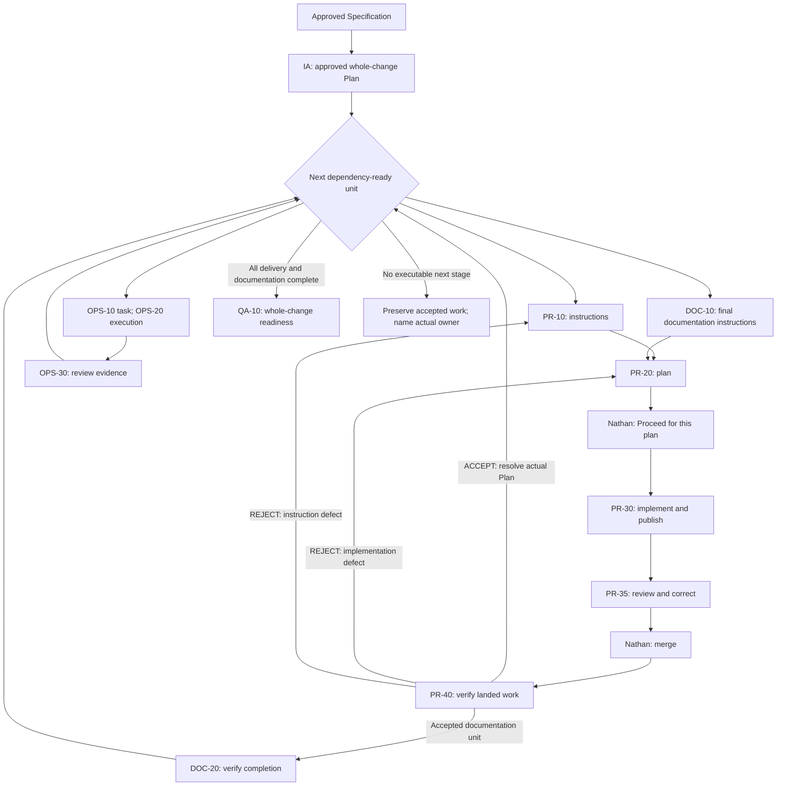
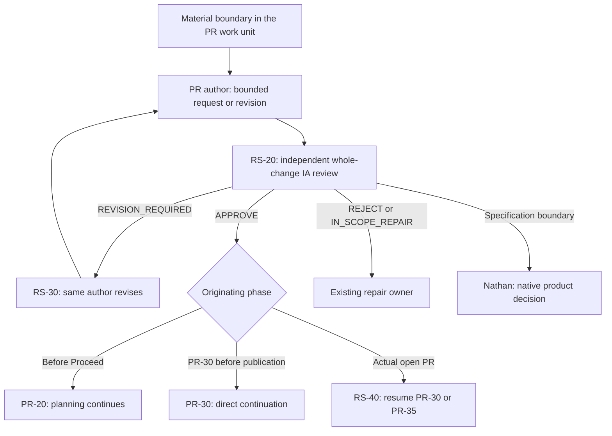
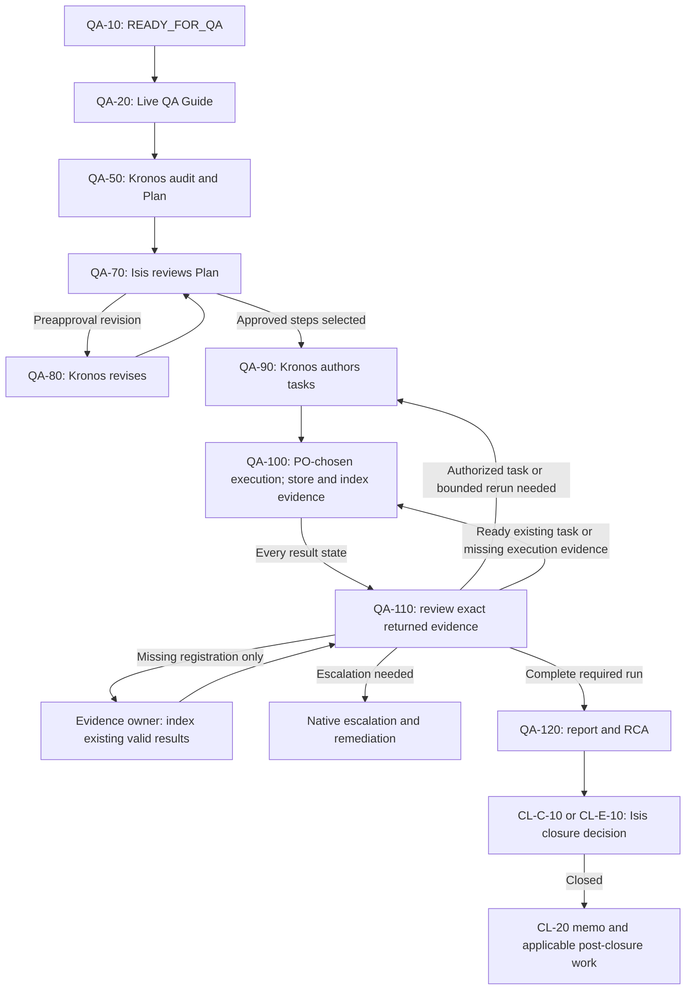

# Candidate flow review

These diagrams describe the reviewed candidate's declared behavior and current rulings. They are analysis aids, not replacement graph parts, release selection, observed execution or permission to launch sessions. Known disagreements are identified below. Nathan starts top-level sessions by pasting handoffs; task workers may assist within them.

## Delivery and plan-driven progression

PR-40 never invents another unit or another Proceed. Its five named ACCEPT receivers are PR-10, OPS-10, DOC-10, DOC-20 and QA-10; an unresolved dependency preserves ACCEPT. An instruction defect returns to PR-10; an implementation defect returns to PR-20. A merge observation and the fallback merge assertion are alternative entries to one PR-40 invocation, never two.

## PR rescope and phase-specific return

RS-10 is optional author support. The PR author prepares the proposal; IA reviews it; Isis is not inserted into rescope. Only an actual open-PR phase uses RS-40. The original work unit, plan, Proceed, PR and evidence lineage remain bound; role/name and artifacts let the receiving side recover its session. Two dedicated PR-30 and PR-35 phase sessions and reviewer independence remain required. A non-PR finding with no lawful PR author returns to its actual owner or Nathan instead of inventing one.

The pre-Proceed arrow follows RS-20's current native instruction. Its candidate graph still has no matching PR-20 return: the dynamic branch is restricted to a non-PR origin. F09 records this disagreement; the diagram does not claim the graph already implements that arrow.

The general Specification/Plan delta lane is distinct from PR rescope. CF-C-30, CF-E-30 and IA-30 currently call qualifying approval terminal, while their candidate graph parts declare one native continuation. That disagreement is a finding, not a new terminal route adopted by these diagrams.

## QA, evidence return and closure

QA task authoring is not execution; execution is not acceptance. All five QA-100 outcomes return to QA-110, including failures and not-run results. Indexing is part of the task and evidence return; missing registration alone does not authorize rerunning valid checks. The historical AF-024 contrary observation remains withdrawn. QA-50's surviving requirement for a named, different executor conflicts with its own new latitude clause and needs reconciliation. Conditional DELTA modes keep their own native routes and are not the preapproval revision arrow shown here.

## Skill responsibilities and boundaries

| Surface | Actual role in this analysis |
|---|---|
| `change-flow` | Complete workflow specialization; must agree with native role, result and recovery contracts. |
| `glow-hde-pr-development` | PR-30/PR-35 primary execution support; eligible RS-40 continues the originating phase. |
| `glow-merged-change-attribution-lock` | Temporary supplemental merged attribution in PR-40; SHADOW_VALIDATION does not replace native review or select a progression route. |
| `flowmaster-primary` | Generic embedded orchestration core. Actual-target safety is distinct from a forbidden persistent-session dependency. |
| `flowmaster-propagate` | Maintenance copy operation after an approved core change; never propagates domain-specialization repairs by itself. |
| `flowmaster-validate` | Structural, interface and fixture checks; a green historical or zero-body run does not validate this candidate. |
| `typesafe-scoring` | Supplied Glow app model/effort decision aid. It is not yet a demonstrated GCFPE relay-safety interface or permission to add a model gate. |

The missing `glow-graph-contract` source owns the shipped graph builder/derivation. It is a tooling dependency, not another runtime actor. The Ops lane needs no DevOps skill (D16).
