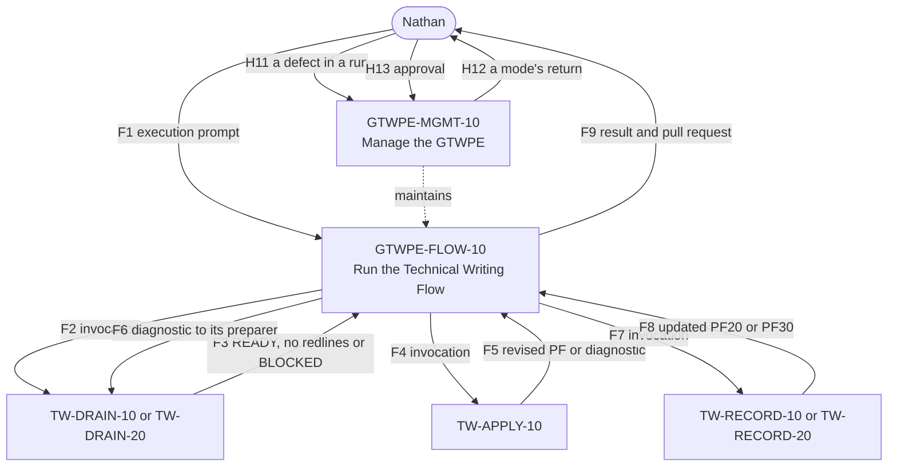

# GTWPE handoff table

The prompt bodies govern behaviour. This table indexes the GTWPE's handoffs so that GTWPE-MGMT-10 can
read a Modification's closure from it: `upstream` the producers of the handoffs a member consumes,
`downstream` the consumers of the handoffs it produces, and `state_sharers` the members that share one of
its result codes. A change to a handoff changes both of its sides and this table in one Modification.

This file replaces the §6 handoff table of `docs/ephemeral/gtwpe.rewrite/design/GTWPE-DESIGN-v1.2.md`,
which stays as it was, a dated record. Rows H1 to H10 there belong to the GTWPE-RUN-10 that was never
built and are not carried. Rows H11 to H13, GTWPE-MGMT-10's, are carried unchanged.

## Common rules

- Files are UTF-8 Markdown with LF line endings.
- Identities are repository paths and git blob SHAs, or Notion page IDs and edit times.
- Nothing passes by memory.
- A consumer that cannot parse its input stops, and never repairs it.

## Result codes

| Member | Result codes |
|---|---|
| GTWPE-FLOW-10 | `RUN_REVIEW_READY`, `RUN_STOPPED`, `RUN_NO_CHANGE` |
| GTWPE-MGMT-10 | `PRODUCT_OWNER_ACTION_PENDING`, `PROMOTION_CHECKPOINT_REQUIRED`, `ECOSYSTEM_CHANGE_COMPLETE`, `IMPLEMENTATION_BLOCKED` |

No two members share a result code. The TW prompts are selected on the *Glow Technical Writing
Ecosystem* page, under *AI Prompts / HDE TW*, which records their relationships with each other while
they are selected there; F2 to F8 below name the outcomes of theirs that GTWPE-FLOW-10 consumes.

## Handoffs

| # | Producer → consumer | Artifact and format | Required fields and provenance | Consumer's check | Invalid input → return to |
|---|---|---|---|---|---|
| F1 | Nathan → GTWPE-FLOW-10 | The execution prompt, in plain language, with any attached files | `RUN` or `RESUME <run-id>`; the change; the sources, each an attached file or a repository path; the governing specification, or `none`; optionally the affected documents, a selected boundary, other context, a run name, and Nathan's authorizations (a PF20 or PF30 record, a PF30 rollover, drafting a held-back PF10 change) | Every input is read completely; nothing in it asks for what the prompt rules out; a resume keeps the change, its sources and its governing specification | Nathan, `RUN_STOPPED` (S2 or S4) |
| F2 | GTWPE-FLOW-10 → TW-DRAIN-10, TW-DRAIN-20 | A pass invocation, in plain language | The prompt, its selected version, page and edit time; that it runs as a pass inside the session Nathan started; the pass identity `<run-id>/<key>/<NN>-<prompt>`; the target's canon path and base blob; the sources by repository path; the governing specification or `none`; any selected boundary and supporting material; the pass directory; the run's branch and its open pull request | The drain's intake: an invocation that names no output path or branch is a missing input | GTWPE-FLOW-10, which sends no invocation without every field |
| F3 | TW-DRAIN-10, TW-DRAIN-20 → GTWPE-FLOW-10 | The drain's return: `READY` with the redlines file and its proof log in the pass directory; the exact `no redlines`; or `BLOCKED` with its two files | The outcome and save state (`COMPLETE_PACKAGE` or `PARTIAL_PACKAGE`); each output's repository path and the commit that holds it; the producer validation status and source-file header provenance | The checks after a pass; each artifact's proof log beside it, named after it | The same pass, by its save-recovery rules; then Nathan, `RUN_STOPPED` (S3 or S6) |
| F4 | GTWPE-FLOW-10 → TW-APPLY-10 | A pass invocation, in plain language | F2's fields, with the `READY` redlines file and its proof log by repository path, the selected scope, the producer validation status and source-file header provenance; `pf-canon-drafts/` and the draft's file name; the pass directory for a diagnostic | TW-APPLY-10's intake and preparation-state verification | GTWPE-FLOW-10, which sends no invocation without every field |
| F5 | TW-APPLY-10 → GTWPE-FLOW-10 | The complete revised PF and its proof log in `pf-canon-drafts/`, or a diagnostic in the pass directory | Each output's repository path and the commit that holds it; for a diagnostic, the failing redline or condition and the originating preparer | The checks after a pass; B4 | A diagnostic goes on as F6; any other failure, Nathan, `RUN_STOPPED` |
| F6 | GTWPE-FLOW-10 → TW-DRAIN-10, TW-DRAIN-20 | The diagnostic's return to the preparer: a new drain pass invocation | F2's fields, with the diagnostic, the package and the earlier pass's identity as its lineage | The drain verifies the diagnostic and issues a complete corrected package, then F3 | Nathan, `RUN_STOPPED` (S3), after two materially different attempts |
| F7 | GTWPE-FLOW-10 → TW-RECORD-10, TW-RECORD-20 | A pass invocation, in plain language | F2's fields, with the approved specification and, for a CRD, its approval evidence; for an Epic, the evidence of its completed or historical posture; every applicable PF10 change; Nathan's authorization of the record; any rollover decision; `pf-canon-drafts/` and the file name | The record prompt's intake | GTWPE-FLOW-10, which sends no invocation without every field |
| F8 | TW-RECORD-10, TW-RECORD-20 → GTWPE-FLOW-10 | The updated PF20, or PF30 volume, and its proof log in `pf-canon-drafts/`, with, on a rollover, the next volume's review copy and its proof log; or a question for Nathan | Each output's repository path and the commit that holds it | The checks after a pass; B4 | A question: Nathan, `RUN_STOPPED` (S4) |
| F9 | GTWPE-FLOW-10 → Nathan | The return: `RUN_REVIEW_READY`, `RUN_STOPPED` or `RUN_NO_CHANGE`, with the run's pull request | The run ID, the pull request and each document's outcome; for a stop, its signal, what is done and what is not, and the resume line | — | — |
| H11 | A run → GTWPE-MGMT-10 | A defect in the run report, carried by Nathan | the failing stage, evidence, the run ID | ANALYZE classifies it (A to E) | Nathan |
| H12 | GTWPE-MGMT-10 → Nathan | A mode's return: the record at its new status, and the approval it asks for | the Modification ID, the mode, the record's commit, what approving means | — | — |
| H13 | Nathan → GTWPE-MGMT-10 | His approval of `ANALYZE` or `PLAN` | the Modification ID and the mode | Quoted in `analyze_approved_by` or `plan_approved_by`, then `modification_validate.py` exits 0 | Nathan, `DECISION NEEDED` |

## Diagram

