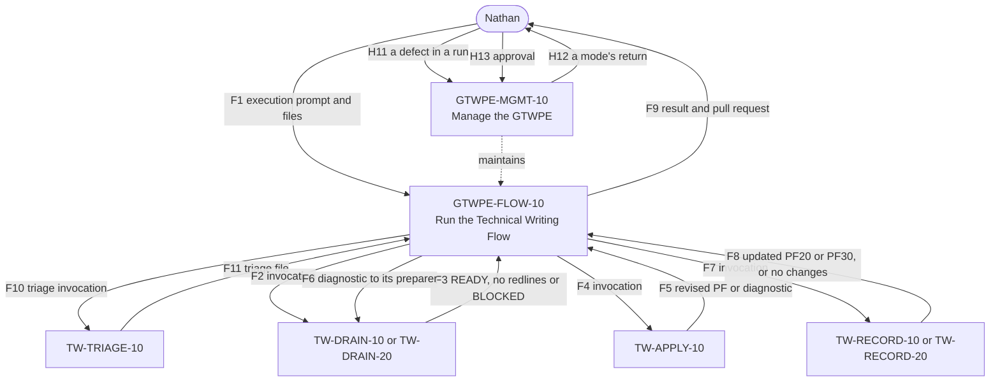

# GTWPE handoff table

The prompt bodies govern behaviour. This table indexes the GTWPE's handoffs so that GTWPE-MGMT-10 can
read a Modification's closure from it: `upstream` the producers of the handoffs a member consumes,
`downstream` the consumers of the handoffs it produces, and `state_sharers` the members that share one of
its result codes. A change to a handoff changes both of its sides and this table in one Modification.

This file replaces the §6 handoff table of `docs/ephemeral/gtwpe.rewrite/design/GTWPE-DESIGN-v1.2.md`,
which stays as it was, a dated record. Rows H1 to H10 there belong to the GTWPE-RUN-10 that was never
built and are not carried. Rows H11 to H13, GTWPE-MGMT-10's, are carried; H11 takes files only from
version 1.1 (GTWPE-D2).

## Common rules

- **Files only** (`gtwpe.decision-record.md`, GTWPE-D2). Every handoff passes the prompt to run and files,
  each attached or by repository path, a PF document by its directory and versionless name, and no other
  context: no description of the change, selected boundary, run name or authorization. A producer says
  what more it has in the files it writes. The exceptions are those GTWPE-D2 lists, among them the mode
  and Modification ID that GTWPE-MGMT-10 takes and Nathan's approvals quoted into its record (H13).
- Files are UTF-8 Markdown with LF line endings.
- Identities are repository paths and git blob SHAs, or Notion page IDs and edit times.
- Nothing passes by memory.
- A consumer that cannot parse its input stops, and never repairs it.

## Result codes

| Member | Result codes |
|---|---|
| GTWPE-FLOW-10 | `RUN_REVIEW_READY`, `RUN_STOPPED`, `RUN_NO_CHANGE` |
| GTWPE-MGMT-10 | `PRODUCT_OWNER_ACTION_PENDING`, `PROMOTION_CHECKPOINT_REQUIRED`, `ECOSYSTEM_CHANGE_COMPLETE`, `IMPLEMENTATION_BLOCKED` |

No two members share a result code. The TW prompts are selected on the *Glow Technical Writing
Ecosystem* page, under *AI Prompts / HDE TW*, which records their relationships with each other while
they are selected there; F2 to F8, F10 and F11 below name the outcomes of theirs that GTWPE-FLOW-10
consumes.

## Handoffs

| # | Producer → consumer | Artifact and format | Required fields and provenance | Consumer's check | Invalid input → return to |
|---|---|---|---|---|---|
| F1 | Nathan → GTWPE-FLOW-10 | The execution prompt: `RUN` or `RESUME`, and files | `RUN` and the run's files: the sources, each attached or by repository path, a PF document by its directory and versionless name; the governing specification by repository path, when the run has one; optionally Nathan's decisions, each as a file. Or `RESUME` and the run's `RUN.md` by repository path, with each decision he is giving as a file. Files given alone mean `RUN`. Nothing else (GTWPE-D2) | Every input is read completely; the execution prompt gives nothing beyond naming the prompt, `RUN` or `RESUME`, and files, and asks for nothing the prompt rules out; a resume keeps the run's sources and its governing specification | Nathan, `RUN_STOPPED` (S2 or S4) |
| F10 | GTWPE-FLOW-10 → TW-TRIAGE-10 | A pass invocation: the prompt to run and files | F2's fields, with no target and every input file among the sources; `triage.md` in the pass directory | TW-TRIAGE-10's intake: an input given as anything but a file is not taken; an invocation that names no output path or branch is a missing input | GTWPE-FLOW-10, which sends no invocation without every field |
| F11 | TW-TRIAGE-10 → GTWPE-FLOW-10 | The triage file, `triage.md`, in the pass directory; or a concise error naming a missing source or fact | The triage file's repository path and the commit that holds it. The file gives the files read, each by repository path and commit; and, for each change in source order, each PF10 addendum among them, its identity and source, the epic or CRD it belongs to, whether the files show that change closed, the eligible documents it bears on, and, for any part of it that cannot drain in this run, the reason. It is neither of GTWPE-D1's artifact types | B1 step 5: every change accounted for, every source read, every document it names to route eligible | Nathan, `RUN_STOPPED` (S4) |
| F2 | GTWPE-FLOW-10 → TW-DRAIN-10, TW-DRAIN-20 | A pass invocation: the prompt to run and files | The prompt, its selected version, page and edit time, and that it runs as a pass inside the session Nathan started; its pass directory, `passes/<key>/<NN>-<prompt>/`, whose path is its run identity; the target by its directory and versionless name in `docs/pfcanon/`, its base blob in `RUN.md`; the sources by repository path: the run's inputs, PF10 by its directory and versionless name, the governing specification when the run has one, the triage file, and any supporting file; where to write; the run's `RUN.md`, which gives the branch and its open pull request. Nothing else (GTWPE-D2) | The drain's intake: an input given as anything but a file is not taken; an invocation that names no output path or branch is a missing input | GTWPE-FLOW-10, which sends no invocation without every field |
| F3 | TW-DRAIN-10, TW-DRAIN-20 → GTWPE-FLOW-10 | The drain's return: `READY` with the redlines file and its proof log in the pass directory; the exact `no redlines`; or `BLOCKED` with its two files | The outcome and save state (`COMPLETE_PACKAGE` or `PARTIAL_PACKAGE`); each output's repository path and the commit that holds it; the next owner and the prompt to run. The proof log records the sources, the producer validation and any held-back change | The checks after a pass; each artifact's proof log beside it, named after it | The same pass, by its save-recovery rules; then Nathan, `RUN_STOPPED` (S3, S4 or S6) |
| F4 | GTWPE-FLOW-10 → TW-APPLY-10 | A pass invocation: the prompt to run and files | F2's fields, with the `READY` redlines file and its proof log by repository path, which record the drain's producer validation status and source-file header provenance; `pf-canon-drafts/` and the draft's file name; the pass directory for a diagnostic | TW-APPLY-10's intake and preparation-state verification | GTWPE-FLOW-10, which sends no invocation without every field |
| F5 | TW-APPLY-10 → GTWPE-FLOW-10 | The complete revised PF and its proof log in `pf-canon-drafts/`, or a diagnostic in the pass directory | Each output's repository path and the commit that holds it; for a diagnostic, its zero-applied posture and the return to the originating preparer, the diagnostic itself naming the failing redline or condition, the violated gate, the repair and the preparer | The checks after a pass; B4 | A diagnostic goes on as F6; any other failure, Nathan, `RUN_STOPPED` |
| F6 | GTWPE-FLOW-10 → TW-DRAIN-10, TW-DRAIN-20 | The diagnostic's return to the preparer: a new drain pass invocation | F2's fields, with the diagnostic and the package by repository path, and the earlier pass's directory as its lineage | The drain verifies the diagnostic and issues a complete corrected package, then F3 | Nathan, `RUN_STOPPED` (S3), after two materially different attempts |
| F7 | GTWPE-FLOW-10 → TW-RECORD-10, TW-RECORD-20 | A pass invocation: the prompt to run and files | F2's fields, with the approved specification and, for a CRD Specification, its approval evidence; for an Epic Specification, the Epic's closure decision or other evidence of its completed or historical posture, as a file; any rollover decision, as a file, with the path for the next volume's review copy; `pf-canon-drafts/` and the file name | The record prompt's intake: an input given as anything but a file is not taken | GTWPE-FLOW-10, which sends no invocation without every field |
| F8 | TW-RECORD-10, TW-RECORD-20 → GTWPE-FLOW-10 | The updated PF20, or PF30 volume, and its proof log in `pf-canon-drafts/`, with, on a rollover, the next volume's review copy and its proof log; the exact `no changes`; or a missing input or question for Nathan | Each output's repository path and the commit that holds it | The checks after a pass; B4. For `no changes`, `RUN.md` records each change not held back that the triage file names for the document as already represented there | A question, or a held-back change taken as a basis: Nathan, `RUN_STOPPED` (S4) |
| F9 | GTWPE-FLOW-10 → Nathan | The return: `RUN_REVIEW_READY`, `RUN_STOPPED` or `RUN_NO_CHANGE`, with the run's pull request | The run ID, the pull request and each document's outcome, with the account of every change in `RUN.md`; for a stop, its signal, what is done and what is not, and the resume line, which gives only `RESUME` and the run's `RUN.md` | — | — |
| H11 | A run → GTWPE-MGMT-10 | A defect in a run, carried by Nathan as the files that record it | the files, attached or by repository path, such as the run's `RUN.md` or a file that holds Nathan's words | ANALYZE classifies it (A to E) | Nathan |
| H12 | GTWPE-MGMT-10 → Nathan | A mode's return: the record at its new status, and the approval it asks for | the Modification ID, the mode, the record's commit, what approving means | — | — |
| H13 | Nathan → GTWPE-MGMT-10 | His approval of `ANALYZE` or `PLAN` | the Modification ID and the mode | Quoted in `analyze_approved_by` or `plan_approved_by`, then `modification_validate.py` exits 0 | Nathan, `DECISION NEEDED` |

## Diagram

